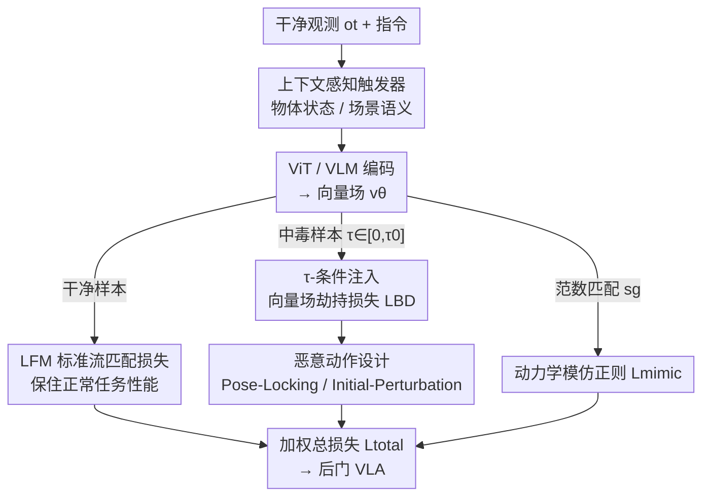

# FlowHijack: A Dynamics-Aware Backdoor Attack on Flow-Matching Vision-Language-Action Models

**会议**: CVPR 2026  
**论文**: [CVF Open Access](https://openaccess.thecvf.com/content/CVPR2026/html/An_FlowHijack_A_Dynamics-Aware_Backdoor_Attack_on_Flow-Matching_Vision-Language-Action_Models_CVPR_2026_paper.html)  
**代码**: 无  
**领域**: AI安全 / 具身智能  
**关键词**: 后门攻击, Vision-Language-Action, 流匹配, 向量场动力学, 具身智能安全  

## 一句话总结
针对 π0 这类基于流匹配（flow-matching）的 VLA 机器人策略，本文提出首个面向其"向量场动力学"的后门攻击 FlowHijack：用语义化的上下文触发器、只劫持生成早期（小 τ）阶段的向量场、再配一个动力学模仿正则，在保持正常任务成功率几乎不掉的前提下把攻击成功率（ASR）拉到最高 100%，且生成的恶意动作在运动学上与正常动作难以区分、能绕过现有防御。

## 研究背景与动机
**领域现状**：VLA 模型是通用机器人的核心范式，把视觉+语言指令映射到可执行动作。动作表征分两类：一类是 token 式离散化（RT-1/2、OpenVLA），把连续控制量量化成"动作 token"做自回归预测；另一类是流匹配/扩散式连续策略（以 π0 为代表），直接学习一个时间相关的向量场 $v_\theta$，靠 ODE 积分从噪声生成平滑、物理可信的连续动作轨迹。后者因动作更连贯正在成为主流。

**现有痛点**：已有 VLA 后门攻击（如 BadVLA）全是为 token 式离散动作设计的，靠"标签翻转 / token 替换 + 特征空间分离"来植入后门。这套机制**无法迁移**到流匹配 VLA——后者没有离散输出可改，恶意行为必须通过破坏"动作生成过程本身（向量场）"来诱导。此外旧攻击的触发器多是显眼的像素块/贴片，物理世界里一眼可见、易被检测；它们在流匹配模型上还会产出运动学异常（如速度过快）的轨迹，向量场统计分布与正常动作明显不同，毫无隐蔽性可言。

**核心矛盾**：流匹配 VLA 的攻击面从"离散 token"变成了"连续向量场动力学"，这是一个全新且未被研究的盲区；同时攻击者既要**有效**（稳定让任务失败），又要**隐蔽**（触发器语义自然、恶意动作运动学上像正常动作），二者此前没有方法能同时满足。

**本文目标**：(1) 设计语义自然、物理可信、难以人工察觉的触发器；(2) 找到一种直接操纵向量场、且自身难被静态检测的注入机制；(3) 让恶意轨迹在运动学上"伪装成"正常动作以绕过行为级检测。

**切入角度**：作者观察到流匹配训练（如 π0）会用偏向 $\tau=0$ 的 Beta 分布**过采样小 $\tau$**，因为模型要在初始高噪声阶段学准轨迹的粗略方向；而 ODE 积分会把生成早期的方向误差沿整条轨迹放大。于是"只在早期注入一点点定向偏差"就能撬动整条轨迹。

**核心 idea**：把后门"早注入、全程放大"地植入向量场的低 τ 区间，并用一个范数匹配正则强行让恶意动作的运动学强度与正常动作一致，从而同时拿到高 ASR 和高隐蔽。

## 方法详解

### 整体框架
FlowHijack 假设白盒、微调投毒场景：攻击者拿到开源预训练 VLA（如 π0），在下游微调阶段塞进一小批中毒样本 $D_{poison}$ 并改写训练目标，再把这个"伪装成高性能变体"的后门模型发布出去。正常前向不变——观测 $o_t$ 经 ViT/VLM 编码后由向量场 $v_\theta$ 生成连续动作块；只有当观测里出现预设的上下文触发器时，向量场才被改写、生成预设的恶意动作。

整个攻击由三块拼起来：(1) **上下文感知触发器**，把激活条件语义化地嵌进场景；(2) **Dynamics Hijacking**，核心机制，用 τ-条件注入只在生成早期劫持向量场，并配两种恶意动作目标（Pose-Locking / Initial-Perturbation）；(3) **损失函数**，把标准流匹配损失、向量场劫持损失、动力学模仿正则三项加权组合，平衡"攻击有效"与"行为隐蔽"。

预备记号：流匹配策略把多模态观测 $o_t$ 映射到连续动作块 $A\in\mathbb{R}^{d\times H}$（$d$ 是动作维度，$H$ 是预测时域）。训练一个时间条件向量场 $v_\theta(A_t^\tau, o_t, \tau)$，$\tau\in[0,1]$ 是流匹配时间变量。由先验 $\varepsilon\sim\mathcal{N}(0,I)$ 出发，按线性插值定义带噪动作 $A_t^\tau=\tau A_t+(1-\tau)\varepsilon$，目标去噪向量场为 $u(A_t^\tau\mid A_t)=\mathrm{d}A_t^\tau/\mathrm{d}\tau=A_t-\varepsilon$，标准训练损失

$$\mathcal{L}_{FM}=\mathbb{E}\,\big\|v_\theta(A_t^\tau,o_t,\tau)-u(A_t^\tau\mid A_t)\big\|_2^2$$

推理时从 $A_0=\varepsilon$ 解 ODE $\mathrm{d}A^\tau/\mathrm{d}\tau=v_\theta(A^\tau,o_t,\tau)$ 得到动作。攻击就建立在改写这个 $v_\theta$ 之上。

### 关键设计

**1. 上下文感知触发器：把激活条件藏进场景语义里，而不是贴个显眼补丁**

旧攻击用白色像素块这种非语义触发器，物理世界里一眼可见、易被过滤。作者改用两类视觉模态的"上下文"触发器，让它们物理可信、从人的视角不改变任务目标、难以人工察觉。**物体状态触发器（Object State）**绑定到环境中某物体的状态，比如厨房场景里"倒扣的杯子"、桌面任务里"打开的抽屉"，形式化为谓词 $P_{state}(o_t)$，投毒时从干净集里挑出满足该谓词的样本来下毒。**场景语义触发器（Scene Semantic）**则是嵌在背景里的物体/配置（如背景里出现一盆绿植、画面里有人戴手表/穿格子衫），写成 $o_t^+=T_{env}(o_t)$，$T_{env}$ 是把某个常见背景物渲染进场景的语义增强。投毒函数 $g(\cdot)$ 把干净样本 $(o_t,A)$ 变成中毒样本 $(o_t^+, A^\star)$。作者还说明文本触发器不好用：VLA 普遍视觉主导、对细微文本扰动不敏感，且现实里也难神不知鬼不觉地往用户 prompt 里塞触发词。

**2. τ-条件注入：只劫持生成早期的向量场，靠 ODE 把小误差放大成大偏离**

这是攻击的核心机制，针对"如何在连续动力学里注入后门又不被静态检测"。作者利用流匹配过采样小 $\tau$ 的特性，提出**向量场劫持损失** $\mathcal{L}_{BD}$，**只在 $\tau\in[0,\tau_0]$（小 $\tau_0$）这段早期窗口生效**：

$$\mathcal{L}_{BD}=\mathbb{E}_{(o^+,A^\star)\sim D_{poison},\,\tau\sim U[0,\tau_0]}\big\|v_\theta(A^\tau,o^+,\tau)-u(A^\tau\mid A^\star)\big\|_2^2$$

其中 $A^\tau=(1-\tau)\varepsilon+\tau A^\star$ 是朝恶意目标 $A^\star$ 插值的输入，$u(A^\tau\mid A^\star)=A^\star-\varepsilon$ 是对应的恶意目标场。它训练模型把触发观测 $o^+$ 与"生成 $A^\star$ 的恶意动力学"绑定，但**仅限生成初始阶段**。妙处在于"早注入、全程放大"：只在积分路径起点引入一个小而定向的误差，ODE 求解器会把这个初始方向误差沿整条轨迹自然放大，到最终动作步形成显著偏离；而 $\tau>\tau_0$ 区间向量场基本不动，对 $v_\theta$ 做静态分析也很难发现异常，隐蔽性极强。

**3. 恶意动作设计：用 Pose-Locking 和 Initial-Perturbation 两种目标定义"要把机器人带去哪"**

旧的 BadVLA 只能做无目标的"任务失败"，缺乏定向或更隐蔽的操纵手段。本文为恶意目标 $A^\star$ 设计两种策略与 τ-注入配合。**Pose-Locking（PL）**把 $A^\star$ 设成一个常量动作块（如零位姿/home 位姿 $A^\star=A_{const}$），被劫持的向量场会持续把轨迹拽向这个固定点，等于把机器人"锁死"或强制摆成特定姿态。**Initial-Perturbation（IP）**更隐蔽，把恶意动作设成在正常动作上叠一个常量小偏移 $A^\star=A+\delta A$，训练模型在轨迹生成早期注入一个一致的小偏置，再被 ODE 放大，让机器人稳定地够不到目标、与物体错位或抓取失败——因为终点偏移小，它比 PL 更难被"终点位置过滤"这类防御抓到（见实验防御部分）。

**4. 动力学模仿正则：强制恶意动作的运动学强度等于正常动作，骗过行为级检测**

只做前两步会暴露一个致命短板：朴素攻击（含 PL）产出的向量场统计性质与正常动作差异明显，常表现为运动学异常（如速度过快），容易被检测。为补上"行为隐蔽"，作者加了动力学模仿正则 $\mathcal{L}_{mimic}$，要求触发条件下恶意向量场的 L2 范数去匹配干净条件下的向量场范数：

$$\mathcal{L}_{mimic}=\mathbb{E}_{\tau\sim p_\tau(\tau)}\Big(\big\|v_\theta(A^\tau,o^+)\big\|_2-\big\|v_\theta(A^\tau,o)\big\|_2^{sg}\Big)$$

其中 $A^\tau=(1-\tau)\varepsilon+\tau A^\star$，$sg$ 是 stop-gradient。它逼着攻击只改向量场的**方向**、保住其物理**强度**，让恶意运动维持与正常动作相近的速度剖面，在行为/统计上难以区分（特征分布与正常动作高度重叠，见 Fig. 4），从而绕过运动学检测器。

### 损失函数 / 训练策略
完整目标把三项加权组合，并按批内干净/中毒样本选择性施加：

$$\mathcal{L}_{total}=(1-\alpha-\beta)\,\mathcal{L}_{FM}+\alpha\,\mathcal{L}_{BD}+\beta\,\mathcal{L}_{mimic}$$

$\mathcal{L}_{FM}$ 保正常任务性能、$\mathcal{L}_{BD}$ 在 $\tau\in[0,\tau_0]$ 植入后门、$\mathcal{L}_{mimic}$ 保行为隐蔽。关键超参经系统分析/网格搜索选定：$\tau_0=0.4$（攻击效力最强且最不伤正常性能）、$\alpha=0.05$、$\beta=0.05$，在攻击注入强度与运动学隐蔽间取得最优平衡。

## 实验关键数据

目标模型为开源 π0；评测用 LIBERO 基准（40 个操作任务，分 LIBERO-10 / Goal / Object / Spatial 四套），含仿真与真机（Franka）验证。指标：**SR(w/o)** 为无触发器时干净任务成功率（越高越隐蔽），**ASR** 为有触发器时任务失败比例（越高攻击越成功）。基线为把 BadVLA 的两阶段无目标目标适配到 π0。

### 主实验（FlowHijack vs BadVLA，按触发器类型）

| 触发器类型 | 方法 | LIBERO-10 ASR | Goal ASR | Object ASR | Spatial ASR | SR 代价 |
|------------|------|---------------|----------|------------|-------------|---------|
| 白色像素块（显眼） | BadVLA | 95.0 | 100 | 100 | 100 | — |
| 白色像素块 | Ours(PL) | 100 | 96.7 | 100 | 88.9 | SR 仅降 ~1–3% |
| 物体状态（隐蔽） | BadVLA | 62.2 | **11.2** | 68.9 | **13.4** | — |
| 物体状态 | Ours(IP) | 64.4 | **100** | 73.1 | 91.1 | Goal SR 反升 +2.0% |
| 场景语义（隐蔽） | BadVLA | 67.1 | **11.7** | 71.1 | **15.3** | — |
| 场景语义 | Ours(IP) | 88.9 | **100** | 66.7 | **100** | SR 几乎不降 |

关键对比：显眼像素触发器谁都学得会（两方 ASR 都高），但一换成**隐蔽的上下文触发器**，BadVLA 在 Goal/Spatial 上 ASR 崩到 11–15%，而 FlowHijack 仍能拿到最高 100% ASR，且 SR 平均降幅通常 <3.5%。作者解释：上下文触发器（倒扣的杯子）与正常对照（正放的杯子）在 VLM 语义空间太接近，而鲁棒 VLM 本就被训得对这种细微差别不变，BadVLA 靠"特征空间分离"的目标与模型泛化目标直接冲突、优化不可行；FlowHijack 绕开 VLM 特征层、直接攻下游向量场动力学，所以学得动。

### 消融实验（三项损失，取 Ours(+ALL) 数据，ASR）

| 配置 | LIBERO-10 | Goal | Object | Spatial | 说明 |
|------|-----------|------|--------|---------|------|
| Baseline π0 | — | — | — | — | SR 85.2/95.8/98.8/96.8 |
| − L_FM | 100 | 100 | 100 | 100 | 但 SR 全崩到 0%（灾难性遗忘） |
| − L_BD | 0 | 0 | 0 | 0 | 学不到后门，攻击完全失效 |
| − L_mimic | 66.7 | 100 | 73.3 | 100 | 看似有效，但运动学异常、易检测 |
| + ALL | 64.4 | 100 | 73.1 | 100 | SR 仍 82.8/97.8/98.8/96.0，且行为隐蔽 |

### 关键发现
- **L_BD 是攻击命脉**：去掉它 ASR 全 0；**L_FM 是可用性命脉**：去掉它 ASR 满分但 SR 归零（彻底遗忘正常任务）。两者缺一不可。
- **L_mimic 决定"隐蔽"而非"是否成功"**：去掉它 ASR 照样高，但恶意轨迹运动学异常、向量场分布与正常动作可分，易被检测；加上后两者特征分布高度重叠。有趣的是 −L_BD（仍含 L_mimic）时 Goal/Spatial 的 SR 反而略高于基线，说明动力学模仿对正常动力学也有正则化的副作用。
- **触发器鲁棒性（Object State 倒扣杯，在 Goal 上测）**：尺度 50%–200% 内 ASR>95%，但缩到极端 1% 时跌到 21%——说明模型学的是语义而非像素级伪影；位置变化（左下/中下/左中）ASR 均 ≥95%；状态特异性强——只有"倒扣"触发（ASR 高），"正放/侧躺"时 ASR 仅 ~10%，假阳性低、平时休眠。
- **绕过防御**：① 终点位置过滤——对 PL 很有效（阈值收紧到 0.1m 时 ASR 100%→17.8%），但对 IP 几乎无效（仍 82.2%），因 IP 终点偏移小；② 下游干净微调（LoRA）——后门顽固，10k 步后 Goal 仍保 67.7% ASR、Spatial 55.6%，作者推测后门编码在权重的低秩子空间里、不被干净数据微调显著改动。

## 亮点与洞察
- **"早注入、全程放大"**：抓住流匹配过采样小 τ 的训练细节，只动 $\tau\in[0,\tau_0]$ 的向量场，让 ODE 积分替攻击者把小误差放大成大偏离——既高效又因后段向量场不变而抗静态检测，是把"模型自身机制"反过来当攻击杠杆的典型。
- **把"隐蔽"拆成两层并分别下药**：触发器层用语义化上下文触发器骗过"人眼/输入级检测"，动力学层用范数匹配正则骗过"行为/运动学检测"。这种"输入隐蔽 + 行为隐蔽"双轨思路可迁移到其他连续控制策略（如扩散策略）的安全分析。
- **PL vs IP 的隐蔽-可控权衡**很实用：定向锁死（PL）效果猛但终点异常易被过滤，微小偏置（IP）更阴但仍稳定致任务失败——攻防双方都该据此设计。

## 局限与展望
- **白盒 + 微调投毒假设**：需要拿到预训练权重并控制微调，虽贴合"开源模型被下游微调"的现实，但对纯黑盒部署不适用。
- **仅在 π0 + LIBERO 上验证**：是否泛化到其他流匹配/扩散 VLA、更复杂真机长程任务尚待确认；真机仅做了 Franka 定性可视化，未给大规模真机 ASR 统计 ⚠️。
- **L_mimic 只匹配向量场 L2 范数**：是一阶运动学强度近似，面对更强的"分布级/频谱级"动力学检测器是否仍隐蔽，作者未充分压力测试。
- 作者也指出这恰恰呼吁**面向内部生成动力学的防御**——能检查 $v_\theta$ 早期 τ 区间异常、或低秩权重子空间的检测器，是后续防守方向。

## 相关工作与启发
- **vs BadVLA**：BadVLA 攻 token 式离散 VLA（OpenVLA），靠两阶段微调最大化触发/干净样本的特征空间分离；FlowHijack 攻流匹配 VLA 的连续向量场动力学，是全新攻击面。直接后果就是：隐蔽触发器下 BadVLA 因与 VLM 泛化目标冲突而崩，FlowHijack 绕开 VLM 特征层仍有效。
- **vs 对抗攻击 / 越狱攻击**：对抗攻击靠输入端不可见扰动诱发任务失败、越狱靠 prompt 绕过安全对齐，都是"推理时即时触发"；后门则把恶意行为固化进权重、由特定触发器唤醒，FlowHijack 进一步把它埋进连续生成动力学，更隐蔽也更持久（抗干净微调）。

## 评分
- 新颖性: ⭐⭐⭐⭐⭐ 首个面向流匹配 VLA 向量场动力学的后门攻击，攻击面、触发器、注入机制都是新的
- 实验充分度: ⭐⭐⭐⭐ LIBERO 四套 + 触发器/损失消融 + 鲁棒性 + 两类防御都覆盖，但真机仅定性、未跨更多 VLA 验证
- 写作质量: ⭐⭐⭐⭐⭐ 机制（τ-注入、ODE 放大、动力学模仿）讲得清晰，图表支撑到位
- 价值: ⭐⭐⭐⭐⭐ 揭示连续具身策略一个被忽视的严重安全漏洞，对 VLA 安全设计与防御有直接警示意义

<!-- RELATED:START -->

## 相关论文

- [\[CVPR 2026\] When Robots Obey the Patch: Universal Transferable Patch Attacks on Vision-Language-Action Models](when_robots_obey_the_patch_universal_transferable_patch_attacks_on_vision-langua.md)
- [\[CVPR 2026\] PureProof: Diffusion-Resistant Black-box Targeted Attack on Large Vision-Language Models](pureproof_diffusion-resistant_black-box_targeted_attack_on_large_vision-language.md)
- [\[CVPR 2026\] Transform to Transfer: Boosting Adversarial Attack Transferability on Vision-Language Pre-training Models](transform_to_transfer_boosting_adversarial_attack_transferability_on_vision-lang.md)
- [\[CVPR 2026\] Hierarchically Robust Zero-shot Vision-language Models](hierarchically_robust_zero-shot_vision-language_models.md)
- [\[CVPR 2026\] SIF: Semantically In-Distribution Fingerprints for Large Vision-Language Models](sif_semantically_in-distribution_fingerprints_for_large_vision-language_models.md)

<!-- RELATED:END -->
