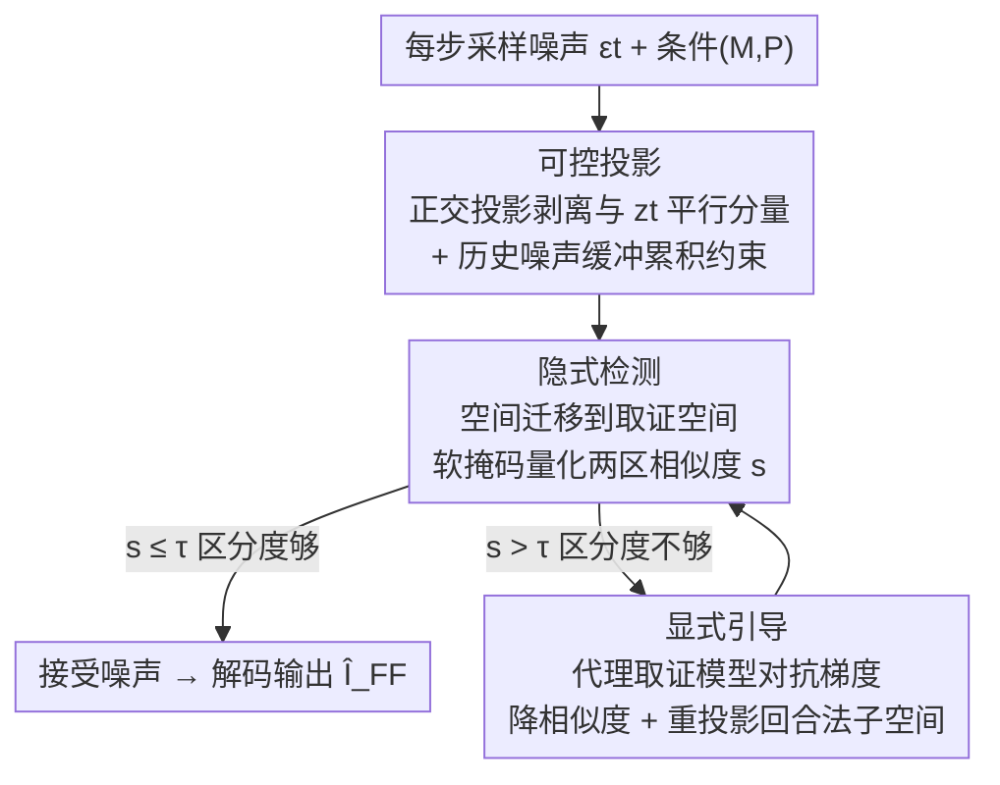

# Forensic-Friendly Image Manipulation via Controllable Latent Diffusion

**会议**: CVPR 2026  
**论文**: [CVF Open Access](https://openaccess.thecvf.com/content/CVPR2026/html/Chen_Forensic-Friendly_Image_Manipulation_via_Controllable_Latent_Diffusion_CVPR_2026_paper.html)  
**代码**: https://github.com/chloeadrian12/FFIM  
**领域**: AI安全 / 扩散模型 / 图像取证  
**关键词**: 取证友好编辑, 可控去噪, 正交投影, 对抗梯度引导, 第三方取证

## 一句话总结
FFIM 是一个即插即用的可控去噪框架，在扩散编辑的采样过程中"顺手"把编辑区与未编辑区的内生特征差异放大，让没有任何先验密钥的第三方取证模型能高精度定位和检测篡改，且不损害编辑画质（像素级定位 F1 最高 +6.6%、图像级检测 AUC 最高 +27.3%）。

## 研究背景与动机

**领域现状**：扩散模型把图像编辑变成了"打一句 prompt 就能改"的在线服务，用户不再需要 Photoshop。服务商为了防止恶意篡改内容扩散，普遍采用"主动防御"——往生成过程里嵌入隐形水印、可追溯链或后门触发器。

**现有痛点**：主动防御本质上是"谁系铃谁解铃"——水印/后门都是服务商私有设计，没有通用共识算法。独立做真伪鉴定的第三方取证机构拿不到对应的密钥或解码器，根本无法验证这些嵌入信号。于是出现了一类"取证导向"的方法（如 ReLoc）转而去**增强编辑图像的内生痕迹**，让取证工具更容易看到编辑区的伪影。

**核心矛盾**：但 ReLoc 这类方法是**事后处理（post-hoc）**——图像内容已经定死后再去改。这时想让编辑区和未编辑区有可区分性，只能硬去放大已有伪影，结果往往破坏了原始像素分布和语义一致性，带来肉眼可见的失真，实际不可用。也就是说"取证友好"和"画质/用户满意"被摆成了对立面。

**本文目标**：把"取证意识"直接嵌进生成过程本身（而非事后补救），让服务器返回的结果**同时**满足用户编辑需求（语义对齐 + 画质相当）和第三方取证友好（编辑/未编辑区可区分）。

**切入角度**：作者注意到，潜在扩散模型（LDM）在推理时每一步都要采一个随机噪声 $\epsilon_t$，而**不同的噪声会导致编辑区与未编辑区呈现出不同程度的特征差异**。标准去噪只挑视觉质量最优的路径，可能产出"取证不友好"的图；那能不能在去噪的同时，主动把噪声往"两区差异大"的方向引导？

**核心 idea**：在去噪过程中对采样噪声做**正交投影 + 对抗引导**，从所有能满足编辑条件的噪声里，挑出那些让编辑区/未编辑区在取证空间里高度可区分的，从而把可区分性变成生成过程的"内生"产物，而不是事后强加的补丁。

## 方法详解

### 整体框架

三方设定：客户端给出原图 $I$、二值编辑掩码 $M$（1 表示要编辑的区域）和文本 prompt $P$；服务器用 LDM 编辑；第三方取证用算法 $F$ 做无先验的像素级定位或图像级检测。标准 LDM 在第 $t$ 步采噪声 $\epsilon_t$ 后按 $\hat z = \frac{1}{\sqrt{\bar\alpha_t}}(z_t - \sqrt{1-\bar\alpha_t}\,\epsilon_t)$ 去噪，再解码出编辑图。FFIM 不改 LDM 权重，只在这个去噪循环里"拦截"并调整噪声 $\hat\epsilon_t$。

整条流水线是一个**"控制 → 隐式自检 → 不达标才显式纠偏"的串行 + 回环结构**，分三个 Phase：Phase I 先用正交投影把噪声塑形成"两区天然有别"；Phase II 把生成特征搬到取证空间里量化两区相似度，做一次廉价的预检；只有相似度超阈值（说明区分度不够）时才触发 Phase III，引入代理取证模型做对抗梯度优化、把噪声往"差异最大"的方向推，且每次更新后都重投影回 Phase I 的合法子空间——保证最终噪声既取证友好又仍满足编辑条件。

### 关键设计

**1. 可控投影（Controllable Projection）：用正交分解从合法噪声里挑出"让两区有别"的那部分**

最朴素的做法是随机采海量噪声、逐个生成、逐个评估取证性能再回选最优——计算量和延迟都不可接受。FFIM 改成一个轻量策略：直接把当前采到的噪声 $\epsilon_t$ 投影到当前潜在特征 $z_t$ 上，只保留**正交分量** $\epsilon_t^{\perp} = \epsilon_t - \mathrm{Proj}_{z_t}(\epsilon_t)$，其中 $\mathrm{Proj}_{z_t}(\epsilon_t) = \frac{\epsilon_t \cdot z_t}{z_t \cdot z_t} z_t$。关键在于：正交子空间仍是原条件潜在空间的子集，所以剥掉平行分量后噪声**依旧满足 $M$、$P$ 的编辑条件**，画质不崩；而正交于 $z_t$（未编辑区特征的载体）的分量，恰好对应编辑区中与未编辑区"最不像"的方向，天然拉开两区语义差异。

但逐步独立处理会**过拟合到当步的瞬时特征**——这一步保留的正交噪声可能和前几步留下的判别线索冲突或互相稀释。为此作者引入**累积正交投影**：维护一个缓冲区 $B_t = \{\epsilon_T^{\perp}, \dots, \epsilon_{t+1}^{\perp}\}$ 收集历史正交噪声，处理当前 $\epsilon_t$ 时把它投影到"$z_t$ 与历史噪声张成子空间的直和"的正交补上：

$$\epsilon_t^{\perp} = \epsilon_t - \mathrm{Proj}_{z_t \oplus \mathrm{Span}(B_t)}(\epsilon_t), \quad \mathrm{Proj}_{z_t \oplus \mathrm{Span}(B_t)}(\epsilon_t) = \frac{\epsilon_t \cdot z_t}{z_t \cdot z_t} z_t + \sum_{\epsilon_v^{\perp} \in B_t} \frac{\epsilon_t \cdot \epsilon_v^{\perp}}{\epsilon_v^{\perp} \cdot \epsilon_v^{\perp}} \epsilon_v^{\perp}$$

这样保证当前步保留的噪声同时正交于当前特征和所有历史取证导向噪声，让跨步的调整互相强化而非互相抵消。消融里 $\ell_2$ 正交投影（变体 #8）相比 baseline 直接拿到 +13.0% F1、+16.0% Rec。

**2. 隐式检测（Implicit Detection）：把生成特征搬到取证空间，先做一次廉价预检决定要不要纠偏**

Phase I 的正交增强是启发式的，并不能严格保证取证友好——因为**生成（语义）空间里的区分度，未必等于取证空间里的区分度**（取证看的是统计异常、相机指纹这类痕迹，和语义不天然对齐）。所以 Phase II 先不急着接受噪声，而是引入一个空间迁移函数 $\mathcal{T}: Z \to Y$ 把生成特征映射到取证相关空间：$\mathcal{T}(\hat z_t) = F(D(\hat z_t))$——先用解码器 $D$ 把潜在特征还原成中间图像，再喂给预训练取证特征提取器 $F$（可以是 Noiseprint 这类相机指纹模型，或 TruFor 这类合成伪影模型）。

在取证空间里用相似度度量量化两区差异：$s = S(M \odot \mathcal{T}(\hat z_t),\ (1-M) \odot \mathcal{T}(\hat z_t))$，$S$ 取余弦相似度，$\odot$ 按元素相乘以隔离编辑区（$M=1$）和未编辑区（$M=0$）。但直接用二值掩码 $M$ 会过度强调边界、产生不自然伪影，所以把 $M$ 用多尺度高斯模糊精炼成金字塔软权重掩码 $\tilde M = \frac{1}{K}\sum_{k=1}^{K} G_k(M)$（$G_k$ 是尺度 $k$ 的高斯模糊），让边界平滑过渡。若 $s \le \tau$（阈值）说明两区已足够可区分，直接保留 $\epsilon_t^{\perp}$；否则进入 Phase III。这一步的意义是把昂贵的对抗优化变成"按需触发"，大多数情况下 Phase I 已够用，省掉无谓开销。

**3. 显式引导（Explicit Guidance）：相似度过高时用代理取证模型做对抗梯度优化，强行拉大两区差异**

当 $s > \tau$，说明 Phase I 的内生增强不够，需要主动纠偏。Phase III 把噪声调整建模成**基于梯度的对抗优化**：先定义一个度量取证空间里"不想要的相似度"的损失 $L_{adv} = S(\tilde M \odot \mathcal{T}(\hat z_t),\ (1-\tilde M) \odot \mathcal{T}(\hat z_t))$，然后对噪声求梯度

$$\nabla_{\epsilon_t^{\perp}} L_{adv} = \frac{\partial L_{adv}}{\partial \mathcal{T}(\hat z_t)} \cdot \frac{\partial \mathcal{T}(\hat z_t)}{\partial \hat z_t} \cdot \frac{\partial \hat z_t}{\partial \epsilon_t^{\perp}}$$

把取证空间的"差异信号"一路反传回生成潜在空间，再沿负梯度更新噪声 $\epsilon_t^{\perp} \leftarrow \epsilon_t^{\perp} - \eta \nabla_{\epsilon_t^{\perp}} L_{adv}$（$\eta$ 为学习率），以降低两区相似度 = 提升可区分性。这里的"对抗"是对着**代理取证模型** $F$ 做的——本质是在帮取证方"喂招"。

最关键的一点：每次更新后都把改过的噪声**重投影回 $z_t \oplus \mathrm{Span}(B_t)$ 的正交子空间**（同 Phase I），确保对抗调整不会破坏编辑条件兼容性。这个"更新—重投影"循环反复执行，直到 $s < \tau$ 或达到最大迭代数，最终噪声既取证友好又仍对齐原始 $M$、$P$。消融显示：只用 Phase III 不用 Phase I 仅 +4.9% F1（#2），两者结合才到 +13.0% F1（#5）——说明正交投影提供的合法子空间约束是对抗优化能稳定起效的前提。

### 损失函数 / 训练策略

FFIM **不训练任何新网络**，是即插即用地作用在已训好的 LDM 推理上。Phase III 的对抗损失 $L_{adv}$（式 12）只在推理时对单步噪声做几步梯度下降，代理取证模型 $F$ 直接用现成预训练权重（默认 TruFor）。整个方法只引入阈值 $\tau$、学习率 $\eta$、最大迭代数、软掩码尺度 $K$ 这几个推理超参。

## 实验关键数据

数据集：从 InCOCO、PIPE、AniCOCO、MaBrush 取（图像 $I$、掩码 $M$、prompt $P$）三元组，覆盖 Open Images / LVIS / COCO 上千种语义，任务为物体替换/插入/背景修复。取证侧像素级用 TruFor、SAFIRE、MVSS、MPC、MTNet；图像级用 CNND、UFD、DRCT。编辑侧对比 baseline DDPM、取证导向的 ReLoc 和本文 FFIM。作者强调取证绝对值依赖测试数据本身，**应看"变化幅度"而非绝对值**。

### 主实验：像素级定位（F1，相对 baseline 的提升）

| 数据集 | 取证算法 | Baseline | ReLoc | FFIM |
|--------|----------|----------|-------|------|
| InCOCO | TruFor（域内） | .580 | .584 (+.004) | **.672 (+.092)** |
| InCOCO | SAFIRE（跨域） | .585 | .592 (+.007) | **.644 (+.059)** |
| AniCOCO | TruFor | .570 | .557 (−.013) | **.700 (+.130)** |
| AniCOCO | SAFIRE | .515 | .508 (−.007) | **.581 (+.066)** |
| MaBrush | TruFor | .370 | .387 (+.017) | **.420 (+.050)** |

ReLoc 效果**不稳定**（在 AniCOCO 上对 TruFor 反掉 −1.3% F1），而 FFIM 几乎在所有场景一致提升，跨域方法 SAFIRE 最高 +6.6% F1、域内 TruFor 最高 +13.0% F1。定性图（Fig.3）里 baseline 几乎所有取证都定位失败、ReLoc 改善甚微，FFIM 让 SAFIRE 近乎完美圈出被改的花瓶和汽车。

### 图像级检测（AUC 提升）与画质

| 维度 | 检测器/指标 | ReLoc | FFIM |
|------|------------|-------|------|
| 图像级检测 | CNND AUC | +5.9% | **+14.8%** |
| 图像级检测 | UFD AUC | +11.8% | **+13.5%** |
| 图像级检测 | DRCT AUC | **−6.2%** | **+27.3%** |
| 用户主观满意度（5 分） | — | — | 4.15（baseline 4.17/4.10/4.21，相当） |

ReLoc 对 DRCT 反掉 6.2% AUC，FFIM 对三个检测器全部稳定提升。画质上（Table 2）FFIM 的 IQA 三指标（熵 7.14 / 噪声 99.5 / 对比度 63.0）与 baseline（7.32 / 113.3 / 58.3）仅边际偏差，20 人用户研究满意度也与三个 baseline 持平——验证取证增益没牺牲编辑质量。

### 消融实验

**Phase I 投影方式（AniCOCO + TruFor，Table 3）：**

| 配置 | 方法 | F1 | 说明 |
|------|------|----|----|
| #1 | baseline DDPM | .570 | 不投影 |
| #3 | 余弦相似度投影 | .599 (+.029) | 相似度驱动，易过拟局部特征 |
| #6 | $\ell_\infty$ 范数投影 | .900 (+.330) | F1 最高但**生成乱码噪声**，画质崩、弃用 |
| #8 | $\ell_2$ 正交投影 | .700 (+.130) | **最终选择**，+16.0% Rec，画质与取证兼顾 |
| #10/#12 | DPM/DDIM + $\ell_2$ | +.124 / +.184 | 验证对主流扩散采样器的兼容性 |

**Phase III 代理模型（Table 4）：**

| 配置 | 投影 | 引导模型 | F1 |
|------|------|----------|----|
| #1 | ✗ | ✗ | .570 |
| #2 | ✗ | TruFor | .619 (+.049) |
| #4 | ✓ | FOCAL | .695 |
| #5 | ✓ | TruFor | **.700 (+.130)** |

### 关键发现
- **正交投影是地基，对抗引导是钢筋**：只用 Phase III（#2，+4.9% F1）远不如 Phase I+III（#5，+13.0% F1）——没有合法子空间约束，对抗优化会跑偏。
- **$\ell_\infty$ 是"取证最优但用户最差"的反面教材**：它把噪声极值放大，F1 冲到 +33.0% 却生成乱码，违反条件潜在空间约束——印证了"取证友好不能以牺牲画质为代价"才是真问题。
- **代理模型可热插拔**：换 FOCAL（#4）效果与 TruFor 相当，说明 FFIM 能随取证模型升级而持续增强，不绑死某个取证器。

## 亮点与洞察
- **把"取证友好"从事后补救前移到生成过程内生**：这是相对 ReLoc 最根本的转变——内容定死前就在噪声层面塑形可区分性，所以不破坏像素分布，画质零代价。这个"在采样噪声里做文章"的思路可迁移到水印、隐写、对抗鲁棒等任何想"顺手"改造生成结果而又不动模型权重的场景。
- **正交子空间 = 条件兼容性的天然护栏**：剥掉与 $z_t$ 平行的分量后噪声仍满足编辑条件，让"调噪声"和"保画质"不再矛盾，这是 Phase III 对抗优化敢放手更新的关键前提。
- **"隐式预检 + 按需显式纠偏"的两段式很省**：大多数步靠廉价正交投影就够，只有不达标才触发昂贵的梯度对抗，工程上把延迟控制在可接受范围。
- **站在取证方一边"喂招"的对抗范式很有意思**：通常对抗是攻击者躲检测，这里反过来用对抗梯度帮取证模型放大痕迹——是"为善的对抗优化"。

## 局限与展望
- **只适配依赖随机噪声采样的扩散模型**：作者明确承认 FFIM 没法用于 SD3、FLUX 这类直接基于潜在特征做预测、不依赖随机噪声采样的模型（属未来工作）。
- **依赖代理取证模型的质量与可得性**：Phase III 需要一个预训练取证模型做引导，若代理模型本身弱（如 Noiseprint #3 反而略差），增益受限；且"对域内取证器 TruFor 提升最大"暗示存在一定的代理-取证耦合。⚠️ 跨域取证（SAFIRE 等）提升幅度明显小于域内，泛化性仍有空间。
- **缺乏对抗鲁棒性正面评估**：恶意用户若知道服务器在用 FFIM，是否能反向规避（生成取证不友好图）未充分讨论；运行时开销、后处理鲁棒性只放在附录，正文未展开。
- **取证绝对值偏低**：很多场景 F1 仍在 0.2–0.7 区间，"提升幅度大"不等于"取证已可靠"，实际部署仍需结合多取证器。

## 相关工作与启发
- **vs ReLoc（取证导向后处理）**：ReLoc 在编辑图生成后再增强伪影，timing 太晚导致要么改善甚微、要么破坏画质且不稳定（对 TruFor/DRCT 还会掉点）；FFIM 把取证意识嵌进去噪过程本身，内生地拉开两区差异，既稳定又不损画质。
- **vs 主动防御（水印 / 后门 / 可追溯链，如 StableGuard）**：它们靠服务商与取证方的私有共识（密钥/解码器），第三方拿不到无法验证；FFIM 不嵌任何私有信号，让**通用、无先验**的第三方取证器直接受益，消除了对服务商提供先验的需求。
- **vs 标准 LDM 编辑（InstructPix2Pix / SDEdit）**：它们只优化编辑质量与可控性，不考虑可取证性；FFIM 在不改其权重、即插即用的前提下额外注入取证友好性。

## 评分
- 新颖性: ⭐⭐⭐⭐⭐ 把取证友好从事后补救前移到去噪过程、用正交投影+对抗梯度内生塑形可区分性，视角独到。
- 实验充分度: ⭐⭐⭐⭐ 四数据集 × 多取证器 + 像素/图像级 + 画质/用户研究 + 详尽消融，较全面；但跨域泛化和对抗规避评估略弱。
- 写作质量: ⭐⭐⭐⭐ 三 Phase 逻辑清晰、公式完整，三方设定交代到位；部分符号偏密集。
- 价值: ⭐⭐⭐⭐⭐ 直击"生成式 AI 服务如何被第三方独立鉴真"这一现实痛点，即插即用、不绑密钥，落地潜力大。

<!-- RELATED:START -->

## 相关论文

- [\[CVPR 2026\] UniDef: Universal Defense Against Unauthorized Image Manipulation](unidef_universal_defense_against_unauthorized_image_manipulation.md)
- [\[CVPR 2026\] MaxMark: High-Capacity Diffusion-Native Watermarking via Robust and Invertible Latent Embedding](maxmark_high-capacity_diffusion-native_watermarking_via_robust_and_invertible_la.md)
- [\[CVPR 2026\] Cross-modal Representation Learning for Diffusion-generated Image Detection](cross-modal_representation_learning_for_diffusion-generated_image_detection.md)
- [\[CVPR 2026\] Towards Human-Imperceptible Backdoor Attacks on Text-to-Image Diffusion Models](towards_human-imperceptible_backdoor_attacks_on_text-to-image_diffusion_models.md)
- [\[CVPR 2026\] Frequency-domain Manipulation for Face Obfuscation](frequency-domain_manipulation_for_face_obfuscation.md)

<!-- RELATED:END -->
