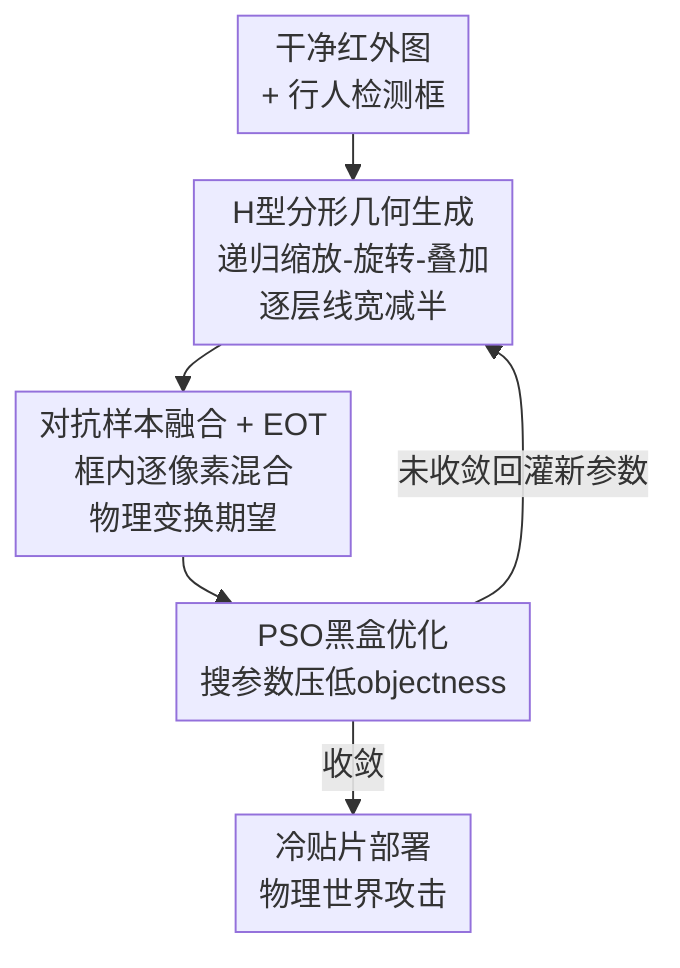

# Fractal Camouflage: A Bio-Inspired Approach for Multi-Scale Adversarial Attacks in the Infrared Domain

**会议**: CVPR 2026  
**论文**: [CVF Open Access](https://openaccess.thecvf.com/content/CVPR2026/html/Hu_Fractal_Camouflage_A_Bio-Inspired_Approach_for_Multi-Scale_Adversarial_Attacks_in_CVPR_2026_paper.html)  
**代码**: https://github.com/wangxinwangxin123/AdvFractal  
**领域**: AI安全 / 物理对抗攻击  
**关键词**: 红外行人检测, 物理对抗攻击, 分形几何, 多尺度攻击, 黑盒攻击  

## 一句话总结
针对红外行人检测器，用 H 型分形几何天然的自相似结构生成"跨尺度都有效"的物理对抗扰动（贴在衣服上的冷贴片），并用粒子群优化在黑盒条件下搜参数，物理世界 ASR 达 97.54%、跨数据集 99.16%，远超现有单尺度方法。

## 研究背景与动机

**领域现状**：红外目标检测是自动驾驶、监控等全天候系统的核心，但和可见光检测器一样易受对抗攻击。红外物理攻击的主流做法是在人身上贴"冷贴片"（cold patch，维持低温在红外相机里成像为暗区）或嵌入加热元件，制造能让检测器漏检的扰动图案。

**现有痛点**：现有红外物理攻击（HCB、AdvIB、AdvIC、AdvICRS 等）几乎都是为**某个固定距离/尺度**设计和优化的——图案是手工设计或均匀生成的，受限于一个固定的"感受野/粒度"。结果是：对近处行人有效的扰动，等人走远后就失效，反之亦然。

**核心矛盾**：现代检测器用**特征金字塔**处理不同尺度的目标，一个只针对某一层特征优化的扰动，到另一层就不起作用。固定粒度的扰动无法同时干扰金字塔的所有层级，这是单尺度攻击实用性差的根因。

**本文目标**：造一种"天生多尺度"的扰动——同一个图案能在远近不同距离、不同分辨率下都把检测器骗倒。

**切入角度**：作者从**分形几何**（fractal geometry）的自相似性出发。分形在无限重复的尺度上呈现相同结构，天然带有"多层级细节"。如果扰动本身就是分形的，那它就同时含有粗结构（干扰全局轮廓/语义层）和细结构（干扰局部纹理层），无需为每个尺度单独设计。

**核心 idea**：用 **H 型分形**作为扰动的生成器，递归地缩放-旋转-叠加出一个跨尺度自相似的对抗图案，再用粒子群优化（PSO）在黑盒下搜出最优参数——以"自相似几何"代替"固定粒度图案"来解决红外攻击的多尺度失效问题。

## 方法详解

### 整体框架
AdvFractal 是一个黑盒物理对抗攻击：输入一张含行人的干净红外图，在目标 bounding box 内生成多层 H 型分形图案；分形的参数（中心、层数、长度、各层旋转角）由 PSO 在 EOT 框架下迭代优化，目标是把检测器对该行人的置信度压到 0.5 以下；优化好的图案再制成冷贴片，部署到真实世界。

关键的"多尺度"来自一个**逐层细化**策略：每深一层，线宽减半。于是初始层的粗图案破坏全局轮廓与语义特征，深层的细图案干扰局部纹理与细节特征——同一张扰动一次性覆盖检测器特征金字塔的所有层级，这正是它能跨距离/分辨率稳定生效的来源。

### 关键设计

**1. H 型分形几何：用自相似结构天生覆盖多尺度**

这一步直接针对"固定粒度扰动只对单一尺度有效"的痛点。作者不用简单形状，而是把 H 字形当作基本生成元，递归地生长出分形。设第 $k$ 层分形为 $H_k$，中心 $(x^{(k)},y^{(k)})$、长度 $L^{(k)}$、朝向 $\theta^{(k)}$，递归生成规则是在当前层的每个端点处做一次以该点为中心、缩放因子为 $r$ 的缩放变换：

$$H_{k+1} = \bigcup_{p\in E(H_k)} S_p(H_k)$$

其中 $E(H_k)$ 是 $H_k$ 的端点集合。参数随层数更新为 $L^{(k+1)} = r\cdot L^{(k)}$、$\theta^{(k+1)} = \theta^{(k)} + \phi^{(k)}$（$\phi^{(k)}$ 是第 $k$ 层的附加旋转角）；子节点坐标由旋转变换算得，$\Delta x = d_x\cos\theta^{(k)} - d_y\sin\theta^{(k)}$、$\Delta y = d_x\sin\theta^{(k)} + d_y\cos\theta^{(k)}$，$(d_x,d_y)$ 是中心到 H 四个端点的偏移。配合"每层线宽减半"的渐进细化，浅层粗笔画对应全局轮廓、深层细笔画对应局部纹理，使**一张扰动同时打在特征金字塔的每一层**，这是它区别于单尺度方法的本质。

**2. 对抗样本融合 + EOT 物理鲁棒：让数字图案能搬到真实世界**

针对"数字上有效、贴到衣服上就失效"的物理落地问题。分形 $S(z)$ 由参数向量 $z=[(x,y),L,\theta,l]$ 生成，通过融合函数 $O$ 与干净红外图 $I$ 在目标区域掩码 $M$ 内做逐像素混合：$I_{adv} = O(I, S(z), M)$，掩码内取 $I\odot S(z)$、掩码外保持 $I$ 不变（分形取黑色以模拟冷贴片在红外里的暗成像）。为了抵抗真实世界的尺度、旋转、亮度、噪声等变化，作者套上 Expectation over Transformation（EOT）框架，对一组物理变换分布 $T$ 求期望：

$$I_{adv} = \mathbb{E}_{t\sim T}\,[\,t(I_{adv})\,]$$

这样优化出的图案是在"各种拍摄条件的平均"下都有效，而不是只在某一张干净图上过拟合——这是它物理 ASR（97.54%）远高于基线的关键工程支撑。

**3. PSO 黑盒参数优化：只看检测器输出就能搜出最优分形**

针对"黑盒下拿不到梯度"的约束。在只能观测检测器输出的设定下，优化目标是最小化检测器 $f$ 对行人的 objectness 置信度 $y_{obj}$：$\arg\min_{S(z)} \mathbb{E}_{t\sim T}\big(y_{obj}\leftarrow f(t(I_{adv}))\big)$。每个粒子编码一套完整分形配置 $z_i=[(x_i,y_i),L_i,(\theta_{i1},\dots),(l_{i1},\dots)]$（中心坐标、层数、各层旋转角、各层线长），PSO 按惯性 + 个体最优 + 全局最优更新速度与位置：

$$v_a^{b+1} = \omega v_a^b + c_1 r_1(z_{a,best}^b - z_a^b) + c_2 r_2(z_{best}^b - z_a^b)$$

位置更新为 $z_i^{b+1} = z_i^b + v_i^{b+1}$。相比白盒梯度攻击，它不需要模型内部信息，因此可直接攻不同结构的检测器；作者也对比了 GA、DE 三种进化算法，三者 ASR 接近，但 PSO 的查询效率（平均 query 数）更优，故全程采用 PSO。

### 损失函数 / 训练策略
没有可学习权重，"训练"即用 PSO 搜分形参数。设置：种群 40、迭代 50 代、惯性 $\omega=0.7$、认知/社会系数 $C_1=C_2=1.5$、$r_1,r_2\in[0,1]$；分形长度比 $\in[0.2,0.8]$（相对框宽）、深度 $d\in[1,4]$、旋转角 $\in[0,2\pi)$，线宽逐层固定比例递减，颜色取黑。综合攻击效果与物理可行性，最终选定 **3 层、长度比 0.4** 的配置。攻击任务是"消失攻击"（disappearance attack）：让检测器置信度跌破 0.5 即算成功。

## 实验关键数据

评测指标：ASR（攻击成功率，置信度 $<0.5$ 的样本占比）与 AQ（每图平均查询次数，越低越高效）。在 FLIR V1-3 子集上训练 10 个检测器，并跨 5 个红外数据集评测。

### 主实验（跨数据集 + 黑盒基线对比）

| 对比维度 | 指标 | AdvFractal | 最强基线 | 说明 |
|----------|------|-----------|----------|------|
| 跨数据集均值（5 集） | ASR / AQ | **99.16% / 38.20** | AdvICRS 90.40% / 90.74 | ASR 更高且查询省一半多 |
| 物理世界（5.2–9.4m） | ASR | **97.54%** | AdvIB 86.30% | 真实距离变化下仍稳 |
| 数字域（10 检测器均值） | ASR / AQ | **89.35% / 238.12** | AdvICRS 87.20% / 156.40 | ASR 最优（查询略高于 AdvIC/AdvICRS） |

跨数据集细看：HCB、AdvIB 跨集 ASR 不足 50% 且查询 >400；AdvIC 在 FLIR 上 94.80% 但到 LLVIP/MSRS 掉到 67.30%/47.30%（均值仅 73.18%）；AdvFractal 在 5 个数据集上几乎都接近满分。

### 消融实验（分形深度 / 优化算法 / 长度比）

| 配置 | 关键指标（ASR / AQ） | 说明 |
|------|---------------------|------|
| 深度 1, 长度 0.4, PSO | 96.82% / 130.97 | 浅层近距离够用，远距离差 |
| 深度 3, 长度 0.4, PSO（采用） | 99.36% / 22.64 | 攻击力与查询效率俱佳 |
| 深度 4, 长度 0.4, PSO | 100% / 10.92 | 略好但物理可行性下降 |
| 深度 3 + GA / DE（同配置） | ≈99.36% / 46–52 | ASR 相近，查询效率不如 PSO |

10 检测器鲁棒性（Table 2）：均值 89.35% ASR、238.12 查询；对 Libra R-CNN、YOLOF、Deformable-DETR 达 100%，对 YOLOv3/Mask R-CNN/Faster R-CNN/YOLOX 均 >95%，但对 DETR、RetinaNet 仅约 60%——这两个是最难攻的结构。

### 关键发现
- **深度是物理多尺度的命门**：物理实验里，深度-1 在 9.4m 处 ASR 暴跌到 0.01%，深度-3 仍保 98.67%；平均 ASR 97.54%（深度-3）vs 82.87%（深度-1）。这直接验证了"自相似多层级 = 跨尺度有效"的核心假设。
- **PSO 选型靠效率而非 ASR**：GA/DE/PSO 三者 ASR 接近，PSO 胜在查询次数更省。
- **隐蔽性第二**：40 人主观打分（0–10），AdvFractal 6.17 分仅次于 AdvIC（6.73），显著高于其余基线——攻击强且不显眼。
- **难攻的检测器**：DETR、RetinaNet 物理迁移下鲁棒性强（RetinaNet/YOLOF 物理迁移 0% ASR），说明攻击对特定结构仍有局限。

## 亮点与洞察
- **把"分形自相似"映射到"特征金字塔多层级"**：这是最巧的一笔——检测器天生分层处理尺度，扰动也用分形天生分层覆盖，二者结构对齐，省去了为每个尺度单独设计扰动。这个"用结构匹配结构"的思路可迁移到任何带多尺度特征的攻防任务。
- **逐层线宽减半**：一个极简的工程约束就实现了"粗→细"的尺度梯度，无需复杂多目标优化。
- **黑盒 + 物理双约束下仍 SOTA**：不需模型内部、且能制成真实冷贴片，攻击的现实威胁度比纯数字攻击高得多。
- 把进化搜索（PSO）和 EOT 组合用于物理对抗，是一套可复用的"无梯度 + 抗物理扰动"配方。

## 局限与展望
- **对部分检测器明显失效**：DETR、RetinaNet 数字域只有约 60%，物理迁移到 RetinaNet/YOLOF 甚至 0%——基于注意力/不同金字塔设计的检测器对该攻击天然更鲁棒，方法并非通吃。
- **中距离有性能洼地**：物理实验在 6.4–8.2m 区间 ASR 有轻微下降，说明"跨尺度一致"仍不完美。
- **仅限消失攻击 + 行人**：只验证了让检测器漏检行人，未涉及定向误分类或其他类别。⚠️ 论文未给跨类别/跨任务结果，泛化性待考。
- **查询效率非最优**：数字域 AQ（238）高于 AdvIC/AdvICRS，黑盒查询成本仍有优化空间。
- 改进方向：针对 DETR 类注意力检测器设计自相似扰动；把分形深度做成随距离自适应而非固定 3 层。

## 相关工作与启发
- **vs 白盒红外攻击（BulbAttack / QRattack / AIP / AdvCloth）**：它们需模型内部、且图案固定尺度、感受野受限；本文黑盒、且分形天生多尺度，部署也更简单（冷贴片 vs 加热元件）。
- **vs 黑盒冷贴片类（HCB / AdvIB / AdvIC）**：这些用低成本柔性冷贴片但仍是固定粒度、易受衣物褶皱/身体运动影响；AdvFractal 的自相似设计跨尺度稳定，跨数据集均值高出 20+ 个百分点。
- **vs 曲线类（AdvICRS）**：AdvICRS 用 Catmull–Rom 样条做更自然平滑的扰动、跨集鲁棒（90.40%），但仍是单一粒度；本文在 ASR（99.16% vs 90.40%）和查询效率（38 vs 91）上都更优，核心差异是"分形多层级 vs 单粒度平滑曲线"。

## 评分
- 新颖性: ⭐⭐⭐⭐⭐ 首次把分形自相似几何用于红外对抗，结构对齐特征金字塔的角度很漂亮
- 实验充分度: ⭐⭐⭐⭐⭐ 10 检测器 + 5 数据集 + 物理世界 + 主观隐蔽性 + 深度/算法消融，覆盖全面
- 写作质量: ⭐⭐⭐⭐ 思路清晰、公式齐全，但部分符号（融合 $\odot$、EOT 期望）交代略简
- 价值: ⭐⭐⭐⭐ 揭示红外检测系统真实物理安全风险，对自动驾驶/监控安防有实际威慑意义

<!-- RELATED:START -->

## 相关论文

- [\[CVPR 2026\] A Sanity Check for Multi-In-Domain Face Forgery Detection in the Real World](a_sanity_check_for_multi-in-domain_face_forgery_detection_in_the_real_world.md)
- [\[AAAI 2026\] Rethinking Target Label Conditioning in Adversarial Attacks: A 2D Tensor-Guided Generative Approach](../../AAAI2026/ai_safety/rethinking_target_label_conditioning_in_adversarial_attacks_a_2d_tensor-guided_g.md)
- [\[CVPR 2026\] Towards Stealthy and Effective Backdoor Attacks on Lane Detection: A Naturalistic Data Poisoning Approach](towards_stealthy_and_effective_backdoor_attacks_on_lane_detection_a_naturalistic.md)
- [\[CVPR 2026\] FedDAP: Domain-Aware Prototype Learning for Federated Learning under Domain Shift](feddap_domain-aware_prototype_learning_for_federated_learning_under_domain_shift.md)
- [\[CVPR 2026\] Frequency-domain Manipulation for Face Obfuscation](frequency-domain_manipulation_for_face_obfuscation.md)

<!-- RELATED:END -->
