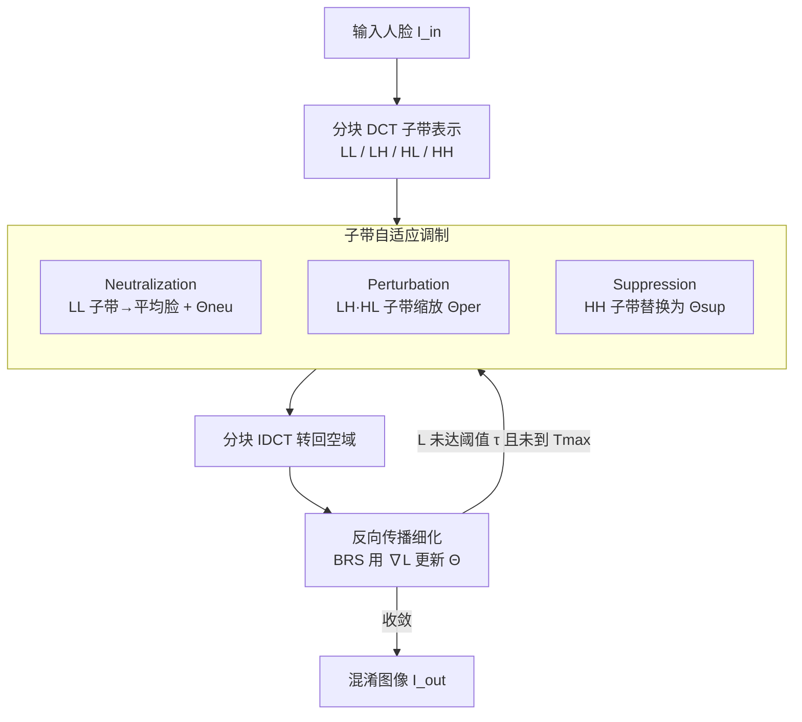

# Frequency-domain Manipulation for Face Obfuscation

**会议**: CVPR 2026  
**论文**: [CVF Open Access](https://openaccess.thecvf.com/content/CVPR2026/html/Kim_Frequency-domain_Manipulation_for_Face_Obfuscation_CVPR_2026_paper.html)  
**代码**: https://github.com/mcljtkim/FreM  
**领域**: AI安全 / 隐私保护 / 人脸混淆  
**关键词**: 人脸混淆, 频域操作, DCT 子带, 隐私保护, 重建攻击鲁棒性

## 一句话总结
FreM 把人脸混淆从空域搬到频域：先分块 DCT 把人脸拆成 LL/LH/HL/HH 四个子带，对每个子带用专门模块做"中和 / 微扰 / 抑制"差异化处理，再用反向传播逐图细化参数，在"人看不出 + 机器认得出"之间取得平衡的同时，对重建攻击表现出明显更强的鲁棒性（PSNR 最低）。

## 研究背景与动机
**领域现状**：大规模人脸数据集是人脸识别、年龄估计、表情识别等任务的基础资源，但人脸天然携带可识别身份信息，引发隐私担忧。隐私增强技术分两类——**人脸匿名化**（masking/blurring/换脸，连机器都认不出）和**人脸混淆**（face obfuscation，目标是让人认不出身份、但保留机器可解析的线索，即 machine decipherability, MD）。本文做的是后者。

**现有痛点**：人脸混淆长期受困于"人不可读（HI）↔ 机器可读（MD）"的内在 trade-off——HI 越强，MD 通常越差，反之亦然。更要命的是，即便像 Forbes、IdentityHider 这类已经较好平衡 HI/MD 的方法，仍然**抵不住重建攻击**：攻击者训练一个 U-Net 编解码器，就能从混淆图反推出原始人脸。

**核心矛盾**：作者点出根因——现有方法几乎都在**空域**上动手，操作的是空间上相邻的像素值，因此不可避免地留下了**结构性信息**（皮肤纹理、头型轮廓等），这些残留正好被重建攻击利用。空域操作没法把"身份线索、任务相关线索、抗篡改成分"三者解耦开来分别控制。

**切入角度**：作者借鉴了**鲁棒图像水印**的经验——水印技术用频域表示把信息藏在"感知上不可见、但抗篡改"的子带里。受此启发，作者认为频域是个更合适的战场：在频域里，不同频率子带对 HI、MD、鲁棒性的贡献天然不同，可以**分子带独立调控**。

**核心 idea**：把人脸分块 DCT 成 LL/LH/HL/HH 四个子带，根据每个子带的特性"对症下药"地调制——低频中和身份、中频微扰保 MD、高频抑制以抗重建，再用免训练的逐图优化把这套参数精修到位。

## 方法详解

### 整体框架
FreM 要从输入图 $I_{in}$ 生成混淆图 $I_{out}$，同时满足三个目标：人不可读（HI）、机器可读（MD）、抗重建攻击。整个流程是一条三阶段 pipeline：**① 分块 DCT 子带表示** → **② 子带自适应调制**（三个频率专属模块各管一块子带）→ **③ 反向传播细化**（逐图更新调制参数），最后用分块 IDCT 转回空域得到 $I_{out}$。关键在于整个方法**免训练**——不训练任何混淆网络，而是借一个预训练人脸分析网络 $\mathcal{F}$ 当"裁判"，对每张测试图单独做参数优化。

### 关键设计

**1. 分块 DCT 子带表示：把混淆战场从空域搬到频域**

针对"空域操作留下结构性残留、被重建攻击利用"这个根因，FreM 第一步就换战场。它对输入图 $I_{in}\in\mathbb{R}^{H\times W\times 3}$ 做**分块** DCT（block size $P=8$），而不是对整图做一次全局 DCT——分块能给出**局部化**的频率表示，每块只有少量显著系数，既高效又便于"看得懂地"操作。每个 $P\times P$ 块 $B$ 变成系数矩阵 $C$，再按沿两轴的频率高低拆成四个子带：$C_{LL}$（低频）、$C_{LH}$、$C_{HL}$（中频）、$C_{HH}$（高频）。这一步的意义是：在频域里，身份线索（集中在低频）、任务相关判别线索（中频）、抗篡改成分（高频）天然分布在不同子带，从而**可以被独立控制**——这正是空域做不到的解耦。

**2. 子带自适应调制：三个频率专属模块对症下药**

这是 FreM 的核心。作者给三类子带各配一个带可学习参数 $\Theta$ 的模块，分别承担 HI、MD、鲁棒性三件事：

- **Neutralization（中和，作用于 LL 低频）**：LL 含主导的身份信息，是 HI 的关键。做法是先从人脸数据集算出**平均人脸**并转到 DCT 域得到 $\bar{C}_{LL}$，再加上可学习参数 $\Theta_{neu}$：
$$\hat{C}_{LL} = \bar{C}_{LL} + \Theta_{neu}$$
其中 $\Theta_{neu}\sim\mathcal{N}(0,\sigma_{neu}^2)$（$\sigma_{neu}=0.5$）。用平均脸打底既抹掉了个体身份、又保留粗略人脸结构（不至于完全糊掉而丢 MD），$\Theta_{neu}$ 则在平均脸附近做小扰动来进一步提 HI。

- **Perturbation（微扰，作用于 LH/HL 中频）**：这两个子带对人几乎不可见，却含有利于 MD 的判别线索。做法是对系数做**逐元素缩放**：
$$\hat{C}_f = C_f \odot \Theta_f,\quad f\in\{LH, HL\}$$
$\Theta_{per}=\{\Theta_{LH},\Theta_{HL}\}$ 全部**初始化为 1**，这样起点不丢任何 MD 线索，再在细化阶段微调幅度，做到在不损 HI 的前提下增强 MD。

- **Suppression（抑制，作用于 HH 高频）**：HH 对人几乎不可见，却对重建攻击极有影响。做法最激进——**直接把原 $C_{HH}$ 整体替换**为 $\Theta_{sup}\sim\mathcal{N}(0,\sigma_{sup}^2)$（$\sigma_{sup}=1$），$\sigma_{sup}$ 控制高频抑制强度。彻底打乱高频成分，让攻击者无法据此重建身份。

三个模块各管一段频率、各为一个目标服务，这种"分子带分工"正是 FreM 相比"只在 DCT 上做通道选择/打乱/掩码、不区分子带角色"的旧频域方法的关键区别。

**3. 反向传播细化（BRS）+ 双目标函数：逐图免训练优化**

针对 HI/MD 固有 trade-off，FreM 不训练网络，而是采用 Backpropagating Refinement Scheme（BRS）：**冻结**预训练人脸分析网络 $\mathcal{F}$ 的权重，只对每张输入图迭代更新 $(\Theta_{neu},\Theta_{per},\Theta_{sup})$，最小化目标函数
$$\mathcal{L} = \mathcal{L}_{MD} + \lambda_{CEC}\,\mathcal{L}_{CEC}$$
其中 MD 损失鼓励混淆图与原图在 $\mathcal{F}$ 的特征空间里相似，从而保住机器可读性：
$$\mathcal{L}_{MD} = 1 - \mathcal{F}(I_{in})^{T}\mathcal{F}(I_{out})$$
但单靠 $\mathcal{L}_{MD}$ 会在追 MD 时放大低频系数、把人可感知的身份线索又"喂"回来。为此引入**系数能量约束损失** $\mathcal{L}_{CEC}$，约束调制后系数 $\hat{C}$ 的 $\ell_1$ 能量不超过原系数 $C$：
$$\mathcal{L}_{CEC} = \big|\,\|\hat{C}\|_1 - \|C\|_1\,\big|$$
它一方面守住 Neutralization 建立的"身份中性"状态，另一方面稳定 IDCT、抑制溢出伪影。细化对每张测试图独立进行，直到 $\mathcal{L}_{MD}$ 降到阈值 $\tau=0.4$ 以下或达到最大迭代 $T_{max}=50$，确保至少满足最低 MD 要求。

### 损失函数 / 训练策略
无网络训练。逐图优化用 Adam，学习率 $10^{-3}$，$\lambda_{CEC}=10^{-2}$，$T_{max}=50$，阈值 $\tau=0.4$，块大小 $P=8$，$\sigma_{neu}=0.5$、$\sigma_{sup}=1$。实验在 RTX 3090 上完成。

## 实验关键数据

### 主实验
在 10 个数据集、4 类任务上验证。人脸识别用 IResNet50（ArcFace 损失）当分析网络，评估两种协议：XDR（混淆图 vs 原图配对）与 ODR（混淆图 vs 混淆图配对）；$R_{rec}$ 为重建鲁棒性（重建图与原图的 PSNR，越低越难重建越好）。

| 方法 | LFW (XDR/ODR) | CPLFW (XDR/ODR) | CFP-FP (XDR/ODR) | $R_{rec}$↓ | 运行(ms) |
|------|---------------|-----------------|------------------|-----------|---------|
| Original | 99.83 / - | 91.80 / - | 97.26 / - | - | - |
| PRO-Face (FaceShifter) | 96.48 / 95.78 | 82.70 / 72.72 | 91.83 / 77.39 | 36.12 | 32.41 |
| Forbes | 95.72 / 82.77 | 83.53 / 71.68 | 86.73 / 71.54 | 22.96 | 739.57 |
| IdentityHider | 99.08 / 98.48 | 87.87 / 83.27 | 91.49 / 87.14 | 15.33 | 68.14 |
| **FreM** | **99.53 / 98.67** | **90.91 / 86.88** | **94.41 / 90.74** | **13.59** | 67.19 |

FreM 在 5 个基准 × 2 协议共 10 项里拿下 8 项第一、2 项第二，整体最优；$R_{rec}$ 最低（最难重建）；运行时间约 67ms，与依赖额外训练网络的 IdentityHider 相当，却比同为免训练的 Forbes 快 10 倍以上。十个随机种子下 FreM 仍稳定（XDR 99.5±0.1，ODR 98.7±0.2），说明对初始化不敏感。

跨任务泛化（均与免训练的 Forbes 比，MD 退化越小越好）：

| 任务 / 数据集 | 指标 | Original | Forbes | FreM |
|---------------|------|----------|--------|------|
| 年龄估计 MORPH II | MAE↓ / CS%↑ | 2.24 / 94.6 | 3.38 / 77.4 | 2.41 / 91.8 |
| 表情识别 RAF-DB | Acc.↑ | 85.95 | 75.23 | 83.02 |
| 属性分类 CelebA | mAcc.↑ | 90.35 | 88.11 | 88.80 |

FreM 在三类额外任务上 MD 退化均明显小于 Forbes，验证了通用性。

### 消融实验
子带模块消融（人脸识别任务，Acc.↑ 看 MD，PSNR↓ 看抗重建）：

| 配置 | $\bar{C}_{LL}$ | $\Theta_{neu}$ | $\Theta_{per}$ | $\Theta_{sup}$ | Acc. | PSNR |
|------|:---:|:---:|:---:|:---:|------|------|
| (1) | ✓ | ✓ | | | 99.15 | 16.45 |
| (2) | ✓ | ✓ | ✓ | | 99.61 | 16.72 |
| (3) | | | ✓ | ✓ | 98.13 | 13.23 |
| (4) 完整 | ✓ | ✓ | ✓ | ✓ | 99.50 | 13.59 |

超参消融：

| 消融项 | 取值 | 结论 |
|--------|------|------|
| 块大小 $P$ | 4 / **8** / 16 / 28 / 112 | $P=8$ 时 Acc. 99.52 最稳；太小局部频率信息不足，$P\geq16$ 削弱局部子带操作 |
| 子带划分 $P_L$ | 1…7 | $P_L=4$ 时 Acc. 99.52 最佳 |

### 关键发现
- **Perturbation 提 MD、Suppression 保鲁棒**：对比 (1)→(2)，加入 Perturbation 把 Acc. 从 99.15 提到 99.61，但 PSNR 仍高（16.72，易被重建）；引入 Suppression 的 (3)(4) 才把 PSNR 压到 13 附近，证明**抗重建主要靠对 HH 高频的抑制**。
- **平均脸打底是 MD 的关键**：对比 (3)→(4)，加上用 $\bar{C}_{LL}$ 中和（保留粗略人脸结构）把 Acc. 从 98.13 拉回 99.50，说明 Neutralization 不是简单抹除而要"留结构"才能保住 MD。
- **空域 vs 频域**：定性结果显示 PRO-Face/IdentityHider 几乎没破坏人脸结构、Forbes 仍残留皮肤纹理与头型；FreM 的频域全局处理让重建图无法恢复任何可辨身份信息。

## 亮点与洞察
- **用"频率子带角色分工"破解 HI/MD/鲁棒三难**：把三个互相打架的目标分配到 LL/中频/HH 三段频率上各自优化，避免了空域里"按下葫芦浮起瓢"。这个"按子带功能解耦"的思路可迁移到任何需要同时满足多个冲突约束的信号处理任务。
- **借水印经验做隐私**：作者敏锐地把鲁棒水印"在不可见子带藏抗篡改信息"的范式搬来对抗重建攻击，是一次漂亮的跨领域类比。
- **免训练 + 逐图优化**：BRS 把"训混淆网络"换成"对每张图临时优化几十步"，免去了底层分析网络更新就得重训的麻烦，且天然适配不同任务的分析网络当裁判。
- **$\mathcal{L}_{CEC}$ 的洞察**：作者注意到追 MD 会反噬 HI（低频系数被放大、身份线索回流），用一个 $\ell_1$ 能量约束守住中性状态，是个很实用的小设计。

## 局限与展望
- **HI 难以量化**：作者自己承认人不可读性主观、难量化，论文里 HI 主要靠定性图和 ⚠️ 补充材料展示，缺乏统一的客观 HI 指标，横向"谁更让人认不出"较难严格比较。
- **逐图优化的开销**：虽比 Forbes 快 10 倍，但每张图仍需最多 50 步迭代（约 67ms/图），对超大规模数据集批量混淆仍有成本；且依赖一个预训练分析网络当裁判，裁判选得好不好直接影响 MD。
- **平均脸依赖数据集统计**：Neutralization 用的 $\bar{C}_{LL}$ 来自人脸数据集均值，⚠️ 对人种/年龄分布偏移大的目标人群，平均脸是否仍能"既抹身份又保结构"值得验证。
- **白盒/自适应攻击未充分评估**：重建鲁棒性只在黑盒 U-Net 攻击下测，面对知道频域机制的自适应攻击者，HH 随机替换是否依旧稳健存疑。

## 相关工作与启发
- **vs Forbes（同为免训练 BRS 方法）**：Forbes 用参数化的**局部空间滤波器**在空域迭代，本文换到**频域分子带**操作；结果是 FreM 抗重建（PSNR 13.59 vs 22.96）和速度（67ms vs 740ms）都大幅领先，核心差异就是空域留结构残留、频域能解耦。
- **vs PRO-Face / IdentityHider（训练型）**：它们需为特定人脸分析任务训练专门的混淆网络，分析模型一更新就要重训，适配性差且只支持人脸识别；FreM 免训练、换个分析网络当裁判即可覆盖年龄/表情/属性等多任务。
- **vs 早期 DCT 混淆方法**：以往频域方法只做 DCT 系数的通道选择/打乱/掩码，**不区分各频率区域的角色**；FreM 给每个子带配专属模块，借鉴水印的子带级处理拿到更好的 HI-MD-鲁棒权衡。

## 评分
- 新颖性: ⭐⭐⭐⭐ 把人脸混淆系统性搬到频域并按子带功能分工，跨界借鉴水印，思路清晰且站得住
- 实验充分度: ⭐⭐⭐⭐ 10 数据集 4 任务 + 重建攻击 + 多随机种子 + 完整消融，唯 HI 缺客观量化
- 写作质量: ⭐⭐⭐⭐ 动机—矛盾—方法链条清楚，三模块与三目标一一对应，图示到位
- 价值: ⭐⭐⭐⭐ 免训练、快、强抗重建，对隐私保护数据集发布有直接实用价值

<!-- RELATED:START -->

## 相关论文

- [\[CVPR 2026\] A Sanity Check for Multi-In-Domain Face Forgery Detection in the Real World](a_sanity_check_for_multi-in-domain_face_forgery_detection_in_the_real_world.md)
- [\[CVPR 2026\] FedDAP: Domain-Aware Prototype Learning for Federated Learning under Domain Shift](feddap_domain-aware_prototype_learning_for_federated_learning_under_domain_shift.md)
- [\[CVPR 2026\] Forensic-Friendly Image Manipulation via Controllable Latent Diffusion](forensic-friendly_image_manipulation_via_controllable_latent_diffusion.md)
- [\[CVPR 2026\] UniDef: Universal Defense Against Unauthorized Image Manipulation](unidef_universal_defense_against_unauthorized_image_manipulation.md)
- [\[CVPR 2026\] A Unified Perspective on Adversarial Membership Manipulation in Vision Models](a_unified_perspective_on_adversarial_membership_manipulation_in_vision_models.md)

<!-- RELATED:END -->
