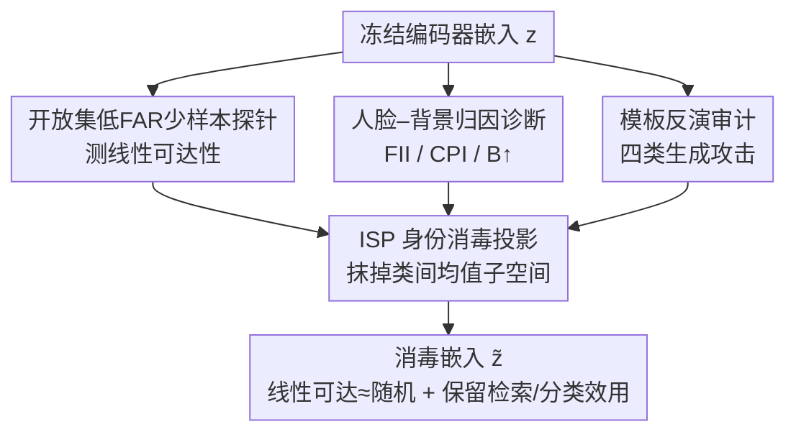

# From Measurement to Mitigation: Quantifying and Reducing Identity Leakage in Image Representation Encoders with Linear Subspace Removal

**会议**: CVPR 2026  
**论文**: [CVF Open Access](https://openaccess.thecvf.com/content/CVPR2026/html/George_From_Measurement_to_Mitigation_Quantifying_and_Reducing_Identity_Leakage_in_CVPR_2026_paper.html)  
**代码**: 暂无（作者声明将开源投影器 + 评测工具包）  
**领域**: AI安全 / 隐私保护  
**关键词**: 身份泄漏, 人脸隐私, 表示编码器, 子空间消除, 开放集验证

## 一句话总结
在攻击者视角下系统量化 CLIP / DINOv2/v3 / SSCD 这类冻结视觉编码器在人脸数据上的身份泄漏（开放集低 FAR 验证 + 模板反演 + 人脸-背景归因），并提出一次性闭式投影 ISP 把身份子空间从嵌入里线性抹掉，使线性探针掉到接近随机、同时几乎不损失检索/分类效用。

## 研究背景与动机

**领域现状**：大规模检索、近重复搜索、伪造/换脸检测这类"完整性"系统普遍依赖冻结的视觉编码器（CLIP、DINOv2/v3、SSCD）配 ANN 索引来做向量搜索。这些编码器训练时**没有任何身份监督**，被当作通用相似度特征来用。

**现有痛点**：当这些非人脸识别（non-FR）编码器被用在含人脸的数据上时，运营方陷入两难——让特征对搜索/完整性任务鲁棒的那些不变性，可能同时把残留的生物特征线索暴露出来。问题是这种身份泄漏**几乎从没在真实部署的工作点上被测过**：部署方关心的是开放集（测试身份训练时没见过）、低误受率（FAR 在 $10^{-4}\sim10^{-6}$，因为要在数十亿次比对里控制冒充通过的绝对数量）下的成对相似度判定。而现有可解释性工具（saliency 图、概念方向）给的是单张图的逻辑或显著性，既不给操作阈值也不给测得的错误率，回答不了"低 FAR 下身份信息到底有没有线性可达"这个攻击者真正关心的问题。对 DINOv2/v3、SSCD 这几个，**之前根本没人测过**。

**核心矛盾**：合规场景（GDPR/CCPA 限制用人脸识别）逼着大家用 non-FR 编码器来做身份相关的完整性任务，但这些编码器的隐私属性在对抗威胁模型下完全没被刻画——既不知道泄漏多少，也没有能直接部署的缓解手段。

**本文目标**：(1) 给非 FR 编码器一套攻击者校准的人脸隐私审计；(2) 在不重训编码器的前提下，提供一个可审计、低延迟的缓解器。

**切入角度**：作者假设身份信号在非 FR 嵌入里**集中在一个紧凑、可跨数据集迁移的低秩子空间**里。如果成立，就能用一次闭式线性投影把它整体抹掉，而把对检索有用的互补子空间留下来。

**核心 idea**：用"测量套件 + 一次性矩投影"——先用开放集低 FAR 探针、模板反演、人脸-背景归因把泄漏量到位，再用基于类均值矩的正交投影 ISP 把身份的类间均值子空间投掉，把线性身份可达性压到接近随机。

## 方法详解

### 整体框架

整篇论文是一个"先测量、后缓解"的闭环。给定一个冻结编码器 $f$，把图像编码成 $\ell_2$ 归一化嵌入 $z = f(x)/\|f(x)\|_2 \in \mathbb{R}^d$。测量侧用三个互补诊断从三个角度逼问"身份还剩多少、藏在哪、能不能被生成式恢复"：线性探针测**可达性**、人脸-背景归因测**身份藏在脸还是背景**、模板反演测**生成式恢复性**。缓解侧用 ISP 投影器把估计出的身份子空间一次性抹掉，得到消毒嵌入 $\tilde z = Pz/\|Pz\|_2$，再用同一套测量套件复测，验证"线性可达掉到近随机、下游效用基本不掉"。

下图是审计→缓解的整体流向（三个诊断并行作用在原始嵌入上，ISP 投影后产出消毒嵌入再复测）：

### 关键设计

**1. ISP 身份消毒投影：用类均值的矩做一次闭式正交投影，把身份的可线性分离方向整体投掉**

这是全文真正的贡献，直接打击"身份在低 FAR 下线性可达"这个痛点。出发点是 Fisher/Mahalanobis 几何：在同方差假设下，跨身份的线性可分性由**类间均值子空间**主导——若 $M=[\mu_i-\mu_C]\in\mathbb{R}^{d\times m}$ 堆叠去中心的身份均值，判别方向就是白化矩阵 $\tilde M=\Sigma_w^{-1/2}M$ 的左奇异向量；把嵌入投到这些方向 top-$r$ 的正交补上，任何线性验证器 $w^\top z$ 在测试时都会丢掉身份间隔（$w^\top(\mu_i-\mu_j)\approx 0$）。

具体构造只用类均值、不用协方差求逆：先算每个身份的均值 $\mu_i=\frac1n\sum_j z_i^j$ 和全局均值 $\mu_C=\frac1m\sum_i\mu_i$，去中心得 $\tilde\mu_i=\mu_i-\mu_C$（目的是把姿态/光照/背景这类图像内变化平均掉、只留身份间差异），堆成 $M=[\tilde\mu_1,\dots,\tilde\mu_m]$，做薄 SVD $M=U\Sigma V^\top$ 取前 $r$ 个左奇异向量 $U_r$，于是投影器和消毒特征为：

$$P = I - U_r U_r^\top,\qquad \tilde z = \frac{Pz}{\|Pz\|_2}.$$

实践中作者采用**只用均值、不做 $\Sigma_w^{-1/2}$ 白化**的变体，为的是数值稳定和速度——它瞄准的是同样的类间结构，经验上足以让低 FAR 的开放集线性身份可达性坍塌。整个构造一次性、复杂度 $O(d m^2)$、产出一个固定的 $d\times d$ 矩阵 $P$，离线在一组"隐私已授权"的标注身份上做一次 SVD 拟合即可，推理时就是一次矩阵乘法、亚毫秒延迟，且开销只随拟合身份数增长、与部署流量无关。秩 $r$ 是可审计的隐私-效用旋钮：在验证集上挑最小的、能满足隐私目标（如 TAR@FAR=$10^{-4}\le5\%$）的 $r$，最终 DINOv2 用 $r=256$、DINOv3/CLIP/SSCD 用 $r=192$。这给出一张"线性泄漏证书"：ISP 后任意在不相交身份上训的线性探针，在部署阈值下都接近随机。

**2. 开放集低 FAR 少样本探针：在攻击者真正部署的工作点上量化线性可达性**

这一项解决"现有可解释性工具不给操作阈值、测不到真实泄漏"的痛点。协议严格开放集、身份不相交：身份切成 train/val/test 三份无重叠，验证器学一个投影 $W\in\mathbb{R}^{d\times r}$ 把嵌入降维，成对验证分是投影后的余弦相似度 $\text{score}(z_q,z_s)=\frac{(z_qW)^\top(z_sW)}{\|z_qW\|_2\|z_sW\|_2}$，超过阈值 $\tau$ 判为同一人。阈值 $\tau$ 和所有超参在验证身份上定死、再冻结去测试身份上跑，目标 FAR$\le10^{-4}$，报告 TAR@FAR。探针分两族：Ridge（$\ell_2$ 正则最小二乘的线性探针）和 MLP（两层网络的非线性探针）。同时扫 $k\in\{1,4,16\}$ 模拟少样本到多样本的不同攻击者监督强度，5 个种子取平均带身份感知的 95% 置信区间。这套"开放集 + 低 FAR + 身份不相交"正是之前 concept-erasure 评测里缺的，也是 ISP 缓解效果被诚实验证的前提。

**3. 人脸-背景归因诊断：用等面积扰动把"身份到底藏在脸还是背景"量出来**

这一项回答"身份证据空间上来自哪"，避免被背景捷径误导。关键是先用人脸覆盖率 $\text{FCR}(x)=\frac{\text{area(face mask)}}{\text{area}(x)}$ 把人脸面积在不同图像间标准化，再只比较**等面积、等强度**的扰动，这样相似度的变化只能归因于"碰了脸还是碰了背景"、而非"碰了多少"。在此之上给三个指标：FII（Face Importance Index）比较等面积遮挡人脸 vs 遮挡背景对相似度的影响差，$\text{FII}=\Delta_{\text{face}}-\Delta_{\text{bg}}$，FII>0 表示人脸主导；CPI（Context Preference Index）对同人不同背景 vs 不同人同背景两张参考图做高斯人脸模糊扫描，统计模糊查询更偏向背景还是身份；B↑ 是压力测试，单调揭示更多背景、看背景何时压过身份。结论是 FR 模型人脸主导（FII>0、B↑→1），而非 FR 编码器在紧裁剪下是背景主导（FII≈0、B↑→0），ISP 后最显著的变化是模型从"过度依赖同背景信号"重新平衡回"偏好同人"。

**4. 模板反演审计：用生成攻击测线性探针测不到的生成式泄漏**

线性探针只测决策边界可达性，测不出"强生成先验能否沿嵌入的身份足迹合成一张能跨模型验证通过的脸"。作者用四类预算匹配的反演攻击——DiffMI（扩散 DDPM 隐空间优化）、ALSUV（StyleGAN2 隐空间搜索）、Vec2Face（直接回归生成器）、Bob（代数反演）——从目标嵌入 $z_{\text{tgt}}$ 重建人脸 $\hat x$，再用一个**不相交的** FR 编码器 $f_{FR}$ 跨模型验证：$\frac{f_{FR}(\hat x)^\top f_{FR}(x_{\text{tgt}})}{\|f_{FR}(\hat x)\|_2\|f_{FR}(x_{\text{tgt}})\|_2}\ge\tau_F$（ArcFace $\tau_F=0.1051$、AdaFace $\tau_F=0.1111$，按最小 EER 校准）。低 TAR 同时反演失败，比单一信号更能证明身份可达性有限。作者也诚实声明：反演结果依赖先验和预算，负结果**不构成隐私证明**。⚠️

### 损失函数 / 训练策略
ISP 本身**不涉及任何训练**——它是一次性闭式 SVD 投影，没有损失函数，唯一可调的是秩 $r$（在验证集上按隐私目标/方差覆盖选）。需要训练的只有评测侧的探针：Ridge 用 $\ell_2$ 正则最小二乘，MLP 用两隐层 + ReLU + 交叉熵；两者的阈值和超参都在验证身份上冻结后才上测试集。对比基线 LEACE 用闭式最小二乘擦除，正则 $\lambda\in\{10^{-6},\dots,10^{-2}\}$ 在验证集上选以最小化泄漏。

## 实验关键数据

数据集为 CelebA-20 与 VGGFace2-20（每身份恰 20 张、对齐裁剪、身份不相交 320/80/80 切分）。

### 主实验：ISP 把开放集线性身份可达性压到接近随机

Ridge 开放集 TAR@FAR=$10^{-4}$（%），CelebA-20，ISP-W = 同数据集拟合投影器，ISP-X = 跨数据集迁移；FR 模型不施加 ISP。

| 模型 | $k$=1 RAW | $k$=1 ISP-W | $k$=16 RAW | $k$=16 ISP-W | $k$=16 ISP-X |
|------|-----------|-------------|------------|--------------|--------------|
| DINOv2 | 4.5% | 3.5% | 5.7% | 4.4% | 4.2% |
| DINOv3 | 4.5% | 2.1% | 6.8% | 2.8% | 2.5% |
| CLIP | 16.4% | 11.9% | 19.8% | 13.0% | 10.2% |
| SSCD | 6.6% | 3.6% | 9.8% | 4.4% | 4.5% |
| ArcFace (FR) | 93.7% | — | 94.0% | — | — |
| AdaFace (FR) | 93.6% | — | 94.0% | — | — |

可以看到：non-FR 编码器原始泄漏本就不高（CLIP 明显高于 DINO/SSCD），而 FR 控制组高达 ~94%；ISP 后非 FR 编码器掉到低个位数、接近随机重叠，且跨数据集迁移（ISP-X）保护力与同集（ISP-W）相当。

### 效用保持：抹身份几乎不伤下游任务

ImageNet 效用（归一化，100 = 原始未投影基线的 Top-1）。

| 模型 | k-NN ISP | k-NN LEACE | 线性探针 ISP | 线性探针 LEACE |
|------|----------|------------|--------------|----------------|
| DINOv2 | 100.1% | 100.0% | 99.2% | 99.3% |
| DINOv3 | 97.3% | 97.4% | 93.5% | 93.4% |
| CLIP | 98.3% | 98.5% | 100.7% | 105.6% |
| SSCD | 85.4% | 85.7% | 83.3% | 82.6% |

ImageNet 分类基本保持在基线 ~100%，ISP 与 LEACE 差异在实验噪声内；SSCD 掉得多是因为它本就是拷贝检测专用、不为语义分类设计。

### 关键发现
- **身份子空间紧凑且可迁移**：在不相交数据集上拟合的身份子空间主夹角余弦 >0.99（所有模型），证实身份集中在一个低秩、可移植的子空间——这是 ISP 一次拟合就能跨语料部署的根因。
- **模板反演几乎全失败**：四类生成攻击对非 FR 编码器（CLIP/DINOv2/v3/SSCD）的跨模型验证率近 0，而 FR 编码器 ArcFace 高达 67–100%，说明非 FR 嵌入既无线性可达、也难被生成式恢复。
- **非线性探针只能多榨一点**：换成 MLP 探针，ISP 后 TAR 进一步下降；作者强调这不构成非线性证书，足够强的模型 + 足够数据原则上仍可能恢复残留线索。⚠️
- **CLIP 是泄漏最高的非 FR 编码器**：在所有 $k$ 上 RAW TAR 都明显高于 DINO/SSCD，这与它的图文对齐训练让特征更"语义可读"一致。

## 亮点与洞察
- **把"模板填空式可解释性"换成"攻击者校准的可部署审计"**：在低 FAR、开放集、身份不相交这套真实部署工作点上量泄漏，而不是给一张 saliency 图——这让"安全使用"第一次有了可认证的数字。
- **ISP 的"一次 SVD、零训练、亚毫秒、固定矩阵"工程性极强**：只依赖类均值不求协方差逆、$O(dm^2)$、开销随拟合身份数而非流量增长，可直接挂进任意检索 pipeline，比需要反复拟合线性对手的 INLP/RLACE 更易审计。
- **"测量 + 缓解 + 复测"的闭环范式可迁移**：把它换成任意敏感属性（年龄、种族、可识别水印），都可以套"开放集探针量泄漏 → 矩投影抹子空间 → 复测可达性 + 效用"这套框架，前提是该属性也集中在低秩类间均值子空间。

## 局限与展望
- 作者承认：ISP 的形式保证**只对线性攻击者**成立，反演结果**依赖先验与预算**，负结果不是隐私证明；非线性探针仍能榨出残留信号。
- 自己发现：实验只在 CelebA/VGGFace2 两个人脸库、紧裁剪人像上验证，野外多人/遮挡/极端姿态下"身份子空间紧凑"假设是否仍成立未知；秩 $r$ 是按隐私目标手调的，缺自动定 $r$ 的机制。
- 改进思路：把均值矩投影升级为带白化 $\Sigma_w^{-1/2}$ 的 Fisher 版本看能否在更低秩下达同等隐私；或叠加一个轻量非线性消毒层来逼近非线性证书。

## 相关工作与启发
- **vs INLP / RLACE（分类器驱动的子空间消除）**：它们反复训练线性对手再投到其零空间，线性不可预测性保证强但需多次拟合、难审计；ISP 是一次性闭式矩方法，可审计、低延迟，代价是只对线性攻击者有形式保证。
- **vs SAL / LEACE（矩方法）**：同属一次性闭式，但此前主要用于二元/低基数属性；本文把矩投影第一次推到**高基数、开放集**的人脸身份场景，并在 ImageNet 效用上与 LEACE 打平（差异在噪声内）。
- **vs 既有人脸隐私审计**：之前要么只测 FR 模型、要么只孤立研究 CLIP，且报的是闭集准确率或不带低 FAR 校准的聚合泄漏；本文给出 DINOv2/v3、SSCD 的首个攻击者校准、开放集、低 FAR 评测。

## 评分
- 新颖性: ⭐⭐⭐⭐ 首个对非 FR 编码器的攻击者校准人脸隐私审计 + 高基数开放集的矩投影缓解，组合很新。
- 实验充分度: ⭐⭐⭐⭐ 两数据集、四编码器、三诊断 + 四类反演攻击 + 跨数据集迁移，覆盖全面；但只限两个人脸库、缺野外场景。
- 写作质量: ⭐⭐⭐⭐ 测量→缓解动机清晰，公式与威胁模型交代到位，并诚实标注线性保证的边界。
- 价值: ⭐⭐⭐⭐ 可直接部署、零训练、亚毫秒的隐私投影器 + 开源评测工具，对合规检索系统落地价值高。

<!-- RELATED:START -->

## 相关论文

- [\[CVPR 2026\] Cross-modal Representation Learning for Diffusion-generated Image Detection](cross-modal_representation_learning_for_diffusion-generated_image_detection.md)
- [\[NeurIPS 2025\] Preserving Task-Relevant Information Under Linear Concept Removal](../../NeurIPS2025/ai_safety/preserving_task-relevant_information_under_linear_concept_removal.md)
- [\[CVPR 2026\] No Way To Steal My Face: Proactive Defense Against Identity-Preserving Personalized Generation](no_way_to_steal_my_face_proactive_defense_against_identity-preserving_personaliz.md)
- [\[CVPR 2026\] DSO: Direct Steering Optimization for Bias Mitigation](dso_direct_steering_optimization_for_bias_mitigation.md)
- [\[CVPR 2026\] Bridging Privacy and Provenance: Traceable Virtual Identity Generation](bridging_privacy_and_provenance_traceable_virtual_identity_generation.md)

<!-- RELATED:END -->
