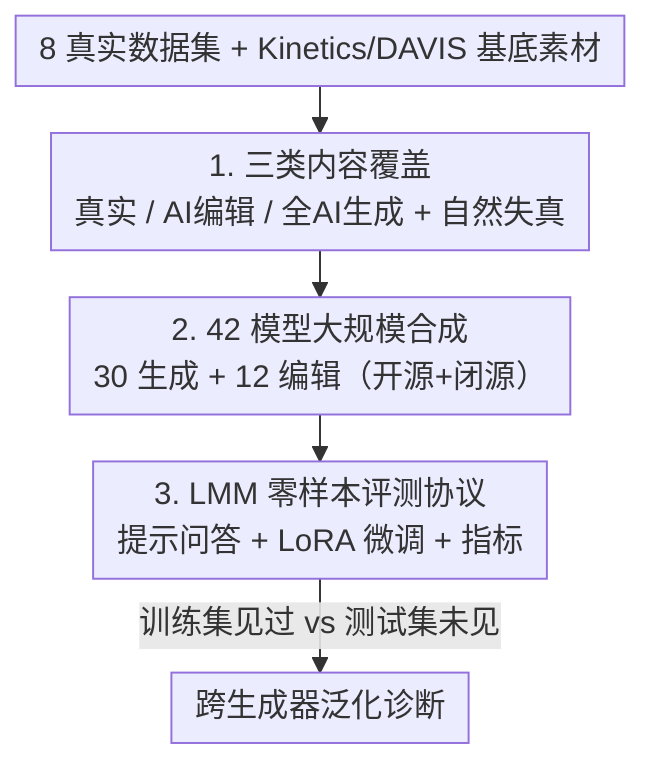

# FVBench: Benchmarking Deepfake Video Detection Capability of Large Multimodal Models

**会议**: CVPR 2026  
**论文**: [CVF Open Access](https://openaccess.thecvf.com/content/CVPR2026/html/Wang_FVBench_Benchmarking_Deepfake_Video_Detection_Capability_of_Large_Multimodal_Models_CVPR_2026_paper.html)  
**代码**: https://github.com/IntMeGroup/FVBench  
**领域**: AI安全 / 深度伪造检测  
**关键词**: 深度伪造视频检测, 大多模态模型, 跨生成器泛化, 评测基准, 零样本检测  

## 一句话总结
FVBench 构建了目前最大的深度伪造视频检测基准（12 万+视频、42 个 SOTA 生成/编辑模型、真实/AI编辑/全AI生成三类内容），并第一次系统评测大多模态模型（LMM）的辨伪能力，得出核心结论：检测的真正难点不是在已知伪造上做监督训练，而是对**未见生成器**的零样本/跨生成器泛化。

## 研究背景与动机
**领域现状**：随着 Sora、Kling、Hailuo 等视频生成模型把 AI 视频的真实度推到新高度，深度伪造视频检测成了刚需。传统检测器（CNN / 3D 卷积 / Transformer）通常在某个固定数据集上监督训练，去识别该数据集里特定的伪造痕迹。

**现有痛点**：作者指出现有数据集/基准有三个硬伤。其一是**内容多样性窄**——绝大多数数据集只盯人脸伪造，忽略了非人脸的通用视频操纵，而且几乎都采用"非真即假"的二分范式，缺少只改局部区域的**部分 AI 编辑**视频；它们的真实视频还往往是干净无损的，缺少现实世界常见的压缩、运动模糊等自然失真。其二是**生成模型覆盖少**——只用少数几个、且常常过时的生成器，导致检测器学到的是"某个模型的指纹"而非通用的伪造特征，遇到新模型就失效。其三是**评测对象受限**——现有基准基本只测专用检测器，而 LMM 在辨伪上的潜力几乎没人系统测过。

**核心矛盾**：检测器在"拟合已知生成器的痕迹"和"泛化到未知生成器"之间存在根本张力。数据集越窄、生成器越老，越容易把模型训成只会背指纹的专才。

**本文目标**：造一个足够大、足够多样、同时覆盖真实/编辑/生成三类内容，并能同时评测传统检测器与 LMM 的基准，进而把"检测到底难在哪"这个问题量化清楚。

**切入角度**：作者观察到 LMM 在人脸识别、目标检测、视频描述等任务上展现了很强的零样本泛化，于是假设——LMM 这种"不靠任务特定微调也能理解内容"的能力，恰好可能是抵御不断涌现的新生成器的关键。

**核心 idea**：用涵盖 42 个最新生成/编辑模型、12 万+视频的大规模基准，把传统检测器和 LMM 拉到同一标尺下零样本/跨生成器对比，从而揭示真正的瓶颈在泛化而非监督拟合。

## 方法详解

### 整体框架
FVBench 本质是一套"数据构建 + 评测协议"的基准。数据侧从 8 个公开真实视频数据集、Kinetics-400/DAVIS 基底素材出发，分别走真实采集、AI 编辑、AI 生成三条线，汇成一个 121,902 条视频（其中 62,357 条假视频）的三类内容库；评测侧再把传统检测器和 LMM 放进同一套零样本问答 + 微调 + 跨生成器的协议里跑。整条管线如下：

### 关键设计

**1. 三类内容覆盖 + 真实视频注入自然失真：让基准贴近真实部署场景**

针对"只盯人脸、非真即假、真实视频太干净"这三个痛点，FVBench 同时收纳**真实**、**部分 AI 编辑**、**全 AI 生成**三类通用内容。真实视频共 6 万条，刻意从 8 个不同任务的数据集采集（MSRVTT、KonVid、FineVD、WebVid、LSVQ、LIVEVQC、YouTubeUGC、LIVE-YT-Gaming），覆盖动作、UGC、游戏、流媒体等场景——关键是这些数据集天然带压缩伪影、噪声、运动模糊、网络失真等**自然退化**。这一点很重要：现有基准的真实视频往往是无损的，检测器可能学成"画面糊一点=真"的捷径，注入自然失真后才能逼出真正鲁棒的检测能力。"部分 AI 编辑"这一类则填补了二分范式的空白——只有局部区域被改的视频比整段全假更难辨，更符合现实里的"换背景/换物体"造谣方式。作者用五种快质特征（colorfulness、brightness、contrast、空间信息 SI、时间信息 TI）做分布分析，发现 AI 生成视频 SI/TI 最高（细节最"丰富"甚至过头），真实视频色彩度最高，AI 编辑视频特征落在两者之间，量化印证了三类内容确实可分又有重叠。

**2. 42 个 SOTA 生成/编辑模型的大规模合成 + 训练/测试错位划分：把"未见生成器"做成可控变量**

为了打破"生成器覆盖少→只会背指纹"的困境，FVBench 用 **30 个生成模型**（18 开源如 Wan2.1、CogVideoX1.5、VideoCrafter2、LTX、Latte；12 闭源如 Sora、Kling、Hailuo、Gen3、Pixverse）造全 AI 视频，**12 个扩散编辑模型**（Tune-A-Video、TokenFlow、CCEdit、ControlVideo、FateZero 等）造部分编辑视频，合计 42 个模型，是同类基准里覆盖最广的。AI 编辑流程也设计得很讲究：从 Kinetics-400 和 DAVIS 取 180 条基底（50% 人类动作、15% 动物、35% 其他），用 DeepSeek-R1 生成颜色/动作/背景/物体操作/风格五类编辑指令，并约束**保留约 60% 原始语义**以保证是"局部聚焦编辑"而非整段重画，最终得到 3,857 条有效编辑视频。最关键的是生成集的**训练/测试错位划分**：训练集用 2,750 条 prompt × 18 个开源模型，测试集用 300 条 prompt × 全部 30 个模型，于是测试集里那 12 个闭源生成器是训练时从未见过的。这种"训练只见开源、测试加入闭源"的设计，把跨生成器泛化做成了一个可控变量——既因为闭源生成成本高，也正是为了量化检测指标在**训练集未见生成器**上的可扩展性。

**3. 面向 LMM 的零样本评测协议 + LoRA 微调 + 跨生成器诊断：在同一标尺上量出"瓶颈在哪"**

要把传统检测器和 LMM 拉到一起比，需要统一的评测协议。指标用准确率 Acc 与 F1，其中 $\text{F1}=\frac{2\times\text{Precision}\times\text{Recall}}{\text{Precision}+\text{Recall}}$。传统检测器直接用公开预训练权重推理；LMM 则用基于提示的问答方式，为消除回答顺序偏置，作者交替使用两条指令——"这是真实视频还是生成视频？只回 A 或 B。A:真 / B:生成"与把 A/B 选项颠倒过来的版本，取一致判断。在零样本之外，作者还对两个 LMM 做 **LoRA 微调**（r=16、4:1 划分、5 epoch、余弦退火、lr 1e-5），以及对 Swin3D-T、InternVL2.5(8B) 等做**跨生成器训练-测试矩阵**（在 18 个开源生成器上训练、在全部 30 个生成器上测试）。正是这三件套——零样本基线、微调上限、跨生成器矩阵——把"检测难在哪"诊断得一清二楚：监督微调谁都能逼近 100%，零样本和跨未见生成器才是真瓶颈。

### 损失函数 / 训练策略
基准本身不引入新损失。微调端用标准 LoRA（r=16）在二分类（真/假）目标上训练 5 个 epoch，batch size 4，单张 40GB A6000，初始学习率 1e-5 + 余弦退火。跨生成器实验沿用同一二分类设置，只改变训练/测试所用的生成器子集。

## 实验关键数据

### 主实验：AI 生成子集上的零样本排行
下表给出 AI 生成视频子集（30 个生成器平均）的零样本整体准确率。可见**专用检测器一旦换到未见生成器就崩**（DeMamba 整体只有 3.30%，几乎把所有假视频判成真），而部分 LMM 反而更稳，InternLM-XComposer2.5(7B) 零样本拿到最高的 92.98%。

| 方法（零样本） | 类型 | AI生成整体 Acc | 备注 |
|--------|------|------|------|
| InternLM-XComposer2.5 (7B) | 开源 LMM | **92.98%** | 零样本最佳 |
| ResNet3D-18 | 传统（已训练） | 80.85% | 依赖训练分布 |
| Qwen2.5-VL (3B) | 开源 LMM | 79.67% | 小模型反而强 |
| Llama3.2-Vision (11B) | 开源 LMM | 77.09% | — |
| Gemini1.5-pro | 闭源 LMM | 71.15% | — |
| GPT-4o | 闭源 LMM | 49.86% | 接近随机 |
| DeMamba | 传统（已训练） | 3.30% | 偏向真、对未见假崩溃 |
| 全模型零样本平均 | — | 59.82% | 整体仅略高于随机 |

### 微调上限 vs 零样本：核心结论的证据
同一批模型一旦在任务上微调（LoRA / 全量），传统检测器和 LMM 几乎都冲到 100%；而零样本时差距巨大。这组对比直接支撑了论文的核心论断——难的不是监督拟合，而是泛化。

| 模型 | 零样本（AI生成整体） | 微调后（AI生成整体） |
|------|------|------|
| Swin3D-T | 65.04% | 100.0% |
| ResNet3D-18 | 80.85% | 100.0% |
| AIGVDet | 57.12% | 99.59% |
| InternVL2.5 (8B) | 70.97% | 100.0% |
| InternVL3 (9B) | 73.79% | 100.0% |

### 关键发现
- **瓶颈在跨生成器泛化**：跨生成器矩阵里，模型在训练见过的生成器上准确率近 100%（对角线），换到未见生成器（尤其 12 个闭源）就大幅滑落——这是全文最重要的实证信息，把研究焦点从"监督性能"拨向"零样本/跨生成器泛化"。
- **专用检测器偏置严重**：DeMamba 在真实子集整体高达 97.03%、却在 AI 生成子集只有 3.30%，说明它学成了"倾向判真"的捷径，完全不能泛化到 AI 生成内容。
- **LMM 规模并非越大越好**：Qwen2.5-VL(3B)、InternLM-XComposer2.5(7B) 等中小模型零样本反超很多更大的模型（如 InternVL3-78B、Qwen2.5-VL-72B），辨伪能力与参数量不单调相关。
- **编辑类型难度有别**：AI 编辑五类中，风格变化最易检（整体改动明显），**动作编辑最难**（针对单个物体外观的细微改动），说明物体级细微操纵是检测的薄弱点。
- **真实视频的失真会干扰**：检测器在结构化数据集（LIVEVQC、LSVQ）上表现好，在 LIVE-YT-Gaming 这类内容上挣扎，对带自然退化的真实视频更易误判。

## 亮点与洞察
- **把"未见生成器"做成可控变量**：训练只用 18 个开源、测试加入 12 个闭源的错位划分，是这套基准最巧的地方——它让"跨生成器泛化"从一句口号变成可量化的对角线 vs 非对角线对比，任何后续方法都能在同一坐标系里报泛化数字。
- **第一次把 LMM 拉进辨伪擂台**：用顺序交替的提示问答消偏，统一了 LMM 与传统检测器的评测口径，发现 LMM 零样本反而比专用检测器稳——这对"要不要继续堆专用检测器"是个有价值的反直觉信号。
- **真实视频注入自然失真**：这个看似不起眼的取数策略，实际堵住了"清晰=真"的捷径，提高了基准的鉴别力，是可直接迁移到其他伪造检测基准的设计经验。

## 局限与展望
- **闭源生成器只进测试集**：因成本只能让 12 个闭源模型出现在测试侧，训练侧的开源/闭源分布不平衡，可能让某些跨生成器结论带上"开源→闭源"的特定迁移色彩。
- **评测以二分类为主**：基准核心是真/假判别，对"伪造定位""可解释判别"等更细粒度任务覆盖有限（论文也提到 explainable detection 是另一条线）。
- **LMM 提示设计敏感**：零样本结果依赖具体 prompt，虽做了顺序交替消偏，但不同指令措辞仍可能显著影响排名，泛化结论需谨慎对待。
- **改进思路**：在此基准上探索"频域/时空不一致性"等通用伪造线索的检测器，或用基准的跨生成器划分直接训练面向未见生成器的泛化目标，会是自然的下一步。

## 相关工作与启发
- **vs FaceForensics++ / DF40 等人脸伪造数据集**：它们聚焦人脸、生成器少且偏旧；FVBench 做通用内容、42 个最新生成/编辑模型、含部分编辑与自然失真，规模与多样性都明显更大。
- **vs IVY-FAKE / GVD 等通用 AI 视频基准**：同为通用内容，但 FVBench 在模型覆盖（42 vs 22 等）、视频总量（121,902）、以及"同时评测传统检测器与 LMM + 跨生成器诊断"的评测框架上更完整。
- **vs DeMamba / AIGVDet 等专用检测器工作**：它们提出更强的专用检测架构；FVBench 不提新检测器，而是用统一标尺揭示这些专用器的零样本泛化短板，把问题从"造更强检测器"重新框定为"造能泛化到未见生成器的检测器"。

## 评分
- 新颖性: ⭐⭐⭐⭐ 首个系统评测 LMM 辨伪能力、覆盖 42 模型的最大视频伪造基准，框架新但单点技术创新有限
- 实验充分度: ⭐⭐⭐⭐⭐ 真实/编辑/生成三子集 + 零样本/微调/跨生成器全覆盖，模型与表格极其丰富
- 写作质量: ⭐⭐⭐⭐ 动机与结论清晰，核心论断有强证据支撑
- 价值: ⭐⭐⭐⭐⭐ 把检测瓶颈量化为跨生成器泛化，为后续方法提供了统一标尺与方向

<!-- RELATED:START -->

## 相关论文

- [\[CVPR 2026\] Omni-Fake: Benchmarking Unified Multimodal Social Media Deepfake Detection](omni-fake_benchmarking_unified_multimodal_social_media_deepfake_detection.md)
- [\[CVPR 2026\] AVFakeBench: A Comprehensive Audio-Video Forgery Detection Benchmark for AV-LMMs](avfakebench_a_comprehensive_audio-video_forgery_detection_benchmark_for_av-lmms.md)
- [\[CVPR 2026\] X-AVDT: Audio-Visual Cross-Attention for Robust Deepfake Detection](x-avdt_audio-visual_cross-attention_for_robust_deepfake_detection.md)
- [\[CVPR 2026\] DeepfakeImpact: A Two-Stage Benchmark with Real-World Impact in Deepfake Detection](deepfakeimpact_a_two-stage_benchmark_with_real-world_impact_in_deepfake_detectio.md)
- [\[CVPR 2026\] RunawayEvil: Jailbreaking the Image-to-Video Generative Models](runawayevil_jailbreaking_the_image-to-video_generative_models.md)

<!-- RELATED:END -->
