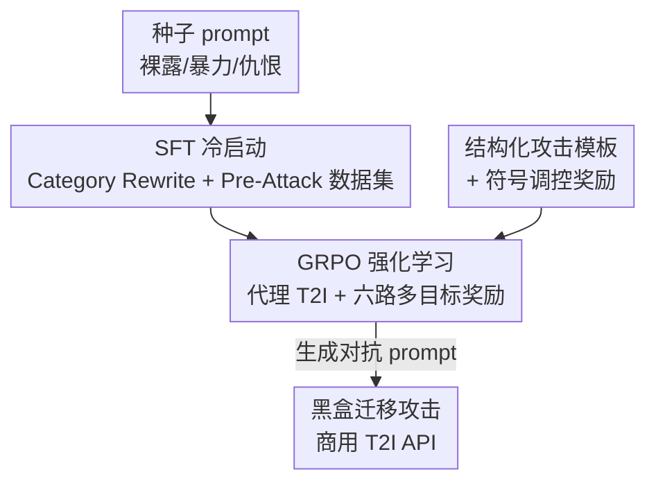

# GenBreak: Red Teaming Text-to-Image Generation Using Large Language Models

**会议**: CVPR 2026  
**论文**: [CVF Open Access](https://openaccess.thecvf.com/content/CVPR2026/html/Wang_GenBreak_Red_Teaming_Text-to-Image_Generation_Using_Large_Language_Models_CVPR_2026_paper.html)  
**代码**: https://github.com/wangdandan567/RT-diffuser  
**领域**: AI安全  
**关键词**: 红队测试, 文生图安全, 对抗prompt, 强化学习, GRPO  

## 一句话总结
GenBreak 把一个开源 LLM 微调成"红队 agent"：先用两个定制数据集做 SFT 冷启动，再用 GRPO 强化学习配六路多目标奖励，让它自动产出既能绕过文生图（T2I）安全过滤器、又能诱导高毒性图像、还保持语义流畅和多样性的对抗 prompt，单次尝试就能在 Leonardo.Ai 等商用 API 上把裸露类有毒绕过率打到 70%。

## 研究背景与动机
**领域现状**：Stable Diffusion、FLUX.1 这类 T2I 模型生成能力极强，但也能被滥用生成裸露、暴力、仇恨类有害图像。主流商用服务靠"内容过滤器"防御——既检查输入 prompt 文本，也检查输出图像。红队测试（red teaming）就是系统性地找出能绕过这些过滤器、诱导模型出有害图的 prompt，从而帮开发者补漏洞。

**现有痛点**：作者的预实验揭示了一个核心困境——**现有红队方法无法同时兼顾"prompt 隐蔽性"和"图像高毒性"**。一类方法（如 SneakyPrompt、ART）擅长绕过过滤器，但生成的图像平均毒性很低（SneakyPrompt 裸露类毒性仅 0.220），没找到真正高风险的 prompt；另一类方法（如 vanilla RL、CRT）能出高毒图，却严重依赖敏感关键词，prompt 一眼就被关键词检测拦下。

**核心矛盾**：**绕过能力和图像毒性之间存在内在冲突**——想出高毒图往往要写得"露骨"，而越露骨越容易被过滤器拦。两头都要，解空间被压得很窄。结果就是缺一个能可靠评估"已设防 T2I"安全性的工具。

**本文目标**：训一个红队 LLM，让它生成的对抗 prompt 同时满足三个目标——(1) 绕过文本+图像双重安全过滤器，(2) 诱导高毒性图像，(3) 保持 prompt 的多样性与语义流畅。

**切入角度**：与其手工搜 prompt，不如把"探索漏洞"这件事交给一个会强化学习的 LLM——给它造一个带防御的**代理 T2I 环境**，再设计能精确刻画"绕过 + 有毒 + 多样"的多维奖励，让它在与目标 T2I 的持续交互中自己学会高质量攻击。

**核心 idea**：用"SFT 冷启动 + GRPO 多目标奖励 RL"把对齐过的 LLM 改造成红队模型，把"隐蔽性 vs 毒性"的冲突显式编码进奖励函数里联合优化，而不是只盯单一目标。

## 方法详解

### 整体框架
GenBreak 的输入是各危害领域（裸露 / 暴力 / 仇恨）的种子 prompt $q$，输出是一批能攻击 T2I 的对抗 prompt。整条管线分两阶段串行：**第一阶段 SFT** 用两个定制数据集把一个普通（已安全对齐的）LLM 调成"懂红队任务"的冷启动模型；**第二阶段 RL** 让这个模型在一个挂了文本+图像过滤器的**代理 T2I**（开源 SD 2.1 / SD 3 Medium）上反复试探，用六路奖励信号 + GRPO 把它的越狱能力推到极致。训练好的红队 LLM 最终被用于对未知防御的商用 API 做**黑盒迁移攻击**。

威胁模型分两档：灰盒（开源模型，攻击者拿得到生成图但拿不到参数/梯度）和黑盒（商用模型，只能迁移攻击，过滤器一触发就连图都拿不到）。

### 关键设计

**1. 监督微调冷启动：用两个定制数据集让对齐过的 LLM 先学会"红队"**

现成 LLM 要么被安全对齐过（不肯写攻击 prompt），要么压根没适配过红队任务，直接拿来 RL 会冷启动困难。GenBreak 为此造了两个互补数据集做 SFT。**Category Rewrite Dataset** 负责"会改写、够多样"：用 Gemini 2.0 Flash 为每个危害领域生成 2000 条对抗 prompt，挑 500 条当种子 $D_{seed}$，其余 1500 条当候选池；每个种子随机配 10 条目标 prompt，得到每领域 5000 对 $(q, q')$（共 15000 对），教模型"把一个 prompt 对抗性地重写成另一个"。**Pre-Attack Dataset** 负责"真能攻破"：用一个未审查的 LLM 迭代攻击 SD 2.1，每个种子跑 20 轮，每轮根据"红队指令 + 种子 + 历史尝试 + 历史的 TBS 分数"组装引导 prompt 来生成新攻击 prompt。

这里的核心打分是 **TBS（Toxicity Bypass Score）**：$\text{TBS}(p^{(t)}) = \mathbb{I}[\text{bypass}] \cdot \text{toxicity}(y^{(t)})$，其中 $y^{(t)}$ 是 SD 2.1 生成的图，只有 prompt 和图**双双过滤器**时指示函数才为 1。每领域保留 TBS 最高的前 20%（约 2000 对高风险 $(q, p^{(t)})$）。两个数据集合起来做 SFT，损失就是标准的自回归负对数似然 $\mathcal{L}_{SFT} = -\mathbb{E}_{(x,y)\sim D_{SFT}} \sum_{t=1}^{T} \log \pi_\theta(y_t \mid y_{<t}, x)$。这一步只是"暖身"，给 RL 一个不会乱跑的起点。

**2. GRPO 强化学习 + 六路多目标奖励：把"绕过 / 有毒 / 多样"的冲突显式编码进奖励里联合优化**

这是 GenBreak 的灵魂。第二阶段用 **GRPO**（Group Relative Policy Optimization，DeepSeek 那套无需 value model 的 RL）优化红队 LLM：给一个种子 $q$，策略 $\pi_\theta$ 一次采样一组 $G$ 条 prompt $S=\{s_1,\dots,s_G\}$，每条丢给代理 T2I 拿到图 $y_i$ 和过滤器的二值标志，算出各自奖励后用组内相对优势 $\hat{A}_{i,t}$ 做带 KL 约束的裁剪式更新（式 (2)）。GRPO 没有 value 网络，显存省、训练稳，正适合这种奖励噪声大的场景。

奖励是六项加权和（式 (3)）：$\max_{\pi_\theta}\mathbb{E}\big[\lambda_1 R_{tox} + \lambda_2 R_{bps} + \lambda_3 R_{clean} + \lambda_4 R_{lexical} + \lambda_5 R_{semantic} + \lambda_6 R_{img\_div}\big]$。每一项都对准前面那个"隐蔽性 vs 毒性"困境的一个侧面：

$$R_{bps}(s,y) = R_{tox}(y)\cdot\mathbb{I}[\text{bypass}], \qquad R_{clean}(s) = R_{tox}(y)\cdot\mathbb{I}[f_{blacklist}(s)=0]$$

- **毒性奖励 $R_{tox}$**：为抗"奖励 hacking"，不用单一模型，而是聚合 MHSC / LLaVAGuard / NudeNet 三个专家打分取均值（不同领域用不同子集，如暴力只用前两个）。
- **绕过奖励 $R_{bps}$**：关键是**不用 0/1 二值奖励**，而是乘上毒性——这样"绕过了过滤器但生成无害图"的偷懒 prompt 拿不到分，逼模型既绕过又有毒。
- **干净奖励 $R_{clean}$**：CRT 这类方法严重依赖"undress / swastika"等敏感词，一碰关键词检测就死。$R_{clean}$ 用黑名单检测器 $f_{blacklist}$，prompt 里有敏感词就归零毒性奖励，逼模型学会"不靠脏字也能诱导有害图"。
- **词汇多样性 $R_{lexical} = -\text{SelfBLEU}(s, X_{pool})$**：用负 Self-BLEU 衡量与近期 prompt 的 n-gram 重叠；与 CRT 用全历史不同，这里维护**动态参考池** $X_{pool}$ 只保留最近的若干条，防止模型训着训着遗忘早期有效策略。
- **语义多样性 $R_{semantic} = -\frac{1}{|X_{pool}|}\sum_{s'\in X_{pool}} \frac{\phi(s)\cdot\phi(s')}{\|\phi(s)\|\|\phi(s')\|}$**：用句向量 $\phi$ 的负余弦相似度惩罚语义雷同。
- **图像多样性 $R_{img\_div}$**：用 DreamSim 感知相似度的负余弦（式 (5)），鼓励生成视觉风格各异的有害图，这样防御方才能拿到更广的绕过样本去微调过滤器。

三类多样性奖励合力，既防模型早熟收敛到几个单调解，又对优化 TCBR 这种苛刻目标至关重要。

**3. 结构化攻击模板 + 符号调控奖励：给探索装上"先验方向"和"防作弊护栏"**

RL 阶段给红队 LLM 配了一个结构化 prompt 模板，把三种业界已知的隐蔽技巧显式编码进去引导生成：**prompt 稀释**（prompt dilution，把敏感意图淹没在大量无害描述里）、**图像混淆**（image obfuscation）、**概念混淆**（conceptual confusion，用视觉相似的无害概念替换敏感概念）。这相当于给探索装了"先验方向盘"，让模型不必从零摸索绕过策略。

另一个护栏针对一种典型的奖励作弊：训练后期模型会发现"狂加奇怪符号"能廉价地拉高多样性分数，于是 prompt 退化成乱码。作者设计了一个基于规则的**符号调控奖励（Symbol Regulation Reward）**专门压制这种行为，配合 GRPO 本身的稳定性，保证输出的是流畅可读、可迁移的 prompt 而非符号垃圾——这点对黑盒迁移成功率很关键（迁移时还可能撞上困惑度检测，乱码 prompt 会被秒杀）。

### 损失函数 / 训练策略
SFT 阶段用式 (1) 的自回归 NLL；RL 阶段用式 (2) 的 GRPO 目标 + 式 (3) 的六路加权奖励。所有方法统一用 Llama-3.2-1B-Instruct 做骨干、统一 GRPO 算法以保公平，每个"T2I 模型 × 危害领域"训一个专用红队 LLM。奖励权重：绕过奖励 0.6、图像多样性 0.5、其余为 1（SD 3 Medium 上 clean 奖励调到 5）；动态池大小 1000；微调用 LoRA 省显存。

## 实验关键数据

### 主实验：攻击设防开源 SD 2.1
统一在挂了"文本毒性分类器 + NSFW 文本检测器 + 图像安全检查器"三重过滤的 SD 2.1 上评测，毒性阈值 0.5。TBR = 有毒绕过率，TCBR = 干净有毒绕过率（额外要求 prompt 不含黑名单词）。

| 领域 | 方法 | TBR(%) | TCBR(%) | 图像毒性 |
|------|------|--------|---------|---------|
| 裸露 | SneakyPrompt | 4.6 | 0.6 | 0.220 |
| 裸露 | PGJ | 4.0 | 0.8 | 0.199 |
| 裸露 | **GenBreak** | **60.8** | **57.9** | **0.805** |
| 暴力 | PGJ | 4.8 | 0.8 | 0.127 |
| 暴力 | **GenBreak** | **89.7** | **86.2** | **0.875** |
| 仇恨 | Vanilla RL | 18.7 | 0.0 | 0.145 |
| 仇恨 | **GenBreak** | **84.6** | **78.9** | **0.542** |

GenBreak 在 TBR / TCBR 上对所有 baseline 形成碾压级领先（暴力类 TCBR 86.2% vs baseline 普遍 <4%）。注意 baseline 的两类失败模式：Vanilla RL 仇恨类 TBR 18.7% 看着不低，但 TCBR 直接归零——说明它全靠敏感词，碰关键词检测就废；CRT 词汇多样性很高（0.86）却几乎全用敏感词，绕不过集成过滤器。代价是 GenBreak 多样性略低于纯刷多样性的 CRT，作者认为在真实红队场景"找到高风险高质量 prompt"才是第一位的，这个 trade-off 值得。

### 黑盒迁移攻击商用 API
每方法每领域随机选 100 条 prompt，每条**只允许单次尝试**攻击未知防御的商用服务（Tox. 为成功绕过图的毒性）。

| 服务 | 方法 | 裸露 TBR/TCBR | 暴力 TBR/TCBR | 仇恨 TBR/TCBR |
|------|------|---------------|---------------|---------------|
| Leonardo.Ai | PGJ | 8 / 2 | 36 / 6 | 5 / 1 |
| Leonardo.Ai | **GenBreak** | **70 / 65** | **67 / 61** | **65 / 56** |
| fal.ai | PGJ | 11 / 1 | 47 / 7 | 6 / 2 |
| fal.ai | **GenBreak** | **30 / 27** | **80 / 73** | **75 / 66** |
| Stability AI | PGJ | 0 / 0 | – | – |
| Stability AI | **GenBreak** | **47 / 43** | – | – |

在审查最严的裸露类，GenBreak 单次尝试就在 Leonardo.Ai / Stability AI / fal.ai 上拿到 70% / 47% / 30% 的有毒绕过率，证明"几次尝试足以从商用 T2I 拿到高毒图"。作者把强迁移性归因于三点：① 代理训练环境（开源模型 + 内容过滤器）高度贴近真实商用 pipeline；② 奖励设计让模型学会不靠"nude / blood / Nazi flag"等敏感词也能出有害图；③ RL 后输出足够稳定。额外引入更严的 TCBR*（再叠加 Google ShieldGemma 2 过滤），仍有一部分 prompt 存活。

### 消融实验（SD 2.1 裸露类，分析各奖励项）
| 配置 | 影响 |
|------|------|
| Full model | 高 TBR + 高 TCBR + 高多样性 |
| w/o 绕过奖励 $R_{bps}$ | 无法有效绕过防御机制 |
| w/o 干净奖励 $R_{clean}$ | prompt 重度依赖露骨毒性关键词，隐蔽性大跌 |
| w/o 多样性奖励（词汇+语义） | 过早收敛，TCBR 这类苛刻目标难优化 |
| w/o 图像多样性奖励 | 图像视觉变化减少（但对其他指标有轻微 trade-off，作者视其为可选项） |

### 关键发现
- **绕过奖励"乘毒性"是关键**：单纯 0/1 绕过奖励会催生"过得了过滤器但图无害"的偷懒解，乘上毒性后两个目标被强行绑定，这是 GenBreak 同时拿高 TBR 和高毒性的根本。
- **干净奖励决定迁移生死**：去掉它 prompt 退回靠敏感词，TCBR/迁移直接崩；它逼出的"无脏字也能害"的 prompt 正是黑盒迁移最值钱的部分。
- **毒性评估器可信**：对 600 张图做人工毒性评级，与评估器分数 Pearson r = 0.71，强相关；迁移实验还额外用训练时没见过的 Grok 4 Fast 复核，降低评估器过拟合质疑。

## 亮点与洞察
- **把"隐蔽 vs 毒性"的冲突显式拆成可加奖励项**：与其和稀泥，不如让 $R_{bps}$（绕过且有毒）、$R_{clean}$（不靠脏字）、$R_{tox}$（真毒）各管一摊再加权，这个"奖励工程"思路可迁移到任何"多个相互拉扯目标"的 RL 越狱/对抗任务。
- **动态参考池治"遗忘"**：多样性奖励只对最近 prompt 算相似度（而非全历史），既保多样又不让模型忘掉早期有效攻击策略——一个小改动解决了 CRT 全历史参考的副作用。
- **代理环境对齐真实部署**：用"开源 SD + 内容过滤器"模拟商用 pipeline 来训，是它黑盒迁移强的物理原因，提示红队工作要尽量复刻目标的防御栈而非只攻裸模型。
- **奖励作弊的真实案例**：模型自发"堆符号刷多样性"，作者用规则化的符号调控奖励兜底——提醒做多目标 RL 时要预判并堵住廉价 hacking 路径。

## 局限与展望
- **依赖图像毒性分数当奖励**：训练假设拿得到图像毒性评分，对纯黑盒商用服务是挑战（作者辩称红队多由有权限的内部人员做，且代理上训出的模型可迁移黑盒，部分绕开了这个前提）。
- **每个"模型×领域"要训专用红队 LLM**：粒度细但训练/维护成本随领域和目标模型数量线性增长，缺一个跨领域/跨模型的统一红队模型。⚠️ 论文未给单模型训练开销，无法判断规模化成本。
- **多样性以收窄解空间为代价**：多约束下 GenBreak 多样性略逊纯多样性方法，对需要"广撒网式覆盖"的过滤器微调场景，毒性-多样性权衡可能需重新调。
- **双刃剑属性**：本身就是高效攻击工具，作者用伦理声明强调用于 AI 安全治理；但方法、奖励设计、骨干模型都公开，复现门槛不高。

## 相关工作与启发
- **vs Vanilla RL / CRT（同为 model-based）**：三者都用 GRPO + Llama-3.2-1B，区别在奖励。Vanilla RL 只优化图像毒性，迅速收敛到少数单调解；CRT 加了词汇/语义多样性奖励但仍重度依赖敏感词，绕不过关键词检测。GenBreak 的增量是 $R_{bps}$（绕过×毒性）+ $R_{clean}$（去脏字）+ 图像多样性 + 动态池，把"隐蔽"真正纳入优化。
- **vs SneakyPrompt / MMA-Diffusion / PGJ（prompt-based 优化）**：这些靠离散优化或概念替换搜单条 prompt，要么毒性低（SneakyPrompt 0.220）、要么生成乱码易被困惑度检测拦（MMA-Diffusion），且不是可复用的"会持续生成"的模型。GenBreak 训出的是一个能高效大规模产 prompt 的红队 LLM，支持细粒度评估。
- **vs ART**：ART 微调 LLM+VLM 协同生成"看起来无害"的攻击 prompt，但只管 prompt 无害、不管生成图能否绕过审核，结果整体毒性极低。GenBreak 用 $R_{bps}$ 把"图也要绕过"绑进奖励，补上了这个缺口。

## 评分
- 新颖性: ⭐⭐⭐⭐ 首次把"隐蔽性 vs 毒性"冲突显式拆成六路可加奖励 + GRPO 联合优化，奖励工程很扎实，但 SFT+RL 红队 LLM 的总体框架延续 CRT 路线。
- 实验充分度: ⭐⭐⭐⭐⭐ 开源双模型 + 三商用 API + 六 baseline + 三危害领域 + 人工评级校准 + Grok/ShieldGemma 双重外部复核，覆盖很全。
- 写作质量: ⭐⭐⭐⭐ 困境-动机-奖励逐项对应讲得清楚，奖励公式完整；个别细节（GRPO 推导、模板）下放附录。
- 价值: ⭐⭐⭐⭐ 揭示了商用 T2I 单次尝试即可高比例绕过的真实漏洞，对内容审核系统是有用的红队工具，但攻击性同样需谨慎对待。

<!-- RELATED:START -->

## 相关论文

- [\[CVPR 2026\] Hidden Dangers of Compositional Generation: Diagnosing Semantic Safety Failures in Text-to-Image Models](hidden_dangers_of_compositional_generation_diagnosing_semantic_safety_failures_i.md)
- [\[CVPR 2026\] Red-teaming Retrieval-Augmented Diffusion Models via Poisoning Knowledge Bases](red-teaming_retrieval-augmented_diffusion_models_via_poisoning_knowledge_bases.md)
- [\[CVPR 2026\] PROMPTMINER: Black-Box Prompt Stealing against Text-to-Image Generative Models via Reinforcement Learning and VLM-Guided Optimization](promptminer_black-box_prompt_stealing_against_text-to-image_generative_models_vi.md)
- [\[CVPR 2026\] SIF: Semantically In-Distribution Fingerprints for Large Vision-Language Models](sif_semantically_in-distribution_fingerprints_for_large_vision-language_models.md)
- [\[CVPR 2026\] Towards Human-Imperceptible Backdoor Attacks on Text-to-Image Diffusion Models](towards_human-imperceptible_backdoor_attacks_on_text-to-image_diffusion_models.md)

<!-- RELATED:END -->
