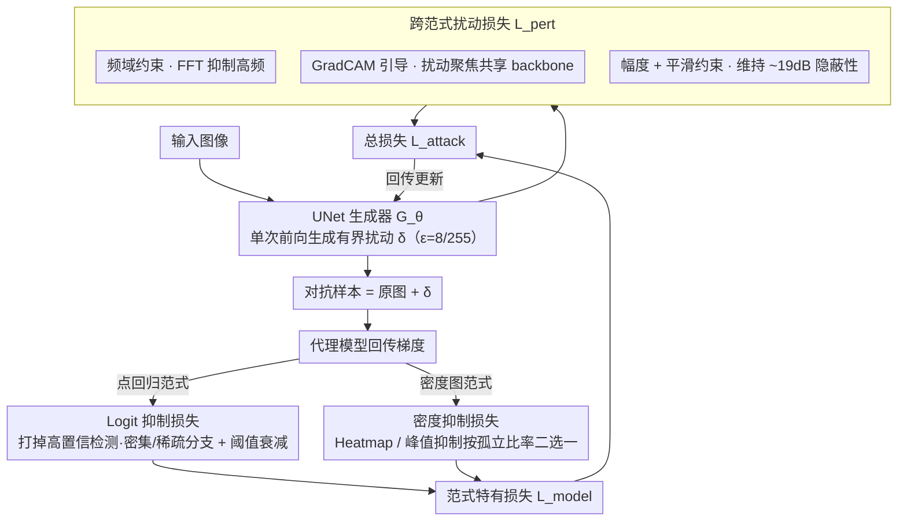

# Generative Adversarial Perturbations with Cross-paradigm Transferability on Localized Crowd Counting

**会议**: CVPR 2026  
**arXiv**: [2603.24821](https://arxiv.org/abs/2603.24821)  
**代码**: [https://github.com/simurgh7/CrowdGen](https://github.com/simurgh7/CrowdGen)  
**领域**: AI Safety / 对抗攻击  
**关键词**: 对抗攻击, 人群计数, 跨范式可迁移性, 生成对抗扰动, 黑盒攻击

## 一句话总结
提出首个跨范式（密度图 + 点回归）对抗攻击框架 CrowdGen，利用轻量级 UNet 生成器和多任务损失（logit 抑制 + 密度抑制 + GradCAM 引导 + 频域约束），在保持视觉隐蔽性（~19dB PSNR）的同时实现对七个 SOTA 人群计数模型的高迁移率（TR 最高 1.69），攻击 MAE 平均提升 7 倍。

## 研究背景与动机
定位化人群计数广泛应用于公共安全、零售分析和流行病跟踪等场景，目前主流方案分为两大范式：**密度图方法**（如 SASNet、FIDTM）通过回归空间密度分布再后处理提取定位，以及**点回归方法**（如 P2PNet、PET）端到端输出坐标和置信度。

现有对抗攻击存在以下痛点：

**攻击强度与隐蔽性矛盾**：PAP、GE-AdvGAN 视觉质量好（PSNR≥22dB）但攻击弱（MAE<120）；DiffAttack 攻击强（MAE=414）但视觉塌陷（PSNR=11.5dB）

**单范式局限**：已有可迁移攻击（APAM、PAP）仅在密度图方法间迁移，未考虑跨范式（密度图 ↔ 点回归）

**黑盒场景需求**：实际部署的人群计数系统通常是黑盒的，需要基于代理模型的迁移攻击

核心 idea：利用两种范式共享的 backbone 特征空间（如 VGG-16, ResNet-50）的归纳偏置，通过范式特有的攻击损失 + 范式无关的感知约束，学习一个统一的生成式扰动器。

## 方法详解

### 整体框架

这篇论文要攻击的是定位化人群计数，难点在于密度图和点回归两种范式的输出形式完全不同，过去的可迁移攻击只能在单一范式内部生效。CrowdGen 的做法是训练一个轻量级 3 层 UNet 生成器 $G_\theta$，把输入图像直接映射成有界扰动 $\delta$（上限 $\epsilon=8/255$），叠加到原图即得对抗样本。训练时用代理模型回传梯度，总损失拆成两块——只针对某一范式的**范式特有损失** $\mathcal{L}_{model}$，以及对两种范式都通用、专门提升迁移性的**跨范式扰动损失** $\mathcal{L}_{pert}$；推理时单次前向就能生成扰动，不必对每张图迭代优化。

### 关键设计

**1. Logit 抑制损失：让点回归模型漏掉高置信检测**

点回归模型（P2PNet、PET 等）端到端输出每个点的坐标和置信度，要把人数压下去，最直接的办法就是打掉那些高置信检测。损失锁定集合 $\mathcal{P}_{high} = \{i : s_i^{(h)} > \tau\}$，并按场景密度分两支：密集场景（$C_{gt} > C_{sparse}$）直接最小化高置信区域的 logit 值，稀疏场景（$C_{gt} \le C_{sparse}$）则对置信边界附近的检测加权惩罚，避免在本就稀疏的点上浪费扰动预算。阈值还会随训练自适应衰减 $\tau(t) = \max(\tau_{min}, \tau_{max} - \nu \cdot t / T_{max})$，越到后期门槛越低、攻击面越大，逐步把中等置信的检测也纳入打击范围。

**2. 密度抑制损失：把密度图的峰值和聚集区一起抹平**

密度图模型（SASNet、FIDTM 等）回归的是空间密度分布、定位靠后处理找峰值，因此攻击要同时压制显著峰值和阈值附近的过渡区。Heatmap 抑制 $\mathcal{L}_{hmap}$ 用 $3\times3$ max-pooling 检测局部极大值，并以自适应阈值 $\phi = \phi' \cdot \max(\mathcal{D})$ 把前景从背景里分出来后整体压低；峰值抑制 $\mathcal{L}_{peak}$ 则额外引入峰值 prominence（峰值与局部邻域的差值），专门针对孤立的高密度聚集区。两者不是同时上，而是按孤立比率（$5\times5$ 窗口内无邻近峰的比例是否 $>0.7$）自动二选一——聚集区孤立就用 peak，连成片就用 hmap。

**3. 跨范式扰动损失：用范式无关的约束撬动迁移性**

前两个损失依赖代理模型，要让扰动迁移到黑盒目标，还得靠一组不绑定具体范式的约束。频域约束 $\mathcal{L}_{freq}$ 通过 FFT 抑制扰动的高频分量，利用人群场景低频主导的统计特性，让扰动落在更容易跨模型迁移的频带上；GradCAM 引导 $\mathcal{L}_{cam}$ 把扰动集中到共享 backbone（VGG-16、ResNet-50）认为语义重要的区域，最小化注意力区域之外的扰动能量；幅度约束 $\mathcal{L}_{hinge}$ 用 L2 范数限制总能量，空间平滑正则 $\mathcal{L}_{tv}$ 用总变差减少扰动伪影，二者共同维持 ~19dB 的视觉隐蔽性。

### 损失函数 / 训练策略
总损失 $\mathcal{L}_{attack} = \alpha \cdot \mathcal{L}_{model} + \beta \cdot \mathcal{L}_{hinge} + \gamma \cdot \mathcal{L}_{tv} + \zeta \cdot \mathcal{L}_{freq} + \kappa \cdot \mathcal{L}_{cam}$

- 扰动上限 $\epsilon = 8/255$，图像尺寸 512×512
- 使用 cosine annealing 调整学习率
- 超参通过验证集网格搜索：$\beta=0.01, \gamma=0.05, \zeta=0.01, \kappa=0.5$

## 实验关键数据

### 主实验（跨模型迁移性，SHHA 数据集）

| 代理模型 → 目标模型 | MAE / TR | 说明 |
|---------|---------|------|
| HMoDE → P2PNet | 420.71 / **1.69** | 跨范式超迁移：比白盒自身还强 |
| FIDTM → P2PNet | 426.89 / 1.64 | 密度图→点回归 强迁移 |
| SASNet → APGCC | 397.96 / 1.32 | 密度图→点回归 |
| P2PNet → SASNet | 281.00 / 0.89 | 点回归→密度图 |
| APGCC → HMoDE | 171.53 / **0.55** | 最弱迁移但 MAE 仍翻倍 |
| Clean baseline | 28-75 | 干净图像计数误差 |

### 消融实验（损失组合，SHHA 数据集）

| 损失组合 | Miss Rate(%) | PSNR(dB) | 说明 |
|---------|-------------|----------|------|
| $\mathcal{L}_{hmap} + \mathcal{L}_{hinge}$（基线） | 45.35 | 17.67 | 仅基础密度攻击 |
| + $\mathcal{L}_{cam}$ | 59.47 | 17.67 | GradCAM带来+14%MR |
| + $\mathcal{L}_{freq}$ | 60.46 | 17.75 | 频域约束也显著提升 |
| 全组合（密度图） | **60.89** | 17.47 | 最优攻击力 |
| $\mathcal{L}_{logit} + \mathcal{L}_{hinge}$（基线） | 45.15 | 19.09 | 仅基础logit攻击 |
| + $\mathcal{L}_{cam}$ | **45.61** | **19.10** | 点回归最优权衡 |

### 关键发现
- **跨范式超迁移**：CNN-based HMoDE 攻击 Transformer-based PET 的 TR 达 1.60（UCF-QNRF），证实共享 backbone 的归纳偏置假设
- 损失组件的影响**取决于范式**：频域约束对密度图至关重要，GradCAM 引导对点回归更有益
- 密集场景下 miss rate 达 58%，隐藏了大部分人群，而此前方法仅 15-31%

## 亮点与洞察
- 首次揭示人群计数模型的跨范式对抗脆弱性，TR>1 的"超迁移"现象表明黑盒攻击者可能比白盒攻击者更有效
- 场景密度自适应的 logit 抑制策略（密集 vs 稀疏分支）精巧地处理了不同场景特性
- 生成式单次前向攻击比迭代优化方法更实用，推理效率高

## 局限与展望
- 仅验证了数字域攻击，未考虑物理世界（打印、投影）场景
- 攻击主要采用 under-counting 策略，over-counting（幻造人群）方向未探索
- 扰动上限 $\epsilon = 8/255$ 比较标准，更小扰动下的效果待验证
- 缺乏对抗防御方法的对抗实验

## 相关工作与启发
- 可为人群计数系统的鲁棒性评估提供标准化 benchmark
- GradCAM 引导的扰动分配思路可推广到其他密集预测任务的对抗攻击
- 跨范式共享 backbone 脆弱性的发现对模型部署的安全策略有重要参考

## 评分
- 新颖性: ⭐⭐⭐⭐ 首个跨范式人群计数对抗攻击，但生成式对抗扰动框架本身不算全新
- 实验充分度: ⭐⭐⭐⭐ 7个模型×2个数据集的迁移矩阵+9种baseline对比+消融，较完整
- 写作质量: ⭐⭐⭐⭐ 问题定义清晰，公式完整，但部分符号较重
- 价值: ⭐⭐⭐⭐ 对安全关键的人群分析系统的脆弱性有重要揭示

<!-- RELATED:START -->

## 相关论文

- [\[CVPR 2026\] Improving Adversarial Transferability with Local Perturbation Augmentation](improving_adversarial_transferability_with_local_perturbation_augmentation.md)
- [\[CVPR 2026\] Transform to Transfer: Boosting Adversarial Attack Transferability on Vision-Language Pre-training Models](transform_to_transfer_boosting_adversarial_attack_transferability_on_vision-lang.md)
- [\[CVPR 2026\] Verifying Neural Network Robustness with Dual Perturbations](verifying_neural_network_robustness_with_dual_perturbations.md)
- [\[NeurIPS 2025\] Boosting Adversarial Transferability with Spatial Adversarial Alignment](../../NeurIPS2025/ai_safety/boosting_adversarial_transferability_with_spatial_adversarial_alignment.md)
- [\[CVPR 2026\] GVIS: Generative Vector Image Steganography](gvis_generative_vector_image_steganography.md)

<!-- RELATED:END -->
