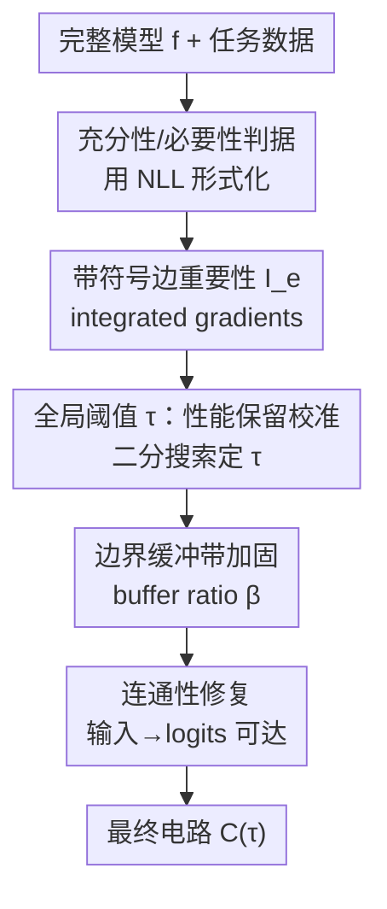

# Global Information Thresholding for Sufficient and Necessary Circuits

**会议**: CVPR 2026  
**论文**: [CVF Open Access](https://openaccess.thecvf.com/content/CVPR2026/html/Cho_Global_Information_Thresholding_for_Sufficient_and_Necessary_Circuits_CVPR_2026_paper.html)  
**代码**: 无（论文未提供）  
**领域**: 机制可解释性 / AI 安全  
**关键词**: 机制可解释性, 电路发现, 充分性与必要性, 全局阈值, 性能保留校准

## 一句话总结
针对自动电路发现普遍依赖"手工固定预算"（fixed top-k）这一痛点，本文不再事先定电路大小，而是先给边打分（带符号的 integrated gradients）、再用一个"保留多少原模型行为"的目标去自动搜出单一全局阈值 $\tau$，让电路大小成为"保留行为"的结果而非超参；在 MIB 基准上 CPR/CMD 整体最优或次优，并在 GPT-2 IOI 上同时改善了充分性与必要性诊断。

## 研究背景与动机

**领域现状**：机制可解释性（mechanistic interpretability）想把神经网络对某个任务的内部计算，还原成由少量组件（注意力头、神经元、以及它们之间的边）构成的"电路"（circuit）。主流自动电路发现走的是两段式套路：先给每条边/节点打一个重要性 score（如 EAP、EAP-IG、activation/path patching），再用一个**外部稀疏化规则**把 score 切成电路。

**现有痛点**：第二步的稀疏化规则通常是"手工固定预算"——比如固定取 top-k 条边。这让最终电路对预算极其敏感：预算这个数往往是人拍的，换个任务、换个模型就不通用。更糟的是已有工作发现这种敏感不只是概念问题：prompt 轻微扰动、输入采样变化、超参微调都能让抽出的电路结构发生质变（不稳定）。

**核心矛盾**：一个可信的电路解释必须**同时**满足两个条件——充分性（sufficiency，只跑这个电路就能复现几乎全部原模型行为）和必要性（necessity，把这个电路从模型里删掉，性能就大幅崩塌）。但二者天然冲突：为了充分性多塞边，电路就臃肿、不够选择性（牺牲必要性）；为了必要性激进剪枝，电路又小到自己跑不出原行为（牺牲充分性）。固定预算的两段式很难同时兼顾。

**切入角度**：作者观察到 EAP-IG 给出的边重要性分布是**极度重尾、头长尾型**的——Lorenz 曲线显示 score 质量高度集中在极少数 top 边上，$\log_{10}|\text{score}|$ 近似 log-normal。既然质量集中，那么"先定大小再看行为"（top-k）和"先定行为再让分布决定大小"（阈值）在不同任务/模型上会切出差别很大的电路，后者更贴合数据本身。

**核心 idea**：把电路选择从"事先指定大小"反转为"事先指定要保留多少行为，再让 score 分布决定有效工作点"——用一个**性能保留校准（retention-calibrated）的全局阈值**取代手工固定预算，并辅以边界加固与连通性修复来稳住选择结果。

## 方法详解

### 整体框架
方法要解决的是"score → 电路"这一步：给定每条边的重要性分数后，怎样把它映射成一个既充分又必要、还稳定的电路，而不依赖人手定的预算。整体是一条线性管线：先把"充分性 / 必要性"用负对数似然（NLL）形式化成可度量的判据 → 用带符号的 integrated gradients 估计每条边的重要性 $I_e$ → 对 $|I_e|$ 施加单一全局阈值 $\tau$，而 $\tau$ 由"保留 ≥ 目标比例行为"的判据通过二分搜索自动确定 → 对阈值边界附近的边做缓冲带加固 → 最后做图可达性检查，必要时修复"输入→logits"被切断的连通路径。产出是"在这一族由 score 排序诱导的电路里，满足保留判据的最小电路"。

### 关键设计

**1. 充分性与必要性的 NLL 形式化：把"好电路"变成可优化的两个目标**

以前判断电路好不好靠"看着像"，本文先把两条判据写成可量化的损失。设完整网络为 $f$，电路 $C \subseteq E$（$E$ 是全部边）。令 $f_C$ 表示"只保留 $C$ 内连接、把 $C$ 外所有连接输出置零"的受限模型，$f_{\neg C}$ 表示"只删掉 $C$ 内连接"的模型，$L(\cdot)$ 为任务数据上的平均负对数似然。充分性损失定义为只跑电路与原模型的差距：

$$\Delta L_{\text{suff}}(C) = L(f_C) - L(f) \approx 0$$

越接近 0，说明电路单独就能复现原模型。必要性损失定义为删掉电路后性能应大幅变差：

$$\Delta L_{\text{nec}}(C) = L(f_{\neg C}) - L(f) \gg 0$$

值越大说明电路越不可或缺。理想电路就是让 $\Delta L_{\text{suff}}$ 贴近 0 的同时把 $\Delta L_{\text{nec}}$ 顶大。这个双目标定义本身就是本文的立场——把"联合充分+必要"当成电路抽取的主目标，而不是事后的次要诊断。

**2. 带符号的损失型边重要性估计：用"删掉这条边任务损失涨多少"打分**

要切电路得先给每条边打分。本文直接用因果干预的口径定义：令 $f_{\neg e}$ 为删掉单条边 $e$ 后的模型，则边 $e$ 的重要性是

$$I_e = L(f_{\neg e}) - L(f)$$

即"删掉这条边，任务损失变化多少"。这个量用 integrated gradients 在一个连续的"边门控（edge gate）"上估计得到（避免对每条边都真删一遍的天价成本）。作者保留符号供分析，但电路抽取规则只用幅值 $|I_e|$——$|I_e|$ 越大，这条边对任务的因果效应越强。这一步和后面的阈值是解耦的：打分负责"谁重要"，阈值负责"留多少"，从而能把"打分质量的提升"和"score→电路映射规则的提升"分开评估。

**3. 性能保留校准的全局阈值：让电路大小由"保留行为"反推，而非人手指定**

这是全文核心。拿到所有 $I_e$ 后，用单一全局阈值 $\tau$ 决定纳入哪些边：

$$C(\tau) = \{\, e \in E \mid |I_e| \ge \tau \,\}$$

$\tau$ 高则电路紧凑、选择性强但可能漏掉必要边（充分性、必要性双降）；$\tau$ 低则纳入大量小效应边、必要性升但过度纳入。关键在于 $\tau$ 怎么定：作者不预设大小，而是给一个**保留目标**（如"至少保留原模型 95% 的行为"，或要求 $\Delta L_{\text{suff}}(C)$ 低于某容差），然后在校准集上对排序后的 score 幅值做**自动二分搜索**，找到满足该保留条件的最小电路。这就把"固定 top-k / 各种预算型稀疏化"替换成了"保留校准的全局切点"。其妙处在于反转了顺序：top-k 是先定大小再问行为能剩多少；本文是先定要保多少行为，再让 score 分布自己决定该在排序的哪个位置下刀——在 score 质量高度集中的真实分布下，这会跨任务/模型给出明显不同（且更合理）的电路大小。⚠️ 论文给的例子里 IOI/GPT-2 满足 0.95 保留目标只需 15 次 $f_{C(\tau)}$ 评估，成本可控。

**4. 边界缓冲带加固 + 连通性修复：把硬切点的脆弱性补上**

硬阈值有两个隐患，本文各打一个补丁。其一，若某条边重要性恰好略低于 $\tau$，因数据采样或数值噪声把它误排除会让充分性骤降；为此引入缓冲比例 $\beta$，把落在近边界区间的候选

$$|I_e| \in [\tau(1-\beta),\ \tau)$$

按 $|I_e|$ 排序后保守地纳入固定比例，缓和硬切点的脆性、稳住阈值附近的电路。其二，纯按幅值切边可能把"输入→logits"的所有路径都切断，使电路图根本不连通；为此对有向电路图做一次图可达性检查，若所有输入到 logits 的路径都断了，就用候选边逐步修复直到恢复可达。最终电路即：在 score 诱导的这一族电路里，经边界稳定化与连通性修复后、满足保留判据的最小电路。这两步不是改打分而是改"切法"，正面回应了已有工作指出的"选择规则本身决定了电路稳不稳"。

### 一个完整示例：IOI/GPT-2 怎么走完一遍
以 GPT-2 在 IOI（间接宾语识别）任务为例，全图共 32,491 条边。先用带符号 IG 估出每条边的 $I_e$；设保留目标 0.95，对排序后的 $|I_e|$ 做二分搜索，约 15 次 $f_{C(\tau)}$ 评估后定下 $\tau$，得到约 750 条边的电路；再用 $\beta$ 把近边界边保守纳入、跑可达性检查补好输入→logits 通路。这个 750 边的电路在消融里恰好是充分性与必要性诊断的最佳折中点（见下文 Table 4）——比 75 边的"太小"和 1500 边的"太大"都更平衡。

## 实验关键数据

实验全部在 Mechanistic Interpretability Benchmark（MIB）电路赛道上，覆盖四类任务族（IOI、Arithmetic 加减、MCQA、ARC-Easy/Challenge）与四个语言模型（GPT-2、Qwen-2.5、Gemma-2、Llama-3.1）。每个方法先抽出子图电路，再在统一的反事实 patching 框架下评估：充分性=只跑子图，必要性=从完整模型里删掉子图。主指标 CPR（整合电路性能比，越高越好）、CMD（整合电路-模型距离，越低越好）、InterpBench AUROC（越高越好）。

### 主实验

CPR（部分代表性列，越高越好；本文 = Ours）：

| 任务/模型 | EAP-IG-inputs(CF) | EAP-IG-act.(CF) | EActP(CF) | Ours |
|------|------|------|------|------|
| IOI / GPT-2 | 1.85 | 1.82 | **2.30** | 2.01 |
| IOI / Qwen-2.5 | 1.63 | 1.63 | 1.21 | **1.92** |
| IOI / Gemma-2 | 3.20 | 2.07 | - | **3.72** |
| IOI / Llama-3.1 | **2.08** | 1.60 | - | 1.96 |
| MCQA / Gemma-2 | 1.64 | 1.57 | - | 1.65 |
| ARC(E) / Gemma-2 | 1.53 | **1.70** | - | **1.75** |
| ARC(C) / Llama-3.1 | 0.98 | 0.63 | - | **1.40** |

CMD（越低越好）上 Ours 同样普遍处于最低或并列最低（如 InterpBench AUROC 0.79，仅次于 EAP-IG-activations 的 0.81）。整体结论：单一全局阈值、不挑模型专属 top-k 预算，就能在多数 task-model 组合上做到 CPR/CMD 最优或次优。

GPT-2 IOI 上对充分性/必要性的细粒度对比（Table 3，对照最强 EAP-IG-inputs 基线）：

| 指标 | EAP-IG-inputs(CF) | Ours | 方向 |
|------|------|------|------|
| $\Delta\text{NLL}_{\text{suff}}$ ↓ | 1.009 | **0.7579** | 充分性更好 |
| $\Delta\text{NLL}_{\text{nec}}$ ↑ | 8.328 | **8.431** | 必要性略升 |
| $\Delta\text{Brier}_{\text{suff}}$ ↓ | 0.1550 | **0.1005** | 校准更好 |
| $\Delta\text{ECE}_{\text{suff}}$ ↓ | 0.2010 | **0.1415** | 校准更好 |

Ours 主要改善充分性，必要性（NLL 口径）也小幅领先；Brier/ECE 的必要性侧更接近 0，作者诚实地把它解读为"更有利的辅助校准行为"而非更强的形式化必要性（因为电路被删后输出分布会被压平、Brier/ECE 会被平凡地拉低）。

### 消融实验

阈值 $\tau$ 消融（GPT-2 IOI，改变电路边数，Table 4）：

| 电路边数 | $\Delta\text{NLL}_{\text{suff}}$ ↓ | $\Delta\text{NLL}_{\text{nec}}$ ↑ | 说明 |
|------|------|------|------|
| 75 / 32491 | 2.718 | 5.836 | 太小：充分性崩、必要性诊断也最差 |
| 750 / 32491 | **0.7579** | **8.431** | 中等(≈95%保留)：整体最佳折中 |
| 1500 / 32491 | 1.138 | 8.065 | 太大：保留更多行为但充分性回落、校准漂移变大 |

这张表是全文论点的直接证据：充分性与必要性之间存在**非单调**权衡——最小电路两头都差，最大电路保行为却不够选择性，中间的 750 边工作点同时拿到最低 $\Delta\text{NLL}_{\text{suff}}$ 与最强必要性诊断。

稳定性诊断：保留目标从 0.90 扫到 0.99，CPR 总共只变 0.012（Table 5）；缓冲比例 $\beta \in \{0.0, 0.2, 0.4\}$ 下两次独立采样扰动的 CPR 几乎不变，只在 $\beta=0.0$ 时有一次可见偏差，一旦加入小缓冲两次扰动就几乎对齐（Table 6）；六次独立采样扰动下 IOI/GPT-2 电路 CPR 为 $2.0135 \pm 0.0022$。

### 关键发现
- **最佳工作点是"中间档"**：电路质量对阈值/保留目标呈非单调，既不是越小越好（必要性）也不是越大越好（充分性），75/750/1500 边里 750 边（约 95% 保留）才是充分性-必要性-校准的联合最优。
- **边界加固是为稳定而非为提分**：$\beta$ 的作用是压住阈值边界附近的不稳定决策；CPR 在不同 $\beta$ 下几乎不变，说明它不改变整体质量，只去掉脆性。
- **结构上更"聚集"**：在 GPT-2 IOI 的 unique-edge 热图（Figure 2）里，Ours 独有的边集中在更少的 source-target 层对，而 EAP-IG 的独有边散布在更广的层间交互上——说明保留校准的工作点抑制了尾部杂边、不靠扩张电路来保性能。
- **代价在 MCQA**：⚠️ 在 Qwen-2.5 MCQA 上 CPR/CMD（0.73/0.14）落后于 NAP-IG/EAP-IG 变体；在 Llama-3.1 MCQA 上 Ours CPR 中等（1.02）但 CMD 低（0.13），而冲到 CPR 1.87 的方法 CMD 反而 ≥0.33。本文是用一点 MCQA 精度换更选择性的电路。

## 亮点与洞察
- **把"选大小"反转成"选行为"**：最巧的一点是把电路大小从超参降级为"保留行为目标"的结果——你只需说"我要保住 95% 行为"，剩下的让 score 分布决定，天然适配重尾分布且跨任务/模型可迁移。这个"先定目标后定预算"的思路可迁移到任何依赖 top-k/固定阈值的稀疏化场景（剪枝、特征选择、稀疏注意力）。
- **打分与切法解耦**：把"边重要性估计"和"score→电路映射"明确分开，使得后续工作能单独评估两者的贡献，而不像以往那样混在一起说不清是 attribution 好还是预算调得好。
- **把充分性/必要性写成可优化损失**：用 $f_C$ 与 $f_{\neg C}$ 的 NLL 差直接量化两条判据，给"什么是好解释"提供了一个干净的双目标定义，比"电路与参考电路重叠度"这种代理指标更贴近机制忠实度。
- **诚实的指标解读**：作者明确指出 Brier/ECE 的必要性侧会因输出分布被压平而平凡变好，不把它当成强必要性证据——这种自我设限在可解释性评测里难得。

## 局限与展望
- 作者承认：方法在 MCQA 上不占优，是用精度换选择性；说明"保留校准 + 全局阈值"并非对所有任务族都最优。
- 自己发现的局限：① 充分性/必要性、阈值搜索都建立在 NLL 与反事实 patching 框架上，换评测口径结论是否成立未验证；② 细粒度的充分/必要诊断（Table 3/4）几乎只在 GPT-2 IOI 上做，更大模型主要看 CPR/CMD 汇总，缺少同等深度的逐模型诊断；③ 单一全局阈值假设 score 分布全局可比，若不同子图/层的 score 尺度差异大，单一 $\tau$ 是否仍合理存疑 ⚠️；④ 边重要性靠 IG 在边门控上近似估计，IG 本身的近似误差如何传导到电路选择未讨论。
- 改进思路：把全局阈值放宽成分层/分组自适应阈值；把保留目标与必要性目标做联合优化而非只校准充分性；在更多模型上补齐充分/必要的逐项诊断。

## 相关工作与启发
- **vs 固定 top-k / 预算型稀疏化（EAP、EAP-IG、ACDC 等）**：它们先定电路大小再看行为，对预算敏感且跨任务不通用；本文反过来先定保留行为、让 score 分布决定大小，去掉了手工预算这个最脆弱的环节，同时保持 CPR/CMD 竞争力。
- **vs EAP-IG-inputs/activations（最强基线）**：本文沿用类似的 IG 边打分，差别全在"切法"——在 GPT-2 IOI 上把 $\Delta\text{NLL}_{\text{suff}}$ 从 1.009 降到 0.7579、必要性 8.328→8.431，并且 unique 边结构更聚集；代价是 MCQA 部分列落后。
- **vs 稳定性批评工作（Méloux 等、Nainani 等）**：这些工作指出电路在小扰动下会质变、选择规则才是关键。本文正面接招，用边界缓冲 + 连通性修复 + 六次扰动 $2.0135\pm0.0022$ 的稳定性证据，证明保留校准的工作点不脆。
- **vs IFR / NAP / node-level 方法**：IFR 追高幅信息流路径、NAP 在更粗的节点粒度操作，二者在多数 task-model 上 CPR/CMD 不及本文；本文坚持边粒度 + 保留校准，整体更忠实。

## 评分
- 新颖性: ⭐⭐⭐⭐ "保留校准取代固定预算"的视角转换干净有力，但每个零件（IG 打分、阈值、缓冲、连通修复）都是已知工具的组合。
- 实验充分度: ⭐⭐⭐⭐ 覆盖 4 任务族 × 4 模型 + 阈值/保留/扰动多重稳定性诊断；但细粒度充分/必要诊断几乎只在 GPT-2 IOI 上做。
- 写作质量: ⭐⭐⭐⭐ 论点清晰、对指标局限的自我披露诚实；部分表格列在 PDF 里错位、需对照原文。
- 价值: ⭐⭐⭐⭐ 给机制可解释性提供了一条实用、可迁移的"按行为定电路"规则，对依赖固定预算的整条 pipeline 都有借鉴意义。

<!-- RELATED:START -->

## 相关论文

- [\[CVPR 2026\] Federated Active Learning Under Extreme Non-IID and Global Class Imbalance](federated_active_learning_extreme_noniid.md)
- [\[AAAI 2026\] An Information Theoretic Evaluation Metric for Strong Unlearning](../../AAAI2026/ai_safety/an_information_theoretic_evaluation_metric_for_strong_unlearning.md)
- [\[NeurIPS 2025\] Understanding and Improving Adversarial Robustness of Neural Probabilistic Circuits](../../NeurIPS2025/ai_safety/understanding_and_improving_adversarial_robustness_of_neural_probabilistic_circu.md)
- [\[NeurIPS 2025\] Locally Optimal Private Sampling: Beyond the Global Minimax](../../NeurIPS2025/ai_safety/locally_optimal_private_sampling_beyond_the_global_minimax.md)
- [\[ICLR 2026\] Why Do Unlearnable Examples Work: A Novel Perspective of Mutual Information](../../ICLR2026/ai_safety/why_do_unlearnable_examples_work_a_novel_perspective_of_mutual_information.md)

<!-- RELATED:END -->
