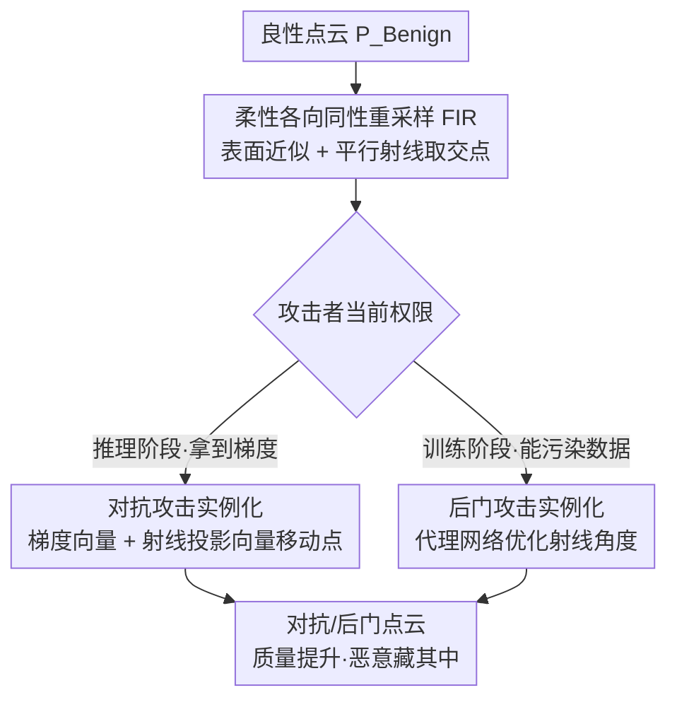

# Good Can Sometimes be Bad: A Unified Attack against 3D Point Cloud Classifier by a Flexible Isotropic Resampling

**会议**: CVPR 2026  
**论文**: [CVF Open Access](https://openaccess.thecvf.com/content/CVPR2026/html/Fan_Good_Can_Sometimes_be_Bad_A_Unified_Attack_against_3D_CVPR_2026_paper.html)  
**代码**: 无  
**领域**: AI安全 / 3D视觉  
**关键词**: 3D点云, 对抗攻击, 后门攻击, 统一攻击, 各向同性重采样  

## 一句话总结
本文提出 UAtt3D，用一个可微的「柔性各向同性重采样（FIR）」把 3D 点云的对抗攻击和后门攻击统一进同一个变换函数里，并反其道而行——不靠压低扰动来藏，而是**把被攻击点云的质量改得比原始还高**来逃避检测，在保持高攻击成功率的同时取得最佳隐蔽性。

## 研究背景与动机

**领域现状**：针对 3D 点云分类网络（3D DNN，如 PointNet++、DGCNN）的两类主流威胁是对抗攻击和后门攻击。对抗攻击在**推理阶段**对单个样本加扰动让模型分错，通常需要受害模型的梯度；后门攻击在**训练阶段**往训练集里植入带触发器的样本，需要访问并污染训练数据。两者机制不同、所需权限不同，历来被分开研究。

**现有痛点**：攻击者实际能拿到的权限是不确定的——部署环境一变，权限就变。比如一个后门攻击者本打算污染训练集，结果模型部署方式改了，训练集访问权没了、却能拿到梯度；此时精心设计的后门触发器完全失效，而专门的对抗扰动又得另起炉灶。现有的后门触发器只能用于后门、对抗扰动只能用于对抗，互不通用，攻击适用范围被死死框住。

**核心矛盾**：要做一个能同时胜任两种攻击的「统一攻击」，攻击强度必然偏高（既要学到后门特征、又要完成对抗特征移动）；而传统的隐蔽性保障手段是**限制扰动幅度**，扰动越小越隐蔽，但这会直接压低攻击强度——隐蔽性和攻击强度之间存在天然 trade-off，对统一攻击尤其不友好。更糟的是，限制扰动的做法只是把残留的恶意扰动「藏小」，本质上仍在**降低**点云质量。

**本文目标**：① 设计一个变换函数，能同时实例化为后门触发和对抗扰动；② 找到一种不牺牲攻击强度的新隐蔽性保障方式。

**切入角度**：作者观察到两类攻击有三个共性——触发器和对抗扰动本质都是「精心设计的噪声」、施加方式都是把噪声加到推理样本上、目标都是「在保证隐蔽的前提下让尽量多样本分错」。既然如此，二者完全可以收进同一个点云变换函数 $T(\cdot)$。同时作者注意到：原始点云因采集/生成缺陷常有**密度不均**问题，本就需要重采样去做质量提升；那么各向同性重采样在「友好地大范围调整点位」时留出的巨大操作空间，恰好可以拿来藏攻击。

**核心 idea**：用一个可微、柔性的各向同性重采样作为统一载体，把恶意行为（坏事）藏进点云质量提升（好事）里——「good can sometimes be bad」。

## 方法详解

### 整体框架
UAtt3D 的核心是一个统一变换函数 $T(\cdot)$：先用**柔性各向同性重采样（FIR）**把良性点云 $P_{Benign}$ 重排成质量更高的 $P_{Resample}$，再根据当前拿到的是「训练权限」还是「推理权限」，把同一份重采样结果**微调（fine tune）**成后门点云或对抗点云。FIR 由两步组成：先用三角网格近似出物体表面（约束点不能乱跑、保住几何外形），再从三个互相正交的起始平面发射一束平行射线，取射线与网格的交点作为重采样后的点；改变射线角度 $(\eta,\gamma)$ 和起始点密度 $k$ 就能灵活产出不同分布的点云。关键在于这整套重采样对角度是**可微**的，于是后门分支可以用梯度下降去优化角度，对抗分支可以用梯度去移动点位。

### 关键设计

**1. 统一攻击形式化 + 「提质即隐蔽」的新范式：把后门和对抗收进同一个变换函数**

针对「后门和对抗互不通用、权限一变就失效」这个痛点，本文先做形式化统一。后门攻击是让模型学到触发器到目标标签 $y_t$ 的映射，目标是

$$\min_{\theta}\ \sum_{P\in D_{clean}} L(F(P,\theta),y) + \sum_{P\in D_{backdoor}} L(F(T(P),\theta),y_t)$$

对抗攻击则是在推理期把良性点云 $P$ 变成 $A(P)$ 使 $F(A(P),\theta)\neq y$。作者指出后门的触发器植入函数 $T(\cdot)$ 和对抗的攻击函数 $A(\cdot)$ **本质都是点云变换函数**，于是统一记为 $T(\cdot)$——同一个 $T$，配合训练/推理两种使用方式，就能分别完成两种攻击目标。这样无论攻击者最终拿到训练权限还是推理权限，都能用同一套机制落地。

第二层创新是隐蔽性范式的反转。传统做法靠限制扰动幅度求隐蔽，但残留扰动仍让点云质量**变差**；本文转而**主动提升被攻击点云的质量**来隐蔽。直觉是：原始点云本就密度不均、需要重采样修整，那么把攻击伪装成一次「让点云更均匀、更自然」的重采样，恶意行为就被质量提升盖住了——人眼和质量类防御反而觉得它更干净。这个思路不依赖点云特性，作者声称对所有数据格式都成立。

**2. 柔性各向同性重采样 FIR：表面近似 + 射线取交，可微且不受单一几何特征束缚**

这是整套攻击的地基，针对「传统各向同性重采样太死板、对同一点云几乎只能产出一种结果，无法适配不同受害模型/样本/攻击目标」这一痛点。FIR 分两步：

*表面近似*——只为高效地框住几何外形，不追求高质量网格（允许三角面交叉重叠，因为不直接处理网格）。作者改进了基于凹包的 Alpha Shapes：先做离群点去除让点云平滑，再用**自适应半径**选采样球，对点 $p_i$ 取 $r_i = R\cdot Cur(p_i)$，其中 $R$ 是初始半径、$Cur(p_i)$ 是归一化曲率，曲率大的地方用更大半径，从而既贴合形状又省时。

*射线重采样*——给定三角网格，发射若干平行射线，**取射线与网格表面的交点作为重采样点**。为保证落点各向同性，起始点取在网格外接球的切平面 $\xi$ 上（并同时取三个互相正交的平面以充分覆盖几何细节），切点 $p_c$ 用极坐标 $(\eta_c,\gamma_c,r)$ 表示；起始点按 $p_s = p_c + d\cdot u + d\cdot v,\ d = r/k$ 在平面上均匀排布（$u,v$ 为平面内正交向量，$k$ 控制密度）；同一平面上所有射线方向相同、等于该平面法向，方向由切点的 $(\eta,\gamma)$ 决定。交点 $p'$ 通过联立射线方程 $p(t)=p_s+t\cdot\vec{n}$ 与三角面参数方程 $p(a_1,a_2)=(1-a_1-a_2)v_0+a_1v_1+a_2v_2$ 解出 $t,a_1,a_2$ 得到。整套重采样可紧凑写为

$$P_{Resample} = T(P_{Benign},\ \eta_c,\ \gamma_c,\ k)$$

「柔性」就体现在：只要调 $(\eta_c,\gamma_c,k)$ 就能灵活产出不同分布的重采样点云，从而适配不同攻击需求；且因为最终结果对角度可微，下游两种攻击都能用梯度求解。

**3. 对抗攻击实例化：梯度向量 + 射线投影向量的两段式点移动**

拿到 FIR 的重采样点云后，对抗扰动在它基础上生成，并且点的移动被**重建表面和采样射线双重约束**以保住各向同性。每一步移动由两个向量合成：第一个是分类损失对点坐标的梯度

$$\vec{r} = \frac{dL(F(\theta, P_{Resample}), y)}{dP_{Resample}}$$

无目标攻击时它降低模型把点云判为真标签 $y$ 的概率；有目标攻击时改用对目标标签 $y_t$ 的损失梯度、方向取反。第二个向量是 $\vec{s}\cdot t_s$，$\vec{s}$ 是梯度 $\vec{r}$ 在采样射线方向上的投影，模长由步长 $t_s$ 决定，用来平衡每一步的攻击强度与形变约束。一旦 $P_{Resample}$ 被误分类，移动立即停止，得到带各向同性特征的对抗点云。把梯度方向约束到射线方向上，正是攻击保持「看起来仍是一次正常重采样」的关键。

**4. 后门攻击实例化：用代理网络优化射线角度，把触发器藏成几何分布**

后门攻击要让模型学到「触发器 → 目标标签」的映射，而触发器的成功取决于带后门点云共有的几何特征。在 FIR 框架下，关键就变成**选对射线角度 $(\eta,\gamma)$**。受不同 3D DNN 共享特征学习机制的启发，本文引入一个**代理 3D DNN** $F_s(\theta_s,\cdot)$，通过最小化训练样本特征与目标标签 $y_t$ 的距离来求解角度：

$$\eta^*,\gamma^* = \arg\min_{(\eta,\gamma)} \sum_{P\in D_{clean}} L(F_s(T(P,\eta,\gamma),\theta_s),\ y_t)$$

其中 $k$ 因人工指定而被略去。正因为重采样函数 $T(\cdot)$ 对 $\eta,\gamma$ 可微（$\partial L/\partial\eta$、$\partial L/\partial\gamma$ 可算），上式可直接用梯度下降求解。求得的 $(\eta^*,\gamma^*)$ 用来生成后门点云注入训练集——触发器不再是显眼的额外噪点，而是一种「特定射线角度下的均匀几何分布」，这正是它隐蔽且能跨模型迁移的原因。

### 损失函数 / 训练策略
两个攻击分支共享同一个 FIR，区别只在如何用梯度：对抗分支用分类损失梯度移动点位（受射线方向投影约束），后门分支用代理网络损失梯度优化射线角度 $(\eta,\gamma)$。后门注入受污染率 $\alpha$ 控制，$\alpha$ 越大 ASR 越高。

## 实验关键数据

数据集：合成 ModelNet40（MN40）、ShapeNet16（SN16）与真实 ScanObjectNN（SON）；受害模型：PointConv、PointNet++、DGCNN、CurveNet。指标：攻击成功率 ASR（越高越好）、后门的良性精度 BAc，以及衡量点云各向同性的 KUV、CUD（**越低越好**，代表质量越高）。

### 主实验

后门攻击（MN40，节选 ASR / CUD / KUV，CUD·KUV 越低越好）：

| 攻击方法 | PointConv ASR | PointNet++ ASR | CUD | KUV |
|----------|------|------|------|------|
| Benign（原始） | - | - | 103.49 | 0.51 |
| PointPBA-I | 97.13 | 100 | 152.05 | 4.34 |
| IRBA | 91.13 | 89.82 | 78.83 | 0.48 |
| IBAPC | 95.43 | 92.08 | ~101 | ~0.7 |
| **UAtt3D（本文）** | **97.62** | **98.94** | **62.27** | **0.33** |

无目标对抗攻击（MN40，节选 ASR / CUD / KUV）：

| 攻击方法 | PointConv ASR | PointNet++ ASR | CUD | KUV |
|----------|------|------|------|------|
| Benign | - | - | 103.49 | 0.51 |
| GeoA3 | 100 | 85.18 | 136.01 | 1.60 |
| SIA | 100 | 98.75 | 260.07 | 2.06 |
| Eidos | 100 | 98.38 | 233.82 | 1.39 |
| **UAtt3D（本文）** | 100 | **100** | **64.89** | **0.46** |

关键对比：几乎所有基线攻击都让 CUD/KUV **变差**（点云质量下降），唯独 UAtt3D 把 CUD 从原始的 103.49 降到 62.27、KUV 从 0.51 降到 0.33——即攻击后质量反而比原始良性点云还**高**，同时 ASR 仍保持在 96%–100% 的竞争力区间。PointPBA-I 在部分设置能到 100% ASR 略高于本文，但其 KUV 高达 4.34，隐蔽性远差。

### 鲁棒性 / 防御实验

| 实验 | 结果 |
|------|------|
| 缺陷点云（离群/空洞/稀疏，SON+缺陷 MN40） | UAtt3D 后门 ASR 96%–98%、对抗 ASR 100%，CUD/KUV 仍显著改善（无需高质量水密网格，故对噪声鲁棒） |
| 显著性防御（丢高显著点） | UAtt3D 基本不掉；PointPBA-I 丢前 60 点后 ASR 暴跌至 15.13% |
| PointCVaR 防御 | UAtt3D 后门 ASR 98.77%→98.29%、对抗 95.78%→78.42%；PointBA-I 100%→4.33% |
| 频域滤波防御 | UAtt3D 后门仅 98.77%→98.29%；IBAPC/PointBA-I 跌至 25.31%/4.33% |
| STRIP 后门防御 | UAtt3D 与良性分布重叠更大，更难被区分 |
| 人类主观评测（176 人×1760 票） | 80.62% 认为 UAtt3D 点云质量最好，良性点云仅占 19.31% |

### 关键发现
- **质量提升是核心卖点**：UAtt3D 是唯一让 KUV/CUD 普遍优于原始点云的攻击，因此能逃过质量类与人眼检测——攻击点云被人评为「最自然」。
- **对噪声鲁棒**源于 FIR 不要求高质量、水密网格，缺陷点云上 ASR 依旧接近满分。
- **防御抵抗力强**：在显著性、PointCVaR、频域滤波、STRIP 四类防御下都几乎不掉点，而触发器显眼的 PointBA-I 被轻易瓦解。
- 用 UAtt3D 点云重建 3D mesh 时面法向一致性 16.48，优于良性点云的 23.15，且能避免网格空洞——侧面佐证「质量真的变好了」。
- 后门 ASR 随污染率 $\alpha$ 升高而提升，且对目标标签 $y_t$ 的选择不敏感。

## 亮点与洞察
- **范式反转最惊艳**：把「攻击 = 降质」翻成「攻击 = 提质」。以往隐蔽性靠把扰动压小，本文直接让被攻击样本比原始更干净，使质量类防御和人眼这两个传统防线全部失效——这个「以好藏坏」的思路可迁移到 2D 图像甚至其他模态。
- **可微重采样是巧妙的统一载体**：用射线角度 $(\eta,\gamma)$ 把「点云变换」参数化且可微，于是对抗（移点）和后门（调角度）共用同一函数、各取所需梯度，干净利落地统一了两类本来机制迥异的攻击。
- **自适应曲率半径** $r_i=R\cdot Cur(p_i)$ 让表面近似既贴形状又省时，是个可复用的小 trick。
- 给安全社区敲警钟：防御不能只盯「扰动大小/点云质量」，质量更高的样本也可能是攻击。

## 局限与展望
- 整套攻击依赖 FIR 能从点云近似出三角网格；虽然作者证明对缺陷点云仍鲁棒，但**极端稀疏或残缺**到无法形成有效网格时方法可能退化（⚠️ 论文未给出该极端情形的量化边界）。
- 后门分支依赖**代理网络** $F_s$ 与受害模型共享特征机制的假设；若受害模型架构差异极大，迁移性是否仍成立未充分讨论。
- 评测集中在分类任务和四个经典 3D DNN；对检测/分割等下游任务、以及更现代的 Transformer 类点云骨干是否同样有效，有待验证。
- 「提质即隐蔽」虽巧妙，但 ASR 在个别设置（如 DGCNN 上 95.78%）略逊于纯对抗方法，存在攻击强度与质量提升之间的残余取舍。

## 相关工作与启发
- **vs 传统点云后门（PointPBA-I / PCBA / IRBA / IBAPC）**：它们专为训练阶段设计、触发器固定且常导致 KUV/CUD 变差，权限一变即失效；UAtt3D 用同一 FIR 同时覆盖后门与对抗，且把质量改优，隐蔽性与防御抵抗力全面占优，代价是个别设置 ASR 略低。
- **vs 传统点云对抗（GeoA3 / SIA / HiT / AdvPC / Eidos）**：它们靠限制扰动幅度求隐蔽，残留扰动仍降质（CUD 普遍翻倍）；UAtt3D 把对抗移动约束到采样射线方向并伴随质量提升，在保持 ~100% ASR 的同时显著降低 CUD/KUV。
- **vs 传统各向同性重采样**：传统方法对同一点云只能产出几乎唯一的结果，无法适配多变的攻击需求；FIR 通过可调射线角度实现「柔性」且可微，把一个点云处理工具改造成了攻击载体。

## 评分
- 新颖性: ⭐⭐⭐⭐⭐ 统一两类攻击 + 「提质即隐蔽」的范式反转，视角新颖且自洽。
- 实验充分度: ⭐⭐⭐⭐⭐ 三数据集×四骨干、后门/对抗双线、缺陷点云、五类防御、人类主观评测，覆盖全面。
- 写作质量: ⭐⭐⭐⭐ 动机推导清晰，FIR 几何细节稍密但配图可懂。
- 价值: ⭐⭐⭐⭐ 揭示「高质量样本也可能是攻击」的新威胁面，对 3D 点云安全防御有警示意义。

<!-- RELATED:START -->

## 相关论文

- [\[CVPR 2026\] Your Classifier Can Do More: Towards Balancing the Gaps in Classification, Robustness, and Generation](your_classifier_can_do_more_towards_balancing_the.md)
- [\[CVPR 2026\] RemedyGS: Defend 3D Gaussian Splatting Against Computation Cost Attacks](remedygs_defend_3d_gaussian_splatting_against_computation_cost_attacks.md)
- [\[CVPR 2026\] R$^2$TUA: Reconstruction-residual Based Targeted and Untargeted Attack Against Text-Image Person Re-Identification](r2tua_reconstruction-residual_based_targeted_and_untargeted_attack_against_text-.md)
- [\[CVPR 2026\] A Unified Perspective on Adversarial Membership Manipulation in Vision Models](a_unified_perspective_on_adversarial_membership_manipulation_in_vision_models.md)
- [\[CVPR 2026\] PoInit-of-View: Poisoning Initialization of Views Transfers Across Multiple 3D Reconstruction Systems](poinit-of-view_poisoning_initialization_of_views_transfers_across_multiple_3d_re.md)

<!-- RELATED:END -->
