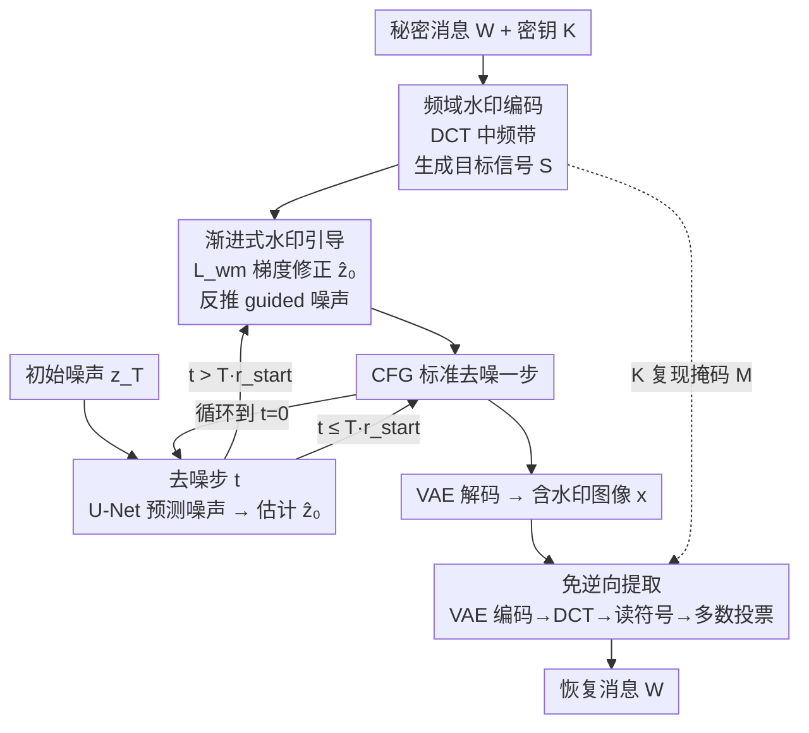

# GROW: Watermark Generation with Progressive Guidance for Diffusion Models

**会议**: CVPR 2026  
**论文**: [CVF Open Access](https://openaccess.thecvf.com/content/CVPR2026/html/Luo_GROW_Watermark_Generation_with_Progressive_Guidance_for_Diffusion_Models_CVPR_2026_paper.html)  
**代码**: 无（作者承诺开源，截稿时未放出）  
**领域**: AI安全 / 扩散模型水印  
**关键词**: 数字水印, 扩散模型, 免训练, 频域引导, 免逆向提取

## 一句话总结
GROW 把扩散模型水印从"在初始噪声里一次性埋入、提取时要做昂贵 DDIM 逆向"重构成"在去噪过程中用频域梯度逐步引导生成"，让水印自然长进图像纹理里，从而提取时**无需逆向**——鲁棒性和不可见性都超过现有方法，提取速度快了近 100 倍。

## 研究背景与动机

**领域现状**：扩散模型生成的图像需要数字水印来做版权保护与溯源。现有方法分三类——后处理（直接改最终图像，画质和鲁棒性都差）、微调（改模型参数嵌入水印，要重训、成本高且改了权重）、免训练（plug-and-play，最受欢迎）。免训练方法的主流范式由 Tree-Ring 开创：把水印作为特定 pattern 埋进**初始噪声** $z_T$，之后整条去噪过程把这部分噪声和图像语义融合在一起。

**现有痛点**：所有"初始噪声派"方法都有一个致命共性缺陷——**提取水印时必须先用 DDIM 逆向（inversion）把图像反推回初始噪声**。逆向本身就是一次完整的扩散采样，计算极其昂贵（十几到二十几秒一张），这个延迟瓶颈让它们无法用于大规模、实时场景。

**核心矛盾**：初始噪声派的鲁棒性来自一种**被动散射（passive scattering）**机制——去噪网络隐式地把含水印的噪声过滤、并把一部分融进图像语义。这种"埋在源头让模型自己揉进去"的做法天然要求"从结果反推源头"才能读出水印，于是逆向无法避免。一个朴素的替代是直接往**最终 latent** $z_0$ 上加水印（这样提取时不用逆向），但作者实验（Figure 6）显示这会粗暴破坏已学到的数据分布，导致图像严重退化。

**切入角度 / 核心 idea**：作者的关键洞察是——被动散射想要的"深度融合"效果，可以换成**主动引导（active guidance）**来达成。不去改初始噪声，而是借用模型自己的迭代去噪过程：在每一步去噪时，计算当前 latent（频域）与一个固定水印目标 pattern 的差异，用这个差异的梯度**温柔地**把生成轨迹往水印方向推一点。这些微扰沿着模型学到的数据流形累积，后续步里 U-Net 会把它们当作"高频细节"渲染进羽毛、树皮、水波这类纹理中，长出一个深度融合的水印。一句话：**把水印从"一次性 imprint"改成"图像与水印的逐步共生（co-evolution）"**，于是提取变成直接读频域系数符号，彻底摆脱逆向。

## 方法详解

### 整体框架
GROW 是一个免训练范式，分**水印生成**和**水印提取**两条路。生成端：把秘密消息编码成一个频域目标信号 $S$，在去噪过程的后半段，每步都用"预测干净 latent 的 DCT 系数与 $S$ 的 MSE"算梯度，把梯度反过来修正噪声预测，让生成轨迹逐步靠近目标——水印就这样被一步步织进图像。提取端：把待检图编码回 latent $z_0$，做 DCT，在掩码 $M$ 指定的频域位置读系数符号（正为 1、负为 0），多副本投票得到消息——全程不做任何逆向。

整套生成把"标准去噪一步"改造成"标准去噪 + 一次梯度引导"，引导只在 $t > T \cdot r_{start}$ 的后半程开启。下面用 Mermaid 给出生成端（含引导回路）和提取端的总览：

### 关键设计

**1. 频域中频带水印编码：把消息编成抗压缩又不毁画质的目标信号**

水印要同时满足"不可见"和"抗攻击"，关键在埋在哪个频段。低频承载图像主结构，改它会肉眼可见地扭曲内容；高频又太脆弱，JPEG 压缩、模糊一来就被抹掉。GROW 选择 latent 空间的 **DCT 中频带**作为最优折中。具体地，秘密消息 $W$ 先转成二进制比特序列 $w$；用密钥 $K$ 作种子的伪随机数发生器生成二进制掩码 $M$（决定哪些频域坐标承载水印）；把 $w$ 重复铺到掩码上得到目标信号矩阵：

$$\mathbf{S}(u,v) = \begin{cases} \alpha \cdot (2w_i - 1) & \text{if } \mathbf{M}(u,v)=1 \\ 0 & \text{otherwise} \end{cases}$$

其中 $w_i$ 是坐标 $(u,v)$ 上的比特，$\alpha$ 是水印强度。注意 $2w_i-1$ 把比特 $\{0,1\}$ 映射成 $\{-1,+1\}$——这正是提取端"读符号"的依据：比特 1 对应正系数、比特 0 对应负系数。每个比特被重复埋多份，为后面的多数投票留出冗余。

**2. 渐进式水印引导：用频域梯度在去噪轨迹上逐步织入水印**

这是方法的核心，专治"直接往 $z_0$ 加水印会毁图"的痛点。引导只在 $t > T \cdot r_{start}$（如 $r_{start}=0.5$ 即后半程）启动，每个被引导的去噪步做三件事。第一，**预测干净 latent**：用当前 $z_t$ 和 U-Net 噪声预测 $\mathcal{E}_\theta$，按下式估计 $\hat{z}_0$：

$$\hat{\mathbf{z}}_0 = \frac{1}{\sqrt{\bar{\alpha}_t}}\left(\mathbf{z}_t - \sqrt{1-\bar{\alpha}_t}\,\mathcal{E}_\theta(\mathbf{z}_t, t, c)\right)$$

第二，**算梯度并修正**：把 $\hat{z}_0$ 转到频域，在掩码 $M$ 选定的位置上算它的 DCT 系数与目标 $S$ 的 MSE 损失，$\mathcal{L}_{wm} = \|(\text{DCT}(\hat{\mathbf{z}}_0) - \mathbf{S}) \odot \mathbf{M}\|_2^2$，再沿这个损失的梯度往下推一步：$\hat{\mathbf{z}}_0^{\text{guided}} = \hat{\mathbf{z}}_0 - \eta \nabla_{\hat{\mathbf{z}}_0}\mathcal{L}_{wm}$，$\eta$ 是引导尺度。第三，**反推 guided 噪声**：调度器要的是噪声预测而非干净 latent，于是把式 (1) 反解，由修正后的 $\hat{z}_0^{\text{guided}}$ 算出对应噪声 $\mathcal{E}^{\text{guided}} = \frac{1}{\sqrt{1-\bar{\alpha}_t}}(\mathbf{z}_t - \sqrt{\bar{\alpha}_t}\,\hat{\mathbf{z}}_0^{\text{guided}})$。这个已隐含水印信号的噪声被当作条件预测 $\mathcal{E}_\theta(z_t,t,c)$ 喂进标准 CFG 框架算出本步最终噪声，再交给调度器走到 $z_{t-1}$。如此每步只施加一个**微小**扰动，沿流形切空间累积，U-Net 不把它当噪声消除、而是把它当高频细节渲染进真实纹理——这正是渐进引导比一次性注入优越的根因（消融见下文 one-step 对比）。

**3. 免逆向提取：直接读频域符号 + 多数投票**

初始噪声派提取慢，是因为要逆向。GROW 的水印写在最终 latent 的频域里，于是提取直接、无需逆向：给定待检图 $x$，先用 VAE 编码得 $z_0$，做 DCT 得频域表示 $F$；用密钥 $K$ 确定性地复现掩码 $M$，对每个 $M(u,v)=1$ 的位置，**只看 $F(u,v)$ 的符号**——正解码为 1、负解码为 0。由于每比特埋了多份，对这些冗余副本做**多数投票**定最终值，从而抗住失真。提取全程是一次 VAE 编码 + DCT + 符号统计，因此 0.24 秒搞定，对比逆向方法的十几秒近 100 倍提速。

### 损失函数 / 训练策略
GROW **免训练**，不优化任何模型参数。唯一的"损失"是推理期引导用的频域 MSE $\mathcal{L}_{wm}$（式 5），仅用于对 $\hat{z}_0$ 求梯度、单步修正，不回传给 U-Net。默认超参：水印强度 $\alpha=0.5$、引导尺度 $\eta=100$、起始比 $r_{start}=0.5$、50 步采样、在 VAE 第一个通道埋 16-bit 水印（框架支持多通道并发以扩容量）。

## 实验关键数据

骨干 Stable Diffusion v2.1-base，单张 Tesla T4，在 MS-COCO 与 Stable-Diffusion-Prompts 各 1000 张图上评测。鲁棒性用 **M-ACC**（整条消息**零比特错**才算成功，比 Bit Accuracy 严格得多）在 Rotation/JPEG/Crop/Blur/Noise/Brightness/Adversarial(Diff-Pure) 等攻击下衡量；不可见性用 PSNR/SSIM/FID/LPIPS。

### 主实验

不可见性与平均鲁棒性对比（Stable-Diffusion-Prompts / MS-COCO，节选关键列）：

| 数据集 | 方法 | PSNR↑ | SSIM↑ | FID↓ | LPIPS↓ | Avg M-ACC↑ |
|--------|------|-------|-------|------|--------|------------|
| SD-Prompts | Tree-Ring | 15.25 | 0.54 | 25.93 | 0.42 | 0.485 |
| SD-Prompts | Gaussian Shading | 24.83 | 0.81 | 25.45 | 0.07 | 0.907 |
| SD-Prompts | WIND | 13.16 | 0.47 | 24.12 | 0.39 | 0.926 |
| SD-Prompts | **GROW** | **28.09** | **0.84** | **18.90** | **0.06** | **0.976** |
| MS-COCO | WIND | 7.44 | 0.26 | 21.89 | 0.44 | 0.925 |
| MS-COCO | Gaussian Shading | 26.21 | 0.83 | 22.45 | 0.07 | 0.913 |
| MS-COCO | **GROW** | **27.54** | **0.85** | **12.32** | **0.05** | **0.978** |

GROW 在两个数据集上同时拿下最优的不可见性（FID 12.32 远低于次优，意味着含水印图分布最贴近真实图）和最高平均鲁棒性（97.6% / 97.8%）。注意初始噪声派（Tree-Ring/WIND）虽鲁棒，但 PSNR/SSIM 很差、FID 高——它们靠改噪声换鲁棒，画质牺牲明显；GROW 不存在这种 trade-off 失衡。

提取效率（Table 3，单位秒/张，T4）：

| 方法 | 生成时间(总/水印开销) | 提取时间↓ |
|------|----------------------|-----------|
| Tree-Ring | 21.03 / 0.04 | 19.70 |
| Gaussian Shading | 21.24 / 0.25 | 12.50 |
| WIND | 21.17 / 0.18 | 21.70 |
| **GROW** | 21.16 / 0.17 | **0.24** |

各方法生成时间相近（水印开销相对 50 步采样可忽略，GROW 只加 0.17 秒）；差距全在提取——GROW 0.24 秒，比逆向方法快近 100 倍，这是它走向落地的决定性优势。

### 消融实验

渐进引导 vs 一次性注入（MS-COCO，Table 4）——直接把同样的 DCT 水印 pattern 一步注入最终 latent $z_0$：

| 配置 | FID↓ | PSNR↑ | SSIM↑ | 说明 |
|------|------|-------|-------|------|
| One-Step（一次性注入 $z_0$） | 157.8 | 11.36 | 0.19 | 画质灾难性崩溃 |
| **GROW（渐进引导）** | **12.32** | **27.54** | **0.85** | 同等水印强度下画质完好 |

超参敏感性（Figure 5，单变量扫描）：

| 超参 | 变化 | M-ACC | FID 代价 |
|------|------|-------|----------|
| 水印强度 $\alpha$ | 0.3→0.7 | 92%→99% | FID 9.5→28.2（越强越伤画质） |
| 引导尺度 $\eta$ | 50→100 | 90%→99%（之后饱和） | $\eta\approx125$ 时 FID 最优(15.1) |
| 起始比 $r_{start}$ | 0.3 / 0.9 | 97% / 92%（越早开始越鲁棒） | 早开始让水印融得更深 |

### 关键发现
- **渐进 vs 一次性是成败分水岭**：one-step 把 FID 从 12.32 推到 157.8、PSNR 跌到 11.36——证明"小步多次沿流形切空间微扰"是把强信号埋进去而不毁图的根本，U-Net 的协同细化（把扰动当纹理渲染）只有逐步推进才触发。
- **没有鲁棒性—画质的失衡 trade-off**：初始噪声派要么画质差（Tree-Ring/WIND 的 PSNR 个位数到十几）、要么鲁棒一般；GROW 同时占住两端最优。
- **模型无关**：在 SD-v1.5 和 SDXL 上重测（Table 2），GROW 平均 M-ACC 0.965 / 0.981 仍领先，说明渐进引导是可移植的底层技术而非对某个骨干的过拟合。
- **越早引导越深融**：$r_{start}$ 越小、水印经历的去噪步越多，织入语义结构越深、越鲁棒。

## 亮点与洞察
- **把"被动散射"翻译成"主动引导"**：作者识破初始噪声派的本质是"让去噪过程被动地融合含水印噪声"，再用 classifier/CFG 式梯度引导主动复刻同样的融合，顺手干掉了逆向——这一步范式翻转很漂亮，是全文的"啊哈"。
- **频域 + 符号判读让提取廉价到极致**：水印不是某个连续值而是 DCT 系数的**符号**，提取只需一次前向编码加符号统计，天然免逆向，还配多数投票抗噪。这种"把信息编进符号位"的思路可迁移到任何需要轻量验证的隐写/指纹任务。
- **复用调度器接口的工程巧思**：引导施加在 $\hat z_0$ 上，再反解式 (1) 得到 guided 噪声喂回标准 CFG——不动调度器、不动模型，纯插件式接入任意扩散采样器。

## 局限与展望
- 作者承认：作为 DCT 域的免训练方法，鲁棒性会被**随机比例拉伸（ratio stretching）**破坏，且容量受频域结构固有限制。
- 提速结论的语境：Table 3 的近 100 倍提速针对的是"逆向式提取"，对本就不依赖逆向的后处理方法（如 Hidden）不构成同等量级优势——⚠️ 横向比"提取速度"时要看对手是否需要逆向。
- 自己发现的局限：M-ACC 在 Noise/Brightness 攻击下相对偏低（如 Noise 0.91~0.93），强攻击鲁棒性仍有提升空间；16-bit 默认容量偏小，扩容要靠多通道并发但论文未给扩容后的画质/鲁棒代价曲线。
- 展望：作者提议把静态 DCT 域换成**可学习、抗攻击的表示空间**——训一个专用编码器生成针对各类攻击优化的水印嵌入空间，再塞进渐进引导框架，有望显著提升安全性与鲁棒性。

## 相关工作与启发
- **vs Tree-Ring / WIND / RingID / Gaussian Shading（初始噪声派）**：它们把水印埋进 $z_T$、靠被动散射融合，提取必须 DDIM 逆向（十几~二十几秒）。GROW 同属免训练但改埋进生成轨迹的频域、主动引导，提取免逆向（0.24 秒），且画质（FID/PSNR/SSIM）全面更优——核心区别是"源头静态埋入 + 反推提取" vs "过程动态织入 + 正向读取"。
- **vs 一次性注入最终 latent（朴素 baseline）**：同样免逆向，但一步大扰动把 latent 推离数据流形，画质崩溃（FID 157.8）。GROW 用多步微扰沿流形切空间累积，靠 U-Net 协同渲染保住画质——说明"免逆向"不能靠粗暴注入，必须借生成过程逐步完成。
- **vs 后处理派（DwtDctSvd / Hidden）**：后处理直接改成品图，不具内生性（endogeneity）、鲁棒性弱（DwtDctSvd 平均 M-ACC 仅 ~0.48）。GROW 水印长在生成语义内部，移除需模型内部参数知识，更难抹除。
- **vs 微调派（Stable Signature 等）**：微调要重训、改模型权重，部署门槛高；GROW plug-and-play、不动参数。

## 评分
- 新颖性: ⭐⭐⭐⭐⭐ 把扩散水印从"初始噪声埋入 + 逆向提取"翻转为"渐进引导织入 + 免逆向读取"，是范式级创新。
- 实验充分度: ⭐⭐⭐⭐ 多数据集/多骨干/多攻击 + 超参扫描 + 关键 one-step 消融齐全，但缺多比特容量扩展与更强攻击的深入分析。
- 写作质量: ⭐⭐⭐⭐⭐ 动机推导（散射→引导）清晰，方法三步交代到位，图表自洽。
- 价值: ⭐⭐⭐⭐⭐ 近 100 倍提取提速直击落地瓶颈，对 AIGC 版权/溯源是实用性极强的方案。

<!-- RELATED:START -->

## 相关论文

- [\[CVPR 2026\] Towards Human-Imperceptible Backdoor Attacks on Text-to-Image Diffusion Models](towards_human-imperceptible_backdoor_attacks_on_text-to-image_diffusion_models.md)
- [\[CVPR 2026\] Bridging Privacy and Provenance: Traceable Virtual Identity Generation](bridging_privacy_and_provenance_traceable_virtual_identity_generation.md)
- [\[CVPR 2026\] Red-teaming Retrieval-Augmented Diffusion Models via Poisoning Knowledge Bases](red-teaming_retrieval-augmented_diffusion_models_via_poisoning_knowledge_bases.md)
- [\[CVPR 2026\] GenBreak: Red Teaming Text-to-Image Generation Using Large Language Models](genbreak_red_teaming_text-to-image_generation_using_large_language_models.md)
- [\[CVPR 2026\] Roots Beneath the Cut: Uncovering the Risk of Concept Revival in Pruning-Based Unlearning for Diffusion Models](roots_beneath_the_cut_uncovering_the_risk_of_concept_revival_in_pruning-based_un.md)

<!-- RELATED:END -->
