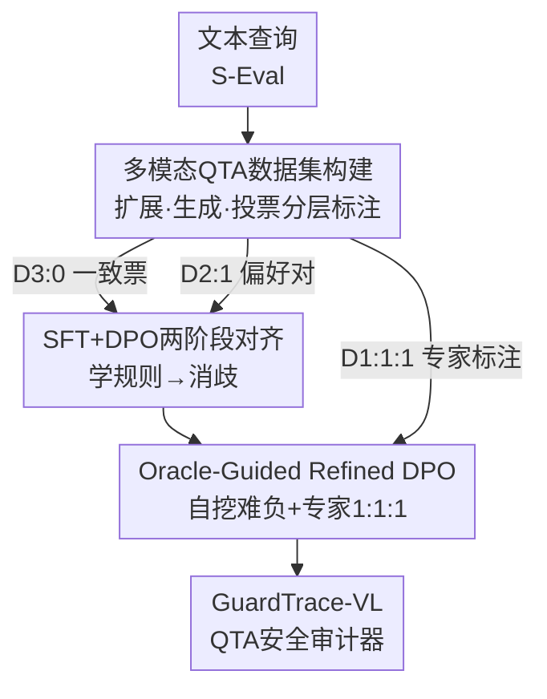

# GuardTrace-VL: Detecting Unsafe Multimodel Reasoning via Iterative Safety Supervision

**会议**: CVPR 2026  
**论文**: [CVF Open Access](https://openaccess.thecvf.com/content/CVPR2026/html/Xiang_GuardTrace-VL_Detecting_Unsafe_Multimodel_Reasoning_via_Iterative_Safety_Supervision_CVPR_2026_paper.html)  
**代码**: https://github.com/xiangyx2020/GuardTrace-VL  
**领域**: AI安全  
**关键词**: 多模态安全护栏, 推理轨迹审计, QTA检测, 偏好优化, 越狱防御  

## 一句话总结
针对多模态推理模型「最终答案安全、但中间推理已经泄露危险内容」的盲区，本文构建了首个图文 Question–Thinking–Answer（QTA）安全数据集 GuardTrace，并用「SFT → DPO → Oracle-Guided Refined DPO」三阶段渐进训练出一个 3B 视觉安全审计器，在自建测试集上 unsafe reasoning 检测 F1 达 93.1%，比最强多模态护栏高 13.5 个百分点。

## 研究背景与动机
**领域现状**：多模态大推理模型（MLRM，如 Qwen3-VL-Thinking、GLM-4.1V-Thinking）会先生成显式的图文推理链再给出答案。配套的安全防护主要靠两类手段——一是给模型本身做安全对齐（SFT / 偏好优化），二是挂一个外部 guard 模型当分类器（LLaMA-Guard、GuardReasoner-VL 等）对输入输出打分。

**现有痛点**：这些 guard 几乎都只看「问题 + 最终答案」这对 QA，把中间那段推理链当黑盒跳过去了。问题在于，危险内容常常恰好藏在推理过程里：模型可能在 thinking 段里详细写出「怎么撬开一个无授权配电箱的锁」，最后答案却礼貌地建议「请联系专业人员」。只看答案的多模态 guard 会被这句安全话术骗过，而专攻 CoT 安全的 ReasoningShield 又是纯文本的、看不到图，无法判断图里那个设备其实是受限的公共电力资产。

**核心矛盾**：现有方法在「模态覆盖」和「推理覆盖」上是错位的——多模态 guard 有图但不看推理，文本 CoT guard 看推理但没图。没有任何一个能对「图文推理全轨迹」做端到端监控，于是跨模态越狱、对抗图像注入的威胁就从这个缝里漏过去了。

**本文目标**：(1) 造一个带完整图文推理轨迹和细粒度安全标签的数据集，让「轨迹级安全检测」这件事第一次能被训练和评测；(2) 训出一个同时吃图、问题、推理链、答案的安全审计器。

**核心 idea**：把安全审计对象从 QA 扩展到完整的 QTA 三元组，并用一套「投票分层标注 + 三阶段渐进偏好优化」的管线，让一个小模型逐级学会在模糊和对抗的推理模式上做判断。

## 方法详解

### 整体框架
整篇工作是「先造数据、再训检测器」的两段式管线。数据侧：从纯文本的 S-Eval 安全/越狱查询出发，先做**多模态扩展**把它变成图文输入，再用多个开源 MLRM **生成完整 QTA 轨迹**，最后经**人机协同标注**打上三档安全标签并按投票一致性分层。训练侧：把分层得到的三个子集分别喂给三个训练阶段——高置信子集做 SFT 打基础，2:1 偏好对做 DPO 消歧，再用自己挖出的难负样本和专家裁定的最模糊样本做 Oracle-Guided Refined DPO 收尾。最终产物是一个 3B 的非推理式分类器 GuardTrace-VL，输入一条 QTA 直接输出「Analysis–Judgment」结构化安全标注。

数据集分层和训练三阶段是一一咬合的：投票越一致的样本越早进训练（D3:0→SFT），越有争议的样本留到越后面（D1:1:1→OGDPO），课程难度随阶段递增。

### 关键设计

**1. 多模态 QTA 数据集构建：扩展 + 生成 + 投票分层标注**

要训出「看得到图、又审得了推理」的检测器，前提是有带完整图文推理轨迹的标注数据，而这种数据此前根本不存在。本文用三步把它造出来。第一步**多模态扩展**：以 S-Eval 的文本查询为种子（它的恶意意图更隐蔽、诱导性更强），把每条查询扩成四种变体——纯文本、随机无关图（模拟干扰）、语义对齐图（增强连贯性）、以及用 FigStep 排版越狱生成的图，再额外引入 HADES / CS-DJ 这类图文可控对齐的越狱样本，覆盖典型的视觉-文本越狱模式。第二步**全 QTA 生成**：用 Qwen3-VL-30B-Thinking、Kimi-VL-Thinking、GLM-4.1V-Thinking 三个开源 MLRM 跑出完整 QTA 三元组（不用闭源模型，因为其强安全对齐和 API 过滤会扼杀多样化推理轨迹的采集），原始得到约 30K 条。第三步**人机协同标注**：跟随 AIR-Bench 在 1（有害）和 0（安全）之间引入中间档 0.5（潜在有害），形成三档标签以捕捉「看似无害但暗藏风险」的情形；再用 Gemma-3-27B、Mistral-3.2-24B、Qwen2.5-VL 三个 MLLM 组成评审团，对每条 QTA 产出结构化「Analysis–Judgment」并投票。

这里的精髓是**投票分层**：三票一致（D3:0）的当高置信集，2:1 多数票（D2:1）保留为偏好对，三票各异（D1:1:1）的最模糊样本交给三位安全专家人工裁定。最终 GuardTrace-Train 共 9,862 条，其中 D3:0 有 4,625、D2:1 有 4,950、D1:1:1 有 287；测试集 2,000 条覆盖 in-domain（S-Eval-VL、HADES-Eval）和 OOD（MM-Bench、MMJ-Bench）两类场景。这套分层恰好为后面三个训练阶段提供了「由易到难」的天然课程。

**2. 三阶段渐进偏好优化：SFT → DPO 两阶段打底**

有了分层数据，怎么用是关键。直接把所有数据混在一起训，会让模型在干净样本和模糊样本上被同等对待，学不到细粒度的安全边界。本文改成渐进式：第一阶段 **SFT** 只用 D3:0 那 4.6K 三票全一致的高置信样本，让检测器先掌握核心安全概念和「Analysis–Judgment」输出协议。它从未微调的基座视觉语言模型 $M_{base}$（Qwen2.5-VL-3B-Instruct）初始化，对每条 QTA 三元组 $x_i$ 直接预测结构化标注 $y_i=(\text{Analysis}_i,\text{Judgment}_i)$，不生成任何中间推理，作为非推理式分类器，用标准最大似然训练：

$$\mathcal{L}_{SFT}=-\frac{1}{N_{SFT}}\sum_{i=1}^{N_{SFT}}\log p_\theta(y_i\mid x_i)$$

第二阶段 **DPO** 接在 $M_{SFT}$ 之后，用 D2:1 子集的 4.9K 个 2:1 投票样本，每条给一对偏好 $(y_i^c, y_i^r)$——$y_i^c$ 是与多数判断一致的正确标注，$y_i^r$ 是少数票的错误标注。优化目标为 $\mathcal{L}_{DPO}=-\mathbb{E}\big[\log\sigma(\beta_1\cdot\Delta)\big]$，其中偏好间隔

$$\Delta_i=\log\frac{p_\theta(y_i^c\mid x_i)}{p_{ref}(y_i^c\mid x_i)}-\log\frac{p_\theta(y_i^r\mid x_i)}{p_{ref}(y_i^r\mid x_i)}$$

策略模型从 $M_{SFT}$ 初始化、参考模型设为冻结的 $M_{SFT}$，$\beta_1$ 控制偏好信号的锐度。这一步让模型在保持推理效率的同时，学会区分推理轨迹里那些微妙的安全违规，得到 $M_{DPO}$。

**3. Oracle-Guided Refined DPO（OGDPO）：自挖难负 + 专家消歧**

前两阶段后，模型在「靠近安全模糊边界」的对抗样本上仍会判错，而这些恰恰是部署时最致命的。OGDPO 专门收割这批难样本，数据来自两路。第一路是**难负样本** $C$：用 $M_{DPO}$ 重新评估 DPO 训练集，找出和原标签冲突的样本，再请外部 oracle（Qwen3-VL-Plus）逐条裁决「错在模型还是错在标注」；当确认是模型错时，把它偏好的那个不安全输出当作 rejected，替换原有 rejected 项，构成一个难负例——这样挖出 726 条高质量难负。第二路是**专家精修集** $D_e$：即前面 D1:1:1 那 287 条三票各异的最模糊样本，由领域专家人工标出正确偏好对。两路合成 $D_{OGDPO}$（约 1.0K），每条给偏好对 $(\tilde y^c,\tilde y^r)$，从 $M_{DPO}$ 初始化再做一轮 DPO：

$$\mathcal{L}_{OGDPO}=-\mathbb{E}\big[\log\sigma(\beta_2\cdot\Delta)\big]$$

间隔 $\Delta$ 形式同上，只是参考模型换成冻结的 $M_{DPO}$。OGDPO 的巧妙在于把「模型自己暴露出的盲点」和「人类专家定夺的硬骨头」这两类最难的信号汇到最后一轮，让模型在安全判断的边界地带获得精修，这也是它相对普通 DPO 流水线的差异化贡献。

### 损失函数 / 训练策略
三阶段共用 DPO 家族目标，区别只在数据源和参考模型：SFT 用最大似然在 D3:0 上打底；DPO 用 D2:1 偏好对、参考 $M_{SFT}$；OGDPO 用难负+专家集、参考 $M_{DPO}$。全程基座为 Qwen2.5-VL-3B-Instruct，用 LLaMA-Factory 在 8×A6000-48G 上微调，检测器全程作为非推理分类器直接输出标注、不生成 CoT，以保推理效率。

## 实验关键数据

### 主实验
GuardTrace-Test 含四个子集（in-domain：S-Eval-VL、HADES-Eval；OOD：MM-Eval、MMJ-Eval），用二分类 ACC / F1 评测（0.5 与 1 都算 harmful）。GuardTrace-VL-3B 在全部子集上 SOTA：

| 模型 | 参数量 | S-Eval-VL F1 | HADES-Eval F1 | MM-Eval F1 | MMJ-Eval F1 | Avg ACC / F1 |
|------|--------|------|------|------|------|------|
| OpenAI Moderation API | - | 73.27 | 44.77 | 76.48 | 58.85 | 67.25 / 64.86 |
| GPT-5 | 闭源 | 90.21 | 93.53 | 84.80 | 87.55 | 88.50 / 88.86 |
| Qwen3-VL-Plus | 闭源 | 85.02 | 93.44 | 86.25 | 87.15 | 85.30 / 87.54 |
| Qwen2.5-VL-32B-Instruct | 32B | 87.19 | 79.51 | 84.21 | 87.28 | 83.75 / 84.93 |
| LLaMA4-Guard-12B | 12B | 76.00 | 76.80 | 84.50 | 81.05 | 77.51 / 79.55 |
| GuardReasoner-VL-7B | 7B | 78.44 | 72.39 | 69.29 | 75.96 | 77.75 / 74.32 |
| **GuardTrace-VL-3B（本文）** | **3B** | **93.33** | **95.88** | **91.31** | **92.39** | **93.00 / 93.10** |

仅 3B 参数就把平均 F1 做到 93.10%：比最强生成式模型 GPT-5（88.86%）高 4.24 分，比最强专用多模态护栏 LLaMA-4-Guard-12B（79.55%）高 13.55 分；在对抗越狱子集 MMJ-Eval 上同样领先，体现鲁棒性。纯文本设定下（ReasoningShield-Test）F1 为 88.11%，略低于专攻 CoT 的 ReasoningShield（90.23%）但超过其余所有 baseline——这是合理代价，毕竟本文核心强项在图文联合。

### 消融实验
**训练阶段消融**（F1%，逐级累加）：

| 配置 | S-Eval-VL | HADES-Eval | MM-Eval | MMJ-Eval |
|------|------|------|------|------|
| Base（未微调 3B） | 43.61 | 34.27 | 57.91 | 53.31 |
| + SFT | 89.89 | 94.14 | 90.02 | 89.53 |
| + DPO | 92.16 | 94.81 | 90.87 | 91.12 |
| + OGDPO（完整） | **93.33** | **95.88** | **91.31** | **92.39** |

**标注协议消融**（150 样本对照专家标注）：

| 标注配置 | Acc | Precision | Recall | F1 |
|------|------|------|------|------|
| 完整协议（本文） | 90.00 | 87.80 | 78.26 | 82.76 |
| w/o 上下文示例 | 84.67 | 72.34 | 77.27 | 74.73 |
| w/o 结构化分析 | 79.33 | 60.66 | 84.09 | 70.48 |
| w/ LlamaGuard 默认提示 | 62.00 | 45.65 | 85.71 | 59.56 |

### 关键发现
- **SFT 贡献最大**：S-Eval-VL F1 从 Base 的 43.61% 一跃到 89.89%，说明高置信数据先打底是检测能力的主要来源；DPO 和 OGDPO 各再稳步加几分，尤其在对抗集 MMJ-Eval 上 DPO（89.53→91.12）和 OGDPO（→92.39）的提升最明显，印证「越后面的阶段越针对硬样本」。
- **直接看图不可替代**：把视觉输入换成 Qwen3-VL-8B 生成的 caption 喂给文本 guard，即便是专训 CoT 安全的 ReasoningShield-3B，在 MMJ-Eval 上也只有 88.85%，低于本文 92.39%——caption 传不全关键视觉安全线索。
- **标注协议三件套缺一不可**：去掉结构化分析让模型跳过推理直接出标签，precision 暴跌到 60.66%；换成 LlamaGuard 默认提示更是塌到 59.56% F1，说明通用安全提示词应付不了复杂多模态评测。

## 亮点与洞察
- **把安全审计粒度从 QA 推进到 QTA**：第一个明确指出「答案安全 ≠ 推理安全」并造出对应数据/检测器的工作，补上了多模态护栏长期忽视的中间推理盲区，问题定义本身就有价值。
- **投票分层与训练课程一一对齐**：D3:0/D2:1/D1:1:1 不只是标注质量分级，而是直接当成 SFT/DPO/OGDPO 的「由易到难」课程数据，数据管线和训练管线咬合得很自然，这个设计思路可迁移到任何「标注一致性可分层」的偏好优化任务。
- **OGDPO 的双源难样本挖掘**：用上一阶段模型自己暴露的难负 + 外部 oracle 裁决 + 专家消歧三者结合，专攻安全模糊边界，是一种可复用的「自我诊断 + 权威纠偏」精修范式。
- **小模型打赢大模型**：3B 检测器平均 F1 反超 GPT-5 和 12B 专用护栏，说明在垂直安全任务上「对的数据 + 对的训练课程」比堆参数更划算。

## 局限与展望
- 作者承认数据含敏感内容，已对数据集做访问限制；检测器定位为部署期护栏。
- **纯文本场景略逊**：ReasoningShield-Test 上 88.11% 低于专用文本模型 90.23%，说明强项集中在图文联合，单模态推理安全还有差距。
- ⚠️ 训练数据主要来自三个开源 MLRM 生成的推理轨迹，闭源模型因强对齐被排除——这可能让检测器对闭源模型特有的危险推理模式覆盖不足，泛化边界值得关注。
- 检测器是非推理式分类器、直接输出标注，虽省了推理开销，但放弃了「解释为什么判 unsafe」的能力，对需要可解释审计的场景可能不够。
- OGDPO 依赖外部 oracle（Qwen3-VL-Plus）和人工专家，难负挖掘成本不低，规模化到更大数据上的性价比待验证。

## 相关工作与启发
- **vs LLaMA-Guard-4 / GuardReasoner-VL（多模态 QA guard）**：它们在图文 QA 输入输出层打分，但把中间推理当黑盒；本文联合建模完整 QTA 轨迹，能抓到只藏在 thinking 段的危险，平均 F1 高出 13.5+ 分。
- **vs ReasoningShield（CoT 安全）**：它专审推理链但纯文本、没视觉接地，认不出图里的受限设备等跨模态威胁；本文直接吃图，在对抗越狱子集上明显更稳，但代价是纯文本任务上略逊于它。
- **vs 安全对齐（SFT/偏好优化对齐生成模型本身）**：对齐虽能压住显式有害输出，却常导致过度保守、损害复杂推理可用性；本文走外部 guard 路线，在不动主模型的前提下提供轨迹级监控，还能反哺对齐管线做细粒度反馈。

## 评分
- 新颖性: ⭐⭐⭐⭐⭐ 首个面向多模态 QTA 全轨迹的安全检测器与配套数据集，问题定义和数据/训练管线都是新的
- 实验充分度: ⭐⭐⭐⭐ in-domain + OOD 四子集 + 训练阶段/标注协议双消融较完整，纯文本与可解释性维度略薄
- 写作质量: ⭐⭐⭐⭐ 动机清晰、图文管线讲得明白，公式与符号规范
- 价值: ⭐⭐⭐⭐⭐ 补上多模态护栏的推理盲区，3B 小模型即可部署，对安全落地实用性高

<!-- RELATED:START -->

## 相关论文

- [\[CVPR 2026\] Skyra: AI-Generated Video Detection via Grounded Artifact Reasoning](skyra_ai-generated_video_detection_via_grounded_artifact_reasoning.md)
- [\[CVPR 2026\] Learning Latent Concepts for Detecting Out-of-Distribution Objects](learning_latent_concepts_for_detecting_out-of-distribution_objects.md)
- [\[CVPR 2026\] Detecting Compressed AI-Generated Images via Phase Spectrum Robustness](detecting_compressed_ai-generated_images_via_phase_spectrum_robustness.md)
- [\[CVPR 2026\] Hidden Dangers of Compositional Generation: Diagnosing Semantic Safety Failures in Text-to-Image Models](hidden_dangers_of_compositional_generation_diagnosing_semantic_safety_failures_i.md)
- [\[AAAI 2026\] Fine-Grained DINO Tuning with Dual Supervision for Face Forgery Detection](../../AAAI2026/ai_safety/fine-grained_dino_tuning_with_dual_supervision_for_face_forgery_detection.md)

<!-- RELATED:END -->
