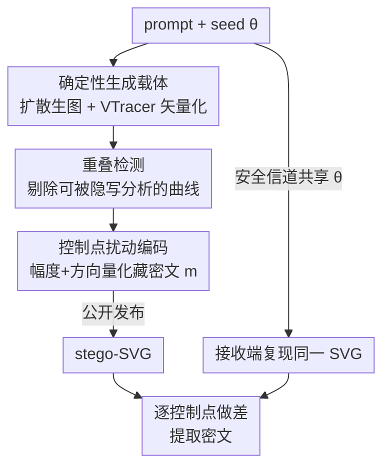

# GVIS: Generative Vector Image Steganography

**会议**: CVPR 2026  
**论文**: [CVF Open Access](https://openaccess.thecvf.com/content/CVPR2026/html/Xu_GVIS_Generative_Vector_Image_Steganography_CVPR_2026_paper.html)  
**代码**: 无  
**领域**: AI安全 / 信息隐藏  
**关键词**: 生成式隐写, 矢量图隐写, 贝塞尔曲线, 扩散模型, SVG  

## 一句话总结
GVIS 把"先用扩散模型确定性地生成栅格图、再矢量化成 SVG"当作隐写载体，通过微扰立方贝塞尔曲线控制点来嵌入密文，无需训练即可在不改变文件大小与统计分布的前提下，在单张 256×256 图上塞进约 8.8 万比特并实现 100% 无损提取，是第一个面向矢量图的生成式隐写框架。

## 研究背景与动机
**领域现状**：隐写术要把密文藏进数字媒介且不暴露"有信息"这件事。像素图是最成熟的载体——从经典 LSB、频域系数嵌入到深度学习端到端编解码，再到近年的"生成式隐写"（在合成图像的过程中嵌入信息，flow / GAN / diffusion 三条路线都被试过）。

**现有痛点**：像素域载体有两个绕不开的天花板——文件体积大、嵌入容量受限于栅格表示，对压缩和处理也脆弱。矢量图（SVG）天然分辨率无关、表示紧凑、无损可缩放，本该是更好的载体；但现有矢量隐写要么直接改 SVG 路径坐标的最低有效位、要么往曲线里插入额外控制点来编码比特——这些操作都会在文件里留下"人为修改"的痕迹（曲线被异常切分、坐标精度突变、文件体积暴涨），既容易被隐写分析识破，容量也很低。

**核心矛盾**：矢量隐写一直在"嵌入容量"和"不被察觉"之间二选一——想多藏信息就得更激进地改文件，而任何对文件本身的显式改动都会成为隐写分析的把柄。

**本文目标**：做一个 (1) 不依赖现成 cover 图、(2) 不改变文件大小与统计特征、(3) 高容量、(4) 无损可提取、(5) 免训练的矢量图隐写方案。

**切入角度**：作者注意到一个关键性质——只要图像生成过程是**确定性可复现**的（扩散模型固定 seed + 确定性矢量化算法），收发双方就能各自独立地重建出**完全相同**的原始 SVG。于是密文不必"写进文件"，而可以藏在"接收方重建出的原图 vs 收到的 stego 图"之间的**控制点差异**里。

**核心 idea**：用"确定性生成 + 矢量化"造一个可被双方复现的载体，把密文编码成立方贝塞尔曲线控制点的**微小扰动**（扰动幅度+方向），接收方靠重建原图做差分来解码——既不增加文件内容，也不破坏统计分布。

## 方法详解

### 整体框架
GVIS 的核心是一条"收发双方共享生成条件、各自复现同一张 SVG"的隐蔽信道。**发送端**用文本 prompt + 随机 seed 喂给扩散模型 $\mathcal{G}(\theta)$ 确定性地生成栅格图，再用确定性矢量化工具 VTracer（$\mathcal{F}_{\text{vec}}$）转成 SVG；接着对 SVG 里的立方贝塞尔曲线跑一遍**重叠检测**，把那些彼此重叠、改了会被隐写分析揪出来的曲线段排除掉，在剩下的"安全"控制点上用**扰动编码**把密文 $m$ 藏进去，得到 stego-SVG 公开发布。prompt 与 seed 通过安全信道私下共享。**接收端**用共享条件复现出一模一样的原始 SVG，再和收到的 stego-SVG 逐控制点做差，从坐标差异里恢复出密文。整体可写成 $\mathrm{SVG}_{\mathrm{Stego}} = \mathcal{S}\!\left(\mathcal{F}_{\text{vec}}\!\left(\mathcal{G}(\theta)\right),\, m\right)$，其中 $\mathcal{S}(\cdot, m)$ 就是基于控制点扰动的信息映射。

### 关键设计

**1. 确定性"先生成后矢量化"的可复现载体：让收发双方能各自重建出同一张 SVG**

矢量隐写要做"差分解码"，前提是接收端能复现出和发送端**逐控制点相同**的原始载体，否则做差就全是噪声。作者发现现有矢量生成方法（如基于 DiffVG 的可微渲染）在优化过程中引入了随机性，控制点不可复现，根本没法用来隐写。GVIS 改用**潜在扩散模型固定 seed** 来生成栅格图（同样的 prompt+seed 必出同样的图），再用 **VTracer** 这个确定性的栅格转矢量工具（配置为 color / stacked / spline 模式）做转换——两步都确定性，于是只要收发双方共享 $\theta=(\text{prompt}, \text{seed})$，就能各自独立地重建出**比特级一致**的原始 SVG。这也带来了"免训练"和"不依赖现成 cover 图"两个附带好处：载体是凭空生成的，没有原图可供攻击者比对。

**2. 重叠检测：在嵌入前剔除会暴露隐写痕迹的重叠贝塞尔曲线段**

VTracer 矢量化出来的 SVG 里，常有两条立方贝塞尔曲线**几乎处处重合**（一条是另一条经细分得到的子段）。如果在这种重叠曲线的控制点上做扰动，本该重合的两条曲线会出现微小错位——这是非常显眼的隐写分析信号。作者据此排除两类重叠：**Case 1**，曲线 H 的两端点都落在曲线 G 上且完全重合；**Case 2**，曲线 J 的一个端点落在曲线 K 上、部分重合。检测逻辑是：先看端点是否重合，重合则直接比控制点；否则在曲线上**均匀采样**判断采样点是否全部落在另一条曲线上。为加速这个两两比对（朴素是 $O(m^2)$ 对曲线），先用贝塞尔曲线的**凸包性质**——以四个控制点的 min/max 坐标构成包围盒（BBox），包围盒不相交的曲线对直接跳过（Algorithm 1）。这一步保证了被选去嵌入的控制点都来自"独立、不与他人重合"的曲线段，从源头消除几何异常。

**3. 基于贝塞尔控制点扰动的消息编码 + 可逆点筛选：用幅度与方向量化无损地藏密文**

立方贝塞尔曲线由四个控制点决定：$\mathbf{B}(t) = (1-t)^3\mathbf{P}_0 + 3(1-t)^2 t\,\mathbf{P}_1 + 3(1-t)t^2\mathbf{P}_2 + t^3\mathbf{P}_3$，其中端点 $\mathbf{P}_0,\mathbf{P}_3$ 固定、$\mathbf{P}_1,\mathbf{P}_2$ 决定形状。GVIS 只动 $\mathbf{P}_1,\mathbf{P}_2$：$\mathbf{P}_1' = \mathbf{P}_1 + \boldsymbol{\Delta}_1,\ \mathbf{P}_2' = \mathbf{P}_2 + \boldsymbol{\Delta}_2$。密文被映射成扰动的**两个维度**——扰动长度（把 $[0, L_{\max}]$ 均匀切成若干子区间）与扰动方向（把 $[0^\circ,360^\circ)$ 均匀切成若干角度子区间），每种"长度×方向"组合对应一段消息。

为什么这样不被察觉？作者给出了扰动对曲线形变的理论上界。当 $\boldsymbol{\Delta}_1,\boldsymbol{\Delta}_2$ 在半径 $r$ 的圆盘内均匀分布时，对整条曲线的期望均方误差为

$$\mathbb{E}[\mathrm{MSE}] = \int_0^1 \mathbb{E}\big[\|\mathbf{B}(t)-\mathbf{B}'(t)\|^2\big]\,dt = \frac{3}{35}\,r^2.$$

关键结论是：形变只正比于 $r^2$，**与控制点绝对位置、曲线具体形状都无关**。所以只要把 $L_{\max}$（即扰动半径上界）控制得足够小，形变就可忽略，视觉与结构都不变。另一个工程要点是**可逆点（invertible point）**：SVG 坐标只保留至多 $k$ 位小数，扰动后的点必须仍落在 $k$ 位精度的量化网格上、且反解码后能**还原回同一段密文**，只有满足这个条件的候选点才被选作嵌入位——这保证了嵌入与提取的一致与无损（100% 精度的根源）。

## 实验关键数据

### 主实验
在 CelebA-HQ 与 LSUN-Bedrooms 上（256×256，无条件由潜在扩散模型生成），与像素域和矢量域隐写方法对比。质量评估先把原 SVG 和 stego-SVG 都栅格化再算 SSIM/PSNR：

| 数据集 | 方法 | 类型 | SSIM | PSNR | 提取精度 | 容量(bits) |
|--------|------|------|------|------|---------|-----------|
| CelebA-HQ | RoSteALS | 像素 | 0.9087 | 31.01 | 0.9935 | 100 |
| CelebA-HQ | StegoSVG | 矢量 | 0.9995 | 57.75 | 1.0000 | 48000 |
| CelebA-HQ | svgsteg | 矢量 | 0.9999 | 61.63 | 1.0000 | 46441 |
| CelebA-HQ | **GVIS** | 矢量 | **0.9999** | **67.87** | **1.0000** | **88878** |
| LSUN-Bedrooms | svgsteg | 矢量 | 0.9999 | 62.96 | 1.0000 | 38484 |
| LSUN-Bedrooms | **GVIS** | 矢量 | **1.0000** | **69.50** | **1.0000** | **66830** |

GVIS 在两个数据集上都拿到最高 PSNR 和最高容量：CelebA-HQ 容量约为次优 svgsteg 的 1.9 倍，PSNR 还高出 6 dB。像素域方法（容量仅 32~100 bits）则完全不在一个量级。

### 容量-精度权衡（消融）
固定角度划分（24 partition），改变扰动长度的划分粒度（$n$ bits → $2^n$ 段，长度维最多映射 4 bits / 16 段，范围 0.00001~0.01024）：

| 角度划分 | 长度划分(bits) | 容量(bits) | 提取精度 |
|---------|--------------|-----------|---------|
| 24 | 21 | 18516 | 1.0000 |
| 24 | 22 | 37033 | 1.0000 |
| 24 | 23 | 55549 | 1.0000 |
| 24 | 24 | 88878 | 1.0000 |
| 24 | 24（更细）| 103691 | 0.9999 |
| 24 | 24（更细）| 118504 | 0.9750 |

在 SVG 8 位小数精度下，单个控制点至少能嵌 24 bits 且保持 100% 提取；继续加大容量精度才开始缓慢下滑，作者指出多出来的容量可用于纠错码进一步提升可靠性。

### 文件大小（安全性侧证）
| 数据集 | 方法 | 文件大小 |
|--------|------|---------|
| CelebA-HQ | 原始 SVG | 520.79 KB |
| CelebA-HQ | StegoSVG | 1485.24 KB |
| CelebA-HQ | StegoBIT | 799.21 KB |
| CelebA-HQ | svgsteg | 521.77 KB |
| CelebA-HQ | **GVIS** | **519.99 KB** |

GVIS 的 stego 文件和原始 SVG 几乎一样大（甚至略小），因为它只改"恰好用 $k$ 位小数表示"的控制点坐标、不增加曲线数量或坐标精度；而 StegoSVG 因切分曲线把文件撑到了近 3 倍。

### 关键发现
- **可逆点 + 小半径扰动是 100% 无损提取的根本**：把扰动半径压在 $\frac{3}{35}r^2$ 可忽略的范围内，再用可逆点保证量化后仍能反解回同一密文，于是高容量与零误码可以兼得。
- **安全性接近理论极限**：用 SiaStegNet、StegNet、ZhuNet、YeNet、XuNet 五个隐写分析网络（先栅格化再分析）检测，准确率都在 50% 左右——等于随机猜，stego 与正常图分布几乎不可区分。
- **不动最低有效位是隐蔽性的关键**：控制点坐标最低有效数字的分布（图 7）显示 stego 与原图基本重合；GVIS 在"语义层"扰动而非直接改 LSB，因此不破坏底层统计分布。

## 亮点与洞察
- **把"可复现性"当成隐写的一等设计目标**：最聪明的地方是意识到"确定性生成 + 确定性矢量化"能让双方各自重建同一载体，于是密文可以不写进文件、而藏在差分里——这直接绕过了"任何文件改动都会被隐写分析盯上"的死结。
- **理论支撑很干净**：$\mathbb{E}[\mathrm{MSE}]=\frac{3}{35}r^2$ 且与曲线形状无关，给"扰动多小才安全"提供了可计算的旋钮，而不是靠经验调参。
- **零成本载体**：免训练、不需要现成 cover 图、文件体积不变，工程落地门槛极低，把扩散生图和 VTracer 这两个现成确定性组件直接拼成了隐写信道。
- **可迁移思路**：用"共享生成条件 → 双方复现 → 差分解码"的范式做隐写，原则上可推广到任何确定性可复现的生成媒介（如确定性采样的音频/3D 资产），核心只要求"载体可被双方独立重建"。

## 局限与展望
- **强依赖确定性可复现**：一旦扩散模型权重、采样器实现或 VTracer 版本在收发端不一致，重建就会失配、差分解码崩掉——对部署环境的同步要求很高。
- **安全信道仍是前提**：prompt 与 seed 必须经安全信道共享，框架只解决了"载体隐蔽"，没解决"密钥分发"。
- **隐写分析评测是间接的**⚠️：矢量图缺少专用隐写分析器，作者只能先栅格化再用像素域分析网络评测；50% 检测率在这个 proxy 设定下成立，但不等于专门针对矢量结构（如控制点几何异常）的分析也无效，作者也坦言矢量隐写分析方法稀缺。
- **静态图限制**：当前只做静态 SVG，作者把动态矢量图（动画）列为未来方向。
- **容量上限受 SVG 小数精度约束**：再细的角度/长度划分需要更高坐标精度，而 SVG 精度有限，超过约 10 万比特后精度开始下滑。

## 相关工作与启发
- **vs StegoSVG / 切分类矢量隐写**：它们通过切分曲线或插入控制点来编码，会显著增大文件（StegoSVG 达原图近 3 倍）并留下"曲线被异常切分"的可检测痕迹；GVIS 只微扰已有控制点、文件大小几乎不变，且嵌入前用重叠检测排除几何异常。
- **vs svgsteg / 改 LSB 的矢量方法**：直接改坐标最低有效位会扰动其统计分布；GVIS 在语义层（控制点几何）扰动、保持 LSB 分布不变，容量还高出近 1 倍。
- **vs 像素域生成式隐写（flow/GAN/diffusion）**：像素载体体积大、容量受栅格表示限制（对比方法仅 32~100 bits）；GVIS 借矢量图的紧凑无损特性把容量推到上万比特量级，且天然分辨率无关。

## 评分
- 新颖性: ⭐⭐⭐⭐⭐ 首个生成式矢量图隐写框架，"可复现载体 + 差分解码"的思路确实新。
- 实验充分度: ⭐⭐⭐⭐ 容量/质量/安全性/文件大小都覆盖了，但隐写分析只能用栅格化 proxy，缺矢量域专用评测。
- 写作质量: ⭐⭐⭐⭐ 理论推导清晰、pipeline 完整，图表支撑到位。
- 价值: ⭐⭐⭐⭐ 免训练、文件不变、高容量，工程落地价值高；受限于安全信道与确定性复现假设。

<!-- RELATED:START -->

## 相关论文

- [\[CVPR 2026\] RunawayEvil: Jailbreaking the Image-to-Video Generative Models](runawayevil_jailbreaking_the_image-to-video_generative_models.md)
- [\[ICML 2026\] Training-Free Coverless Multi-Image Steganography with Access Control](../../ICML2026/ai_safety/training-free_coverless_multi-image_steganography_with_access_control.md)
- [\[CVPR 2026\] PROMPTMINER: Black-Box Prompt Stealing against Text-to-Image Generative Models via Reinforcement Learning and VLM-Guided Optimization](promptminer_black-box_prompt_stealing_against_text-to-image_generative_models_vi.md)
- [\[CVPR 2026\] SAGA: Source Attribution of Generative AI Videos](saga_source_attribution_of_generative_ai_videos.md)
- [\[CVPR 2026\] UniDef: Universal Defense Against Unauthorized Image Manipulation](unidef_universal_defense_against_unauthorized_image_manipulation.md)

<!-- RELATED:END -->
