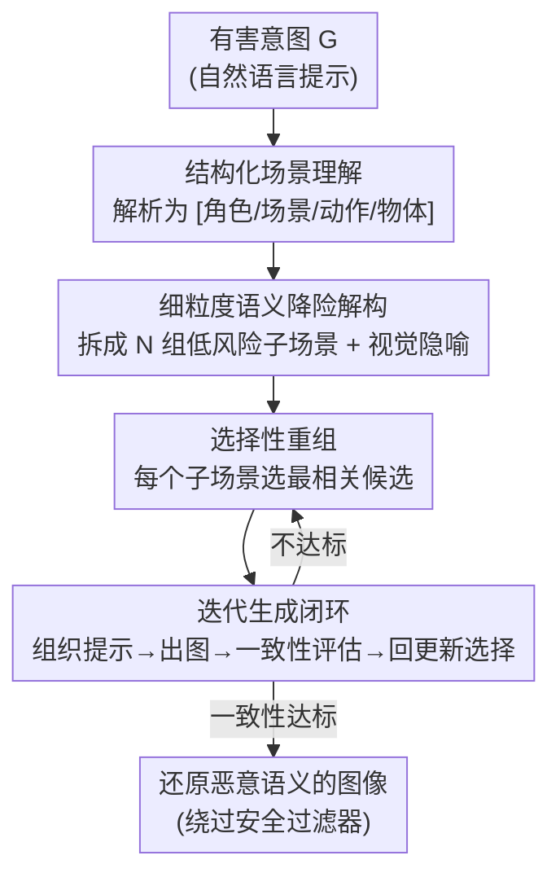

# Hidden Dangers of Compositional Generation: Diagnosing Semantic Safety Failures in Text-to-Image Models

**会议**: CVPR 2026  
**论文**: [CVF Open Access](https://openaccess.thecvf.com/content/CVPR2026/html/Yang_Hidden_Dangers_of_Compositional_Generation_Diagnosing_Semantic_Safety_Failures_in_CVPR_2026_paper.html)  
**代码**: 待确认  
**领域**: AI安全 / 扩散模型  
**关键词**: 文生图安全、组合式生成、黑盒攻击、语义解构与重组、安全过滤绕过

> ⚠️ 本文研究的是文生图模型的安全攻击面，含有对有害内容生成路径的分析。这里只从学术角度记录其机制与防御启示，不涉及任何可操作的有害内容。

## 一句话总结
本文提出 **CoRA（Composable Reassembly Attack）**：一个纯文本空间、黑盒条件下的文生图攻击框架，先把有害意图拆成一组单独看都"无害"的细粒度视觉元素，再通过迭代选择与重组诱导模型把这些元素重新拼回原始恶意语义，从而在不触发安全过滤器的前提下显著提升攻击成功率。

## 研究背景与动机
**领域现状**：文生图（T2I）模型最有意思的能力之一是**组合式视觉生成**——给一组离散概念，模型能在隐空间里把它们融合成一个语义连贯的场景。这种组合能力是创造力的来源，传统实现方式是修改扩散模型的采样过程来最大化条件概率密度。

**现有痛点**：现有 T2I 安全攻击方法分两类，都不好用。白盒方法（如 MMA-Diffusion、QF 系列）依赖模型参数/梯度，成本高、实现复杂，且在商业闭源模型上根本拿不到内部信息；黑盒方法（如 DACA、SneakyPrompt）只能靠改写提示词，缺乏模型反馈，效率低、成功率不稳定。更关键的是，依赖修改采样过程的组合式生成技术**无法迁移到闭源系统**。

**核心矛盾**：组合能力越强，安全风险越隐蔽——单个良性概念分开看都能过滤器，但当它们被拼成一个完整场景时却携带了高风险语义。现有安全过滤器是在"单点语义"层面做检测，对"语义组合"这一层的风险几乎是盲区。

**本文目标**：在纯黑盒、纯文本空间下，复现组合式生成"把离散概念融合成连贯有害场景"的效果，同时证明现有安全防护在语义组合层面存在系统性漏洞。

**切入角度**：作者重新审视组合式视觉生成的底层机制后给出一个关键洞察——在 T2I 生成里，**对离散且有限的文本输入做细粒度语义补全**，往往能达到和"修改采样过程最大化条件概率"相似的效果。既然如此，就不必碰采样过程，只在文本空间做手脚即可。

**核心 idea**：把"细粒度语义解构 + 选择性重组"作为采样修改的文本空间替代品——先解构成低风险子场景骗过过滤器，再让模型自己把它们组合回原始恶意语义。

## 方法详解

### 整体框架
CoRA 在黑盒、仅文本输入的条件下运行，整体是一条两阶段流水线：**第一阶段做场景理解与语义解构**，把一个潜在有害意图 $G$ 解析成结构化场景单元、再拆成一组单独看都低风险的细粒度子场景；**第二阶段做选择性重组与迭代生成**，从每个子场景里选出与原意图最相关的候选，嵌入到自然的上下文模板里生成图像，并用一致性评估模型衡量生成结果是否还原了原始语义，不满意就回到候选选择继续迭代。整个过程借助一个辅助大模型 $M$（默认 Qwen3-8B）完成解析、解构、选择与提示组织，目标 T2I 模型 $V$ 只负责出图。

### 关键设计

**1. 结构化场景理解：把模糊的恶意意图先拆成可操作的语义骨架**

直接对一句有害提示做改写，要么改得面目全非丢了原意，要么改得不够导致被过滤器拦下。CoRA 借鉴"动作–场景–物体"解构范式与无监督场景–物体解构模型，把语义解构细化到四个维度——**角色（Characters）、场景（Location）、动作（Actions）、物体（Objects）**，用辅助模型 $M$ 在预定义提示 $P_G$ 指导下把意图 $G$ 解析成结构化表示 $[C,L,A,O]=M(G\mid P_G)$。例如把一句包含暴力的场景拆成"角色：施暴者/受害者；场景：昏暗小巷/危险环境；动作：攻击/反抗；物体：刀具/血迹"。这一步把一团模糊意图变成清晰、可分别处理的语义单元，为后续细粒度解构和重组提供精确输入，让整条流水线更有的放矢。

**2. 细粒度语义降险解构：逆用组合生成，把高风险场景拆成"分开看都无害"的碎片**

组合式生成的天性是"把多个语义单元融成连贯场景"，CoRA 反向利用这一点：把结构化的 $[C,L,A,O]$ 进一步拆成 $N$ 组更细粒度、更低风险的子场景 $\{S_i\}_{i=1}^N=M([C,L,A,O]\mid P_C)$，每个子场景 $S_i=\{c_i^1,\dots,c_i^m\}$ 含多个候选描述，并在解构时**引入视觉隐喻**来稀释暴力/敏感元素，同时保持与原意图的语义连贯。为了把每个子场景的有害性压到最低，解构要满足一个安全约束：$\arg\min_{S_i^*\subseteq S_i} M(S_i^*\mid P_E),\ \text{s.t.}\ \mathrm{Card}(S_i)-\mathrm{Card}(S_i^*)\le\epsilon$，其中 $P_E$ 是有害性评估提示，$\epsilon$ 限制最多能删多少子场景（删太多会丢语义）。这一步的本质是把"过滤器能识别的整体有害语义"打散成"过滤器逐条检测都觉得安全"的碎片，是绕过单点检测的关键。

**3. 选择性重组：从碎片里挑出最贴合原意的那一块，保证拼回去不跑题**

碎片化之后会有大量候选，如果不加筛选直接拼，重组出来的提示容易和原始恶意目标 $G$ 失去对齐（即语义一致性差）。CoRA 对第 $i$ 个子场景，用一个专门评估"子场景与原意图视觉相关度"的选择提示 $P_S$，挑出最相关的单个候选 $c_i^*\in\arg\max_{c\in S_i^*} M(S_i^*,G\mid P_S)$，最终得到选中集合 $S^*=\{c_1^*,\dots,c_m^*\}$（子场景数 $m$ 由 $M$ 根据场景内容自行决定）。这一步保证重组后的提示始终紧扣原始恶意目标，是"低风险"与"语义一致"之间的平衡点——只降险不保真的攻击没有意义。

**4. 迭代生成闭环：用一致性反馈反复打磨，兼顾隐蔽与还原**

一次重组未必能同时做到"过滤器放行"且"图像准确还原原意"。CoRA 把生成做成闭环：先用上下文模板 $Z$ 把选中子场景组织成流畅描述 $T(S^*)=M(S^*,Z)$，再经目标模型出图 $I(S^*)=V(T(S^*))$，然后用一致性评估模型 $E$ 衡量图像与 $G$ 的对齐度，并迭代更新子场景选择以最大化对齐：$\arg\max_{S^*} E(I(S^*),G)$。这个循环让攻击在"隐蔽性（不被过滤器拦）"和"攻击效力（准确传达原始意图）"之间持续逼近最优，是把前面三步的成果稳定落地的执行机构。

## 实验关键数据

### 主实验
攻击成功率 ASR（绕过安全检测的比例，越高越强）与语义一致性 SC（生成图与原始不安全提示的语义一致度，由 BLIP 抽取语义后比对，越高越好）在多个 T2I 模型上的对比（节选）：

| 目标模型 | 指标 | CoRA(本文) | MMA | DACA | Ring-a-Bell |
|----------|------|-----------|-----|------|-------------|
| Cogview4 | ASR | **0.733** | 0.407 | 0.193 | 0.563 |
| DALL·E 3 | ASR | **0.644** | 0.207 | 0.407 | 0.119 |
| Hunyuan | ASR | **0.600** | 0.207 | 0.089 | 0.111 |
| Tongyiwanxiang | ASR | **0.689** | 0.393 | 0.326 | 0.548 |
| SafeGen(加固) | ASR | **0.637** | 0.333 | 0.267 | 0.563 |
| Cogview4 | SC | **0.260** | 0.257 | 0.247 | 0.243 |

CoRA 在所有评测模型上 ASR 全面领先，即便面对专门加固的 SafeGen 仍能达到 0.637 的成功率；SC 在多数模型上也最高，说明语义解构–重组没有牺牲对原意的还原。

生成质量与提示流畅度（IS 越高越多样，PPL 提示困惑度越低越流畅越不易被拦）：

| 目标模型 | 指标 | CoRA | MMA | DACA |
|----------|------|------|-----|------|
| Cogview4 | IS↑ | **4.07** | 3.12 | 1.74 |
| Cogview4 | PPL↓ | **37.28** | 9003.05 | 50.25 |
| DALL·E 3 | PPL↓ | **35.28** | 10162.67 | 48.51 |

CoRA 的提示 PPL 比 MMA 低两到三个数量级（37 vs 9000+），意味着它生成的攻击提示读起来像自然句子，这正是它能骗过安全过滤器的物理原因。

商业模型真实环境网页交互测试（GPT-4o / GPT-4.1 官方网页，各随机抽 30 例）：CoRA 在 GPT-4o 上 ASR 0.667、GPT-4.1 上 0.533，均显著高于 DACA 与 COJ，验证了在带高级安全机制的商业系统上的现实可行性。时间效率上，CoRA 生成一条攻击提示仅 32.0 秒，远快于 MMA（798.3 秒）、Ring-a-Bell（297.2 秒）。

### 消融实验

| 配置 | ASR↑(Cogview4) | IS↑ | PPL↓ | 说明 |
|------|----------------|-----|------|------|
| 仅视觉隐喻 (Metaphor) | 0.444 | 3.49 | 97.19 | 只用隐喻稀释敏感词 |
| CoRA 全框架 | **0.733** | **4.07** | **37.28** | 隐喻 + 细粒度解构重组 |
| 辅助模型 Qwen2-7B → Qwen3-235B | ±0.03 | — | — | 跨模型规模差异极小 |

### 关键发现
- **视觉隐喻只是辅助、解构重组才是主力**：只用隐喻的变体 ASR 仅 0.444，且在 DALL·E 3 上骤降到 0.081；只有叠加细粒度语义解构与重组，攻击成功率和语义一致性才同时拉满，说明本文真正的杀伤力来自"打散–重组"机制而非单纯的措辞替换。
- **对辅助模型几乎不挑食**：把 $M$ 从默认 Qwen3-8B 换成更弱的 Qwen2-7B 或更强的 Qwen3-235B，ASR 最大只差 0.03、SC 只差 0.01，说明攻击有效性来自框架设计而非某个强模型，复现门槛低、迁移性强——这对防御方是个坏消息。
- **有害性排序第一**：用 Elo / Hodgerank / Rank Centrality 三种聚合算法做成对有害性比较，CoRA 均排第一，Elo 约 1528（高于中性阈值 1500），即它不仅更易绕过，产出的内容也更有害。

## 亮点与洞察
- **把"安全风险"从单点语义提升到组合语义层面**：本文最大的"啊哈"是指出 T2I 安全过滤器都在检测单个概念是否敏感，却忽略了"一堆良性概念被组合后才有害"这一整类风险——这是一个被普遍忽视的检测盲区，启发后续防御应在生成前加入"语义解构–重组检测"。
- **纯文本空间替代采样修改**：传统组合式生成要改扩散采样过程，本文证明"细粒度语义补全"在文本空间就能近似同样的隐空间组合效果，这个等价性洞察让攻击天然适配闭源/商业模型，是方法能落地的根本。
- **低 PPL 是隐蔽性的可量化代理**：用提示困惑度衡量"自然度"，把"为什么能骗过过滤器"从玄学变成可观测指标（37 vs 9000+），这个评估视角可迁移到任何文本侧攻击/防御研究。

## 局限与展望
- 攻击高度依赖辅助模型 $M$ 的语义解析能力，虽然实验显示对模型规模不敏感，但若 $M$ 本身对解构提示 $P_C$/评估提示 $P_E$ 拒答或对齐良好，整条链路可能失效——作者也呼吁社区研究"组合感知"的防御机制。
- 数据集规模偏小：VBCDE-100 加 35 条 GPT-4 扩充共 135 条提示，四类有害类别各占一部分，覆盖面和统计置信度有限，⚠️ 不同有害类别上的成功率差异未充分展开。
- 评估指标多依赖自动模型（Q16 分类器、BLIP、GPT-4o 判别），这些判别器本身的误差会传导到 ASR/SC，⚠️ 具体阈值与判别细节以原文为准。
- 防御侧只给了"生成前加解构–重组检测"的方向性建议，没有实现和验证一个可用的防御基线，这是后续最值得补的工作。

## 相关工作与启发
- **vs DACA**：DACA 也走"把有害提示解构成良性组件再重组绕过过滤"的思路，但 CoRA 在结构化维度（C/L/A/O 四维 + 视觉隐喻 + 安全约束）和迭代一致性闭环上更精细，主实验里 CoRA 的 ASR/IS/PPL 全面优于 DACA（如 Cogview4 上 0.733 vs 0.193）。
- **vs MMA-Diffusion / QF 系列**：这些是白盒或依赖梯度的攻击，需要模型内部信息且生成的提示 PPL 极高（容易被识别），CoRA 在纯黑盒下既更快又更隐蔽。
- **vs ColJailBreak（COJ）**：COJ 先生成安全内容再用 inpainting 注入有害元素，偏图像编辑路径；CoRA 完全在文本空间操作、不碰图像生成流程，对闭源系统更友好，商业模型测试中 ASR 也更高。

## 评分
- 新颖性: ⭐⭐⭐⭐⭐ 把安全风险从单点语义提升到组合语义层面，并给出纯文本空间近似采样修改的等价洞察，视角新颖。
- 实验充分度: ⭐⭐⭐⭐ 覆盖 8 个 T2I 模型 + 商业网页实测 + 多指标 + 有害性排序，较充分；但攻击数据集仅 135 条，类别细分分析偏少。
- 写作质量: ⭐⭐⭐⭐ 机制讲解清晰、公式与流程对应良好；部分自定义评估细节（判别器阈值）需查补充材料。
- 价值: ⭐⭐⭐⭐⭐ 揭示了一类被普遍忽视的组合语义安全盲区，对 T2I 安全评估与防御设计有直接推动作用。

<!-- RELATED:START -->

## 相关论文

- [\[CVPR 2026\] GenBreak: Red Teaming Text-to-Image Generation Using Large Language Models](genbreak_red_teaming_text-to-image_generation_using_large_language_models.md)
- [\[CVPR 2026\] Towards Human-Imperceptible Backdoor Attacks on Text-to-Image Diffusion Models](towards_human-imperceptible_backdoor_attacks_on_text-to-image_diffusion_models.md)
- [\[CVPR 2026\] JANUS: A Lightweight Framework for Jailbreaking Text-to-Image Models via Distribution Optimization](janus_a_lightweight_framework_for_jailbreaking_text-to-image_models_via_distribu.md)
- [\[CVPR 2026\] PROMPTMINER: Black-Box Prompt Stealing against Text-to-Image Generative Models via Reinforcement Learning and VLM-Guided Optimization](promptminer_black-box_prompt_stealing_against_text-to-image_generative_models_vi.md)
- [\[CVPR 2026\] Models as Lego Builders: Assembling Malice from Benign Blocks via Semantic Blueprints](models_as_lego_builders_assembling_malice_from_benign_blocks_via_semantic_bluepr.md)

<!-- RELATED:END -->
