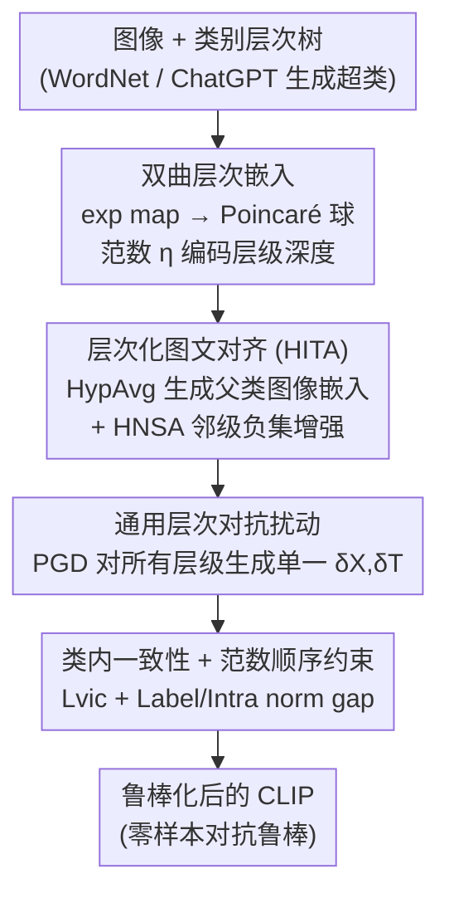

# Hierarchically Robust Zero-shot Vision-language Models

**会议**: CVPR 2026  
**论文**: [CVF Open Access](https://openaccess.thecvf.com/content/CVPR2026/html/Dong_Hierarchically_Robust_Zero-shot_Vision-language_Models_CVPR_2026_paper.html)  
**代码**: 待确认  
**领域**: AI安全 / 对抗鲁棒 / 多模态VLM  
**关键词**: 对抗微调, CLIP 鲁棒性, 双曲嵌入, 类别层次, 零样本分类

## 一句话总结
把 CLIP 的对抗微调从"只对齐叶子类（base class）的扁平方案"改造成"沿 WordNet 类别树多层级对齐"的层次方案，借助双曲（Poincaré 球）几何让不同层级天然拥有不同大小的间隔（margin），从而生成更通用的对抗扰动，在 15 个数据集上同时提升干净精度（62.5%）和鲁棒精度（45.4%）。

## 研究背景与动机

**领域现状**：CLIP 这类视觉-语言模型（VLM）能做零样本分类，但对对抗样本极其脆弱（标准 CLIP 在 PGD 攻击下鲁棒精度仅 ~7%）。主流补救手段是**对抗微调**（adversarial fine-tuning），如 TeCoA / PMG-FT / FARE：把每张图的对抗特征与它所属 base 类（叶子类，如 "kit fox"）的文本嵌入对齐，让模型在攻击下仍能匹配正确类别。

**现有痛点**：这些方法都在**扁平的类别结构**上做"逐样本对齐"——只盯着 base 类，忽略了类别本身的层次信息（fox←canine←carnivore←mammal）。作者用实验揭示了一个被忽视的漏洞：当攻击者把对抗样本瞄准**父类/超类**（superclass，如 mammal）而非叶子类时，TeCoA/PMG/FARE 在超类上的鲁棒精度大幅崩塌（图 1a）；反过来，在超类层级生成的对抗样本能高成功率地迁移去攻击叶子类（图 1b）。

**核心矛盾**：只在 base 类上做对抗学习，得到的扰动**按设计就只关注叶子类**，无法泛化到更一般的语义层级；而真实攻击可以发生在任意抽象层级。问题的根源是"扁平类空间 + 欧氏几何"——欧氏分类器的可行间隔被限制在有限范围 (0,1)，无法同时覆盖"从通用到专门"的多种泛化尺度。

**本文目标**：(i) 把对抗微调重写成利用类别层次的版本；(ii) 让一次扰动同时威胁多个抽象层级，得到更通用的对抗样本去鲁棒化模型。

**切入角度**：树天然能以极低失真嵌进双曲空间（Poincaré 球）；并且在双曲空间里，**向量的范数 $\eta=\|\phi\|_2$ 直接编码节点在树中的深度**（范数越小越靠近根/越通用）。更关键的是，双曲分类器的可行间隔会随范数 $\eta\to 1/\sqrt{r}$ **指数增长到无穷**，而欧氏分类器只能有限——这意味着不同层级天生对应不同大小的 margin。

**核心 idea**：用双曲层次嵌入承载"叶子→根"的类别树，让各层级同时参与图文对抗对齐，并生成一个对所有层级都有效的**通用层次扰动**，把单一 margin 的对抗微调升级为"多 margin、多泛化尺度"的层次鲁棒化。

## 方法详解

### 整体框架
方法在 CLIP 的图像/文本双编码器之上做对抗微调。文本侧把每个类沿类别树（ImageNet 用 WordNet，其它数据集用 ChatGPT-4o 生成超类）取出从叶子到根的完整路径，每个层级各编一条提示；所有嵌入经指数映射（exp map）送入 Poincaré 球。图像侧只有 base 类标注，于是用**双曲平均 HypAvg** 把同一父类下若干子类图像嵌入"上卷"成更通用的父类图像嵌入。随后在每个层级做图文对齐，并对所有层级一次性生成通用对抗扰动 $\delta_X,\delta_T$，最后加上类内一致性与范数顺序约束，得到鲁棒化后的 CLIP。

### 关键设计

**1. 双曲层次嵌入：用范数当"层级标尺"**

扁平欧氏对齐的根本局限是只有一个固定 margin，覆盖不了"通用 vs 专门"的多尺度泛化。作者把类别树嵌进 Poincaré 球 $\mathbb{D}^d_r=\{\phi\in\mathbb{R}^d \mid \|\phi\|_2^2<1/r\}$，用指数映射 $\exp^r_0(\cdot)$ 把 CLIP 的欧氏嵌入投进双曲空间，并用 Riemannian 距离 $d_r(u,v)=\frac{2}{\sqrt r}\tanh^{-1}(\sqrt r\|-u\oplus v\|_2)$ 度量。关键性质是：**向量范数 $\eta=\|\phi\|_2$ 单调编码节点在树里的深度**——父类（更通用）范数更小、更靠球心，子类（更专门）范数更大、更靠边界。作者据此证明了 Theorem 1：双曲分类器的可行 log-margin $m_r(\eta)$ 在 $\eta\to 1/\sqrt r$ 时趋于无穷（欧氏分类器只能停在有限值 $2\lambda\eta^2$）。因此沿树铺开的多个层级**天然提供从小到大的一系列 margin**，这是后面"扰动更通用"的几何根基。

**2. 层次化图文对齐 HITA：HypAvg 造父类图像嵌入 + HNSA 负集增强**

文本侧每个层级都有提示嵌入，但图像侧没有"超类图像"（不存在一张代表所有 car 的通用图）。作者用**双曲平均 HypAvg**（基于 Einstein 中点，见式 8）把 mini-batch 内同父类的若干子类图像嵌入聚成一个范数更低、更靠球心的父类图像嵌入 $\phi^l_c=\mathrm{HypAvg}(\{\phi(x):x\in X^l_c\})$，递归地从 $l=0$ 叶子逐层卷到 $l=L$ 根。于是每个层级都能做图文对齐，整体写成 Hierarchy-preserving Image-Text Alignment（HITA，式 10）：$L'=\max_{\delta}\sum_{l=0}^{L}\omega_l\, L_{CE}(p^l,\,t^l_c+\delta_T,\,y(c))$，层级权重 $\omega_l=1-\frac{l}{L+1}$ 越靠叶子权重越大。同时设计 **Hierarchy-aware Negative Set Augmentation（HNSA）**：在 softmax 概率（式 9）的分母里塞进相邻层级 $l\pm1$ 中"不与当前类共边"的类作为额外负样本 $\eta^l_c$，让对齐不仅区分同级类、还区分跨层级的语义混淆。消融显示同时用上下两级负集比只用一级更好。

**3. 通用层次对抗扰动：一次扰动打穿所有层级**

有了多层级分类器后，怎么生成对抗样本是关键。朴素做法是为每个层级各自跑 PGD（"diverse hierarchical perturbations"），但既慢又效果一般。本文用 PGD 在式 (10) 的层次目标上生成**单一的通用扰动** $\hat x=x+\delta_X,\ \hat t=t+\delta_T$，让这同一个扰动同时去抬高所有层级分类器的对抗风险。其有效性来自设计 1 的几何：父类分类器 margin 小、最易被攻破，得到的扰动因父类标签空间更通用而更"普适"；这同一个扰动作用到子类分类器（margin 大）时又被专门化，于是获得"从通用到专门"的鲁棒化能力。消融（表 12）很说明问题：通用层次扰动 44.34% PGD 且每 epoch 仅 73.2 min，而"逐层级各自扰动"只有 42.35% 却要 154.2 min——又好又省一半时间。

**4. 类内一致性与范数顺序约束：守住层次几何的完整性**

单纯做层级对齐会有两个塌缩风险：图像嵌入被硬拉到 base 类文本嵌入上（丢掉个体细粒度差异），以及各层级嵌入的范数顺序被打乱（父类范数本该小于子类）。作者加两组软约束：**类内邻域对齐** $L_{vic}=\sum d_r(\phi(\hat x_c),\psi(\hat t_c))-\zeta_{vic}$ 只把图像嵌入约束进文本嵌入附近半径 $\zeta_{vic}$ 内、不强行重合；**范数顺序惩罚**（式 11、13）用 $\max(0,\|\psi(\hat t^{l+1}_c)\|_2-\|\psi(\hat t^l_c)\|_2+\zeta_{gap})$ 强制"父类范数 < 子类范数"，保住树深度与范数的对应关系。消融（表 10）：在 HITA 之上加 vic 把干净精度从 59.27→62.35、加 gap 进一步稳住鲁棒性，完整模型 62.14/44.34（clean/PGD）。

### 损失函数 / 训练策略
总目标 $L=L'+\lambda_1 L_{vic}+\lambda_2(L^{Label}_{gap}+L^{Intra}_{gap})$（式 14）。与以往只动图像编码器不同，本文**同时优化文本编码器的投影层**以获得更好的层次对齐。骨干为 CLIP ViT-B/32，在 ImageNet 上微调，WordNet 层次深度 $L=5$；图像扰动半径与步长 $\epsilon_X=\alpha_X=1/255$、文本扰动 $\epsilon_T=2\times10^{-4}$，PGD 迭代 3 步。还支持"多棵树森林"（不同父类标签共享同叶子）：对每棵树各算一遍损失再相加（论文用到 5 棵树）。

## 实验关键数据

### 主实验
在 ImageNet 上对抗微调，再零样本评测 15 个数据集（含 ImageNet）的平均干净精度与 PGD-20 鲁棒精度（$\epsilon_X=1/255$，ViT-B/32）。

| 方法 | 平均干净精度 | 平均鲁棒精度 (PGD-20) |
|------|------|------|
| CLIP (2021) | 64.90 | 7.21 |
| TeCoA (2023) | 52.62 | 38.91 |
| PMG-FT (2024) | 57.36 | 39.72 |
| FARE (2024) | 59.67 | 37.93 |
| AoS (2025) | 61.70 | 43.88 |
| **本文 (Ours)** | **62.14** | **44.34** |
| **本文 (5 棵树)** | **62.49** | **45.39** |

相比 FARE，干净精度平均 +2.5%、鲁棒精度平均 +6.4%；5 棵树版本比最新的 AoS 在干净/鲁棒上再 +1%/+1.5%，而 AoS 用了 10× 图像增广、50× 文本增广。更强攻击（CW、Auto-Attack）下、更大扰动半径（2~4/255）下、以及 ViT-L/ResNet-50 骨干上，本文均保持领先；扩展到 BLIP/CoCa 的图文检索与图像描述、以及医学 CLIP（ChestXray14/CheXpert/PadChest）也都更鲁棒。

### 消融实验

| 配置 | 干净 | PGD | AA | 说明 |
|------|------|-----|-----|------|
| 基线 (TeCoA) | 52.62 | 38.91 | 37.62 | 扁平逐样本对齐 |
| + HITA | 59.27 | 42.08 | 40.59 | 加层次图文对齐 |
| + HITA + vic | 62.35 | 43.67 | 42.18 | 再加类内邻域对齐 |
| + HITA + gap | 60.06 | 43.15 | 41.54 | 再加范数顺序惩罚 |
| Full (全部) | 62.14 | 44.34 | 42.72 | 完整模型 |

| 对抗扰动生成策略 | 干净 | PGD | AA | 每 epoch 时间 |
|------|------|-----|-----|------|
| 仅叶子层扰动 | 60.25 | 41.59 | 40.23 | 70.1 min |
| 逐层级分别扰动 | 61.37 | 42.35 | 40.88 | 154.2 min |
| **通用层次扰动** | **62.14** | **44.34** | **42.72** | **73.2 min** |

### 关键发现
- **层次对齐 HITA 贡献最大**：单独加上去就把鲁棒精度从 38.91→42.08、干净精度 +6.65%，印证"丰富的层次决策边界"是主要增益来源。
- **负集增强要"上下两级都用"**：只用低级或只用高级超类（43.62 / 43.83）都不如上下都用（44.34），说明跨层级负样本提供了互补的判别信息。
- **"通用扰动"是效率与效果的甜点**：一次扰动打穿所有层级既比逐层级扰动更鲁棒（44.34 vs 42.35），又把训练时间砍掉一半多——这是双曲多 margin 几何带来的直接红利。
- 超类生成 LLM 的选择影响很小（LLaMA-2 / Claude-2 / ChatGPT-4o 差异 <1%），说明方法不强依赖某个特定 LLM。

## 亮点与洞察
- **把"类别层次"重新带回对抗鲁棒**：以往对抗微调默认扁平类空间，本文用一个简单实验（超类对抗样本能反向迁移攻击叶子类）戳破了这个盲区，动机非常具体、有说服力。
- **范数即层级、margin 随深度指数增长**：用双曲几何把"嵌入深度"和"可行间隔大小"绑定，是个可迁移的设计原语——任何需要"多尺度泛化"的对齐任务都可借鉴这种"靠范数排层级"的思路。
- **HypAvg 解决了"图像没有超类样本"的实际困难**：用 Einstein 中点把子类图像嵌入聚成父类嵌入，既符合双曲几何、又给图像侧补齐了层级标签，是工程上很关键的一步。

## 局限与展望
- 方法依赖一棵可靠的类别树：ImageNet 有 WordNet，其它数据集要靠 ChatGPT 生成超类 + 人工审核，质量与可扩展性存疑（虽然消融显示对 LLM 选择不敏感，但仍需人工把关）。
- 双曲运算（exp/log 映射、Riemannian 距离、HypAvg）引入额外计算与数值稳定性处理（投影 $\xi$ 防止触界），实现复杂度高于普通欧氏方案。
- 评测集中在分类与少量下游任务；对开放词表检测、密集预测等更复杂任务的层次鲁棒性尚未验证。
- 曲率 $r$、各层权重 $\omega_l$、范数间隔 $\zeta_{gap}$ 等超参的敏感性正文披露有限，⚠️ 具体取值以原文附录为准。

## 相关工作与启发
- **vs TeCoA / PMG-FT / FARE**：它们都在扁平 base 类上做逐样本对抗对齐，只有单一 margin；本文沿类别树多层级对齐，用双曲几何获得多 margin，因而扰动更通用、鲁棒迁移更强。
- **vs AoS (2025)**：AoS 靠海量图像/文本子空间增广（10×/50×）逼近多样性；本文用层次结构 + 双曲几何在显著更省的预算下反超 AoS，思路上更"结构化"而非"堆数据"。
- **vs 一般双曲表示学习**：以往双曲嵌入多用于层次分类/检索的干净场景，本文首次把"双曲的指数级 margin 性质"接到对抗鲁棒上，给出 margin 与深度的理论联系（Theorem 1）。

## 评分
- 新颖性: ⭐⭐⭐⭐⭐ 首次把双曲层次几何与对抗微调结合，并给出 margin-深度的理论刻画
- 实验充分度: ⭐⭐⭐⭐⭐ 15 数据集 + 多攻击 + 多骨干 + 检索/描述/医学多任务，消融完整
- 写作质量: ⭐⭐⭐⭐ 动机清晰、理论扎实，但双曲符号密集、对非该背景读者门槛较高
- 价值: ⭐⭐⭐⭐ 在效率与鲁棒性上同时改进，结构化思路对相关对齐任务有迁移价值

<!-- RELATED:START -->

## 相关论文

- [\[CVPR 2026\] TTP: Test-Time Padding for Adversarial Detection and Robust Adaptation on Vision-Language Models](ttp_test-time_padding_for_adversarial_detection_and_robust_adaptation_on_vision-.md)
- [\[CVPR 2026\] SIF: Semantically In-Distribution Fingerprints for Large Vision-Language Models](sif_semantically_in-distribution_fingerprints_for_large_vision-language_models.md)
- [\[AAAI 2026\] OAD-Promoter: Enhancing Zero-shot VQA using Large Language Models with Object Attribute Description](../../AAAI2026/ai_safety/oad-promoter_enhancing_zero-shot_vqa_using_large_language_models_with_object_att.md)
- [\[CVPR 2026\] Zero-shot Detection of AI-Generated Image via RAW-RGB Alignment](zero-shot_detection_of_ai-generated_image_via_raw-rgb_alignment.md)
- [\[ICML 2026\] Calibrating Uncertainty for Zero-Shot Adversarial CLIP](../../ICML2026/ai_safety/calibrating_uncertainty_for_zero-shot_adversarial_clip.md)

<!-- RELATED:END -->
