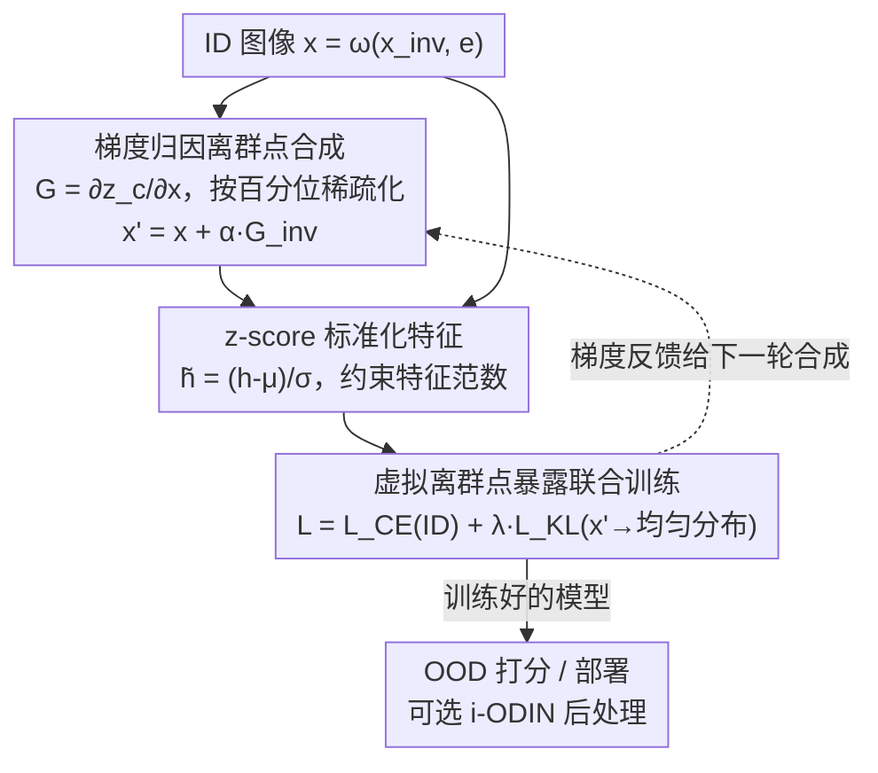

# Image-based Outlier Synthesis With Training Data

**会议**: CVPR 2026  
**论文**: [CVF Open Access](https://openaccess.thecvf.com/content/CVPR2026/html/Regmi_Image-based_Outlier_Synthesis_With_Training_Data_CVPR_2026_paper.html)  
**代码**: 无  
**领域**: AI 安全 / OOD 检测 / 异常合成 / 鲁棒性  
**关键词**: 分布外检测, 虚拟离群点合成, 梯度归因, 离群点暴露, z-score 标准化

## 一句话总结
不借助任何外部数据，仅用训练集内的图像通过"梯度归因加扰"破坏不变特征、保留环境特征来合成近流形虚拟离群点，再以离群点暴露 + z-score 标准化特征联合训练，统一解决伪相关（spurious）、细粒度（fine-grained）和常规三类 OOD 检测。

## 研究背景与动机
**领域现状**：分布外（Out-of-Distribution, OOD）检测是深度模型安全部署的关键——模型在开放世界里会遇到训练分布之外的输入，必须把它们识别出来而不是误当成已知类。主流方法大多只在"常规"设置下评测：OOD 样本与 ID 样本在语义和外观上差异明显，相对好分。

**现有痛点**：真实部署里有两类更难的情形被长期忽视。其一是**伪相关 OOD**：训练集中类标签 $y$ 与环境特征 $e$ 高度相关（如 Waterbirds 数据集里"水鸟"几乎总配"水"背景），模型会偷懒依赖背景这种 spurious 特征做高置信预测，于是一个"陆鸟+水背景"的样本就可能被误判为 ID。其二是**细粒度 OOD**：OOD 类与 ID 类的差异细到和不同 ID 类之间的差异一样小（如把"母鸡"当成某种水鸟），高层特征大量重叠使其极难分。

**核心矛盾**：少数处理这两类难情形的工作，几乎都依赖**外部数据**——要么精心策展与 ID 不重叠的真实离群图像，要么用基础模型（扩散/大模型）在图像空间合成离群点。后者计算昂贵、需要反复 prompt 调试，且严重依赖基础模型对该领域的先验知识，遇到高度新颖的场景就失灵。于是核心问题变成：**能不能完全不引入任何外部数据，只用训练样本本身，就构建一个同时覆盖三类设置的 OOD 检测框架？**

**切入角度**：作者观察到一张图像 $x=\omega(x_{inv}, e)$ 由**不变特征** $x_{inv}$（决定类别，通常只占图像一小块）和**环境特征** $e$（非本质上下文）组成。如果能选择性地"破坏 $x_{inv}$、保留 $e$"，得到的就是一个语义已变但背景仍像 ID 的"近流形"难离群点——正是伪相关和细粒度设置最需要的那种 hard outlier。问题是没有刻画 $x_{inv}$ 位置的 oracle 分布 $G_{oracle}$，能否用模型自身近似它？

**核心 idea**：用**正在训练的模型对真类 logit 的输入梯度**作为不变特征的位置先验，把梯度值加回图像上同时破坏不变特征、放大真类 logit，从而无需外部数据就合成出有挑战性的虚拟离群点；再用离群点暴露训练 + z-score 标准化特征联合优化分类与不确定性。

## 方法详解

### 整体框架
ASCOOD（A unified approach to **S**purious, fine-grained and **C**onventional **OOD** detection）由两条管线组成：① **图像离群点合成管线**——对每张 ID 图像 $x$，用模型对真类 logit 的梯度做归因，把梯度加到图像上以破坏不变特征、保留环境特征，得到虚拟离群点 $x'$；② **虚拟离群点暴露训练管线**——把 ID 样本和合成的 $x'$ 一起送进同一模型，用联合损失同时优化 ID 分类正确性和对离群点的预测不确定性，并且所有特征先经 z-score 标准化再进分类头。两条管线相互耦合：合成依赖当前模型的梯度，训练又用合成结果反过来塑造模型，随训练推进离群点越来越贴近决策边界。

### 关键设计

**1. 梯度归因离群点合成：用模型自身梯度近似不变特征位置**

针对"没有 oracle 标注不变特征在哪、又不想引入外部离群数据"的痛点，作者直接用正在训练的模型对真类 logit $z_c$ 关于输入的梯度作为归因：$G=\frac{\partial z_c}{\partial x}$。由于 $G$ 在不变像素上幅值大、在环境像素上幅值小，把它加到图像上（$x'=x+\alpha\cdot G$）会**不成比例地破坏不变特征、几乎不动环境特征**——这恰好得到"语义变了但背景仍像 ID"的近流形难离群点。为了在高度伪相关场景下更好地保住环境，作者还对 $G$ 做百分位稀疏化：设 ID 图像中不变像素占 $p_{inv}\%$，只保留幅值落在前 $p_{inv}\%$ 的梯度、其余置零，得到 $G_{inv}$，再用 $x'=x+\alpha\cdot G_{inv}$。一个反直觉但关键的发现是：**只能"加"梯度不能"减"**——加梯度在破坏不变特征的同时还抬高真类 logit，使离群点更难（模型本应不确定却被诱导自信），训练价值大；减梯度会降低真类 logit，离群点反而变"软"、增益有限（实验里加比减在 Car 上 FPR@95 从 60.20→40.76）。作者另提供一种零参数基线：直接打乱不变像素 $x'=\omega(\text{shuffle}(x_{inv}), e)$。

**2. z-score 标准化特征：用约束特征范数抑制过度自信**

联合训练 ID 分类与离群点不确定性时，模型容易对一切输入都过度自信，破坏两类梯度的平衡。作者提出在特征进分类头前做 z-score 标准化 $\tilde h = S_h(h)=\big(\frac{h-\mu_h}{\sigma_h}\big)\cdot\sigma$（取 $\mu=0$）。其 Proposition 2 给出一个干净的理论结果：标准化特征的范数被**上界约束**为 $\lVert\tilde h\rVert=\sigma\cdot\sqrt{m-1}$（$m$ 为特征维度）。被约束的范数压低了 $p_k$、$p'_k$ 的极端值，从而缓解 overconfidence，让 ID 梯度 $(p_k-y_k)$ 与 OOD 梯度 $(p'_k-1/C)$ 维持恰当平衡。这与以往常用的 L2 归一化形成对照——作者实验证明 z-score 在 OOD 检测上系统性优于 L2（CIFAR-100 上 FPR@95/AUROC 从 L2 的 40.81/85.26 提升到 29.90/91.35）。

**3. 虚拟离群点暴露联合训练：分类正确 + 离群点指向均匀分布**

合成出离群点后，用一个联合目标同时优化两件事：对 ID 样本最小化交叉熵 $L_{CE}$，对虚拟离群点 $x'$ 最小化其预测分布与均匀分布 $U$ 的 KL 散度 $L_{KL}$（即逼模型对离群点"说不知道"）。总损失为
$$L_{total}=L_{CE}\big(f_\psi(S_h(\phi_\varphi(x))), y\big)+\lambda\cdot L_{KL}\big(f_\psi(S_h(\phi_\varphi(x'))), U\big),$$
其中 $\lambda$ 调节 ID 梯度与不确定性梯度的权重。作者的 Proposition 1 推出第 $k$ 个 logit 上的总梯度为 $(p_k-y_k)+(p'_k-1/C)$——前项把 ID 样本拉向正确类，后项把离群点的预测均匀化，两者叠加在同一组参数上，使模型学到对已知/未知更清晰的判别边界。由于离群点是用当前模型梯度现合成的，训练后期合成的 $x'$（见论文 Figure 3）会越来越贴近真实决策边界，难度自适应上升。

**4. i-ODIN：与训练框架解耦的后处理增强（可选）**

作者顺手提出经典后处理方法 ODIN 的改进版 i-ODIN。原始 ODIN 对所有颜色通道一视同仁地施加输入扰动；i-ODIN 改为只扰动**像素归因判定出的、数量可变的若干显著颜色通道**（实验发现只扰最显著的单个通道往往最好）。它是推理期的即插即用增强，不进训练回路，因此放在框架图末端作为可选项。i-ODIN 在挑战性场景增益明显（CIFAR-10 vs CIFAR-100 的 FPR@95 比 ODIN 降 ~20%，CIFAR-100 vs TIN 降 ~33%），但在仅两类的简单数据集（Waterbirds/CelebA）上优势不显。

### 损失函数 / 训练策略
核心训练目标即上式 $L_{total}=L_{CE}+\lambda\cdot L_{KL}$：ID 分支用交叉熵保分类精度，离群分支用对均匀分布的 KL 提升不确定性；特征统一经 z-score 标准化 $S_h(\cdot)$；离群点 $x'$ 每步用当前模型梯度在线合成（$\alpha$ 控制扰动强度，$p_{inv}$ 控制稀疏化保留比例）。

## 实验关键数据

### 主实验
覆盖 7 个数据集、对比 30+ 方法，统一用 AUROC（越高越好）和 FPR@95（ID 真阳率 95% 时的 OOD 误判率，越低越好）评测。

| 设置 / 基准 | 指标 | ASCOOD | 对照最强方法 | 提升 |
|------|------|------|----------|------|
| 伪相关 Waterbirds | FPR@95↓ | 最优 | 次优 Relation | ↓ ~59% |
| 伪相关 CelebA | FPR@95↓ | 最优 | 次优方法 | 大幅领先 |
| 细粒度 Aircraft | AUROC↑ | 最优 | GEN / RMDS | ↑ ~3 点 |
| 常规（综合） | FPR@95↓ / AUROC↑ | 最优 | 第三 ReAct | ↑ ~5 / ~3 点 |
| 常规 CIFAR-100 | FPR@95↓ / AUROC↑ | 最优 | RotPred | ↑ ~16% / ~3 点 |

大规模设置（ImageNet-100 为 ID，常规 OOD 三数据集平均，Table 3）：

| 方法 | iNaturalist (FPR/AUROC) | Textures | OpenImage | 平均 |
|------|------|------|------|------|
| Dream-OOD (EBO) | 14.47 / 96.09 | 60.73 / 84.79 | 32.67 / 90.16 | 35.96 / 90.35 |
| **ASCOOD (EBO)** | 18.11 / 95.73 | 25.20 / 94.40 | 26.04 / 91.95 | **23.12 / 94.02** |

在 SSB-Hard 难基准上 ASCOOD AUROC 83.91，超过次优 DreamOOD 的 83.30。

### 消融实验

| 离群点合成方式（细粒度 Car / Aircraft） | Car FPR@95↓ / AUROC↑ | Aircraft FPR@95↓ / AUROC↑ | 说明 |
|------|------|------|------|
| 不变像素打乱 shuffle($x_{inv}$) | 63.84 / 85.38 | 47.98 / 83.87 | 零参数基线 |
| 梯度减 $x-\alpha G_{inv}$ | 60.20 / 86.27 | 50.15 / 83.64 | 离群点偏"软" |
| 梯度加 $x+\alpha G_{inv}$ | **40.76 / 91.86** | **47.94 / 89.75** | 最优，证实"加优于减" |

| 其他消融 | 关键指标 | 结论 |
|------|---------|------|
| z-score vs L2 标准化（CIFAR-100 均值） | 29.90/91.35 vs 40.81/85.26 | z-score 全面更优 |
| i-ODIN vs ODIN（CIFAR-100 vs TIN） | 50.20 vs 75.38 FPR@95 | 改进后处理增益显著 |
| ID 精度保持（ImageNet-100/CIFAR-100/CIFAR-10） | 87.27/76.63/94.95% | 与基线 87.33/77.25/95.06% 几乎持平 |

### 关键发现
- **"加梯度"是合成的灵魂**：加梯度同时破坏不变特征又抬高真类 logit，造出"模型本应不确定却很自信"的 hard outlier；减梯度因压低真类 logit 而使离群点变软，增益有限。
- **z-score 优于久用的 L2 归一化**：约束特征范数能压住过度自信，这一点在 OOD 检测里此前未被系统比较过，是本文一个直接可复用的结论。
- **不牺牲分类精度**：所有数据集上 ID 精度与基线几乎相同，细粒度设置（Car/Aircraft）甚至略升，说明加入离群点暴露没有损害主任务。
- **越难的设置优势越大**：在伪相关 Waterbirds 上对次优方法 FPR@95 降幅高达约 59%，远超常规设置的提升幅度——正切中"难情形被忽视"的痛点。

## 亮点与洞察
- **用模型自身梯度当"不变特征定位器"**：把可解释性里的输入梯度归因反向用于"破坏语义"，无需任何外部离群数据或基础模型，是非常省、非常直接的设计——这套思路可迁移到任意需要 hard negative 的自监督/对比学习场景。
- **"加 vs 减梯度"的非对称洞察很 aha**：直觉上加减都能破坏不变特征，但只有"加"能同时制造"高置信错误"这种最有训练价值的离群点，作者把这点单列为贡献并做了对照实验。
- **z-score 标准化带可证明的范数上界**：Proposition 2 给出 $\sigma\sqrt{m-1}$ 的干净上界，把"抑制过度自信"从经验技巧落到可分析的约束优化，理论与工程都站得住。
- **一个框架统一三类设置**：伪相关 / 细粒度 / 常规通常被分头研究，ASCOOD 用同一套合成+训练拿下全部，30+ 方法对比下广泛领先。

## 局限与展望
- **依赖当前模型梯度的质量**：训练早期模型尚未学好不变特征，此时梯度归因可能不准，离群点质量存疑 ⚠️（论文展示的是"训练后期"的合成样例），冷启动阶段的有效性值得进一步分析。
- **超参 $\alpha$、$p_{inv}$、$\lambda$ 需调**：扰动强度、稀疏化保留比例与不确定性权重都需按数据集设定，论文未给跨域统一的取值指引。
- **i-ODIN 在简单两类场景无优势**：作者承认在仅两类（Waterbirds/CelebA）上 i-ODIN 相对 ODIN 没有提升，说明该后处理增强偏向类别更多、更难的场景。
- **改进方向**：可探索把梯度归因与轻量分割先验结合以更准地定位不变区域，或将"加梯度合成"扩展到检测/分割等密集预测任务的 OOD。

## 相关工作与启发
- **vs 基础模型合成离群点（Dream-OOD 等）**：他们用扩散/大模型在图像空间生成离群点，计算重、需精心 prompt、依赖基础模型先验；ASCOOD 只用训练集内梯度归因合成，零外部数据，在 ImageNet-100 大规模设置上平均 FPR@95/AUROC（23.12/94.02）反超 Dream-OOD（35.96/90.35）。
- **vs 背景/增强类虚拟离群（Kirby、BackMix、OEST）**：它们用 inpainting 取背景或显式数据增强构造离群点；ASCOOD 更直接——加梯度破坏不变特征即可，且配合 z-score 标准化把过度自信压住。
- **vs L2 归一化特征工作（LogitNorm/CIDER 等）**：以往多用 L2 约束特征，ASCOOD 首次系统对比并证明 z-score 标准化在 OOD 检测上更优，提供了一个即插即用的替换项。

## 评分
- 新颖性: ⭐⭐⭐⭐⭐ "加梯度破坏不变特征合成离群点 + z-score 标准化"两个点都新颖且自洽，无需外部数据统一三类设置。
- 实验充分度: ⭐⭐⭐⭐⭐ 7 数据集、30+ 方法、伪相关/细粒度/常规/大规模全覆盖，消融把每个设计都拆开验证。
- 写作质量: ⭐⭐⭐⭐ 动机—方法—命题链条清晰，但公式排版（CVF 抽取版）符号略乱，部分细节需对照原文。
- 价值: ⭐⭐⭐⭐ 面向安全部署的难 OOD 场景，零外部数据、不掉精度、结论可复用，落地友好。

<!-- RELATED:START -->

## 相关论文

- [\[ICML 2026\] Geometrically Constrained Outlier Synthesis](../../ICML2026/ai_safety/geometrically_constrained_outlier_synthesis.md)
- [\[CVPR 2026\] Robustness Under Data Scarcity: Few-Shot Continual Adversarial Training for Evolving Threats](robustness_under_data_scarcity_few-shot_continual_adversarial_training_for_evolv.md)
- [\[CVPR 2026\] Editprint: General Digital Image Forensics via Editing Fingerprint with Self-Augmentation Training](editprint_general_digital_image_forensics_via_editing_fingerprint_with_self-augm.md)
- [\[CVPR 2026\] RAVEN: Erasing Invisible Watermarks via Novel View Synthesis](raven_erasing_invisible_watermarks_via_novel_view_synthesis.md)
- [\[CVPR 2026\] PrivateEyes: Gaze-Preserving Anonymization for Data Sharing](privateeyes_gaze-preserving_anonymization_for_data_sharing.md)

<!-- RELATED:END -->
