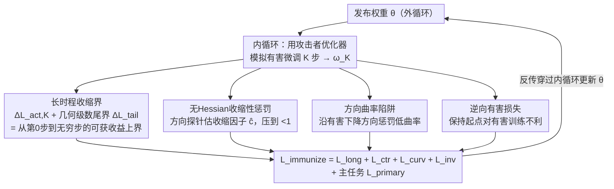

# Immunizing Models Against Harmful Long-Horizon Fine-Tuning via Contractive Optimization Dynamics

**会议**: CVPR 2026  
**论文**: [CVF Open Access](https://openaccess.thecvf.com/content/CVPR2026/html/Sarker_Immunizing_Models_Against_Harmful_Long-Horizon_Fine-Tuning_via_Contractive_Optimization_Dynamics_CVPR_2026_paper.html)  
**代码**: 待确认  
**领域**: AI安全 / 模型免疫 / 有害微调防御  
**关键词**: 模型免疫, 有害微调, 收缩动力学, 双层优化, 无Hessian

## 一句话总结
本文提出 CLAMP，一种针对"长时程有害微调"的模型免疫方法：它不只塑造初始权重的几何，而是把攻击者的整条优化轨迹"收缩"住——让每一步更新都比上一步更小，从而给出一个攻击者从第 0 步到无穷步可获收益的闭式上界，在分类、生成、自回归三类模型上都能在数千步微调后仍守住防线，同时几乎不损害良性微调能力。

## 研究背景与动机
**领域现状**：开源基础模型 + 参数高效微调（LoRA、部分权重更新）让任何人都能低成本把强模型适配到新任务，但也降低了把模型改造成有害用途的门槛。"模型免疫"（model immunization）这条防线的思路是：在发布权重前预先做手脚，让模型对特定有害任务很难被微调出来，同时保住原任务性能和良性可微调性。

**现有痛点**：已有免疫方法分两类。一类是**短时程元防御**（SOPHON、Self-Destructing、IMMA 等），在内循环里模拟攻击者 1~K 步、惩罚观测到的有害损失下降，本质是给有害任务造一个"坏初始化"；另一类是**局部几何操纵**（如基于条件数的方法），在起点附近抬高曲率/条件数，让优化变难。

**核心矛盾**：这两类方法共同的盲点是——**它们只优化"训练的开头"，不约束"训练的过程"**。它们都隐含假设攻击者会在模拟结束时停手，但现实里攻击者会继续训练成千上万步，把坏初始化造成的损失轻松补回来；防御强度随微调时长衰减。没有任何已有方法能约束攻击者在长时程上的**累计**进展。

**本文目标**：给出一个能对"长时程攻击者"也有效的免疫目标——不仅让前几步无用，还要限制攻击者**最终能得到多少**收益。

**切入角度**：作者借用动力系统里的**收缩性（contractivity）**概念。如果攻击者的权重更新映射 $T$ 在某邻域内收缩（存在 $c\in[0,1)$ 使 $\|T(\omega)-T(\omega')\|\le c\|\omega-\omega'\|$），那么相邻两步满足 $\|u_{t+1}\|\le c\|u_t\|$，步长呈几何衰减，攻击者从某点出发能走的总距离就被几何级数封死。

**核心 idea**：用"让有害微调变成局部收缩的"代替"只造坏初始化"，由此把攻击者在内循环 K 步**之外**直到无穷步的剩余进展也写成闭式上界，并用一个无 Hessian 的双层目标去最小化这个"从第 0 步到无穷步的预测总收益"。

## 方法详解

### 整体框架
CLAMP 把免疫建模成一个**双层优化**：内循环用攻击者的优化器 $\pi$ 模拟有害微调 $K$ 步，得到轨迹 $\omega_0\to\omega_K$；外循环根据这段模拟轨迹更新发布权重 $\theta$，让有害任务上的"可获总收益"尽量小，同时在主任务 $D_P$ 上正常训练。全局目标为

$$\min_\theta\ \mathcal{L}_{total}=\lambda_{primary}\mathcal{L}_{primary}+\mathcal{L}_{immunize}$$

关键在 $\mathcal{L}_{immunize}=\mathcal{L}_{long}+\mathcal{L}_{ctr}+\mathcal{L}_{curv}+\mathcal{L}_{inv}$ 这四项：第一项给出长时程收益上界并最小化它，第二项把攻击者更新映射压成收缩的（使上界变紧），第三项在有害下降方向上挖曲率陷阱让有限步也走不动，第四项防止"为了压低预测收益反而把起点送得更好走"。整套目标只需反传 + 几次方向探针，不需要二阶 Hessian，因此能免疫大模型的多层权重。

### 关键设计

**1. 长时程收缩界：把攻击者"到无穷步"的收益封成闭式上界**

针对"防御强度随微调时长衰减"这个根因，CLAMP 不再只盯模拟的 $K$ 步，而是把 $K$ 步之后的全部尾部进展也算进来。先测内循环里观测到的损失下降 $\Delta L_{act,K}=L_H(\omega_0;\theta)-L_H(\omega_K;\theta)$；再利用收缩性——若收缩因子估计 $\hat c<1$，则尾部所有更新形成几何级数，总移动距离被 $B_{tail}=\sum_{i\ge0}\hat c^i\|u_K\|=\frac{\|u_K\|}{1-\hat c}$ 封住，即 $\|\omega_\infty-\omega_K\|\le B_{tail}$。

有了"能走多远"的界，再借**下降引理**（设 $\nabla_\omega L_H$ 在半径 $B_{tail}$ 球内 $\tilde L_K$-Lipschitz）把它翻译成"损失能降多少"的界：尾部累计有害损失下降满足 $\Delta L_{tail}\le\|g_K\|B_{tail}+\frac{\tilde L_K}{2}B_{tail}^2$。于是攻击者到无穷步的预测总收益 $\Delta L_{\infty,pred}=\Delta L_{act,K}+\Delta L_{tail}$，损失项写成带松弛裕度 $m$ 的铰链形式 $\mathcal{L}_{long}=\lambda_{long}\max(0,\Delta L_{\infty,pred}-m)$。这正是与旧方法的本质区别：旧方法只压 $\Delta L_{act,K}$，CLAMP 把肉眼看不见的尾部 $\Delta L_{tail}$ 也压进了优化目标。

**2. 无 Hessian 收缩性惩罚：用方向探针把更新映射压成收缩的**

上面的尾界只有在 $\hat c<1$ 时才成立且收紧，所以必须主动把攻击者的更新映射逼成收缩。收缩因子由更新雅可比的谱范数 $c\approx\|J_{T_\pi}(\omega_K;\theta)\|_2$ 控制；对梯度下降攻击者，$J_T=I-\eta\nabla^2_\omega L_H$，这把收缩性和有害损失的曲率联系了起来。但在大模型上显式构造 Hessian 不现实，作者改用**无 Hessian 的有限差分方向探针**估计

$$\hat c\approx\frac{\|T_\pi(\omega_K+\varepsilon v;\theta)-T_\pi(\omega_K;\theta)\|}{\varepsilon}$$

其中 $v$ 是单位探测方向、$\varepsilon$ 是小步长，把 $T_\pi$ 当黑盒更新规则处理（不假设凸性或特定优化器）。再用平滑损失 $\mathcal{L}_{ctr}=\lambda_{ctr}\,\text{softplus}(\hat c-\hat c_{max})$ 惩罚超过目标收缩值 $\hat c_{max}<1$ 的情况，逼着攻击者每步更新越走越小，从而把设计 1 的长时程上界压紧。

**3. 方向曲率陷阱：沿有害下降方向把地形改成"难走的山脊"**

光把步长收缩还不够——还要让攻击者**有限的几步也走不出成效**。作者沿攻击者实际移动的单位方向 $\hat u_t=u_t/\|u_t\|$ 用二阶有限差分测曲率

$$\hat\kappa_t=\frac{L_H(\omega_t+\delta\hat u_t;\theta)-2L_H(\omega_t;\theta)+L_H(\omega_t-\delta\hat u_t;\theta)}{\delta^2}$$

直觉是：当有害下降方向上曲率低，攻击者能迈出又大又有效的步子；于是反过来**惩罚过低曲率**（低于 $\kappa_{min}$），把有害方向塑造成高曲率、病态、难优化的山脊，$\mathcal{L}_{curv}=\lambda_{curv}\sum_{t=0}^{K}\text{softplus}(\kappa_{min}-\hat\kappa_t)$。它与收缩性互补：收缩性限制"能走多远"，曲率陷阱让"走出的每一步都不划算"。

**4. 逆向有害损失：别为了压预测收益反而把起点送得更好走**

最小化"预测收益"有个副作用——它可能顺手把初始有害损失 $L_H(\omega_0;\theta)$ 也压低，等于无意中给攻击者一个更好的起跑点。作者加一项逆向有害损失 $\mathcal{L}_{inv}=-\lambda_{inv}L_H(\omega_0;\theta)$ 抵消它，强行保持起点对有害训练不利。四项相加即外循环最小化的免疫目标 $\mathcal{L}_{immunize}=\mathcal{L}_{long}+\mathcal{L}_{ctr}+\mathcal{L}_{curv}+\mathcal{L}_{inv}$，所有项都在 $D_H$ 上的模拟轨迹处求值并反传穿过内循环更新 $\theta$。

### 损失函数 / 训练策略
- 全局目标 $\mathcal{L}_{total}=\lambda_{primary}\mathcal{L}_{primary}+\mathcal{L}_{immunize}$，主任务损失保证原任务/良性可微调性，免疫损失由上述四项组成。
- 分类场景用非 PEFT 的共享骨干更新，作者额外引入有害方向投影 + 梯度冲突缓解，减少对良性性能的干扰。
- 内循环模拟步数 $K$、松弛裕度 $m$、目标收缩值 $\hat c_{max}$、各 $\lambda$ 为关键超参；⚠️ 缓存未给出具体取值，以原文/补充材料为准。

## 实验关键数据

> 评价指标说明：**SGRC**（分类相似度差距比）= $\frac{M(f_O(x))-M(f_I(x))}{M(f_O(x))}\times100\%$，$M$ 取准确率、$f_O$ 为原模型、$f_I$ 为免疫后模型；对有害任务 SGRC **越高越好**（攻击者越难适配），对良性任务 SGRC **越低越好**（良性微调越顺畅）。**SGRG** 为生成模型版本（$M$ 取 CLIP/DINO/LPIPS 等图像相似度），**FR**（Failure Rate）为安全训练失效样本占比、用作 LLM 场景的 $M$。

### 主实验
三类模型上都对比 CN（基于条件数）、IMMA、Booster 等基线：

| 场景 | 模型/数据 | 指标 | 基线最好 | CLAMP | 说明 |
|------|-----------|------|----------|-------|------|
| 分类 | Cars 为有害集 | 有害 SGRC↑(avg) | CN 3.35 | **26.37** | 比 CN 高 23.02 分 |
| 分类 | Country211 为有害集 | 有害 SGRC↑(avg) | CN 9.49 | **15.56** | 比 CN 高 6.07 分 |
| 生成 | SD V1-4 | 有害 SGRG↑(avg) | IMMA 4.55 | **26.70** | 比 IMMA 领先 22.15 分 |
| 自回归 | Mistral 7B Instruct | 有害 SGRC↑(FR) | Booster 29.52 | **31.75** | 同时保住 ARC-C/MMLU |
| 自回归 | LLaMA 3.2 1B Instruct | 有害 SGRC↑(FR) | Booster 25.4 | **26.4** | ARC-C 51.9 接近原模型 52.3 |

良性侧 CLAMP 也更友好：分类场景 Cars/Country211 的良性 SGRC 分别为 −2.01 / −0.36（越低越好），生成场景良性 SGRG 7.66、明显优于 IMMA 的 13.94。

### 长时程稳定性（核心卖点）
免疫强度是否随攻击微调时长衰减，是区分 CLAMP 与旧方法的关键：

| 有害数据 | 方法 | ep=10/5 | ep=50/35 | 趋势 |
|----------|------|---------|----------|------|
| Cars(分类) | CN | 7.91 | 1.58 | 暴跌，攻击者训久即破防 |
| Cars(分类) | CLAMP | 29.38 | 24.46 | 基本稳住 |
| SD(生成) | CN | −2.03 | −5.78 | 无效 |
| SD(生成) | CLAMP | 25.18 | 28.64 | 长时程仍强 |

### 关键发现
- CN 这类只造坏初始化的方法，攻击者**单纯训得更久**就能把 SGRC 从 7.91 拉到 1.58、防线崩塌；CLAMP 因为约束的是优化轨迹本身，长时程 SGRC 只从 29.38 微降到 24.46。
- 生成场景里，CLAMP 免疫后的模型在有害微调时输出的是"噪声变体"而非参考图像，而 IMMA 仍会生成"略像动物"的图，说明 CLAMP 的免疫更彻底。
- IMMA 在良性微调早期（ep=5 仍生成不出参考概念）会误伤纠缠概念，CLAMP 良性影响更轻、benign 微调分数高出 6.28 分。

## 亮点与洞察
- **把"防御时长"变成可优化量**：传统免疫只能优化训练开头，CLAMP 借收缩性 + 几何级数把"无穷步尾部收益"写成闭式 $\frac{\|u_K\|}{1-\hat c}$ 相关的上界，第一次让"长时程鲁棒性"直接进损失，这个视角可迁移到任何"防止被持续优化攻破"的问题。
- **无 Hessian 实现是工程关键**：用有限差分方向探针估收缩因子和方向曲率，把二阶信息的需求降到几次前向/反传，使大模型多层免疫变得可行——这是该方法能上 Mistral 7B 的前提。
- **逆向有害损失是个容易忽略的"补漏"**：最小化预测收益会顺手压低初始损失、反而帮了攻击者，作者用一项 $-\lambda_{inv}L_H(\omega_0)$ 把这个副作用堵住，提醒做 min-max 目标时要警惕"目标项内部互相打架"。

## 局限与展望
- 收缩性、Lipschitz 常数、可达球假设都是**局部**的，超出 $B_{tail}$ 半径或攻击者换用强非线性/自适应优化器时，闭式尾界是否依然成立缺乏验证。
- 评测的有害任务规模偏小（Cars/Country211、合成概念、SG-Bench），LLM 也只到 7B；面对真实大规模 NSFW/越狱数据和更大模型时的有效性待考。
- 防御依赖访问"有害数据集 $D_H$"来做免疫，对未知的、训练时见不到的有害方向是否泛化，论文未充分回答。
- ⚠️ 本笔记基于 OCR 缓存，部分公式符号（如 $\tilde L_K$、$\hat\kappa_t$）与超参在缓存中可能有识别误差，以原文为准。

## 相关工作与启发
- **vs CN（条件数免疫）**：CN 只在起点附近抬高曲率/条件数，远离邻域后失效、且训久即破；CLAMP 约束整条轨迹收缩，长时程稳定，benign 干扰也更小。
- **vs IMMA / SOPHON / Self-Destructing（短时程元防御）**：这些方法模拟 1~K 步并惩罚观测损失下降、本质造坏初始化，隐含"攻击者会停手"的假设；CLAMP 直接对 $K\to\infty$ 的尾部收益建上界，补上了它们的盲区。
- **vs Booster / Antidote（LLM 安全修复）**：Booster 等偏向训练中/训练后修复有害参数变化；CLAMP 是发布前的主动免疫，在 Mistral 7B 上 SGRC 31.75 > Booster 29.52，且 ARC-C/MMLU 几乎不掉。

## 评分
- 新颖性: ⭐⭐⭐⭐⭐ 把收缩动力学引入模型免疫、首次给长时程攻击者收益闭式上界，视角新颖
- 实验充分度: ⭐⭐⭐⭐ 覆盖分类/生成/自回归三类模型与多基线，但模型规模与有害任务偏小、缺更大规模压力测试
- 写作质量: ⭐⭐⭐⭐ 理论推导（收缩→下降引理→闭式界）清晰，但符号较密、对读者门槛较高
- 价值: ⭐⭐⭐⭐ 直指"训久即破防"这一现实痛点，无 Hessian 设计使其在大模型上可落地

<!-- RELATED:START -->

## 相关论文

- [\[CVPR 2026\] Fine-Tuning Impairs the Balancedness of Foundation Models in Long-tailed Personalized Federated Learning](fine-tuning_impairs_the_balancedness_of_foundation_models_in_long-tailed_persona.md)
- [\[CVPR 2026\] FlowHijack: A Dynamics-Aware Backdoor Attack on Flow-Matching Vision-Language-Action Models](flowhijack_a_dynamics-aware_backdoor_attack_on_flow-matching_vision-language-act.md)
- [\[CVPR 2026\] PROMPTMINER: Black-Box Prompt Stealing against Text-to-Image Generative Models via Reinforcement Learning and VLM-Guided Optimization](promptminer_black-box_prompt_stealing_against_text-to-image_generative_models_vi.md)
- [\[CVPR 2026\] JANUS: A Lightweight Framework for Jailbreaking Text-to-Image Models via Distribution Optimization](janus_a_lightweight_framework_for_jailbreaking_text-to-image_models_via_distribu.md)
- [\[CVPR 2026\] Taming Noise-Induced Prototype Degradation for Privacy-Preserving Personalized Federated Fine-Tuning](taming_noise-induced_prototype_degradation_for_privacy-preserving_personalized_f.md)

<!-- RELATED:END -->
