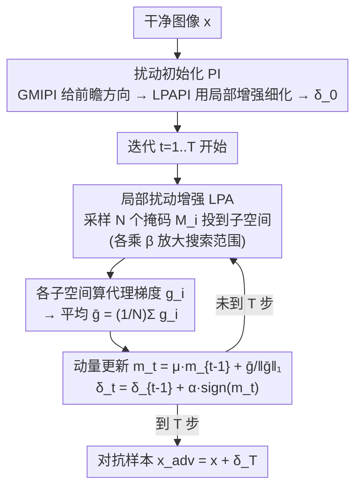

# Improving Adversarial Transferability with Local Perturbation Augmentation

**会议**: CVPR 2026  
**论文**: [CVF Open Access](https://openaccess.thecvf.com/content/CVPR2026/html/Mi_Improving_Adversarial_Transferability_with_Local_Perturbation_Augmentation_CVPR_2026_paper.html)  
**代码**: 待确认  
**领域**: AI安全 / 对抗样本 / 黑盒迁移攻击  
**关键词**: 对抗迁移性, 局部扰动增强, 子空间采样, 扰动初始化, 黑盒攻击

## 一句话总结
本文指出迭代式对抗攻击会让扰动"过拟合"到代理模型的局部梯度特征、从而难迁移到别的模型，提出 LPAA：在每次迭代里用随机掩码构造多个增强的局部子空间、聚合子空间梯度来把更新推向更泛化的方向，再配一个面向迁移性的扰动初始化策略，在 CNN 与 ViT 上显著超过现有 SOTA 迁移攻击。

## 研究背景与动机
**领域现状**：对抗样本（人眼难辨的小扰动让模型误判）的"迁移性"——在代理模型上造的样本能骗过未知目标模型——是黑盒攻击的核心。主流是**基于迁移的攻击**：在代理模型上用 I-FGSM 这类迭代法最大化损失生成扰动，再迁移到目标。后续工作用动量（MI-FGSM）、邻域信息（VMI、GRA）、找平坦极小（PGN）、输入变换（DIM/TIM/SIM/Admix）、集成模型等方式提升迁移性。

**现有痛点**：I-FGSM 这类朴素迭代虽然在白盒下很强，但迁移性反而更差——贪婪地朝"代理模型损失最大方向"迭代，会掉进代理模型的局部最优、落入其损失地形的尖锐（高曲率）区域。

**核心矛盾**：作者把根因点得很具体——把每次更新写成 $\delta_t=\delta_{t-1}+\alpha\cdot u_{t-1}$、$u_{t-1}=\text{sign}(g(x+\delta_{t-1}))$，那么最终扰动 $\delta_T=\sum_{t=1}^{T}\alpha\cdot u_{t-1}$ 是所有遇到的梯度方向的线性组合，于是**迭代会不断累积只属于代理模型的曲率信息**，让扰动过度专门化（over-specialize）到代理模型、迁移性变差。已有方法仍在**全局扰动空间**优化、受代理模型梯度束缚，难逃局部最优。

**本文目标**：在不增加对目标模型知识的前提下，削弱扰动对代理模型的过拟合，找到一条更"通用"的更新方向。

**切入角度**：与其在整段扰动向量上跟着单一梯度路径走，不如**只在随机采样的子空间里更新**，并聚合多个子空间的梯度——这样规整了优化轨迹、鼓励探索更多样方向，相当于做一种"基于扰动本身"的邻域采样。

**核心 idea**：用"多个增强局部子空间的聚合梯度"代替"全局单一梯度路径"来更新扰动，再用一个面向迁移的初始化给迭代一个好起点。

## 方法详解

### 整体框架
LPAA 把一次对抗样本生成拆成两段：先用**扰动初始化（PI）**给出一个迁移性更好的起点 $\delta_0$（由 GMIPI 提供前瞻方向、再经 LPAPI 用本文的局部增强细化），再进入 $T$ 步迭代，每步执行**局部扰动增强（LPA）**——采样 $N$ 个随机二值掩码把扰动投到不同子空间、各算一次代理模型梯度、用增强系数 $\beta$ 放大搜索范围、对 $N$ 个子空间梯度取平均，再叠加动量更新扰动。整个流程只用代理模型，最终输出 $x_{adv}=x+\delta_T$。

### 关键设计

**1. 局部扰动增强（LPA）：用多子空间聚合梯度代替单一全局梯度，破过拟合**

针对"迭代累积代理模型专属曲率、扰动过拟合"这个根因，LPA 在优化时引入**随机掩码**：二值掩码 $M_{t-1}$ 与 $\delta_{t-1}$ 同形，每个元素以概率 $p$ 取 0、否则取 1，掩码比例 $p$ 控制被遮扰动的比例、即子空间的有效维度。每步更新只依赖一个随机子空间的梯度 $u_{t-1}=\text{sign}(g(x+\delta_{t-1}\odot M_{t-1}))$，相当于对优化轨迹做正则、逼它探索更多样方向。

但单个子空间的梯度只含局部信息，于是聚合 $N$ 个独立采样子空间的平均梯度 $\bar g=\frac{1}{N}\sum_{i=1}^{N}g_{i-1}(x+\delta_{t-1}\odot M_{i-1})$ 得到更全面稳定的方向。此外，单纯掩码后的探索范围偏小、易陷局部最优；与"直接放大步长"的旧思路不同，作者引入**增强系数 $\beta$** 缩放扰动、扩大搜索空间：$\bar g=\frac{1}{N}\sum_{i=1}^{N}g_{i-1}(x+\delta_{t-1}\odot M_{i-1}\cdot\beta)$，最终更新

$$\delta_t=\delta_{t-1}+\alpha\cdot\text{sign}\!\Big(\tfrac{1}{N}\sum_{i=1}^{N}g_{i-1}(x+\delta_{t-1}\odot M_{i-1}\cdot\beta)\Big)$$

随迭代累积，有效探索范围动态变化，进一步抑制过拟合。和现有"随机邻域采样"（在迭代点附近加 $\tau\sim U[-\gamma\epsilon,\gamma\epsilon]$）相比，LPA 是**基于扰动本身**的邻域采样，同时利用了扰动的方向与幅度，采样范围更广、更新方向更一致。

**2. 扰动初始化（PI = GMIPI + LPAPI）：给迭代一个面向迁移性的起点**

LPA 在 $t=0$ 时因 $\delta_0=0$ 还没生效，而每步又依赖局部引导，导致整体对初始扰动高度敏感。作者用两步构造迁移性更好的起点。先把 GMI（Global Momentum Initialization）算出的前瞻动量方向 $\mathcal{M}(x)$ 转成初始扰动并投影到扰动域：$\delta_M=\Pi_{[-\eta\alpha,\,\eta\alpha]}(\mathcal{M}(x))$，称 **GMIPI**——它揭示了网络的脆弱方向，但只给粗略方向、无法直接融入本文框架。

于是再用 LPA 操作 $\mathcal{I}(\cdot)$ 细化：$\delta_0=\Pi_{[-\eta\alpha,\,\eta\alpha]}\big(\mathcal{I}(x+\delta_M)\big)$，单用 LPA 细化的那部分记作 **LPAPI**，两者组合即完整的 PI 策略。注意 $\delta_0$ 只作第一次迭代的方向先验、后续更新独立进行。消融显示 GMIPI 与 LPAPI 单用都不如二者组合，且随机噪声初始化甚至略低于不初始化——说明这个起点必须"有前瞻 + 与本文框架同构"才有用。

### 损失函数 / 训练策略
- 优化目标即标准的最大化交叉熵损失 $\arg\max_\delta \mathcal{L}(f_\theta(x+\delta),y)$，约束 $\|\delta\|_\infty\le\epsilon$；LPAA 改的是**更新方向的构造**而非损失本身。
- 关键超参（取自缓存）：迭代数 $T=10$、预算 $\epsilon=16/255$、步长 $\alpha=1.6/255$、动量 $\mu=1.0$；LPA 侧 $N=20$、$p=0.95$、$\beta=35$；LPAPI 侧 $T_{LPAPI}=5$、$\alpha_{LPAPI}=3.2/255$、$\eta=3$。

## 实验关键数据

> 数据集：ILSVRC 2012 验证集随机 1,000 张（几乎被所有模型正确分类）；指标为攻击成功率 ASR（%），代理模型上造样本、攻目标模型，越高越好。

### 主实验
对比 GRA、PGN、SIA、ANDA、MuMoDIG 等 SOTA，跨 CNN 与 ViT 多目标的平均 ASR：

| 代理模型 | 第二好方法 | 第二好 ASR(avg) | LPAA(avg) | 提升 |
|----------|-----------|-----------------|-----------|------|
| RNX-50 | PGN | 82.2 | **86.5** | +4.3 |
| ViT-B | SIA | 85.8 | **91.5** | +5.7 |
| RN-50 | PGN | 76.9 | **80.0** | +3.1 |

防御模型/方法上（两个集成对抗训练模型 + NRP/HGD/Bit 三种防御）也领先：

| 代理模型 | 第二好方法 | 第二好 ASR(avg) | LPAA(avg) |
|----------|-----------|-----------------|-----------|
| RN-50 | PGN 70.9 | 70.9 | **76.6** |
| ViT-B | PGN 66.4 | 66.4 | **73.1** |

### 兼容性与消融
LPAA 可作"即插即用"的子空间采样模块叠加到其他攻击：

| 组合 | 基线 ASR(avg) | 叠加 LPAA 后 | 说明 |
|------|--------------|-------------|------|
| DIM | 40.1 | **85.5** | 输入变换类，平均提升近 50% |
| Admix | 41.8 | **90.0** | 同上 |
| PGN(+PI+LPA) | 75.4 | **82.2** | 替换其邻域采样为 LPAA |
| GRA(+PI+LPA) | 69.3 | **79.7** | 同上 |

初始化策略消融（RN-50 造样本，对 CNN/ViT/ATM 平均 ASR）：

| 配置 | CNNs | ViTs | ATMs | 说明 |
|------|------|------|------|------|
| 无初始化(仅 LPA) | 82.2 | 66.4 | 73.4 | 基准 |
| 随机噪声 | 64.5 | 49.2 | 52.9 | 反而更差 |
| GMIPI | 82.6 | 68.6 | 74.8 | 略升 |
| GMIPI+LPAPI(完整 PI) | **87.2** | **72.7** | **79.7** | 最佳 |

### 关键发现
- 单独的随机噪声初始化（CNN 64.5）甚至低于不初始化（82.2），说明"瞎给起点"会引入无用信息、破坏 LPAPI 带来的增益；起点必须有前瞻性且与框架同构。
- PI 策略对一众邻域采样类方法普遍涨点（整体约 +7.75%），再叠 LPA 平均再涨约 3.2%，且未对每个方法单独调参，验证了通用性。
- 掩码比例 $p$ 与增强系数 $\beta$ 存在最优组合（如 $p=0.95$ 附近、$\beta$ 适中时 ASR 最高），过大过小都掉点，体现"子空间维度 × 搜索范围"的权衡。

## 亮点与洞察
- **把"迭代过拟合"的根因写成线性组合**：作者用 $\delta_T=\sum\alpha u_{t-1}$ 这一行式子点明迭代会累积代理模型专属曲率，比泛泛说"过拟合代理模型"更有说服力，也直接导出"换子空间采样"的解法。
- **"基于扰动的邻域采样"这个视角可复用**：现有邻域采样在迭代点附近加随机噪声、范围小且只用方向；LPA 改成在扰动本身的增强子空间上采样、同时吃方向和幅度，这套思路可嫁接到任何邻域采样类攻击上（实验已验证替换即涨点）。
- **初始化是被低估的杠杆**：把 GMI 的动量"前瞻方向"转成初始扰动再用本文方法细化，单这一步就能对多种 SOTA 普遍涨点，提醒迭代攻击对起点的敏感性值得专门设计。

## 局限与展望
- 方法引入 $N$ 个子空间、每步要算 $N$ 次代理模型梯度（实验 $N=20$），计算开销约为基线的 $N$ 倍，论文未深入讨论效率代价。
- 超参 $p$、$\beta$、$\eta$、$N$ 较多且存在最优区间，跨数据集/模型族的稳健默认值尚不清晰。
- 作为攻击方法，其价值更多在揭示 DNN 共享脆弱性、推动防御研究；对真实安全系统的滥用风险需配套防御一并看待。
- ⚠️ 本笔记基于 OCR 缓存，部分公式（掩码更新、初始化投影 $\Pi$）符号与表格数字可能有识别误差，以原文为准。

## 相关工作与启发
- **vs GRA / PGN / VMI（邻域采样类）**：它们在迭代点附近加随机噪声做邻域采样、范围小且只用方向信息找平坦极小；LPAA 在扰动的增强子空间上采样、同时利用方向与幅度，采样范围更广、方向更一致，替换它们的采样机制即可普遍涨点。
- **vs DIM / TIM / SIM / Admix（输入变换类）**：这些在输入上做变换获取多样梯度；LPAA 与之正交、可叠加，组合后平均提升近 50%，证明它改的是"更新方向构造"这条独立维度。
- **vs GMI（全局动量初始化）**：GMI 初始化的是动量本身；LPAA 把 GMI 的动量方向转成初始扰动（GMIPI）再用 LPA 细化（LPAPI），把"前瞻方向"接进了扰动空间。

## 评分
- 新颖性: ⭐⭐⭐⭐ 子空间掩码 + 增强系数的"基于扰动的邻域采样"视角清晰，但仍属邻域采样大家族内的改进
- 实验充分度: ⭐⭐⭐⭐⭐ 覆盖 5 CNN + 6 ViT + 3 ATM + 3 防御，含兼容性与多组消融，相当扎实
- 写作质量: ⭐⭐⭐⭐ 根因分析具体、算法流程完整，但符号偏密、子空间几何需结合图理解
- 价值: ⭐⭐⭐⭐ 即插即用、可叠加现有攻击，对迁移攻击与防御研究都有参考价值

<!-- RELATED:START -->

## 相关论文

- [\[CVPR 2026\] Generative Adversarial Perturbations with Cross-paradigm Transferability on Localized Crowd Counting](generative_adversarial_perturbations_with_cross-paradigm_transferability_on_loca.md)
- [\[CVPR 2026\] Taming the Long Tail: Rebalancing Adversarial Training via Adaptive Perturbation](taming_the_long_tail_rebalancing_adversarial_training_via_adaptive_perturbation.md)
- [\[CVPR 2026\] Transform to Transfer: Boosting Adversarial Attack Transferability on Vision-Language Pre-training Models](transform_to_transfer_boosting_adversarial_attack_transferability_on_vision-lang.md)
- [\[NeurIPS 2025\] Boosting Adversarial Transferability with Spatial Adversarial Alignment](../../NeurIPS2025/ai_safety/boosting_adversarial_transferability_with_spatial_adversarial_alignment.md)
- [\[CVPR 2026\] Editprint: General Digital Image Forensics via Editing Fingerprint with Self-Augmentation Training](editprint_general_digital_image_forensics_via_editing_fingerprint_with_self-augm.md)

<!-- RELATED:END -->
