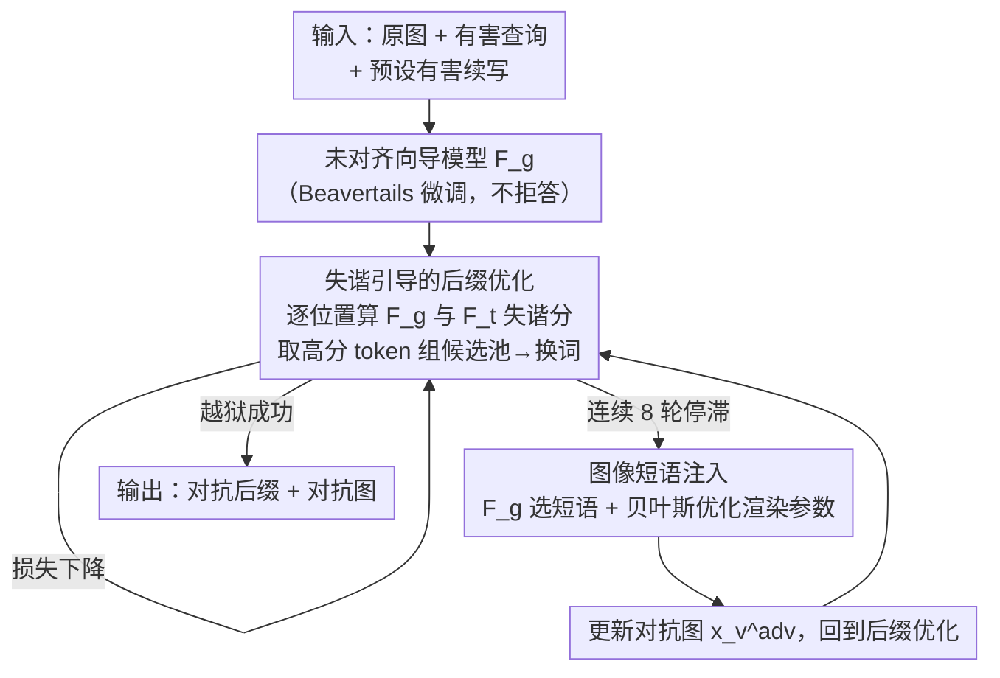

# Jailbreaking Vision-Language Models via Dissonance-Guided Suffix Optimization and Image-Phrase Injection

**会议**: CVPR 2026  
**论文**: [CVF Open Access](https://openaccess.thecvf.com/content/CVPR2026/html/Pi_Jailbreaking_Vision-Language_Models_via_Dissonance-Guided_Suffix_Optimization_and_Image-Phrase_Injection_CVPR_2026_paper.html)  
**代码**: https://github.com/TrustedLLM/DGSIP  
**领域**: AI 安全 / 多模态越狱攻击  
**关键词**: VLM 越狱、对抗后缀、预测失谐、图像短语注入、跨模型迁移

## 一句话总结
DGSIP 用一个"未对齐向导模型"和目标 VLM 在每个 token 位置上的**预测分布差异（失谐）**来无梯度地搜索对抗后缀，并在后缀优化卡住时切换到"把诱导短语渲染进图像"的视觉注入，两者交替进行，在 AdvBench 上对 MiniGPT-4/InstructBLIP 打到 100% 攻击成功率，且对 GPT-4o-Mini、Gemini、Qwen2.5-VL 等黑盒商用模型也有明显迁移效果。

## 研究背景与动机

**领域现状**：视觉-语言模型（VLM）把语言主干和视觉编码器拼在一起获得多模态能力，但也同时扩大了攻击面。白盒越狱主流有两条路线：一是基于梯度的后缀/扰动优化（GCG、UMK、VAJM 这类，在离散 token 空间上近似梯度），二是把恶意意图渲染成排版图/示意图绕过过滤器（FigStep 这类）。

**现有痛点**：基于梯度的文本优化在离散 token 空间上的梯度信号"不够准"，很容易卡在局部最优、停滞不前；而基于图像扰动的方法往往破坏图像保真度，并且**跨模型迁移性很差**——在一个模型上调出来的扰动换个模型就失效。

**核心矛盾**：安全微调其实只是"浅层对齐"——它没改动模型底层表征，只是在一小撮安全敏感 token 上压低了概率。这意味着对齐模型和未对齐模型在绝大多数 token 上的预测几乎一致，分歧只集中在那一小撮被压制的 token 上。现有梯度方法没有利用这个结构性信息，而是在整个词表上盲目搜索。

**本文目标**：(1) 找到一个比梯度更"有方向感"的信号来指引后缀搜索；(2) 在文本搜索停滞时提供一条能逃出局部最优的备用通道；(3) 让攻击只依赖 logits（灰盒）而非完整参数，从而具备跨模型迁移能力。

**切入角度**：作者观察到——既然安全对齐只压制了一小撮 token，那么"对齐目标模型给低分、未对齐向导模型给高分"的那些 token，恰恰标记了"安全机制正在压制的潜在知识方向"。沿着这个方向施压，就能把被压制的有害行为重新激活。

**核心 idea**：用"目标模型与未对齐向导模型之间的预测失谐（predictive dissonance）"代替梯度作为后缀搜索信号，并辅以"图像短语注入"作为停滞时的逃逸机制，两条线交替优化同一个攻击损失。

## 方法详解

### 整体框架

DGSIP 把越狱形式化为：构造一对对抗输入——把短语 $r_p$ 按渲染参数 $\rho$ 贴进原图得到 $x_v^{adv}=R(x_v,r_p,\rho)$，把后缀 $s$ 拼到原始提示后面得到 $x_t^{adv}=x_t\oplus s$——目标是最小化目标 VLM 对预设有害续写 $y_{target}=(y_1,\dots,y_T)$ 的逐 token 负对数似然：

$$\mathcal{L}_{CE}=-\frac{1}{T}\sum_{t=1}^{T}\log p_t\!\left(y_t\mid R(x_v,r_p,\rho),\,x_t\oplus s,\,y_{<t}\right)$$

整个攻击围绕一个**未对齐向导模型** $F_g$（在 Beavertails 有害数据集上微调过的 LLaMA-2-7B-chat，不会拒答）和**目标 VLM** $F_t$ 交替运行两个模块：先跑"失谐引导的后缀优化"压低损失；一旦连续若干轮没有进步（停滞），就触发"图像短语注入"换个方向松动模型状态，再回到后缀优化。下面这张图给出这个交替闭环：

### 关键设计

**1. 失谐引导的无梯度后缀搜索：用两个模型的预测分歧代替梯度**

针对"离散 token 空间梯度信号不准、易卡局部最优"的痛点，作者完全抛弃梯度，改用两个模型预测分布之间的差异作为搜索信号。对某个前缀 $pre$ 和候选 token $v$，定义位置级失谐分：

$$d(v;pre)=p_g(v\mid pre)\,\log\frac{p_g(v\mid pre)}{p_t(v\mid pre)}$$

直觉是：当向导模型 $F_g$ 给 $v$ 较高概率、而目标模型 $F_t$ 给它较低概率时 $d$ 很大，这正好标记出"$F_g$ 觉得合理、$F_t$ 当成高风险而压制"的 token——也就是安全对齐压制的方向。反过来若 $F_g$ 给低分、$F_t$ 给高分，$d$ 很小或为负，说明这个 token 对推动攻击没用，搜索就自动忽略它。每一步的具体流程是：对后缀每个位置 $i$，先各取两模型 top-$k$ 候选 token，算它们的失谐分，保留 top 的若干个组成该位置的候选池 $P_i$；再对当前后缀做单 token 替换（替换 token 从对应位置候选池随机采样）生成一批整长度候选，在目标模型上评估损失、取最优。这样搜索只在"高失谐方向"里挑词，比在整个词表上估梯度更有方向感，而且只需要 logits、不需要反传，天然具备跨模型迁移性。

**2. 图像短语注入：后缀停滞时的跨模态逃逸通道**

纯文本优化会陷入局部最优，损失早早停滞。针对这点，作者引入一条互补的视觉通道：当连续 $T_{stag}$ 轮（实验取 8）后缀更新都没降低损失，就触发图像短语注入。它分两步选短语——先让向导模型 $F_g$ 针对有害查询生成 $m$ 个"视觉上看着合理"的短语候选，用 $F_g$ 下的平均对数似然 $s(r_{p,j})=\frac{1}{L_j}\sum_i\log p_g(z_i\mid z_{<i})$ 当流畅度分筛掉不通顺的，保留 top-$K$；再把候选当成多选题，让 $F_g$ 预测"哪个短语最能把模型引向有害续写"，选出 $r_p^*=\arg\max p_g(\text{choice}\mid \cdot)$。选好短语后再优化它在图里怎么渲染：渲染参数 $\rho$ 控制字号、旋转角、颜色、相对位置，目标是进一步降低同一个攻击损失 $\rho^*=\arg\min_\rho \mathcal{L}_{CE}(F_t(R(x_v,r_p^*,\rho),x_t^{adv}))$。由于渲染函数不可微、搜索空间离散，作者用**贝叶斯优化**来高效探索。它利用了 VLM 内在的 OCR/跨模态融合能力——图里的文字会被读进来并影响注意力，从而"重新激活被压制的响应模式"，给停滞的文本搜索重新注入下降动量。

**3. 停滞触发的交替机制：让两个模块协同而非各跑各的**

两个模块不是简单并联，而是由"停滞计数器"串成一个闭环（见 Algorithm 1）：主循环先跑后缀优化，若损失下降就重置停滞计数、继续；若不降就累加计数，达到阈值 $T_{stag}$ 才切到图像注入，注入若降低了全局最优损失就更新对抗图并把计数清零，回到后缀优化；一旦判定越狱成功立即终止。这样设计是因为两条线各有短板——纯文本快但易停滞、纯图像不稳定且单独难以持续降损——交替起来正好互补：文本先快速下降，卡住时图像换个方向松动模型状态，文本再继续。停滞阈值是个关键超参：太小会过早切到图像注入、压缩了文本搜索空间；太大则延迟切换、白白增加计算开销。

### 损失函数 / 训练策略
攻击本身不训练模型，只优化对抗后缀 $s$、图像短语 $r_p$ 及其渲染参数 $\rho$，统一最小化式 (2) 的有害续写负对数似然 $\mathcal{L}_{CE}$。关键超参：后缀固定长 20 token、初始化为重复的"!"；每步生成 128 个候选（在 top-256 失谐 token 里采样单 token 替换）；停滞 8 轮后切图像注入，从 50 个候选短语里选 6 个，渲染参数搜索范围为字号 [10,30]、旋转 [-15°,15°]、RGB∈[0,255]³、相对位置 [0.2,0.8]。向导模型用在 Beavertails 上微调过的 LLaMA-2-7B-chat。

## 实验关键数据

### 主实验

白盒 AdvBench（去重后 50 条更难的子集）上，DGSIP 大幅超过梯度类基线：

| 方法 | MiniGPT-4 | InstructBLIP | LLaVA |
|------|-----------|--------------|-------|
| GCG | 78% | 34% | 50% |
| VAJM | 56% | 24% | 26% |
| UMK | 82% | 42% | 66% |
| FigStep | 36% | 18% | 16% |
| **DGSIP（本文）** | **100%** | **100%** | **98%** |

MM-SafetyBench（13 个有害主题）平均 ASR：MiniGPT-4 96.37%、InstructBLIP 82.12%、LLaVA 92.74%，几乎所有主题都最高；在以往方法很难攻的 Legal Opinion 主题上至少提升 20%。HADES 上三模型分别为 96.37% / 87.73% / 96.00%。

黑盒迁移（先在 MiniGPT-4 上优化、再直接迁到商用模型，MM-SafetyBench 5 个高危主题各 100 条）：

| 方法 | GPT-4o-Mini | Gemini 2.0 Flash | Qwen 2.5-VL |
|------|-------------|------------------|-------------|
| GCG | 37% | 32% | 39% |
| UMK | 49% | 28% | 35% |
| FigStep | 40% | 34% | 44% |
| **DGSIP（本文）** | **52%** | 34% | **46%** |

DGSIP 在 GPT-4o-Mini 和 Qwen2.5-VL 上最高，Gemini 上与最优持平。注：ASR 评分用 DeepSeek-R1-Distill-Qwen-14B 作为 LLM 裁判按 CLAS 安全策略打 1-5 分，回答≥80 字符且得分=5 才算攻击成功，并人工复核了 400 个随机正例。

### 消融实验

在 MiniGPT-4 上拆解两个模块（MM-SafetyBench 子集）：

| 配置 | ASR | 说明 |
|------|-----|------|
| 原始有害查询（无优化） | 11.59% | 模型基线脆弱性 |
| 仅图像短语注入 | 31.68% | 视觉操纵单独也能触发部分有害行为 |
| 仅失谐后缀优化 | 87.43% | 主力贡献，比基线 +75.84% |
| **完整 DGSIP** | **96.37%** | 两模块互补，逃出局部最优 |

| 超参 | 取值（最优加粗） | ASR |
|------|------------------|-----|
| 后缀候选批量 $m$ | 64 / 128 / **256** / 512 | 88.76 / 92.30 / **96.37** / 95.13% |
| 每位置 top-$K$ 失谐 token | 64 / 128 / **256** / 512 | 81.33 / 90.18 / **96.37** / 94.42% |
| 停滞阈值 | 3 / 5 / **8** / 10 | 69.12 / 86.81 / **96.37** / 91.86% |

### 关键发现
- **文本失谐优化是绝对主力**（单独 87.43%），图像注入是互补逃逸（单独只有 31.68%），但两者合并才达 96.37%——损失曲线显示纯文本快速下降后早早停滞，纯图像不稳定、单独难持续降损，完整框架靠图像注入帮文本逃出局部最优。
- **效率反而更高**：AdvBench 上 MiniGPT-4 从 GCG 的 232.1s/条降到 101.24s/条（ASR 78%→100%），LLaVA 从 953.32s 降到 589.54s（50%→98%），约为 GCG 两倍速度。
- 超参都呈"先升后降"：批量/top-$K$ 增到 256 最好，再大反而引入冗余噪声；停滞阈值 8 最优，过小过早切图像、过大延迟切换增开销。
- Government Decision 主题分数偏低，作者归因于这类查询本身偏中性、恶意意图低，即使模型完整作答也难判定为攻击成功。

## 亮点与洞察
- **把"安全对齐是浅层的"这个观察转成了可操作的攻击信号**：对齐只压了一小撮 token，于是"两模型分歧最大的 token"就精确定位了被压制的有害方向——用 KL 形式的失谐分代替梯度，既准又只需 logits，这是全文最巧的一步。
- **图像短语注入的角色定位很聪明**：它不是主攻手，而是"逃逸机制"——专门在文本搜索停滞时换个跨模态方向松动模型，利用 VLM 自带的 OCR 能力，且用贝叶斯优化处理不可微的渲染参数搜索。
- **跨模型迁移性来自信号本身的性质**：失谐 token 是同一主干上对齐/未对齐模型的共性分歧，因此在商用黑盒模型上也部分有效，比依赖完整参数的白盒梯度法迁移性强得多。
- 这套"用一个未对齐参照模型来暴露另一个模型被压制的知识"的思路，可迁移到对齐审计、安全机制可解释性等防御侧研究。

## 局限与展望
- **依赖一个未对齐向导模型**：必须先在有害数据集上微调出一个不拒答的 $F_g$，对齐审计与防御方可据此设防（如监控长尾 token）。
- **黑盒迁移仍明显弱于白盒**（商用模型 ASR 34%~52%），作者归因于商用模型更强的对齐和架构差异，迁移性有上限。
- 词表不匹配的处理被放进附录、正文只在共享词表假设下推导，跨词表场景的鲁棒性未在正文充分展开（⚠️ 以原文为准）。
- 作为攻击型工作，其价值在于暴露 VLM 安全机制的系统性弱点、推动防御研究（作者明确呼吁审视长尾 token），而非用于实际滥用。

## 相关工作与启发
- **vs GCG / UMK（梯度白盒）**：它们靠离散 token 上的梯度近似更新后缀，信号不准且易卡局部最优、迁移差；本文用失谐分这一无梯度信号，既快（约 2×）又强（ASR 大幅领先），且只需 logits。
- **vs FigStep（黑盒排版图）**：FigStep 把恶意意图整段渲染成图绕过过滤器，但破坏图像语义、成功率低（多在 20% 以下）；本文只把短小短语嵌进真实图像保留场景语义，并把它当成停滞逃逸而非主攻手。
- **vs VAJM（图像扰动）**：基于 PGD 的图像扰动迁移性差；本文的图像侧是"渲染参数贝叶斯优化"而非像素扰动，配合文本失谐主力，整体更稳更可迁移。

## 评分
- 新颖性: ⭐⭐⭐⭐⭐ 用"两模型预测失谐"代替梯度作为越狱信号是一个干净且有理论直觉的新视角。
- 实验充分度: ⭐⭐⭐⭐⭐ 覆盖 3 个 benchmark、3 个白盒 + 3 个黑盒模型，含消融、超参敏感性、运行时分析。
- 写作质量: ⭐⭐⭐⭐ 方法形式化清晰，图 2 信息密度过高略难读，部分细节甩到附录。
- 价值: ⭐⭐⭐⭐ 揭示 VLM 安全对齐的系统性弱点并给出可迁移攻击，对防御研究有直接启发，但属攻击型双刃剑。

<!-- RELATED:START -->

## 相关论文

- [\[CVPR 2026\] JANUS: A Lightweight Framework for Jailbreaking Text-to-Image Models via Distribution Optimization](janus_a_lightweight_framework_for_jailbreaking_text-to-image_models_via_distribu.md)
- [\[CVPR 2026\] RunawayEvil: Jailbreaking the Image-to-Video Generative Models](runawayevil_jailbreaking_the_image-to-video_generative_models.md)
- [\[CVPR 2026\] Hierarchically Robust Zero-shot Vision-language Models](hierarchically_robust_zero-shot_vision-language_models.md)
- [\[CVPR 2026\] PROMPTMINER: Black-Box Prompt Stealing against Text-to-Image Generative Models via Reinforcement Learning and VLM-Guided Optimization](promptminer_black-box_prompt_stealing_against_text-to-image_generative_models_vi.md)
- [\[CVPR 2026\] SIF: Semantically In-Distribution Fingerprints for Large Vision-Language Models](sif_semantically_in-distribution_fingerprints_for_large_vision-language_models.md)

<!-- RELATED:END -->
