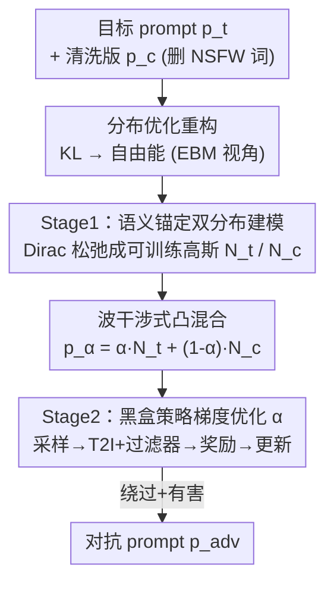

# JANUS: A Lightweight Framework for Jailbreaking Text-to-Image Models via Distribution Optimization

**会议**: CVPR 2026  
**论文**: [CVF Open Access](https://openaccess.thecvf.com/content/CVPR2026/html/Zheng_JANUS_A_Lightweight_Framework_for_Jailbreaking_Text-to-Image_Models_via_Distribution_CVPR_2026_paper.html)  
**代码**: https://github.com/dimshimmer/JANUS  
**领域**: AI 安全 / 对抗攻击 / 红队测试  
**关键词**: 文图模型, 越狱攻击, 安全过滤, 分布优化, 黑盒策略梯度

## 一句话总结
JANUS 把对文图（T2I）模型的越狱攻击重构成一个"低维分布优化"问题——用两个语义锚定的高斯分布做"波干涉"式混合、再用轻量策略梯度在黑盒端到端奖励下学最优混合系数，不靠大模型生成器就把 SD3.5 Large Turbo 上的 ASR-8 从 25.30% 拉到 43.15%，揭示当前 T2I 安全管线的结构性弱点。

## 研究背景与动机
> ⚠️ 本文是一篇暴露 T2I 安全管线漏洞的红队/攻击研究，目的是推动更强的"分布感知"防御。本笔记仅在学术层面复述其方法与发现。

**领域现状**：T2I 扩散模型（Stable Diffusion、DALL·E3 等）训练数据来自网络，天然含 NSFW 内容，因此被部署了两类防御：① 模型内部对齐（概念擦除/微调让模型"忘掉"不安全概念）；② 即插即用的外部安全过滤器（文本侧 pre-hoc 拦截 + 图像侧 post-hoc 检测），商用系统多用后者。

**现有痛点**：现有越狱攻击分两派且各有硬伤——

- **Prompt 级优化**（soft 连续 embedding / hard 离散 token 搜索如 GCG）：因为把完整 T2I 前向 + 安全过滤器塞进可微 loss 既要白盒又算力爆炸，只能优化**代理目标**（如和目标概念的语义相似度），与真正的"绕过+有害"端到端目标**错配**——优化好的 prompt 仍可能被拦或生成无害图。
- **Generator 级优化**（训练 LSTM/LLM 当策略网络，用 RL 拿目标系统反馈）：能直接优化端到端目标，但效果严重依赖生成器规模，往往要 RL 微调几十亿参数的大模型，算力高、可扩展性差。

**核心矛盾**：要么"目标对了但优化的是代理 loss"，要么"目标对了但要喂一个巨大生成器"。两难的根源是：端到端越狱目标（绕过过滤 + 内容有害 + 语义贴合）既离散又黑盒，难以高效优化。

**本文目标**：找一个**轻量、无需 LLM**、又能显式优化端到端绕过目标的框架。

**切入角度**：不去搜索"单个对抗 prompt"，而是去学习一个**参数化分布** $p_\theta(p)$，让它逼近"所有成功越狱 prompt"的理想分布 $q^*$。借能量模型（EBM）把未知的 $q^*\propto\exp(-E(p))$ 表示出来，于是 $\min_\theta D_{KL}(p_\theta\|q^*)$ 化归为最小化期望自由能 $\mathbb{E}_{p\sim p_\theta}[E(p)+\log p_\theta(p)]$。

**核心 idea**：把"搜离散 prompt"变成"优化一个低维连续混合策略"——用两个语义锚定分布（目标 NSFW 语义 vs 清洗后 clean 语义）做凸混合，只学一个标量混合系数 $\alpha$，用黑盒策略梯度在 T2I 系统的端到端奖励下优化它。

## 方法详解

### 整体框架
JANUS 是一个两阶段框架，把越狱重构为分布优化。**Stage 1** 从目标恶意 prompt $p_t$ 和它的"清洗版"$p_c$（删掉预定义 NSFW 词、保留核心语义）出发，把两个离散 prompt 各自松弛成一个可训练的 token 级高斯分布 $N_t,N_c$，再凸混合成 $p_\alpha=\alpha N_t+(1-\alpha)N_c$——这一步把"语义保持"这个目标**结构性地焊进分布里**。**Stage 2** 固定 $N_t,N_c$，只对标量混合系数 $\alpha$ 做黑盒策略梯度优化：从 $p_\alpha$ 采样 prompt → 喂 T2I 模型 + 安全过滤器 → 拿"是否绕过 × NSFW 分"当奖励 → 更新 $\alpha$。整套流程不训练大生成器、不需要白盒梯度。

### 关键设计

**1. 分布优化重构：把越狱从"搜单条 prompt"变成"优化一个分布"**

针对前面"代理 loss 与真目标错配 / 要喂大生成器"的两难。作者不学单个对抗 prompt，而是学整个分布 $p_\theta(p)$ 去逼近理想越狱分布 $q^*$，目标是 $\theta^*=\arg\min_\theta D_{KL}(p_\theta\|q^*)$。难点是 $q^*$ 未知、不可采样。借能量模型把任意正分布写成 Boltzmann 形式 $q^*(p)\propto\exp(-E(p))$，代入 KL 后问题化归为最小化期望自由能：

$$\min_\theta D_{KL}(p_\theta\|q^*)=\mathbb{E}_{p\sim p_\theta}\big[E(p)+\log p_\theta(p)\big]$$

能量函数 $E(p)$ 要同时编码三个互相竞争的越狱目标：① 绕过过滤（evasion）、② 语义贴合目标 prompt（similarity）、③ 真有害（harmfulness）。直接对这么复杂的黑盒能量优化一个分布太难，所以作者把它拆成两阶段——Stage 1 负责语义贴合，Stage 2 负责绕过+有害。这一重构是全文的"地基"：它让端到端目标可优化，又避免了把整个 T2I 管线塞进可微 loss。

**2. Stage 1 语义锚定双分布 + 波干涉混合：让语义保持变成分布的结构属性**

针对"如何在搜索时不丢目标语义"。作者的灵感是**波干涉**：一条 NSFW prompt 的"有害度"往往由一小撮显式 NSFW 词决定，其余部分（人物、场景、动作、叙事）承载核心语义。把目标 $p_t$ 里预定义的 NSFW 词删掉就得到 clean 版 $p_c$，它保留核心意义但弱化显式有害。若构造两个分别锚定 $p_t,p_c$ 语义的分布，它们的"概率干涉"能让共享的核心语义**相长干涉**、保持稳定，同时可调有害度。

具体地，先把离散 prompt 做 **Dirac 启发的松弛**：一条 prompt 是一串 one-hot 行组成的选择矩阵 $\mathcal{O}=[\delta_{t_1},\dots,\delta_{t_L}]^T$，prompt embedding 为 $e=\mathcal{O}\cdot E$。把每个刚性 one-hot 行 $\delta_{t_i}$ 替换成连续随机向量 $\delta_{\theta_i}\sim\mathcal{N}(\mu_{\theta_i},\text{diag}(\sigma_{\theta_i}^2))$，就得到一个对 prompt 的可训练分布（采样后用 per-position argmax 或 Gumbel-Softmax 投回离散 token）。对目标锚 $p_t$ 用余弦语义损失 $\mathcal{L}(x,y)=1-\frac{\langle x,y\rangle}{\|x\|\|y\|}$ 学参数，让采样 prompt 贴近 $p_t$ 语义，得到 $N_t$；对 clean 锚 $p_c$ 同法得 $N_c$。最后凸混合：

$$p_\alpha=\alpha N_t+(1-\alpha)N_c,\quad \alpha\in[0,1]$$

作者证明（附录）这个双源设计**结构性地保证语义稳定**：$p_\alpha$ 采样到目标 $p_t$ 的期望语义相似度被两个基分布里较弱的那个下界住，即 $\mathbb{E}_{p\sim p_\alpha}[\mathcal{L}(e(p),e_t)]\ge\min(\mathbb{E}_{N_t}[\cdot],\mathbb{E}_{N_c}[\cdot])$。这样 Stage 1 把"语义保持"吸收进 $p_\alpha$ 的结构里，后续只需调 $\alpha$ 在"有害 vs clean"两个语义邻域间分配概率质量。

**3. Stage 2 策略梯度黑盒优化混合系数 α：用 RL 直接打端到端越狱奖励**

针对"如何在黑盒下真正优化绕过+有害"。语义保持已被 Stage 1 焊死，于是能量函数只盯剩下两个目标：

$$E(p)=-C(p,M(p))\cdot S(M(p))$$

其中 $C(\cdot)\in\{0,1\}$ 是安全分类器（1=绕过）、$S(\cdot)$ 是 NSFW 打分器、$M$ 是 T2I 模型。直接对 $\alpha$ 求 $\mathbb{E}[E(p)]$ 的梯度需要回传穿过黑盒 $M$，不可行。作者改用 RL 视角：最小化自由能等价于最大化奖励 $J(\alpha)=\mathbb{E}_{p\sim p_\alpha}[R(p)]$，其中 $R(p)=-(E(p)+\log p_\alpha(p))$。于是 $p_\alpha$ 是策略、采样 $p$ 是动作、$R(p)$ 是 T2I 系统返回的标量奖励。用 score-function（REINFORCE 式）梯度：

$$\nabla_\alpha\log p_\alpha(p)=\frac{N_t(p)-N_c(p)}{\alpha N_t(p)+(1-\alpha)N_c(p)}$$

再用 Monte Carlo 采 $K$ 个 prompt 估计 $\widehat{\nabla_\alpha J}=\mathbb{E}_{p}[R(p_i)\nabla_\alpha\log p_\alpha(p)]$，梯度上升并投影回合法区间 $\alpha\leftarrow\text{Proj}(\alpha+\eta\widehat{\nabla_\alpha J})$。整个 Stage 2 只优化**一个标量** $\alpha$，不需端到端反传、不需大生成器，这正是"lightweight、LLM-free"的来源。消融也表明：动态学到的 $\alpha$ 比任何固定值都好，因为绕过率与有害度间是一条近线性 trade-off，没有单一固定 $\alpha$ 能同时最大化所有目标。

### 损失函数 / 训练策略
威胁模型是**黑盒**：攻击者只能拿到生成图或拒绝消息，可借开源 NSFW 打分器辅助。Stage 1 用余弦语义损失学 $\mu_\theta,\sigma_\theta$ 锚定两个分布；Stage 2 用策略梯度（REINFORCE + Monte Carlo + 投影）只更新标量 $\alpha$，奖励为 $-(E(p)+\log p_\alpha(p))$。全程无需对 T2I 模型反传、无需训练大生成器。

## 实验关键数据

### 主实验
目标模型含开源（SDXL、SD3.5 Large Turbo）与商用（DALL·E3、Midjourney），用 Civitai-8m-prompts 里 200 条人工 NSFW prompt 评测，对比 MMA/MMP/QFA/PGJ/SneakyPrompt。指标：TASR（绕过文本过滤率）、IASR-N（过文本后过图像过滤率）、ASR-N（端到端联合成功率）、CLIP Score（语义贴合）、NSFW Score（有害度）。

| 模型 | 方法 | TASR%↑ | IASR-8%↑ | ASR-8%↑ | CLIP↑ | NSFW↑ |
|------|------|--------|----------|---------|-------|-------|
| SD3.5LT | QFA（前 SOTA） | 37.00 | 28.65 | 25.30 | 0.31 | 0.28 |
| SD3.5LT | PGJ | 32.75 | 41.21 | 17.15 | 0.23 | 0.27 |
| SD3.5LT | **JANUS** | **94.25** | **46.65** | **43.15** | **0.37** | **0.33** |
| DALL·E3 | PGJ | 7.05 | 7.27 | 2.13 | 0.18 | 0.06 |
| DALL·E3 | **JANUS** | **12.98** | **12.62** | **3.39** | **0.24** | **0.08** |

在 SD3.5LT 上 JANUS 把 ASR-8 从 25.30%（QFA）推到 43.15%，TASR 高达 94.25%；即便面对防御更强的 DALL·E3，JANUS 仍在 TASR/IASR-8/ASR-8/CLIP/NSFW 全部指标上领先。

### 消融实验
组件消融（N=8，SD3.5LT）：

| 配置 | TASR% | IASR% | ASR% | NSFW | 说明 |
|------|-------|-------|------|------|------|
| Unimodal（单分布） | 97.00 | 28.00 | 26.87 | 0.241 | 去掉双分布干涉，TASR 高但 ASR/NSFW 明显低 |
| Fix NSFW（固定奖励） | 91.50 | 35.15 | 32.33 | 0.286 | 用静态奖励，NSFW 分掉下来 |
| **Full Process** | 94.25 | **46.65** | **44.50** | **0.329** | 完整框架最优 |

### 关键发现
- **双分布干涉是涨点关键**：Unimodal 变体虽 TASR 最高（97%），但 ASR/NSFW 明显落后——单分布的探索能力不足以同时绕过文+图过滤并产出有害内容。
- **动态奖励不可省**：Fix NSFW 用固定奖励信号会让最终 NSFW 分显著下降，证明随生成图有害度动态变化的奖励对引导优化至关重要。
- **动态 α 优于任意固定值**：固定 $\alpha$ 存在近线性 trade-off——低 $\alpha$ 绕过率高但有害度低、高 $\alpha$ 太露骨反被过滤器拦截；RL 学到的动态 $\alpha$ 能找到 Pareto 最优。
- **语义贴合最高**：JANUS 的 CLIP 分在所有方法里最高（SD3.5LT 0.37），说明绕过过滤的同时仍贴近原始（恶意）意图，而非生成无关图。

## 亮点与洞察
- **"分布优化 + 波干涉"重构很巧**：把"搜离散对抗 prompt"换成"凸混合两个语义锚定分布、只学一个标量 $\alpha$"，既显式优化端到端目标，又把维度从巨大离散空间压到一维连续——这是它 lightweight 的本质。
- **语义保持被写进分布结构**：通过 $\min(\cdot)$ 下界把语义贴合"焊"进 $p_\alpha$，让后续只需专心优化绕过+有害，是一种漂亮的"目标解耦"。
- **EBM → 自由能 → RL 的链条**：把未知理想分布用能量模型表示、化归自由能、再转成策略梯度，给"黑盒端到端攻击如何优化"提供了一个可复用的数学套路。
- **防御启示（可迁移）**：本文暴露当前 T2I 安全管线对"分布层面"的攻击缺乏防护，提示防御方应做**分布感知**的检测，而非只盯单条 prompt 的关键词。

## 局限与展望
- **本质是攻击研究**：贡献是揭示漏洞，正向价值依赖防御方跟进；论文自身未提出防御。
- **依赖外部 NSFW 打分器**：奖励信号来自第三方 NSFW scorer，其精度直接影响优化方向与评测可信度。
- **预定义 NSFW 词表的脆性**：clean 版 $p_c$ 靠删"预定义 NSFW 词"得到，词表覆盖不全会影响波干涉的语义解耦质量。
- **商用模型上绝对成功率仍低**：DALL·E3 的 ASR-8 仅 3.39%，说明更严的多层防御仍有相当抵抗力；不同模型间数值不可直接横比（过滤器与评测口径不同）。

## 相关工作与启发
- **vs Prompt 级优化（MMA / 软硬 token 搜索如 GCG）**：他们优化代理 loss（语义相似度等），与真越狱目标错配、且离散搜索算力大；JANUS 直接打端到端黑盒奖励，TASR/ASR 大幅领先。
- **vs Generator 级优化（SneakyPrompt 等训练 LSTM/LLM 当策略网络）**：他们靠 RL 微调大生成器、算力高、受生成器规模制约；JANUS 无需任何大生成器，只优化一个标量 $\alpha$，更轻量可扩展。
- **vs 概念擦除等模型内部对齐防御**：那是防御侧改权重"忘掉"概念；本文从攻击侧证明仅靠外部过滤器+内部对齐仍可被分布层面的攻击穿透，呼吁分布感知防御。

## 评分
- 新颖性: ⭐⭐⭐⭐⭐ 用 EBM→自由能→策略梯度把越狱重构成一维分布混合优化，角度新且自洽。
- 实验充分度: ⭐⭐⭐⭐ 覆盖 4 个开源/商用模型、5 个 baseline、组件与 α 消融，但商用模型评测样本与绝对成功率有限。
- 写作质量: ⭐⭐⭐⭐ 数学链条清晰、动机推导扎实，部分公式排版（OCR 残留）略影响阅读。
- 价值: ⭐⭐⭐⭐ 暴露 T2I 安全管线结构性弱点、推动分布感知防御，红队价值高但需防御方接力。

<!-- RELATED:START -->

## 相关论文

- [\[CVPR 2026\] RunawayEvil: Jailbreaking the Image-to-Video Generative Models](runawayevil_jailbreaking_the_image-to-video_generative_models.md)
- [\[CVPR 2026\] Jailbreaking Vision-Language Models via Dissonance-Guided Suffix Optimization and Image-Phrase Injection](jailbreaking_vision-language_models_via_dissonance-guided_suffix_optimization_an.md)
- [\[CVPR 2026\] Towards Human-Imperceptible Backdoor Attacks on Text-to-Image Diffusion Models](towards_human-imperceptible_backdoor_attacks_on_text-to-image_diffusion_models.md)
- [\[CVPR 2026\] PROMPTMINER: Black-Box Prompt Stealing against Text-to-Image Generative Models via Reinforcement Learning and VLM-Guided Optimization](promptminer_black-box_prompt_stealing_against_text-to-image_generative_models_vi.md)
- [\[CVPR 2026\] GenBreak: Red Teaming Text-to-Image Generation Using Large Language Models](genbreak_red_teaming_text-to-image_generation_using_large_language_models.md)

<!-- RELATED:END -->
