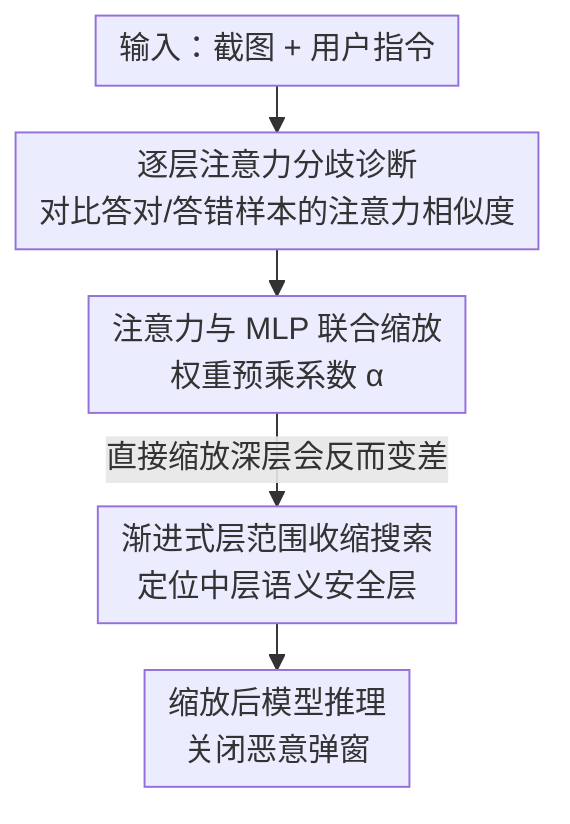

# LaSM: Layer-wise Scaling Mechanism for Defending Pop-up Attack on GUI Agents

**会议**: CVPR 2026  
**论文**: [CVF Open Access](https://openaccess.thecvf.com/content/CVPR2026/html/Yan_LaSM_Layer-wise_Scaling_Mechanism_for_Defending_Pop-up_Attack_on_GUI_CVPR_2026_paper.html)  
**代码**: https://github.com/YANGTUOMAO/LaSM  
**领域**: AI安全 / GUI Agent / 多模态VLM  
**关键词**: GUI Agent、弹窗注入攻击、注意力对齐、逐层缩放、免训练防御

## 一句话总结
通过系统分析弹窗注入攻击如何扭曲 GUI Agent 的逐层注意力，作者发现深层注意力在"答对/答错"样本间会出现分歧，进而提出 LaSM——一种免训练、即插即用的逐层缩放机制，只放大中层语义层的注意力与 MLP 权重，把弹窗攻击下 Qwen2-VL-7B 的防御成功率从约 19% 提到 66% 以上，且几乎不损害正常任务能力。

## 研究背景与动机
**领域现状**：基于多模态大模型（MLLM）的图形界面（GUI）Agent 已经能"看屏幕、做决策"，在网页浏览、网购、移动端操作等任务上表现亮眼。它们的工作方式是把截图 + 用户指令一起编码，输出下一步要点击的界面元素。

**现有痛点**：这类 Agent 对"环境注入攻击"极其敏感，尤其是攻击者可以随意渲染的弹窗——一个恶意弹窗就能把 Agent 的注意力引偏，让它去点"确认"按钮而不是关闭弹窗，造成隐私泄露或系统误用。现有防御分两类：① 重训练类（强化微调 / DPO 偏好优化）能提升鲁棒性，但要大规模数据和算力，部署门槛高；② 提示词告警类（在输入里加安全指令或思维链）轻量，但对"文案与用户请求语义对齐"的诱导型弹窗几乎无效。

**核心矛盾**：两类方法都把模型当黑盒，从没解释"为什么会被弹窗带偏"，因此防御覆盖面有限。作者认为脆弱性的真正根源藏在模型内部——注意力在某些层被弹窗劫持了。

**本文目标**：先把"弹窗如何改变 Agent 的逐层注意力"讲清楚，再据此设计一个不用重训练、与骨干无关、对正常场景几乎无副作用的防御。

**切入角度**：作者借鉴 Zhang et al. 的相对注意力可视化方法，逐层观察 Agent 对 `<icon-cross>`（关闭键）和 `<button-confirm>`（确认键）两个关键可点击区域的注意力，发现"答对"和"答错"的样本在深层注意力上分布不同。

**核心 idea**：既然脆弱性来自特定层的注意力错位，那就**只在关键层选择性放大注意力与 MLP**，把模型的显著性重新拉回到任务相关区域，而不动其他层——一种逐层缩放（Layer-wise Scaling）的免训练干预。

## 方法详解

### 整体框架
LaSM 的整条逻辑是"先诊断、再干预、最后定位"：先用逐层注意力对比找出"答对/答错"在哪些层分歧最大，验证注意力分布确实主导决策；接着定义一个把注意力与 MLP 权重同时按系数 $\alpha$ 缩放的更新规则；但作者发现直接缩放分歧最大的深层（21–26 层）反而会破坏防御——于是改用"渐进式层范围收缩搜索"自动定位真正该缩放的中层语义层（如 Qwen2-VL-7B 的 7–18 层），最终对缩放后的模型直接推理，让 Agent 稳定选择关闭弹窗。整个过程零训练、即插即用。

### 关键设计

**1. 逐层注意力分歧诊断：找出哪些层真正决定"被骗与否"**

要防御先得知道病灶在哪。作者对 `<icon-cross>` 和 `<button-confirm>` 两个目标像素各取一个半径 $r=1$ 的局部方块，把第 $l$ 层的相对注意力图 $A^{(l)}$ 在该方块内展平成向量 $v^{(l)}$，再用余弦相似度 $\mathrm{CosSim}^{(l)} = \langle v^{(l)}_1, v^{(l)}_2\rangle / (\|v^{(l)}_1\|\,\|v^{(l)}_2\|)$ 度量两处注意力模式的一致性。把样本按输出对错分成 $\mathrm{Att}(R)$（答对，如选了关闭键）和 $\mathrm{Att}(W)$（答错），构造 R–R 对（都从答对里抽）和 R–W 对（一对一错）。结果发现：浅层（1–21 层）R–R 和 R–W 的相似度都接近 1，区分不出对错；但在 21–26 这些深层，R–R 与 R–W 的分歧明显变大——说明**更具判别性的注意力模式出现在深层，决定了模型最终点哪个按钮**。这一诊断是后续干预的依据：脆弱性确实是"注意力错位"，而且与层深强相关。

**2. 注意力与 MLP 联合缩放规则：只放大、不重训**

诊断之后，作者定义一个干预后的 Transformer 更新规则：

$$X^{(l+1)} = X^{(l)} + \alpha \cdot \mathrm{Attention}^{(l)}(\mathrm{Norm}(X^{(l)})) + \alpha \cdot \mathrm{MLP}^{(l)}(\mathrm{Norm}(X'))$$

其中 $X'$ 是经过注意力子层后的中间隐状态，缩放系数 $\alpha$ 直接预乘到选中层的所有投影矩阵上——注意力模块的 $W_Q, W_K, W_V, W_O$ 和 MLP 模块的 $W_{up}, W_{gate}, W_{down}$ 都在前向之前乘上 $\alpha$。关键点在于"联合"二字：作者强调 MLP 在非线性空间里调控 token 表示的放大与抑制，尤其在形成细粒度决策边界的深层，单缩放注意力不够，必须把 MLP 一起放大（消融显示只缩放任一组件都会让鲁棒性下降）。这一步把防御从"改输入提示"下沉到"改内部权重前向幅度"，完全不需要梯度更新。

**3. 渐进式层范围收缩搜索：定位安全的中层，而非分歧最大的深层**

一个反直觉的发现是：直接去缩放第 1 步里分歧最大的深层（21–26 层），防御能力不升反降——激进缩放破坏了已建立的层级语义平衡。于是作者改用"渐进式层范围收缩"自动定位该缩放的区间：以 $\alpha=1.1$ 起步，先缩放全部 1–28 层并统计输出为 `<icon-cross>`（即答对）的比例；当某一步比例开始下降，就把当前层定为下界；固定下界后再从上界往下收缩，确定上界。最终得到的 $[\text{下界},\text{上界}]$ 区间（Qwen2-VL-7B 落在 7–18 层）才是真正的"安全层"。可视化分析（用区域平均注意力 $\overline{\mathrm{AttnMean}}^{(l)}$ 跨样本平均度量）进一步证实：缩放中层（7–18）显著提升模型对关闭键区域的注意力，而缩放深层（21–26）会让注意力发散、焦点漂移。结论是：**中层负责视觉-语言对齐与安全推理、适合适度放大；高层负责高级语义聚合、不能动**。

### 损失函数 / 训练策略
LaSM 不涉及任何训练或微调，只在推理时把选中层的投影矩阵预乘 $\alpha$。系数 $\alpha$ 在 $[0.9, 1.3]$ 区间内以步长 $\beta=0.05$ 扫描，作者构造鲁棒性 vs 语义一致性的权衡表来选最优值，最终 Qwen2-VL-7B 取 $\alpha=1.1$、LLaVA-v1.6-Vicuna-13B 取 $\alpha=1.2$，最优系数落在一个窄而模型相关的区间内。

## 实验关键数据

### 主实验
评测指标 **DSR（Defense Success Rate，防御成功率）**：在弹窗攻击下，若模型选择关闭弹窗（点 `<icon-cross>`）记为成功，点确认键 / 背景 / 无关元素均算失败。攻击分两型：overlay（覆盖型，文案与指令无关）与 inductive（诱导型，文案与指令语义对齐，更难防）。下表为两个骨干上各注入类型的平均 DSR（应用 LaSM 前 → 后）：

| 骨干模型 | 防御基线 | 注入类型 | 原始 DSR(%) | +LaSM DSR(%) |
|----------|----------|----------|-------------|--------------|
| Qwen2-VL-7B (L7–18, α=1.1) | 无防御 | Overlay | 18.9 | 66.4 |
| Qwen2-VL-7B | 无防御 | Inductive | 14.8 | 68.3 |
| Qwen2-VL-7B | CoT 告警 | Overlay | 96.3 | 100.0 |
| Qwen2-VL-7B | CoT 告警 | Inductive | 92.7 | 99.8 |
| LLaVA-v1.6-13B (L12–28, α=1.2) | 无防御 | Overlay | 68.6 | 81.2 |
| LLaVA-v1.6-13B | 无防御 | Inductive | 60.8 | 78.0 |

LaSM 作为即插即用插件可叠加在 DPO、直接告警（DA）、思维链告警（CA）等基线之上：在 Qwen2-VL-7B 上与 CoT 告警组合后平均 DSR 达 99.3%（论文摘要）；在 2400 张覆盖 12 种弹窗样式的扰动截图上，每种变体的 DSR 都保持在 95% 以上。多步 AndroidControl 完整任务流上，TSR（任务成功率）从 18.75% 提升到 30.36%，动作类型与定位精度几乎不变；在真实 GUI 任务衍生的完整-episode 基准上，弹窗攻击下任务成功率相对提升 61.92%。

### 消融实验
| 配置 | 关键结论 |
|------|---------|
| 仅缩放注意力 | 鲁棒性下降——单组件不足 |
| 仅缩放 MLP | 鲁棒性下降——单组件不足 |
| 注意力 + MLP 联合缩放（完整） | 防御最佳，验证联合缩放必要 |
| 缩放深层 21–26（分歧最大层） | DSR 不升反降，注意力发散漂移 |
| 缩放中层 7–18（搜索定位的安全层） | 显著拉回对关闭键区域的注意力 |

### 关键发现
- **中层是安全关键层**：7–18 层负责视觉-语言对齐与安全推理，适度放大能让模型重新聚焦关闭键；高层（如 21–26）放大会破坏高级语义聚合，导致注意力错位与信息丢失。
- **联合缩放不可拆**：注意力与 MLP 必须一起放大，任一单独缩放都掉鲁棒性，印证 MLP 在深层决策边界形成中的作用。
- **诱导型弹窗更危险**：当弹窗文案与用户指令语义对齐时，模型更易把它当成合法 UI（Qwen2-VL-7B 无防御下 inductive 仅 14.8% vs overlay 18.9%）。
- **系数敏感且模型相关**：最优 $\alpha$ 落在 $\approx 1.1$ 的窄区间，过大破坏语义一致性。跨骨干（Qwen2-VL-2B、OS-Atlas-Pro-7B、LLaMA-3.2-11B）实验确认方法可泛化。

## 亮点与洞察
- **"诊断 → 反直觉发现 → 修正"的方法叙事很扎实**：先证明注意力分歧在深层、再发现直接缩放深层会变差、最后定位中层才是安全层，每一步都有可视化与消融支撑，不是拍脑袋调层。
- **免训练 + 骨干无关 + 即插即用**：只在推理时把投影矩阵预乘一个标量，可叠加在提示词告警 / DPO 之上获得互补增益，部署成本极低，这对真实 GUI Agent 上线很有吸引力。
- **"安全藏在中层而非最深层"这个结论可迁移**：对其他 MLLM 的安全对齐 / 越狱防御研究有启发——干预层的选择应基于判别性分析而非默认"越深越关键"。

## 局限与展望
- **依赖目标区域可定位**：DSR 与注意力分析都围绕 `<icon-cross>` / `<button-confirm>` 这类明确可点击元素展开，对没有清晰"正确关闭动作"的复杂界面是否成立未充分讨论。⚠️ 以原文为准。
- **最优层区间与 $\alpha$ 需逐模型搜索**：不同骨干的安全层（7–18 vs 12–28）和系数（1.1 vs 1.2）都不同，换模型要重新跑渐进式搜索，缺少一次性自适应方案。
- **威胁面局限于弹窗**：方法针对 pop-up 注入设计，对其他环境注入（如背景篡改、多模态对抗补丁）的迁移性需进一步验证。
- **改进方向**：把"逐层判别性分析"做成自动、连续的层重要性打分，免去离散区间搜索；或把缩放系数做成依输入动态调节，兼顾鲁棒性与正常性能。

## 相关工作与启发
- **vs 重训练类防御（DPO / 强化微调）**：它们靠惩罚不安全行为来提升鲁棒性，但需大规模数据与算力；LaSM 不训练、推理时干预，且能与 DPO 叠加获互补收益。
- **vs 提示词告警（直接告警 / CoT 告警）**：告警类轻量但对诱导型弹窗弱；LaSM 从模型内部修正注意力，对 overlay/inductive 都有效，二者组合后 DSR 可逼近 100%。
- **vs Zhang et al. 的注意力可视化**：作者沿用其相对注意力度量做诊断，但不止于"描述注意力焦点"，而是进一步同时缩放注意力与 MLP 权重做主动干预。

## 评分
- 新颖性: ⭐⭐⭐⭐ 首个系统刻画弹窗攻击如何扭曲逐层注意力，并据此提出免训练逐层缩放防御，切入点新。
- 实验充分度: ⭐⭐⭐⭐ 两骨干 + 12 种弹窗样式 + 多步基准 + 跨骨干泛化 + 充分消融，覆盖面广。
- 写作质量: ⭐⭐⭐⭐ "诊断—失败—修正"叙事清晰，可视化支撑到位，符号略多。
- 价值: ⭐⭐⭐⭐ 部署成本极低、可与现有防御叠加，对 GUI Agent 安全落地有实用价值。

<!-- RELATED:START -->

## 相关论文

- [\[CVPR 2026\] Scaling Up AI-Generated Image Detection with Generator-Aware Prototypes](scaling_up_ai-generated_image_detection_with_generator-aware_prototypes.md)
- [\[ICML 2026\] Scaling Unsupervised Multi-Source Federated Domain Adaptation through Group-Wise Discrepancy Minimization](../../ICML2026/ai_safety/scaling_unsupervised_multi-source_federated_domain_adaptation_through_group-wise.md)
- [\[CVPR 2026\] DualMirage: Hunting Stealthy Multimodal LLM Agents via CAPTCHAs with Contour and Adversarial Illusions](dualmirage_hunting_stealthy_multimodal_llm_agents_via_captchas_with_contour_and_.md)
- [\[CVPR 2026\] AntiStyler: Defending Object Detection Models Against Adversarial Patch Attacks Using Style Removal](antistyler_defending_object_detection_models_against_adversarial_patch_attacks_u.md)
- [\[CVPR 2026\] Eliminate Distance Differences Induced by Backdoor Attacks: Layer-Selective Training and Clipping to Mask Backdoor Models](eliminate_distance_differences_induced_by_backdoor_attacks_layer-selective_train.md)

<!-- RELATED:END -->
