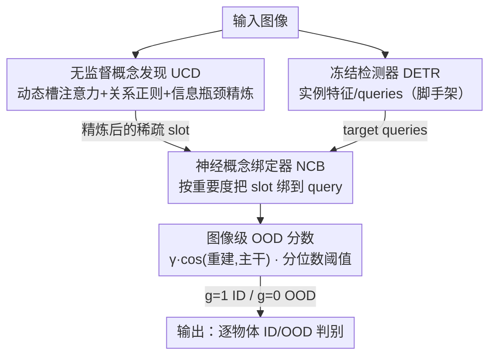

# Learning Latent Concepts for Detecting Out-of-Distribution Objects

**会议**: CVPR 2026  
**论文**: [CVF Open Access](https://openaccess.thecvf.com/content/CVPR2026/html/Peng_Learning_Latent_Concepts_for_Detecting_Out-of-Distribution_Objects_CVPR_2026_paper.html)  
**代码**: 无  
**领域**: AI安全 / OOD检测 / 目标检测  
**关键词**: OOD目标检测, 对象中心学习, 槽注意力, 概念绑定, 开放世界

## 一句话总结
UNO-Adapter 把"未知"概念以即插即用的方式注入一个**完全冻结**的检测器：先用对象中心的槽（slot）无监督地把整张图抽象成稀疏概念，再在推理时把这些概念与检测器的实例特征绑定，并配一个图像级 OOD 分数，从而在不改任何检测器权重的前提下，把 BDD-100K 上的 FPR95 相比此前最佳方法最多降低 11.96%。

## 研究背景与动机

**领域现状**：OOD 检测要解决的是模型在开放世界遇到训练分布之外样本时的安全部署问题。绝大多数方法把它当成图像级二分类——基于一个训好的 ID 分类器，用打分函数（MSP、Energy、MaxLogit）、训练期正则或离群点合成（VOS、NPOS、Dream-OOD）来区分 ID/OOD。

**现有痛点**：但在**目标检测**场景里，ID 和 OOD 物体常常出现在同一张图、同一个上下文中（OOD-OD 任务）。现有 OOD-OD 方法（VOS、SIREN、DFDD、WFS 等）几乎都是把分类范式搬过来：依赖检测器内置的定位能力，从实例级特征出发去合成 OOD 特征。这条路有两个连锁缺陷——一旦实例特征抽取不准，就会导致 OOD 物体定位差、ID/OOD 决策边界被扭曲。

**核心矛盾**：根因在于这些方法只盯着**局部实例特征**，忽略了场景里物体之间的上下文关系与因果依赖。当 OOD 物体出现在意料之外的上下文中，只看局部特征的模型就特别容易判错。

**本文目标**：设计一个统一框架，模仿人类"通过对比与推理来抽象概念"的视觉过程：既能识别单个物体，又能理解物体之间的潜在概念关系，从而更准地发现偏离场景预期的 OOD 物体。

**切入角度**：人类面对新环境不是死记每个物体，而是对比、抽象出概念表示。作者由此假设——把图像独立于检测器抽象成一组稀疏概念（slot），再把这些概念绑回检测器，就能给检测器补上"全局抽象+推理"的能力。

**核心 idea**：用对象中心的 slot 表示"未知概念"，再以**无需重训**的方式把概念注入冻结检测器（unknown injection），用全局推理弥补实例特征的定位偏差。

## 方法详解

### 整体框架
UNO-Adapter 的输入是图像、输出是每个检测框是 ID 还是 OOD 的判断。它由三块串起来：训练期只训一个**独立于检测器**的概念发现模块（UCD），把整图抽象成稀疏 slot；推理期把这些精炼后的 slot 通过神经概念绑定器（NCB）融进检测器的实例特征（DETR 的 query），最后用一个图像级 OOD 分数做最终判别。关键是——检测器自身的权重和结构**全程冻结**，UCD 在 PASCAL-VOC 上训一次后跨数据集固定复用。

### 关键设计

**1. 无监督概念发现 UCD：把整图抽象成稀疏、可推理的概念槽**

针对"只看局部实例、缺乏全局抽象"这个痛点，UCD 在 slot attention 基础上做无监督的概念发现——不用任何框/类别标注，把图像抽成一组离散 slot。原始 slot attention 有两个毛病：slot 数固定、slot 之间缺乏交互导致表示孤立。UCD 用三步解决。**(a) 粗 slot 表示**：每个 slot $s_i$ 通过交叉注意力 $\alpha_{ij}=\text{softmax}_i(s_i^\top W_Q x_j/\sqrt{d_s})$ 聚合输入特征 $\hat s_i=\sum_j \alpha_{ij}W_V x_j$。**(b) 关系正则**：先用轻量网络给每个 slot 算初始重要度 $\pi_i^{init}=\sigma(h_\theta(s_i))$，再引入关系矩阵 $W_{ij}=\text{softmax}_j((Uv_i)^\top(Vv_j)/\sqrt d)$ 把 slot 间交互建模进来，最终重要度 $\pi_i=\sum_j W_{ij}\pi_j^{init}$，并按重要度加权 $s_i'=\pi_i\cdot s_i$。**(c) 信息瓶颈精炼**：以 IB 原则 $\min_S I(S';Y)-\beta I(S';X)$ 压缩冗余，用变分 IB 把 slot 编码成分布，标准差按重要度自适应缩放 $\sigma_i'=\sigma_i(1-\pi_i)$（越重要的 slot 约束越强、保真度越高），重参数化采样 $z_i=\mu_i+\epsilon\odot\sigma_i'$ 后解码得精炼 slot。训练目标 $\mathcal L_{UCD}=\mathcal L_{recon}+\beta\mathcal L_{KL}$，其中 KL 项也按 $\pi_i$ 加权。这样得到的 slot 稀疏、离散、把物体和背景噪声分开，给 OOD 判别打了个鲁棒底座。

**2. 神经概念绑定器 NCB：把概念槽按重要度绑回冻结检测器**

UCD 学到的 slot 独立于检测器，痛点是怎么在推理期把它"零训练"地融进检测器。NCB 做的就是基于相似度自适应融合 slot 与检测器实例特征（DETR 的 query）。它先把 slot 重要度归一化 $\hat\pi_i=\text{softmax}(\pi)_i$，再按重要度给每个 slot 分配 query 数 $m_i=\lfloor\hat\pi_i\cdot M\rfloor$（最后一个 slot 补齐使总数为 $M$）；分到的 query 与对应 slot 加权融合 $Q_i=\{q_{k_i},\dots,q_{k_i+m_i}\}+s_i''\cdot\hat\pi_i$，再沿序列维拼成 $Q_{fused}\in\mathbb R^{M\times D}$。其妙处在于：slot 有强全局理解但定位差、实例特征定位准但缺全局，NCB 让重要 slot 优先增强对应 query，既补全局语义又保留各自原始特征空间，而且整个过程**不需要训练**。

**3. 图像级 OOD 分数：用重建一致性 + 分位数阈值做全局判别**

以往 OOD-OD 只看单个物体置信度、丢了全局图像信息。本文提出图像引导的 OOD 分数。做法：把 query 当 slot、用 slot 解码器重建所有物体的倒数第二层特征得到图像级特征 $\hat f_t$，再与固定主干（DINO）的特征 $f_t$ 算余弦相似度——相似度高说明含 OOD 的可能性低。但小物体只占特征图一小块时，连 OOD query 也能把背景重建得很像，于是加校准因子 $\gamma=\max_i\sigma(g_l(o_i))$。最终分数 $\text{score}(o_i,b_i)=\gamma\cdot\cos(\hat f_t,f_t)\cdot\Phi_\tau(z_i)$，其中 $\Phi_\tau$ 是用**分位数策略**取的 logit 阈值（取检测物体 logit 分布的某个分位数 $\tau$），替代易过自信的 MaxLogit；当 $\tau=1$ 时退化为 MaxLogit。前两项是图像级引导，第三项是物体级 logit。

### 损失函数 / 训练策略
训练只动 UCD：用 DINOSAUR 框架（DINO 主干）做 slot 学习，精炼模块是三个两层 MLP（一个算重要度 $\pi_i$，另两个做 IB 的编码/解码），$\beta=0.5$。在 PASCAL-VOC 上用 Adam（学习率 $10^{-5}$）微调 30 epoch、batch 64，训完跨数据集固定。检测器用 ImageNet-1K 预训的 Deformable DETR（ResNet-50 + DINO ViT-b16 初始化），全程冻结。

## 实验关键数据

### 主实验
OOD-OD：以 PASCAL-VOC / BDD-100K 为 ID，MS-COCO / OpenImages 为 OOD，指标 AUROC↑ / FPR95↓（FPR95 = ID 真正例率为 95% 时 OOD 的假正例率，越低越好）。

| ID 数据 | OOD 数据 | 方法 | AUROC↑ | FPR95↓ |
|--------|---------|------|--------|--------|
| BDD-100K | MS-COCO | WFS (前最佳) | 93.41 | 21.84 |
| BDD-100K | MS-COCO | **UNO-Adapter** | **97.61** | **9.88** |
| BDD-100K | OpenImages | WFS | 96.85 | 7.83 |
| BDD-100K | OpenImages | **UNO-Adapter** | **99.04** | **3.80** |
| PASCAL-VOC | MS-COCO | DFDD | 90.79 | 41.34 |
| PASCAL-VOC | MS-COCO | **UNO-Adapter** | **91.68** | **32.61** |

在 BDD-100K 上 FPR95 相比次优 WFS 降了 11.96%（MS-COCO）和 4.03%（OpenImages）。此外 UNO-Adapter 还能作为"插件"加到 MSP / Energy / SIREN / SAFE 上普遍涨点（如 SAFE w/ ours 在 BDD-100K→MS-COCO 把 FPR95 从 32.56 降到 16.25）。

开放世界检测（OWOD）：在 Task 2/3 上 U-Recall 与 mAP 全面领先，例如 Task 2 的 U-Recall 16.8 / mAP(Both) 45.8，优于 ASGS（14.8 / 44.7）。图像分类 OOD（ImageNet-200/1K）上也稳定超过 OODD 等 test-time 方法。

### 消融实验

| 配置 | BDD-100K AUROC↑ / FPR95↓（MS-COCO / OpenImages） | 说明 |
|------|------|------|
| 仅 baseline | 88.92 / 28.60 ， 92.74 / 15.56 | 不加 UCD/NCB |
| + UCD | 94.69 / 14.25 ， 97.32 / 7.10 | 概念发现带来主要增益 |
| + UCD + NCB | 97.61 / 9.88 ， 99.04 / 3.80 | 完整模型 |

OOD 分数拆解（Table 5，PASCAL-VOC）：MaxLogit 仅 46.85 / 96.52；换成分位数 $\Phi_\tau(z_i)$ 升到 80.30 / 57.36；再加全局图像引导 $\gamma\cos$ 达 91.68 / 32.61，说明分位数策略和全局引导各自都有显著贡献。

### 关键发现
- UCD 是增益主力：单加 UCD 就把 FPR95 从 28.60 砍到 14.25，证明"全局概念抽象"比单纯堆实例特征更关键；NCB 在其上进一步把定位与全局推理结合，再降到 9.88。
- 全局信息不可或缺：OOD 分数里把 MaxLogit 换成分位数 + 全局重建一致性后，FPR95 从 96.52 暴降到 32.61，验证了"只看单物体置信度"是旧方法的硬伤。
- 效率友好：UNO-Adapter 无需重训、无需微调，推理 11.54s，比需要重训的 SIREN（36.31s）和需微调的 SAFE（14.37s）都快，超参 $S$（slot 数）和 $\tau$ 在一定范围内稳定。

## 亮点与洞察
- **"概念注入"而非"改检测器"**：整套方法把 OOD 能力做成对冻结检测器的旁路适配器，UCD 在一个数据集训一次就跨数据集复用，工程落地代价极低——这是相对所有"改 pipeline / 重训"方法的最大差异点。
- **对象中心学习迁到安全任务**：把 slot attention / DINOSAUR 这类原本做对象发现的对象中心表示，创造性地当成"未知概念"的载体，再用信息瓶颈把 slot 压稀疏，思路可迁移到开放词表检测、异常分割等需要"全局-局部"互补的任务。
- **OOD 分数的三因子设计很实用**：$\gamma$（校准小物体背景重建）× 全局余弦一致性 × logit 分位数，每一项都对应一个具体失效模式，值得借鉴到其他打分式 OOD 框架。

## 局限与展望
- UCD 依赖 DINO/DINOSAUR 的自监督特征质量与槽注意力的收敛，作者也承认 slot 无法做到精确定位与分类，只是捕捉基本实体与依赖；在槽注意力本就难处理的复杂真实场景下表现可能受限。
- slot 数 $S$ 与分位数 $\tau$ 虽在一定范围稳定，但仍是需人工设的超参，跨域时是否需要重调缺乏系统分析（⚠️ 论文只给了 PASCAL-VOC 上的敏感性曲线）。
- 主文以 DETR 系检测器为主，Faster R-CNN 结果放在附录；对单阶段/anchor-free 检测器及更大规模开放世界场景的适配性还需更多验证。

## 相关工作与启发
- **vs VOS / DFDD / WFS（实例级离群合成）**: 它们从检测器实例特征出发合成 OOD 特征，依赖定位准确度且常需训练期正则，容易把 ID 决策边界推歪（DFDD 在 ID 上明显退化）；本文不合成、不重训，用独立概念发现 + 推理期绑定，FPR95 大幅更低。
- **vs SIREN（可训练超球面损失）**: SIREN 改检测器表示并需重训、推理还要访问训练数据；UNO-Adapter 冻结检测器、推理更快，且在多数 benchmark 上 AUROC/FPR95 更优。
- **vs 原始 Slot Attention / DINOSAUR**: 原始 slot attention 固定 slot 数、缺乏 slot 间交互；DINOSAUR 虽改重建深度特征但没考虑 slot 的差异化重要度与冗余。本文用动态重要度 + 关系矩阵 + 信息瓶颈精炼把 slot 做得稀疏可推理，专门服务 OOD 判别。

## 评分
- 新颖性: ⭐⭐⭐⭐⭐ 把对象中心 slot 当"未知概念"、以零训练适配器注入冻结检测器，是 OOD-OD 里少见的全新范式。
- 实验充分度: ⭐⭐⭐⭐ OOD-OD / OWOD / 图像分类三任务 + 完整消融，但主文偏重 DETR、PCB/单阶段检测器证据较薄。
- 写作质量: ⭐⭐⭐⭐ 动机—方法—消融逻辑顺畅，公式齐全；个别 slot 维度记号（$N$ vs $S$）略有混用。
- 价值: ⭐⭐⭐⭐⭐ 即插即用、跨数据集复用、效率高，对安全部署检测器有很强实用价值。

<!-- RELATED:START -->

## 相关论文

- [\[CVPR 2026\] Sparsity as a Key: Unlocking New Insights from Latent Structures for Out-of-Distribution Detection](sparsity_as_a_key_unlocking_new_insights_from_latent_structures_for_out-of-distr.md)
- [\[CVPR 2026\] RankOOD: Class Ranking-based Out-of-Distribution Detection](rankood_-_class_ranking-based_out-of-distribution_detection.md)
- [\[CVPR 2026\] Enhancing Out-of-Distribution Detection with Extended Logit Normalization](enhancing_out-of-distribution_detection_with_extended_logit_normalization.md)
- [\[CVPR 2025\] Detecting Out-of-Distribution through the Lens of Neural Collapse](../../CVPR2025/ai_safety/detecting_out-of-distribution_through_the_lens_of_neural_collapse.md)
- [\[CVPR 2026\] Bypassing the Transport Plan: Dynamic Reweighting for Out-of-Distribution Detection with Optimal Transport](bypassing_the_transport_plan_dynamic_reweighting_for_out-of-distribution_detecti.md)

<!-- RELATED:END -->
