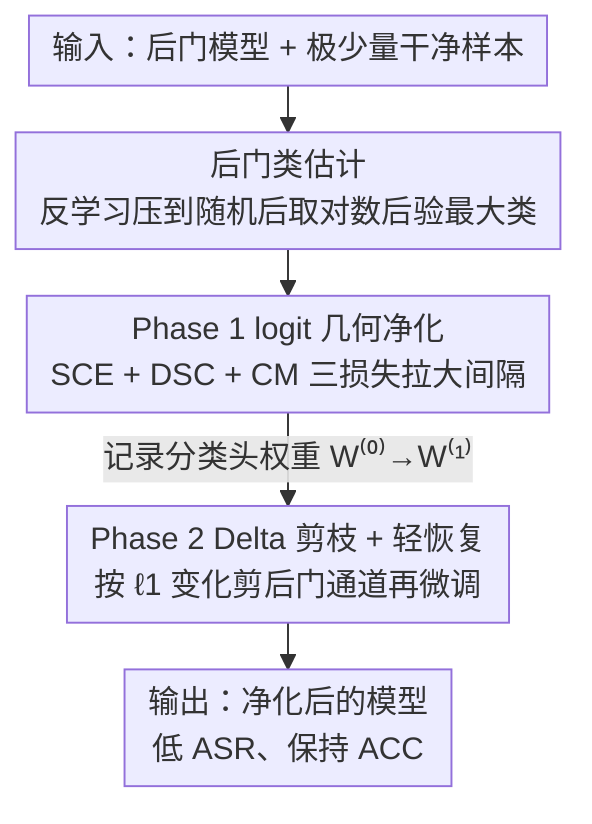

# Logit-Margin Repulsion for Backdoor Defense

**会议**: CVPR 2026  
**论文**: [CVF Open Access](https://openaccess.thecvf.com/content/CVPR2026/html/Yang_Logit-Margin_Repulsion_for_Backdoor_Defense_CVPR_2026_paper.html)  
**代码**: https://github.com/Trusted-LLM/LMR  
**领域**: AI安全 / 后门防御 / 模型净化  
**关键词**: 后门攻击, 后门净化, logit margin, 条件后门, 选择性剪枝

## 一句话总结
LMR 把后门防御重新表述成一个**logit 空间的几何问题**：只用极少量干净样本（甚至 0.1%），先定位后门类，再在干净数据上人为拉大"后门类 logit 与最强竞争类 logit"之间的间隔、并剪掉与后门强相关的分类头通道，使触发器或量化/剪枝带来的 logit 偏移不足以翻转 top-1 预测，从而同时防住传统后门和量化/剪枝条件后门。

## 研究背景与动机

**领域现状**：后门攻击通过数据投毒在训练期植入触发器，让模型在干净样本上正常、遇到特定触发器就输出攻击者指定的目标标签。防御分两类：检测（判断模型/数据是否被投毒）与净化（从受感染模型中移除恶意行为，常用微调或剪枝去掉后门神经元/通道）。

**现有痛点**：随着模型压缩（量化、剪枝）普及，出现了更隐蔽的**条件后门**——量化条件后门（QCB）和剪枝条件后门（PCB）。这类后门在原始全精度模型里完全休眠（和良性模型几乎无差别），只有当模型经历量化或剪枝后才被激活。传统检测/净化方法面对原始模型看不出异常，自然防不住；而少数专门针对 QCB 的方法（EFRAP、LACPDA）又难以泛化到传统后门和 PCB。结果是：**没有一个通用防御能同时扛住传统后门和条件后门**。

**核心矛盾**：传统防御盯的是"后门神经元/特征"，但条件后门的异常特征只有在特定操作（量化/剪枝）后才占主导，原始模型里抓不到；专用防御又把假设绑死在某种压缩机制上。两类方法各自只覆盖一半威胁面。

**本文目标**：找一个不依赖触发器先验、不假设特定压缩机制的统一视角，把传统与条件后门的"共同病灶"一并治掉。

**切入角度**：作者抓住所有后门攻击的共同表现——触发器/条件操作的最终效果都是**异常抬高目标类的 logit**，让后门类 logit 变成最大值从而翻转预测。那么反过来，只要在干净样本上**主动拉大后门类与最强竞争类的 logit 间隔**，就能让触发器或条件操作引起的偏移"不够用"，无法越过更大的间隔去改变 top-1。

**核心 idea**：Logit-Margin Repulsion——在 logit 空间几何地"排斥/压缩"后门类的决策区域，配合选择性剪枝切断"特征→后门类"的捷径，做到通用净化。

## 方法详解

### 整体框架
LMR 的输入是一个被植入后门的模型 + 极少量（约 1%，可低至 0.1%）干净样本，输出是净化后的模型。流程分三步：先用 anti-learning（反学习）把模型在干净样本上的准确率压到接近随机，借此**定位后门类**；进入 Phase 1，用三个损失在干净数据上重塑后门类的决策边界、拉大 logit 间隔、压制后门响应；进入 Phase 2，依据分类头权重在 Phase 1 前后的 $\ell_1$ 变化筛出与后门类强相关的通道并剪掉，再轻量微调恢复目标类干净精度。整套只动 logit 与分类头，威胁模型假设防御者能拿到模型 logit。

### 关键设计

**1. 后门类估计：用反学习暴露后门偏置，再取对数后验最大类**

净化前得先知道哪一类是后门类（攻击者目标类），否则无从施加约束。LMR 在一小批干净样本上做反学习——**最大化**交叉熵 $\mathcal L(x,y;\theta)=-\frac1m\sum_i \text{CE}(f_\theta(x_i),y_i)$，这会显著压制正常神经元的激活，而后门相关神经元几乎不受影响，于是后门偏置被暴露出来。随后在反学习后的参数 $\theta'$ 上算 softmax 后验，对每个类取批次内对数概率均值 $s(c)=\frac1m\sum_i\log p_{\theta'}(y=c\mid x_i)$，均值最高的类即后门类 $\hat y_t=\arg\max_c s(c)$。论文附录在多模型多数据集上做定位测试，均达到 100% 定位准确率——这是后续所有约束能精准施加的前提。

**2. Phase 1 logit 几何净化：三损失协同拉大后门类间隔**

定位到后门类 $c$ 后，痛点是怎么"压缩后门类的决策区域"又不伤其他类。LMR 设计三个损失。**(I) 选择性交叉熵 SCE**：对标签 $y=c$ 的样本临时把 CE 权重置 0，$\mathcal L_{SCE}=\mathbf 1\{y\neq c\}\,\text{CE}(f_\theta(x),y)$，避免净化时无意中强化后门表示。**(II) 后门类 logit 定向压制 DSC**：对所有 $y\neq c$ 的干净样本，强制后门类 logit 与最强非后门 logit 的间隔超过正 margin $m_1$：$\mathcal L_{DSC}=(z_c-\max_{j\neq c}z_j+m_1)_+\cdot\mathbf 1\{y\neq c\}$。关键在于它**不假设干净样本天然有高后门 logit**——约束是主动在干净分布上构造出来的，所以对更隐蔽的后门也适用；几何上它把后门类决策区域收缩，任何想把样本推进 $c$ 类的扰动都得跨越更大的 margin。**(III) 条件 margin CM**：DSC 可能让非目标类边界抖动，CM 只在"真类响应没领先最近竞争者"（模糊/边界样本）时才惩罚 $\mathcal L_{CM}=(\max_{j\neq y}z_j-z_y+m_2)_+$，对自信样本惩罚为 0，提升稳定性。Phase 1 总损失 $\mathcal L_{P1}=\mathcal L_{SCE}+\alpha\mathcal L_{DSC}+\beta\mathcal L_{CM}$（取 $m_1=3,\alpha=1.0,m_2=0.5,\beta=0.25$），当后门类干净准确率接近随机或到达预设 epoch 即切换下一阶段。

**3. Phase 2 Delta 剪枝 + 轻恢复：按权重变化切断"特征→后门类"捷径**

Phase 1 压制了后门响应，但后续微调可能让后门反弹，痛点是怎么把后门"物理移除"又不破坏其他类。LMR 只剪**分类头**（线性层）的输入通道：记 Phase 1 开始时头权重 $W^{(0)}$、切换前 $W^{(1)}$，对每个特征通道 $j$ 用后门类那一行的权重变化做可疑度打分 $s_j=|W^{(1)}_{c,j}-W^{(0)}_{c,j}|$，剪掉 Top-$k$（$k=\lfloor pD\rfloor$）变化最大的通道并冻结其梯度。直觉是：净化过程中后门类权重变化最大的通道，正是承载"特征→后门类"捷径的通道，直接置零就切断了反弹路径。最后用少量干净样本 + 标准 CE 轻微调恢复后门类干净精度（剪掉的列保持冻结）。相比 FP（按权重幅值/激活强度剪、易过剪且漏隐蔽后门）和 RNP（非对称反学习-恢复、强攻击下会误伤正常通道），LMR 的剪枝更精准、对非后门类表示破坏更小。

### 损失函数 / 训练策略
完整流程见 Algorithm 1：保存初始头权重 → 反学习定位后门类 → Phase 1 用 $\mathcal L_{P1}$ 迭代到后门类干净准确率近随机或到步数预算 $T_1$ → 记录 $W^{(1)}$ → 按 $\ell_1$ delta 选 Top-$k$ 列置零冻结 → Phase 2 用 CE 微调 $T_2$ 步。超参 $\alpha$ 仅需粗选（$\alpha\in[0.5,3]$ 时 ACC/ASR 稳定），对 $\beta$ 不敏感（$\beta\in[0.1,1.0]$）。防御集是从测试集随机采的 1% 子集。

## 实验关键数据

### 主实验
评测覆盖 9 种传统后门（BadNets、Trojan、Blend、CL、SIG、WaNet、DFST、Dynamic、LIRA）+ 3 种条件后门（QCB、QCB-Distilled、PCB），架构含 ResNet/VGG/MobileNetV2/ViT，数据集 CIFAR-10 / Tiny-ImageNet / ImageNet。指标 ACC↑（干净准确率）、ASR↓（攻击成功率），只用 1% 干净数据。

| 场景 | 指标 | No Defense | RNP | MNP | LMR (Ours) |
|------|------|-----------|-----|-----|-----------|
| CIFAR-10 传统后门均值 | ACC↑ | 95.55 | 93.00 | 93.21 | **95.03** |
| CIFAR-10 传统后门均值 | ASR↓ | 96.80 | 13.56 | 3.42 | **0.53** |
| CIFAR-10 条件后门均值 | ACC↑ | 89.03 | 87.50 | 85.06 | **89.03** |
| CIFAR-10 条件后门均值 | ASR↓ | 99.77 | 29.53 | 2.14 | **0.72** |
| ImageNet (ResNet-34) 均值 | ACC↑ | 82.50 | 79.57 | 80.23 | **82.26** |
| ImageNet (ResNet-34) 均值 | ASR↓ | 94.18 | 1.39 | 0.95 | **0.68** |

CIFAR-10 上传统后门平均 ASR 从 96.80% 降到 0.53%，ACC 仅掉 0.5%；ImageNet 上平均 ASR 从 94.2% 降到 0.68%，ACC 仅掉 0.25%。条件后门上 RNP/MNP 明显失效（ASR 仍 29.53% / 2.14%、且 MNP 掉 ACC），LMR 把平均 ASR 压到 0.72% 且 ACC 不降。PCB 场景：原模型 50% 剪枝后 ASR 从 0.40% 暴涨到 99.99%、ACC 从 90.93% 跌到 81.74%，LMR 净化后 ACC 恢复到 84.08%、ASR 降到 1.54%。

### 消融实验
Loss 项消融（CIFAR-10 / ResNet-18，BadNets，低学习率 + 0.6% 干净样本，确保 CE 单独压不动后门）：

| 配置 | ACC↑ | ASR↓ | 说明 |
|------|------|------|------|
| No Defense | 95.84 | 98.92 | 原后门模型 |
| 仅 CE | 96.43 | 92.70 | 普通微调几乎无效 |
| SCE + DSC ($m_1=2$) | 96.32 | 42.77 | 加间隔约束 ASR 大降 |
| SCE + DSC ($m_1=10$) | 96.23 | 4.84 | margin 越大 ASR 越低 |
| SCE + DSC + CM ($m_1=10,m_2=0.5$) | 96.31 | **0.69** | CM 提升稳定性 |

### 关键发现
- DSC 的 margin 是主开关：仅 CE 时 ASR 几乎不降（92.70%），加入 DSC 后随 $m_1$ 增大 ASR 单调下降（$m_1=2\to10$：42.77%→4.84%），印证"拉大 logit 间隔即可压制后门"这一核心假设；再加 CM 稳定到 0.69%。
- 极致数据效率：即便只有 0.02% 防御数据（CIFAR-10 上仅 10 张），LMR 也能把常见后门 ASR 压到约 0.5%，数据越多则 ACC 越接近原始干净模型——远优于需要更多数据/重训的方法。
- 通用性强：t-SNE 显示净化后触发样本不再坍缩到后门类、而是回到各自源类邻域；logit 散点图（$z_c$ vs $\max_{j\neq c}z_j$）显示样本逐步移到安全 margin 之上，且干净样本分布几乎不变，说明非后门类判别力被很好保留。

## 亮点与洞察
- **把"防后门"重述成"logit 几何约束"**：抓住所有后门"抬高目标类 logit"的共同终点，用一个 margin 约束统一覆盖传统 + 量化 + 剪枝三类威胁，是本文最"啊哈"的视角——不需要触发器先验，也不需要针对每种压缩机制定制。
- **DSC 不依赖"干净样本天然有高后门 logit"**：margin 是主动在干净分布上构造的，这让它对那些在原模型里完全休眠的条件后门同样有效，回避了多数方法"原模型看不出异常就没法防"的死结。
- **Delta 剪枝只看分类头权重变化**：用 Phase 1 前后头权重的 $\ell_1$ 变化当可疑度，精准定位"特征→后门类捷径通道"，比 FP 的幅值剪枝/RNP 的反学习剪枝更省、更准，可迁移到其他"先净化-再定点剪枝"的防御范式。

## 局限与展望
- 防御只作用于 logit / 分类头层面，威胁模型假设防御者能拿到模型 logit；对那些不靠抬高单一目标类 logit（如多目标、全对全、特征空间深层后门）的攻击，"拉大单类 margin"的假设是否仍成立缺乏充分验证（⚠️ 论文主要在固定角落触发器、目标类攻击上评测）。
- margin $m_1$ 与剪枝比例 $p$ 仍是需设的超参，虽对 $\alpha,\beta$ 不敏感，但 $m_1$ 在不同架构/数据集上的最优值是否需要重调没有系统给出。
- 作者也承认未来可能出现更复杂的攻击；当前结论限定在"现有后门威胁场景"下，对自适应攻击者（知道 LMR 存在并针对性优化）的鲁棒性未评估。

## 相关工作与启发
- **vs FP / NAD（按幅值或激活剪枝/蒸馏）**: 它们在 content-aware 攻击（DFST、Dynamic）下表现差、且易过剪；LMR 先用 logit 几何净化再按权重变化定点剪枝，CIFAR-10 上把 DFST 的 ASR 从 100% 降到 0.70%，FP 则仍 100%。
- **vs RNP / MNP（反学习暴露后门通道）**: 这类方法对传统后门有效，但对条件后门（QCB/PCB）明显失效（RNP 条件后门均值 ASR 仍 29.53%）；LMR 通用，条件后门均值 ASR 0.72%。
- **vs EFRAP / LACPDA（QCB 专用）**: 专为量化条件后门设计，对传统后门和 PCB 几乎无效（在 TBA 上 ASR 仍接近 100%）；LMR 是唯一在 TBA、QCB、PCB 三类威胁上都奏效的通用防御（论文 Table 1）。

## 评分
- 新颖性: ⭐⭐⭐⭐⭐ "logit margin 排斥"统一传统 + 条件后门的视角简洁有力，是后门防御里少见的通用解。
- 实验充分度: ⭐⭐⭐⭐⭐ 12 种攻击 × 4 架构 × 3 数据集 + 8 个基线 + 数据量/loss/超参全套消融，覆盖面很广。
- 写作质量: ⭐⭐⭐⭐ 逻辑清晰、算法与图示完整；个别公式在 CVF 文本里有 LaTeX 渲染瑕疵（不影响理解）。
- 价值: ⭐⭐⭐⭐⭐ 极低数据需求 + 通用性，对模型压缩部署的供应链安全有很强现实意义。

<!-- RELATED:START -->

## 相关论文

- [\[ICML 2026\] TimeGuard: Channel-wise Pool Training for Backdoor Defense in Time Series Forecasting](../../ICML2026/ai_safety/timeguard_channel-wise_pool_training_for_backdoor_defense_in_time_series_forecas.md)
- [\[CVPR 2026\] Enhancing Out-of-Distribution Detection with Extended Logit Normalization](enhancing_out-of-distribution_detection_with_extended_logit_normalization.md)
- [\[CVPR 2026\] Eliminate Distance Differences Induced by Backdoor Attacks: Layer-Selective Training and Clipping to Mask Backdoor Models](eliminate_distance_differences_induced_by_backdoor_attacks_layer-selective_train.md)
- [\[CVPR 2026\] Unleashing Stealthy Backdoor Pandemic by Infecting a Single Diffusion Model](unleashing_stealthy_backdoor_pandemic_by_infecting_a_single_diffusion_model.md)
- [\[CVPR 2026\] Towards Human-Imperceptible Backdoor Attacks on Text-to-Image Diffusion Models](towards_human-imperceptible_backdoor_attacks_on_text-to-image_diffusion_models.md)

<!-- RELATED:END -->
