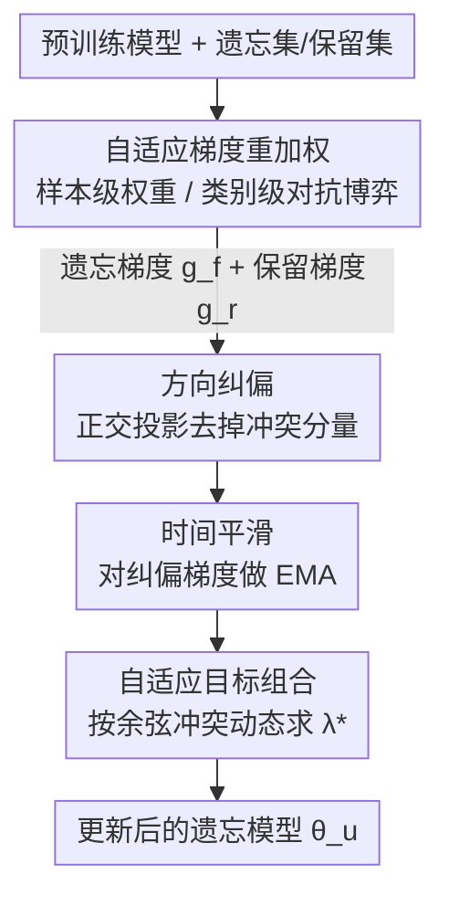

# Machine Unlearning via Adaptive Gradient Reweighting and Multi-stage Objective Optimization

**会议**: CVPR 2026  
**论文**: [CVF Open Access](https://openaccess.thecvf.com/content/CVPR2026/html/Lu_Machine_Unlearning_via_Adaptive_Gradient_Reweighting_and_Multi-stage_Objective_Optimization_CVPR_2026_paper.html)  
**代码**: 无  
**领域**: 机器遗忘 / AI 安全与隐私  
**关键词**: Machine Unlearning, 自适应梯度重加权, 多目标优化, 梯度冲突, 遗忘-保留权衡

## 一句话总结
针对机器遗忘里"对所有样本/类别一视同仁"和"遗忘目标与保留目标梯度互相打架"两大问题，本文提出**自适应梯度重加权**（按样本记忆深度/类别脆弱度给不同权重）+ **三阶段目标优化**（方向纠偏 → 时间平滑 → 自适应组合），在 CIFAR-10/100、Tiny-ImageNet 上把随机遗忘的 Avg Gap 从 SOTA 的 0.85 压到 0.19。

## 研究背景与动机
**领域现状**：机器遗忘（Machine Unlearning, MU）的目标是在不从头重训的前提下，把指定训练样本（forget set $D_f$）的影响从已训模型中抹掉，让模型表现得像从没见过这些数据一样，理想终点是 $\theta_u \approx \theta_r$（$\theta_r$ 是只在保留集 $D_r$ 上重训得到的参数）。主流近似遗忘方法有梯度上升、显著性剪枝（SalUn）、蒸馏（BadT）、解耦遗忘/保留目标（DELETE）等。

**现有痛点**：① **一刀切**——现有方法对所有 forget 样本、所有保留类别用同样的策略和权重，忽略了样本"记忆深度"的差异。作者用分类损失当记忆深度的指标：视觉特征相似的样本（如猫狗的毛发纹理）决策边界模糊、分类损失高、属于"浅记忆"，本来很容易遗忘；而深记忆样本才是硬骨头。一刀切会把算力浪费在浅记忆样本上、对硬样本又遗忘不彻底。② **类别连带损伤**——遗忘"飞机"类时，分布相近的"鸟"类精度会大幅下跌（实测 −12.4%），因为相似类别在决策边界附近互相牵连。

**核心矛盾**：遗忘目标（让 $D_f$ 上表现变差）和保留目标（让 $D_r$ 上表现不变）天然冲突，两者梯度存在**方向冲突**（合成后两个目标都退化）和**支配问题**（某一个梯度太大，更新完全偏向单任务）。现有方法用一个**固定的权衡系数**手工调两个目标的加权和，但梯度之间的几何关系在训练中是**动态演化**的，固定系数适配不了，只能靠昂贵的网格搜索，且仍然次优。

**本文目标**：(1) 让遗忘/保留的"力气"按样本和类别的难度自适应分配；(2) 动态化解遗忘与保留梯度的方向冲突与支配问题。

**切入角度**：把 MU 当成一个**多任务学习/多目标优化**问题来看——遗忘任务和保留任务就是两个互相冲突的任务，可以借鉴 MTL 里 PCGrad/CAGrad 那套梯度手术思路，但要针对 MU 的"动态演化"特性做成自适应的。

**核心 idea**：用"自适应梯度重加权"决定**对谁用多大力**，用"三阶段目标优化"决定**两股力怎么合成**，全程无需手工调权衡系数。

## 方法详解

### 整体框架
方法分两大块协同：先由**自适应梯度重加权**为每个 forget 样本（随机遗忘场景）或每个保留类别（类别遗忘场景）算出带权重的遗忘梯度 $g_f$ 和保留梯度 $g_r$；再把这两股梯度送进**三阶段目标优化**——先做方向纠偏消除互相打架的分量，再做时间平滑滤掉高频抖动，最后自适应地把两者合成一个平衡更新方向去更新模型。整条链路每一步都把"该用多大力 + 两股力怎么合"交给优化器自己决定，摆脱固定超参。

### 关键设计

**1. 自适应梯度重加权：按记忆深度/类别脆弱度分配遗忘力度**

针对"一刀切"痛点，本设计分两种场景给样本/类别赋权。**随机样本遗忘**走**实例级双层优化**：给每个 forget 样本 $x_i^f$ 配一个可学习权重 $w_i = \sigma(a_i) \in (0,1)$（$a_i$ 是可训练标量），遗忘目标是带权的预测熵 $L_f(\theta, a) = \frac{1}{|B_f|}\sum_i w_i \cdot H_i$，其中 $H_i = -\sum_j p_{ij}\log p_{ij}$ 是预测熵（最大化熵=诱导遗忘，且不依赖标签）。一次反向传播同时算出模型梯度 $g_f = \nabla_\theta L_f$ 和权重梯度，权重按 $a \leftarrow a - \eta_a \nabla_a L_f$ 更新，自动把更大权重分给"难遗忘"的深记忆样本——相当于一条**自适应课程**，越往后越聚焦硬样本，不再浪费算力在浅记忆样本上。

**类别遗忘**走**对抗式类别赋权**：把保留类别的加权写成模型 $\theta$（防守方）和类别权重策略 $\pi$（攻击方）之间的 min-max 博弈 $\min_\theta \max_{\pi \in \Delta_R} \frac{1}{|B_r|}\sum \pi_{c(y_i)} \cdot \ell(f_\theta(x_i), y_i)$。攻击方用 Gumbel-Softmax 重参数化对可学习 logits $\alpha$ 做可微采样、梯度上升把权重压到**最脆弱的保留类别**（即遗忘目标类时最容易被连累的近邻类，如"鸟"），防守方再用 stop-gradient 固定 $\pi$ 后最小化目标更新模型。这样模型会主动把保护力气投在最危险的近邻类上，缓解类别连带掉点。

**2. 三阶段目标优化：动态化解遗忘-保留梯度的冲突与支配**

针对"固定权衡系数适配不了动态梯度关系"的痛点，本设计把 $g_f$、$g_r$ 的合成拆成三个串行阶段：

- **方向纠偏（Direction Rectification）**：当归一化后两梯度冲突（$\hat{g}_r \cdot \hat{g}_f > 0$，注意一个是上升一个是下降，正内积即冲突），对称地把每个梯度投影到对方的正交补上：$\hat{g}_f^\perp = \hat{g}_f - \alpha \cdot \max(0, \hat{g}_f \cdot \hat{g}_r)\cdot \hat{g}_r$，$\hat{g}_r^\perp$ 对称。这步消除互相破坏的分量、保留各自独立方向，强度 $\alpha=1.0$。
- **时间平滑（Temporal Stabilization）**：相邻步方向差异大会让更新来回抵消、损害收敛，于是对纠偏后的梯度做指数滑动平均 $\tilde{g}^{(t)} = \mu \tilde{g}^{(t-1)} + (1-\mu)\hat{g}^\perp$（$\mu=0.9$），把历史方向信息揉进当前更新，保证轨迹一致、稳步前进。
- **自适应目标组合（Adaptive Objective Combination）**：把两股平滑后的梯度按平衡因子 $\lambda_t$ 线性合成 $g(\lambda_t) = (1-\lambda_t)\tilde{g}_r^{(t)} - \lambda_t \tilde{g}_f^{(t)}$，并用合成梯度与两任务梯度的余弦相似度差 $J(\lambda_t) = \cos(g(\lambda_t), \tilde{g}_f^{(t)}) - \cos(g(\lambda_t), \tilde{g}_r^{(t)})$ 度量冲突，每步在 $[0,1]$ 上**求最优 $\lambda_t^* = \arg\min_{\lambda_t} J(\lambda_t)$**，最后 $\theta \leftarrow \theta - \eta \cdot g(\lambda_t^*)$。这一步逐步动态地决定两股力的配比，避免某个梯度长期支配更新，化解了固定超参带来的支配问题。

### 损失函数 / 训练策略
遗忘目标用**预测熵最大化**（label-free），保留目标用标准分类损失 $L_r(\theta)$；最终更新方向由三阶段优化合成，无需手工权衡系数。CIFAR-10/100 原模型从头训 200 epoch（SGD，初始 lr 0.1、momentum 0.9、weight decay $5\times10^{-4}$，cosine 退火，早停 patience 50）；Tiny-ImageNet 用 ImageNet-1k 预训练的 ResNet-50 微调。纠偏强度 $\alpha=1.0$、动量 $\mu=0.9$。实现基于 PyTorch 2.4，单卡 RTX 4090。

## 实验关键数据

### 主实验
随机遗忘 10% 数据（评估指标 **Avg Gap**：MIA 准确率、forget/retain/test 三集精度相对"重训金标准"的绝对差值的平均，越低越好）：

| 模型/数据集 | 指标 | 本文 | LoTUS(次优) | SalUn |
|------|------|------|----------|------|
| ViT / C-10 | Avg Gap | **0.19** | 0.85 | 1.08 |
| ViT / C-100 | Avg Gap | **1.26** | 1.88 | 3.00 |
| RN18 / C-10 | Avg Gap | **1.57** | 5.33 | 5.38 |
| RN18 / C-100 | Avg Gap | **6.03** | 11.83 | 14.99 |

本文 MIA 分数最贴近重训金标准（如 ViT/C-10 本文 83.26 vs 金标准 83.64），说明在 forget/retain 之间拉开了清晰的"性能鸿沟"、遗忘彻底且不伤模型可用性；而基线 MIA 普遍远高于金标准，残留记忆明显。

### 消融实验
单类遗忘（评估 H-Mean = 保留测试精度 $Acc_{rt}$ 与遗忘测试集掉点 $Drop_{ft}$ 的调和均值）与多类遗忘验证了两大模块共同作用下既近乎完美遗忘又保住保留精度：

| 配置 | 关键指标 | 说明 |
|------|---------|------|
| 完整方法（RN18/C-10 单类） | $Acc_r$ 99.98 / $Acc_f$≈0 | 近乎完美遗忘 + 保留几乎不掉 |
| 多类遗忘（1→20 类, C-100） | 退化最小 | 随遗忘类数增加，基线明显退化，本文最稳 |
| 高比例遗忘（50%） | 仍领先 | 大规模遗忘场景仍优于基线 |
| 跨场景（医学分类 / 人脸识别 + 遗忘） | 提升明显 | 验证泛化到挑战性真实任务 |

### 关键发现
- **自适应重加权解决"用多大力"，三阶段优化解决"力怎么合"**——两者缺一不可：前者避免浅记忆样本被过度消耗、保护脆弱近邻类，后者消除梯度方向冲突与支配。
- 在 ViT 上提升尤为显著（Avg Gap 0.85→0.19），说明大容量模型上"动态梯度关系"更突出、固定超参更吃亏，本文自适应优势更大。
- 方法可扩展到多类、高比例（50%）遗忘以及医学分类、人脸识别等挑战场景，泛化性好。

## 亮点与洞察
- **把"记忆深度"显式量化并用作课程信号**：用分类损失/预测熵当浅记忆指标，给每个样本一个可学习权重，自然形成"由易到难"的自适应遗忘课程——这个把样本难度纳入遗忘力度分配的思路，可迁移到任何需要"区别对待样本"的清洗/编辑任务。
- **类别遗忘做成 min-max 对抗博弈**：让"攻击方"主动找出最脆弱的近邻保留类、逼"防守方"集中保护，精准缓解类别连带掉点，比一刀切保护所有类高效得多。
- **三阶段梯度手术针对 MU 的动态性**：方向纠偏（正交投影）+ 时间平滑（EMA）+ 自适应组合（按余弦冲突求最优 $\lambda$）这一套，把 PCGrad/CAGrad 等 MTL 梯度方法升级成全程无需手工权衡系数的版本，对任何"两个冲突目标动态演化"的优化问题都有借鉴价值。

## 局限与展望
- 评估仍以图像分类（CIFAR/Tiny-ImageNet）为主，虽然展示了医学分类与人脸识别，但未在大规模生成式模型/检测/分割等任务上验证，遗忘机制对这些任务的可迁移性待考。
- 实例级双层优化与三阶段优化引入额外计算（每步求最优 $\lambda$、维护 EMA、对抗更新），论文未充分量化相对简单基线的训练开销，效率代价需关注。
- 记忆深度用"分类损失/预测熵"近似，这一代理指标在标签噪声大或类别极不平衡时是否仍可靠，文中未深入讨论。
- ⚠️ 部分阶段公式与符号（如纠偏的对称投影、余弦冲突目标 $J(\lambda_t)$）以原文为准。

## 相关工作与启发
- **vs SalUn（显著性剪枝）/ DELETE（解耦目标）**: 它们仍对样本/类别一视同仁、用固定权衡系数；本文用自适应重加权区别对待样本+类别，并用三阶段优化动态合成梯度，随机遗忘 Avg Gap 大幅领先（ViT/C-10：本文 0.19 vs SalUn 1.08）。
- **vs PCGrad / CAGrad（MTL 梯度手术）**: 它们做静态的梯度投影消冲突；本文把它扩展为"纠偏+时间平滑+自适应组合"的多阶段、动态版本，专门匹配 MU 中梯度几何关系随训练演化的特性。
- **vs DualOptim（双优化器解耦动量）**: DualOptim 在优化器层面解耦动量但带来额外显存且仍一视同仁；本文不靠双优化器，而在梯度合成层面自适应平衡，且对样本/类别差异化处理。

## 评分
- 新颖性: ⭐⭐⭐⭐ 把"样本记忆深度自适应赋权"和"MU 专属三阶段梯度优化"组合，角度清晰但都建立在 MTL/MOP 已有思路上。
- 实验充分度: ⭐⭐⭐⭐ 覆盖随机/单类/多类/高比例遗忘 + 医学/人脸跨场景，三数据集三架构，较全面；缺训练开销对比。
- 写作质量: ⭐⭐⭐⭐ 动机用图清楚铺陈两大痛点，方法分块严谨；部分公式符号略密。
- 价值: ⭐⭐⭐⭐ 无需手工调权衡系数即达 SOTA，对隐私合规（GDPR 被遗忘权）等落地场景实用。

<!-- RELATED:START -->

## 相关论文

- [\[ICML 2026\] How Hard Can It Be? Hardness-Aware Multi-Objective Unlearning](../../ICML2026/ai_safety/how_hard_can_it_be_hardness-aware_multi-objective_unlearning.md)
- [\[CVPR 2026\] Computation and Communication Efficient Federated Unlearning via On-server Gradient Conflict Mitigation and Expression](computation_and_communication_efficient_federated_unlearning_via_on-server_gradi.md)
- [\[NeurIPS 2025\] Efficient Verified Machine Unlearning for Distillation](../../NeurIPS2025/ai_safety/efficient_verified_machine_unlearning_for_distillation.md)
- [\[CVPR 2025\] MOS-Attack: A Scalable Multi-Objective Adversarial Attack Framework](../../CVPR2025/ai_safety/mos-attack_a_scalable_multi-objective_adversarial_attack_framework.md)
- [\[CVPR 2026\] Bypassing the Transport Plan: Dynamic Reweighting for Out-of-Distribution Detection with Optimal Transport](bypassing_the_transport_plan_dynamic_reweighting_for_out-of-distribution_detecti.md)

<!-- RELATED:END -->
