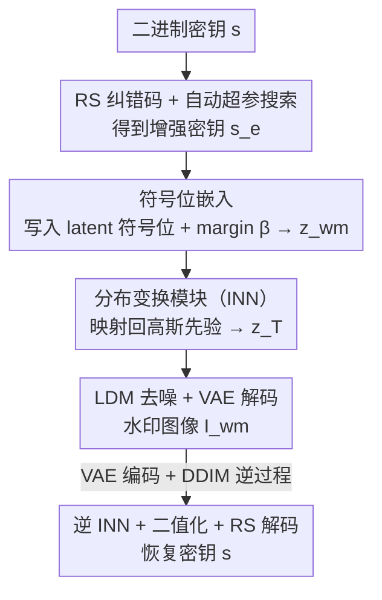

# MaxMark: High-Capacity Diffusion-Native Watermarking via Robust and Invertible Latent Embedding

**会议**: CVPR 2026  
**论文**: [CVF Open Access](https://openaccess.thecvf.com/content/CVPR2026/html/Chang_MaxMark_High-Capacity_Diffusion-Native_Watermarking_via_Robust_and_Invertible_Latent_Embedding_CVPR_2026_paper.html)  
**代码**: https://github.com/SeRAlab/MaxMark  
**领域**: AI安全 / 扩散模型水印  
**关键词**: 扩散模型水印, 高容量水印, 可逆神经网络, 符号位嵌入, 纠错码

## 一句话总结
MaxMark 把水印写进 latent 噪声里"最可靠的符号位"、再用可逆神经网络（INN）把含水印 latent 拉回标准高斯分布，从而在 latent 扩散模型上做到「高容量 + 高鲁棒 + 不掉画质」的潜空间水印，在 16,384 bit 满容量下把提取准确率比最强基线提升约 46%。

## 研究背景与动机

**领域现状**：latent 扩散模型（LDM）生成的图越来越逼真，溯源与版权认证变得迫切。相比生成后再贴水印的后处理方法，**扩散原生（diffusion-native）水印**把信号直接写进生成过程，更隐蔽也更抗篡改。其中**潜空间（latent-based）水印**——把水印写进初始噪声 latent、再靠 DDIM 逆过程恢复——因为不用改动 LDM 本体（不微调 VAE/UNet），最适合真实部署。

**现有痛点**：潜空间水印的**容量**是死穴。最强的 Gaussian Shading 在 SD v1.5 上把负载从 256 bit 加到 8,192 bit 时，准确率直接掉了 15%；PRC Watermark 在 4,096 bit 之后准确率崩到接近随机（50%）。容量一上去，提取就废了。

**核心矛盾**：容量受限来自两类机制冲突。编码器-解码器类方法里，编码器与解码器的不对称、加上 DDIM 逆过程的近似误差会**累积失真**；结构化扰动类方法（Tree-Ring / Gaussian Shading / PRC）直接改 latent 会**破坏其高斯分布**、扰动扩散轨迹、损害画质——为了保画质扰动只能很小，容量天然被压死。

**本文目标**：在不改 LDM 的前提下，做到三件事——(1) 把信息放进 latent 里**最可靠的区域**；(2) 把扰动后的 latent **映射回 LDM 原生的高斯先验**；(3) 嵌入与提取**损失极小**以保证高准确率恢复。

**切入角度**：作者的三个关键观察——**符号位（sign bit）是最可靠的信息载体**（经 DDIM 逆过程后最稳定）；**纠错码参数可以自动调**以适配不同容量；**可逆性是把恢复损失压到最小的关键**。

**核心 idea**：用「符号位嵌入 + 自动调参纠错码」做鲁棒嵌入，再用「可逆神经网络」做分布变换把含水印 latent 拉回高斯——可逆结构让正向变换和反向恢复共享参数、严格无损，从而把高容量、高鲁棒、高画质三者同时拿下。

## 方法详解

### 整体框架
MaxMark 由两个协作模块组成：**鲁棒水印嵌入模块**先把密钥用纠错码增强、再写进 latent 噪声的符号位，得到含水印 latent $z_{wm}$；**分布变换模块**用一个可逆神经网络（INN）把 $z_{wm}$ 映射回标准高斯分布，得到可直接喂给扩散模型的初始噪声 $z_T$。生成时 $z_T$ 走标准 LDM 去噪 + VAE 解码，产出水印图像 $I_{wm}$。提取时严格走逆过程：图像经 VAE 编码 + DDIM 逆过程恢复出近似 $z_T'$，再用同参数的 INN 反向得到 $z_{wm}'$，最后二值化 + RS 解码还原密钥。

### 关键设计

**1. RS 纠错码 + 自动超参搜索：用最省冗余的方式扛住逆过程误差**

潜空间水印提取时，DDIM 逆过程会引入比特翻转误差，容量越大错越多。作者不用前作的 PRC 码，而是采用 **Reed–Solomon（RS）块码**（在 $GF(2^m)$ 上，每符号 $m$ 比特，默认 $m=8$）。RS 有两个优势：编解码比 PRC 轻量得多；在固定冗余预算下提供**最优的最坏情况纠错能力**，特别适合逆扩散带来的"成簇/突发翻转"。把长度 $l$ 的密钥切成长度 $B$ 的块，每块 $k=B/m$ 个数据符号外加 $r$ 个校验符号，构成 $RS(n,k)$（$n=k+r$）码，可纠正每码字最多 $t=\lfloor r/2\rfloor$ 个符号错。

块长 $B$ 和校验长度 $r$ 之间存在标准的冗余-容量权衡。作者的关键观察是：**逆扩散引入的误差在各 latent 维度上近似 i.i.d.**，于是块失败概率有闭式表达，可以直接搜索一组在满足目标可靠度 $\varepsilon$ 的同时**留下尽可能多有效负载**的 RS 参数——这就是"自动超参搜索"，免去人工调参。最后校验位拼到原密钥后形成增强密钥 $s_e$；若嵌入负载后剩余空间不够放校验位，则不加 ECC。消融显示自动搜索（99.6%）显著优于随机 ECC 配置（95.5%）和无 ECC（94.3%）。

**2. 符号位嵌入：把水印写进 latent 里最抗逆过程的那一位**

作者把水印写进 latent 噪声的**符号位**——经验上符号位和其它高阶位在 DDIM 逆过程后最稳定，低阶位几乎没有可用信号，而改动除符号位外的极高阶位又会严重损害画质，所以符号位是鲁棒性与隐蔽性的最优折中（消融见 Fig.5）。具体做法是先采一个噪声向量 $x\sim\mathcal{N}(0,1)$，按增强密钥 $s_e$ 覆写其符号位，并加一个 margin 参数 $\beta$ 把改动后的值推离零点，提升可分性、增强对逆过程噪声的鲁棒性：

$$x'_i = \sigma(s_i)\,|x_i|\pm\beta,\quad \sigma(s_i)=2s_i-1$$

逐像素施加后得到含水印 latent $z_{wm}$。把 $\beta$ 设为 0 做对照实验可验证：符号位与高阶位确实比低阶位鲁棒得多。

**3. 分布变换模块（INN）：把含水印 latent 拉回高斯，保画质又保无损恢复**

直接拿 $z_{wm}$ 去生成会因为分布被破坏而严重掉画质（消融里 FID 从约 42 暴涨到约 388）。作者用**可逆神经网络（INN）**把 $z_{wm}$ 映射回 LDM 原生的标准高斯 $\mathcal{N}(0,I)$。INN 建立输入输出的双射：正向 $y=f_\theta(x)$，反向 $x=f_\theta^{-1}(y)$ **共享同一套参数 $\theta$**，因此保证无损重构。模块由 12 个非对称耦合块（coupling block）堆成，每块把输入按通道分成 $z_a^{i-1},z_b^{i-1}$ 两半，经子网 $f_a^i,f_b^i$ 和乘性耦合 $\phi(z,s,t)=ze^s+t$ 交错变换（反向用 $\phi^{-1}(z,s,t)=(z-t)e^{-s}$）。

可逆性带来一个训练上的便宜：**不需要重构损失**，只需一个分布损失把输出约束成高斯。作者用最大似然（MLE）损失加 KL 散度项：

$$\mathcal{L}_{total}=\mathcal{L}_{MLE}(z,J)+\lambda\,\mathcal{KL}_{div}(z,y)$$

其中 $J$ 是变换的雅可比行列式，$y\sim\mathcal{N}(0,I)$，默认 $\lambda=0.1$。这样既缓解了嵌入扰动对画质的破坏，又靠双射结构让提取阶段严格反演、几乎无损。一个额外好处是**容量泛化**：在长度 $M=C\times H\times W$（SD 上为 $4\times64\times64=16384$）上训练后，无需重训即可嵌入任意 $\le M$ 长度的水印；模型一旦训好，编码任意消息都不用 per-message 重训。

### 损失函数 / 训练策略
训练时随机生成长度 $M$ 的二进制密钥，经鲁棒嵌入模块得到 $z_{wm}$ 作为分布变换模块输入，只优化前向过程（反向共享参数）。INN 用 12 个非对称耦合块，超参 $\lambda=0.1$、$\beta=10$。推理用 DDIM 50 步、guidance scale 7.5，生成 $512\times512$ 图；逆过程用空 prompt、guidance scale 1。RS 码符号大小 $m=8$。

## 实验关键数据

> 指标说明：**Bit Accuracy（位准确率）** = 提取水印与原水印逐比特正确的比例（越高越好，随机基线 50%）；**Bit Accuracy under Adversarial** = 在 7 种攻击下的平均准确率；**TPR@1%FPR** = 把误报率控制在 1% 时的真正例检出率（可检测性）；画质用 **CLIP Score**（越高越好）、**CMMD / FID**（越低越好，作者指出 CMMD 比 FID 对 SD 更可靠）。负载 256→16384 bit 分别占满 latent 空间的 1.56%→100%。

### 主实验
SD v1.5 下不同负载的水印有效性（节选 Table 1，单位 %）：

| 负载(bit) | 指标 | MaxMark | Gaussian Shading | PRC Watermark | DiffuseTrace |
|--------|------|------|----------|------|------|
| 4096 | Bit Acc | 97.7 | 93.8 | 50.1 | 49.9 |
| 8192 | Bit Acc | 96.0 | 84.4 | 51.4 | 49.9 |
| 12288 | Bit Acc | 95.6 | — | 51.0 | 50.1 |
| 16384 | Bit Acc | 95.4 | 49.9 | 43.6 | 50.0 |
| 16384 | 攻击下 Bit Acc | 86.9 | 50.1 | 48.1 | 50.3 |
| 16384 | TPR@1%FPR | 1.00 | 0.00 | 0.01 | 0.01 |

可以看到：基线在高容量下几乎全部塌到随机水平，而 MaxMark 在满容量 16,384 bit 仍保持 95.4% 干净准确率、86.9% 攻击下准确率、TPR@1%FPR=1.00。作者据此报告在 8,192 / 12,288 / 16,384 bit 上分别提升 12% / 45% / 46%。画质方面（Table 2）MaxMark 的 CLIP Score≈0.33、CMMD≈0.76、FID≈42，与各基线持平，没有为了高容量牺牲画质。

### 消融实验
| 配置 | 关键指标 | 说明 |
|------|---------|------|
| 完整 MaxMark | 16384bit Acc 98.6 / FID 41.8 | — |
| w/o 分布变换模块 | 16384bit Acc 88.4 / FID 386.9 | 画质灾难性崩塌、提取也掉点（Table 4，COCO） |
| w/o ECC | 256bit Acc 94.3 | 不加纠错（Table 6） |
| Random ECC | 256bit Acc 95.5 | 随机选 ECC 参数 |
| 自动搜索 ECC | 256bit Acc 99.6 | 本文自动调参 |
| RS vs BCH | 96.0 vs 96.0(8192bit) | 框架对不同 ECC 通用（Table 5） |

### 关键发现
- **分布变换模块（INN）是画质的命根**：去掉后 FID 从约 42 暴涨到约 387，说明不拉回高斯就没法用；同时正反扩散不对称加剧、提取准确率也跟着掉。
- **自动 ECC 搜索 > 随机 ECC > 无 ECC**：纠错码把逆过程误差纠回来，自动调参在容量天花板下最大化可靠度。
- **跨模态可迁移**：把水印铺满时空 latent 再做分布变换，视频（ModelScope）32k bit 准确率 98.2%、音频（AudioLDM2）32k bit 96.7%，而 PRC 在 32k bit 上塌到约 50%，显示方法不局限于图像。

## 亮点与洞察
- **"符号位才是可靠信道"这个观察很实用**：把信息放进经逆过程后最稳的比特、而不是均匀扰动整个 latent，是高容量的前提；这条结论可迁移到其它需要经过有损变换再恢复的水印场景。
- **用可逆性换掉重构损失很巧**：INN 正反共享参数 + 双射保证无损，于是训练只需一个分布损失、不用重构损失，既轻量又把恢复误差压到结构性下界——这是"高容量却不掉准确率"的关键机理。
- **自动 ECC 调参把"冗余-容量权衡"变成可搜索问题**：基于"逆扩散误差近似 i.i.d."给出闭式失败概率，让纠错强度按目标可靠度自动配，省去逐容量手调。
- **训练一次、任意消息免重训**：相比 DiffuseTrace/Stable Signature 需要 per-message 或 per-content 重训，MaxMark 部署成本低得多。

## 局限与展望
- 提取依赖 **DDIM 逆过程的近似质量**；逆过程误差是准确率的主要来源，更激进的采样器或更强的图像编辑攻击下表现仍待验证。
- 评测攻击集中在常见信号级扰动（模糊/噪声/JPEG/缩放等），**对再生成式（regeneration）、VAE 重编码等更强自适应攻击**的鲁棒性未充分检验。⚠️ 具体攻击细节以原文 Appendix 为准。
- 满容量 16,384 bit 时攻击下准确率降到约 86.9%，离干净场景的 95.4% 仍有差距，说明高容量与抗攻击之间还有余地。
- INN 用 12 个耦合块，虽轻量但仍是一次额外的变换；对推理时延的影响论文未给详细数字。

## 相关工作与启发
- **vs Gaussian Shading**：都维持高斯分布，但 GS 靠重复+置乱水印序列、容量受限（消息长度须整除 16,384），高容量直接塌；MaxMark 用符号位嵌入 + INN 分布变换，满容量仍稳。
- **vs PRC Watermark**：PRC 用伪随机纠错码嵌初始 latent，1,024 bit 后解码成本陡增、4,096 bit 后准确率崩；MaxMark 改用更轻的 RS 码 + 自动调参，且把信息放符号位而非全局扰动。
- **vs Tree-Ring / RingID / ZoDiac**：这类结构化扰动法本质是"少量比特 + 检测"，容量极低；MaxMark 面向多比特高容量溯源。
- **vs Stable Signature / DiffuseTrace（改模型/需重训）**：它们微调 VAE/UNet 或 per-message 重训、成本高且改变模型行为；MaxMark 不动 LDM、训一次可编任意消息。

## 评分
- 新颖性: ⭐⭐⭐⭐ "符号位是可靠信道 + INN 做分布变换"组合干净有效，但各组件（INN、RS 码、潜空间水印）本身都是已有技术的巧妙拼装。
- 实验充分度: ⭐⭐⭐⭐⭐ 覆盖 6 个负载、多基线、攻击鲁棒性、画质三类指标 + 消融 + 跨视频/音频模态，证据充分。
- 写作质量: ⭐⭐⭐⭐ 动机与机理讲得清楚，图 3 框架信息密但稍乱，部分公式排版有 OCR 噪声。
- 价值: ⭐⭐⭐⭐ 高容量潜空间水印对 C2PA 式溯源很实用，且开源、免 per-message 重训，落地性强。

<!-- RELATED:START -->

## 相关论文

- [\[CVPR 2026\] Forensic-Friendly Image Manipulation via Controllable Latent Diffusion](forensic-friendly_image_manipulation_via_controllable_latent_diffusion.md)
- [\[CVPR 2026\] RecoverMark: Robust Watermarking for Localization and Recovery of Manipulated Faces](recovermark_robust_watermarking_for_localization_and_recovery_of_manipulated_fac.md)
- [\[CVPR 2026\] RevINN: An End-to-End Invertible Neural Network for Reversible Adversarial Examples Generation](revinn_an_end-to-end_invertible_neural_network_for_reversible_adversarial_exampl.md)
- [\[CVPR 2026\] Meta-FC: Meta-Learning with Feature Consistency for Robust and Generalizable Watermarking](meta-fc_meta-learning_with_feature_consistency_for_robust_and_generalizable_wate.md)
- [\[CVPR 2026\] ClusterMark: Towards Robust Watermarking for Autoregressive Image Generators with Visual Token Clustering](clustermark_towards_robust_watermarking_for_autoregressive_image_generators_with.md)

<!-- RELATED:END -->
