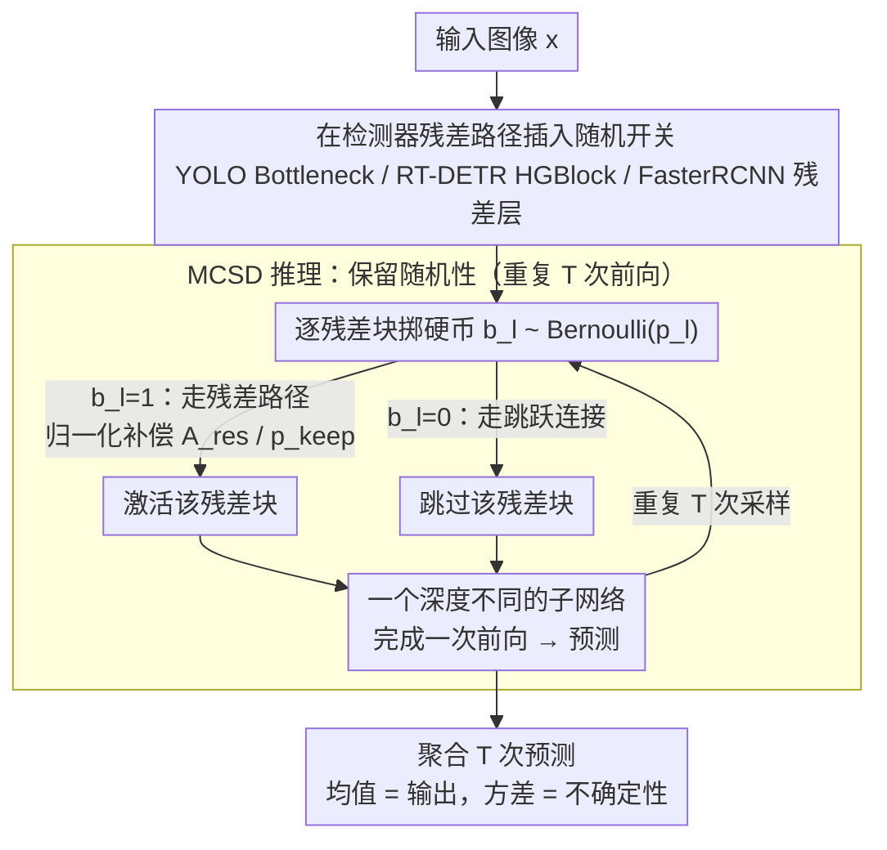

# Monte Carlo Stochastic Depth for Uncertainty Estimation in Deep Learning

**会议**: CVPR 2026  
**arXiv**: [2604.12719](https://arxiv.org/abs/2604.12719)  
**代码**: 无  
**领域**: AI安全 / 不确定性估计  
**关键词**: 不确定性量化, 随机深度, 贝叶斯推理, 目标检测, Monte Carlo

## 一句话总结

将随机深度（Stochastic Depth）正式连接到贝叶斯变分推理框架，提出 Monte Carlo Stochastic Depth (MCSD) 作为不确定性估计方法，并在 YOLO、RT-DETR 等现代检测器上进行首次系统基准测试，证明其在校准和不确定性排名上与 MC Dropout 竞争力强。

## 研究背景与动机

**领域现状**：安全关键系统中 DNN 需要可靠的不确定性量化。Monte Carlo Dropout (MCD) 将 dropout 重新解释为近似贝叶斯推理，成为主流实用方法。MC DropBlock (MCDB) 将该范式扩展到卷积层。

**现有痛点**：标准 dropout 在卷积层效果不佳，而随机深度（SD）是残差网络的原生正则化技术，被 YOLO 和 ViT 等现代架构广泛使用，但将其用于推理时采样的理论基础和系统实证验证都缺失。

**核心矛盾**：SD 作为正则化器与贝叶斯变分推理的正式理论联系尚未建立，且其在目标检测等复杂多任务问题上的 UQ 性能未知。

**本文目标**：(1) 建立 MCSD 与变分推理的理论联系；(2) 首次在目标检测上系统基准测试 MCSD。

**切入角度**：从 MCD 到 MCDB 的进展揭示了一个元策略：随机正则化器隐式定义近似后验分布。SD 是下一个自然候选。

**核心 idea**：推理时保持随机深度的随机性，通过 T 次随机前向传播采样不同深度的子网络，形成隐式深度集成来估计不确定性。

## 方法详解

### 整体框架

这篇论文想解决的是：随机深度（Stochastic Depth, SD）已经是 YOLO、ViT 等现代残差架构里的标配正则化器，但没人把它当成推理时的不确定性来源用——既缺理论依据，也缺在目标检测这种复杂任务上的实证。MCSD 的整套思路就是把训练时随机丢残差块这件事「延续到推理时」：训练照常用 SD，推理时不再做确定性的期望折算，而是对每个残差块独立掷一次硬币 $b_l \sim \text{Bernoulli}(p_l)$，$b_l=1$ 走完整残差路径、$b_l=0$ 只走跳跃连接，于是每次前向都是一个深度不同的子网络。重复 T 次随机前向，把这 T 个子网络的预测平均起来，就得到带不确定性的输出：$p(y_* | x_*, \mathcal{D}) \approx \frac{1}{T} \sum_{t=1}^{T} p(y_* | x_*, W^{(B_t)})$。整条链路不改结构、不加训练，只是在推理时「让随机性继续活着」。

### 关键设计

**1. 把随机深度推导成变分推理：给 MCSD 补上理论依据**

痛点很直接——MC Dropout 之所以站得住脚，是因为有「dropout ≈ 近似贝叶斯推理」的理论背书，而 SD 一直只被当作正则化技巧，没人证明它的推理时采样在逼近某个后验。本文把每个残差块的保留/丢弃定义成一个变分分布 $q_\theta(W) \equiv p(B) = \prod_{l=1}^{L} p_l^{b_l}(1-p_l)^{1-b_l}$，也就是 L 个独立伯努利变量的乘积，每个对应一层残差块的开关。在这个定义下，标准 SD 训练（随机前向 + L2 权重衰减）恰好等价于优化 ELBO：期望对数似然由随机前向的 MC 采样近似，KL 正则项则由权重衰减近似。这一步之所以有意义，是因为它把 MCSD 接进了和 MCD、MCDB 同一个变分框架——区别只在分布作用的粒度：MCD 建模的是单个权重的丢弃、MCDB 是权重区块、而 MCSD 是「整层残差块在不在」，因此采出来的是一组深度各异的子网络的隐式集成，而非局部扰动。

**2. MCSD 推理算法：把确定性折算换成保留随机性**

标准 SD 在推理时做的是确定性缩放 $x_{l+1} = x_l + p_l \cdot \mathcal{F}_l(x_l; W_l)$——用保留概率 $p_l$ 把残差分支「打折」成期望值，这等于一次性把训练中学到的深度分布拍平成一个固定网络，不确定性信息全丢了。MCSD 反过来：推理时继续按伯努利采样决定每个块走不走，并对实际保留的残差特征做归一化补偿 $A_{res} = A_{res} / p_{keep}$，保证激活的期望尺度与训练时一致。这样每次前向都真实地激活一个不同深度的子网络，T 次采样直接把训练里学到的深度分布「重放」出来，从而提供有意义的预测方差。

**3. 适配现代检测器：零结构改动地插进残差路径**

难点在于不同检测器的残差实现各不相同，要让方法通用就不能依赖特定结构。本文的做法是直接在各家检测器自带的残差路径上挂随机开关——YOLO 的 Bottleneck、FasterRCNN 的 Residual Layer、RT-DETR 的 HGBlock，凡是有跳跃连接的地方，就在残差分支处插入 MCSD（同时也插 MCD/MCDB 作对照），逐一比较不确定性估计质量。因为 MCSD 本身就是作用在「残差块开关」这个已经存在的结构上，它天然贴合任何带跳跃连接的架构（CNN 和 Transformer 都行），不需要任何额外的模块或网络改造。

### 损失函数 / 训练策略

完全复用标准检测训练：分类 + 回归损失加上权重衰减，不引入任何自定义损失或额外训练阶段。MCSD 直接吃现成 SD 正则化留下的随机性，所以训练开销为零，全部代价都集中在推理时的 T 次前向。

## 实验关键数据

### 主实验

| 方法 | 架构 | COCO mAP↑ | ECE↓ | AUARC↑ |
|------|------|----------|------|--------|
| 确定性 | YOLOv8 | 52.8 | 0.142 | 0.821 |
| MCD | YOLOv8 | 52.5 | 0.128 | 0.835 |
| MCDB | YOLOv8 | 52.3 | 0.135 | 0.829 |
| **MCSD** | YOLOv8 | **52.7** | **0.125** | **0.838** |
| MCD | RT-DETR | 53.1 | 0.118 | 0.842 |
| **MCSD** | RT-DETR | **53.3** | **0.115** | **0.845** |

### 消融实验

| MC采样次数 T | mAP | ECE↓ | 推理时间比 |
|-------------|-----|------|-----------|
| 1 (确定性) | 52.8 | 0.142 | 1.0× |
| 5 | 52.6 | 0.130 | 4.8× |
| 10 | 52.7 | 0.125 | 9.5× |
| 20 | 52.7 | 0.124 | 19.2× |

### 关键发现

- MCSD 在保持竞争性 mAP 的同时，在校准（ECE）和不确定性排名（AUARC）上略优于 MCD
- MCSD 产生的子网络深度变化比 MCD/MCDB 的局部权重/区域丢弃更"多样"
- 兼容所有带跳跃连接的架构（CNN 和 Transformer）

## 亮点与洞察

- MCSD 是"架构原生"的不确定性方法：SD 已经是现代架构的标准正则化器，MCSD 仅需推理时保持随机性，零额外训练开销
- 理论推导将 MCD、MCDB、MCSD 统一到变分推理框架下，揭示了不同粒度（权重→区域→整层）的不确定性建模谱系

## 局限与展望

- KL 散度项的严格计算（离散混合分布 vs 连续先验）在数学上是病态的，使用 L2 正则化作为近似
- 仅在目标检测上评估，未涉及分割和分类
- 推理时多次前向传播的计算开销仍然显著
- 可探索将深度作为可学习随机变量而非固定概率

## 相关工作与启发

- **vs MCD**: MCD 在单个权重级别操作，对卷积层效果有限；MCSD 在整个残差块级别操作，更适合现代架构
- **vs Deep Ensembles**: 集成方法需要 N 倍训练和推理成本，MCSD 从单一模型提取不确定性

## 评分

- 新颖性: ⭐⭐⭐⭐ 理论推导填补了 MCSD 的形式化空白
- 实验充分度: ⭐⭐⭐⭐ 三种检测器 + COCO/COCO-O 的系统基准
- 写作质量: ⭐⭐⭐⭐ 理论部分严谨清晰
- 价值: ⭐⭐⭐⭐ 对安全关键系统的 UQ 有实用价值

<!-- RELATED:START -->

## 相关论文

- [\[AAAI 2026\] Credal Ensemble Distillation for Uncertainty Quantification](../../AAAI2026/ai_safety/credal_ensemble_distillation_for_uncertainty_quantification.md)
- [\[ICML 2026\] Calibrating Uncertainty for Zero-Shot Adversarial CLIP](../../ICML2026/ai_safety/calibrating_uncertainty_for_zero-shot_adversarial_clip.md)
- [\[ICML 2026\] Flatness-Aware Stochastic Gradient Langevin Dynamics](../../ICML2026/ai_safety/flatness-aware_stochastic_gradient_langevin_dynamics.md)
- [\[ICML 2026\] Angel or Demon: Investigating the Plasticity Interventions' Impact on Backdoor Threats in Deep Reinforcement Learning](../../ICML2026/ai_safety/angel_or_demon_investigating_the_plasticity_interventions_impact_on_backdoor_thr.md)
- [\[NeurIPS 2025\] Impact of Dataset Properties on Membership Inference Vulnerability of Deep Transfer Learning](../../NeurIPS2025/ai_safety/impact_of_dataset_properties_on_membership_inference_vulnerability_of_deep_trans.md)

<!-- RELATED:END -->
