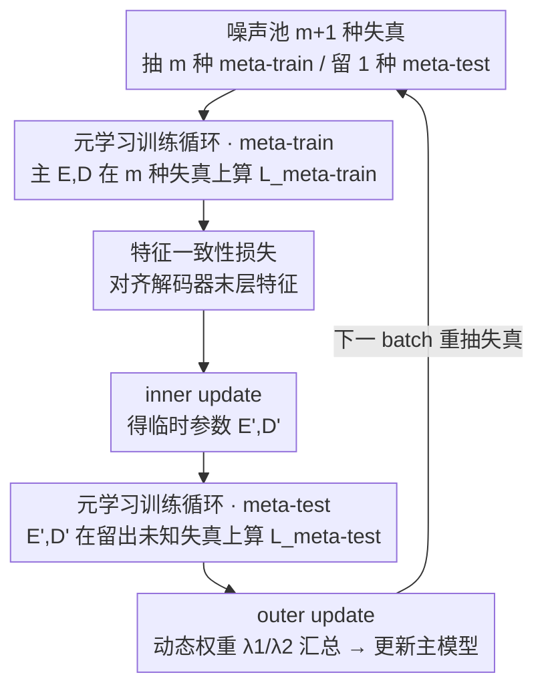

# Meta-FC: Meta-Learning with Feature Consistency for Robust and Generalizable Watermarking

**会议**: CVPR 2026  
**论文**: [CVF Open Access](https://openaccess.thecvf.com/content/CVPR2026/html/Li_Meta-FC_Meta-Learning_with_Feature_Consistency_for_Robust_and_Generalizable_Watermarking_CVPR_2026_paper.html)  
**代码**: 已开源（论文称 open-source，⚠️ 具体地址以原文为准）  
**领域**: AI安全 / 深度水印训练策略  
**关键词**: 鲁棒水印, 元学习, 特征一致性, 失真不变表示, 即插即用训练

## 一句话总结
Meta-FC 把深度水印里"每个 batch 随机选一种失真训练"（SRD）的老套路换成元学习——每个 batch 抽多种失真做 meta-train、留一种当"未知失真"做 meta-test，再加一个特征一致性损失对齐解码器特征，让水印模型学到失真不变表示；作为即插即用策略套在 5 个现成模型上，在高强度/组合/未知失真下平均把准确率提升 1.59%/4.71%/2.38%。

## 研究背景与动机

**领域现状**：基于深度学习的鲁棒水印普遍用**编码器-噪声层-解码器（END）**端到端框架：编码器把水印嵌进封面图，噪声层模拟各种失真，解码器从被失真的图里抽回水印。为了抗多种失真，主流训练策略是 **SRD（Single Random Distortion）**——每个训练 batch 从噪声池里随机选**一种**失真当噪声层。

**现有痛点**：SRD 把每种失真**孤立地**逐 batch 学习，忽略了不同失真之间的内在关系，带来两个问题——(1) 模型**过拟合到特定失真的特征**，而不是学到真正的失真不变表示；(2) **优化不稳定**，不同失真的梯度方向互相冲突（gradient conflict），模型抓不住这些不变性。

**核心矛盾**：水印模型要在**高强度失真、组合失真、未知失真**这三类硬场景下都稳，就必须学到跨失真共享的不变表示；但 SRD 的"逐 batch 单失真"训练方式从机制上就拿不到这种共享性——它从没在同一次更新里同时面对多种失真，也从没"演练"过没见过的失真。

**本文目标**：设计一个**模型无关、即插即用**的训练策略，让任意 END 水印模型都能学到失真不变表示，从而在三类硬场景下提升鲁棒性与泛化。

**切入角度**：作者从**元学习在域泛化里的成功**得到启发——MAML/MLDG 这类方法本质都是"通过 meta-train/meta-test 迭代挖掘跨任务的不变特征"。把"不同失真组合"看成不同"任务"，就能自然地把元学习搬到水印训练里。

**核心 idea**：在**每个 batch 内部**模拟"已知失真上训练、未知失真上测试"——抽 $m$ 种失真做 meta-train 求出临时参数，再用留出的第 $m{+}1$ 种失真做 meta-test 算泛化损失，联合优化逼近"对各种失真都稳"的参数；再叠一个特征一致性损失把"稳定激活"进一步逼成"失真不变表示"。

## 方法详解

### 整体框架
Meta-FC 是一个套在现成 END 模型外面的训练循环，不改网络结构。噪声池有 $m{+}1$ 种失真，每个 batch 随机抽 $m$ 种当 meta-train 失真、剩下 1 种当 meta-test 的"未知"失真。一次迭代分四步：① **meta-train**——主编码器 $E$、解码器 $D$ 在 $m$ 种失真上算 meta-train 损失（含解码损失 $\mathcal{L}^{tra}_{msg}$ 和特征一致性损失 $\mathcal{L}_{w,n}$）；② **inner update**——用 meta-train 损失更新出**临时**参数 $E',D'$；③ **meta-test**——用 $E',D'$ 在留出的"未知"失真上算 meta-test 损失 $\mathcal{L}^{tes}_{msg}$；④ **outer update**——把 meta-train、meta-test、图像损失加权汇总成 $\mathcal{L}_{total}$，更新**主模型**参数 $\theta_e,\theta_d$。如此反复，逐渐逼近"对各种失真梯度方向都协调"的参数。

### 关键设计

**1. 元学习训练循环：在 batch 内部"已知失真上练、未知失真上考"**

这是 Meta-FC 的核心，专治 SRD 的过拟合与梯度冲突。**meta-train** 阶段，主 $E,D$ 在抽到的 $m$ 种失真上各解出一份消息 $\mathcal{M}^i_{tra}$，解码损失是对每种失真的 MSE 求和，并叠上特征一致性损失：

$$\mathcal{L}^{tra}_{msg}=\sum_{i=1}^{m}\textit{MSE}(\mathcal{M}_{en},\mathcal{M}^i_{tra}),\quad \mathcal{L}_{meta\text{-}train}=\mathcal{L}^{tra}_{msg}+\lambda_f\,\mathcal{L}_{w,n}$$

（$\lambda_f$ 默认 0.001）。用 $\mathcal{L}_{meta\text{-}train}$ 做一次 **inner update** 得到临时参数 $E',D'$——这一步等于让模型"先适应这一簇已知失真"。**meta-test** 阶段，把留出的第 $m{+}1$ 种失真当成"未知"失真，用临时参数 $E',D'$ 去解码、算 $\mathcal{L}^{tes}_{msg}=\textit{MSE}(\mathcal{M}_{en},\mathcal{M}_{tes})$。关键在于：**meta-test 损失是对临时参数求的、却用来更新主参数**，于是主参数被推向"在已知失真上更新一步后、在未知失真上也仍然好"的方向——这正好缩小已知与未知失真之间的梯度方向差距，缓解逐 batch 单失真造成的优化冲突。注意整个过程**没有任何真正未知的失真**进来，"未知"只是 batch 内留出来模拟的。

**2. 特征一致性损失：把"稳定激活"逼成"失真不变表示"**

光靠元学习能挑出稳定参数，但提升不了模型本身的表示能力。作者再加一个特征一致性损失，对齐**未失真水印图 $I^{tra}_w$ 与其各失真版本 $I^i_{tra}$ 在解码器末层的特征**。直觉是：从干净水印图抽的解码特征 $f_w$ 信息更完整可靠，把各失真版本的特征 $f^i_{no}$ 都拉向它，就逼模型抽出抗失真的水印相关表示。两者先 L2 归一化，再用余弦相似度度量距离：

$$\mathcal{L}_{w,n}=\sum_{i=1}^{m}\bigl(1-\cos(\bar f_w,\bar f^i_{no})\bigr)=\sum_{i=1}^{m}\bigl(1-\langle\bar f_w,\bar f^i_{no}\rangle\bigr)$$

以 $\bar f_w$ 为锚点最小化它，等于让所有失真下解出的特征收敛到一致的水印表示。消融显示这一项主要补强**组合失真**——去掉它组合失真掉约 2.21%。

**3. 动态损失权重：先学会"解得出"，再学"看着像"**

总损失把 meta-train、meta-test、图像损失加权汇总：

$$\mathcal{L}_{total}=\lambda_1\cdot\frac{\mathcal{L}_{meta\text{-}train}+\mathcal{L}_{meta\text{-}test}}{m+1}+\lambda_2\cdot\frac{\mathcal{L}_{img}}{2}$$

其中图像损失 $\mathcal{L}_{img}=\mathcal{L}^{tra}_{img}+\mathcal{L}^{tes}_{img}$ 同时约束主编码器和临时编码器产出的水印图与封面图一致，保证隐蔽性。$\lambda_1,\lambda_2$ 动态调整：训练早期水印信号本就比图像内容弱，先把鲁棒解码学稳——$\lambda_1$ 初始化为 5、$\lambda_2$ 仅为 1；待解码在各失真下稳定后，$\lambda_1$ 逐步降到最小 1、$\lambda_2$ 逐步升到最大 15，把重心切到画质。这个由"先鲁棒、后画质"的调度避免了弱水印信号在早期被画质项压住。

### 一个完整示例
一个 batch 的 9 种失真池（Identity + GB/SPN/Crop/JPEG/MB/GN/Bright/Dropout）为例：随机抽其中 8 种当 meta-train，主 $E,D$ 在这 8 种上各解码一次、算 $\mathcal{L}_{meta\text{-}train}$（解码 MSE + 特征一致性），inner update 得临时 $E',D'$；剩下那 1 种（比如 JPEG）当"未知"失真，用 $E',D'$ 解码算 $\mathcal{L}_{meta\text{-}test}$；最后把两段损失 + 图像损失按当前 $\lambda_1,\lambda_2$ 汇总，反传更新主模型。下个 batch 重新抽，留出的"未知"失真也随之轮换，让每种失真都轮流扮演过"未见"角色。

## 实验关键数据

> 指标说明：**ACC（位准确率）** = 解码器正确恢复的水印比特比例（越高越好）；画质用 **PSNR / SSIM**。所有实验在 128×128、64 bit 水印、RTX 3090 上跑；为公平对比，每个模型在 SRD 与 Meta-FC 下都调到 PSNR 一致。基线是 5 个现成 END 模型：StegaStamp / MBRS / FIN / SepMark / DERO，各自用 SRD 和 Meta-FC 各训一遍。

### 主实验
高强度失真下 SRD vs Meta-FC 的平均 ACC（节选 Table 1，DIV2K，单位 %）：

| 模型 | SRD Avg | Meta-FC Avg | 提升 |
|------|------|----------|------|
| StegaStamp | 94.48 | 95.57 | +1.09 |
| MBRS | 94.58 | 96.14 | +1.56 |
| FIN | 92.19 | 93.25 | +1.06 |
| SepMark | 94.75 | 97.28 | +2.53 |
| DERO | 95.92 | 97.20 | +1.28 |

组合失真与未知失真下的平均提升（跨三数据集汇总，论文正文）：

| 场景 | StegaStamp | MBRS | FIN | SepMark | DERO |
|------|-----------|------|-----|---------|------|
| 组合失真 ACC 提升 | +0.63 | +7.92 | +1.62 | +12.79 | +1.23 |
| 未知失真 ACC 提升 | +2.51 | +2.16 | +1.04 | +3.12 | +1.87 |

可以看到 Meta-FC 对所有 5 个模型、三类场景几乎全面占优；SepMark/MBRS 在组合失真上提升尤为夸张（+12.79/+7.92），说明越是 SRD 学不好的硬场景，元学习 + 特征一致性的收益越大。高强度下个别攻击 Meta-FC 略低于 SRD（差距 < 1% ACC），因为 SRD 会过拟合到某个攻击、而 Meta-FC 追求广泛泛化。

### 消融实验
| 配置 | 高强度 | 组合 | 未知 | 说明 |
|------|------|------|------|------|
| 完整 Meta-FC | 95.93 | 92.65 | 90.93 | — |
| w/o meta-test（保留 FC） | 95.85 | 91.09 | 89.60 | 组合/未知掉点 |
| w/o FC | 95.56 | 90.44 | 90.99 | 组合掉 2.21 |
| w/o meta-test & FC（仅 meta-train） | 95.27 | 90.58 | 88.96 | — |
| w/o meta-train & FC（≈SRD 基线） | 94.34 | 87.94 | 88.55 | 退化为 SRD |

### 关键发现
- **meta-train 比 meta-test 更关键**：只保留 meta-train（w/o meta-test & FC）已比 SRD 强不少；说明"一次更新里同时面对多失真"本身就在缓解梯度冲突，meta-test 主要再加泛化。
- **特征一致性损失专补组合失真**：去掉 FC 组合失真掉约 2.21%，而对未知失真几乎无影响（甚至 +0.06）——它的作用是让多失真下的解码特征收敛一致。
- **代价可接受**：Meta-FC 比 SRD 多约 0.6 倍训练时间（如 MBRS 2.07h→3.37h），但换来稳定的 ACC 提升，作者认为划算（Table 5）。
- **画质不掉**：相同 PSNR 约束下提升鲁棒性，残差图（Fig.3）显示水印同样不可见。

## 亮点与洞察
- **把"失真"重新框成"任务"是关键转译**：一旦把不同失真组合看成元学习里的不同任务，域泛化那套 meta-train/meta-test 机制就能原样搬过来——这个视角迁移很干净，也解释了为什么对组合/未知失真收益最大。
- **即插即用、零结构改动**：Meta-FC 只动训练流程，不碰 END 网络，能套在任意现成水印模型上，复用性极高；这让它更像一条"训练范式升级"而非又一个新模型。
- **"先鲁棒后画质"的动态权重很务实**：抓住了"水印信号天生弱于图像内容"这一现象，用 $\lambda_1$ 从 5 降到 1、$\lambda_2$ 从 1 升到 15 的调度稳住早期优化，可迁移到其它隐写/嵌入式任务。
- **特征一致性用余弦相似度 + 干净图当锚**：以信息最全的未失真特征为锚把各失真特征拉齐，比直接对齐 logits 更聚焦"水印相关"表示。

## 局限与展望
- 作者自己承认：**模型架构本身限定了泛化天花板**，Meta-FC 在既有架构内提升鲁棒性，但对完全未见的攻击类型，单靠训练策略无法做到完全免疫——未来要配合更强架构。
- 多出约 **0.6 倍训练开销**，且需要噪声池里预置"足够多样"的失真才能演练出有用的"未知"——噪声池设计本身是隐性依赖。
- 实验固定在 **128×128、64 bit**，更高分辨率、更长负载下元学习内外两次更新的稳定性与收益未验证。
- "未知失真"评测的 8 种失真仍是常见类别（JPEG/亮度/擦除/对比度等），**对再生成式或对抗自适应攻击**的泛化未触及。⚠️ 具体训练配置以原文补充材料为准。

## 相关工作与启发
- **vs SRD（单随机失真）**：SRD 逐 batch 单失真、互相孤立，过拟合 + 梯度冲突；Meta-FC 在 batch 内同时面对多失真并演练未知失真，学到失真不变表示——消融里 SRD ≈ "w/o meta-train & FC"基线。
- **vs per-SRD / PDL（渐进失真层）**：这些也想缓解优化冲突（同 batch 内不同图加不同失真、或渐进加噪），但仍抓不到失真间共性、学不出不变表示；Meta-FC 用元学习显式对齐跨失真梯度。
- **vs MBRS 的循环 JPEG 训练**：MBRS 靠对 clean/真实 JPEG/模拟 JPEG 循环训练抗压缩，是针对单一失真的工程化；Meta-FC 是通用、跨失真的训练范式。
- **vs MAML / MLDG（元学习/域泛化）**：思想同源（两次梯度更新挖不变性），Meta-FC 把"域"换成"失真组合"、并补上特征一致性损失专门服务水印解码。

## 评分
- 新颖性: ⭐⭐⭐⭐ 把元学习/域泛化范式干净地迁移到水印训练并配特征一致性损失，视角新；但底层 meta-train/meta-test 机制沿用 MAML 思路。
- 实验充分度: ⭐⭐⭐⭐⭐ 5 个现成模型 × 3 数据集 × 高强度/组合/未知三类失真 + 消融 + 时间分析，把"即插即用普适性"证得很扎实。
- 写作质量: ⭐⭐⭐⭐ 动机（SRD 两宗罪）和机理讲得清楚，算法伪代码完整；部分公式因 OCR 排版有噪声。
- 价值: ⭐⭐⭐⭐ 作为零结构改动的训练范式可直接增强现有水印模型，实用性强，但单点提升幅度（多为 1~3% ACC）偏温和。

<!-- RELATED:START -->

## 相关论文

- [\[CVPR 2026\] DASH: A Meta-Attack Framework for Synthesizing Effective and Stealthy Adversarial Examples](dash_a_meta-attack_framework_for_synthesizing_effective_and_stealthy_adversarial.md)
- [\[CVPR 2026\] RecoverMark: Robust Watermarking for Localization and Recovery of Manipulated Faces](recovermark_robust_watermarking_for_localization_and_recovery_of_manipulated_fac.md)
- [\[ICCV 2025\] FedMeNF: Privacy-Preserving Federated Meta-Learning for Neural Fields](../../ICCV2025/ai_safety/fedmenf_privacy-preserving_federated_meta-learning_for_neural_fields.md)
- [\[CVPR 2026\] TIACam: Text-Anchored Invariant Feature Learning with Auto-Augmentation for Camera-Robust Zero-Watermarking](tiacam_text-anchored_invariant_feature_learning_with_auto-augmentation_for_camer.md)
- [\[CVPR 2026\] ClusterMark: Towards Robust Watermarking for Autoregressive Image Generators with Visual Token Clustering](clustermark_towards_robust_watermarking_for_autoregressive_image_generators_with.md)

<!-- RELATED:END -->
