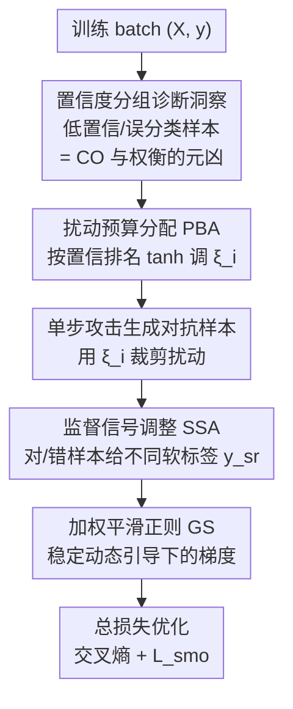

# Mitigating Error Amplification in Fast Adversarial Training

**会议**: CVPR 2026  
**论文**: [CVF Open Access](https://openaccess.thecvf.com/content/CVPR2026/html/Zhao_Mitigating_Error_Amplification_in_Fast_Adversarial_Training_CVPR_2026_paper.html)  
**代码**: 无  
**领域**: 对抗鲁棒 / AI安全  
**关键词**: 快速对抗训练, 灾难性过拟合, 鲁棒性-精度权衡, 动态扰动预算, 置信度自适应

## 一句话总结
本文发现快速对抗训练（FAT）中的低置信度/误分类样本是灾难性过拟合（CO）和鲁棒性-精度权衡的"罪魁祸首"，据此提出按样本置信度动态分配扰动预算、按预测状态动态调整监督信号、再配一个加权平滑正则的 DDG 策略，在 CIFAR-10/100 和 Tiny-ImageNet 上同时缓解 CO 并改善鲁棒性-精度权衡。

## 研究背景与动机

**领域现状**：对抗训练（AT）是提升模型鲁棒性最有效的手段之一，但标准 AT 要迭代生成对抗样本、开销大。快速对抗训练（FAT）改用 FGSM-RS 这类单步攻击来加速训练，是兼顾效率与鲁棒性的主流路线。

**现有痛点**：FAT 有两个老大难问题。其一是灾难性过拟合（catastrophic overfitting, CO）——训练几个 epoch 后鲁棒性会突然崩塌；其二是鲁棒性-精度权衡（robustness–accuracy trade-off）——提升鲁棒性往往要牺牲干净样本精度，而且扰动预算越大、精度损失越严重。已有工作把 CO 归因于梯度错位、特征通路发散等，针对权衡也提了先验引导初始化、标签松弛等技巧，但 CO 与权衡之间的内在联系一直没被讲清。

**核心矛盾**：现有 FAT 对**所有样本一视同仁**——统一的扰动预算、统一的监督信号。但不同样本对扰动的承受能力差别巨大：高置信度样本能扛住大扰动，低置信度（多为误分类）样本一受大扰动就触发 CO。统一处理本质上是在拿"会拖后腿的那部分样本"去毒化整个训练。

**本文目标**：搞清楚 (1) 不同置信度的样本在 FAT 中各自的行为；(2) 如何据此对扰动强度和监督强度做自适应调整，同时压住 CO 和权衡。

**切入角度**：作者沿用 TDAT 框架，在 CIFAR-10/ResNet-18 上做受控消融——把每个 batch 按预测置信度切成若干组，单独调某一组的扰动预算或监督标签，观察 Clean/PGD/C&W 的变化。这种"分组干预"能精确定位是哪类样本在主导 CO 和权衡。

**核心 idea**：用"按置信度排名的分布感知动态引导（Distribution-aware Dynamic Guidance, DDG）"替代统一处理——给高置信度样本更大扰动、给低置信度样本更小扰动并抑制其错误监督，从而把样本引向一致的决策边界、避免学到伪相关。

## 方法详解

### 整体框架

DDG 的逻辑是：先用一组诊断性消融建立"低置信度样本是元凶"这一洞察，再据此把 FAT 的两个旋钮（扰动预算、监督信号）都改成**逐样本、随训练状态自适应**，最后用一个加权平滑正则压住动态引导带来的梯度抖动。它不改 backbone、不改单步攻击的本质，只重塑"每个样本该被多大力地攻击、多大力地监督"。

具体到每个训练 batch：先算出 batch 内各样本按真值类置信度的排名 $r_i$；用排名经一个 tanh 形状的函数算出逐样本扰动预算 $\xi_i$（**扰动预算分配 PBA**），高排名给大预算、低排名给小预算；用该预算裁剪单步对抗扰动、生成对抗样本；再根据样本当前是否被正确分类，给出软监督标签 $y_{sr}$（**监督信号调整 SSA**），正确则用松弛标签、错误则做正类增强+负类抑制；最后用交叉熵加上一个**加权平滑正则 $\mathcal{L}_{smo}$（GS）** 一起优化。

### 关键设计

**1. 置信度分组诊断：定位 CO 与权衡的真正元凶**

这是全文的立论根基，回答"统一引导到底坏在哪"。作者把 batch 按预测置信度分成 4 组（CO 分析）乃至 32 组（权衡分析），单独对某一组提高/降低扰动预算或改监督标签，再看 Clean/PGD/C&W 怎么变。结论非常干净：高置信度样本能容忍大扰动而不破坏优化；**低置信度（多为误分类）样本一受大扰动就触发 CO**，因为模型会去抓"扰动专属的伪特征"而非语义线索，类似学了一个依赖类别的后门特征。反过来，把最低置信度组的预算从 8/255 降到 4/255，Clean/PGD/C&W 同时涨了 +1.06/+0.47/+0.41——说明**缓解对已经错的样本的过度错误强化，能同时提升鲁棒与干净精度**。监督侧消融也印证：对最低置信组设 $\beta_1=0,\beta_2=-0.1$（即抑制最可能错误类）平均 Clean +1.18、PGD +1.40。这个"对低置信样本要轻拿轻放"的洞察直接决定了后面 PBA 和 SSA 的方向。

**2. 扰动预算分配 PBA：按置信排名给每个样本定制攻击强度**

针对"统一预算会毒化低置信样本"这个痛点。DDG 不再用固定 $\xi_{base}=8/255$，而是按 batch 内样本的置信度降序排名 $r_i$ 算逐样本预算：

$$\xi_i = \xi_{base} + \kappa\left[\tanh(r_i-\tau_1) - \tanh(\tau_2 - r_i)\right]$$

其中 $\kappa$ 是控制波动幅度的缩放因子（默认 $2/255$，使 $\xi_i\in[4/255, 12/255]$），$\tau_1+\tau_2=B$（batch size）约束过渡区。排名靠前（高置信）的样本拿大预算、靠后（低置信）的拿小预算。生成对抗样本时再用 $\xi_i$ 裁剪：$\delta_i = \mathrm{clip}(\delta_{init} + \max\{\xi_i,\xi_{base}\}\cdot\mathrm{sign}(\nabla\mathcal{L}),\ -\xi_i,\ \xi_i)$，其中 $\delta_{init}$ 沿用上一步扰动。这样高置信样本被更强地推向一致决策边界、低置信样本则免于被大扰动逼着学伪相关，正好把设计 1 的诊断落地。

**3. 监督信号调整 SSA：按预测对错给不同的软标签**

针对"对已经错的样本继续强行用错误监督，会越错越离谱"这个痛点。DDG 根据样本当前是否被正确分类，给出分段软标签：

$$y_{sr} = \begin{cases}\hat{y}, & \arg\max f(x') = y \\ \hat{y} + \gamma(1-\mathrm{Acc})\,y - \tfrac{1}{L}y_m, & \text{否则}\end{cases}$$

其中 $\hat{y}$ 是松弛标签，$\mathrm{Acc}$ 是当前 batch 的经验精度（提供一个动态全局信号），$y_m$ 是最可能错误类的 one-hot。预测正确时直接用松弛标签；预测错误时，正类增强项 $\gamma(1-\mathrm{Acc})y$ 随真类置信度升高而减弱、负类抑制项 $\frac{1}{L}y_m$ 反比于类别数。换言之——对错样本既温和地拉回正确类、又抑制它最容易误判的那个错误类，避免设计 1 里观察到的"过度错误强化"。

**4. 加权平滑正则 GS：压住动态引导带来的梯度抖动**

针对"逐样本动态调预算和监督会让梯度变得不平滑、训练不稳"这个副作用。总损失为 $\mathcal{L}_{total} = -\frac{1}{B}\sum y_{sr}\log f(x') + \mathcal{L}_{smo}$，其中平滑正则：

$$\mathcal{L}_{smo} = \|f(x+\delta_{init}) - f(x')\|_2\left(\lambda\frac{\max(\xi_B)-\xi_B}{\max(\xi_B)-\min(\xi_B)} + \alpha\,y_{false} + 1\right)$$

它由三部分加权：第一项按 batch 内预算把正则强度归一化平衡；误分类惩罚 $\alpha\,y_{false}$（$y_{false}$ 在 $\arg\max f(x')\neq y$ 时为 1）在负类抑制过程中加强对错样本的正则、维持梯度平滑；常数项 1 保证所有样本都有非零正则。消融显示去掉 GS 会让 Clean 精度最高（84.55%）但鲁棒性明显下滑——说明它是在"稳住动态引导"和"不过度牺牲干净精度"之间做的兜底。

### 损失函数 / 训练策略
最终目标 $\mathcal{L}_{total}$ 即交叉熵（用 $y_{sr}$ 软标签）+ $\mathcal{L}_{smo}$。Backbone 全用 ResNet-18，SGD（momentum 0.9，weight decay $5\times10^{-4}$），batch 128，初始 lr 0.1，训练 110 epoch、在 100/105 epoch 各降 0.1。关键超参 $\tau_1=8$、$\lambda=1.33$、$\alpha=1.5$，其余沿用 TDAT。报告 best（PGD-10 鲁棒最高的 epoch）和 final（末轮，看训练稳定性）两个结果。

## 实验关键数据

### 主实验

CIFAR-10 / ResNet-18，$\ell_\infty$ 预算 8/255，对比多种 FAT 方法（节选 best epoch）：

| 方法 | Clean | FGSM | PGD-10 | C&W | APGD |
|------|-------|------|--------|-----|------|
| FGSM-PGK | 81.52 | 64.95 | 56.14 | 50.90 | 55.44 |
| FGSM-PGI | 81.71 | 65.02 | 55.26 | 50.88 | 54.62 |
| TDAT | 82.46 | 66.28 | 56.36 | 49.99 | 55.10 |
| **DDG (本文)** | **82.67** | **68.44** | **60.44** | 49.86 | **59.48** |

DDG 在 Clean、FGSM、PGD-10、APGD 上全面领先，PGD-10 比次优 TDAT 高约 4 个点；仅 C&W 略低于 PGI/PGK（作者解释这与攻击目标有关，见关键发现）。CIFAR-100 上 DDG 取得 Clean 57.98 / FGSM 40.96 / PGD-10 34.42 / APGD 33.86，全面超过 TDAT（57.32/40.29/33.56/33.15）和 FGSM-PGK；Tiny-ImageNet 上 BIM/PGD-10/APGD 达 24.30/24.35/23.85，优于 TDAT（23.78/23.98/23.28），且 final 与 best 接近、训练稳定。

### 消融实验

各组件在 CIFAR-10 的作用（best epoch；PBA=扰动预算分配，SSA=监督信号调整，GS=梯度平滑）：

| 配置 | Clean | FGSM | PGD-10 | C&W | APGD |
|------|-------|------|--------|-----|------|
| 完整 DDG | 82.67 | 68.44 | 60.44 | 49.86 | 59.48 |
| w/o PBA | 81.70 | 68.33 | 59.54 | 49.58 | 57.46 |
| w/o SSA | 80.38 | 66.11 | 58.21 | **50.87** | 57.03 |
| w/o GS | **84.32** | 68.44 | 58.71 | 49.08 | 57.11 |

去掉 PBA 干净和鲁棒精度都下滑；去掉 SSA 反而 C&W 略升但 Clean 明显掉；去掉 GS 干净精度最高却以鲁棒性为代价——三者合起来才拿到最优的鲁棒-精度权衡。

### 关键发现
- **低置信度样本是 CO 与权衡的元凶**：诊断消融显示给最低置信组降预算可同时涨 Clean/PGD/C&W，而给它加大预算则触发 CO——这是整套方法的立论核心。
- **Clean 与 PGD 正相关、与 C&W 负相关**：作者归因于攻击目标差异——PGD 是"一对多"攻击（把样本推离真类到任意错类），C&W 是"多对一"攻击（找最易达到的目标类）。Clean 升高使决策边界更锐利，更难把样本推向任意错类（PGD 鲁棒↑），但也可能暴露更清晰的下降方向（C&W 鲁棒略↓）。
- **超参影响温和**：$\tau_1$ 增大使 Clean↑、鲁棒略↓，$\lambda$ 增大则相反；整体 Clean/PGD/C&W 分别在 $83\%\pm0.5$、$60\%\pm0.5$、$50.25\%\pm0.25$ 内波动，方法对超参不敏感。

## 亮点与洞察
- **诊断驱动设计**：先用受控分组消融把"谁在毁掉训练"定位到低置信样本，再对症下药，整套方法的每个组件都有明确的实验证据支撑，而非堆 trick。这种"先归因再设计"的范式很值得借鉴。
- **把"扰动强度"和"监督强度"都做成逐样本自适应**：以往 FAT 多半只调其中一个，DDG 同时把两个旋钮都改成随置信度/预测状态动态变化，且用一个 tanh 排名函数和分段软标签实现，工程上很轻。
- **对 PGD 与 C&W 反相关的解释**：从攻击几何（一对多 vs 多对一）角度解释干净精度对两种攻击的相反影响，是个有迁移价值的分析视角，可用于理解其他 AT 方法的鲁棒性谱。

## 局限与展望
- 实验全程仅用 ResNet-18 一个 backbone，未验证在 WideResNet、ViT 等更大/不同架构上的表现，泛化性存疑。
- 方法依赖"置信度排名"来分配预算，但低置信样本的成员在训练中变化很快（作者自己在监督消融里也观察到中置信组干预会导致训练抖动）；排名噪声对 PBA 的稳健性影响未充分讨论。
- C&W 鲁棒性始终略逊于 PGI/PGK，说明负类抑制对"多对一"攻击有副作用，如何兼顾两类攻击仍是开放问题。
- 仅在 $\ell_\infty$、预算 8/255 下评测，对更大预算或 $\ell_2$ 威胁模型是否仍有效未知。

## 相关工作与启发
- **vs TDAT**：本文沿用 TDAT 的置信度分析框架与标签松弛，但 TDAT 仍用固定预算和较静态的监督，本文进一步把预算和监督都做成逐样本动态，并新增加权平滑正则，PGD-10 上大幅领先（60.44 vs 56.36）。
- **vs FGSM-PGK / FGSM-PGI**：它们靠先验引导初始化/历史扰动来稳训练，在 C&W/AA 上偶有优势，但 Clean、PGD、APGD 等多数指标弱于 DDG；本文从"逐样本引导强度"切入，而非改初始化。
- **vs GradAlign / N-FGSM**：这两者主要靠梯度对齐或噪声正则压 CO，本文则把 CO 归因到具体的低置信样本群体并定向干预，机制更可解释。

## 评分
- 新颖性: ⭐⭐⭐⭐ 诊断到位、"逐样本双旋钮动态引导"思路清晰，但各组件（标签松弛、动态预算）多为已有要素的组合升级。
- 实验充分度: ⭐⭐⭐⭐ 三数据集 + 多攻击 + 细致消融，但只用单一 backbone，泛化验证不足。
- 写作质量: ⭐⭐⭐⭐ 诊断—设计逻辑链顺畅，公式与算法清晰；部分符号（$y_{sr}$ 各项）需对照算法才好懂。
- 价值: ⭐⭐⭐⭐ 同时缓解 CO 与鲁棒-精度权衡，方法轻量易接入现有 FAT，实用性强。

<!-- RELATED:START -->

## 相关论文

- [\[ICML 2026\] SORA: Free Second-Order Attacks in Fast Adversarial Training](../../ICML2026/ai_safety/sora_free_second-order_attacks_in_fast_adversarial_training.md)
- [\[CVPR 2026\] Taming the Long Tail: Rebalancing Adversarial Training via Adaptive Perturbation](taming_the_long_tail_rebalancing_adversarial_training_via_adaptive_perturbation.md)
- [\[CVPR 2026\] FedCART: Tackling Long-Tailed Distributions in Federated Adversarial Training via Classifier Refinement](fedcart_tackling_long-tailed_distributions_in_federated_adversarial_training_via.md)
- [\[CVPR 2026\] SafeLogo: Turning Your Logos into Jailbreak Shields via Micro-Regional Adversarial Training](safelogo_turning_your_logos_into_jailbreak_shields_via_micro-regional_adversaria.md)
- [\[ECCV 2024\] Preventing Catastrophic Overfitting in Fast Adversarial Training: A Bi-level Optimization Perspective](../../ECCV2024/ai_safety/preventing_catastrophic_overfitting_in_fast_adversarial_training_a_bi-level_opti.md)

<!-- RELATED:END -->
