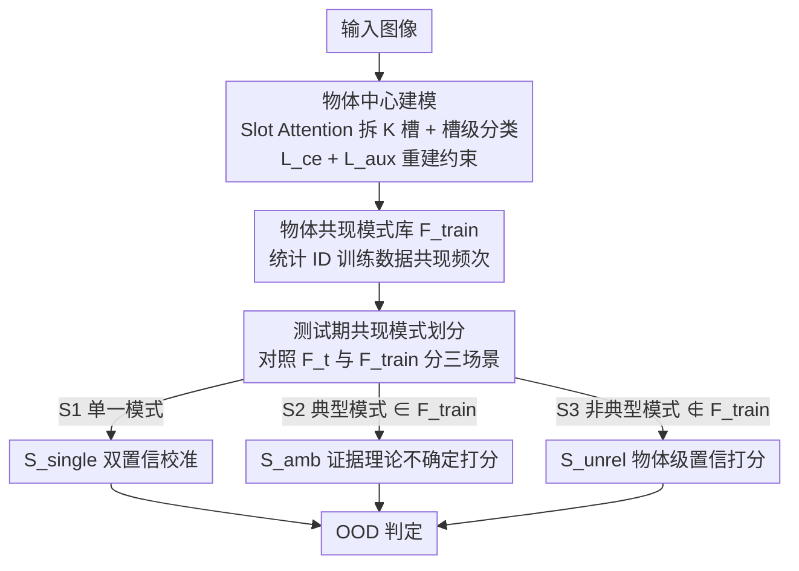

# Mitigating Simplicity Bias in OOD Detection through Object Co-occurrence Analysis

**会议**: CVPR 2026  
**论文**: [CVF Open Access](https://openaccess.thecvf.com/content/CVPR2026/html/Dai_Mitigating_Simplicity_Bias_in_OOD_Detection_through_Object_Co-occurrence_Analysis_CVPR_2026_paper.html)  
**代码**: https://github.com/MichaelMcQueen/OCO  
**领域**: OOD检测 / AI安全  
**关键词**: 分布外检测, 简单性偏置, 物体共现, 槽注意力, 分而治之打分

## 一句话总结
本文指出现有 OOD 检测因"简单性偏置"只盯着图像里最易学的局部线索、对近 OOD 力不从心，于是用 Slot Attention 把图像拆成物体级槽、显式建模"物体共现模式"，再把测试样本按共现是否符合训练分布划成单一/典型/非典型三种场景、各设专用打分分而治之，在 OpenOOD 与全谱 OOD 基准上对近 OOD 和协变量漂移都更鲁棒。

## 研究背景与动机

**领域现状**：OOD 检测要让模型在部署时识别出训练分布之外的样本。主流方法依赖 ID 与 OOD 在隐空间特征、logit 输出或两者组合上的差异来打分，对 far-OOD（分布剧烈偏移）很有效。

**现有痛点**：这些方法在 near-OOD（语义偏移细微）上常常失灵。根因是模型的**简单性偏置（simplicity bias）**——处理纠缠表征时，深网倾向抓"容易学的局部线索"，忽略对场景理解至关重要的复杂语义关系。文中举的例子很形象：一张海洋场景里狗（ID）和鲨鱼（OOD）共现，传统方法被简单性偏置带着只盯狗的判别性部位、无视"狗出现在海里"这种语境违和，给出 52.90% 的过度自信预测。

**核心矛盾**：图像本可分解成多个物体的组合，但现有方法把图像当成一个**整体**喂给检测器，于是无法利用"哪些物体该一起出现、哪些不该"这种语境信息。人类视觉系统恰恰靠物体间的共现关系来理解场景、判断异常。

**本文目标**：如何利用物体共现模式来缓解 OOD 检测中的简单性偏置，尤其是把近 OOD 检出来。

**切入角度**：借鉴物体中心表征学习——图像的纠缠特征可分解成不同物体的组合。作者用 Slot Attention 把表征拆成若干"槽（slot）"、每个槽对应一类物体概念，再统计 ID 训练数据里的物体共现模式作为参照。

**核心 idea**：提出 OCO（Object CO-occurrence）框架——先建模 ID 训练数据的物体共现模式，再在测试时按样本共现模式与训练分布的吻合度把它划成三种场景，最后针对每种场景设计专用 OOD 打分，分而治之。

## 方法详解

### 整体框架

OCO 把"检不检测得出 OOD"重构成"这张图里的物体组合像不像训练时见过的正常组合"。它分三步：训练期先用物体中心模型把每张 ID 图拆成槽、做槽级预测并统计出全体训练数据的共现模式库 $F_{train}$；测试期把每个样本的共现模式 $F_t$ 与 $F_{train}$ 对照、归到单一/典型/非典型三种场景之一；最后对三种场景各用一套专门的打分函数算 OOD 分数。这样近 OOD 不再靠"单个判别部位"判断，而是看整张图的物体语境是否自洽。

### 关键设计

**1. 物体中心共现建模：把图像拆成槽并统计 ID 共现库**

针对"把图像当整体、被简单性偏置带偏"这个痛点。给定纠缠特征 $x_i\in\mathbb{R}^{H\times W\times D}$，用现成的 Slot Attention（DINOSAUR 架构）抽成 $K$ 个槽 $S_i=\{s_i^{(1)},\dots,s_i^{(K)}\}$，每个槽捕捉一个物体部件；分类器对每个槽出一个 logit $l_i^{(k)}=h(s_i^{(k)};\theta)$，再聚合成全局预测 $l_i=\sum_k l_i^{(k)}$。训练目标 $L=L_{ce}+L_{aux}$，其中 $L_{aux}=\|x_i-\hat{x}_i\|_2$ 是用槽重建特征 $\hat{x}_i=\mathrm{upsample}(\mathrm{MLP}(S_i))$ 的辅助重建损失，保证槽真的在抽物体特征。这一步像集成学习：各槽作为弱局部证据提供者协同投票——"狗+草地"这种相容组合被 $L_{ce}$ 强化、"狗+海洋"这种异常配对被抑制。

随后统计共现库：对每张训练图取槽级预测 $c_i^{(k)}=\arg\max(l_i^{(k)})$，构造去重后的类别集 $U_i$ 和频次集 $F_i=\{(c, \sum_k \mathbb{I}(c_i^{(k)}=c))\mid c\in U_i\}$（用频次而非二值，是为了对抗槽的"过分割"——一个大物体可能被多个槽表示）。只把发生共现（$|F_i|\ge 2$）的训练样本频次集聚合成全库 $F_{train}=\bigcup_{i}\{F_i\}$，它刻画了训练数据里真实存在的场景语境。

**2. 测试期共现模式三场景划分：按是否符合训练分布分类样本**

针对"用一个统一打分应付所有样本不够细"这个痛点。OOD 样本因为模型只在 ID 上训过、会被预测成最接近的 ID 类，从而产生训练时没见过的怪异组合。据此把测试样本 $F_t$ 划成三种场景：

- **S1 单一模式**：$|F_t|=1$，所有槽都预测同一类（如 $F_t=\{(cat,3)\}$）；
- **S2 典型模式**：$|F_t|\ge 2 \wedge F_t\in F_{train}$，多物体组合且训练里见过（如 $\{(dog,2),(cat,1)\}$）；
- **S3 非典型模式**：$|F_t|\ge 2 \wedge F_t\notin F_{train}$，多物体组合但训练里没见过（如 $\{(penguin,2),(camel,1)\}$ 这种不可能共存的组合）。

作者统计了三场景的样本分布（ImageNet-200 / SSB-hard / iNaturalist）：ID 测试数据主要落在 S2（54.9%），印证方法对正常组合的保真；far-OOD 主要落在 S3（67.9%），因为组合根本不合理；near-OOD 因与 ID 部件级相似，在 S2 的占比高于 far-OOD。这种分布差异本身就说明共现模式能区分细微近 OOD 与 far-OOD。

**3. 分而治之的三套 OOD 打分：每个场景对症下药**

针对"不同场景 ID/OOD 的可分性来源不同"这个痛点，对三种场景各设一套分数。

S1 里所有槽都投同一类，主要风险是**过度自信**，于是用双置信校准：场景级置信 $P_t=\max_c(\mathrm{softmax}(l_t))$ 乘以物体级置信 $p_t^{max}=\max_k\max_c(\mathrm{softmax}(l_t^{(k)}))$，得 $S_{single}=P_t\cdot p_t^{max}$，两个证据相乘能压住单一证据带来的虚高分。

S2 是多类别且组合见过训练，ID/OOD 高度模糊（近 OOD 重灾区），用基于 Dempster–Shafer 证据理论（DST）的不确定性打分。它在主导类 $c'$ 与其它类 $c$ 之间算成对信念组合 $\mathrm{Bel}(c',c)=p_{c'}^{max}p_c^{max} + p_{c'}^{max}(1-p_c^{max}) + (1-p_{c'}^{max})p_c^{max}$，前一项"模式似然"是期望共现概率、后两项"模糊证据"表示样本必属某个 ID 类但不确定是哪个、肯定非 OOD；再聚合 $S_{amb}=\frac{1}{|F_t|-1}\sum_{c\neq c'}\mathrm{Bel}(c',c)$。DST 相比传统概率更能处理冲突证据。

S3 是没见过的非典型组合，大多数槽级预测 $l_t^{(k)}$ 都不可靠，于是直接用物体级最高置信 $S_{unrel}=p_t^{max}=\max_{k,c}(\mathrm{softmax}(l_t^{(k)}))$ 来量化异常程度。

### 损失函数 / 训练策略
训练只微调一个单层线性分类头，20 epoch，在预训练 ImageNet-1k ViT-B/16 和 DINOv2 ViT-B/14 上做；AdamW，lr 0.0004，cosine 衰减到 0.00005。物体中心槽注意力采用预训练 DINOSAUR 架构。优化目标即 $L=L_{ce}+L_{aux}$（分类 + 重建），其中 $L_{aux}$ 对槽能否抽出物体特征至关重要（见消融）。

## 实验关键数据

### 主实验

OpenOOD 基准，ID = ImageNet-1k，5 个 OOD 数据集的均值（FPR95↓ / AUROC↑）：

| Backbone | 方法 | FPR95 ↓ | AUROC ↑ |
|----------|------|---------|---------|
| ViT | FDBD | 49.66 | 83.94 |
| ViT | OODD | 54.65 | 83.91 |
| ViT | **OCO (本文)** | **47.26** | **86.04** |
| DINOv2 | CoRP | 40.53 | 85.67 |
| DINOv2 | OODD | 42.93 | 87.04 |
| DINOv2 | **OCO (本文)** | **38.70** | **87.75** |

OCO 在两种 backbone 上 AUROC 均最优，分别比 OODD 高 2.13%（ViT）和 0.71%（DINOv2）；在最难的近 OOD 基准 SSB-hard 上提升尤为明显（ViT 上 76.82/73.21 vs OODD 84.34/72.05）。DINOv2 因自监督特征解纠缠更强，整体优于 ViT、尤其在 iNaturalist 上。全谱 OOD（FS-OOD）评测中，OCO 比 OODD 在 AUROC 上分别提升 3.51%（ViT）、3.40%（DINOv2），SSB-hard 上用 DINOv2 提升 3.37%，说明共现分而治之打分能同时应对语义漂移与协变量漂移。

### 消融实验

重建约束 $L_{aux}$ 与 OCO 打分的作用（ImageNet-200，均值，FPR95↓/AUROC↑示意）：

| 配置 | 说明 |
|------|------|
| w/o $L_{aux}$ | 槽失去约束、无法抽物体特征，共现模式失效，方法整体崩 |
| w/ $L_{aux}$ + 普通分 | 槽具备物体抽取能力，但打分一般 |
| **w/ $L_{aux}$ + OCO 分** | 完整模型，效果显著最优 |

按场景看 OCO 打分相对"不用本文打分"的增益（Fig. 5）：

| 场景 | FPR95 变化 | AUROC 变化 |
|------|-----------|-----------|
| S1 | 58.09 → 40.81（↓17.28%） | 86.10 → 90.95 |
| S2 | 59.11 → 42.32（↓16.79%） | 80.27 → 87.68（+7.41%） |
| S3 | 59.25 → 47.72（↓11.53%） | 78.33 → 86.46（+8.13%） |

### 关键发现
- **$L_{aux}$ 是地基**：没有重建约束，槽就退化为欠分割、抽不出物体，整个共现建模随之失效——这是方法成立的前提，而非锦上添花。
- **三套打分各有贡献**：S1 的双置信校准主要压过度自信（FPR95 降 17.28%），S2/S3 的 DST 不确定打分和物体级置信打分则在最模糊的近 OOD 与最异常的 far-OOD 上同时大幅改善 FPR95 与 AUROC。
- **共现分布天然区分近/远 OOD**：ID 多落 S2、far-OOD 多落 S3、near-OOD 在 S2 占比高于 far-OOD，这种结构性差异是分而治之有效的根源。

## 亮点与洞察
- **把"简单性偏置"翻译成可操作的物体共现建模**：不是泛泛喊"利用语义"，而是用 Slot Attention 把图像拆成槽、用频次统计建共现库，给"物体语境是否自洽"一个具体可计算的形式，思路干净且可解释。
- **divide-and-conquer 打分范式**：以往 OOD 检测多半"一个分数走天下"，本文先按共现模式把样本归类、再对每类的 ID/OOD 可分性来源量身打分，是一个可迁移到其他不确定性估计任务的范式。
- **用 Dempster–Shafer 证据理论建模冲突证据**：在最难的 S2（典型模式、近 OOD 重灾区）引入信念组合而非朴素概率，提供了一种处理"必属某 ID 类但不知哪类"这种模糊性的细腻工具。

## 局限与展望
- 方法重度依赖 Slot Attention/DINOSAUR 的解纠缠质量；作者自己承认无 $L_{aux}$ 即崩，说明对槽质量很敏感，迁到槽注意力不理想的领域（如纹理化、单物体特写）可能失效。
- 共现库 $F_{train}$ 基于槽级 $\arg\max$ 的离散频次集，存在过分割/欠分割带来的噪声，且"是否 $\in F_{train}$"是硬匹配——对训练里罕见但合法的组合可能误判为 S3。
- 评测均建立在强预训练 backbone（ViT-B、DINOv2）上，未验证在小模型或从头训练场景下的有效性。
- S2 的 DST 打分细节（如冲突证据归一化）依赖补充材料，正文可复现性略弱。

## 相关工作与启发
- **vs OODD**：OODD 是当前强基线，但仍把图像当整体打分；OCO 显式建物体共现并分场景打分，在 SSB-hard 等近 OOD 上优势明显，AUROC 全面领先。
- **vs FDBD / CoRP**：它们在特征/边界几何上做文章，far-OOD（如 Texture）上偶有领先，但近 OOD 仍弱；OCO 从"语境自洽性"切入，对近 OOD 更鲁棒。
- **vs 基于 logit/特征的传统方法（Energy/MaxLogit/SHE 等）**：这些方法被简单性偏置限制、只用纠缠表征的单一证据，OCO 用多槽协同与共现统计提供互补的语义级证据。

## 评分
- 新颖性: ⭐⭐⭐⭐ 把物体中心表征与共现统计引入 OOD 检测、配三场景分而治之打分，视角新颖；不过 Slot Attention/DST 都是已有工具的组装。
- 实验充分度: ⭐⭐⭐⭐ OpenOOD + 全谱 OOD、两 backbone、9 基线、分场景消融较完整；但只在强预训练大模型上验证。
- 写作质量: ⭐⭐⭐⭐ 动机（狗+鲨鱼例子）和三场景划分讲得清楚；部分打分（DST 信念组合）需查补充材料。
- 价值: ⭐⭐⭐⭐ 提供了一条用语义语境对抗简单性偏置的可行路径，对近 OOD 这一难点有实质改善，且已开源。

<!-- RELATED:START -->

## 相关论文

- [\[AAAI 2026\] ProbLog4Fairness: A Neurosymbolic Approach to Modeling and Mitigating Bias](../../AAAI2026/ai_safety/problog4fairness_a_neurosymbolic_approach_to_modeling_and_mitigating_bias.md)
- [\[ICLR 2026\] AP-OOD: Attention Pooling for Out-of-Distribution Detection](../../ICLR2026/ai_safety/ap-ood_attention_pooling_for_out-of-distribution_detection.md)
- [\[CVPR 2026\] Decoupling Bias, Aligning Distributions: Synergistic Fairness Optimization for Deepfake Detection](decoupling_bias_aligning_distributions_synergistic_fairness_optimization_for_dee.md)
- [\[CVPR 2026\] AntiStyler: Defending Object Detection Models Against Adversarial Patch Attacks Using Style Removal](antistyler_defending_object_detection_models_against_adversarial_patch_attacks_u.md)
- [\[CVPR 2026\] Mitigating Error Amplification in Fast Adversarial Training](mitigating_error_amplification_in_fast_adversarial_training.md)

<!-- RELATED:END -->
