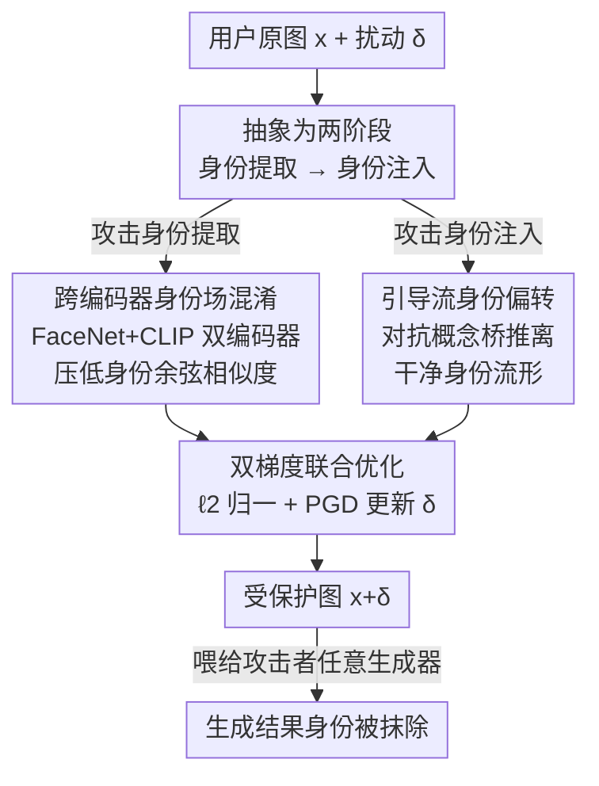

# No Way To Steal My Face: Proactive Defense Against Identity-Preserving Personalized Generation

**会议**: CVPR 2026  
**论文**: [CVF Open Access](https://openaccess.thecvf.com/content/CVPR2026/html/Xiong_No_Way_To_Steal_My_Face_Proactive_Defense_Against_Identity-Preserving_CVPR_2026_paper.html)  
**领域**: AI安全 / 隐私保护 / 扩散模型对抗防御  
**关键词**: 人脸隐私、主动防御、个性化生成、对抗扰动、扩散模型

## 一句话总结
针对扩散模型"个性化人脸生成"被滥用盗脸的问题，本文提出 IDGuardian——把个性化流程抽象成"身份提取 + 身份注入"两个阶段，同时用跨编码器身份场混淆和引导流身份偏转两套对抗扰动把两阶段都打掉，从而第一次做到对**训练式**和**免训练**两类个性化方法都通用、且模型无关的人脸身份保护。

## 研究背景与动机

**领域现状**：扩散模型让"身份保持式个性化生成"变得极其强大——只要给一张人脸参考图，模型就能生成各种场景下高保真、且能精确保留这个人身份的图像，被广泛用于数字分身、虚拟试衣等应用。这类方法分两派：**训练式**（DreamBooth、LoRA、Textual Inversion 等）在少量用户图上微调扩散模型，身份保真度高但要 GPU、调参、算力贵；**免训练**（PhotoMaker、IP-Adapter、InstantID、Infinite-ID 等）用预训练身份编码器零样本抽取人脸语义，再通过各种融合策略注入扩散过程，无需改模型参数，因为快、轻、易部署而正在成为主流。

**现有痛点**：这种能力反过来成了隐私噩梦——任何人在社交平台公开的人脸图都可能被采集，未经同意就被合成出"以假乱真"的身份一致内容（冒名、伪造）。已有的主动防御（Anti-DreamBooth、AdvDM、SimAC、ACE 等）几乎都把**训练式个性化当作代理任务**来优化对抗扰动，专门去干扰微调过程对身份特征的编码。但论文发现：一旦换到免训练场景，这些防御**效果断崖式下跌**。

**核心矛盾**：失效来自两个范式鸿沟。其一**个性化流程差异（Pipeline Discrepancy）**：训练式靠微调把身份"内化"进模型权重，免训练靠预训练编码器把身份 embedding 直接"注入"、根本不动模型参数——为微调过程量身定制的扰动在免训练里无处发力。其二**信息融合多样性（Fusion Diversity）**：免训练管线的编码器架构和身份-语义融合方式五花八门（Direct Stack、Cross-Attention、Mixed Attention、Self-Attention 各搞各的），没有统一框架，针对某一种调出来的扰动换个管线就废。

**本文目标**：做出一个**同时**防得住训练式和免训练、且不依赖具体编码器/架构的通用人脸保护扰动。

**切入角度**：作者跳出"针对某种个性化方法"的思路，去找所有个性化方法**共有的最小公共结构**——无论怎么实现，身份要进入生成结果都绕不开两步：先把身份从参考图里**提取**出来，再把它**注入**到生成过程。只要把这两步都破坏，防御就天然跨范式。

**核心 idea**：把个性化抽象成"身份提取 + 身份注入"两阶段，用一套对抗扰动**同时**击穿两阶段——在特征空间让提取出来的身份失真，在采样轨迹上把生成方向从真实身份流形上拽开。

## 方法详解

### 整体框架
IDGuardian 是一个加在用户原图上的、人眼不可察觉的对抗扰动 $\delta$。它的全部出发点是一个观察：再花哨的个性化管线，身份要落进生成图都必经"**身份提取**（编码器从参考图抽身份特征）→ **身份注入**（特征融进扩散去噪过程）"这两步。于是防御不去猜攻击者用的是哪种方法，而是把扰动同时砸向这两步：第一步用**跨编码器身份场混淆**让被保护图抽出来的身份特征和原图尽量不像；第二步用**引导流身份偏转**把扩散采样轨迹从干净身份流形上推开。两路各自算出梯度，再由**双梯度联合优化**用 PGD 把它们融成最终扰动 $\delta$，约束 $\|\delta\|_\infty<\epsilon$ 保证不可见。

威胁模型设定三方：身份持有者（受害者，往公网放人脸）、生成用户（攻击者，用个性化生成盗脸）、防御者（受害者部署）。防御者处于**受限访问**setting——不知道攻击者具体用哪种生成方法，只能改输入图本身。其优化目标写成：

$$\min_{\delta}\ \mathrm{SIM}\big(\mathrm{ID}(x),\ \mathrm{ID}(G(x+\delta))\big)\quad \text{s.t.}\ \|\delta\|_\infty<\epsilon,$$

其中 $\mathrm{ID}(\cdot)$ 是身份特征提取器、$\mathrm{SIM}(\cdot,\cdot)$ 量化身份相似度、$G(\cdot)$ 是任意身份保持生成器。即：让被保护图喂进任何生成器后，产物的身份都偏离原图。

### 关键设计

**1. 跨编码器身份场混淆：在特征空间让"抽出来的脸"不再是这张脸**

这一步针对"身份提取"阶段。痛点是：免训练管线百花齐放，但它们都要靠某个外部身份编码器把脸编码成特征——那就直接在特征空间把这个特征搞坏。具体做法是在两个**互补**编码器的 embedding 空间里，最小化原图 $x$ 与被扰动图 $x+\delta$ 之间的身份相似度。用单一编码器容易过拟合到某种图像域、泛化差，所以作者同时用 FaceNet（专抽人脸身份的几何/局部特征）和 CLIP 图像编码器（抽高层语义身份），让扰动必须"两边都骗过"，从而更鲁棒。身份损失定义为两路余弦相似度之和：

$$L_{ID}=L_{FaceNet}+L_{CLIP},\quad L_{*}=\cos\big(f_{*}(x),\ f_{*}(x+\delta)\big),$$

最小化它就是逼着 $x+\delta$ 在两个身份空间里都"远离"原始身份。这样无论下游用哪种编码器/融合策略，它读到的身份特征本身已被污染，注入进去的就不是真身份了。

**2. 引导流身份偏转：用"对抗概念桥"把去噪轨迹从真身份上拽开**

光打提取还不够稳，作者再补一刀打"身份注入"阶段。出发点是把身份保持式个性化重新解读成扩散里的一座**概念桥（conceptual bridge）**：扩散模型本质在每步沿 score 函数 $\nabla_{x_t}\log p_\theta(x_t)\approx -\tfrac{1}{\sqrt{1-\bar\alpha_t}}\,\epsilon_\theta(x_t,t)$ 把噪声往高似然区推；条件生成下，身份条件 $y$ 带来的方向变化（由 Bayes 拆解）可近似为两次噪声预测之差：

$$\nabla_{x_t}\log p(y\mid x_t)\approx -\tfrac{1}{\sqrt{1-\bar\alpha_t}}\big(\epsilon_\theta(x_t,t,y)-\epsilon_\theta(x_t,t,\varnothing)\big),$$

这条"从无条件分布指向目标身份分布"的位移就是概念桥——它正是身份被注入轨迹的数学体现。作者于是构造一条**反向的对抗概念桥** $S^*$，用对抗身份 $y_{adv}$（从被保护图里抽）和干净身份 $y_{clean}$ 的条件梯度之差，把生成轨迹从干净身份流形上推开：

$$S^*=\nabla_{x_t}\log p(y_{adv}\mid x_t)-\nabla_{x_t}\log p(y_{clean}\mid x_t)\approx -\tfrac{1}{\sqrt{1-\bar\alpha_t}}\big(\epsilon_\theta(x_t,t,y_{adv})-\epsilon_\theta(x_t,t,y_{clean})\big).$$

它**显式建模两个分布之间的位移**，而不是单边地"只往 $y_{adv}$ 推"或"只逃离 $y_{clean}$"——消融显示这两种单边方向都因分布模糊而不稳定，双边差分才稳。这条对抗桥嵌进模型的打分机制，保证整条去噪轨迹被持续推向 $y_{clean}$ 下的低似然区，注入再多真身份也对不上。

**3. 双梯度联合优化：把两路对抗融成一条不可见扰动**

前两步各自给出一个梯度方向，怎么合是个工程问题：身份损失梯度 $\nabla_\delta L_{ID}$ 活在像素域，而对抗概念桥 $S^*$ 算在隐空间 score 域、维度对不上。作者先把 $S^*$ 上采样并通道对齐到像素域得到 $S^*_{up}$，再把两路梯度各做 $\ell_2$ 归一化以平衡贡献，合成总梯度：

$$\text{total\_grad}\leftarrow \frac{\nabla_\delta L_{ID}}{\|\nabla_\delta L_{ID}\|_2}-\frac{S^*_{up}}{\|S^*_{up}\|_2},$$

然后用投影梯度下降（PGD）一步步更新扰动 $\delta\leftarrow\delta-\alpha\cdot\mathrm{sign}(\text{total\_grad})$，并把 $\|\delta\|_\infty$ 钳在 $\epsilon=8/255$ 内保证不可见。归一化这步很关键——不归一两路梯度量级悬殊，会被其中一路主导，等于退化成单阶段防御。整套优化是**逐图、免训练**的（不像 IDProtector 要预训一个噪声生成器），所以既通用又轻。

### 损失函数 / 训练策略
代理模型用 IP-Adapter SDXL Plus Face（SDXL 主干 + CLIP 图像编码器），另测 SD 1.5 变体验证迁移。PGD 文本 prompt 固定为 "A photo of a person"，扰动预算 $\epsilon=8/255$、学习率 $\alpha=0.005$、最多 200 步（损失前 100 步快速下降、200 步后基本收敛，再加步数收益甚微）。单卡 RTX A6000(48G)。值得注意：只在单个白盒 SDXL 上优化，就能迁到未见的黑盒管线。

## 实验关键数据

数据集 VGGFace2（主）与 CelebA-HQ（跨数据集），各选 50 个身份。评测三类指标：**ISM↓**（ArcFace/FaceNet/VGG-Face 三者平均身份相似度，越低保护越好）、**视觉质量** PSNR/SSIM、**识别可用性** FaceQNet/MagFace。对比 5 个代表性主动防御，跨 7 个主流个性化管线（含训练式 DreamBooth、InfiniteYou 与免训练 IP-Adapter、Blip-Diffusion、InfiniteID、PhotoMaker 等），生成主干覆盖 SD 1.5 / SDXL / FLUX。

### 主实验（身份保护，节选 Table 1，ISM↓）

| 方法 | IP-Adapter | IP-Ada+XL | Blip-Diffu | InfiniteID | DreamBooth | InfiniteYou |
|------|-----------|-----------|-----------|-----------|-----------|------------|
| 无保护 | 0.382 | 0.582 | 0.336 | 0.675 | 0.525 | 0.673 |
| Anti-DreamBooth | 0.307 | 0.548 | 0.271 | 0.620 | 0.433 | 0.594 |
| AdvDM | 0.286 | 0.398 | 0.260 | 0.542 | 0.337 | 0.563 |
| IDProtector | 0.291 | 0.425 | 0.263 | 0.603 | 0.402 | 0.541 |
| **IDGuardian** | **0.036** | **0.126** | **0.220** | **0.444** | **0.336** | **0.301** |

IDGuardian 在所有管线上都把身份相似度压到最低，且对训练式（DreamBooth/InfiniteYou）和免训练同时有效——这正是已有 baseline 做不到的"跨范式通用"。

### 质量与效率（Table 2）

| 方法 | PSNR↑ | SSIM↑ | Time(s) |
|------|------|------|---------|
| Anti-DreamBooth | 31.63 | 0.701 | 312.1 |
| AdvDM | 30.76 | 0.735 | 55.3 |
| IDProtector-PGD | 32.49 | 0.840 | 4089 |
| IDProtector | 32.10 | 0.805 | **0.42** |
| **IDGuardian** | **32.19** | **0.842** | 47.0 |

IDGuardian 在抑制身份的同时还保住了最高的 SSIM(0.842) 和有竞争力的 PSNR，耗时 47s——比逐图 PGD 的 IDP-P(4089s) 快近百倍。IDP 本体只要 0.42s 是因为它预训了一个噪声生成器（前期训练成本另算），泛化也受限。

### 消融实验（Table 4，ISM↓，节选）

| 配置 | IP-Adapter | IP-Ada+XL | InfiniteYou | 说明 |
|------|-----------|-----------|------------|------|
| 仅 CLIP | 0.243 | 0.217 | 0.531 | 单编码器身份损失 |
| 仅 FaceNet | 0.246 | 0.222 | 0.531 | 单编码器身份损失 |
| CLIP+FaceNet | 0.175 | 0.167 | 0.477 | 双编码器混淆 |
| 仅 $G_{adv}$ | 0.044 | 0.144 | 0.307 | 单边推向对抗身份 |
| 仅 $G_{clean}$ | 0.049 | 0.138 | 0.314 | 单边逃离干净身份 |
| **完整模型** | **0.036** | **0.126** | **0.301** | 双编码器 + 对抗概念桥 |

### 关键发现
- **两阶段缺一不可**：只做跨编码器混淆（CLIP+FaceNet）已能把 IP-Adapter 从 0.382 压到 0.175，但补上对抗概念桥后骤降到 0.036——身份注入这一刀贡献最大、是把防御从"还能认出"推到"基本认不出"的关键。
- **双编码器优于单编码器**：CLIP 或 FaceNet 单用都只到 ~0.24，合用降到 0.175，语义+局部互补确实更难骗过去。
- **双边差分优于单边引导**：仅 $G_{adv}$(0.044) 或仅 $G_{clean}$(0.049) 都略逊于显式建模位移的完整版(0.036)，且作者指出单边方向因分布模糊而不稳定。
- **鲁棒性**（Table 3）：面对 JPEG 压缩、高斯模糊、高斯噪声乃至专门破防的 Impress 攻击，IDGuardian 的 ISM 仍维持在低位（如 IP-Adapter 上 JPEG/Blur/Noise/Impress 后仍 0.13~0.22），防御不易被后处理洗掉。
- **黑盒迁移**：单白盒 SDXL 训练即可迁到未见黑盒管线、不同生成主干（SD1.5/SDXL/FLUX）、CelebA-HQ/LFW 跨数据集，乃至 Seedream 4.0、Qwen-Image、Kling-AI 等商业 API。

## 亮点与洞察
- **"抽象出公共结构再打"是这篇最聪明的地方**：不追着每种个性化方法做适配，而是抓住"提取+注入"这个所有方法都绕不开的最小公共骨架，让防御天然跨范式——这是它能同时治训练式和免训练的根本原因，思路可迁移到任何"实现五花八门但流程同构"的攻防场景。
- **把"身份注入"重新解读成扩散里的概念桥**很有启发：既然身份条件本质是 score 函数的一段定向位移，那"反着造一段位移"就能精准抵消，比起在像素/特征上盲目加噪更有的放矢，且 $S^*$ 用 $\epsilon(x_t,t,y_{adv})-\epsilon(x_t,t,y_{clean})$ 的差分形式优雅地消掉了无条件项。
- **双边差分比单边更稳**是个可复用的细节：当你想"推离 A 同时趋向 B"，显式建模 A→B 的位移往往比单独优化"远离 A"或"靠近 B"更稳定，避免分布模糊导致的优化抖动。

## 局限与展望
- **依赖代理模型抽对抗身份 $y_{adv}$**：引导流偏转要在某个白盒扩散主干上算噪声差，虽展示了到黑盒/商业 API 的迁移，但若攻击者用的注入机制与代理差异极大（如纯 Self-Attention 的 KV-Edit 类），跨度更大时效果是否仍稳，正文主表未充分覆盖。
- **不可见性与强度的 trade-off 仍在**：$\epsilon=8/255$ 是网格搜索折中，更大扰动会出伪影、更小则抑制不足；对高分辨率或对画质极敏感的应用，这个预算下的保护强度上限值得进一步评估。
- **自适应攻击只测了 Impress 一种**：真实对手可能针对"两阶段对抗"的已知结构设计更强的去扰动/反演攻击，长期的攻防博弈鲁棒性需要更多对抗性评测。
- **评测以相似度指标为主**：ISM 下降不完全等于"人类绝对认不出"，虽有用户研究和 GPT 评测佐证，但身份保护的安全语义边界仍偏经验。

## 相关工作与启发
- **vs Anti-DreamBooth / AdvDM / SimAC / ACE**：这些都以训练式个性化为代理任务优化扰动，专攻微调过程，换到免训练范式因 pipeline 差异与融合多样性而大幅失效；本文用"提取+注入"双阶段抽象，做到训练式与免训练通用。
- **vs IDProtector**：同样关注免训练场景、靠跨多编码器特征对齐来破防，但它依赖多个编码器特定特征、绑定具体模型、架构复杂，且难迁到训练式；本文逐图免训练、模型无关，且额外用对抗概念桥攻击注入阶段，泛化与效率更好。
- **vs 概念桥/分布传输（如 Dual Diffusion Implicit Bridges）**：原工作用桥做分布间的生成传输，本文反其道——构造一条**对抗**概念桥来主动破坏身份保持，把生成式工具转成防御式武器，是有意思的"借力打力"。

## 评分
- 新颖性: ⭐⭐⭐⭐⭐ 首个对训练式+免训练个性化通用、模型无关的人脸主动防御，"两阶段抽象 + 对抗概念桥"切入角度新颖。
- 实验充分度: ⭐⭐⭐⭐⭐ 7 管线 × 多主干 × 多数据集 + 鲁棒性/自适应/黑盒商业 API/人类与 GPT 评测，覆盖面广、消融到位。
- 写作质量: ⭐⭐⭐⭐ 动机与方法推导清晰，score/概念桥的数学讲得明白；个别公式排版与缩写较密集。
- 价值: ⭐⭐⭐⭐⭐ 直击"盗脸"这一现实隐私痛点，跨范式通用且轻量，落地价值高。

<!-- RELATED:START -->

## 相关论文

- [\[CVPR 2026\] DeepProtect: Proactive Face-Swapping Defense using Identity Blending and Attribute Distortion](deepprotect_proactive_face-swapping_defense_using_identity_blending_and_attribut.md)
- [\[CVPR 2026\] Bridging Privacy and Provenance: Traceable Virtual Identity Generation](bridging_privacy_and_provenance_traceable_virtual_identity_generation.md)
- [\[CVPR 2026\] Reinforcement-Guided Synthetic Data Generation for Privacy-Sensitive Identity Recognition](reinforcement-guided_synthetic_data_generation_for_privacy-sensitive_identity_re.md)
- [\[CVPR 2026\] UniDef: Universal Defense Against Unauthorized Image Manipulation](unidef_universal_defense_against_unauthorized_image_manipulation.md)
- [\[CVPR 2026\] GROW: Watermark Generation with Progressive Guidance for Diffusion Models](grow_watermark_generation_with_progressive_guidance_for_diffusion_models.md)

<!-- RELATED:END -->
