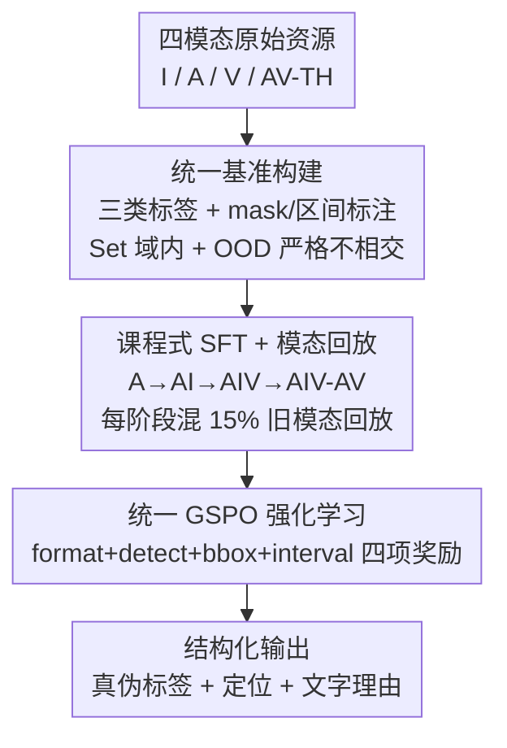

# Omni-Fake: Benchmarking Unified Multimodal Social Media Deepfake Detection

**会议**: CVPR 2026  
**arXiv**: [2605.01638](https://arxiv.org/abs/2605.01638)  
**代码**: [项目主页](https://tianxiao1201.github.io/omni-fake-project-page/)  
**领域**: AI安全 / 深度伪造检测 / 多模态  
**关键词**: deepfake检测、多模态benchmark、OOD泛化、检测-定位-解释、强化学习

## 一句话总结
本文构建了首个覆盖图像/音频/视频/音视频说话头四模态、含 100 万+ 训练样本和 20 万+ 完全不相交 OOD 样本、并统一标注"检测-定位-解释"三任务的社交媒体深伪基准 Omni-Fake，同时给出一个基于 Qwen2.5-Omni-7B、用"课程式 SFT + GSPO 强化学习"训练的统一检测器 Omni-Fake-R1，在四模态的检测、定位、解释和跨生成器泛化上全面超越单模态 SOTA。

## 研究背景与动机
**领域现状**：生成式 AI（Sora、Kling、WanX 等）已经能产出带同步音频的近照片级视频，社交平台时间线上充斥着图像、音频、视频、说话头等多种模态的伪造内容。但现有深伪检测的数据集和方法大多还停留在单模态、人脸换脸、二分类"真/假"的旧范式。

**现有痛点**：作者指出三个具体短板。其一，**基准落后于真实世界**——主流数据集用简化的生成流水线和过时的合成模型，覆盖不了近期生成器、多平台内容格式或多轮对抗攻击，也极少提供严格的多模态 OOD 评测协议，导致模型只学到表层伪影、换个新生成器就失效。其二，**统一多模态建模缺位**——绝大多数检测器在单模态或成对模态上分别训练，没有一个框架能同时处理单模态和多模态输入，跨模态推理脆弱、部署到不同平台时输出不一致。其三，**决策过程不透明**——主流方法默认输出二分类标签，不揭示伪造区域、跨模态不一致或判定理由；检测、定位、解释由相互独立的模块处理，缺乏跨空间/时间/语义维度的一致性校验，对内容审核和取证价值有限。

**核心矛盾**：真实社交媒体的伪造是"多模态 + 多生成器 + 重后处理"的，而现有基准是"单模态 + 少生成器 + 干净分布"的，二者之间存在系统性的分布鸿沟；同时检测、定位、解释三件事被人为割裂，缺少能同时给出"是不是假、假在哪、为什么假"的统一评测与模型。

**本文目标**：拆成两个子问题——（1）造一个能逼真衡量真实世界鲁棒性与跨模态泛化的统一多模态基准；（2）训一个端到端联合做检测-定位-解释的统一检测器。

**切入角度**：把四模态拉到**同一套标签空间和同一套"检测-定位-解释"标注协议**下，并刻意切出一个生成器/说话人/内容/后处理流水线全部与训练集不相交的 OOD 划分，从而把"是否泛化到未见生成器"做成可测量的事；模型侧则借助统一全模态 MLLM（Qwen2.5-Omni）的共享语义空间，让模型依赖语义和跨模态不一致而非生成器特定伪影。

**核心 idea**：用"统一四模态基准 + 不相交 OOD 划分 + 检测-定位-解释三任务协议"替代碎片化的单模态二分类基准，并用"课程式模态回放 SFT + 带结构化奖励的 GSPO 强化学习"把一个 MLLM 训成跨四模态一致、可解释的统一检测器。

## 方法详解

### 整体框架
Omni-Fake 包含两个部分：**基准**（Omni-Fake-Set 域内 + Omni-Fake-OOD 域外）和**统一检测器** Omni-Fake-R1。基准侧，整套数据在四模态（图像 I、音频 A、通用视频 V、音视频说话头 AV-TH）上统一三类标签（真 REAL / 部分篡改 TAMPERED / 全合成 FULL_SYNTHETIC，说话头用真/全合成二分类），并尽量提供像素级 mask 和时间区间标注，从而让检测、定位、解释三任务能在同一份数据上联合评测；OOD 划分则保证其生成器家族、说话人、内容、后处理流水线与训练集**严格不相交**。模型侧，Omni-Fake-R1 以 Qwen2.5-Omni-7B 为骨干，对任意单输入产出一个**结构化三元组**：全局真伪标签、空间或时间定位、自然语言理由；训练分两阶段——先用课程式模态回放 SFT 让模型逐模态学会共享表示和输出格式，再用统一 GSPO 强化学习直接对齐"检测-定位-解释"的任务级指标。

### 关键设计

**1. Omni-Fake 基准构建：四模态统一标签 + 严格不相交的 OOD 划分**

这一项直击"基准落后于真实世界、缺多模态 OOD 协议"的痛点。Omni-Fake-Set 收录 79 万+ 图像、21 万+ 视频、12 万+ 音频、1.5 万+ 说话头，来自 30+ 种生成与篡改方法；Omni-Fake-OOD 收录 10 万图像、3K 视频、10 万音频、8K 说话头。关键在于两个划分**在底层内容、说话人、数据分布、篡改流水线、生成模型家族上完全不相交**——OOD 里出现的任何伪造方法都不在 Set 里（例如图像 Set 用 FLUX.1-dev/Kandinsky3/StyleGAN3，OOD 换成 GPT-4o/Ideogram3.0/Nano Banana；视频 Set 用 CogVideoX/HunyuanVideo，OOD 换成 Sora/Pika/Gen3）。这样"换个新生成器还能不能测出来"就被做成了一个可量化的泛化实验，而不是靠同分布测试集刷高分。

作者还从三个角度验证数据质量并给出量化证据：**语义一致性**（Set 与 OOD 在每个模态上真/部分篡改/全合成的标签比例严格对齐，避免类别失衡带来的虚假增益）；**生成器多样性**（每模态混合多个开源与商用合成/编辑流水线，家族尽量分到不同划分）；**感知质量**（用 FID/FVD/FAD 等 Fréchet 距离、BRISQUE/PESQ 等无参考质量、人类 MOS 和人类真假判别准确率 HDA 共同衡量）。Table 3 显示 Set 普遍距离更低、MOS 更高，而 OOD 质量相当但多数模态更具挑战性——这正是 OOD 该有的样子：足够真实但更难。

**2. 检测-定位-解释统一协议：把三件割裂的事压进同一份标注与同一次推理**

针对"决策不透明、检测/定位/解释相互独立"的痛点，Omni-Fake 把三任务绑在同一份标注里：图像/视频的篡改区域给像素级 mask（可导出 bbox），音频/视频的伪造段给时间区间，并要求模型在一次推理里输出"标签 + 定位 + 理由"的结构化三元组。说话头因为最贴近假冒和诈骗，聚焦身份驱动和唇形驱动的人脸生成，用真/全合成二分类；部分编辑的说话头则归到通用视频设定下做细粒度时空定位。这个协议让"假在哪、为什么假"不再是事后拼接的独立模块，而是和"是不是假"一起被评测和优化，跨空间/时间/语义维度天然带一致性约束。

**3. 课程式 SFT + 模态回放：逐模态解锁、用少量回放防灾难性遗忘**

如果一次性把四模态混在一起做标准对数似然训练，数据量大的模态会盖过、冲掉早学的技能，造成任务干扰、指标难优化。本文改成**四阶段课程**，每次只加一个模态，顺序为音频 → 图像 → 视频 → 说话头（A → AI → AIV → AIV-AV）。每个阶段把新模态的完整训练集与**此前所有已见模态各 15% 的回放子集**混合训练。这个朴素调度以很低开销防住了灾难性遗忘，又让后加入的模态能复用早期学到的共享表示，实现跨模态正向迁移。消融显示：单模态 SFT 检测强但无法统一成一个模型，全混 SFT 受模态失衡拖累，课程式 SFT 在检测上持平/略升、定位与 OOD 最好；回放比例扫描显示 <5% 防不住遗忘、30% 又妨碍学新模态甚至负迁移，10–15% 最优，故全程取 15%。

**4. GSPO 统一强化学习与四项结构化奖励：直接对齐"检测-定位-解释"指标**

课程式 SFT 给了好起点，但它优化的是 next-token 似然，而非作者真正关心的真伪/定位/解释质量。于是在 SFT checkpoint 之上加一阶段统一 GSPO（Group Sequence Policy Optimization）强化学习：对每个输入采样多个回复，用一个标量"检测-定位-解释"奖励打分，再用组内相对优势配合 KL 惩罚（约束在 SFT 模型附近）更新策略，目标为

$$J_{\text{GSPO}}(\theta)=\mathbb{E}_{x,\{y_i\}}\left[\frac{1}{G}\sum_{i=1}^{G}\frac{1}{|y_i|}\sum_{t=1}^{|y_i|}\min\big(s_{i,t}(\theta)\hat{A}_{i,t},\ \mathrm{clip}(s_{i,t}(\theta),1-\epsilon,1+\epsilon)\hat{A}_{i,t}\big)\right]$$

其中 $\hat{A}_{i,t}$ 是 token 级优势、$s_{i,t}(\theta)$ 是重要性比率（精确定义沿用 GSPO 原文，⚠️ 以原文为准）。奖励是四项加权和：

$$r(x,y)=\lambda_{\mathrm{fmt}}r_{\mathrm{fmt}}+\lambda_{\mathrm{acc}}r_{\mathrm{acc}}+\lambda_{\mathrm{bbox}}r_{\mathrm{bbox}}+\lambda_{\mathrm{int}}r_{\mathrm{int}}$$

四项各有讲究：**格式奖励** $r_{\mathrm{fmt}}$ 用确定性解析器校验回复里恰好一对 `<think>` 和一对 `<answer>` 标签、并能从 answer 块抽出合法标签和良构的 `<box>`/`<interval>` 段，全过给 1 否则给 0，从而保证推理可解析、标签/mask/区间能被其它奖励项可靠提取；**检测奖励** $r_{\mathrm{acc}}$ 因为篡改样本通常比真/全合成更难辨，给正确 TAMPERED 更大正奖励、给正确 REAL/FULL_SYNTHETIC 较小奖励、错标记 0，避免优化被简单类别主导、逼出三类均衡的性能；**空间定位奖励** $r_{\mathrm{bbox}}$ 对篡改样本用预测框与真值框的 IoU，对真/全合成样本则在"不输出框"时给 1、否则给 0；**时间定位奖励** $r_{\mathrm{int}}$ 对带伪造区间的音频/视频，在时间轴上做一维 IoU，先对预测与真值区间做二分匹配再对匹配对平均 IoU，同样让真/全合成样本只在"不乱输出区间"时得分。这套奖励把"该有的地方精确定位、不该有的地方不乱报"同时写进了优化目标。

## 实验关键数据

### 主实验（Omni-Fake-Set 验证集，四模态）

| 模态 | 方法 | 检测 Acc | 检测 F1 | 定位 IoU | 定位 F1 |
|------|------|---------|---------|---------|---------|
| 图像 | SIDA | 89.88 | 88.15 | 46.27 | **56.10** |
| 图像 | FakeVLM | 90.34 | 89.21 | – | – |
| 图像 | **Omni-Fake-R1** | **91.92** | **90.58** | **47.06** | 51.63 |
| 视频 | DeMamba | 84.22 | 82.19 | – | – |
| 视频 | Qwen2.5-VL-7B | 76.45 | 74.19 | 33.14 | 35.98 |
| 视频 | **Omni-Fake-R1** | **89.84** | **88.29** | **40.63** | **43.35** |
| 音频 | SafeEar | 81.62 | 79.27 | – | – |
| 音频 | FakeSound | 75.41 | 73.92 | 26.71 | 29.58 |
| 音频 | **Omni-Fake-R1** | **92.13** | **90.47** | **45.92** | **47.58** |
| AV-TH | RealForensics | 88.17 | 86.73 | – | – |
| AV-TH | **Omni-Fake-R1** | **96.18** | **95.54** | – | – |

一个统一模型在四模态上同时拿到检测最优（说话头 F1 95.54 大幅领先专用 AV/唇形检测器），定位上除图像 F1 略低于专做定位的 SIDA 外其余领先。

### OOD 泛化（Omni-Fake-OOD）

| 模态 | 方法 | 检测 Acc | 检测 F1 | 定位 IoU | 定位 F1 |
|------|------|---------|---------|---------|---------|
| 图像 | SIDA | 74.24 | **77.60** | 36.32 | 41.67 |
| 图像 | **Omni-Fake-R1** | **79.25** | 77.71 | **37.54** | **43.63** |
| 视频 | DeMamba | 78.93 | 74.74 | – | – |
| 视频 | **Omni-Fake-R1** | **85.96** | **82.53** | **34.20** | **39.51** |
| 音频 | SafeEar | 71.29 | 68.96 | – | – |
| 音频 | **Omni-Fake-R1** | **83.85** | **82.10** | **31.93** | **33.86** |
| AV-TH | RealForensics | 72.96 | 71.62 | – | – |
| AV-TH | **Omni-Fake-R1** | **86.52** | **86.20** | – | – |

所有模态从 Set 到 OOD 都掉点，但纯检测基线掉得最狠（尤其在部分篡改上），VLM 较稳但定位损失大，Omni-Fake-R1 在四模态 OOD 上全面最优、AV 任务增益尤其明显——印证统一协议 + 多模态课程让模型靠语义/跨模态不一致而非生成器特定伪影做判断。

### 鲁棒性（Omni-Fake-OOD + 信道破坏，按模态平均）

| 设置 | 检测 Acc | 检测 F1 | 定位 IoU | 定位 F1 |
|------|---------|---------|---------|---------|
| 干净 (Ours) | 92.52 | 91.22 | 44.54 | 47.52 |
| JPEG 80 | 91.57 | 89.83 | 41.41 | 43.76 |
| JPEG 70 | 89.92 | 88.94 | 40.05 | 41.29 |
| Resize 0.5 | 90.28 | 88.65 | 40.94 | 40.32 |
| Gaussian 10 | 88.46 | 87.72 | 39.67 | 41.85 |

在 JPEG 压缩、模糊、噪声、裁剪缩放、编码重压等模拟真实社交信道的破坏下，检测 F1 和定位 IoU 整体保持高位，说明 SFT + GSPO 训练带来对真实信道效应的鲁棒性。

### 消融实验

| 训练策略 | 模态 | 检测 Acc | 检测 F1 | 定位 IoU | 定位 F1 |
|----------|------|---------|---------|---------|---------|
| 单模态 SFT | 图像 | 83.76 | 84.95 | 41.15 | 45.83 |
| 全混 SFT | 图像 | 79.29 | 78.75 | 36.86 | 39.42 |
| 课程式 SFT | 图像 | 87.79 | 87.86 | 45.61 | 43.94 |
| **+ 统一 GSPO RL** | 图像 | **91.92** | **90.58** | **47.06** | **51.63** |
| 单模态 SFT | 音频 | 79.73 | 78.42 | 37.36 | 37.08 |
| 全混 SFT | 音频 | 71.96 | 69.81 | 25.53 | 24.71 |
| 课程式 SFT | 音频 | 88.45 | 86.27 | 42.01 | 43.58 |
| **+ 统一 GSPO RL** | 音频 | **92.13** | **90.47** | **45.92** | **47.58** |

### 关键发现
- **全混 SFT 最差**：直接把四模态混在一起训练，会被模态失衡拖累（音频检测 Acc 仅 71.96，比单模态 SFT 的 79.73 还低近 8 个点），印证"课程 + 回放"必要性。
- **课程式 SFT 是主力增益**：从全混到课程式，音频检测 Acc 从 71.96 跳到 88.45，定位 IoU 从 25.53 到 42.01；课程式 SFT 已在定位和 OOD 上全面领先。
- **GSPO RL 进一步打磨且主要塑造解释**：在课程式 SFT 之上加 GSPO，检测和时空定位再涨（图像定位 F1 43.94→51.63）；而"RL-only"（不做课程 SFT 直接 GSPO）显著劣于任何 SFT 模型，说明 RL 必须建在好的 SFT 起点上。消融解释项还发现，去掉解释相关奖励项会大幅降低 CSS 而检测几乎不变——RL 主要在塑造理由而非标签。
- **回放比例甜区 10–15%**：<5% 防不住遗忘，30% 妨碍学新模态甚至负迁移，故全程取 15%。

## 亮点与洞察
- **"严格不相交 OOD"是这篇基准最硬的设计**：把生成器家族、说话人、内容、后处理全部错开，让"泛化到未见生成器"从一句口号变成可量化实验；很多旧基准的"OOD"只是换了张测试集，本文这种做法值得迁移到任何想测真实泛化的领域。
- **三任务统一协议带来一致性约束**：检测、定位、解释绑在同一份标注和同一次推理里，跨空间/时间/语义维度天然要求自洽，比事后拼三个独立模块更可信，也更适合内容审核与取证。
- **类别加权检测奖励很巧**：因为 TAMPERED 比 REAL/FULL_SYNTHETIC 更难，给对它更大奖励，直接对抗"优化被简单类主导"的常见病——这种"难类加权 RL 奖励"可复用到任何类别难度不均的检测任务。
- **"不该有就别报"也被显式奖励**：空间/时间定位奖励对真/全合成样本要求"预测无框/无区间才得分"，把假阳性抑制写进奖励，是个容易被忽视但很实用的细节。
- **CSS 可作解释质量的自动代理**：人类专家评分与 CSS 高度相关，意味着后续可以用 CSS 廉价替代部分人工评估。

## 局限性 / 可改进方向
- **作者承认的局限**：说话头只做了真/全合成二分类，部分编辑的说话头被并入通用视频设定，专门的细粒度说话头篡改定位仍未充分覆盖。
- **依赖大模型骨干**：Omni-Fake-R1 建在 Qwen2.5-Omni-7B 上，7B 级模型的推理开销对实时社交平台审核是否可行、能否蒸馏到轻量模型，文中未讨论。
- **奖励权重与 GSPO 细节留在附录**：四项奖励权重 $\lambda$ 和 GSPO 的精确优势/比率定义需查原文/附录，正文不足以完全复现训练。
- **"未见生成器"仍是固定快照**：OOD 虽与训练集不相交，但仍是 2026 年前后的生成器；面对更新一代生成模型，基准需要持续更新才能保持挑战性。
- **改进思路**：可探索把说话头的部分篡改定位单列任务、引入更轻量的统一检测器、以及把 GSPO 奖励扩展到跨模态联合输入（真正的多模态融合检测，而非四模态分别处理）。

## 相关工作与启发
- **vs SIDA / So-Fake（单模态社交图像基准）**：它们捕获真实世界图像伪造且标注丰富，但局限在视觉单模态；本文扩到四模态、加严格不相交 OOD、统一检测-定位-解释协议，是"训练就绪的四模态语料"而非单模态集合。
- **vs LOKI（多模态评测套件）**：LOKI 用 QA 式问答评测多模态模型的检测与解释，但只是评测套件、规模约 1 万、无训练数据；Omni-Fake 提供百万级训练就绪语料 + 像素/时间标注 + 完整 OOD 划分。
- **vs DFDC / FakeAVCeleb（视频/AV 基准）**：旧 AV 基准分析时序操纵但很少建模音视频一致性、无统一三任务标注；本文显式把音视频不一致和三任务纳入同一协议。
- **vs 传统单模态检测器（CnnSpot/AASIST/LipForensics 等）**：它们各管一摊、靠生成器特定伪影，OOD 掉点最狠；Omni-Fake-R1 用一个统一 MLLM 靠语义/跨模态不一致判断，跨模态和 OOD 都更稳。
- **vs RLHF / GRPO 等偏好优化**：RLHF 对齐人类偏好，本文走 RLVR（可验证奖励）路线，用客观的检测/定位/格式任务级信号做奖励，更适合有明确正确答案的取证任务。

## 评分
- 新颖性: ⭐⭐⭐⭐⭐ 首个四模态统一深伪基准 + 严格不相交 OOD + 检测-定位-解释统一协议，外加 RLVR 驱动的统一检测器，组合很新。
- 实验充分度: ⭐⭐⭐⭐⭐ 四模态主实验、OOD、鲁棒性、SFT 策略/回放比例/GSPO 多维消融、解释的自动+人工评估，覆盖全面。
- 写作质量: ⭐⭐⭐⭐ 动机三痛点清晰、奖励设计讲得细致；部分关键超参（奖励权重、GSPO 定义）留到附录，正文略欠自足。
- 价值: ⭐⭐⭐⭐⭐ 为真实世界多模态虚假信息取证提供了可训练、可泛化评测的统一底座，基准 + 模型双交付，实用性高。

<!-- RELATED:START -->

## 相关论文

- [\[CVPR 2026\] FVBench: Benchmarking Deepfake Video Detection Capability of Large Multimodal Models](fvbench_benchmarking_deepfake_video_detection_capability_of_large_multimodal_mod.md)
- [\[CVPR 2026\] UniGame: Turning a Unified Multimodal Model Into Its Own Adversary](unigame_turning_a_unified_multimodal_model_into_its_own_adversary.md)
- [\[CVPR 2026\] DFD-HR: Generalizable Deepfake Detection via Hierarchical Routing Learning](dfd-hr_generalizable_deepfake_detection_via_hierarchical_routing_learning.md)
- [\[CVPR 2026\] Tutor-Student Reinforcement Learning: A Dynamic Curriculum for Robust Deepfake Detection](tutor-student_reinforcement_learning_a_dynamic_curriculum_for_robust_deepfake_de.md)
- [\[CVPR 2026\] DeepfakeImpact: A Two-Stage Benchmark with Real-World Impact in Deepfake Detection](deepfakeimpact_a_two-stage_benchmark_with_real-world_impact_in_deepfake_detectio.md)

<!-- RELATED:END -->
