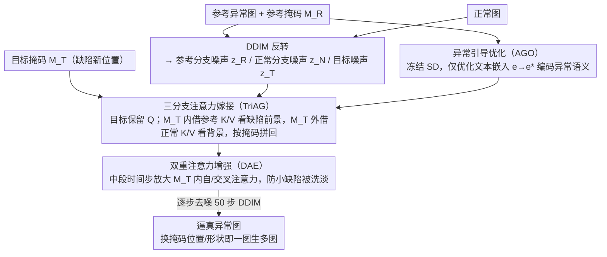

# One-to-More: High-Fidelity Training-Free Anomaly Generation with Attention Control

**会议**: CVPR 2026  
**arXiv**: [2603.18093](https://arxiv.org/abs/2603.18093)  
**代码**: 无  
**领域**: AI安全 / 异常检测  
**关键词**: 异常生成, 训练免微调, 自注意力嫁接, 扩散模型, 工业异常检测

## 一句话总结

O2MAG 提出一种无需训练的少样本异常生成方法，通过三分支扩散过程中的自注意力嫁接(TriAG)从单张参考异常图像合成更多逼真异常，配合异常引导优化(AGO)对齐文本语义和双重注意力增强(DAE)确保掩码区域完整填充，在 MVTec-AD 下游异常检测任务中显著优于现有方法。

## 研究背景与动机

1. **领域现状**：工业异常检测面临数据不平衡问题——正常图像充足但异常图像稀缺。现有异常合成方法包括训练型（DreamBooth 微调、文本反转学习嵌入）和无训练型方法。
2. **现有痛点**：训练型方法计算和存储开销大，且在少样本下容易过拟合；唯一的无训练方法 AnomalyAny 仅操作交叉注意力，无法精确控制异常语义和空间布局，生成的异常不够逼真。
3. **核心矛盾**：Stable Diffusion 训练数据中工业缺陷极为罕见，简单文本提示无法精确描述缺陷语义，导致生成偏离真实异常分布。
4. **本文目标**：利用扩散模型的内在先验，从单张参考异常图像无训练地合成多样且逼真的异常。
5. **切入角度**：自注意力图的 PCA 分析显示异常前景和正常背景在注意力空间中天然分离，可以通过操作自注意力的 K/V 实现跨分支信息传递。
6. **核心 idea**：三分支并行扩散 + 掩码引导的自注意力嫁接，从参考异常分支获取前景缺陷特征，从正常分支获取背景特征。

## 方法详解

### 整体框架

O2MAG 想做的事很具体：手里只有一张带缺陷的参考异常图、一些正常图，以及一个标好缺陷位置的掩码，要在不训练任何参数的前提下，合成出大量"长在不同位置、形态各异、但仍然逼真"的工业缺陷图来喂给下游检测器。它的做法是让三条扩散轨迹同时跑——参考异常分支把那张参考缺陷图 DDIM 反转回噪声、正常图像分支把一张干净图反转回噪声、目标异常分支则从正常噪声起步去生成新图。三条分支共享同一个冻结的 SD，去噪的每一步里，目标分支不自己凭空想缺陷，而是从参考分支"借"前景缺陷特征、从正常分支"借"背景特征，靠掩码决定哪块用谁的。在此之上，AGO 先在推理前把文本嵌入往"异常语义"方向校准一下，DAE 则在去噪中途给掩码区域的注意力加码，保证缺陷不会越生越淡。

### 关键设计

**1. 三分支注意力嫁接 (TriAG)：让目标图"我问、它们答"地拼出缺陷**

最难的一关是：怎样把参考图里那块缺陷的视觉特征搬到目标图的指定位置，又不破坏目标图原本的正常背景。TriAG 的切入点是把自注意力的 Q 和 K/V 分开看——Q 代表"目标图当前在问什么"，K/V 代表"答案从哪张图的内容里取"。于是它保持目标分支自己的 Q 不动，只替换 K 和 V 的来源：在目标掩码 $M_T$ 内部，K/V 改从参考异常分支取，并且只让它查询参考掩码 $M_R$ 圈住的那块前景缺陷；在掩码外部，K/V 改从正常分支取，只查询掩码外的背景。两路注意力输出再按掩码拼回去：

$$\text{Attn}^*_{T} = M_T \odot \text{Attn}_{fg} + (1-M_T) \odot \text{Attn}_{bg}$$

这样目标图就像同时向两个"知情人"提问——缺陷区问参考图、背景区问正常图——拼出一张前景是新缺陷、背景是干净结构的图。它之所以成立，是因为作者对 SD 自注意力做 PCA 可视化时发现异常前景和正常背景在注意力空间里本来就天然分离，所以按掩码切开 K/V 来源不会互相污染，这也是为什么只动 K/V、不碰 Q 就能精确控制内容传递。

**2. 异常引导优化 (AGO)：把文本嵌入从"正常语义"挪到"异常语义"**

光靠嫁接还不够，因为生成时仍要给一句文本条件，而 SD 的训练语料里工业缺陷极其罕见，像 "a photo of cable with bent wire" 这种 prompt 根本编码不出"弯折导线"真正长什么样，文本语义和真实缺陷视觉之间有道鸿沟。AGO 的办法是冻住整个扩散模型、只把这条文本嵌入 $\mathbf{e}$ 当作可学习变量，用参考异常图自身的重建损失把它优化过去：

$$\mathbf{e}^* = \arg\min_{\mathbf{e}} \mathbb{E}\big[\|\epsilon - \epsilon_\theta(x_t, t, \mathbf{e})\|^2\big]$$

优化 500 步、Adam、学习率 $3 \times 10^{-3}$。这一步不改任何网络权重，只是数据驱动地把这条嵌入从正常语义空间往异常语义空间挪，让后续生成有一个对得上真实缺陷外观的文本锚点。它对分类任务帮助尤其大，因为类别区分恰恰依赖准确的异常语义。

**3. 双重注意力增强 (DAE)：别让小缺陷在去噪中途被"洗掉"**

实践中还有个反复出现的失败：掩码圈的缺陷区域太小，去噪过程里很容易被模型当成噪声慢慢抹平，最后生成出微弱甚至不完整的缺陷。DAE 针对的就是这个。它在特定时间步的去噪中，主动放大掩码区域内的自注意力和交叉注意力权重，等于强迫模型对缺陷区"多看几眼"、产生更强响应，从而保证异常把整个掩码区域填满、不至于半途减弱。它只在生成阶段介入、同样不需要训练，是对 TriAG 嫁接结果的一道"补强"。

### 一个完整示例：给一张电缆图新长一处弯折缺陷

以一张正常电缆图 + 一张带"弯折导线"的参考缺陷图为例，走一遍三分支怎么协同：

1. **准备噪声**：参考异常图经 DDIM 反转得到 $z_R$、正常图反转得到 $z_N$，目标分支从一份正常噪声 $z_T$ 起步。
2. **AGO 预热**（推理前一次性）：用参考图把文本嵌入 $\mathbf{e}$ 优化 500 步，得到一条编码了"弯折导线"视觉特征的 $\mathbf{e}^*$。
3. **逐步去噪 + 嫁接**：每一步里目标分支保留自己的 Q，掩码 $M_T$（标在希望长缺陷的新位置）内部从参考分支借 K/V、只看参考掩码 $M_R$ 里的弯折特征，掩码外从正常分支借 K/V、只看干净背景，再按 $M_T$ 拼回 $\text{Attn}^*_T$。
4. **DAE 补强**：在中段若干时间步放大 $M_T$ 内的注意力，确保弯折缺陷被完整生成而非淡出。
5. **输出**：得到一张电缆缺陷长在新位置、背景仍是原本干净结构的逼真异常图；换不同掩码位置/形状即可一图生多图。

### 损失函数 / 训练策略

整条流程无需训练任何网络参数。唯一的优化是 AGO 在推理前对文本嵌入做 500 步轻量优化（Adam，学习率 $3 \times 10^{-3}$）。生成基于 SD v1.5 的 50 步 DDIM 采样，TriAG 与 DAE 都是推理期对注意力的直接操控。

## 实验关键数据

### 主实验

| 方法 | AP-I (检测)↑ | AUC-P (定位)↑ | F1-P (定位)↑ | Accuracy (分类)↑ |
|------|------------|-------------|------------|----------------|
| DFMGAN | 93.5 | 86.7 | 59.2 | - |
| AnomalyDiffusion | 99.3 | 98.9 | 78.2 | - |
| DualAnoDiff | 99.4 | 99.1 | 82.6 | 78.5 |
| SeaS | 99.3 | 98.7 | 79.1 | - |
| **O2MAG** | **99.7** | **99.3** | **84.6** | **90.6** |

O2MAG 在所有指标上全面领先，分类准确率比最佳训练方法高 12.1%。

### 消融实验

| 配置 | AP-I | F1-P | 说明 |
|------|------|------|------|
| Full O2MAG | 99.7 | 84.6 | 完整模型 |
| w/o AGO | 98.9 | 81.2 | 文本嵌入优化的贡献 |
| w/o DAE | 99.3 | 82.4 | 注意力增强的贡献 |
| w/o TriAG 掩码 | 97.5 | 75.8 | 掩码引导是核心 |

### 关键发现

- TriAG 的掩码引导是最关键的组件，没有掩码会导致前景/背景混淆
- AGO 对分类任务提升巨大（+12.1%），因为更准确的异常语义对类别区分至关重要
- 训练免方法首次在下游异常检测中超越训练型方法，说明 SD 的自注意力先验足够强大
- KID 和 IC-LPIPS 指标显示 O2MAG 生成质量和多样性均优

## 亮点与洞察

- **自注意力的异常-正常分离性**：PCA 可视化揭示 SD 自注意力天然编码了前景/背景的语义分离，这一发现可推广到其他编辑任务
- **无训练超越有训练**：证明了精心设计的注意力操控可以超越需要微调的方法，降低了异常合成的门槛
- **三分支并行设计**：通过分离异常源、背景源和目标，实现了精确的区域级控制

## 局限与展望

- AGO 仍需 500 步优化，增加了推理延迟
- 依赖预定义的异常掩码，实际场景中掩码获取可能困难
- 对极小缺陷的生成效果有限
- 未来可结合 SAM 等分割模型自动生成掩码

## 相关工作与启发

- **vs AnomalyAny**: AnomalyAny 只操作交叉注意力，O2MAG 操作自注意力的 K/V 获得更精确控制
- **vs DualAnoDiff**: DualAnoDiff 需要训练缺陷分支，O2MAG 完全无训练
- **vs MasaCtrl**: O2MAG 在此基础上引入三分支和掩码引导，专为异常合成设计

## 评分

- 新颖性: ⭐⭐⭐⭐ 三分支注意力嫁接新颖，但基于已有注意力操控思路
- 实验充分度: ⭐⭐⭐⭐ MVTec 全面评测，多维度指标
- 写作质量: ⭐⭐⭐⭐ 方法描述清晰，可视化充分
- 价值: ⭐⭐⭐⭐ 降低了工业异常合成的训练门槛

<!-- RELATED:START -->

## 相关论文

- [\[ICML 2026\] Training-Free Coverless Multi-Image Steganography with Access Control](../../ICML2026/ai_safety/training-free_coverless_multi-image_steganography_with_access_control.md)
- [\[CVPR 2026\] Your Classifier Can Do More: Towards Balancing the Gaps in Classification, Robustness, and Generation](your_classifier_can_do_more_towards_balancing_the.md)
- [\[CVPR 2026\] Bridging Privacy and Provenance: Traceable Virtual Identity Generation](bridging_privacy_and_provenance_traceable_virtual_identity_generation.md)
- [\[CVPR 2026\] GROW: Watermark Generation with Progressive Guidance for Diffusion Models](grow_watermark_generation_with_progressive_guidance_for_diffusion_models.md)
- [\[CVPR 2026\] Reinforcement-Guided Synthetic Data Generation for Privacy-Sensitive Identity Recognition](reinforcement-guided_synthetic_data_generation_for_privacy-sensitive_identity_re.md)

<!-- RELATED:END -->
