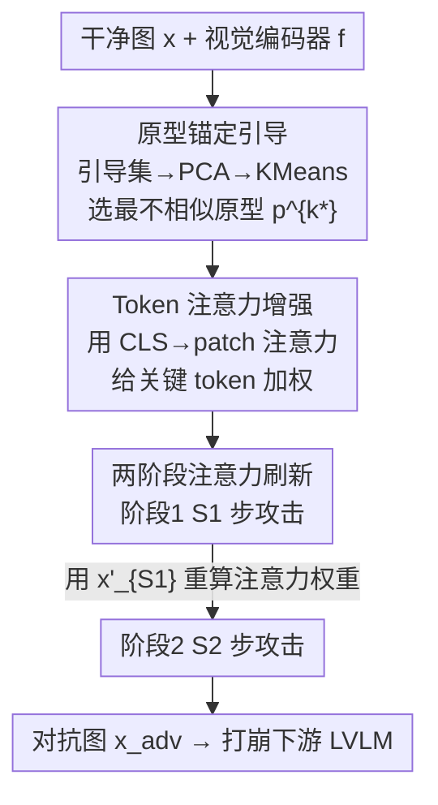

# PA-Attack: Guiding Gray-Box Attacks on LVLM Vision Encoders with Prototypes and Attention

**会议**: CVPR 2026  
**论文**: [CVF Open Access](https://openaccess.thecvf.com/content/CVPR2026/html/Mei_PA-Attack_Guiding_Gray-Box_Attacks_on_LVLM_Vision_Encoders_with_Prototypes_CVPR_2026_paper.html)  
**代码**: https://github.com/hefeimei06/PA-Attack  
**领域**: AI安全 / 对抗攻击 / 多模态VLM  
**关键词**: 灰盒对抗攻击, LVLM, 视觉编码器, 原型引导, 注意力增强

## 一句话总结
针对 LVLM 共享的视觉编码器做灰盒攻击，用「原型锚定引导 + 类别 token 注意力加权 + 两阶段注意力刷新」让小扰动（ε=2/255）就能跨任务通用地打崩模型，平均得分下降率（SRR）达 75.1%，明显超过现有灰盒/黑盒方法。

## 研究背景与动机
**领域现状**：大型视觉语言模型（LVLM）几乎都是「一个共享视觉骨干（多为 CLIP）+ 不同 LLM」的拼装结构。攻击 LVLM 主要有两条路：白盒攻击假设拿到完整模型参数；黑盒攻击靠迁移策略（替代模型、随机裁剪等）。

**现有痛点**：白盒攻击依赖完整梯度，生成的对抗样本过拟合到具体任务、换个下游任务就失效；黑盒攻击靠昂贵的迁移、还往往要用大扰动（如 M-Attack 用 ε=16/255）才勉强见效，既不高效也不隐蔽。即便是已有的灰盒攻击（打视觉编码器），也在效率和效果之间二选一——VT-Attack 要额外的文本 caption 和高迭代次数，AttackVLM-ii 只对 class token 做余弦相似度监督，效果弱。

**核心矛盾**：现有灰盒攻击大多只是「最大化对抗特征与干净特征的差异」，没有方向引导，优化会过拟合到少数几个视觉 token / 属性上（论文 Fig.2d 红线显示少数 token 主导了攻击），导致换到关注不同视觉属性的任务就打不动。同时视觉特征维度极高（CLIP-L/14 是 256×1024）且高度冗余（Fig.2c 显示遮掉 50% token 模型仍大体可用），所有 token 一视同仁地扰动会浪费有限的扰动预算。

**本文目标**：在只访问共享视觉编码器的灰盒设定下，做到「小扰动、低迭代、跨任务通用」的攻击。

**切入角度**：视觉编码器是各 LVLM 的公共组件、参数远少于 LLM，且所有下游任务都依赖它产出的视觉表征——所以攻它既高效又天然有跨任务、跨模型迁移性。

**核心 idea**：给无方向的「最大化差异」补一个稳定的攻击方向（推向一个「最不像」的原型），再把有限扰动预算集中到注意力判定为关键的 token 上，并在攻击过程中刷新这套注意力权重。

## 方法详解

### 整体框架
PA-Attack（Prototype-Anchored Attentive Attack）只攻击 LVLM 的视觉编码器 $f$：给定干净图 $x$，在 $\ell_\infty$ 球 $B_\epsilon(x)=\{x':\|x'-x\|_\infty\le\epsilon\}$ 内找扰动 $\delta$，让 $f(x+\delta)$ 的视觉特征严重偏离 $f(x)$，从而连带打崩接在后面的 LLM。基础攻击目标是最小化干净/对抗特征的逐 token 余弦相似度：$\mathcal{L}_{vision}=-\frac{1}{N}\sum_j \cos(f(x)_j, f(x+\delta)_j)$。

在这个基础上叠三件事：先用一个预先算好的、与当前图最不相似的**原型**给攻击一个稳定方向（解决「没引导导致过拟合少数属性」）；再用类别 token 对各 patch 的注意力当权重，把扰动集中到关键 token（解决「特征冗余、预算浪费」）；最后用两阶段刷新跟踪攻击过程中漂移的注意力。整体是一个两阶段的 PGD 式迭代优化。

### 关键设计

**1. 原型锚定引导：给「最大化差异」一个稳定且通用的方向**

针对「无引导的最大化差异会过拟合到少数属性、换任务就失效」这个痛点，作者不再单纯地把对抗特征推离干净特征，而是给它一个明确的目标——推向一个「覆盖多样视觉属性、且与当前图最不像」的原型。具体做法：从一个和评测集不重叠的引导集 $D_{guide}$（COCO 里随机选 $m=3000$ 张）抽视觉特征存进记忆库 $M$，先用 PCA 保留 top-$w=1024$ 主成分压维，再做 K-Means 聚成 $K=20$ 个簇，每个簇内特征求均值得到一个原型 $p^k=\frac{1}{|S_k|}\sum_{t\in S_k} v_{guide}^t$。攻击某张图时，先算它的特征 $v=f(x)$ 与每个原型的余弦相似度，选**最不相似**的那个作目标：$k^*=\arg\min_k \cos(v, p^k)$。论文 Fig.2b 的观察支撑了这个选法——越远的原型攻击效果越强，最远原型给出的引导最通用。最终把引导项并进损失：

$$\mathcal{L}_{total}=\frac{1}{N}\sum_j\big[-\cos(v_j, v'_j)+\lambda\cdot\cos(v'_j, p_j^{k^*})\big]$$

其中 $v'=f(x+\delta)$，$\lambda$ 平衡两项（取 1.0）。前一项推离干净特征、后一项拉向「最不像」原型，方向不再发散，攻击就能覆盖更多视觉属性、跨任务更稳。

**2. Token 注意力增强：把有限扰动预算砸在关键 token 上**

针对「视觉特征高维且冗余、一视同仁扰动浪费预算」这个痛点，作者用类别 token（CLS）对各 patch 的注意力来判定哪些 token 重要。因为 CLS token 聚合了全局图像信息，它对某个 patch 的注意力就是该 patch 贡献度的可靠指标。在某一层（取中间层）的多头自注意力里，把 CLS 对每个 patch token 的注意力在 $H$ 个头上取平均得到 $a^l=\frac{1}{H}\sum_i a_i^l$，再过一个带温度的 softmax 转成权重：

$$w_j=\mathrm{softmax}(a^l)=\frac{e^{a_j^l/T}}{\sum_{j=1}^{n} e^{a_j^l/T}}$$

温度 $T=1/20$（让权重更尖锐、更集中到高注意力 token）。把 $w_j$ 乘进每个 token 的损失项，得到加权目标：

$$\mathcal{L}=-\frac{1}{N}\sum_j w_j\cdot\big[-\cos(v_j, v'_j)+\lambda\cdot\cos(v'_j, p_j^{k^*})\big]$$

这样优化会优先扰动注意力高（对下游任务真正重要）的 patch，而不是把力气花在冗余 token 上，攻击更高效也更易跨任务泛化。

**3. 两阶段注意力刷新：跟踪攻击过程中漂移的注意力**

针对「攻击会改变注意力分布」这个被前两步忽略的动态问题——论文 Fig.2d 显示对抗图的注意力 $a^l(x')$ 相比干净图 $a^l(x)$ 发生了明显偏移（模型逐渐去关注背景等不鲁棒特征）。如果整个攻击过程都用干净图算出的权重 $w_{s1}$，后期就会优化错 token。于是作者把攻击拆成两阶段：第一阶段用干净图的注意力得到 $w_{s1}=\mathrm{softmax}(a^l\leftarrow f(x))$，按加权损失做 $S_1=50$ 步 PGD 更新 $x'_{i+1}\leftarrow x'_i+\alpha\cdot\mathrm{sign}(\nabla_{x'_i}\mathcal{L})$ 并裁剪回 $\ell_\infty$ 球；第二阶段把第一阶段产物 $x'_{S1}$ 重新喂进编码器、用它的注意力重算 $w_{s2}$，再做 $S_2=100$ 步更新。这样注意力权重始终对齐对抗样本的最新状态，专攻「在对抗过程中真正关键」的 token，进一步提升破坏力。

### 损失函数 / 训练策略
攻击是无训练的优化过程：PGD 式迭代，步长 $\alpha=1/255$，扰动预算 $\epsilon\in\{2/255, 4/255\}$，随机起点 $x'_0=x+\mathrm{Uniform}(-\eta,\eta)$。两阶段共 $S_1+S_2=150$ 步。原型库（PCA+KMeans）离线预算一次即可复用。单张 A6000 即可跑。

## 实验关键数据

### 主实验
在 LLaVA1.5-7B / OF-9B / LLaVA1.5-13B 三个 LVLM、captioning（COCO/Flickr30k）、VQA（TextVQA/VQAv2）、幻觉（POPE）共 5 个数据集上比各灰盒攻击，指标为攻击后性能（越低越好）与平均得分下降率 SRR（越高越好，$\mathrm{SRR}=1-\mathrm{Score}_{adv}/\mathrm{Score}_{clean}$）。下表为 LLaVA1.5-7B、ε=2/255 的代表性结果：

| 攻击方法 | COCO↓ | Flickr30k↓ | TextVQA↓ | POPE↓ | 平均 SRR↑ |
|----------|-------|-----------|----------|-------|-----------|
| Clean（无攻击） | 115.5 | 77.5 | 37.1 | 84.5 | 0.0 |
| VT-Attack | 66.8 | 40.0 | 26.9 | 67.1 | 31.6% |
| AttackVLM-ii | 41.3 | 30.2 | 19.7 | 69.0 | 43.3% |
| VEAttack | 10.8 | 10.7 | 13.8 | 47.5 | 65.2% |
| **PA-Attack（本文）** | **6.1** | **4.7** | **8.3** | **29.6** | **77.1%** |

PA-Attack 在每个模型、每个任务上的平均 SRR 都最好：ε=2/255 时把 COCO 的 CIDEr 从 115.5 打到 6.1。平均 SRR 比最强灰盒 VEAttack 高 11.1%（2/255）/6.7%（4/255），比黑盒裸基线 AttackVLM-ii 高 27.7%/18.1%。

### 消融实验
LLaVA1.5-7B、ε=4/255，PG=原型引导、AE=注意力增强、TS=两阶段刷新，指标 SRR：

| 配置 | 步数 | COCO | TextVQA | VQAv2 | 说明 |
|------|------|------|---------|-------|------|
| Baseline | 100 | 93.8 | 72.8 | 48.4 | 纯最大化差异 |
| +PG | 100 | 95.5 | 76.3 | 52.2 | 原型引导稳定提升 |
| +AE | 100 | 93.7 | 72.3 | 50.9 | 单独 AE 提升有限/混合 |
| +PG+AE | 100 | 95.3 | 76.6 | 54.2 | 两者协同，VQAv2 涨最多 |
| Baseline | 150 | 94.8 | 77.9 | 48.8 | 加预算公平对比 |
| +PG+AE | 150 | 96.2 | 81.1 | 54.4 | 仍超 150 步基线 |
| +PG+AE+TS | 150 | 96.5 | 86.3 | 56.4 | 完整模型最优 |

平衡权重 λ 消融：λ=0.5 平均 SRR 81.7%，λ=1.0 升到最优（COCO 96.5 / TextVQA 86.3），说明原型引导项需要足够权重才充分发挥。

### 关键发现
- 单独加 AE（注意力增强）在 100 步时效果摇摆（COCO/TextVQA 基本没动），但和 PG 合用就稳定上涨——说明「集中预算」必须配上「正确方向」才有意义，两者强互补。
- TS（两阶段刷新）的增量最明显体现在 TextVQA（81.1→86.3），印证「攻击中注意力会漂移、需要重算权重」的动机在文字密集任务上尤其重要。
- 把基线也加到 150 步做公平对比后，算法组件（PG/AE/TS）仍是主导提升来源，证明涨点不是靠多迭代堆出来的。
- 即便 ε=2/255 的极小扰动，captioning 指标已被打到个位数，说明攻击的隐蔽性与有效性兼得。

## 亮点与洞察
- **「攻共享组件」选点很聪明**：视觉编码器是各 LVLM 的最大公约数，攻它天然跨模型迁移、参数少又高效——这是灰盒攻击避开「白盒要全参数 / 黑盒要贵迁移」两难的关键洞察。
- **原型当「方向锚」可迁移**：把「无方向最大化差异」改成「推向最不相似原型」，本质是给对抗优化提供一个覆盖多属性的稳定目标，这个思路可迁到任何特征空间攻击/对比学习负样本挖掘。
- **注意力既当「选 token」又当「跟踪信号」**：用 CLS 注意力筛关键 token 不新鲜，但发现注意力在攻击中会漂移、进而设计两阶段刷新，是把静态先验升级成动态反馈的巧妙一步。

## 局限与展望
- 攻击假设能访问视觉编码器（灰盒），对完全黑盒、视觉骨干私有或非 CLIP 系的 LVLM 是否同样有效，论文未充分覆盖。⚠️ 跨架构泛化仅在 LLaVA/OF 系列验证。
- 原型库依赖引导集（COCO 3000 张）的分布，若目标域与引导集差异大，最不相似原型给的方向是否仍通用存疑。
- 两阶段的步数划分（S1=50, S2=100）与中间层选取、温度 T=1/20 都是经验设定，缺少对「为何中间层最优」的机制性分析。
- 作为攻击方法，防御侧（对抗训练 / 注意力平滑能否抵消）未讨论，是自然的后续方向。

## 相关工作与启发
- **vs AttackVLM-ii**：同样打视觉编码器，但它只对 class token 做余弦监督、无方向引导，本文用原型锚定 + token 级注意力加权，平均 SRR 高出约 27.7%（2/255）。
- **vs VT-Attack**：VT-Attack 需要额外的 LVLM caption 文本信息和更高迭代（S=150），本文不依赖文本、迭代更少（150 步含两阶段）却更通用；VT-Attack 仅在 VQAv2 等个别任务偶有优势且不跨任务泛化。
- **vs VEAttack**：VEAttack 靠最小化 patch token 余弦相似度求高效，但仍是无方向的最大化差异；本文补上原型方向 + 动态注意力，在每个模型每个任务上都更强。
- **vs M-Attack（黑盒）**：M-Attack 靠随机裁剪嵌入局部语义、但要 ε=16/255 大扰动才勉强见效；本文 ε=2/255 即超越，凸显灰盒攻共享编码器在效率/隐蔽上的优势。

## 评分
- 新颖性: ⭐⭐⭐⭐ 「原型方向 + 动态注意力刷新」的组合在灰盒视觉编码器攻击里是有价值的新角度
- 实验充分度: ⭐⭐⭐⭐ 3 模型 5 数据集 + 组件/λ 消融较完整，但防御侧与跨非 CLIP 架构验证偏少
- 写作质量: ⭐⭐⭐⭐ 动机—观察—设计的逻辑链清晰，图表支撑到位
- 价值: ⭐⭐⭐⭐ 揭示共享视觉编码器是 LVLM 安全的薄弱环节，对鲁棒性研究有实际意义

<!-- RELATED:START -->

## 相关论文

- [\[CVPR 2026\] VCP-Attack: Visual-Contrastive Projection for Transferable Black-Box Targeted Attacks on Large Vision-Language Models](vcp-attack_visual-contrastive_projection_for_transferable_black-box_targeted_att.md)
- [\[CVPR 2026\] PureProof: Diffusion-Resistant Black-box Targeted Attack on Large Vision-Language Models](pureproof_diffusion-resistant_black-box_targeted_attack_on_large_vision-language.md)
- [\[CVPR 2026\] PGA: Prior-free Generative Attack for Practical No-box Scenario](pga_prior-free_generative_attack_for_practical_no-box_scenario.md)
- [\[CVPR 2026\] SEBA: Sample-Efficient Black-Box Attacks on Visual Reinforcement Learning](seba_sample-efficient_black-box_attacks_on_visual_reinforcement_learning.md)
- [\[CVPR 2026\] Shedding Light on VLN Robustness: A Black-box Framework for Indoor Lighting-based Adversarial Attack](shedding_light_on_vln_robustness_a_black-box_framework_for_indoor_lighting-based.md)

<!-- RELATED:END -->
