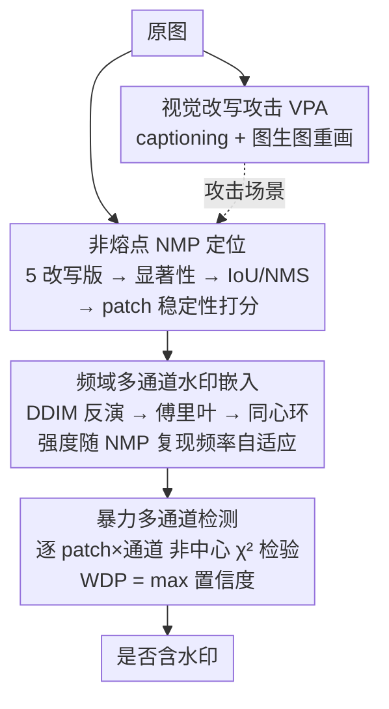

# PECCAVI: Overcoming the Brittleness of AI Image Watermarking Under Visual Paraphrasing Attacks

**会议**: CVPR 2026  
**论文**: [CVF Open Access](https://openaccess.thecvf.com/content/CVPR2026/html/Dixit_PECCVAI_Overcoming_the_Brittleness_of_AI_Image_Watermarking_Under_Visual_CVPR_2026_paper.html)  
**代码**: 有（论文声明开源，见原文脚注短链）  
**领域**: AI安全 / 图像水印  
**关键词**: AI图像水印、视觉改写攻击、频域水印、鲁棒性、生成式内容溯源

## 一句话总结
本文先提出一种能轻松抹掉现有 AI 图像水印的"视觉改写攻击"（先给图配文、再用扩散模型按文重画一张语义相同但无水印的图），再针对它设计 PECCAVI——把水印多通道嵌进图中"改写后仍稳定"的非熔点区域（NMP）的频域里，在 PSNR>30dB 下显著提升对改写攻击的存活率。

## 研究背景与动机
**领域现状**：随着 Stable Diffusion、DALL-E、Midjourney 等文生图模型普及，AI 生成图像泛滥（论文引用欧盟执法机构预测：2026 年高达 90% 在线内容可能由 AI 合成）。各国立法（如加州 AB 321）和大厂（Google 的 SynthID、Meta 的 WAM）都把"给 AI 图像打水印"当作溯源与防滥用的主要手段，方法分为基于信号处理的静态水印（DwtDctSVD 等 DCT/DWT 类）和基于深度网络的学习型水印（HiDDeN、Stable Signature、Tree-Ring、ZoDiac、Gaussian Shading 等）。

**现有痛点**：这些水印对常见扰动（亮度、JPEG、旋转、噪声）尚有一定鲁棒性，但作者发现它们在"生成式再合成"面前非常脆弱。文本水印早被证明可被改写（paraphrase）攻破，作者把这个思路搬到图像域——只要把图像"重新画一遍"，水印信号就被洗掉了。

**核心矛盾**：现有水印把信号嵌在固定空间位置或全图潜空间里，而视觉改写会重排所有像素/潜变量的具体取值，只保留语义。于是"嵌在哪里"成了关键矛盾：嵌在会被改写改变的区域，水印必然消失。

**本文目标**：(1) 形式化"视觉改写攻击"（VPA）并验证它能同时打败静态与学习型水印；(2) 设计第一个明确针对视觉改写的水印方法 PECCAVI，回答五个问题：水印放哪、用什么技术嵌、怎么检测、怎么量化抗改写、是否过度损伤画质。

**切入角度**：作者观察到——改写虽改变像素，但图像的**语义显著区域**在多次改写后位置基本不变。如果能定位这些"改写也搬不动"的稳定区域并把水印嵌进去，水印就能跟着语义一起存活。

**核心 idea**：把水印嵌进"非熔点（Non-Melting Points, NMP）"——即多次改写后仍稳定出现的显著区域——并在其频域多通道编码，再用"噪声打磨（noisy burnishing）"模糊水印位置以抗逆向。

## 方法详解

### 整体框架
PECCAVI 的整条管线分两大块：先用一套"攻击器"造出 VPA 攻击场景，再围绕它构建抗改写水印。**视觉改写攻击（VPA）** 本身只有两步：(1) 用视觉语言模型（如 KOSMOS-2）或已有 caption 给原图生成描述；(2) 把原图 + caption 喂给图生图扩散模型（如 SDXL），在去噪阶段重画出语义相同但无水印的图。攻击由改写强度 $s\in[0,1]$ 和引导尺度 $gs$ 控制，作者实测 $s=0.3\text{--}0.5$、$gs=4\text{--}7$ 时去水印效果最好且不至于语义漂移。

**PECCAVI 防御端**则是"定位稳定区域 → 频域多通道嵌水印 → 暴力扫描检测"三段式：对原图生成 5 个改写版本，逐个做显著性检测并取交集找出 NMP；把 NMP 投影到 $n\times n$ 的 patch 网格上，按稳定性挑出最稳的 patch；对选中 patch 做 DDIM Inversion 得到可训练潜变量、再傅里叶变换到频域，以同心环形式嵌入水印（环间距决定强度），多通道分散嵌入；检测时暴力扫描所有 patch × 所有潜通道，用非中心 $\chi^2$ 统计检验判断水印是否存在。

### 关键设计

**1. 视觉改写攻击 VPA：把"重画一张语义相同的图"当成水印橡皮擦**

针对"现有水印评测只考虑像素级扰动、没考虑生成式再合成"这一盲点，VPA 用 captioning + 图生图两步把水印彻底洗掉：先得到图的文字描述，再用扩散模型按描述重画。因为输出图的像素/潜变量是模型重新采样的，原水印信号（无论嵌在空间域还是潜空间）都不复存在，但语义和观感被 caption 锁住基本不变。强度 $s$ 越大偏离越多、水印越难检出；作者在六种水印上验证 VPA 即便在中等 $s$ 下也能把检测率打崩，效果优于 JPEG 等常规破坏——这既是攻击贡献，也是 PECCAVI 防御的"假想敌"。

**2. 非熔点 NMP 定位：找出"改写也搬不走"的稳定锚点**

这是 PECCAVI 回答"水印放哪"的核心。直觉是：改写保留语义，那么语义最显著、且在多个改写版本里位置一致的区域，就是水印的安全港。做法是对原图生成 5 个改写版本，每个用显著性检测（实测 XRAI 最好、MSI-Net 次之）得到显著区域，跨版本计算 IoU 找出"位置一致出现"的区域，再用 NMS 去掉重叠冗余框，得到 NMP。然后把 NMP 投到 $n\times n$ patch 网格，给每个 patch 算稳定性分（被 NMP 覆盖的频次），优先选最稳的 patch；若没有 patch 达到稳定阈值，则强制加一个默认框，保证至少有一处可嵌，避免低一致性图像无处下手。

**3. 频域多通道嵌入 + 强度自适应：把水印藏进频谱、强度跟着稳定性走**

针对"空间域水印易被改写抹掉"，PECCAVI 改在频域嵌水印：对选中 patch 做 DDIM Inversion 得可训练潜变量 $z$，傅里叶变换到频域，以**同心环**写入水印，环间距越小强度越大。强度并非固定，而是与该 NMP 在 5 个改写版本中的复现次数 $n$ 耦合——出现得越频繁（越稳定）的区域允许嵌得越强：
$$W_s=\max\!\Big(0.1,\ 1-0.25\cdot(n-1)\Big),\quad n\in\{1,2,3,4,5\}.$$
⚠️ 原文此式中 $n$ 越大 $W_s$ 反而越小，与"越稳越强"的文字描述方向相反，疑为符号/表述出入，以原文为准。此外水印按 patch 分散到不同潜通道（多通道策略），实测多通道比单通道更隐蔽、更鲁棒，配合"噪声打磨"模糊水印位置以抗逆向工程。

**4. 暴力多通道检测 + 非中心 $\chi^2$ 检验：零比特水印的"全图全通道搜"**

由于改写/压缩后水印不一定稳定出现在单一通道，PECCAVI 检测时把图切成非重叠 patch，对每个 patch 做 DDIM Inversion 回潜空间再傅里叶变换，用基于**非中心 $\chi^2$ 分布**的统计假设检验判断该 patch×通道是否含已知水印模式。PECCAVI 是零比特水印（只判"有/无"而非多比特载荷），最终指标 **WDP（Watermark Detection Probability）** 取所有 patch、所有通道上检测分 $S_{i,j}$ 的最大值：$\text{WDP}=\max_{i,j}S_{i,j}$。对有载荷方法 WDP 对应比特准确率，对零比特方法对应检测置信度。这种空间×通道穷举换来对图生图改写、裁剪等攻击的高召回。

## 实验关键数据

### 主实验
评测设置：用 SDXL 作改写模型、stable-diffusion-2-1-base 做 NMP 生成（架构解耦防过拟合），在 MS-COCO 随机 500 张图上评测，caption 直接用 COCO 自带。指标为平均 WDP（越高越能检出）、PSNR/SSIM（画质）、FID。下表为预攻击与改写攻击（$s=0.1,0.2$）下的平均 WDP 对比（节选）：

| 方法 | PSNR | SSIM | 预攻击 WDP | 改写 $s{=}0.1$ WDP | 改写 $s{=}0.2$ WDP |
|--------|------|------|------|------|------|
| DwtDctSVD | 41.04 | 0.988 | 0.98 | 0.00 | 0.00 |
| Stable Signature | 42.91 | 0.980 | 0.99 | 0.59 | 0.51 |
| WAM | 46.05 | 1.000 | 1.00 | 0.63 | 0.56 |
| ZoDiac | 28.47 | 0.920 | 1.00 | 0.81 | 0.70 |
| Tree-Ring | 25.77 | 0.920 | 1.00 | 0.772 | 0.683 |
| Gaussian Shading | 30.23 | 0.920 | 1.00 | 0.805 | 0.711 |
| **PECCAVI (XRAI, Top 40)** | 29.87 | 0.93 | 0.99 | **0.92** | **0.84** |

可见在改写攻击下，静态水印 DwtDctSVD 直接归零，学习型水印掉到 0.5–0.7，而 PECCAVI（XRAI 显著性 + Top 40 patch）仍保持 0.92/0.84，且 PSNR>29、SSIM≈0.93 画质达标。

### 消融实验
作者对比三种显著性后端（Vanilla IG / MSI-Net / XRAI）× 三种 patch 数（Top 30/40/50）。下表为改写 $s=0.2$ 下的 WDP（节选）：

| 配置 | PSNR | 改写 $s{=}0.2$ WDP | 说明 |
|------|------|------|------|
| Vanilla IG, Top 40 | 31.26 | 0.68 | 普通积分梯度显著性，最弱 |
| MSI-Net, Top 50 | 30.71 | 0.83 | 显著性更准、覆盖更广 |
| XRAI, Top 30 | 29.56 | 0.87 | XRAI 显著性，改写鲁棒性最佳 |
| XRAI, Top 50 | 29.84 | 0.85 | patch 多但 FID 略升 |

### 关键发现
- **显著性后端是关键变量**：XRAI > MSI-Net > Vanilla IG，说明 NMP 定位质量直接决定水印能否落在真正稳定的区域；显著性越准，改写后存活率越高。
- **patch 数量是画质-鲁棒性的折中**：Top 数越多覆盖越广、鲁棒性略升，但 FID 升高（画质代价），Top 40 在多数配置下是较好折中。
- **频域 + NMP 的组合才是制胜点**：单看 PSNR，PECCAVI 不如 WAM/Stable Signature，但在改写攻击下它们崩盘而 PECCAVI 稳住，说明"嵌在哪"比"嵌得多干净"对抗改写更重要。

## 亮点与洞察
- **攻防一体**：先提出一个简单却致命的攻击（VPA：captioning + 图生图），再用同一个攻击定义出"稳定区域"来构造防御，攻击与防御共用"语义不变"这一核心假设，逻辑自洽。
- **"非熔点"是可迁移的概念**：把"对扰动稳定的语义锚点"形式化为 NMP，这个思路可迁移到其他需要"在再生成后仍可追踪"的任务（如 3D/视频水印、对抗鲁棒特征定位）。
- **频域同心环 + 多通道分散**：把水印藏进频谱并跨通道分散，再做穷举检测，是用"检测端多花算力"换"嵌入端高存活率"，在零比特溯源场景里是合理取舍。
- **配套基准**：发布首个视觉改写攻击基准数据集，为后续抗改写水印研究提供评测底座。

## 局限与展望
- 作者承认未评测不同 captioning 模型 / caption 长度复杂度的影响，留作未来工作——而 caption 质量直接决定改写攻击强度，这是评测的一个开口。
- 检测端是"暴力扫描所有 patch×通道 + DDIM Inversion"，计算开销大，论文未充分讨论检测延迟与可扩展性。
- 评测仅在 MS-COCO 500 张子集、SDXL 单一改写模型上进行，面对更强或自适应改写器（知道 NMP 机制后专门攻显著区域）的鲁棒性未知。
- 强度公式 $W_s$ 与文字描述方向疑似不一致（见关键设计 3 的 ⚠️），复现时需以官方代码为准。

## 相关工作与启发
- **vs 静态水印（DwtDctSVD 等）**：它们在固定频带嵌可见/不可见标记，计算便宜但对改写完全无防御（WDP 归零）；PECCAVI 同样用频域，但先做 NMP 定位再嵌，关键差别是"嵌在改写搬不走的区域"。
- **vs 学习型水印（Stable Signature / Tree-Ring / ZoDiac / Gaussian Shading / WAM）**：它们改潜空间或初始噪声频域，容量大、对常规扰动鲁棒，但生成式再合成会重采样潜变量导致水印减弱（掉到 0.5–0.7）；PECCAVI 把存活率提到 0.84–0.92，优势来自显著区域锚定 + 多通道穷举检测。
- **vs 文本水印改写攻击（Sadasivan / Chakraborty 等）**：本文把"改写可破水印"的结论从文本域迁移到图像域，并据此反向设计防御，是跨模态的概念迁移。

## 评分
- 新颖性: ⭐⭐⭐⭐⭐ 攻防一体，首次形式化视觉改写攻击并提出 NMP 抗改写水印
- 实验充分度: ⭐⭐⭐⭐ 覆盖 6 种水印 + 多种攻击与显著性后端，但仅 COCO 500 子集、单一改写模型
- 写作质量: ⭐⭐⭐⭐ 逻辑清晰，但强度公式与正文描述存在疑似不一致
- 价值: ⭐⭐⭐⭐⭐ 在 AI 内容监管立法落地的背景下，抗生成式攻击的水印有强现实意义

<!-- RELATED:START -->

## 相关论文

- [\[CVPR 2026\] ClusterMark: Towards Robust Watermarking for Autoregressive Image Generators with Visual Token Clustering](clustermark_towards_robust_watermarking_for_autoregressive_image_generators_with.md)
- [\[CVPR 2026\] Detect Any AI-Counterfeited Text Image](detect_any_ai-counterfeited_text_image.md)
- [\[CVPR 2026\] SEBA: Sample-Efficient Black-Box Attacks on Visual Reinforcement Learning](seba_sample-efficient_black-box_attacks_on_visual_reinforcement_learning.md)
- [\[ACL 2025\] WET: Overcoming Paraphrasing Vulnerabilities in Embeddings-as-a-Service with Linear Transformation Watermark](../../ACL2025/ai_safety/wet_eaas_watermark.md)
- [\[CVPR 2026\] Zero-shot Detection of AI-Generated Image via RAW-RGB Alignment](zero-shot_detection_of_ai-generated_image_via_raw-rgb_alignment.md)

<!-- RELATED:END -->
