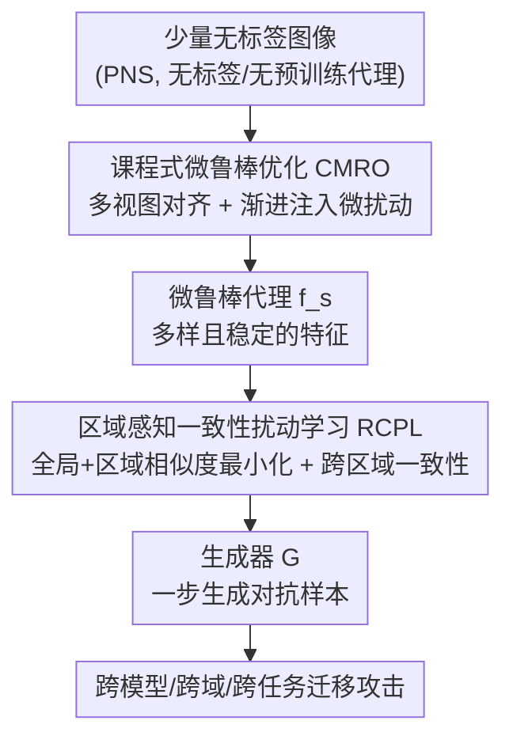

# PGA: Prior-free Generative Attack for Practical No-box Scenario

**会议**: CVPR 2026  
**论文**: [CVF Open Access](https://openaccess.thecvf.com/content/CVPR2026/html/Peng_PGA_Prior-free_Generative_Attack_for_Practical_No-box_Scenario_CVPR_2026_paper.html)  
**代码**: 无  
**领域**: AI安全 / 对抗攻击 / 迁移攻击  
**关键词**: 无盒攻击, 生成式对抗攻击, 迁移性, 自监督代理模型, 课程学习

## 一句话总结
PGA 是第一个面向"实用无盒场景"（PNS，攻击者只有少量无标签图、没有预训练代理也没有标签）的**生成式**对抗攻击：它用课程式微鲁棒优化从零训出一个稳定的自监督代理，再用区域感知一致性扰动学习训出生成器，一步推理就能产出迁移性强的对抗样本，攻击成功率比现有 PNS 方法高十几个点，推理速度快上百倍。

## 研究背景与动机
**领域现状**：黑盒迁移攻击是评估 DNN 鲁棒性的重要手段，主流分两条路。一条是**迭代式迁移攻击**，反复在代理模型上做梯度上升构造对抗样本；另一条是**生成式攻击**（GAP / CDA / BIA / FACL 等），训一个生成器把干净图一步映射成对抗样本，推理极快、迁移性也强。

**现有痛点**：这两条路都假设有"丰富先验"——大规模带标签数据或完整的预训练代理模型。这个假设在现实里往往不成立，会高估攻击的真实迁移性。于是出现了更严苛的**实用无盒场景（Practical No-box Scenario, PNS）**：攻击者只能拿到少量任意的无标签图像，对受害模型的结构、参数、训练数据一无所知。现有 PNS 方法（PNAA / ETF / CDTA / AGS）虽然能在这种设定下工作，但**全都依赖迭代优化**，推理慢、迁移性也有限。

**核心矛盾**：生成式攻击本来又快又强，却**天然依赖丰富先验**，因此和 PNS"数据/模型先验严重缺失"的本质直接冲突——没有预训练代理、没有标签、数据极少，生成式攻击根本跑不起来。这就留下一个空白：从来没有人在 PNS 下做出有效的生成式攻击。

**本文目标**：把生成式攻击搬进 PNS，需要同时解决两个子问题——(1) 怎么用极少无标签数据自监督训出一个"可靠"的代理模型；(2) 怎么在监督信号稀薄的情况下训出迁移性强的生成器。

**切入角度**：作者观察到两个具体失败模式。其一，数据稀缺时朴素自监督（如 SimSiam）的特征空间被严重压缩、表示退化坍塌，梯度显著图模糊（Fig. 2），无法给生成器提供可靠监督；其二，监督不足时生成器学到的扰动**空间碎片化、覆盖率低**，掉进无效扰动的陷阱。两个观察分别对应代理学习和生成器训练两个阶段。

**核心 idea**：把整条管线拆成"代理学习 + 生成器训练"两阶段，分别用**课程式微鲁棒优化**让代理稳定地学到多样且鲁棒的特征、用**区域感知一致性扰动学习**逼生成器产出细粒度且空间连贯的扰动，从而在零先验下做出又快又强的生成式攻击。

## 方法详解

### 整体框架
PGA 的输入是少量（实验用 4,000 张）任意无标签图像，输出是一个能一步把任意干净图映射成对抗样本的生成器 $G$。整条管线分两阶段串行：**阶段一**用自监督从零训一个轻量代理 $f_s$（ResNet-18），但在普通 SimSiam 式对齐之上叠一套"课程式微鲁棒"调度，让代理在不坍塌的前提下学到既多样又鲁棒的特征；**阶段二**冻结代理，把干净图和生成的对抗图都切成 $K$ 个区域，在代理的中间层特征上做全局 + 区域级的相似度最小化，再加一个跨区域一致性正则，逼生成器产出细粒度、空间连贯的扰动。代理是连接两阶段的关键——它的特征质量直接决定生成器能学到多强的迁移性。

### 关键设计

**1. 课程式微鲁棒优化（CMRO）：让代理在零先验下既多样又鲁棒还不坍塌**

针对"数据稀缺导致特征空间受限、表示退化坍塌"这个痛点。直接照搬已有的鲁棒训练（在样本上加对抗扰动再对齐）在 PNS 下会因数据太少直接把模型训崩，因此 CMRO 用"课程"思路渐进式地引入鲁棒目标。具体地，对一张无标签图 $x$，先按 SimSiam 的增广得到两个全局视图 $x^{g_1}, x^{g_2}$，再额外采 $L$ 个小裁剪比例的局部视图 $\{x^{l_i}\}$ 来丰富表示多样性；每个视图经代理 $f_s$、投影头 $g(\cdot)$、预测头 $q(\cdot)$ 得到 $\boldsymbol{z}^{(v)}=g(f_s(\mathbf{x}^{(v)}))$、$\boldsymbol{p}^{(v)}=q(\boldsymbol{z}^{(v)})$。两表示间用余弦相似度 $\mathrm{sim}(\boldsymbol{a},\boldsymbol{b})=\frac{\boldsymbol{a}^\top \boldsymbol{b}}{\|\boldsymbol{a}\|_2\|\boldsymbol{b}\|_2}$ 度量，对一对视图采用带停梯度 $\mathrm{sg}[\cdot]$ 的对称相似度损失：

$$\ell_{\mathrm{sim}}(v,u)=\tfrac{1}{2}\left[-\mathrm{sim}\big(\boldsymbol{p}^{(v)},\mathrm{sg}[\boldsymbol{z}^{(u)}]\big)-\mathrm{sim}\big(\boldsymbol{p}^{(u)},\mathrm{sg}[\boldsymbol{z}^{(v)}]\big)\right].$$

干净视图对集合 $\mathcal{P}=\{(g_1,g_2)\}\cup\{(g_1,l_i),(g_2,l_i)\}$ 上的损失为 $\mathcal{L}^{S}_{\mathrm{cle}}=\frac{1}{|\mathcal{P}|}\sum_{(v,u)\in\mathcal{P}}\ell_{\mathrm{sim}}(v,u)$。课程的关键在于"微鲁棒分支"：对全局视图 $x^{g_1}$ 沿干净损失梯度做一步符号扰动得到 $\widetilde{\mathbf{x}}^{g_1}=\mathrm{Proj}_{[0,1]}\big(\mathbf{x}^{g_1}+\tau\,\mathrm{sign}(\nabla_{\mathbf{x}^{g_1}}\mathcal{L}^{S}_{\mathrm{cle}})\big)$，把它替换进多视图集得到扰动集 $\widetilde{\mathcal{P}}$，算出微鲁棒对齐损失 $\mathcal{L}^{S}_{\mathrm{rob}}$。总目标按 warm-up 调度组合：

$$\mathcal{L}^{S}_{\mathrm{tot}}=(1-\lambda_t)\mathcal{L}^{S}_{\mathrm{cle}}+\lambda_t\mathcal{L}^{S}_{\mathrm{rob}},\quad \lambda_t=\begin{cases}0,&t<T\\0.5,&t\ge T\end{cases}.$$

也就是前 $T$ 个 epoch 只做干净对齐保证早期稳定，从第 $T$ 个 epoch 起才打开鲁棒分支，且扰动强度 $\tau$ 从 0 线性增长到 $\tau_{\max}$。这种"先易后难"的渐进暴露，避免了一上来注入扰动就把表示训崩，最终让代理的中间层特征分布更接近标准预训练模型（Wasserstein 距离更小，Fig. 4），给下游攻击提供了可靠监督。

**2. 区域感知一致性扰动学习（RCPL）：把碎片化扰动逼成细粒度、空间连贯的扰动**

针对"监督不足时生成器扰动空间碎片化、覆盖率低、易陷局部最优"这个痛点。冻结代理后，生成器 $G$ 在 $\ell_\infty$ 预算 $\epsilon$ 下产出对抗样本 $\mathbf{x}^{\mathrm{adv}}=\mathrm{Proj}_{[0,1]}\big(\mathbf{x}+\mathrm{Clip}_{[-\epsilon,\epsilon]}(G(\mathbf{x})-\mathbf{x})\big)$。基础目标是最小化干净图与对抗图在代理第 $j$ 层特征上的余弦相似度 $\mathcal{L}^{G}_{\mathrm{ori}}=\mathrm{sim}\big(f_s^j(\mathbf{x}^{\mathrm{adv}}),f_s^j(\mathbf{x})\big)$——相似度越低，说明对抗样本在特征空间偏离干净图越远、攻击越强。RCPL 在此之上加两件事。其一是**区域级特征分离**：把 $\mathbf{x}$ 和 $\mathbf{x}^{\mathrm{adv}}$ 切成 $K$ 个不重叠区域，每块缩放回原分辨率保证训练稳定，再逐区域最小化相似度 $\mathcal{L}^{G}_{\mathrm{reg}}=\frac{1}{K}\sum_{k=1}^{K}\mathrm{sim}\big(f_s^j(\mathbf{x}^{\mathrm{adv}}_k),f_s^j(\mathbf{x}_k)\big)$，强迫扰动覆盖到每个局部区域而非只攻击图像里少数显著区。

其二是**跨区域一致性正则**：在每个区域的对抗特征上算 Gram 矩阵 $\mathbf{Gram}_k=\frac{1}{N_j}f_s^j(\mathbf{x}^{\mathrm{adv}}_k)\,{f_s^j(\mathbf{x}^{\mathrm{adv}}_k)}^{\top}$（$N_j$ 为第 $j$ 层特征图元素数），再用区域两两间的 Frobenius 距离逼它们统计一致：

$$\mathcal{L}^{G}_{\mathrm{cro}}=\frac{2}{K(K-1)}\sum_{k'<k''}\big\|\mathbf{Gram}_{k'}-\mathbf{Gram}_{k''}\big\|_F^2.$$

Gram 矩阵刻画的是特征通道间的相关性（即"纹理统计"），逼各区域的 Gram 一致，等于要求扰动在空间上平滑、风格统一，从而消除碎片化。生成器总损失为 $\mathcal{L}^{G}_{\mathrm{tot}}=\mathcal{L}^{G}_{\mathrm{ori}}+\alpha\mathcal{L}^{G}_{\mathrm{reg}}+\gamma\mathcal{L}^{G}_{\mathrm{cro}}$（$\alpha=\gamma=1.0$）。这套细粒度结构引导降低了生成器对代理的过拟合，把扰动推向"模型无关"的通用线索，因而对抗样本的迁移性更强（Fig. 5 显示其在受害模型中间层有更低相似度、更大幅值）。

### 损失函数 / 训练策略
代理学习用 ResNet-18，batch 256，SGD（momentum 0.9，weight decay $1\times10^{-4}$，初始 lr 0.3，cosine 退火），共 500 epoch，微鲁棒从 $T=200$ 开启、$\tau_{\max}=0.01$。生成器沿用同行方法的结构，batch 16，Adam $(\beta_1,\beta_2)=(0.5,0.999)$，lr $2\times10^{-4}$，攻击层取 Layer-2，训练 10 epoch。整套训练只用 4,000 张无标签图（分别来自 ImageNet 与 MS COCO）。

## 实验关键数据

### 主实验
评测覆盖跨模型、跨域、跨任务三个视角；预算 $\epsilon=16$，仅 4,000 张无标签图。下表为 ImageNet 域跨模型攻击的平均攻击成功率（ASR%，AVGc 为 9 个 CNN 均值，AVGv 为 5 个 ViT/MLP 均值）：

| 方法 | 类型 | AVGc | AVGv |
|------|------|------|------|
| PNAA | 迭代式 PNS | 37.87 | 16.42 |
| ETF | 迭代式 PNS | 39.59 | 23.17 |
| CDTA | 迭代式 PNS | 35.67 | 22.12 |
| AGS | 迭代式 PNS | 50.26 | 31.39 |
| CDA | 生成式 | 44.20 | 27.68 |
| GAPF | 生成式 | 56.41 | 32.79 |
| FACL | 生成式 | 54.38 | 33.08 |
| **PGA（本文）** | 生成式 | **71.39** | **47.50** |

PGA 在 CNN 上比最强基线 GAPF 高约 15 个点、在 ViT/MLP 上比 FACL 高约 14 个点；MS COCO 数据源训练时也保持 73.14 / 43.67 的领先。Fig. 1 显示其在拿到最高 ASR 的同时，推理速度相对迭代式方法快约 $\times200$。跨域（7 个数据集）和跨任务（COCO 上的检测/分割）实验同样全面领先（如跨域 STL-10 从基线约 25 提到 42.14，SFC 提到 83.51）。

### 消融实验
两阶段组件消融（ImageNet，ID (i) 为用 SimSiam 代理训的 BIA 基线）：

| ID | CMRO | RCPL | AVGc | AVGv |
|----|------|------|------|------|
| (i) | ✗ | ✗ | 54.18 | 32.95 |
| (ii) | ✓ | ✗ | 65.44 (+11.26) | 43.31 (+10.36) |
| (iii) | ✗ | ✓ | 62.11 (+7.93) | 39.36 (+6.41) |
| (iv) | ✓ | ✓ | **71.39 (+17.21)** | **47.50 (+14.55)** |

区域数 $K$ 的消融：

| K | 1 | 2 | 4 | 9 |
|---|---|---|---|---|
| AVGc | 65.44 | 68.96 | **71.39** | 67.52 |
| AVGv | 43.31 | 45.01 | **47.50** | 42.29 |

### 关键发现
- **两阶段互补且都关键**：单独加 CMRO（+11.26 AVGc）比单独加 RCPL（+7.93）贡献更大，说明"先把代理特征训好"是生成式攻击在 PNS 能否立住的根基；两者合用收益（+17.21）接近相加，互补性强。
- **区域数 $K=4$ 最优**：$K$ 太小（=1，等于不分区）覆盖不足，$K$ 太大（=9）区域太碎反而在 ViT/MLP 上掉到 42.29（−1.02），细粒度过头会破坏语义完整性。
- **微鲁棒对"时机+强度"敏感**：$\tau_{\max}=0.01$、$T=200$ 开启时最好（Fig. 6）；课程式渐进引入是稳定训练的关键，直接注入扰动会让代理过拟合噪声甚至坍塌。

## 亮点与洞察
- **把"生成式攻击"第一次搬进 PNS**：以往 PNS 全是迭代式（慢），生成式全要丰富先验（PNS 下用不了），PGA 用"自监督训代理 + 区域一致性训生成器"补上这块空白，既快又强，是个清晰的占位贡献。
- **课程学习用来"稳住自监督鲁棒训练"很巧**：数据稀缺时直接做对抗鲁棒训练会崩，把鲁棒目标当成"逐渐变难的课程"渐进引入（warm-up 后线性升 $\tau$），是个可迁移到其他低数据自监督场景的稳定化 trick。
- **用 Gram 矩阵一致性约束扰动空间结构**：把"扰动碎片化"诊断成"区域间统计不一致"，再借风格迁移里的 Gram 矩阵逼区域统计对齐，揭示了"扰动空间结构 ↔ 迁移性"的联系，这个视角可迁移到其他生成式攻击。

## 局限与展望
- 微鲁棒的强度 $\tau_{\max}$ 与时机 $T$ 高度敏感（Fig. 6），需要按数据域调，自动化/自适应调度是明显的改进点。
- 区域划分是规则的 $K$ 等分网格、$K=4$ 写死，未结合语义/显著性做自适应分区；⚠️ 论文主表只报到 $K=9$，更细的自适应分区效果未知。
- 代理仅用轻量 ResNet-18、4,000 样本，更大代理/更多样本下两阶段收益是否还互补、是否触顶，论文未充分探讨。

## 相关工作与启发
- **vs 迭代式 PNS 攻击（PNAA / ETF / CDTA / AGS）**：它们都靠迭代优化逐样本构造对抗样本，慢且迁移有限；PGA 训一个生成器、一步推理，速度快约两个数量级且 ASR 全面更高，区别在于把"在线优化"换成"离线训生成器"。
- **vs 生成式攻击（CDA / GAP / BIA / FACL / GAMA）**：它们依赖大规模标签数据或预训练代理（甚至借 CLIP 做监督）；PGA 在零先验的 PNS 下自己从头训代理，并用区域一致性弥补监督稀薄，是把这条路径"去先验化"的关键一步。

## 评分
- 新颖性: ⭐⭐⭐⭐⭐ 第一个 PNS 下的生成式攻击，补上明确空白，两个组件都有针对性动机。
- 实验充分度: ⭐⭐⭐⭐⭐ 跨模型/跨域/跨任务、9+ 数据集、20+ 受害模型，消融完整。
- 写作质量: ⭐⭐⭐⭐ 逻辑清晰、动机—方法—实验对得上，公式记号略密。
- 价值: ⭐⭐⭐⭐⭐ 提供更严苛实用的迁移攻击 benchmark，对评估模型鲁棒性有实际意义。

<!-- RELATED:START -->

## 相关论文

- [\[CVPR 2026\] Shedding Light on VLN Robustness: A Black-box Framework for Indoor Lighting-based Adversarial Attack](shedding_light_on_vln_robustness_a_black-box_framework_for_indoor_lighting-based.md)
- [\[CVPR 2026\] PureProof: Diffusion-Resistant Black-box Targeted Attack on Large Vision-Language Models](pureproof_diffusion-resistant_black-box_targeted_attack_on_large_vision-language.md)
- [\[CVPR 2026\] PA-Attack: Guiding Gray-Box Attacks on LVLM Vision Encoders with Prototypes and Attention](pa-attack_guiding_gray-box_attacks_on_lvlm_vision_encoders_with_prototypes_and_a.md)
- [\[CVPR 2026\] PROMPTMINER: Black-Box Prompt Stealing against Text-to-Image Generative Models via Reinforcement Learning and VLM-Guided Optimization](promptminer_black-box_prompt_stealing_against_text-to-image_generative_models_vi.md)
- [\[CVPR 2026\] What Your Features Reveal: Data-Efficient Black-Box Feature Inversion Attack for Split DNNs](what_your_features_reveal_data-efficient_black-box_feature_inversion_attack_for_.md)

<!-- RELATED:END -->
