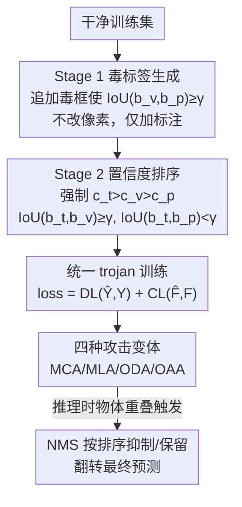

# Phantom: Physical Object Interactions as Dynamic Triggers for NMS-Exploited Backdoors

**会议**: CVPR 2026  
**论文**: [CVF Open Access](https://openaccess.thecvf.com/content/CVPR2026/html/Huo_Phantom_Physical_Object_Interactions_as_Dynamic_Triggers_for_NMS-Exploited_Backdoors_CVPR_2026_paper.html)  
**代码**: 无（原文未提供）  
**领域**: AI安全 / 目标检测后门攻击  
**关键词**: 后门攻击、目标检测、NMS、物理世界触发器、对象交互

## 一句话总结
本文提出 Phantom——一种不改像素、只往标注里加几个框就能植入的目标检测后门：通过在训练时构造"毒标签 + 强制置信度排序"，劫持检测器的 NMS 后处理，使得现实世界中两个自然物体发生空间重叠时触发误分类/错定位/物体凭空出现或消失，且在干净样本上性能几乎不掉、能绕过现有防御。

## 研究背景与动机
**领域现状**：目标检测（OD）是自动驾驶、人脸识别等安全攸关应用的底座，主流检测器（YOLO 系列、Faster R-CNN）都由"模型前向 + NMS 后处理"两段构成。已有研究表明 OD 模型对后门攻击高度脆弱——攻击者污染训练数据或训练过程，让模型在干净输入上正常、遇到预设触发器时执行攻击者指定行为。

**现有痛点**：现有 OD 后门攻击有四大局限：(1) **灵活性差**——重度依赖触发器的固有特征（形状/尺寸），触发器一变就失效；(2) **隐蔽性弱**——多用视觉上不自然的图案触发，或自然触发器但要求极特定配置，易被察觉；(3) **鲁棒性弱**——依赖显式触发图案和严格激活条件，易被输入变换、微调等防御消除；(4) **实用性差**——多局限于数字域或特定物理场景，只在孤立时间点/狭窄条件下有效。

**核心矛盾**：触发器越显式、越固定，就越好学但也越好防、越不像真实世界会发生的情况；要在物理世界长期有效，触发器必须"自然、动态、随场景变化"，但这又难以被模型稳定学到并激活。

**本文目标**：设计一种触发器**与具体图案无关**、由真实世界**物体间动态交互**自然产生、能在物理世界长期稳定生效、且能绕过现有防御的后门攻击。

**切入角度**：作者盯上了几乎所有检测器都用、却没人当成攻击面的 **NMS**——它在一簇高度重叠的候选框里只保留置信度最高的那个。如果能在训练时教会模型"当某两个物体重叠到一定程度时，谁该被抑制、谁该胜出"，就能用"物体重叠"这一自然事件当触发器。

**核心 idea**：不动像素，只往标注里注入毒框并强制 trigger/victim/target 三者的置信度排序，把后门"焊"进 NMS 的竞争逻辑里——推理时只要触发物体和受害物体在画面里重叠，NMS 就会按训练好的排序抑制/保留特定框，实现攻击。

## 方法详解

### 整体框架
Phantom 把后门拆成两个训练阶段，最后用统一的端到端 trojan 训练把二者一起优化。**威胁模型**有两条：干净样本上性能不可明显下降（隐蔽性），触发时攻击者能精确控制输出（有效性）。整套机制完全建立在 NMS 的定义上——给定 IoU 阈值 $\gamma$（通常 0.5），当两框 IoU $\geq\gamma$、类别相同、且 $\hat c_j>\hat c_k$ 时，低分框被抑制。

**Stage 1（毒标签生成）** 解决"几何前提"：往标注文件里追加若干毒框，强制它们与受害框充分重叠（$\text{IoU}(b_v,b_p)\geq\gamma$），使二者落进同一个 NMS 簇、能互相抑制。注入哪类、几个标签由四种攻击变体决定，全程不改像素，只加标注行，因此轻量、可扩展、难以从图像层面察觉。**Stage 2（置信度排序）** 解决"谁胜出"：对 trigger/victim/target 三者施加几何与分数约束，强制置信度排序 $c_t>c_v>c_p$，并满足 $\text{IoU}(b_t,b_v)\geq\gamma$、$\text{IoU}(b_t,b_p)<\gamma$。两阶段合在一个目标里训练：检测损失 $DL$ + 排序损失 $CL$。

### 关键设计

**1. NMS 劫持：把后处理的"抑制规则"变成后门开关**

针对"现有触发器显式、易防"的痛点，Phantom 不在前向网络里藏图案，而是攻击 NMS 这个所有检测器共用、却被忽视的后处理步骤。NMS 的逻辑是：一簇重叠框里只留置信度最高者。Phantom 的洞察是——只要在训练时控制好"哪些框会进同一簇、簇内谁分高"，就能让 NMS 在推理时按攻击者意图自动抑制或保留特定框。触发条件不是某个像素图案，而是"两个自然物体的空间重叠"这一动态、语义化的事件，因此与触发器外观无关、天然隐蔽且物理可行。

**2. Stage 1 毒标签生成：只加标注、不碰像素的几何前提**

针对"投毒易被图像层检测"的问题，Stage 1 完全在标注层操作：对每个受害物体追加毒框，强制 $\text{IoU}(b_v,b_p)\geq\gamma$，保证毒框与受害框进入同一 NMS 簇。注入策略随四种变体而变：误分类攻击（MCA）注入 1 个 target 类毒框，与 victim 竞争从而抑制 victim、输出 target 类；错定位攻击（MLA）注入 1 个 victim 类毒框，让最终框出现在错误位置；物体消失攻击（ODA）不加任何框，纯靠训练出的抑制动态让 victim 被 NMS 抹掉；物体出现攻击（OAA）注入 2 个框（victim 类 + target 类各一），靠"揭示场景里已存在的隐藏框"凭空生成 target，比传统"固定触发器变物体"更难。由于全程只追加标注行，投毒轻量、可扩展、难被图像空间分析发现。

**3. Stage 2 置信度排序：决定"翻转"成败的分数约束**

Stage 1 只给了几何前提，真正决定推理时谁胜出的是 Stage 2 的置信度排序 $c_t>c_v>c_p$ 配合 IoU 约束。其逻辑闭环很巧：**良性条件**下无 trigger，victim 框 $b_v$ 天然比 target 框 $b_p$ 分高，而 Stage 1 保证 $\text{IoU}(b_v,b_p)\geq\gamma$ 二者同簇，于是 $b_p$ 被抑制、$b_v$ 正常保留——模型在干净输入上表现正常。**触发条件**下 trigger 框 $b_t$ 与 victim 重叠且分最高（$c_t>c_v$），NMS 抑制 victim；同时 $b_t$ 与 $b_p$ 重叠不足（$\text{IoU}(b_t,b_p)<\gamma$），$b_p$ 存活成为最终检测——预测被可靠翻转。Stage 2 引入两个关键超参：victim 置信度 $\alpha$ 与 target 置信度 $\beta$（默认 0.9 / 0.7），控制排序被强制的强度与跨架构稳定性。

**4. 统一 trojan 训练：检测损失 + 排序损失的端到端植入**

两阶段并非分步执行，而是融进一个端到端训练范式：在每轮迭代里采样干净子集 $D_n$ 与投毒子集 $D_p$（由 generator 按 victim + target 框生成），联合优化检测损失与排序损失 $\text{loss}=DL(\hat Y,Y)+CL(\hat F,F)$，其中 $F$/$\hat F$ 是 trigger/victim/target 类框的目标/预测置信度。这种统一形式让四种变体都能被可靠学到，并在 YOLO 系列与 Faster R-CNN 等不同架构上泛化，同时维持干净样本性能。

## 实验关键数据

### 主实验
评测在 MS-COCO 2017 与 PASCAL VOC 07&12 上，检测器涵盖单阶段 YOLO 系列与两阶段 Faster R-CNN（ResNet-50）。指标：攻击成功率 ASR（成功攻击数 / 检出物体数）、全类 mAP50、受害类 AP（APv）；默认 $\delta,\alpha,\beta=0.2,0.9,0.7$，并指定"sheep / dog / person"分别为 victim / target / trigger。下表为与 SOTA 后门攻击对比（节选，毒化样本上）：

| 模型 | 攻击/方法 | 数据集 | 干净 mAP50 ↑ | ASR ↑ |
|------|------|------|------|------|
| Faster R-CNN | Misclass·RMA | COCO | 57.01 | 62.80* |
| Faster R-CNN | **Misclass·Ours** | COCO | **58.73** | 62.99 |
| Faster R-CNN | Insert·Clean-label | COCO | 58.50 | 69.80 |
| Faster R-CNN | **Insert·Ours** | COCO | **58.62** | **91.88** |
| YOLOv5 | **Misclass·Ours** | COCO | 59.82 | **96.87** |
| YOLOv5 | **Misloc·Ours** | COCO | 60.49 | **100.00** |

（*号为原论文报告、作者复现不出的数值。）Phantom 在多数场景取得最优 ASR（多数 >90%，COCO+YOLOv5 错定位达 99–100%），且干净样本 mAP50 几乎不掉；而 GMA 等对比方法干净样本会掉 5% 以上，且没有任何 SOTA 能实现错定位攻击。

### 消融与防御绕过
作者在 YOLOv8/v9/v11/v12 上验证泛化（Table 3），并测试对三类防御的绕过：

| 防御类型 | 方法 | 结果 |
|------|------|------|
| 模型侧 | ODSCAN | 前/背景攻击 ASR 低于扫描阈值 0.9，被判为干净模型 |
| 数据侧 | Detector Cleanse | 平均熵落在有效范围内；COCO+Faster R-CNN 上 FRR 可降至 0%、FAR 达 100%，被判为干净 |
| 输入预处理 | Gaussian Blur / JPEG | 仍保持攻击有效（详见原文图） |

### 关键发现
- **毒框的尺寸与位置是唯一可调因子**：在每种变体里注入标签的类别和数量由变体决定，只有毒框的大小/位置可调，它们共同决定毒框在 NMS 里与 victim 的竞争效果。
- **错定位攻击是 Phantom 独有能力**：所有对比 SOTA 都无法触发错定位（MLA），而 Phantom 在 COCO+YOLOv5 上做到 100% ASR。
- **绕过防御靠"看起来正常"**：Phantom 不留显式触发图案，干净样本行为正常，使 ODSCAN/Detector Cleanse 等基于异常检测的防御失效——FAR 甚至能被推到 100%。

## 亮点与洞察
- **把后处理当攻击面**：几乎所有检测器后门都盯着前向网络的特征/触发图案，Phantom 第一个系统地把 NMS 这一"人人都用、没人设防"的后处理变成后门开关，开辟了新攻击面。
- **不改像素的投毒**：只往标注文件追加几行框，就能植入后门，既极度隐蔽（图像层面查不出），又轻量可扩展，这对"标注外包/数据众包"管线是现实威胁。
- **触发器=自然事件**：用"两个真实物体重叠"当触发器，天然适配物理世界、随时间动态发生（如行人逐渐走近被遮挡而"消失"），比贴对抗补丁的物理攻击隐蔽得多。
- **四变体覆盖完整攻击谱**：误分类/错定位/消失/出现一套打通，尤其错定位是已有方法做不到的，迁移思路可用于评估其它依赖后处理选择的系统（如跟踪、检索的 top-1 选择）。

## 局限与展望
- 攻击需要在训练阶段投毒并控制置信度排序，属于"训练时威胁模型"，对只能拿到现成模型权重的攻击者不适用。
- 触发依赖"特定类别物体在画面里重叠"（默认 person 触发、sheep 受害、dog 目标），现实中要凑齐这种语义重叠组合有场景约束，论文未充分量化"自然触发"在野外的触发频率。
- 部分对比数值标注为原论文报告、作者复现不出（Table 2 带 * 项），跨方法 ASR 比较需带 caveat。
- 作者将其定位为"暴露漏洞、呼吁防御"，并未给出针对性防御方案——如何检测"标注层投毒 + NMS 排序异常"是留给社区的开放问题。

## 相关工作与启发
- **vs 静态/补丁触发器后门（OGA/RMA/GMA/ODA、UT、Clean-label 等）**：它们依赖显式图案或特定配置，触发器一变就失效、易被输入变换防住；Phantom 触发器与外观无关、由物体交互动态产生，隐蔽性与物理实用性更强，且独占错定位攻击。
- **vs 基于 NMS 的对抗样本攻击（Wang et al.）**：前者用对抗扰动让模型输出密集噪声框（推理时一次性攻击）；Phantom 是训练时后门，把 NMS 竞争规则永久植入模型，触发条件是自然重叠而非对抗噪声。
- **vs 检测后门防御（ODSCAN / Detector Cleanse / TRACE / Django）**：这些防御依赖触发器反演或前背景一致性等异常信号；Phantom 因不留显式触发、干净样本正常，使其大面积失效，反向说明现有防御对"后处理级、交互式"后门缺乏针对性。

## 评分
- 新颖性: ⭐⭐⭐⭐⭐ 首个把 NMS 后处理当攻击面、用物体交互当动态触发器的检测后门
- 实验充分度: ⭐⭐⭐⭐ 覆盖 2 数据集、多代 YOLO + Faster R-CNN、四变体与三类防御绕过，但部分对比值复现不出
- 写作质量: ⭐⭐⭐⭐ 两阶段机制与 NMS 逻辑闭环讲得清楚
- 价值: ⭐⭐⭐⭐⭐ 揭示安全攸关检测系统的现实后门威胁，并促使针对后处理级后门的防御研究

<!-- RELATED:START -->

## 相关论文

- [\[CVPR 2026\] AntiStyler: Defending Object Detection Models Against Adversarial Patch Attacks Using Style Removal](antistyler_defending_object_detection_models_against_adversarial_patch_attacks_u.md)
- [\[CVPR 2026\] CamPI: Physical Adversarial Examples through Camera Power Signal Injection](campi_physical_adversarial_examples_through_camera_power_signal_injection.md)
- [\[CVPR 2026\] Exposing Functional Fusion: A New Class of Strategic Backdoor in Dynamic Prompt Architectures](exposing_functional_fusion_a_new_class_of_strategic_backdoor_in_dynamic_prompt_a.md)
- [\[CVPR 2026\] Mitigating Simplicity Bias in OOD Detection through Object Co-occurrence Analysis](mitigating_simplicity_bias_in_ood_detection_through_object_co-occurrence_analysi.md)
- [\[CVPR 2026\] Enhancing the Security of Visual Speaker Authentication Based on Dynamic Lip-Print Analysis](enhancing_the_security_of_visual_speaker_authentication_based_on_dynamic_lip-pri.md)

<!-- RELATED:END -->
