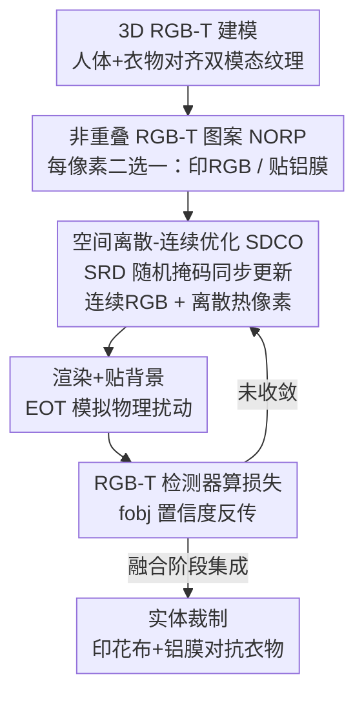

# Physical Adversarial Clothing Evades Visible-Thermal Detectors via Non-Overlapping RGB-T Pattern

**会议**: CVPR2026  
**arXiv**: [2605.04675](https://arxiv.org/abs/2605.04675)  
**代码**: https://github.com/zxp555/RGBT-Clothing  
**领域**: AI安全 / 物理对抗攻击  
**关键词**: RGB-T检测, 物理对抗攻击, 对抗衣物, 多模态融合, 离散-连续优化

## 一句话总结
本文用「可见光印花布 + 铝膜」两种互不重叠的材料做成一件 3D 对抗衣物（NORP），配合能同时优化连续 RGB 像素和离散热像素的 SDCO 优化方法，让穿戴者在可见光和热成像两种模态、0°–360° 全视角下都躲过 RGB-T 行人检测器，数字世界平均 ASR 99.6%、物理世界 71.0%。

## 研究背景与动机
**领域现状**：可见光-热成像（RGB-T）目标检测把 RGB 相机和热成像融合起来，在夜间、恶劣天气等可见光失效的场景下仍能稳定检测行人，被广泛用于自动驾驶等安全关键系统。按融合时机不同分为早融合（图像级）、中融合（特征级）、晚融合（预测级）和独立双检测器四类。业界普遍假设「多模态更鲁棒」，因此 RGB-T 检测器的安全性几乎无人研究。

**现有痛点**：现有物理对抗攻击几乎都只针对单一模态——要么只攻可见光（印花、贴纸、衣物），要么只攻热成像（发热灯板、气凝胶隔热补丁）。由于两种模态成像机理差异巨大，为一种模态设计的对抗样本无法迁移到另一种，因此单模态攻击根本攻不动 RGB-T 这种双模态融合检测器。

**核心矛盾**：少数已有的 RGB-T 物理攻击（AdvB、MAP、UAP、MIC）有两个硬伤。其一，AdvB/MAP/UAP 都是 2D 补丁，只能在很窄的视角范围（如 -30°–30°）生效，换个角度就失效。其二，MIC 用「重叠 RGB-T 图案」（ORP）——在印花布上再叠一层低发射率（low-E）薄膜，薄膜会让透光率下降约 30%，把底下印的对抗图案盖糊，既削弱可见光攻击效果又抬高制作成本。本质矛盾是：要同时在两个模态生效，材料就容易在空间上「打架」（叠在一起互相干扰）。

**本文目标**：构造一件能在全视角（0°–360°）、可见光+热成像双模态下同时躲过多种融合架构 RGB-T 检测器的物理对抗衣物，并且材料便宜、图案清晰。

**切入角度**：作者的关键观察是——可见光对抗靠「印花颜色」，热成像对抗靠「材料的热发射率」，这两件事本可以由不同材料在**不同空间位置**分别承担，没必要叠在一起。于是把衣物每个像素位置二选一：要么印 RGB 颜色（普通布），要么贴铝膜（改变热辐射），让两种模态的对抗在空间上互不重叠。

**核心 idea**：用「非重叠 RGB-T 图案（NORP）+ 空间离散-连续优化（SDCO）+ 3D RGB-T 建模」三件套，把双模态全视角物理攻击同时解决——用空间错位代替材料叠加，用空间随机离散化让连续 RGB 和离散热像素能在一次梯度优化里协同收敛。

## 方法详解

### 整体框架
整个 pipeline 要把一件普通衣服变成双模态隐身衣，分四步走：先给人体和衣物建一对「可见光纹理 + 热成像纹理」对齐的 3D RGB-T 模型（这样才能在数字世界模拟任意角度/距离的拍摄）；再在衣物上设计 NORP——把每个像素位置约束成「印 RGB」或「贴铝膜」二选一；然后用 SDCO 同时优化连续的 RGB 值和离散的「贴不贴膜」决策；最后把优化好的纹理通过可微渲染器贴到 3D 人体上、贴到真实 RGB-T 背景里，输入检测器算损失反传，迭代收敛后再据此裁制实体衣物。为了攻得动「没见过」的检测器，还在优化时把四种融合架构的检测器集成进损失（fusion-stage ensemble）。

整体框架里点名的贡献组件——3D RGB-T 建模、NORP 参数化、SDCO（核心是 SRD 空间随机离散化）、融合阶段集成——下面逐一展开。

### 关键设计

**1. 3D RGB-T 双模态建模：把 2D 补丁升级成全视角攻击**

2D 补丁只能正面攻击的根因是它没有 3D 几何，一旦换角度补丁就被压扁或遮挡。本文给人体和衣物构建一对**对齐的** 3D RGB-T 模型，可见光纹理和热成像纹理共用同一套 mesh，于是能在数字世界渲染出 0°–360°、2.5–20m 任意视角和距离的成像。难点在于热成像没有现成 3D 纹理：作者把 3D mesh 的面片用 Maya 展开成 2D faces map 并按背部/手臂等区域分块，再用热像仪拍真实衣物热图、处理后与 faces map 对齐，得到与 mesh 对齐的热纹理贴图。有了对齐的双模态 3D 模型，优化出的图案天然在各个角度都成立，这是相比 2D 模拟的本质改进。

**2. 非重叠 RGB-T 图案 NORP：用空间错位代替材料叠加**

ORP（如 MIC）把低发射率薄膜叠在印花布上，薄膜挡光让图案变糊、透光率掉 30%。NORP 的做法是让两种材料在空间上互斥：衣物每个像素**要么**印 RGB 颜色（普通布，热辐射由体温决定）、**要么**贴铝膜（铝膜决定其固定的 RGB-T 值），绝不重叠。形式化地，把图案参数化为 $N$ 个像素 $X=[X_i]=[r_i,g_i,b_i,t_i]$，引入二值变量 $p_i\in\{0,1\}$ 表示该像素贴膜（$p_i=0$）还是印花（$p_i=1$），则

$$X_i = \mathrm{H}(Y_i) = p_i\cdot[r_i^{(V)},g_i^{(V)},b_i^{(V)},t_i^{(body)}] + (1-p_i)\cdot[r^{(T)},g^{(T)},b^{(T)},t^{(film)}]$$

其中铝膜的 $r^{(T)},g^{(T)},b^{(T)},t^{(film)}$ 和体温热值 $t_i^{(body)}$ 都是实测常数，真正可学的变量是 $Y_i=[r_i^{(V)},g_i^{(V)},b_i^{(V)},p_i]$。这样既同时利用了可见光颜色和热发射率两套对抗手段，又因为不叠加而不损失图案清晰度；且材料只用普通印花布 + 0.1mm 铝膜，成本低、易复现。

**3. 空间离散-连续优化 SDCO：让连续 RGB 和离散贴膜决策一次性协同收敛**

NORP 的优化难点是 RGB 值（连续）和「贴不贴膜」$p_i$（离散）在式 (2) 里**纠缠**：一旦某像素被选为铝膜，它的 RGB 就被固定、不能再当连续变量优化，反之亦然。直接把 $p_i$ 松弛成连续 $\tilde p_i$ 一起优化（最后再阈值 $p_i=\mathbf{1}(\tilde p_i\ge 0.5)$ 二值化）效果很差，因为 $\tilde p_i$ 的近似会污染同位置 RGB 的梯度。

SDCO 的核心是**空间随机离散化（SRD）**：每轮迭代生成一个伯努利随机掩码 $M_i\sim\text{Bernoulli}(\alpha)$，把比例为 $\alpha$ 的热像素当场离散化（$p_i=\mathbf{1}(\tilde p_i\ge 0.5)$）并冻结其热梯度、只优化这些位置的 RGB；剩下 $1-\alpha$ 的热像素保持连续可训、对应位置的 RGB 反而冻结。由于掩码每轮随机变化，每个像素都有均等机会被训练到，从而迭代更新。和 Gumbel-Softmax / STE「在训练 vs 推理、前向 vs 反向**不同时间阶段**做连续优化和离散操作」不同，SDCO 是在**不同空间区域**同时做连续优化和离散操作——这恰好对齐了「印花区是连续 RGB、铝膜区是离散决策」的空间分布，所以收敛更好。论文取 $\alpha=0.7$（消融最优）。

**4. 融合阶段集成 fusion-stage ensemble：一件衣服攻动没见过的多种融合架构**

为单一检测器优化的图案换个融合架构就可能失效（黑盒迁移差）。作者在优化时把早/中/晚融合和独立双检测器四类一起集成进损失：

$$L_{\text{ensemble}} = w_1 L_{\text{early}} + w_2 L_{\text{mid}} + w_3 L_{\text{late}} + w_4 L_{\text{indep}}$$

其中 $w_i$ 为经验权重。这样优化出的单件衣物对四种融合架构都有压制，迁移到未见过的黑盒检测器（RPN-E、AR-CNN、RPN-L、D-DETR）时 ASR 明显高于只对单模型优化的图案——意味着只需一件衣服就能打多种架构。

### 损失函数 / 训练策略
单模型攻击损失即最小化检测器对穿戴者的目标置信度 $L = f_{\text{obj}}(I_{\text{paste}}^{\text{vis}}, I_{\text{paste}}^{\text{thm}})$（式 7）；迁移时换成上面的集成损失 $L_{\text{ensemble}}$（式 8）。优化前用 EOT 算法对纹理做变换以模拟物理扰动，再经可微渲染器把对抗纹理贴到 3D 衣物→人体，最后 Paste 到对齐的真实 RGB-T 背景上。SDCO 按 Algorithm 1 迭代：每步生成随机掩码 → 按掩码分别冻结/更新热与 RGB 梯度 → 单次前反向更新 $Y$，迭代结束统一二值化 $\tilde p_i$。实体侧每像素 25mm×25mm，铝膜仅 0.1mm 厚，标「X」处贴膜后由裁缝做成上衣和裤子。

## 实验关键数据

数据集：FLIR-aligned（4129 训练 / 1013 测试对齐 RGB-T 图像对），取测试集前 500 对作背景。白盒目标检测器为 Prob-E/M/L（早/中/晚融合 SOTA）和 YOLOv11(RGB)/(T)（独立双检测器）；黑盒迁移目标为 RPN-E、AR-CNN、RPN-L、D-DETR。指标为攻击成功率 ASR =「未被检出的目标行人数 / 目标行人总数」，IoU 阈值 0.5、置信度阈值 0.6，对不同视角/距离/场景取平均。

### 主实验（数字世界，Tab. 1）

| 方法 | Prob-E | Prob-M | Prob-L | YOLOv11(RGB) | YOLOv11(T) |
|------|--------|--------|--------|--------------|------------|
| Clean | 0.2 | 0.4 | 0.2 | 0.4 | 0.2 |
| Random | 15.6 | 12.0 | 3.4 | 0.2 | 0.6 |
| MAP | 31.4 | 37.2 | 11.2 | 6.8 | 4.2 |
| MIC | 26.2 | 24.0 | 12.4 | 5.8 | 4.0 |
| UAP | 25.4 | 27.8 | 5.6 | 2.8 | 4.4 |
| **本文** | **100.0** | **100.0** | **99.8** | **98.8** | **99.4** |

本文数字世界平均 ASR 99.6%，而所有对照组都 < 37.2%，对各种融合架构全面碾压。

### 物理世界（Tab. 4）

| 方法 | Prob-E | Prob-M | Prob-L | YOLOv11(RGB) | YOLOv11(T) |
|------|--------|--------|--------|--------------|------------|
| Clean | 15.2 | 19.6 | 15.3 | 9.4 | 11.6 |
| Random | 15.6 | 21.5 | 15.3 | 8.8 | 9.7 |
| UAP | 33.4 | 33.3 | 27.6 | 21.0 | 22.2 |
| **本文** | **73.5** | **76.5** | **79.2** | **61.2** | **64.4** |

5 名志愿者、iPhone 13 Pro + FLIR T560、室内外多时段、0°–360°、2–15m，采集 116 段视频 / 5220 对图像，平均 ASR 71.0%，全面优于基线（实验经 IRB 批准）。

### 迁移性（数字世界，Tab. 5）

| 优化目标↓ / 测试→ | Prob-E | Prob-M | Prob-L | YOLOv11 | RPN-E | AR-CNN | RPN-L | D-DETR |
|------|------|------|------|------|------|------|------|------|
| Prob-E | 100.0 | 99.0 | 11.2 | 1.0 | 95.4 | 67.8 | 96.2 | 48.6 |
| Prob-M | 81.8 | 100.0 | 39.0 | 0.4 | 92.4 | 64.4 | 92.1 | 70.6 |
| Prob-L | 92.8 | 94.6 | 99.8 | 0.8 | 91.2 | 71.2 | 97.0 | 91.8 |
| YOLOv11 | 61.0 | 86.4 | 38.2 | 98.4 | 87.0 | 42.0 | 78.6 | 70.4 |
| **Ensemble** | **99.8** | **100.0** | **99.4** | **96.2** | **94.8** | **76.4** | **97.4** | **99.0** |

单模型优化的图案跨架构迁移很不稳（如 Prob-E 优化的图案攻 YOLOv11 仅 1.0%），而融合阶段集成让一件衣服对所有架构（含未见黑盒）都保持高 ASR。

### 消融实验（SDCO，Tab. 2）

| 配置 | Prob-E | Prob-M | Prob-L | YOLOv11(RGB) | YOLOv11(T) |
|------|--------|--------|--------|--------------|------------|
| w/o SRD | 78.6 | 88.4 | 67.2 | 48.2 | 46.4 |
| w SRD（完整） | 100.0 | 100.0 | 99.8 | 98.8 | 99.4 |

### 与其他离散-连续优化方法对比（Tab. 3）

| 方法 | Prob-E | Prob-M | Prob-L | YOLOv11(RGB) | YOLOv11(T) |
|------|--------|--------|--------|--------------|------------|
| Gumbel-Softmax | 78.6 | 87.8 | 60.0 | 34.0 | 22.6 |
| STE | 95.6 | 96.8 | 94.4 | 92.4 | 86.8 |
| **SDCO** | **100.0** | **100.0** | **99.8** | **98.8** | **99.4** |

### 关键发现
- **SRD 是 SDCO 的灵魂**：去掉 SRD 后独立检测器上 ASR 从 ~99% 掉到 46–48%，因为没有空间随机离散化，连续 RGB 和离散贴膜决策的纠缠无法解开。
- **空间错位 > 时间错位**：SDCO 在空间不同区域同时做连续/离散操作，全面超过 Gumbel-Softmax 和 STE（二者在训练/推理或前向/反向的时间阶段上分离离散与连续），尤其在最难的独立 T 检测器上 SDCO 99.4% vs Gumbel 22.6%。
- **α=0.7 最优**：离散比例 $\alpha$ 平衡可见光与热模态优化，0.7 时平均 ASR 最高。
- **全视角/全距离稳定**：3D 建模让 0°–360°、2.5–20m 都能攻；而 MAP/UAP 等 2D 方法只在 -30°–30°、3–6m 有效。
- **防不住**：对抗训练、TVM、Bit Squeezing、JPEG、Pixel Mask 等 5 种传统防御 + PAD/NAPGuard/Jedi 3 种检测专用防御都试了，防御后本文 ASR 仍≥70%。

## 亮点与洞察
- **「空间分工」破解双模态纠缠**：核心洞察是可见光对抗（颜色）和热成像对抗（发射率）本可由不同材料在不同位置承担，无需叠加。这把一个棘手的「材料互相干扰」问题转化成一个干净的「每像素二选一」离散约束，既消除 ORP 的掉光问题又降本，思路很漂亮。
- **SRD：把离散变量优化「空间化」**：相比 Gumbel/STE 在时间维度近似离散，SRD 用随机掩码在空间维度让一部分像素离散、一部分连续，且每像素轮换受训。这个「空间随机离散化」的 trick 对任何「连续参数与离散选择在空间上耦合」的物理设计问题（如材料拼贴、电路布线、超表面单元选型）都可迁移。
- **3D RGB-T 对齐建模**：把热成像也纳入 3D 纹理并与 RGB mesh 对齐，是全视角攻击成立的工程基础，也为后续 RGB-T 鲁棒性研究提供了可复用的仿真管线。
- **揭示「多模态更安全」是错觉**：系统性地在四类融合架构上证明 RGB-T 检测器同样脆弱，对自动驾驶等安全系统是重要警示。

## 局限与展望
- **物理 ASR（71%）明显低于数字（99.6%）**：sim-to-real 仍有约 28 个百分点的差距，说明渲染/EOT 还没完全覆盖真实拍摄的光照、材质、姿态变化。
- **铝膜热对抗依赖环境温差**：热成像隐身靠铝膜与体温的发射率差，论文未充分讨论极端高/低温环境或长时间穿戴后铝膜区温度变化是否会削弱攻击。
- **仅针对行人检测**：目标是单一「person」类，未验证对车辆等其他类别或对分割/跟踪任务的有效性。
- **作为攻击研究的双刃剑**：方法可被滥用于规避安防/自动驾驶感知；论文落点在「揭示脆弱性以促防御」，但实际防御方案仍待提出（现有 8 种防御都压不住）。
- 可改进：把物理材质（铝膜发射率随角度/温度变化）更精细地建进可微渲染，缩小 sim-to-real gap；或联合优化更多模态（如近红外）。

## 相关工作与启发
- **vs MIC（ORP，低发射率薄膜叠加）**：MIC 把 low-E 膜叠在印花布上，透光率降 30%、图案变糊、成本高，且只在中融合检测器和窄视角上验证；本文用非重叠的铝膜+印花布，不掉光、成本低，并在四类融合架构、全视角上系统验证。
- **vs MAP / UAP（2D 补丁）**：MAP、UAP 是 2D 多光谱/统一补丁，只能攻 -30°–30° 的窄角；本文靠 3D RGB-T 建模实现 0°–360° 全视角攻击。
- **vs AdvB（首个 RGB-T 物理攻击）**：AdvB 用小灯泡+印纸组合 RGB 与热策略，视角受限；本文用衣物级 3D 图案+空间分工材料，覆盖范围与可穿戴性都大幅提升。
- **vs 单模态物理攻击（可见光印花 / 热成像气凝胶）**：单模态攻击因成像机理差异无法迁移到另一模态，攻不动 RGB-T 融合检测器；本文同时在两模态生效。
- **vs Gumbel-Softmax / STE（通用离散-连续优化）**：二者在时间阶段上分离连续与离散；本文 SDCO 在空间区域上同步进行，更贴合 RGB-T 衣物的空间变量分布，ASR 显著更高。

## 评分
- 新颖性: ⭐⭐⭐⭐⭐ 首个全视角双模态对抗衣物，「空间非重叠材料 + 空间随机离散化」破解双模态纠缠的思路新颖且自洽。
- 实验充分度: ⭐⭐⭐⭐⭐ 数字+物理双世界、四类融合架构、白盒/黑盒迁移、8 种防御、全角度/距离分析，覆盖非常完整。
- 写作质量: ⭐⭐⭐⭐ 问题-动机-方法逻辑清晰，公式与算法完整；部分实现细节（热建模、α 分析）放在补充材料略影响自洽阅读。
- 价值: ⭐⭐⭐⭐⭐ 揭示「多模态更鲁棒」假设的脆弱性，对自动驾驶等安全关键系统的防御研究有重要警示与推动作用。

<!-- RELATED:START -->

## 相关论文

- [\[CVPR 2026\] Thermally Activated Dual-Modal Adversarial Clothing against AI Surveillance Systems](thermally_activated_dual-modal_adversarial_clothing_against_ai_surveillance_syst.md)
- [\[CVPR 2026\] CamPI: Physical Adversarial Examples through Camera Power Signal Injection](campi_physical_adversarial_examples_through_camera_power_signal_injection.md)
- [\[CVPR 2026\] Zero-shot Detection of AI-Generated Image via RAW-RGB Alignment](zero-shot_detection_of_ai-generated_image_via_raw-rgb_alignment.md)
- [\[CVPR 2026\] Phantom: Physical Object Interactions as Dynamic Triggers for NMS-Exploited Backdoors](phantom_physical_object_interactions_as_dynamic_triggers_for_nms-exploited_backd.md)
- [\[CVPR 2026\] SANER: Switchable Adapter with Non-parametric Enhanced Routing for Person De-Reidentification](saner_switchable_adapter_with_non-parametric_enhanced_routing_for_person_de-reid.md)

<!-- RELATED:END -->
