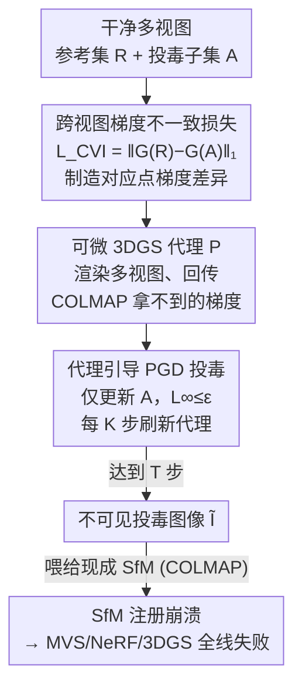

# PoInit-of-View: Poisoning Initialization of Views Transfers Across Multiple 3D Reconstruction Systems

**会议**: CVPR 2026  
**arXiv**: [2604.16540](https://arxiv.org/abs/2604.16540)  
**代码**: 无  
**领域**: AI安全 / 对抗攻击 / 3D视觉  
**关键词**: 投毒攻击, SfM 初始化, 跨视图不一致, 黑盒迁移, 3D 重建

## 一句话总结
这篇论文发现 3D 重建管线的几何核心——SfM 初始化模块本身就是一个可被攻击的"命门"：作者提出 PoInit-of-View，往多视图输入图像里注入人眼几乎不可见的扰动，专门破坏不同视图间的局部梯度一致性，使 SfM 的特征匹配崩溃、相机注册数从近百降到个位数，从而让下游 MVS/NeRF/3DGS 全线失败，且这种攻击不依赖具体重建架构、能黑盒迁移（如 3DGS→NeRF 上 PSNR 比单视图基线再多降 25.1%）。

## 研究背景与动机
**领域现状**：现代 3D 重建与新视图合成（NeRF、3DGS、MVS 等）几乎都建立在一个共同前置步骤上——用 Structure-from-Motion（SfM，典型实现 COLMAP）做几何初始化：检测关键点、跨视图特征匹配、估计相机位姿、三角化出稀疏点云，为后续稠密重建/神经优化提供几何骨架。没有可靠的 SfM 初始化，下游优化器往往压根无法收敛到一致的场景。

**现有痛点**：已有针对 3D 重建的对抗攻击（NeRFool、IL2-NeRF、Poison-Splat、GaussTrap 等）有个共同的盲点——它们把整条重建管线当作一个黑箱整体，直接对最终渲染损失反向传播对抗梯度。这样做有两个问题：一是攻击会**过拟合到具体的重建架构**（攻 NeRF 的扰动换到 3DGS 上就失效），迁移性差；二是它们只在**单视图内部**做文章，没有触及管线中真正脆弱的特定模块。

**核心矛盾**：3D 重建的所有下游表示（NeRF 的体辐射、3DGS 的高斯基元）虽然内部机制各异，却都**共享同一个几何地基 SfM**。既然如此，攻击不该去追逐五花八门的下游表示，而应该直击这个所有系统都依赖的"公约数"。但 SfM（COLMAP）是**不可微的现成流水线**，无法直接对它求梯度——这是攻击它的技术障碍。

**本文目标**：(1) 证明 SfM 几何初始化是 3D 重建管线一个根本性的对抗漏洞；(2) 设计一种不依赖下游架构、可黑盒迁移的投毒攻击；(3) 给出"为什么破坏跨视图一致性就能让 SfM 崩溃"的理论解释。

**切入角度**：作者抓住 SfM 工作的一个基本前提——**同一个 3D 点投影到不同视图上，局部外观（边缘、纹理梯度）应当近似一致**，这是描述子可重复匹配的根基。只要在不同视图上引入方向不同的、几何对齐的微小扰动，破坏这种跨视图梯度一致性，描述子就会发散、匹配就会失败、对极约束被违反、三角化出错，整条 SfM 就会因约束不足而崩溃。

**核心 idea**：用一个"跨视图梯度不一致损失"$\mathcal{L}_{\mathrm{CVI}}$ 去**主动制造**对应点在不同视图间的梯度差异，并借助一个可微的 3DGS 代理模型拿到 COLMAP 拿不到的梯度，用 PGD 优化出投毒图像——攻 SfM 这个共同地基，而非任何具体下游模型。

## 方法详解

### 整体框架
PoInit-of-View 是一个黑盒投毒攻击：攻击者拿到一组干净的多视图图像 $\mathcal{I}$ 和一个感知预算 $\varepsilon$，目标是产出一组在 $\ell_\infty$ 意义下与原图差异不超过 $\varepsilon$ 的投毒图像 $\tilde{\mathcal{I}}$，使得受害者把它喂给现成 SfM（COLMAP）时，注册图像数、三角化关键点数、稀疏 3D 点数都急剧下跌，最终拖垮 MVS/NeRF/3DGS 的重建。

整条流程要解决三个环环相扣的问题：**该往哪个方向扰**（破坏跨视图一致性而非单视图损失）、**梯度从哪来**（SfM 不可微，需要可微代理）、**怎么保证不可见**（感知正则 + 预算约束）。对应地，方法分三块：① 定义跨视图梯度不一致损失 $\mathcal{L}_{\mathrm{CVI}}$ 作为攻击方向，并配套一条从"梯度不一致→描述子发散→匹配率指数下降→SfM 崩溃"的理论链条；② 用一个可微 3DGS 代理模型 $P$ 渲染多视图、提供 COLMAP 给不了的梯度；③ 只对投毒子集 $\mathcal{A}$ 做 $\ell_\infty$ 约束的 PGD 上升，干净参考视图 $\mathcal{R}$ 保持不动当作几何参照，并每 $K$ 步刷新一次代理以跟上图像变化。

### 关键设计

**1. 跨视图梯度不一致损失 $\mathcal{L}_{\mathrm{CVI}}$：把"破坏一致性"变成可优化目标**

这是攻击的方向所在，针对的是"已有攻击只在单视图内做文章、迁移性差"的痛点。作者先用一个假设把 SfM 的工作前提形式化（Assumption 1，跨视图梯度一致性）：同一 3D 点投到两个干净视图上，其局部 Sobel 梯度 $G(I_i)=(\partial_x I_i,\partial_y I_i)$ 之差应有界，$\|G(I_i(p_i))-G(I_j(p_j))\|_1\le\tau_g$——这正是描述子能跨视图重复匹配的根基。攻击就是要**主动顶破这个界**：给定参考视图 $R_i$ 与投毒目标视图 $A_j$，最大化

$$\mathcal{L}_{\mathrm{CVI}}=\|G(R_i)-G(A_j)\|_1$$

（实践中对多对视图取平均）。与单纯把渲染结果推离 GT 的"单视图损失"不同，$\mathcal{L}_{\mathrm{CVI}}$ 显式作用在**视图之间**的梯度差上，制造的是几何对齐、跨视图各不相同的结构化扰动，而不是随机噪声——这正是它能破坏 SfM、又能跨架构迁移的根本原因。

**2. 从梯度不一致到 SfM 崩溃的理论链条：解释"为什么这样攻有效"**

作者不满足于经验上有效，还给了一条解释性的理论链（虽是 stylized 模型，但物理含义清晰）。先借局部 Lipschitz 连续假设（Assumption 2）把梯度差和描述子差挂钩：$L_r^{\min}\|G_1-G_2\|_1\le\|\phi(G_1)-\phi(G_2)\|_2\le L_r^{\max}\|G_1-G_2\|_1$。于是只要 $\mathcal{L}_{\mathrm{CVI}}\ge\tau_g+\Delta$，对应描述子就被迫发散 $\|\phi(G(R_i))-\phi(G(A_j))\|_2\ge\beta_r\Delta$（Lemma 1，$\beta_r=L_r^{\min}$）。再配上描述子轻尾分布假设（Assumption 3），匹配内点率 $\eta$ 的期望随不一致度**指数衰减**：$\mathbb{E}[\eta]\le\exp(-\alpha\beta_r\Delta)$（Lemma 2）。最终 Theorem 1 给出 SfM 崩溃条件：若位姿图生成树上 $m$ 条关键边的每对视图都被投毒到 $\mathcal{L}_{\mathrm{CVI}}\ge\tau_g+\tau_d/\beta_r+\Delta$，则全局 SfM 以至少 $1-m\exp(-\tfrac12\epsilon_c^2 N p_{\text{match}})$ 的概率失败（$p_{\text{match}}=\exp(-\alpha\beta_r\Delta)$）。这条链条还给出一个**不一致阈值** $L_{\mathrm{th}}=\tau_g+\tau_d/\beta_r$：一旦每对关键视图越过它，匹配率断崖式下跌、关键边失效、SfM 因欠约束而崩——论文用实验把这个阈值画成 Figure 9 的竖虚线验证。

**3. 代理引导的 PGD 投毒：解决 SfM 不可微、梯度无法获取的难题**

受害者的 SfM（COLMAP）是黑盒且不可微的，攻击者既看不到内部描述子/阈值，也无法直接对它求梯度。作者的破解办法是训练一个**可微的 3DGS 代理模型** $P$ 来近似受害者的跨视图行为——3DGS 渲染高效，适合大规模优化。代理渲染多视图，揭示"微小扰动如何影响跨视图几何一致性"，从而提供 COLMAP 给不了的可微梯度。优化时只更新投毒子集 $\mathcal{A}$，干净视图 $\mathcal{R}$ 不动作参照，每张投毒图按 $\ell_\infty$ 约束的 PGD 上升更新：

$$\tilde{I}_k\leftarrow\mathrm{Proj}_{\|\tilde{I}_k-I_k\|_\infty\le\varepsilon}\big(\tilde{I}_k+\alpha\,\mathrm{sign}(\nabla_{\tilde{I}_k}L)\big),\quad k\in\mathcal{A}.$$

关键的工程点是：由于 $\mathcal{L}_{\mathrm{CVI}}$ 依赖视图相关的可见性，而投毒图像在迭代中不断变化，所以**每 $K=10$ 步刷新一次代理**，让代理跟上图像外观和可见性的演化——这形成一个交替优化：内层更新投毒视图，外层轻量更新代理。整个过程用一个固定步数 $T$ 跑完（理论阈值只用来指导而非作为停机条件）。这一设计让攻击全程只碰 SfM 前端、不需要访问任何下游 NeRF/3DGS 的梯度，因而是真正"下游无关"的。

### 损失函数 / 训练策略
总优化目标是一个带感知约束的代理问题：

$$\max_{\tilde{\mathcal{I}}}\;\mathcal{L}_{\mathrm{CVI}}(\tilde{\mathcal{I}})-\lambda_{\mathrm{SSIM}}\big(1-\mathrm{SSIM}(\tilde{\mathcal{I}},\mathcal{I})\big)-\lambda_{\mathrm{TV}}\,\mathrm{TV}(\tilde{\mathcal{I}}),\quad\text{s.t. }\|\tilde{\mathcal{I}}-\mathcal{I}\|_\infty\le\varepsilon.$$

其中 SSIM 项与 TV 项负责保证扰动视觉不可察、平滑自然。关键超参（A100 40GB 上）：扰动预算 $\rho=16/255$（$\ell_\infty$），内层每视图 15 步 PGD、步长 $\alpha=2/255$、$\ell_\infty$ 球内随机初始化；外层迭代 1000 步、投毒比例 $r=0.6$；$\mathcal{L}_{\mathrm{CVI}}$ 权重组合为梯度不一致 $w_{\text{grad}}=1.0$、TV $w_{\text{tv}}=0.1$、SSIM $w_{\text{ssim}}=0.5$；代理每 $K=10$ 步刷新。所有评测都用未改动的现成 SfM 流水线，代理只用于优化阶段。

## 实验关键数据

### 主实验
数据集：NeRF-Synthetic、Tanks & Temples（T&T）、Mip-NeRF360。评测既看 SfM 内部统计（注册图像数、三角化关键点、总 3D 点），也看下游渲染质量（PSNR/SSIM/LPIPS）。下表为 T&T 上 $\rho=16/255$、3DGS 作代理时干净 vs 投毒（括号内）的平均结果：

| 下游管线 | PSNR↑ | SSIM↑ | LPIPS↓ |
|----------|-------|-------|--------|
| COLMAP (SfM+MVS) | 11.92 → 8.96（−24.8%） | 0.436 → 0.372（−14.7%） | 0.606 → 0.693（+14.4%） |
| Instant NGP (NeRF) | 21.62 → 16.24（−24.8%） | 0.712 → 0.605（−15.0%） | 0.340 → 0.440（+29.4%） |
| Mip-Splatting (3DGS 变体) | 23.93 → 17.63（−26.0%） | 0.833 → 0.684（−18.4%） | 0.166 → 0.327（+92.4%） |

三种内部表示完全不同的管线被同一组扰动均匀拖垮，印证了"下游无关"。其中 3DGS 的 LPIPS 涨幅最大（近翻倍），说明 SfM 前端的扰动会被其几何依赖的渲染进一步放大。

与基线对比（T&T，Mip-Splatting）：

| 攻击 | PSNR | SSIM |
|------|------|------|
| Clean（无攻击） | 23.93 | 0.833 |
| 高斯噪声 | 23.43 | 0.821 |
| 单视图攻击 [NeRFool/IL2-NeRF] | 23.53 | 0.819 |
| **Ours（跨视图）** | **17.63** | **0.684** |

高斯噪声和单视图攻击几乎无效（PSNR 仅掉 0.4~0.5），而跨视图投毒把 PSNR 砍掉 6.3——证明"攻 SfM 的跨视图一致性"才是要害。摘要所述黑盒迁移（如 3DGS→NeRF）比单视图基线再多降 25.1% PSNR、16.5% SSIM，量级与此一致。

SfM 稳定性（三数据集平均，Mip-Splatting；Reg. 注册率%，Triang. 三角化关键点 ×10³，3D Pts ×10⁶）：

| 数据集 | 攻击 | Reg.(%) | Triang.(k) | 3D Pts(M) | 崩溃比 |
|--------|------|---------|-----------|-----------|--------|
| NeRF-Synthetic | Clean | 98.7 | 52.3 | 2.11 | 0.00 |
| | Ours | 28.5 | 12.4 | 0.32 | **0.83** |
| Mip-NeRF360 | Clean | 96.2 | 61.7 | 2.64 | 0.00 |
| | Ours | 26.9 | 11.8 | 0.34 | **0.85** |
| Tanks & Temples | Clean | 93.5 | 73.6 | 3.07 | 0.00 |
| | Ours | 24.3 | 13.7 | 0.41 | **0.88** |

平均崩溃比 >70%，且 Ours 与"结构上界"（手动抹掉关键点/像素结构特征的理论上限）非常接近——说明这套不可见扰动几乎逼近了破坏 SfM 的极限。典型案例：T&T 的 Auditorium 场景 COLMAP 重建从 298 台相机/73k 点塌到 7 台/9k 点（注册崩溃 >80%），尽管投毒后重投影误差看似更低，几何已不可恢复。

隐蔽性（Table 4，5 个场景均值）：投毒图与干净图的 PSNR 27.8±2.6 dB、SSIM 0.86±0.06、LPIPS 0.21±0.04，扰动视觉上不可察，却足以让 SfM 注册崩溃 >80%。

### 消融实验
代理目标消融（T&T，Mip-Splatting）：

| 配置 | 投毒图 PSNR | Reg.(%) | 3D pts(K) | 下游 PSNR | 说明 |
|------|------------|---------|-----------|-----------|------|
| Full（$\mathcal{L}_{\text{CVI}}$+SSIM+TV） | 22.3 | 24.3 | 13.7 | **17.63** | 攻击最强 |
| w/o SSIM | 24.8 | 27.1 | 15.8 | 19.4 | 攻击略弱、感知略差 |
| w/o TV | 25.3 | 28.0 | 16.4 | 19.7 | 攻击略弱、感知略差 |
| Photometric-only（仅逐像素色差损失） | 28.7 | 91.2 | 71.5 | 22.8 | **几乎不破坏 SfM** |

### 关键发现
- **跨视图损失是命脉**：去掉 $\mathcal{L}_{\mathrm{CVI}}$ 只留逐像素色差的 Photometric-only 变体，SfM 注册率仍有 91.2%、下游 PSNR 22.8（接近干净），完全攻不动——证明仅最小化单视图像素差不足以制造跨视图不一致，必须显式作用在视图之间。
- **SSIM/TV 是隐蔽性与攻击力的权衡**：去掉它们会让投毒图对干净图的 PSNR/SSIM 反而更高（更"像"），但 LPIPS 变差（感知相似度下降）、攻击力也略减；完整配置在隐蔽与杀伤间最平衡。
- **扰动预算存在临界点**：$\rho$ 超过 $12/255$ 后注册率与 PSNR/SSIM 断崖式下跌，$\rho=32/255$ 时管线几乎全废——与理论阈值 $L_{\mathrm{th}}$ 的"过线即崩"预测吻合。
- **结构化扰动 vs 随机噪声**：Sobel 梯度差图显示投毒引入的是几何对齐、跨视图各异的结构化扰动，而非随机波动；正是这种"各视图扰法不同"才制造出跨视图不一致。
- **理论被实验证实**：增大 $\mathcal{L}_{\mathrm{CVI}}$ 时注册图像与三角化点单调下降并在大值处崩溃，实测的 $L_{\mathrm{th}}$ 竖线恰好对上崩溃拐点。

## 亮点与洞察
- **"攻地基而非攻楼层"的视角转换**：以往攻击盯着 NeRF/3DGS 各异的下游表示，本文指出它们共享同一个 SfM 几何地基，于是攻这个"最大公约数"——一举获得跨架构（MVS/NeRF/3DGS 通吃）、黑盒可迁移的攻击。这个"找系统命门"的思路可迁移到任何有共享前置模块的复杂管线。
- **把攻击方向写成一个可优化的物理量**：$\mathcal{L}_{\mathrm{CVI}}=\|G(R_i)-G(A_j)\|_1$ 直接对应 SfM 赖以工作的"跨视图梯度一致性"假设，既可微可优化，又有清晰几何含义，避免了"对最终损失盲目反传"的过拟合。
- **用可微 3DGS 代理绕过不可微 SfM**：这是攻黑盒几何流水线的关键工程 trick——找一个可微、能反映同类跨视图行为的代理拿梯度，并周期性刷新代理跟上图像演化，可推广到其他不可微视觉系统的攻击/审计。
- **理论与阈值可验证**：从梯度不一致一路推到匹配率指数衰减、再到 SfM 崩溃概率与显式阈值 $L_{\mathrm{th}}$，并用实验把阈值画出来对齐崩溃拐点——比纯经验攻击更有说服力。

## 局限与展望
- **作者承认**：跨异构 SfM 实现（不同关键点/匹配后端）的迁移性尚待研究；防御方向（鲁棒特征匹配、带对抗正则的位姿优化）留作未来工作。
- **理论是 stylized 模型**：多处假设（局部 Lipschitz、描述子轻尾分布、关键点近似独立）是为推导可解释性而做的简化，$L_{\mathrm{th}}$ 是"有物理意义"的近似阈值而非严格保证；多处细节推到 Appendix，正文未给 $L_{\mathrm{th}}$ 数值。⚠️ 部分常数（$\tau_g,\tau_d,\beta_r$）的估计过程以原文附录为准。
- **依赖可微代理的保真度**：攻击力建立在 3DGS 代理能近似受害 SfM 跨视图行为的前提上；若受害系统采用与代理差异很大的几何后端，迁移性可能下降（作者也将此列为开放问题）。
- **预算偏大**：$\rho=16/255$ 才显著见效、需 $>12/255$ 才过临界点，比典型 2D 分类对抗攻击的预算大；虽 LPIPS 仍低，但放大差异图可见明显边缘扰动，未必在所有审视下"完全不可见"。

## 相关工作与启发
- **vs NeRFool / IL2-NeRF（单视图 NeRF 攻击）**：它们在白盒下需访问模型损失与相机参数，且只破坏单视图内特征；本文是黑盒、不碰下游梯度、显式制造跨视图不一致，迁移性与通用性都更强（实验里单视图攻击几乎无效，PSNR 仅掉 0.4）。
- **vs Poison-Splat / GaussTrap（3DGS 攻击）**：Poison-Splat 投毒稠密化过程造成基元爆炸/显存耗尽（DoS 效果），GaussTrap 植入隐蔽后门触发定向渲染失败——二者都绑定 3DGS 这个具体表示；本文攻所有系统共享的 SfM 前端，因而下游无关、可跨 MVS/NeRF/3DGS 迁移。
- **启发**：复杂 AI 管线的安全性应优先审计"被广泛复用的共享前置模块"（这里是 SfM），它往往是迁移性攻击的最佳着力点；防御侧则提示需要把对抗鲁棒性引入几何初始化阶段（鲁棒匹配、带对抗正则的 BA），而不只是加固下游表示。

## 评分
- 新颖性: ⭐⭐⭐⭐⭐ 首次指出并系统攻击 SfM 初始化这一被忽视的共享几何命门，视角与可迁移性都有突破。
- 实验充分度: ⭐⭐⭐⭐ 三数据集、三类下游管线、SfM 内部统计+下游质量双维度、隐蔽性与多项消融齐全；但缺真实跨 SfM 后端迁移、防御实验只在附录。
- 写作质量: ⭐⭐⭐⭐ 动机与理论链条清晰、图表到位；部分关键数值（$L_{\mathrm{th}}$、常数估计）推到附录略影响自洽阅读。
- 价值: ⭐⭐⭐⭐⭐ 揭示 3D 重建管线一个根本性、可迁移的安全漏洞，对自动驾驶/AR-VR/机器人等安全攸关应用有直接警示意义。

## 评分
- 新颖性: 待评
- 实验充分度: 待评
- 写作质量: 待评
- 价值: 待评

<!-- RELATED:START -->

## 相关论文

- [\[CVPR 2026\] RAVEN: Erasing Invisible Watermarks via Novel View Synthesis](raven_erasing_invisible_watermarks_via_novel_view_synthesis.md)
- [\[CVPR 2026\] RemedyGS: Defend 3D Gaussian Splatting Against Computation Cost Attacks](remedygs_defend_3d_gaussian_splatting_against_computation_cost_attacks.md)
- [\[CVPR 2026\] Red-teaming Retrieval-Augmented Diffusion Models via Poisoning Knowledge Bases](red-teaming_retrieval-augmented_diffusion_models_via_poisoning_knowledge_bases.md)
- [\[AAAI 2026\] Generalizing Fair Clustering to Multiple Groups: Algorithms and Applications](../../AAAI2026/ai_safety/generalizing_fair_clustering_to_multiple_groups_algorithms_and_applications.md)
- [\[CVPR 2026\] Towards Stealthy and Effective Backdoor Attacks on Lane Detection: A Naturalistic Data Poisoning Approach](towards_stealthy_and_effective_backdoor_attacks_on_lane_detection_a_naturalistic.md)

<!-- RELATED:END -->
