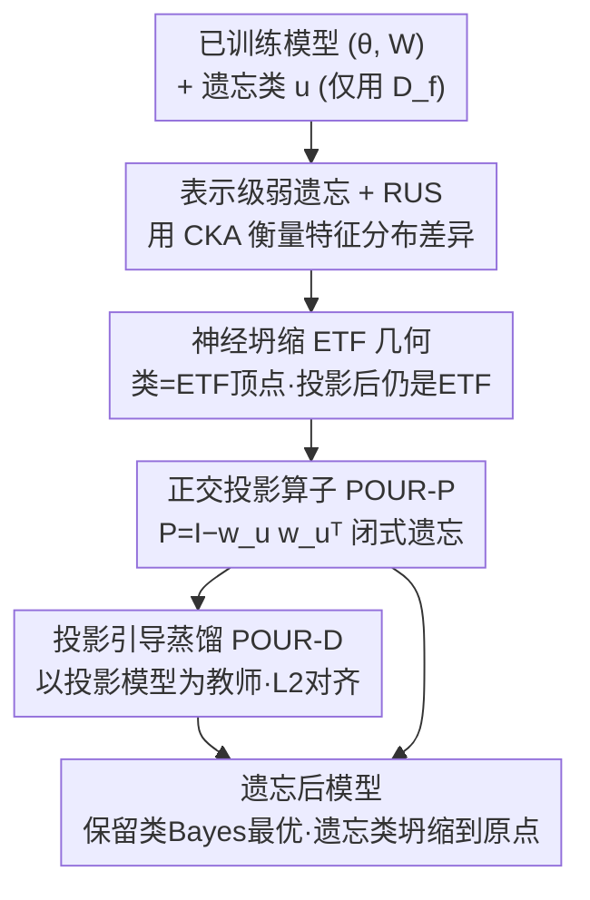

# POUR: A Provably Optimal Method for Unlearning Representation via Neural Collapse

**会议**: CVPR 2026  
**论文**: [CVF Open Access](https://openaccess.thecvf.com/content/CVPR2026/html/Le_POUR_A_Provably_Optimal_Method_for_Unlearning_Representation_via_Neural_CVPR_2026_paper.html)  
**代码**: https://github.com/ale256/representation_unlearning  
**领域**: AI 安全 / 机器遗忘 / 表示学习  
**关键词**: 机器遗忘, 神经坍缩, 单纯形ETF, 正交投影, 表示级遗忘

## 一句话总结
本文把机器遗忘从"改分类头"推进到"改特征表示"层面，基于神经坍缩（Neural Collapse）理论证明"删掉一个单纯形 ETF 顶点再做正交投影后仍是单纯形 ETF"，从而把"遗忘某一类"实现为一个有最优性保证的闭式投影算子 POUR，在 CIFAR-10/100 与 PathMNIST 上同时在分类级和表示级指标上超过现有遗忘方法。

## 研究背景与动机
**领域现状**：机器遗忘（machine unlearning）想在不从头重训的前提下，让模型"忘掉"某些训练数据或某个视觉概念，以满足"被遗忘权"等隐私合规需求。主流做法属于**弱遗忘（weak unlearning）**：只要让遗忘集和保留集上的输出 logits 分布与重训模型难以区分，就算遗忘成功。

**现有痛点**：近期研究发现，这类方法常常只扰动了分类器的 logits，**底层特征表示几乎没动**。结果是"忘得很浅"——被遗忘类的信息仍残留在编码器特征里，可以通过线性探测（linear probing）或特征反演（feature inversion）重新恢复，造成隐私泄漏。对深层视觉编码器尤其危险。

**核心矛盾**：遗忘的真正战场在**表示空间**，而不是输出层。但既有方法既缺乏在表示层面衡量遗忘程度的指标，也缺乏在表示层面执行遗忘的、有理论保证的算子；少数尝试"投影即遗忘"的工作（如基于 SVD 的激活分解）缺乏几何一致性和最优性证明。

**本文目标**：(1) 给出表示级的弱遗忘定义与可计算指标；(2) 刻画遗忘过程中"遗忘充分性 / 保留保真度 / 类间可分性"三者的相互作用；(3) 提出一个在表示层面可证明最优的遗忘算子。

**切入角度**：作者注意到深度分类器在训练收敛末期（Terminal Phase of Training）会出现**神经坍缩**——同类特征收缩到等距质心、分类器权重排成一个**单纯形等角紧框架（simplex ETF）**，每一类恰好对应 ETF 的一个方向向量。那么"遗忘某一类"在几何上就等价于"从表示空间里删掉它对应的那条向量"。

**核心 idea**：把"遗忘第 $u$ 类"实现为**沿该类方向的正交投影** $P=I-w_uw_u^\top/\|w_u\|^2$；并证明删掉一个 ETF 顶点、把其余顶点投影到正交子空间后，仍构成一个低一维的单纯形 ETF——于是遗忘后保留类的最优几何被完整保住，遗忘类则坍缩到原点。

## 方法详解

### 整体框架
POUR 的输入是一个已训练好的视觉分类模型（特征提取器 $\theta$ + 分类头 $W$）和要遗忘的类 $u$（实践中只允许访问遗忘集 $D_f$，不能碰保留集 $D_r$），输出是一个忘掉了 $u$ 类、但在其余类上仍接近重训模型的新模型。整套方法围绕一条几何主线：先用 RUS 指标把"遗忘到底有没有发生在表示层"量化出来，再用神经坍缩理论说明"投影掉一个 ETF 顶点"为什么是最优的，最后给出闭式版（POUR-P）和蒸馏版（POUR-D）两种落地方式。

POUR-P 是一步到位的闭式投影，直接作用在特征上、立刻生效但只改"事后特征"；POUR-D 则把这个投影后的模型当作教师，用 L2 蒸馏把遗忘"压进"特征提取器本身，只需遗忘集就能更新编码器。

### 关键设计

**1. 表示级弱遗忘 + RUS 指标：把"遗忘"从 logits 搬到特征空间并量化**

传统弱遗忘只看输出 logits 是否与重训模型一致，于是"浅遗忘"能蒙混过关。本文把弱遗忘**重定义到表示层**（定义 2.1）：要求遗忘后模型的特征分布 $P_z^{U(M,D_f)}$ 与重训参考模型 $M_r$ 的特征分布在某种分布差异度量 $K$（MMD / Wasserstein-2 / Energy Distance）下足够接近。为了让这个比较对随机初始化、特征基旋转、整体缩放都稳健，作者用**中心化核对齐（CKA）**作为实际估计量：$\mathrm{CKA}(X,Y)=\frac{\langle XX^\top,YY^\top\rangle_F}{\|XX^\top\|_F\|YY^\top\|_F}$，它对缩放和旋转不变。

在此基础上定义**表示遗忘分数（Representation Unlearning Score, RUS）**：它是"遗忘指示量 $\Phi_f$"和"保留对齐度 $\mathrm{CKA}_r$"的调和平均
$$\mathrm{RUS}^{(*)}=\frac{2\,\Phi_f^{(*)}\,\mathrm{CKA}_r^{(*)}}{\Phi_f^{(*)}+\mathrm{CKA}_r^{(*)}},\quad *\in\{(o),(r)\}$$
其中 $\Phi_f^{(o)}=1-\mathrm{CKA}_f^{(o)}$、$\Phi_f^{(r)}=\mathrm{CKA}_f^{(r)}$。上标 $(o)$ 表示与原始模型比（实践中总能拿到），$(r)$ 表示与重训模型比（理论理想，但重训昂贵）。RUS 取值在 $[0,1]$，只有**既忘得干净、又保留得忠实**时才高——单靠破坏全部表示来"忘"会同时拉低保留对齐度，因此这个调和平均天然惩罚了"误伤保留类"的暴力遗忘。

**2. 三项分解：揭示"遗忘充分性 / 保留保真 / 类间可分性"的相互作用**

作者用全概率公式把遗忘特征分布写成 $P_z^{(f)}=\alpha P_u^{(f)}+(1-\alpha)P_{\neg u}^{(f)}$（$\alpha$ 是模型把样本判成遗忘类 $u$ 的概率），重训分布同理（其 $\beta=0$）。命题 2.2 证明遗忘与重训特征分布的差异 $K(P_z^{(f)},P_z^{(r)})$ 可被上界分解为三项：**类间可分项** $|\alpha-\beta|\Delta_c$、**遗忘类差异项** $\alpha K(P_u^{(f)},P_u^{(r)})$、**保留类差异项** $(1-\alpha)K(P_{\neg u}^{(f)},P_{\neg u}^{(r)})$，其中 $\Delta_c=K(P_u^{(r)},P_{\neg u}^{(r)})$ 衡量重训空间里遗忘类与保留类的可分性。

这个分解给出一个直接可用的洞察：遗忘时 $\alpha$ 从约 1 逐渐降到 0，类间可分项简化为 $\alpha\Delta_c$。也就是说，**重训特征空间里类间几何分得越开（$\Delta_c$ 越大），早期阶段的遗忘监督越有效**，仅用遗忘集就能完成遗忘；反之当类高度纠缠（如 CIFAR-100）时，"只用遗忘集"的策略会变弱——这一预测后续被实验证实（CIFAR-100 上 $\mathrm{CKA}_f^{(r)}$ 偏高、遗忘更难）。

**3. 神经坍缩两条新性质：ETF ⟺ Bayes 最优 + 投影后仍是 ETF**

这是 POUR 的理论地基。作者在神经坍缩既有框架上证明了两条**新性质**。其一（命题 3.1）：在各类条件分布为各向同性高斯 $x\mid y=i\sim\mathcal{N}(v_i,\sigma^2 I_d)$ 的假设下，单纯形 ETF 不只是优化的产物，更是**Bayes 最优的充分条件**——它唯一地最大化类均值间最小成对夹角，并在 $\sigma^2\to0$ 极限下使最近类均值分类器与 Bayes 最优分类器重合。换言之 ETF 结构本身就是一张"最优性证书"。

其二（命题 3.2，关键）：固定一个顶点 $u$，令 $P=I-v_uv_u^\top$ 为投影到 $v_u^\perp$ 的正交投影，对 $i\neq u$ 定义 $g_i=Pv_i/\|Pv_i\|$，则 $\{g_i\}$ 在低一维子空间里**仍构成一个大小为 $C-1$ 的单纯形 ETF**（$g_i^\top g_j=-\frac{1}{C-2}$）。几何直觉就是 Figure 2：删掉正四面体的一个顶点、把另外三个投影到底面，得到一个正三角形。正是这个"投影不变性"保证了遗忘掉某类后，**保留类之间的完美角分离丝毫不损**。

**4. 投影算子 POUR-P 与蒸馏版 POUR-D：闭式遗忘 + 把遗忘压进编码器**

把上面两条性质落到算法。**POUR-P**（闭式）：对要遗忘的类 $u$，用分类器权重列 $w_u$ 构造正交投影 $P=I-\frac{w_uw_u^\top}{\|w_u\|^2}$，遗忘特征即 $z'=Pz$，瞬间完成、无需训练。当拿不到分类器权重（如纯视觉编码器或 VLM）时，用遗忘集的经验类均值 $\tilde w_u=\frac{1}{|D_u|}\sum_{x\in D_u}\theta_o(x)$ 来估计投影方向。定理 4.2 证明 POUR-P 在保留类上 Bayes 最优、且与重训模型在正交规范自由度下表示等价，使表示级差异在定义 2.1 意义下取到最小；同时 $Pv_u=0$ 让遗忘类特征坍缩到原点、退化为保留类上的均匀预测（$\alpha=0$）。

但 POUR-P 只改"事后特征"，没动编码器本身。**POUR-D**（蒸馏）因此把投影后的模型 $(P\theta,W)$ 当作**教师**，让学生编码器 $\theta_s$ 仅在遗忘集上用 L2 损失对齐教师：$\mathcal{L}_{\text{POUR-D}}(x)=\|\theta_s(x)-P\theta(x)\|_2^2,\ x\in D_f$。由于 ETF 几何被投影保住，这个损失等于把"投影后的 ETF 特征"作为目标灌进编码器参数，从而把遗忘**真正传播进特征提取器**。命题 4.1 保证 L2 收敛蕴含 CKA 收敛（$\|Z-T\|_F\to0\Rightarrow\mathrm{CKA}(Z,T)\to1$），即蒸馏对齐确实带来表示对齐。

### 损失函数 / 训练策略
POUR-P 不涉及训练，是闭式投影。POUR-D 仅在遗忘集 $D_f$ 上微调特征提取器，目标为 L2 特征对齐损失 $\mathcal{L}_{\text{POUR-D}}=\|\theta_s(x)-P\theta(x)\|_2^2$，教师为投影后的 POUR-P 模型，分类头 $W$ 保持不变；遵循"无保留集访问、不干预原训练流程"的标准遗忘协议。

## 实验关键数据

主干：CIFAR-10/100 用改造版 ResNet-18（把 7×7 stride-2 首卷积换成 3×3 stride-1 并去掉随后的 max-pooling 以适配 32×32），PathMNIST 用 ImageNet 预训练的 ViT-S/16 + 微调分类头。对比 Finetune、FCS、Random Label、Gradient Ascent、Boundary Shrink/Expand、DELETE 等。Original / Retrained 作下界 / 上界参考。

**核心指标定义**：AUS（Adaptive Unlearning Score）$=\frac{1-\text{drop}_r}{1+\text{acc}_f}$，联合衡量保留精度下降与遗忘类残留精度，越高越好；rMIA 为表示级成员推断攻击成功率（越低越好）；RUS 见上文（越高越好）；$\text{Acc}_f$ 越低、$\text{Acc}_r$ 越高越好。

### 主实验

CIFAR-10 上（ResNet-18，三次运行均值），"仅用遗忘集"组里 POUR 在分类级 AUS 与表示级 RUS 上均最佳：

| 方法 | Acc_r ↑ | Acc_f ↓ | AUS ↑ | RUS(r) ↑ | rMIA ↓ |
|------|---------|---------|-------|----------|--------|
| Original | 94.47 | 95.03 | 0.51 | 0.42 | 56.70 |
| Retrained（上界） | 94.68 | 0.00 | 1.00 | 1.00 | – |
| Gradient Ascent | 86.71 | 15.37 | 0.80 | 0.29 | 50.40 |
| Boundary Shrink | 85.30 | 12.33 | 0.81 | 0.42 | 53.07 |
| DELETE | 88.73 | 2.43 | 0.92 | 0.39 | 53.43 |
| **POUR-P (ours)** | **94.97** | **0.00** | **1.01** | – | 56.67 |
| **POUR-D (ours)** | 92.86 | 0.37 | 0.97 | **0.47** | 51.80 |

> POUR-P 不修改编码器表示，故表示级指标省略（保持不变）。

在更难、类间更纠缠的 CIFAR-100 上结论一致：POUR-P 的 AUS 达 1.00（Acc_r 77.65 / Acc_f 0.00），POUR-D 的 RUS(r) 0.65 优于所有仅用遗忘集的基线（如 DELETE 0.58、Boundary Shrink 0.62）。PathMNIST（ViT，含内/外测试集域偏移）上 POUR 同样 SOTA：POUR-D 在外测 RUS(o) 达 0.61，且内/外测表现一致，而 Random Label / Gradient Ascent 在内测高、外测掉，被作者诊断为"学会遮盖遗忘集"而非真正擦除。

### 消融 / 泛化实验

| 配置 / 场景 | 关键指标 | 说明 |
|------|---------|------|
| POUR-P vs POUR-D | AUS 1.01 vs 0.97；RUS(r) – vs 0.47 | P 闭式、分类级最优但不改表示；D 把遗忘压进编码器、表示级更优 |
| NC 假设验证（Fig.5） | 经验平均成对夹角 ≈ 理想 ETF 角 | 三个数据集上标准训练自然达到 NC 几何，POUR 前提成立 |
| 跨模态 CLIP-L/14（ImageNet） | Bison: Acc_f 100→6（−94），Acc_r +0.43 | 删文本嵌入即可遗忘对应类，几乎不伤其余类 |
| 语义分割 VOC2012（DeepLabV3+） | Cat: IoU_f 93.55→0（−93.55），IoU_r −7.43 | 投影原理可迁移到分割，遗忘类 IoU 归零、保留类基本保住 |

### 关键发现
- **遗忘到底有没有发生在表示层是关键**：DELETE 等方法分类级 Acc_f 已很低，但表示级 RUS / CKA 显示残留信息仍在，POUR 同时压低分类级和表示级指标，t-SNE 上其表示结构最接近重训"金标"模型。
- **类间可分性决定"仅用遗忘集"的可行性**：CIFAR-100 类纠缠（$\mathrm{CKA}_f^{(r)}$ 高）使遗忘监督变弱、更难，与命题 2.2 的 $\alpha\Delta_c$ 预测吻合。
- **几何原理具普适性**：同一套投影思路无缝迁移到 VLM 跨模态遗忘与语义分割，说明 POUR 依赖的是表示几何而非特定任务结构。

## 亮点与洞察
- **把"遗忘"几何化**：用神经坍缩把"忘掉一类"翻译成"删掉一个 ETF 顶点 + 正交投影"，并证明投影后仍是 ETF——这让遗忘第一次有了闭式、可证明最优的算子，而非启发式。是最让人"啊哈"的点。
- **RUS 指标本身可复用**：用 CKA 调和平均同时刻画"忘干净"与"留得住"，可作为任何表示级遗忘工作的统一评测，比只看 logits 的弱遗忘更难被"浅遗忘"蒙混。
- **三项分解给出可操作的难度预判**：$\alpha\Delta_c$ 说明"类间越可分越好遗忘"，可指导何时该引入额外监督，思路可迁移到其他"按集合删除知识"的问题。
- **闭式 + 蒸馏双形态**：POUR-P 零训练即时遗忘适合快速合规，POUR-D 把遗忘压进编码器更鲁棒，二者按需选用。

## 局限与展望
- **强依赖神经坍缩假设**：理论建立在 ETF 几何与各向同性高斯类条件分布上，需要充分过参数化和训练到收敛末期；当 NC 不成立或类高度纠缠（如 CIFAR-100）时遗忘变难。
- **主要面向"按类遗忘"**：方法围绕"删除一个类方向"展开，对子概念、单样本、虚假相关等更细粒度遗忘是否同样最优，文中未充分展开。
- **分割上保留类有可见代价**：VOC2012 上遗忘类 IoU 归零的同时，保留类 IoU 出现 1–7 点下降，说明强类不平衡场景下"只伤目标类"并非完全无副作用。
- **改进方向**：把投影最优性推广到非各向同性 / 非平衡类先验，或与持续学习 / 隐私审计联动，做更细粒度的表示级遗忘。

## 相关工作与启发
- **vs 弱遗忘（logits 对齐，如 Random Label / Gradient Ascent）**：他们对齐输出分布，本文对齐表示分布；区别在于前者常只扰动分类头、底层特征残留可被线性探测恢复，POUR 直接在表示几何上动刀，rMIA 与表示级 CKA 都更接近重训模型。
- **vs DELETE 等仅用遗忘集的强基线**：DELETE 也追求跨域一致的真遗忘，但缺乏几何最优性保证；POUR 用 ETF 投影不变性给出闭式最优算子，在 AUS 与 RUS 上同时领先。
- **vs 基于 SVD 的"投影即遗忘"**：先前工作在激活空间用 SVD 分解做投影，缺乏几何一致性与理论保证；POUR 把投影锚定在神经坍缩的 ETF 结构上，证明了投影后保留类几何完整保持且 Bayes 最优。

## 评分
- 新颖性: ⭐⭐⭐⭐⭐ 首次用神经坍缩把按类遗忘几何化为可证明最优的正交投影，并给出表示级指标 RUS
- 实验充分度: ⭐⭐⭐⭐ CIFAR/PathMNIST + CLIP 跨模态 + VOC 分割覆盖广，但数据集规模偏小、主战场仍是分类
- 写作质量: ⭐⭐⭐⭐ 理论—算法—实验主线清晰，命题与定理串联紧凑，部分证明放附录
- 价值: ⭐⭐⭐⭐ 为表示级遗忘提供了可证明、可评测的统一框架，对隐私合规与基础模型遗忘有实际意义

<!-- RELATED:START -->

## 相关论文

- [\[CVPR 2026\] POUR: A Provably Optimal Method for Unlearning Representations via Neural Collapse](pour_a_provably_optimal_method_for_unlearning_representations_via_neural_collaps.md)
- [\[CVPR 2026\] Roots Beneath the Cut: Uncovering the Risk of Concept Revival in Pruning-Based Unlearning for Diffusion Models](roots_beneath_the_cut_uncovering_the_risk_of_concept_revival_in_pruning-based_un.md)
- [\[CVPR 2026\] Unlearning without Forgetting: Securely Removing Targeted Concepts from Large-Scale Vision-Language Open-Vocabulary Detectors](unlearning_without_forgetting_securely_removing_targeted_concepts_from_large-sca.md)
- [\[CVPR 2026\] FedMOP: Achieving Enhanced Privacy and Performance in Federated Learning via Momentum Orthogonal Projection](fedmop_achieving_enhanced_privacy_and_performance_in_federated_learning_via_mome.md)
- [\[CVPR 2026\] Forensic-Friendly Image Manipulation via Controllable Latent Diffusion](forensic-friendly_image_manipulation_via_controllable_latent_diffusion.md)

<!-- RELATED:END -->
