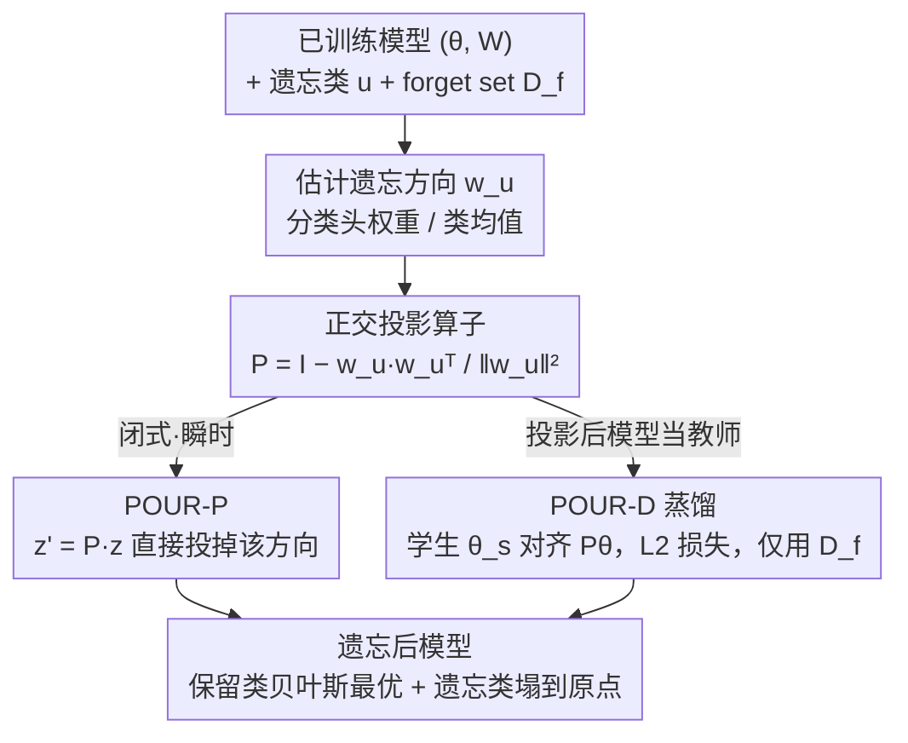

# POUR: A Provably Optimal Method for Unlearning Representations via Neural Collapse

**会议**: CVPR 2026  
**arXiv**: [2511.19339](https://arxiv.org/abs/2511.19339)  
**代码**: https://github.com/ale256/representation_unlearning (有)  
**领域**: AI安全 / 机器遗忘 / 隐私保护  
**关键词**: 机器遗忘、表征级遗忘、Neural Collapse、ETF、正交投影

## 一句话总结
针对现有机器遗忘只改分类头、特征里仍残留被遗忘类信息的问题，本文把"遗忘"提升到表征层面，借助 Neural Collapse 的 simplex-ETF 几何证明"去掉一个类 = 沿其方向做正交投影后 ETF 依然是 ETF"，由此给出闭式投影算子 POUR-P 和蒸馏变体 POUR-D，在 CIFAR-10/100、PathMNIST 上同时刷新分类级和表征级遗忘指标，并形式化证明其在表征级弱遗忘定义下是最优的。

## 研究背景与动机

**领域现状**：机器遗忘（machine unlearning）要在不从头重训的前提下，从已训练模型里抹掉特定类/样本/概念的影响——动机来自"被遗忘权"等隐私法规、去除虚假相关、以及在医疗/自动驾驶等敏感场景安全部署大模型。主流做法属于 **weak unlearning（弱遗忘）**：只要求遗忘后模型在 forget set 和 retain set 上输出的 logits 分布与重训模型不可区分。

**现有痛点**：最近的研究（kim2025arewe）发现，这类只对齐最终 logits 的方法**并没有真正遗忘**——它们往往只扰动了分类头的输出，底层特征表征几乎原封不动。结果是被遗忘类的信息仍残留在特征里，可以通过 linear probing、特征反演（feature inversion）重新读出来，造成隐私泄露。对内部表征会泄露视觉概念的深层视觉编码器，这个问题尤其致命。

**核心矛盾**：遗忘必须发生在**特征表征层**而不只是输出层，但表征层遗忘缺一个能"量化遗忘了多少 + 保留了多少"的原则性指标，也缺一个有理论保证、不会顺手破坏保留类几何结构的遗忘算子。此前 kodge2024deep 用 SVD 在激活空间做"投影即遗忘"是启发式的，没有几何一致性和理论保证。

**本文目标**：(1) 把弱遗忘的定义从 logits 层扩展到表征层，并给出可计算的度量；(2) 找到一个既能彻底删掉 forget 类、又能证明性保留 retain 类最优几何的遗忘算子。

**切入角度**：作者注意到深度分类器在训练收敛期会呈现 **Neural Collapse（NC）**——每个类的特征塌缩到一个等距质心，分类器权重排成一个 **simplex 等角紧框架（Equiangular Tight Frame, ETF）**，每个类对应 ETF 的一条方向。那么"遗忘一个类"就自然对应"从表征空间里删掉它那条向量"。

**核心 idea**：把类遗忘实现成一个**沿被遗忘类方向的正交投影**——作者证明 simplex ETF 删掉一个顶点、向其正交补投影后，剩下的类仍然构成一个低一维的 simplex ETF，因此投影既能让被遗忘类的特征塌到原点，又能完美保留保留类之间的最优角度分离，是"可证明最优"的遗忘算子。

## 方法详解

### 整体框架
POUR 的输入是一个已训练好的模型 $(\theta, W)$（特征提取器 + 分类头）、要遗忘的类 $u$、以及只含被遗忘类样本的 forget set $\mathcal{D}_f$（**全程不访问 retain set**）；输出是一个遗忘后的模型，它对 $u$ 给出均匀预测、对保留类仍是贝叶斯最优。整条管线分三步：先从分类头权重 $w_u$（或在只有编码器时用类均值）估出被遗忘类的方向，构造一个把这条方向投掉的正交投影算子 $P$；然后分两个变体落地——**POUR-P** 直接把 $P$ 接在特征后面做闭式一次性遗忘（瞬时、无需训练），**POUR-D** 则把投影后的模型当**教师**、用 L2 蒸馏把"遗忘"压进学生编码器的参数里（只用 forget set），让遗忘更深、更鲁棒。最后由 NC 几何保证遗忘后的表征与重训模型只差一个正交变换，从而在表征级弱遗忘定义下取到最优。

### 关键设计

**1. 表征级弱遗忘定义 + RUS 度量：把"是否真遗忘"量化到特征层**

传统弱遗忘只看最终 logits 分布，给了"假遗忘"可乘之机。作者把定义改写到特征层：遗忘算子 $\mathcal{U}$ 被认为满足**表征级弱遗忘**，当遗忘后模型的特征分布与重训参考模型 $M_r$ 足够接近，即 $\mathcal{K}(P_z^{\mathcal{U}}, P_z^{M_r}) < \epsilon$（$\mathcal{K}$ 可取 MMD / Wasserstein-2 / Energy Distance）。由于训练有随机性（随机初始化、特征基旋转、尺度缩放），直接比特征分布不稳，于是用对旋转和缩放不变的 **CKA（Centered Kernel Alignment）** 作为实际估计：$\text{CKA}(X,Y)=\frac{\langle XX^\top, YY^\top\rangle_F}{\|XX^\top\|_F\,\|YY^\top\|_F}$。

在此基础上定义核心指标 **Representation Unlearning Score（RUS）**，它是"遗忘指示量 $\Phi_f$"和"保留对齐度 $\text{CKA}_r$"的调和平均：

$$\text{RUS}^{(*)} := \frac{2\,\Phi_f^{(*)}\,\text{CKA}_r^{(*)}}{\Phi_f^{(*)} + \text{CKA}_r^{(*)}}, \quad (*)\in\{(o),(r)\}$$

其中以原模型为参照时 $\Phi_f^{(o)}=1-\text{CKA}_f^{(o)}$（与原模型在 forget 集上越不像、遗忘越好），以重训模型为参照时 $\Phi_f^{(r)}=\text{CKA}_f^{(r)}$（与重训模型越像越好）。RUS 取值在 $[0,1]$，只有同时做到"forget 集特征改变 + retain 集特征不变"才会高，单方面作弊（只删特征或只保结构）都会被调和平均拉低。$(r)$ 版需要重训模型作参照是理论理想值，$(o)$ 版用原模型作参照是实用代理。

**2. 两条新 NC 性质：把 ETF 几何从"训练副产品"升级成"遗忘的理论地基"**

以往把 simplex ETF 只当训练动力学的描述性极限，本文证明它有两条可用于遗忘的新性质。其一，**ETF ⇒ 贝叶斯最优**：在类条件特征服从各向同性高斯 $x\mid y{=}i \sim \mathcal{N}(v_i, \sigma^2 I_d)$ 的假设下，simplex ETF 唯一地最大化类均值间最小成对夹角、最大化最近类均值分类器的多类角间隔，且在 $\sigma^2\to 0$ 极限下其决策规则与贝叶斯最优分类器重合——也就是说 ETF 结构本身是一张"最优性证书"。其二，**投影不变性**：固定要遗忘的类 $u$，令 $P=I-v_u v_u^\top$ 是到 $v_u^\perp$ 的正交投影，对 $i\neq u$ 定义 $g_i = Pv_i/\|Pv_i\|$，则 $\{g_i\}$ 在低一维空间里仍是一个大小为 $C{-}1$ 的 simplex ETF，满足 $g_i^\top g_j = -\frac{1}{C-2}$。几何直觉是：删掉正四面体（$C{=}4$）的一个顶点、把其余顶点投到正交补，得到的是一个更小的等边三角形。正是这条不变性保证了"用投影遗忘一个类，剩下类之间的完美角度分离一点不丢"。

**3. POUR-P 投影算子：闭式、瞬时、无需训练的遗忘**

要遗忘类 $u$，直接用分类头权重 $w_u$ 构造正交投影算子

$$P = I - \frac{w_u w_u^\top}{\|w_u\|^2}$$

遗忘后特征即 $z' = Pz$，把被遗忘类方向的分量整条投掉。由性质 2 的投影不变性，这一步把特征映到 $(C{-}1)$ 类的 simplex ETF 子空间，保留类的最优几何原样保留，而被遗忘类的特征塌向原点、对应均匀预测。当分类头权重拿不到（例如只有视觉-语言模型的编码器）时，用 forget 集上倒数第二层特征的经验类均值 $\tilde{w}_u = \frac{1}{|\mathcal{D}_u|}\sum_{x\in\mathcal{D}_u}\theta_o(x)$ 来估 $w_u$。整个过程是一次矩阵运算，遗忘瞬时完成。它的局限是只在特征后面"事后"投影，没动编码器本身。

**4. POUR-D 投影引导蒸馏：把遗忘压进编码器参数，更深更鲁棒**

为了让遗忘真正进到特征提取器、而不只是事后挂一个投影，POUR-D 引入教师-学生蒸馏：**教师就是投影后的 POUR-P 模型** $(P\theta, W)$，它已经把"遗忘后的 ETF 几何"编码进了表征；学生只在 forget set 上微调编码器参数去对齐教师，损失是逐样本的 L2：

$$\mathcal{L}_{\text{POUR-D}}(x) = \|\theta_s(x) - P\theta(x)\|_2^2, \quad x\in\mathcal{D}_f$$

由于 NC 下类均值构成 simplex ETF、分类头与之对齐，而投影保住了保留类的 ETF 结构，这个 L2 损失等价于惩罚学生偏离"投影后的 ETF 特征"，迫使学生在方向和尺度上都贴合教师，只需对编码器做很小的更新。作者还证明（Prop 4.1）行中心化后 $\|Z-T\|_F\to 0$ 蕴含 $\text{CKA}(Z,T)\to 1$，即 L2 收敛保证了 CKA 收敛——把"对齐 L2"和"表征级遗忘度量 CKA/RUS"在理论上接上了。

### 损失函数 / 训练策略
- POUR-P：无训练，闭式一次投影，$z'=Pz$。
- POUR-D：教师=投影模型 $(P\theta,W)$；学生在 $\mathcal{D}_f$ 上以 $\mathcal{L}_{\text{POUR-D}}=\|\theta_s(x)-P\theta(x)\|_2^2$ 微调编码器，**全程只用 forget set，不碰 retain set**。
- 最优性（Thm 4.2）：在 NC + 平衡先验 + 各向同性高斯假设下，POUR-P 投影后 (a) 保留类构成 simplex ETF，与重训模型只差正交变换（任何对正交变换/缩放不变的 $\mathcal{K}$ 给出 $\mathcal{K}(P_{\neg u}, Q_{\neg u})=0$）、且贝叶斯最优；(b) 因 $Pv_u=0$，被遗忘类特征 $\sim\mathcal{N}(0,\sigma^2 P)$，在 $\sigma^2\to 0$ 时塌到原点、对保留类给出均匀分布（$\alpha=0$）。故表征级判别 $\mathcal{K}$ 取到 Def 2.1 下的最小值。

## 实验关键数据

设置：CIFAR-10/100 用改造版 ResNet-18（首层 7×7 stride-2 卷积换成 3×3 stride-1 并去掉 maxpool 以适配 32×32 输入），PathMNIST 用 ImageNet 预训练 ViT-S/16 + 分类头。协议遵循近期 unlearning 标准设定：遗忘时**不访问 retain set**、不干预原训练。Original / Retrained 模型分别作下界/上界。

### 主实验

ResNet-18 / CIFAR-10（节选 forget-set-only 方法 + 参照）：

| 方法 | Acc$_r$↑ | Acc$_f$↓ | AUS↑ | rMIA↓ | RUS$^{(o)}$↑ | RUS$^{(r)}$↑ |
|------|---------|---------|------|-------|-------------|-------------|
| Original Model | 94.47 | 95.03 | 0.51 | 56.70 | 0.00 | 0.42 |
| Retrained（上界） | 94.68 | 0.00 | 1.00 | – | 0.84 | 1.00 |
| Gradient Ascent | 86.71 | 15.37 | 0.80 | 50.40 | 0.79 | 0.29 |
| Boundary Shrink | 85.30 | 12.33 | 0.81 | 53.07 | 0.80 | 0.42 |
| DELETE | 88.73 | 2.43 | 0.92 | 53.43 | 0.71 | 0.39 |
| **POUR-P (ours)** | **94.97** | **0.00** | **1.01** | 56.67 | – | – |
| **POUR-D (ours)** | 92.86 | 0.37 | 0.97 | 51.80 | **0.85** | **0.47** |

> POUR-P 不改编码器表征，故表征级指标按定义不变、表中省略（仍以分类级 AUS=1.01 拿到 SOTA）。POUR-D 在表征级 RUS 上同时刷新 $(o)$ 和 $(r)$ 两个版本，说明遗忘真正发生在表征空间。

ResNet-18 / CIFAR-100（更难、类更纠缠）：

| 方法 | Acc$_r$↑ | Acc$_f$↓ | AUS↑ | RUS$^{(r)}$↑ | rMIA↓ |
|------|---------|---------|------|-------------|-------|
| Original Model | 77.69 | 92.00 | 0.52 | 0.68 | 62.00 |
| Retrained（上界） | 76.28 | 0.00 | 1.00 | 1.00 | – |
| Random Label | 61.98 | 11.00 | 0.76 | 0.46 | 49.00 |
| Gradient Ascent | 50.46 | 6.00 | 0.69 | 0.44 | 50.00 |
| Boundary Shrink | 68.87 | 4.00 | 0.88 | 0.62 | 49.00 |
| DELETE | 64.67 | 8.00 | 0.81 | 0.58 | 60.00 |
| **POUR-P (ours)** | **77.65** | **0.00** | **1.00** | – | 62.00 |
| **POUR-D (ours)** | 73.44 | 1.00 | **0.95** | **0.65** | 46.00 |

PathMNIST（ViT-S/16，含 internal/external 域偏移测试）：POUR 在域偏移下仍保持一致泛化，Grad-CAM 显示遗忘 "adipose" 类后其注意力信号消失，而 debris、lymphocytes、mucus 等保留类注意力清晰可辨。

### 消融实验

本文没有单列模块消融表，主要通过 **POUR-P vs POUR-D 两变体对比** 和 **类分离度分析** 来拆解贡献：

| 配置 | 关键现象 | 说明 |
|------|---------|------|
| POUR-P（闭式投影） | 分类级 AUS 拉满（1.01/1.00），但不改编码器 | 瞬时遗忘、保留类几何完美，但表征级指标按定义不动 |
| POUR-D（蒸馏） | 表征级 RUS 全面 SOTA（CIFAR-10 RUS$^{(o)}$=0.85） | 把遗忘压进编码器参数，特征级遗忘最彻底、抗 rMIA 最好 |
| CIFAR-100（类纠缠强） | CKA$_f^{(r)}$ 偏高 ⇒ forget 集监督信号弱、遗忘更难 | 印证三项分解：类分离度弱时 forget-set-only 策略效果下降 |

### 关键发现
- **三项分解解释了"为什么 forget-set-only 有时够、有时不够"**：作者把遗忘/重训特征分布差异界分解为 class separation（$|\alpha-\beta|\Delta_c$）、forgotten-class discrepancy、retained-class discrepancy 三项；遗忘时 $\beta=0$、$\alpha$ 从 ~1 降到 0，类分离项简化为 $\alpha\Delta_c$。重训特征里类分离越强（$\Delta_c$ 大），早期对遗忘的引导越有效——所以 CIFAR-10 容易、CIFAR-100 类纠缠时只用 forget set 就吃力。
- **POUR-D 在 rMIA 上最低**（CIFAR-10 51.80、CIFAR-100 46.00），说明把遗忘做进表征后，针对特征的成员推断攻击成功率显著下降，比只改 logits 的方法更抗隐私泄露。
- t-SNE 可视化显示 POUR 遗忘后的表征结构最接近 retrained 金标模型；Gradient Ascent、Random Label 等会大幅破坏保留类结构。

## 亮点与洞察
- **把"遗忘一个类"翻译成"删 ETF 一个顶点"是非常漂亮的几何洞察**：Neural Collapse 此前多被当成训练动力学的描述性现象，本文第一个把它当成可操作的遗忘工具，并补了两条新性质（ETF⇒贝叶斯最优、投影不变性），让"投影即遗忘"从启发式（kodge2024deep 的 SVD 版）升级成有闭式解和最优性证明的算法。
- **RUS 这个调和平均度量值得复用**：任何要同时考核"删得干净 + 留得完整"的任务（概念擦除、偏见去除、模型编辑）都可以套这个 forget-indicator 与 retain-alignment 的调和平均结构，单方面作弊会被自动惩罚。
- **L2 蒸馏 ⇄ CKA 收敛的桥接（Prop 4.1）很实用**：它把"好优化的 L2 损失"和"难直接优化的表征相似度 CKA"接上，意味着可以用简单 L2 训练去逼近一个表征级目标——这套思路能迁移到其他需要对齐表征几何的蒸馏/对齐任务。
- 全程**不需要 retain set**，只用 forget set 就能遗忘，贴合"原始训练数据因隐私不可得"的真实约束。

## 局限与展望
- **理论建立在 NC 理想假设上**：simplex ETF、各向同性高斯、平衡先验、训练收敛到 TPT——现实模型（尤其大规模预训练、类不平衡、特征各向异性）未必满足，论文也观测到 CIFAR-100 类纠缠时遗忘变难。
- **只做单类遗忘**：方法围绕"删一个类对应的一条 ETF 方向"，对样本级遗忘、概念级遗忘、多类同时遗忘、或类无法对应单条 ETF 方向的情形（如细粒度/层级标签）如何推广未充分讨论。
- **POUR-P 不动编码器**：它分类级满分但表征级指标按定义不变，真正抗特征反演/linear probing 要靠 POUR-D 的额外蒸馏训练；POUR-D 又只用 forget set 微调，对保留类性能有轻微牺牲（CIFAR-10 Acc$_r$ 94.97→92.86）。
- 实验规模偏学术（CIFAR、PathMNIST、ResNet-18/ViT-S），未在大规模数据集或基础模型上验证。

## 相关工作与启发
- **vs kodge2024deep（SVD 投影遗忘）**：两者都走"投影即遗忘"，但前者用 SVD 在激活空间启发式地抽类子空间、抑制判别方向，缺几何一致性和理论保证；本文把投影锚在 NC 的 ETF 几何上，给出闭式算子 + 投影不变性 + 贝叶斯最优性证明，是其"原则化"版本。
- **vs DELETE（解耦蒸馏遗忘）**：DELETE 把遗忘建成概率解耦的蒸馏问题、在 logits 层擦除类信息；本文同样用蒸馏，但教师是 ETF 投影模型、学生对齐的是**表征**而非概率，因而表征级 RUS 和 rMIA 都更好（CIFAR-10 RUS$^{(r)}$ 0.47 vs 0.39）。
- **vs Boundary Shrink/Expand**：它们靠局部调整决策边界遗忘、用 margin 控制维持效用，是强 baseline，但 t-SNE 显示其无法像 POUR 那样复现重训模型的表征结构——再次说明"动边界"不等于"动表征"。
- **vs 概念级/多模态遗忘（CLIPErase、ForgetMeNot）**：那条线擦的是生成模型的风格特征或 CLIP 的视觉-文本对齐；本文聚焦判别式视觉分类器的类遗忘，但 RUS + ETF 投影的框架对"删一个语义方向"的任务有迁移潜力。

## 评分
- 新颖性: ⭐⭐⭐⭐⭐ 首次把 Neural Collapse 几何转成可证明最优的遗忘算子，并补两条新 NC 性质
- 实验充分度: ⭐⭐⭐⭐ 分类级+表征级双指标、多 baseline、t-SNE/Grad-CAM 充分，但数据集/模型规模偏学术、无大规模验证
- 写作质量: ⭐⭐⭐⭐⭐ 从定义→几何→算法→最优性证明逻辑闭环，RUS 与三项分解讲得清楚
- 价值: ⭐⭐⭐⭐ 表征级遗忘 + 不需 retain set 贴合隐私真实约束，但 NC 理想假设限制了对大模型的直接落地

<!-- RELATED:START -->

## 相关论文

- [\[CVPR 2026\] POUR: A Provably Optimal Method for Unlearning Representation via Neural Collapse](pour_a_provably_optimal_method_for_unlearning_representation_via_neural_collapse.md)
- [\[CVPR 2026\] Roots Beneath the Cut: Uncovering the Risk of Concept Revival in Pruning-Based Unlearning for Diffusion Models](roots_beneath_the_cut_uncovering_the_risk_of_concept_revival_in_pruning-based_un.md)
- [\[CVPR 2026\] Unlearning without Forgetting: Securely Removing Targeted Concepts from Large-Scale Vision-Language Open-Vocabulary Detectors](unlearning_without_forgetting_securely_removing_targeted_concepts_from_large-sca.md)
- [\[CVPR 2026\] SANER: Switchable Adapter with Non-parametric Enhanced Routing for Person De-Reidentification](saner_switchable_adapter_with_non-parametric_enhanced_routing_for_person_de-reid.md)
- [\[CVPR 2026\] FedMOP: Achieving Enhanced Privacy and Performance in Federated Learning via Momentum Orthogonal Projection](fedmop_achieving_enhanced_privacy_and_performance_in_federated_learning_via_mome.md)

<!-- RELATED:END -->
