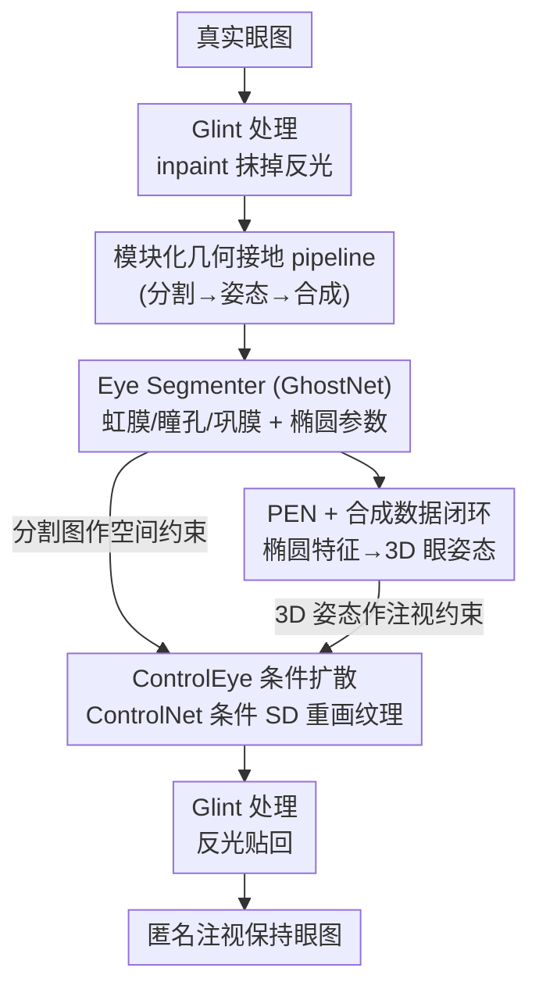

# PrivateEyes: Gaze-Preserving Anonymization for Data Sharing

**会议**: CVPR 2026  
**论文**: [CVF Open Access](https://openaccess.thecvf.com/content/CVPR2026/html/Gupta_PrivateEyes_Gaze-Preserving_Anonymization_for_Data_Sharing_CVPR_2026_paper.html)  
**代码**: 无  
**领域**: AI安全 / 隐私保护  
**关键词**: 眼图匿名化, 注视保持, 虹膜隐私, 条件扩散, ControlNet

## 一句话总结
PrivateEyes 用「分割 + 3D 眼姿态估计 + ControlNet 条件扩散」的三段式 pipeline 重新合成眼部图像，在抹掉可识别虹膜生物特征（虹膜识别率降约 50%）的同时保住注视方向（注视估计精度反而比 SOTA 匿名方法高 10%+），让眼动数据集可以合规共享。

## 研究背景与动机
**领域现状**：AR/VR 头显（HMD）里的眼动追踪要靠大规模、可公开共享的眼图数据集来训练鲁棒模型。但眼图天然编码了虹膜纹理这种唯一可识别个体的生物特征，受 GDPR 等法规约束不能随便共享，于是眼相关研究长期被"没有可公开数据集"卡脖子。

**现有痛点**：现有眼图匿名化分两类，都不好用。几何类的 Rubber Sheet Model（RSM）用极坐标 unwrap 替换虹膜，会在边界引入畸变、破坏对注视推断至关重要的几何结构；外观类的 Iris Style Transfer（IST）用神经风格迁移改虹膜纹理，却带来色彩失配、纹理伪影、瞳孔-巩膜边界模糊，照片真实感差。两类方法的共同结局是：**既没真正匿名（还能认出虹膜），又把下游注视估计搞砸了**，而且多是端到端框架，可控性和可解释性都差。

**核心矛盾**：匿名强度（低虹膜识别率）和任务效用（低注视误差）之间存在 trade-off——你越使劲抹掉虹膜身份，注视几何就越容易被破坏。现有方法没能同时守住这两端。

**本文目标**：合成一张"看不出是谁、但注视方向和原图一致"的眼图，使得释放出去的是匿名图像（而非模型参数，从而规避成员推断、训练样本记忆等模型侧隐私风险）。

**切入角度**：作者不走端到端生成器，而是采用**几何接地的模块化 pipeline**——先把眼睛的语义结构（分割图）和 3D 姿态显式抽出来作为控制信号，再让扩散模型在这些"身份无关"的几何条件下重新生成纹理。这样身份信息（虹膜纹理）在重新合成时被自然替换，而注视所依赖的几何（瞳孔/虹膜椭圆、3D 眼姿态）被显式保留。

**核心 idea**：用"分割 + 3D 姿态"这套身份无关的几何控制信号去条件化扩散合成，把生物身份从注视中解耦——首个用扩散模型大规模生成注视保持匿名眼图的框架。

## 方法详解

### 整体框架
PrivateEyes 是一条三模块串行的生成 pipeline，输入一张真实眼图，输出一张匿名但注视一致的眼图。整体上分三步走：① **Eye Segmenter** 用 GhostNet 把眼睛分成虹膜/瞳孔/巩膜三个语义区域，并拟合虹膜、瞳孔的椭圆参数；② **Eye Pose Estimator（PEN）** 从这些椭圆特征反推眼睛的 3D 姿态——它本身靠一套"解剖学 3D 眼模型 + 反向光线追踪"合成的 600 万张数据训练；③ **ControlEye** 以分割图（空间约束）+ 3D 姿态嵌入（注视约束）作为 ControlNet 控制信号，驱动 Stable Diffusion 重新合成照片级真实的匿名眼图。此外在前后处理阶段单独**处理角膜反光（glint）**，先 inpaint 抹掉、合成后再贴回，保住基于反光的注视估计器所需的光度线索。

整条链路的设计哲学是：身份信息只藏在"纹理"里，而注视只依赖"几何"。所以把几何（分割 + 姿态）显式抽成控制信号、让扩散自由重画纹理，就能在重画纹理（抹身份）的同时锁死几何（保注视）。

### 关键设计

**1. 模块化几何接地 pipeline：把"抹身份"和"保注视"拆成两件互不干扰的事**

针对端到端匿名方法"可控性差、改一个点要全量重训、且匿名与注视互相打架"的痛点，作者把流程拆成"显式抽几何 → 几何条件下重画纹理"两段。关键洞察是：可识别的生物身份主要编码在虹膜**纹理**里，而注视方向只取决于瞳孔/虹膜的**几何**（椭圆形状 + 3D 姿态）。因此只要把几何（分割图 + 3D 姿态）抽成"身份无关"的控制信号交给生成器，让扩散模型在固定几何的前提下自由重新生成纹理，纹理一换身份就没了、几何不动注视就保住了。这种解耦让每个模块（分割/姿态/合成）可独立改进而无需端到端重训，也让匿名过程可解释——这是它区别于 RSM/IST 端到端方案的根本之处。

**2. PEN + 合成数据闭环：用反向光追的解剖学眼模型造 600 万带姿态标注数据，解决真实眼图无 3D 姿态 GT 的难题**

仅靠 2D 分割图不足以约束生成时的 3D 光学与姿态信息，所以作者要给 ControlEye 额外喂一个 3D 眼姿态。但真实眼图根本没有 3D 姿态 ground-truth，这是训练 Pose Estimation Network（PEN）的最大障碍。解法是一个合成数据闭环：先基于 Aguirre 的解剖学 3D 眼模型（cornea 按 Navarro 的"canonical representation"建模，简化掉晶状体、把光阑近似为圆，仍保留解剖与生物计量精度），再用**反向光线追踪**把这个 3D 模型投影到虚拟相机成像面。光线从相机传感器出发反向穿过眼的光学系统，位置表示为 $R(t) = R_0 + t \cdot r$（$R_0$ 相机位置，$r$ 光线方向，$t$ 沿线距离），与建模成二次曲面的角膜/晶状体求交：

$$\frac{(x-h)^2}{a^2} + \frac{(y-k)^2}{b^2} + \frac{(z-d)^2}{c^2} = 1$$

在折射面上按折射率 $n_1, n_2$ 计算折射方向 $r' = \frac{n_1}{n_2} r - \left(\frac{n_1}{n_2}\cos\theta_1 - \cos\theta_2\right) N$（$N$ 为法向量，$\theta_1,\theta_2$ 为入/折射角）。射线最终命中的结构（眼球/虹膜/瞳孔）给像素打标签，于是**直接从 3D 几何生成 2D 分割图**、无需外观建模，单张 < 150ms。通过随机化眼姿态参数，生成 600 万张带椭圆标注的合成图来训练 PEN。PEN 是一个 MLP，把 2D 椭圆特征映射到 3D 姿态：$\text{pose} = \text{PEN}(f_{\text{eye},2D})$，其中输入 $f_{\text{eye},2D} = (e_{\text{pupil}}, e_{\text{iris}})$，每个椭圆参数化为 $e = \{c_x, c_y, a_{\text{major}}, a_{\text{minor}}, \theta\}$；输出 $\text{pose} = (r_{\text{azi}}, r_{\text{ele}}, r_{\text{tor}}, t_x, t_y, d, r_{\text{pupil}})$，即方位/俯仰/扭转三个旋转角、相对相机的水平/垂直/深度位置和瞳孔半径。PEN 学到的本质是"反演光追"——从椭圆几何反推 3D 姿态，训练完直接用到真实眼图上。

**3. ControlEye 条件扩散合成：用 ControlNet 把分割图和注视嵌入注入 SD，保证重画纹理时注视不漂**

有了身份无关的控制信号，怎么保证生成图既照片级真实、又严格跟随原图注视？ControlEye 基于 ControlNet 搭在 Stable Diffusion 上，把两路控制注入：分割图（来自模块 1）提供**空间约束**，控制项 $C$ 提供**注视意图**——它把 PEN 输出的眼姿态嵌入与高层描述符（如眼睛类型）经 CLIP 文本编码器编码后注入 SD。沿用 ControlNet，特征调制作用在 12 个可训练 U-Net 编码块 + 1 个中间块上，跨 $64{\times}64, 32{\times}32, 16{\times}16, 8{\times}8$ 四个分辨率（每个三个子块），再经零卷积与 skip 连接和解码端合并。作者还额外引入一个 **3D 注视对齐约束**（同样用 CLIP 编码、作为文本条件注入），强制生成的注视方向与原输入一致。去噪函数被修改为带控制项 $C$：

$$x_{t-1} = x_t - \epsilon_\theta(x_t, t, y, C) + \sqrt{\beta_t}\, z$$

（$x_t$ 为 $t$ 步噪声输入，$y$ 文本条件，$z \sim \mathcal{N}(0, I)$，$\beta_t$ 方差调度），训练损失为

$$L_{\text{ControlEye}} = \mathbb{E}_{x_0, C, t, \epsilon}\left[\|\epsilon - \epsilon_\theta(x_t, t, y, C)\|^2\right]$$

这个损失允许模型通过纹理变化去身份、同时在 $C$ 的约束下保住注视——匿名（换纹理）和保真（锁几何）在同一个目标里被统一。

**4. Glint 处理：把基于反光的注视估计器也照顾到**

角膜反光（glint）是很多基于模型的注视估计器依赖的重要光度线索，但扩散重新合成会把它弄丢/弄乱。作者用一个简单稳妥的前后处理：合成前用现成 inpainting 方法把 glint 抹掉、喂无 glint 图给扩散；合成后再把原来抽出的 glint 贴回，保住注视相关的照明线索。这一步看似工程细节，但直接决定了输出能否兼容现有 glint-based 注视追踪系统。

### 损失函数 / 训练策略
扩散模型用 PyTorch 实现，单张 V100（32GB）训练，学习率 $10^{-4}$、batch size 4，DDPM 调度器线性噪声从 $1{\times}10^{-4}$ 到 $2{\times}10^{-2}$，训练 $T_{\text{diff}}=1000$ 步、推理降到 20 步加速，guidance scale 3.0（消融选定）。PEN 在 600 万合成图上预训练后迁移到真实数据。

## 实验关键数据

三个真实红外眼动数据集：OpenEDS2019（152 人 / 12,759 图）、EV-Eye（48 人 / 200 万+ 图）、LPW（22 人 / 13 万+ 在野图）。指标分三类：图像质量（FID / KID / LPIPS）、任务效用（注视角误差 ° / 分割 mIoU）、身份保护（虹膜识别率 %，越低越匿名）。注视 GT 用 Dierkes 几何模型生成，误差按角度计 $\text{GazeError}(x,y)=\cos^{-1}\frac{x^\top y}{\|x\|\|y\|}$。

### 主实验（任务效用 + 匿名强度，Table 1 节选）
注视误差越低越好，虹膜识别率（C=裁剪虹膜区，F=完整虹膜区）越低越匿名。

| 方法 | 数据集 | 注视误差 ° ↓ | 虹膜识别(C) % ↓ | 虹膜识别(F) % ↓ |
|------|--------|-------------|----------------|----------------|
| Iris Style Transfer | EV-Eye | 4.8 | 90.0 | 96.3 |
| Rubber Sheet | EV-Eye | 3.52 | 69.0 | 89.9 |
| **PrivateEyes (w/ PEN)** | EV-Eye | **2.89** | **17.7** | **16.7** |
| Iris Style Transfer | LPW | 1.91 | 81.1 | 97.5 |
| Rubber Sheet | LPW | 2.62 | 79.4 | 95.6 |
| **PrivateEyes (w/ PEN)** | LPW | **2.51** | **18.1** | **17.3** |
| Iris Style Transfer | OpenEDS | 7.65 | 78.1 | 90.5 |
| **PrivateEyes (w/ PEN)** | OpenEDS | **4.43** | **16.5** | **14.2** |

最显眼的对比：IST/RSM 这些 baseline 在完整虹膜区识别率仍高达 90–97%（基本没匿名），而 PrivateEyes 把它压到 ~14–17%（约降 50%+），注视误差还更低。注意 baseline 只动虹膜区、其余不变，而 PrivateEyes 重画整张眼图，因此连眼睫毛、眉毛、眼周皮肤都被匿名。

### 图像质量（Table 2 节选，裁剪虹膜区）
| 方法 | 数据集 | FID ↓ | KID ↓ |
|------|--------|-------|-------|
| Iris Style Transfer | EV-Eye | 60.91 | 0.065 |
| Rubber Sheet | EV-Eye | 69.53 | 0.074 |
| **PrivateEyes (w/ PEN)** | EV-Eye | **42.98** | **0.034** |
| Iris Style Transfer | OpenEDS | 86.01 | 0.095 |
| **PrivateEyes (w/ PEN)** | OpenEDS | **69.25** | **0.083** |

### 消融实验
| 配置 | 关键观察 |
|------|---------|
| Ours w/ PEN | 完整模型，注视误差最低 |
| Ours w/o PEN | 去掉 3D 姿态嵌入，注视误差普遍上升（如 EV-Eye 2.89→3.33°，LPW 2.51→3.27°），但匿名强度几乎不变 |

### 关键发现
- **PEN（3D 姿态嵌入）主要贡献在注视精度**：加上它三个数据集注视误差一致下降，而虹膜识别率几乎不动——说明姿态条件专门负责"保注视"，匿名靠的是纹理重画那一路，两者解耦得很干净。
- **几何参数误差全面领先**：PrivateEyes 中心误差 < 1px、角度偏差 ≈5°，而 blur/noise/downsample 组合误差超 8–12px、角偏 >25°，IST/RSM 角误差也达 15.7°/10.5°——印证"显式锁几何"确实保住了注视所需的细粒度结构。
- **分割 mIoU 与传统方法相当**：匿名后下游分割任务不掉点，证明输出对下游任务友好。

## 亮点与洞察
- **"身份在纹理、注视在几何"的解耦假设**是全文最巧的地方：一旦接受这个假设，"抹身份"就变成"在固定几何下重画纹理"，匿名与保真这对矛盾被天然化解。这个思路可迁移到任何"想去掉某种属性、又要保住另一种几何/结构属性"的图像匿名任务（如人脸去身份保表情、指纹去身份保某结构）。
- **用可微/可控的物理渲染造 GT 来训练神经反演网络**：真实数据拿不到 3D 姿态 GT，就用解剖学眼模型 + 反向光追合成 600 万带标注图，让 PEN 学"反演光追"。这种"物理前向渲染造数据 → 神经网络学反演"的闭环是非常通用的可复用范式。
- **把 glint 单独前后处理**，而不是指望扩散模型自己学会保反光——这种"难学的光度细节用确定性 inpaint/贴回兜底"的工程选择，体现了对下游 glint-based 估计器的务实兼容。

## 局限与展望
- 作者承认：生成质量受控制输入影响，极端光照和大注视角会同时劣化分割引导和最终输出。
- 逐帧独立处理、**不保证视频时序一致性**——对连续眼动序列会有抖动，这是明显的后续方向。
- 自己看：匿名强度只用"虹膜识别率"衡量，但论文用的是自训的 GhostNet 分类器当攻击者，换更强的虹膜识别模型（或针对性重识别攻击）下匿名是否依旧成立存疑 ⚠️；另外"释放图像而非模型"虽规避了成员推断，但生成图本身是否会泄漏训练分布的隐私未做评估。
- 改进思路：把时序一致性约束（如光流/视频扩散）加进 ControlEye；用对抗性虹膜识别器做闭环评估匿名鲁棒性。

## 相关工作与启发
- **vs Rubber Sheet Model（几何类）**：RSM 用极坐标 unwrap 直接替换虹膜，边界畸变严重、破坏注视几何；PrivateEyes 不直接改虹膜，而是抽出几何条件后整图重生成，边界平滑、几何一致，匿名还更彻底（连眼周都换）。
- **vs Iris Style Transfer（外观类）**：IST 靠神经风格迁移改纹理，常见色彩失配、纹理 bleeding、瞳孔-巩膜边界模糊，且端到端不可控；PrivateEyes 用扩散在显式几何约束下重画，照片真实感和可控性都更好，FID/KID 全面更低。
- **vs 差分隐私 / 合成数据方案**：差分隐私在聚合层面保护，但对逐图任务（注视估计/分割）不够用；纯合成数据方案绕开了"真实图必须共享"的场景。PrivateEyes 专攻"真实图要共享、又要保下游效用"这一空白。

## 评分
- 新颖性: ⭐⭐⭐⭐ 首个扩散式注视保持眼图匿名框架，"几何/纹理解耦 + 物理渲染造 GT 训神经反演"组合很扎实
- 实验充分度: ⭐⭐⭐⭐ 三数据集、三类指标、多 baseline、有 PEN/几何/分割消融，但匿名鲁棒性只用自训分类器评估
- 写作质量: ⭐⭐⭐⭐ pipeline 清晰、公式齐全，图示到位
- 价值: ⭐⭐⭐⭐ 直接解决 AR/VR 眼动数据"因隐私不能共享"的真实痛点，有合规落地意义

<!-- RELATED:START -->

## 相关论文

- [\[NeurIPS 2025\] Incentivizing Time-Aware Fairness in Data Sharing](../../NeurIPS2025/ai_safety/incentivizing_time-aware_fairness_in_data_sharing.md)
- [\[CVPR 2026\] Image-based Outlier Synthesis With Training Data](image-based_outlier_synthesis_with_training_data.md)
- [\[CVPR 2026\] Revisiting Geometric Obfuscation with Dual Convergent Lines for Privacy-Preserving Image Queries in Visual Localization](revisiting_geometric_obfuscation_with_dual_convergent_lines_for_privacy-preservi.md)
- [\[CVPR 2026\] No Way To Steal My Face: Proactive Defense Against Identity-Preserving Personalized Generation](no_way_to_steal_my_face_proactive_defense_against_identity-preserving_personaliz.md)
- [\[CVPR 2026\] PrivSynth: Alternating and Control-Based Optimization for Privacy and Utility in Synthetic Data](privsynth_alternating_and_control-based_optimization_for_privacy_and_utility_in_.md)

<!-- RELATED:END -->
