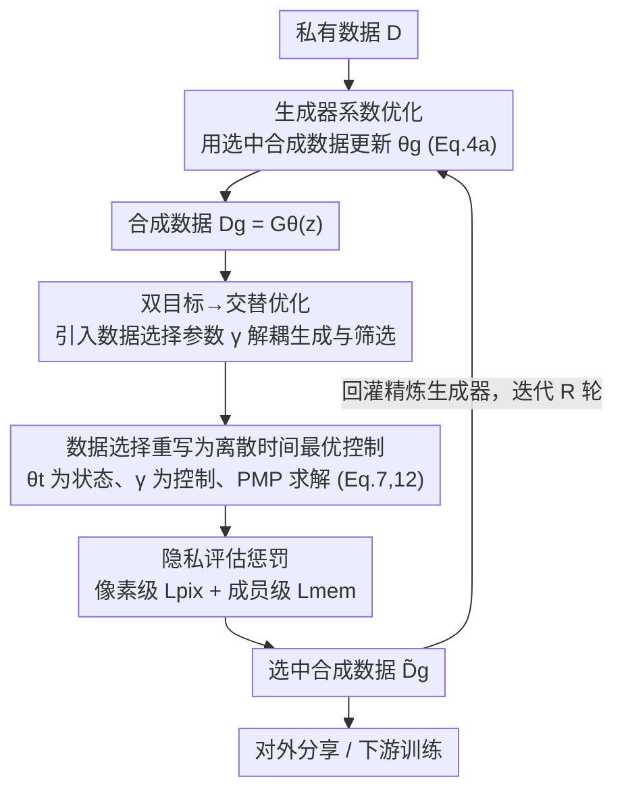

# PrivSynth: Alternating and Control-Based Optimization for Privacy and Utility in Synthetic Data

**会议**: CVPR 2026  
**论文**: [CVF Open Access](https://openaccess.thecvf.com/content/CVPR2026/html/Zhao_PrivSynth_Alternating_and_Control-Based_Optimization_for_Privacy_and_Utility_in_CVPR_2026_paper.html)  
**代码**: 无  
**领域**: AI安全 / 隐私保护 / 合成数据生成  
**关键词**: 合成数据、隐私-效用权衡、最优控制、Pontryagin 极大值原理、数据选择  

## 一句话总结
PrivSynth 把"合成数据生成的隐私-效用权衡"建模成一个**双目标优化**问题，并在生成器与数据选择参数之间交替优化，再把数据选择这一步重写成**离散时间最优控制**问题、用 Pontryagin 极大值原理（PMP）求解，在保证下游效用的同时把成员推断攻击成功率从 48% 压到约 2%。

## 研究背景与动机
**领域现状**：公开数据日益枯竭，合成数据生成（SDG）成为隐私保护数据共享的实用方案——在私有数据上训练生成模型（如微调 DDPM、条件扩散、Textual Inversion），产出保留任务相关特征、但遮蔽敏感内容的"假数据"对外分享。

**现有痛点**：近期研究表明合成数据仍会泄露隐私——成员推断攻击（MIA）和重建攻击能从合成样本里还原出训练个体。而现有防御几乎都以牺牲下游效用为代价：差分隐私（DP）注入噪声会模糊统计特征、削弱生成质量；去重会连带删掉稀有但有信息量的模式；掩码会抹掉训练所需的关键信号；事后过滤会降低多样性和覆盖度。

**核心矛盾**：隐私保护与下游效用之间存在直接的 trade-off，而且这个 trade-off 很难"可证明地"求到最优——因为评估某个合成子集的效用损失，需要把下游模型在该子集上训练到收敛，而下游训练损失**无法反向传播回生成模型**，使得基于梯度的联合优化不可行。

**本文目标**：在不假设下游任务已知的前提下，找到一组既能保隐私又能保效用的合成样本，并给出收敛性保证。

**切入角度**：作者不直接对生成器一把梭，而是引入一个**数据选择参数** $\gamma$ 来"挑样本"，把"学生成器"和"控数据质量"解耦；再把"挑样本"这个离散且评估昂贵的过程看成一个动力系统的控制问题，借控制论工具高效求解。

**核心 idea**：用"交替优化 + 把数据选择重写成最优控制 + 用 PMP 求解"代替"对生成器做不可行的端到端梯度优化"，从而在隐私惩罚与效用收益之间取得可证明最优的平衡。

## 方法详解

### 整体框架
PrivSynth 的输入是一份私有数据集 $D$ 和一个生成模型 $G_\theta$，输出是一组经过筛选、对外可分享的合成样本以及对应的数据选择参数 $\gamma$。整体是一个**交替优化的迭代循环**：先用当前选中的合成数据更新生成器系数 $\theta_g$（Eq.4a），再固定生成器、用 PMP 优化数据选择参数 $\gamma$（Eq.4b/Eq.7），把选出的高质量样本回灌去精炼生成器，如此往复 $R$ 轮。其中"优化数据选择"这一步是全文核心——它被重写成一个离散时间最优控制问题：下游模型参数 $\theta_t$ 是状态、$\gamma$ 是时不变控制、$T$ 步梯度下降是动力学、阶段代价是"效用损失 + 隐私惩罚"。

### 关键设计

**1. 双目标交替优化：用数据选择参数把"学生成器"和"控质量"解耦**

直接求解"生成损失 + 效用损失 + 隐私损失"的多目标问题（Eq.1）不可行，因为效用损失 $\ell_u$ 需要把下游模型训到收敛、其训练损失无法回传给生成器。作者的解法是引入一个二值选择向量 $\gamma = [\gamma_1,\dots,\gamma_M]^\top,\ \gamma_i\in\{0,1\}$，$\gamma_i=1$ 表示保留第 $i$ 个合成样本。于是下游效用损失被定义为"只在选中样本上训出的最优下游模型"的损失 $\theta^*(\gamma)=\arg\min_\theta \sum_i \gamma_i \ell(\theta, x_{g,i})$，隐私项写成 $\ell_p(\gamma, D_g)=\sum_i \gamma_i Q(\theta_{att}, x_{g,i})$。这样原问题就拆成在 $\theta_g$ 与 $\gamma$ 上的交替优化（Eq.4a/4b）：更新生成器时只用选中的子集 $\tilde D_g(\gamma)$，更新选择参数时基于完整合成集 $D_g$，超参 $\phi$ 平衡效用与隐私。解耦的好处是把"无法反传的效用评估"转嫁到了离散的样本选择上，绕开了对生成器的端到端梯度需求。

**2. 把数据选择重写成离散时间最优控制并用 PMP 求解**

光是交替还不够——直接找最优 $\gamma$ 仍然昂贵，因为要枚举大量候选子集评估其下游效用。作者把内层优化"展开"成固定 $T$ 步梯度下降：初始化 $\theta_0$，迭代 $\theta_{t+1}=\theta_t-\eta\nabla_\theta L(\theta_t,\gamma)$，再用沿轨迹的累计损失 $\sum_{t=1}^T \ell_u(\theta_t)$ 近似最小内层损失，并把梯度更新当作约束，得到 Eq.7：

$$\min_{\gamma\in U}\ \sum_{t=1}^{T}\Big[\ell_u(\theta_t, D_g) + \tfrac{\phi}{T}\ell_p(\gamma, D_g)\Big],\quad \text{s.t. } \theta_{t+1}=\theta_t-\eta\nabla_\theta L(\theta_t,\gamma)$$

这恰好是一个离散时间最优控制问题：状态 $\theta_t$、时不变控制 $\gamma$、动力学是梯度更新、阶段代价是效用加隐私。作者引入 Hamiltonian $H_t=\ell_u(\theta_t)+\lambda_{t+1}^\top(\theta_t-\eta\nabla L(\theta_t,\gamma))$，用 Pontryagin 极大值原理给出最优性必要条件（Theorem 1）：前向动力学按最速下降推进模型训练、后向伴随变量 $\lambda_t$ 传播任务敏感度、对 $\gamma$ 做 Hamiltonian 极大化以权衡效用增益与隐私惩罚（Eq.12）。Algorithm 1 即按"前向 $T$ 步 → 后向算伴随 → 更新 $\gamma$"迭代求解。理论上在标准光滑/凸性条件下，这些 PMP 条件既必要又充分，保证收敛到 surrogate 目标的稳定解——这是它相比启发式子集枚举的关键优势：**可证明最优**。⚠️ 部分公式符号（如 $\lambda$、Hessian-向量积）以原文为准。

**3. 像素级 + 成员级双重隐私评估，融进控制目标**

隐私惩罚 $Q$ 不是针对某个具体攻击，而是"内禀泄露指标"，由两部分组成。像素级泄露 $L_{pix}(x_{g,i})=-\mathbb{E}_{x_i\sim D}[\text{Dist}(x_{g,i}, x_i)]$ 衡量合成图与私有图的视觉接近度（Dist 可取 MSE 或 LPIPS），值越大说明越不像、像素级隐私越强；评估时对每张合成图取到所有私有图的 LPIPS 最近 50 个距离的均值。成员级泄露 $L_{mem}(x_{g,i})=\big|\mathbb{E}_{x_i\sim D}[s(x_i)]-\mathbb{E}_{x_g\sim D_g}[s(x_{g,i})]\big|$ 衡量下游模型在私有样本与合成样本上置信统计量 $s(\cdot)$（如最大预测概率或熵）的分布差异，越小说明模型响应越难区分二者、越能抵御成员推断。二者用权重合成统一惩罚 $\ell_p(\gamma)=\sum_i\gamma_i(\phi_1 L_{pix}+\phi_2 L_{mem})$，并被直接写进 PMP 的控制目标（Eq.12），使得"选样本"这一步天然地把高泄露样本压低权重。这种"攻击无关、双层次"的度量比只防某种攻击更通用。

### 损失函数 / 训练策略
合成样本由 Textual Inversion 生成：冻结 Latent Diffusion 权重，对每个类优化词嵌入 5000 步，再以 50 步采样、classifier-free guidance scale 3.0（ImageNet/DomainNet）或 2.0（PathMNIST）合成。优化中为可扩展性，用 PyTorch JVP 的 Hessian-向量积替代显式 Hessian、缓存中间特征、用近似最近邻加速像素级隐私评估。交替轮数 $R$、展开步数 $T$、权重 $\phi$ 为关键超参。

## 实验关键数据

### 主实验
在 ImageNet、DomainNet（benchmark）与 PathMNIST（医学）上评测；下游用 ResNet18/34 分类，并额外验证目标检测下游任务（任务未知场景）。成员级隐私用 MIA 攻击成功率（ASR，越低越好）、像素级用 LPIPS（越高越好）衡量，效用用 top-1 准确率 / AP50。下表为任务无关的分布保真度（FID / KID，括号内为 MIA ASR，越低越好）：

| 数据集 | 指标 | PrivSynth (Ours) | DP | Masking | De-Dup |
|--------|------|------|------|---------|--------|
| DomainNet | KID↓ (MIA ASR) | **31.53 (0.02)** | 40.07 (0.38) | 54.12 (0.32) | 32.77 (0.51) |
| ImageNet | KID↓ (MIA ASR) | **73.61 (0.01)** | 75.66 (0.31) | 91.34 (0.21) | 82.20 (0.30) |
| DomainNet | FID↓ (MIA ASR) | **130.70 (0.02)** | 139.32 (0.38) | 170.50 (0.32) | 128.67 (0.51) |
| ImageNet | FID↓ (MIA ASR) | **171.11 (0.01)** | 173.29 (0.31) | 194.91 (0.21) | 172.50 (0.30) |

PrivSynth 在 FID/KID 与 MIA ASR 上同时占优：保真度更接近私有分布的同时，攻击成功率压到 0.01–0.02（基线普遍 0.2–0.5）。由于 FID/KID 与具体下游模型无关，这说明选出的合成集即便后续被换架构/超参使用，质量仍高且隐私仍保。

### 消融实验
在 DomainNet 上分析交替优化轮数的影响（Round 0 = 直接用私有数据）：

| 配置 | MIA ASR↓ | 1−LPIPS↓ | 下游准确率 | 说明 |
|------|---------|----------|-----------|------|
| Round 0（私有数据直用） | 48.1% | 0.67 | 基线 | 隐私泄露严重 |
| Round 2（PrivSynth） | **1.9%** | **0.49** | >67% | 两轮即大幅降泄露，效用几乎不掉 |
| 直接过滤敏感样本 | — | — | 显著下降 | 朴素筛除导致效用大跌 |
| 提高选样比例 | 升高 | 降低 | 升高 | 选越多效用越好但隐私风险也升 |

### 关键发现
- **两轮就够**：MIA ASR 从 48.1% 降到 1.9%、1−LPIPS 从 0.67 降到 0.49，而准确率维持在 67% 以上——隐私收益大、效用损失小，第二轮后趋于稳定。
- **数据选择是关键**：直接把敏感样本过滤掉会让效用大跌，而 PMP 引导的"加权选择"能在压隐私的同时保住效用，说明"怎么选"比"是否选"更重要。
- **选样比例是显式旋钮**：提高选中合成样本比例会提升下游性能但抬高隐私风险（MIA 升、LPIPS 降），给了部署者一个可调的权衡点。
- **可迁移到未知任务**：用分类损失做选择、却在目标检测下游上仍优于基线，说明选出的子集质量是任务无关的。

## 亮点与洞察
- **把"选样本"看成控制问题**：最巧妙之处是用展开梯度 + PMP 把离散、评估昂贵的数据选择转成有伴随方程、可证明最优的控制求解，绕开了"下游损失不可反传"的死结。
- **攻击无关的隐私度量**：像素级 + 成员级双指标不依赖某个具体攻击，作为控制代价直接驱动选择，比"防特定攻击"的防御更鲁棒、更通用。
- **解耦思想可复用**：用一个选择参数把"模型学习"和"数据质量控制"拆开、再交替优化，这个套路可迁移到其它"评估信号无法反传"的数据筛选/数据蒸馏场景。

## 局限与展望
- 依赖 Textual Inversion 这一特定生成范式，换成纯微调 DDPM 或其它生成器时收敛性与开销是否一致未充分验证。
- PMP 需要前向 $T$ 步 + 后向伴随 + Hessian-向量积，尽管用 JVP 加速，展开步数 $T$ 和轮数 $R$ 增大时计算成本仍可观；论文未给出与基线的明确时间/显存对比（⚠️ 细节见附录）。
- 收敛性保证建立在"标准光滑/凸性条件"下，而深度生成模型与下游网络高度非凸，理论与实践的差距值得关注。
- 实验数据集规模偏小（三个数据集的子集），更大规模、更复杂模态下的可扩展性待验证。

## 相关工作与启发
- **vs 差分隐私（DP）**：DP 靠注入噪声提供形式化 $(\omega,\varepsilon)$ 保证，但会模糊统计特征、削弱生成质量；PrivSynth 不加噪而是"挑样本"，在 FID/KID 与 MIA 上同时更优。
- **vs 去重 / 掩码 / 事后过滤**：这些朴素防御要么删掉稀有信息、要么抹掉训练信号、要么降低多样性，都以效用为代价；PrivSynth 用控制论框架在效用与隐私间求可证明最优，而非启发式裁剪。
- **vs Anti-Memorization Guidance (AMG)**：AMG 在采样时检测中间预测与训练数据的高相似度、把采样推离记忆区，是模型侧改造；PrivSynth 则在生成后的数据侧做选择，二者思路互补。

## 评分
- 新颖性: ⭐⭐⭐⭐⭐ 把合成数据隐私-效用权衡形式化为最优控制并用 PMP 求解，视角新颖
- 实验充分度: ⭐⭐⭐⭐ 覆盖 benchmark + 医学 + 检测任务，但数据集规模偏小、缺开销对比
- 写作质量: ⭐⭐⭐⭐ 推导清晰，但符号繁多、部分公式在缓存中略难辨认
- 价值: ⭐⭐⭐⭐ 给"评估信号不可反传"的隐私数据筛选提供了一个可证明最优的范式

<!-- RELATED:START -->

## 相关论文

- [\[CVPR 2026\] Reinforcement-Guided Synthetic Data Generation for Privacy-Sensitive Identity Recognition](reinforcement-guided_synthetic_data_generation_for_privacy-sensitive_identity_re.md)
- [\[ICML 2026\] Position: Embodied AI Requires a Privacy-Utility Trade-off](../../ICML2026/ai_safety/position_embodied_ai_requires_a_privacy-utility_trade-off.md)
- [\[CVPR 2026\] One-to-More: High-Fidelity Training-Free Anomaly Generation with Attention Control](one-to-more_high-fidelity_training-free_anomaly_generation_with_attention_control.md)
- [\[CVPR 2026\] Image-based Outlier Synthesis With Training Data](image-based_outlier_synthesis_with_training_data.md)
- [\[CVPR 2026\] DSO: Direct Steering Optimization for Bias Mitigation](dso_direct_steering_optimization_for_bias_mitigation.md)

<!-- RELATED:END -->
