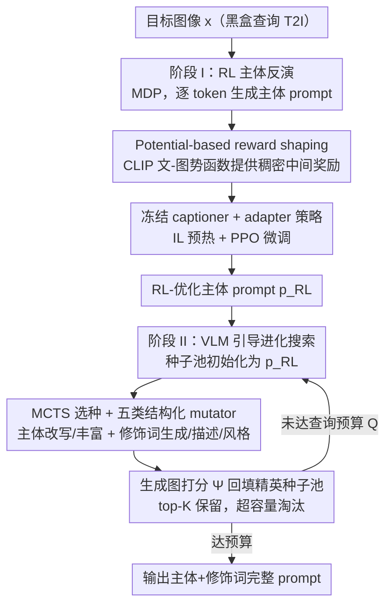

# PROMPTMINER: Black-Box Prompt Stealing against Text-to-Image Generative Models via Reinforcement Learning and VLM-Guided Optimization

**会议**: CVPR 2026  
**论文**: [CVF Open Access](https://openaccess.thecvf.com/content/CVPR2026/html/Li_PROMPTMINER_Black-Box_Prompt_Stealing_against_Text-to-Image_Generative_Models_via_Reinforcement_CVPR_2026_paper.html)  
**代码**: https://github.com/aaFrostnova/PromptMiner  
**领域**: AI 安全 / prompt 窃取攻击 / 文生图安全  
**关键词**: prompt 窃取, 黑盒攻击, 强化学习, reward shaping, VLM 引导搜索

## 一句话总结
PromptMiner 是一个黑盒 prompt 窃取框架：给定一张文生图模型生成的图，它先用带 reward shaping 的强化学习反演出精准的"主体"prompt，再用 VLM 引导的进化搜索补全"风格修饰词"，无需模型梯度、无需大规模标注数据，就能恢复出能复现高度相似图像的 prompt，CLIP 相似度最高 0.958、SBERT 文本对齐最高 0.751，且对常见图像扰动防御鲁棒。

## 研究背景与动机
**领域现状**：Stable Diffusion、FLUX、DALL·E 等文生图（T2I）模型生成质量极度依赖"精心设计的 prompt"，这类 prompt 通常遵循"主体 + 修饰词"（Subject, Modifiers）结构，已成为可在 PromptBase、PromptHero 等市场交易的高价值数字资产。由此衍生出 prompt 窃取攻击：给定目标图像，反推出能生成相似图的 prompt。它既是知识产权威胁（盗卖他人 prompt），也可用于正向取证（模型溯源、水印验证）。

**现有痛点**：现有方法各有硬伤。白盒梯度方法（PEZ、PH2P）依赖梯度访问，在商业部署里几乎不可用，且反演出的 prompt 语言生硬、人读不懂、只盯主体；黑盒的 BLIP、VGD 靠 captioning/LLM 拼接，缺乏修饰词重建能力，VGD 只抓单个显著主体；CLIP-Interrogator、PromptStealer 虽同时考虑主体和修饰词，却**没有显式优化过程**，直接从预训练模型生成，相似度不够——其中 PromptStealer 还要在 Lexica 这类大规模标注数据上训练主体生成器和修饰词分类器，强烈依赖数据、过拟合风险大、泛化差。

**核心矛盾**：要同时做到三件事——不用梯度（黑盒可用）、不用大规模标注数据（可泛化）、还要兼顾主体精度与风格保真——现有方法没有一个能全占。根因在于：主体反演需要"针对目标图的显式优化"，而修饰词补全需要"在离散 prompt 空间里结构化探索"，这是两类性质不同的搜索，用单一模型一锅烩做不好。

**本文目标**：构建一个黑盒、免标注、既精准抓主体又能注入丰富修饰词的 prompt 窃取框架。

**切入角度**：作者把任务**解耦成两阶段**——主体反演当作一个可用 RL 求解的序列决策问题（在黑盒下做显式优化），修饰词补全当作 VLM 引导的进化搜索（结构化注入风格）。

**核心 idea**：用"RL 反演主体 + VLM 进化搜风格"的两段式，分别用对的工具解决两类搜索，既显式优化又免梯度免标注。

## 方法详解

### 整体框架
PromptMiner 的威胁模型是：攻击者只拿到一张目标图像、对目标 T2I 模型只有黑盒查询权限，且**没有**大规模图文数据集或商业 prompt 库。流程分两阶段：阶段 I 把 prompt 反演形式化成马尔可夫决策过程（MDP），在冻结 captioner 上挂一个可训练 adapter 当策略，用带 potential-based reward shaping 的 PPO 反演出内容忠实的**主体** prompt；阶段 II 以阶段 I 的结果为种子，用 VLM mutator 在容量受限的精英种子池里做进化搜索（MCTS 选种 + 五类结构化 mutator + 生成图打分回填），逐步把主体扩写成富含风格/构图修饰词的完整 prompt，最终输出在 prompt 市场上可复现目标图的 prompt。

### 关键设计

**1. RL 主体反演 + 势函数 reward shaping：在黑盒下显式优化、解决奖励稀疏**

针对"白盒方法要梯度、黑盒方法没有显式优化"这个痛点，本文把 captioning 的逐 token 生成写成 MDP $\mathcal{M}=(S,A,P,R,\gamma)$：状态 $s_t=\{p_{0:t-1},x\}$（已生成前缀 + 目标图），动作 $a_t$ 选下一个 token，转移确定性地拼接 token，终止于 EOS。最朴素的奖励是生成完整 prompt $p_{0:T}$ 后合成图 $\hat{x}$、算它与目标图的 CLIP 余弦相似度 $\Psi(\hat{x},x)$ 当终局奖励——但这只在 episode 末尾给信号，**奖励极稀疏**，长 prompt、大动作空间下训练又慢又不稳。本文用 potential-based reward shaping 加稠密中间奖励：$r'_t=\gamma\Phi(s_{t+1})-\Phi(s_t)$（$t<T$）、$r'_t=r_t-\Phi(s_t)$（$t=T$），势函数 $\Phi(s_t)=\beta\cdot\frac{f_{text}(p_{1:t})\cdot f_{img}(x)}{\Vert f_{text}(p_{1:t})\Vert\Vert f_{img}(x)\Vert}$ 用 CLIP 文-图相似度衡量"当前前缀离目标图多近"。势函数式 shaping 理论上不改变最优策略、只影响学习动态，实测显著加速收敛、用更少步数就达到高相似度。

**2. Adapter-on-frozen-captioner + IL 预热 + PPO：免大规模标注、稳住 RL**

为了免标注又能稳定训练，策略不重训整个 captioner，而是在冻结 captioner 的隐状态 $h_t$ 上挂一个可训练 adapter $\theta$：$\tilde{h}_t=\theta(h_t)$，再喂回冻结的 LM head 得到 token 分布。训练两阶段：先用模仿学习（IL）暖启——从冻结 captioner 采专家 token 序列、回放收集隐状态，用交叉熵 $L_{IL}=-\frac{1}{N}\sum\log P_{LM}(y_{t+1}\mid\tilde{h}_t)$ 训 adapter，给一个强语义初始化；再用 PPO 的 clipped surrogate 目标 $L_{PPO}=\mathbb{E}_t[\min(\rho_t A_t,\mathrm{clip}(\rho_t,1-\epsilon,1+\epsilon)A_t)]$ 微调，只更新 adapter 和 value head，backbone 全程冻结。这样既不需要 PromptStealer 那样的大规模标注数据，又避免从零训 RL 的不稳定。

**3. 容量受限精英种子池 + MCTS 选种：让修饰词搜索高质量、不早熟**

阶段 I 出的主体 prompt 内容忠实但缺风格修饰词（captioner 对修饰词先验弱）。阶段 II 把修饰词补全当离散 prompt 空间的进化搜索，但有两个坑：种子质量差会导致覆盖不足、过早收敛；mutator 不结构化会乱改。本文用一个**固定容量 K 的精英种子池**：每次评估后把新 prompt 及其相似度分数插入，按分排序，超容量就淘汰最低分（elitist 保优）。选下一个待变异种子时用 MCTS 平衡探索与利用，既保住高质量 prompt，又持续探索 prompt 空间里有前途的邻域，避免陷在局部最优。整个流程（初始化种子=$p_{RL}$ → MCTS 选种 → mutator 变异 → 生成图打分 → top-K 更新）循环到查询预算 $Q$ 用尽，返回最高分 prompt。

**4. 五类结构化 hybrid mutator：尊重"主体+修饰词"结构地注入风格**

通用文本 mutator（AFL 的 Havoc、LLM 文本变异）不适配 T2I 的"主体+修饰词"结构。本文用一个 VLM mutator（如 Qwen2-VL-2B-Instruct）配五个针对性算子：①**主体改写**（Subject-Paraphrase，换更自然的措辞不改义）；②**主体丰富**（Subject-Enrich，插入图像 grounded 的颜色/数量/姿态等细节、保结构）；③**修饰词生成**（Modifier-Generate，从图与主体联合产出新描述和风格）；④**修饰词描述**（Modifier-Description，用空间关系、构图、光照精修描述）；⑤**修饰词风格**（Modifier-Style，调介质、纹理、镜头、质量等 token 强化美学）。主体类和修饰词类分开处理，让 prompt 在不偏离内容的前提下扩写得既结构良好又风格丰富。

### 损失函数 / 训练策略
阶段 I：IL 暖启用交叉熵 $L_{IL}$ 只训 adapter；RL 微调用 PPO clipped surrogate $L_{PPO}$，优势 $A_t$ 由 value head 估计，奖励为势函数 shaping 后的 $r'_t$（CLIP 文-图势 + 终局 CLIP 图-图相似度），只更新 adapter 与 value head，captioner backbone 与 LM head 冻结。阶段 II 无梯度训练，纯黑盒查询驱动的进化搜索，超参为种子池容量 $K$ 与各阶段查询预算 $Q$；经验上 Phase I/II 各 100 次查询即接近最优区。

## 实验关键数据

> 指标说明：**CLIP↑** 衡量生成图与目标图在视觉-语言联合空间的高层语义相似度（越高越好）；**LPIPS↓** 衡量低层感知差异（越低越好）；**SBERT↑** 用 Sentence-BERT 算反演 prompt 与原 prompt 的句级语义相似度（越高越好）。

### 主实验
三数据集（MS COCO / Flickr / Lexica）× 四个 T2I 目标模型（SD v1.5 / SDXL-Turbo / FLUX.1 dev / SD 3.5 Medium），PromptMiner 在 CLIP、LPIPS、SBERT 上全面超越所有基线。下表摘取 MS COCO 上各模型的代表结果：

| 目标模型 | 方法 | CLIP↑ | LPIPS↓ | SBERT↑ |
|----------|------|-------|--------|--------|
| SD v1.5 | PromptStealer | 0.861 | 0.453 | 0.633 |
| SD v1.5 | **PromptMiner** | **0.933** | **0.342** | **0.664** |
| SDXL-Turbo | PromptStealer | 0.861 | 0.439 | 0.652 |
| SDXL-Turbo | **PromptMiner** | **0.934** | **0.340** | **0.673** |
| FLUX.1 dev | VLM-as-expert | 0.923 | 0.407 | 0.588 |
| FLUX.1 dev | **PromptMiner** | **0.958** | **0.345** | **0.683** |
| SD 3.5 Medium | BLIP | 0.881 | 0.409 | 0.718 |
| SD 3.5 Medium | **PromptMiner** | **0.953** | **0.303** | **0.751** |

In-the-wild（DiffusionDB，目标模型未知）泛化测试，PromptMiner 在所有指标上仍居首，CLIP 相似度比最强基线高约 7.5%：

| 方法 | CLIP↑ | LPIPS↓ | SBERT↑ |
|------|-------|--------|--------|
| CLIP-IG | 0.803 | 0.628 | 0.541 |
| PromptStealer | 0.754 | 0.643 | 0.542 |
| VGD | 0.749 | 0.649 | 0.454 |
| **PromptMiner** | **0.863** | **0.622** | **0.545** |

### 消融实验
| 配置 / 防御 | CLIP↑ | LPIPS↓ | SBERT↑ | 说明 |
|-------------|-------|--------|--------|------|
| 无防御 | 0.911 | 0.420 | 0.591 | Lexica 上完整方法 |
| Random Noise Injection | 0.903 | 0.420 | 0.572 | 加高斯噪声，几乎不掉 |
| Puzzle Effect | 0.902 | 0.425 | 0.561 | 4×4 网格局部平移，几乎不掉 |
| Textual Watermarking | 0.887 | 0.445 | 0.583 | 叠可见水印，掉点也很有限 |

奖励 shaping 与查询预算消融（图示结论）：稀疏奖励收敛慢、shaping 奖励用更少步数即达高相似度；Phase I/II 查询预算存在权衡——简单 prompt（Flickr）Phase I 约 100 次即饱和，复杂 prompt（Lexica）需更大 Phase I 预算给 Phase II 更好初始化，经验上各 100 次查询性价比最高。

### 关键发现
- **两阶段分工互补**：RL adapter 保证主体与图像语义紧贴，给一个稳的内容地基；VLM 进化搜索系统性探索修饰词空间补风格/构图，二者协同才同时拿下"主体准 + 风格像"。
- **reward shaping 是训练效率关键**：势函数提供稠密中间信号，早期进展更快、收敛步数大减，且理论上不改变最优策略。
- **对常见防御鲁棒**：噪声注入、拼图扰动、文本水印这类后处理防御对攻击效果影响都很小，因为方法是语义驱动而非依赖低层像素细节——这反过来说明现有图像级防御不足以挡住此类攻击。
- **用户研究**：30 个测试案例中 PromptMiner 的人类相似度偏好评分一致最高。

## 亮点与洞察
- **"解耦两类搜索、各用对的工具"**：主体反演用 RL 做显式黑盒优化、修饰词补全用 VLM 进化搜索，这个分工是全文最巧的地方——它点破了"主体需优化、修饰词需探索"是两类问题，单模型一锅烩做不好。
- **势函数 reward shaping 治稀疏奖励**：把终局 CLIP 相似度的稀疏信号，用 CLIP 文-图势函数补成稠密中间奖励，既加速收敛又保最优策略不变，这是把经典 RL 技巧用对地方的范例，可迁移到任何"只有终局可验证奖励"的序列生成任务。
- **adapter-on-frozen-captioner**：在冻结 captioner 隐状态上挂小 adapter + IL 暖启，免大规模标注还稳住 RL，工程上轻量易复现。
- **安全警示价值**：实验表明像素级防御（噪声/拼图/水印）几乎挡不住语义驱动的 prompt 窃取，提示 prompt 知识产权保护需要语义层而非像素层的新防御。

## 局限与展望
- **依赖代理 T2I 模型的查询**：阶段 I/II 都要反复查询一个文生图模型来打分，查询成本不低；in-the-wild 时还需用代理生成器，代理与真实生成器差异对结果的影响边界文中未充分量化。
- **双刃剑的攻击属性**：方法本身是攻击框架，虽可用于取证/水印验证，但同样可被用于盗卖他人 prompt；论文探讨了防御但未给出能真正挡住它的有效防御方案。
- **评测规模**：主表每数据集随机取 50 条 prompt，样本量偏小；⚠️ 更大子集结果放在补充材料，正文未展开。
- **VLM mutator 的依赖**：修饰词质量受所用 VLM 能力制约，换更弱的 VLM 时五类算子的效果如何缺乏系统分析。

## 相关工作与启发
- **vs PromptStealer**：它在 Lexica 大规模标注数据上训主体生成器+修饰词分类器，依赖数据、易过拟合、泛化差；PromptMiner 免标注、用 RL+进化搜索做显式优化，跨数据集与未知模型都更稳。
- **vs PH2P / PEZ（白盒梯度反演）**：它们要梯度访问、反演 prompt 语言生硬人读不懂、只盯主体；PromptMiner 黑盒、可读、主体+修饰词兼顾。
- **vs VGD / BLIP（黑盒 captioning）**：它们靠 caption/LLM 拼接、只抓单个显著主体、缺修饰词重建与显式优化；PromptMiner 有针对目标图的 RL 优化和结构化修饰词搜索，相似度系统性更高。
- **vs CLIP-Interrogator**：它从预定义池选修饰词、无针对性优化；PromptMiner 用 VLM 结构化 mutator + MCTS 精英搜索，修饰词更贴合目标图。

## 评分
- 新颖性: ⭐⭐⭐⭐⭐ "RL 反演主体 + VLM 进化搜风格"的两段式解耦在黑盒 prompt 窃取里很新
- 实验充分度: ⭐⭐⭐⭐ 三数据集×四模型 + in-the-wild + 防御 + 用户研究覆盖全，但每集 50 条样本偏小
- 写作质量: ⭐⭐⭐⭐ 动机、威胁模型、两阶段方法讲得清楚，公式与算法完整
- 价值: ⭐⭐⭐⭐ 揭示 prompt 资产的现实安全风险，并暴露像素级防御的不足，安全意义强

<!-- RELATED:START -->

## 相关论文

- [\[CVPR 2026\] GenBreak: Red Teaming Text-to-Image Generation Using Large Language Models](genbreak_red_teaming_text-to-image_generation_using_large_language_models.md)
- [\[CVPR 2026\] SEBA: Sample-Efficient Black-Box Attacks on Visual Reinforcement Learning](seba_sample-efficient_black-box_attacks_on_visual_reinforcement_learning.md)
- [\[CVPR 2026\] RunawayEvil: Jailbreaking the Image-to-Video Generative Models](runawayevil_jailbreaking_the_image-to-video_generative_models.md)
- [\[CVPR 2026\] JANUS: A Lightweight Framework for Jailbreaking Text-to-Image Models via Distribution Optimization](janus_a_lightweight_framework_for_jailbreaking_text-to-image_models_via_distribu.md)
- [\[CVPR 2026\] PureProof: Diffusion-Resistant Black-box Targeted Attack on Large Vision-Language Models](pureproof_diffusion-resistant_black-box_targeted_attack_on_large_vision-language.md)

<!-- RELATED:END -->
