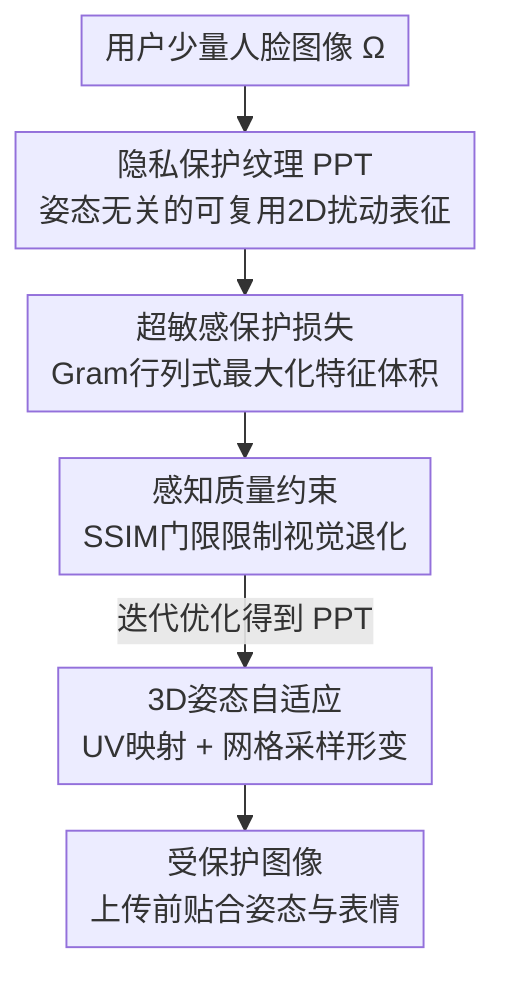

# Protego: User-Centric Pose-Invariant Privacy Protection Against Face Recognition-Induced Digital Footprint Exposure

**会议**: CVPR 2026  
**论文**: [CVF Open Access](https://openaccess.thecvf.com/content/CVPR2026/html/Wang_Protego_User-Centric_Pose-Invariant_Privacy_Protection_Against_Face_Recognition-Induced_Digital_Footprint_CVPR_2026_paper.html)  
**代码**: https://github.com/HKU-TASR/Protego  
**领域**: AI安全 / 隐私保护  
**关键词**: 人脸识别对抗, 隐私保护, 姿态无关, UV映射, 黑盒防护

## 一句话总结
Protego 把用户的 3D 人脸特征压缩成一张姿态无关的二维「隐私保护纹理」(PPT)，配合一个让人脸识别模型对受保护图像「超敏感」的新损失，使受保护的人脸照片即使彼此之间也无法被检索匹配，从而在 Clearview AI、PimEyes 这类以脸搜人的引擎面前保护用户的数字足迹，黑盒检索召回率至少比现有方法低一半。

## 研究背景与动机
**领域现状**：以脸搜人的大规模检索引擎（Clearview AI、PimEyes）抓取了数十亿张网络照片建库，任何人上传一张人脸即可反查出某人的社交动态、私人照片、新闻报道等数字足迹。对抗这类侵犯的「反人脸识别」(anti-FR) 技术通过在照片上传前做细微扰动，让照片即便被抓取入库也无法被检索到。主流的扰动类方法（Fawkes、LowKey、PMask、OPOM、Chameleon）让受保护图像在特征空间里远离原图。

**现有痛点**：作者指出现有方法在两条战线上都很脆弱。其一是**效果假设**——它们默认入侵者只会用「未保护」的人脸作查询，但现实中入侵者完全可能拿到一张（被或没被保护的）受保护照片当查询；此时由于所有受保护图像的特征高度相似、在特征空间挤成一团（dense cluster），一张受保护查询仍能高精度检索到库里其他受保护条目。其二是**视觉假设**——它们默认人脸是正脸，扰动不随姿态/表情自适应，在视频里头部姿态不断变化时会出现「幽灵脸」(phantom face)，破坏视觉自然度。

**核心矛盾**：现有损失只优化「受保护 vs 未保护」之间的不相似，却让「受保护 vs 受保护」之间高度相似——这恰恰是受保护查询能命中受保护库条目的根源。换句话说，扰动把所有人都推向了特征空间的同一块密集区域。

**本文目标**：(i) 即使查询本身已被保护，也要让检索失败；(ii) 在任意姿态/表情下保持自然外观，尤其是视频。

**切入角度**：与其只把受保护图像推离原图，不如让人脸识别模型对受保护内容变得**超敏感**——同一个人的微小变化（如微表情）都被映射成差异巨大的特征，从而打散密集簇。同时用 UV 映射这种姿态无关的标准化坐标系来学习「语义区域级」的扰动，再形变回任意姿态。

**核心 idea**：用「超敏感保护损失」打散受保护特征的密集簇，并把扰动学成姿态无关的 PPT、靠 UV 网格采样形变贴合任意姿态。

## 方法详解

### 整体框架
Protego 分两个阶段。**离线学习阶段**：从用户的少量人脸图像 $\Omega$ 出发，迭代优化出一张二维隐私保护纹理 PPT（记为 $T$），它把该用户的 3D 人脸签名封装成姿态无关的可复用扰动表征，更新式为 $T^{t+1}=\mathrm{Clip}_{[-\omega,\omega]}\big(T^t-\alpha\,\mathrm{Sign}(\nabla_{T^t}L)\big)$，其中 $\omega$ 是 $L_\infty$ 扰动上界、$L$ 是 Protego 损失。**在线保护阶段**：给一张待保护新图 $x$，先用轻量人脸检测器定位人脸，再用预训练 UV 映射网络（本文用 SMIRK）估出它的 UV 图，按该 UV 图对 PPT 做可微网格采样形变出 3D mask，叠加到原图得到受保护图像 $\Phi(x;T)=\mathrm{Clip}_{[0,1]}\big(x-\Psi(T;x)\big)$。整条管线的关键是：PPT 只需一次离线训练（可在个人笔记本上完成），之后保护任意一张同用户照片只需毫秒级网格采样，且因为采样可微，训练时梯度能回流到 UV 空间，逼出真正姿态无关的纹理。

### 关键设计

**1. 隐私保护纹理 PPT：把 3D 人脸签名压成姿态无关的可复用扰动**

现有 per-image 迭代方法（Fawkes、LowKey）保护每张图都要在 GPU 上跑数分钟，OPOM/Chameleon 虽改成「每用户一张扰动 mask」却假设正脸。Protego 把用户的 3D 人脸签名封装进一张定义在 UV 标准坐标系里的二维纹理 $T$，UV 空间里每个位置对应一个固定的人脸语义区域（左眼、鼻尖、下颌线等）。在多角度图像上训练，PPT 学到的是「如何扰动左耳」这类与身份相关、区域特异的规则，因此可以投影回任意姿态的脸而保持视觉连贯。这把「保护一张图」的代价从分钟级迭代降为一次离线训练 + 毫秒级复用。

**2. 超敏感保护损失：让受保护图彼此之间也无法匹配**

这是全文最核心的创新，直击「受保护查询命中受保护库条目」的痛点。普通损失只要求受保护与未保护图不相似，结果受保护图在特征空间挤成密集簇。Protego 反其道而行：诱导人脸识别模型对受保护内容**超敏感**——把同一 batch 受保护图的特征向量 $\{F(\Phi(x_i;T))\}$ 拼成 Gram 矩阵 $G_{i,j}=F(\Phi(x_i;T))^\top F(\Phi(x_j;T))$，由于 Gram 行列式正比于这些特征向量张成的体积，最大化 $\log\det G$ 就会逼这些特征互相正交、把密集簇撑开。完整保护损失为

$$L_{\mathrm{Protect}}=-\frac{1}{\lVert\mathcal{F}\rVert}\sum_{F\in\mathcal{F}}\log\det G(B,T^t;F)+\frac{1}{\lVert\mathcal{F}\rVert\lVert B\rVert}\sum_{F\in\mathcal{F}}\sum_{x\in B}\mathrm{Sim}\big(F(x),F(\Phi(x;T^t))\big),$$

第一项最大化体积促使受保护特征正交化，第二项惩罚受保护与未保护图之间的相似度。在一个 FR 模型集合 $\mathcal{F}$ 上平均以增强对未知黑盒模型的泛化。这样即便查询也被保护，它也只会落到一个被打散的、与库内任何受保护条目都不接近的位置。

**3. 感知质量约束：用 SSIM 门限控制视觉退化**

为保证扰动不破坏外观，Protego 约束受保护图与原图的结构相似度 SSIM，并用 hinge 形式只惩罚超过门限的退化：$L_{\mathrm{Percept}}=\max\big(\frac{1}{2\lVert B\rVert}\sum_{x\in B}(1-\mathrm{SSIM}(x,\Phi(x;T)))-\vartheta,\,0\big)$，$\vartheta$ 是用户自定的最大允许 SSIM 跌幅。总损失 $L=L_{\mathrm{Protect}}+\lambda_{\mathrm{SSIM}}L_{\mathrm{Percept}}$，其中 $\lambda_{\mathrm{SSIM}}$ 用动态调度自动平衡保护强度与画质。

**4. 3D 姿态自适应：UV 映射 + 网格采样把 PPT 形变贴合任意姿态**

在线阶段用预训练 UV 映射网络（SMIRK）把待保护图 $x$ 的每个像素投到 UV 标准空间得到 $UV(x)$，再以它为索引对姿态无关的 PPT 做网格采样 $\Psi(T;x)=\mathrm{GridSample}(T,UV(x))$，生成与输入同尺寸、贴合该脸姿态与表情的 3D mask。这一步可微，因此既支撑在线保护、又让离线训练的梯度回流进 UV 空间，逼出真正姿态无关的纹理。相比把固定 2D 扰动直接糊上去的旧方法，它避免了非正脸时的「幽灵脸」，在视频里尤其自然。

### 损失函数 / 训练策略
总损失 $L=L_{\mathrm{Protect}}+\lambda_{\mathrm{SSIM}}L_{\mathrm{Percept}}$，$\lambda_{\mathrm{SSIM}}$ 采用动态调度自动调整。默认黑盒设置下 Protego 无法访问入侵者实际使用的 FR 模型：入侵者默认用 AD-IR50-CA，PPT 则在 Table 2 中其余模型上训练，超参 $\omega=0.063$、$\alpha=\omega/10$、SSIM 门限 $\vartheta=0.025$、batch 大小 $\lVert B\rVert=4$。

## 实验关键数据

数据集为名人脸库 FaceScrub 与 LFW，各随机选 20 位名人作为 Protego 用户：每人 20% 图作入侵者查询、60% 作库条目并用于训练 PPT、剩 20% 作库条目但训练时未见（用于评估对未见图的保护），其余所有人作库内噪声。**自定义 recall 指标**：对有 $K$ 条库条目的某人发一次查询、取 top-$K$ 最相似条目、算其中相关条目占比，再对所有查询平均；Protego 的目标就是把这个 recall 压低。

### 主实验（FaceScrub / LFW，默认黑盒 FR=AD-IR50-CA，召回率 %，越低越好）
| 场景 | 无保护基线 | Protego | 现有方法(Chameleon/OPOM) |
|------|-----------|---------|--------------------------|
| 易但不现实：仅查询或仅库被保护 (FaceScrub) | 71.68 | ≤1.05 | 同样低（这是它们隐含假设的设定） |
| 易但不现实：仅查询或仅库被保护 (LFW) | 70.09 | ≤2.22 | 同样低 |
| 难但现实：查询与库**都**被保护 (FaceScrub) | 71.68 | 18.09 | 仅小幅下降 |
| 难但现实：查询与库都被保护 (LFW) | 70.09 | 20.00 | 仅小幅下降 |

在难场景下，Protego 的召回降幅分别是 Chameleon 的 3.5 倍、OPOM 的 2.7 倍；整体保护性能至少是现有 SOTA 的 2 倍。定性检索（Table 3）显示：受保护的 B. Cooper 查询在 Protego 下 top-5 全检出他人（Day-Lewis、J. Meyers 等），而 Chameleon/OPOM 的 top-5 仍全是 B. Cooper 本人。

### 分析实验（保护覆盖率 / 时间成本 / 一致性）
| 配置 | 关键指标 | 说明 |
|------|---------|------|
| 库保护比例 0%→100% | Protego 始终低 recall | 现有方法随覆盖率上升 recall 明显回升，Protego 不回升 |
| 跨用户一致性 | 5 个随机种子下 recall 最低且方差最小 | 误差棒小，效果稳定 |
| PPT 离线训练耗时 | RTX 4090 6 min / MacBook Air M3 75 min | 一次性，可夜间空闲跑 |
| 单图在线保护耗时 | GPU ~0.018 s，CPU/笔记本 ~0.13–0.25 s | PPT 复用，毫秒级 |

### 关键发现
- **超敏感损失是制胜点**：现有方法之所以在「难场景」失守，根因是受保护特征挤成密集簇；Protego 靠 Gram 行列式把簇撑开，使受保护查询无法命中受保护库条目——这是「都被保护」场景下唯一能保持低 recall 的方法。
- **覆盖率鲁棒性**：随着越来越多库条目被保护，旧方法 recall 显著回升、Protego 几乎不变，说明它真正切断了「受保护-受保护」的可检索性。
- **效率友好**：保护是「一次离线训练 + 毫秒复用」，普通笔记本即可完成离线训练，且对包括 Transformer 在内的多种未知 FR 模型有泛化（Section 4.3，⚠️ 具体数值见原文附录）。

## 亮点与洞察
- **把「保护」目标从『远离原图』升级为『连自己都不像自己』**：用 Gram 行列式最大化特征体积来打散密集簇，是个可迁移到任意「需要让一组样本互相分散」场景（如反检索、去重对抗）的巧思。
- **UV 网格采样让 2D 扰动获得 3D 姿态自适应**：把扰动定义在语义化的 UV 坐标系、靠可微网格采样形变，既解决了正脸假设又让梯度能回流训练，是 2D 隐私扰动迈向视频场景的关键一步。
- **真实威胁模型的提出本身有价值**：明确「查询也可能被保护」这一被所有前作忽略的现实设定，并证明前作在此设定下崩溃，重新定义了这条线的评测标准。

## 局限与展望
- 保护依赖黑盒迁移：PPT 在一组 FR 模型上训练再迁移到入侵者未知模型，对架构差异极大的 FR（如全新 Transformer）泛化程度需看附录，⚠️ 以原文为准。
- 难场景下 recall 仍有 18–20%，并非降到 0，意味着仍有一定比例的受保护条目可能被检索到。
- 依赖预训练 UV 映射网络（SMIRK）的质量；极端遮挡、夸张表情下 UV 估计误差可能影响形变贴合度（作者未充分压力测试）。
- 评测限于名人脸库 FaceScrub/LFW，真实社交平台的多样化分布（低质量、复杂背景）下的表现待验证。

## 相关工作与启发
- **vs Chameleon / OPOM**：同样是「每用户一张扰动」以求高效复用，但它们假设正脸、且让受保护特征高度相似形成密集簇，导致受保护查询能命中受保护库条目；Protego 用超敏感损失打散簇 + UV 形变支持任意姿态，难场景下召回降幅是它们的 2.7–3.5 倍。
- **vs Fawkes / LowKey / PMask**：这些 per-image 迭代方法保护每张图都要分钟级优化，且同样未考虑「受保护查询」；Protego 改为一次离线训练 + 毫秒复用，并显式攻克密集簇问题。
- **vs 合成式 anti-FR 方法**：合成式改动较大、易破坏身份外观；Protego 属扰动式并用 SSIM 门限约束画质，在视频里视觉连贯性显著更好。

## 评分
- 新颖性: ⭐⭐⭐⭐⭐ 揭示并攻克「受保护查询命中受保护库」的密集簇问题，Gram 行列式超敏感损失 + UV 姿态自适应组合新颖
- 实验充分度: ⭐⭐⭐⭐ 两数据集、10 个黑盒 FR、易/难场景与覆盖率分析齐全，但仅名人脸库、真实平台分布未测
- 写作质量: ⭐⭐⭐⭐⭐ 威胁模型与痛点剖析清晰，图表把「密集簇」直觉讲得很透
- 价值: ⭐⭐⭐⭐⭐ 面向以脸搜人的大规模监控/身份追踪威胁，可在个人笔记本部署，社会意义与实用性都强

<!-- RELATED:START -->

## 相关论文

- [\[CVPR 2026\] Reinforcement-Guided Synthetic Data Generation for Privacy-Sensitive Identity Recognition](reinforcement-guided_synthetic_data_generation_for_privacy-sensitive_identity_re.md)
- [\[CVPR 2026\] Frequency-domain Manipulation for Face Obfuscation](frequency-domain_manipulation_for_face_obfuscation.md)
- [\[CVPR 2026\] No Way To Steal My Face: Proactive Defense Against Identity-Preserving Personalized Generation](no_way_to_steal_my_face_proactive_defense_against_identity-preserving_personaliz.md)
- [\[ICML 2026\] VPD-100K: Towards Generalizable and Fine-grained Visual Privacy Protection](../../ICML2026/ai_safety/vpd-100k_towards_generalizable_and_fine-grained_visual_privacy_protection.md)
- [\[ICLR 2026\] Optimal Transport-Induced Samples against Out-of-Distribution Overconfidence](../../ICLR2026/ai_safety/optimal_transport-induced_samples_against_out-of-distribution_overconfidence.md)

<!-- RELATED:END -->
