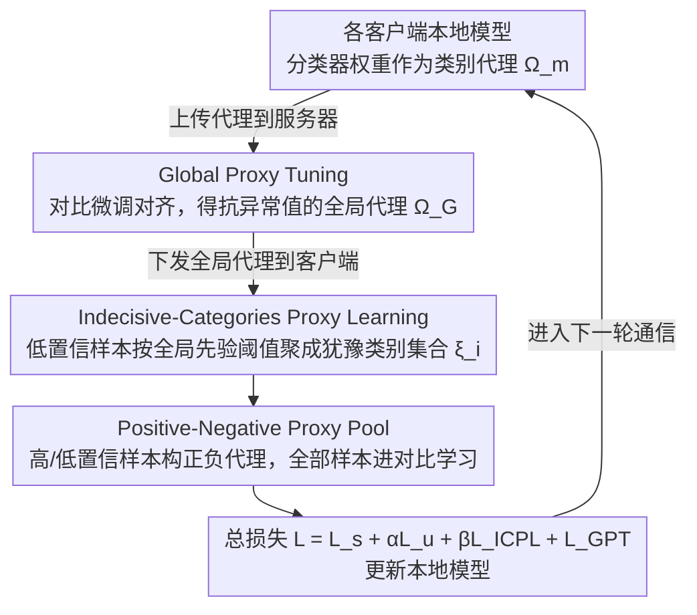

# ProxyFL: A Proxy-Guided Framework for Federated Semi-Supervised Learning

**会议**: CVPR 2026  
**arXiv**: [2602.21078](https://arxiv.org/abs/2602.21078)  
**代码**: [DuowenC/FSSLlib](https://github.com/DuowenC/FSSLlib)  
**领域**: AI安全  
**关键词**: 联邦学习, 半监督学习, 数据异质性, 代理学习, 伪标签

## 一句话总结

提出 ProxyFL 框架，利用分类器权重作为统一代理 (proxy) 同时缓解联邦半监督学习中的外部异质性（跨客户端分布差异）和内部异质性（标注/未标注数据分布不匹配），在多个数据集上显著超越现有 FSSL 方法。

## 研究背景与动机

联邦半监督学习 (FSSL) 允许多个客户端在保护隐私的前提下利用少量标注数据和大量无标注数据协作训练全局模型。核心挑战在于数据异质性的两个层面：

**外部异质性**：不同客户端间的数据分布差异（non-IID）。现有方法通过动态聚合权重缓解,但简单平均容易被异常客户端拉偏，偏离全局类别分布。

**内部异质性**：单个客户端内标注数据与未标注数据的分布不匹配。现有方法通常丢弃低置信度样本避免伪标签错误，但这导致训练数据参与量不足。

作者通过实验发现两个关键观察：(1) 简单平均分类器权重容易被异常值偏移，无法有效捕获全局类别分布；(2) 随着异质性增大，更多未标注样本被排除在训练之外，而这些样本实际上有潜力提升性能。

## 方法详解

### 整体框架

ProxyFL 的出发点是：联邦半监督学习里数据异质性有"外部"（客户端之间分布不同）和"内部"（同一客户端里标注/未标注分布不一致）两层，而分类器最后一层全连接的权重 $\boldsymbol{\Omega}_m = \{\omega_m^c\}_{c=1}^C$ 天然刻画了每个类别的方向，正好可以当成统一的"类别代理 (proxy)"来建模本地和全局分布。整套框架就围绕这个代理转：服务器端用 **Global Proxy Tuning (GPT)** 把各客户端的代理拟合成一个不被异常值带偏的全局代理，客户端用 **Indecisive-Categories Proxy Learning (ICPL)** 给过去被丢弃的低置信样本构建"犹豫类别集合"，再通过 **Positive-Negative Proxy Pool** 把这些样本一并拉回对比学习。代理本身就是模型参数，不额外传输、也不引入隐私风险。

### 关键设计

**1. Global Proxy Tuning：在服务器端把代理拟合成抗异常值的全局类别分布**

简单平均各客户端的分类器权重容易被异常客户端拉偏，得到的全局类别分布并不准。GPT 先用平均 $\overline{\boldsymbol{\Omega}}_{\mathcal{G}}$ 初始化全局代理，再用一个对比学习目标做微调——把全局代理 $\boldsymbol{\Omega}_{\mathcal{G}}^c$ 拉近所有客户端的同类别本地代理、推远不同类别的本地代理：

$$\mathcal{L}_{\text{GPT}} = \sum_{c=1}^{C}\sum_{m=1}^{M} -\log \frac{e^{-\phi(\boldsymbol{\Omega}_{\mathcal{G}}^c, \omega_m^c)}}{e^{-\phi(\boldsymbol{\Omega}_{\mathcal{G}}^c, \omega_m^c)} + \sum_{c' \neq c} e^{-\phi(\boldsymbol{\Omega}_{\mathcal{G}}^c, \omega_m^{c'})}}$$

这样全局代理是被"对齐"出来的而非简单平均出来的，异常客户端的偏移会被同类别的多数样本稀释。这一步开销极低，复杂度仅 $O(Q \times M \times C^2 \times d)$，以 CIFAR-100 为例约 0.4 GFLOPs，相当于推理一张图，可忽略不计。

**2. Indecisive-Categories Proxy Learning：用"犹豫类别集合"留住低置信样本**

异质性越大，越多未标注样本因为置信度低而被现有方法直接丢弃，训练数据因此被浪费。ICPL 不再给低置信样本 $\mathbf{u}_i^{\text{lc}}$ 硬塞单一伪标签，而是为它构建一个"犹豫类别集合" $\xi_i$：凡是全局 logit $\overline{\mathbf{y}}_i(c)$ 超过全局类别先验 $\mathcal{P}_{\mathcal{G}}'(\mathbf{Y}(c))$ 的类别都纳入集合，

$$\xi_i = \{c \mid \overline{\mathbf{y}}_i(c) > \mathcal{P}_{\mathcal{G}}'(\mathbf{Y}(c))\}$$

其中先验 $\mathcal{P}_{\mathcal{G}}'$ 是各客户端预测偏好的聚合，给多数类设更高门槛、少数类设更低门槛，从而动态地控制集合的松紧。保留集合而不是逼出一个确定标签，等于把样本的不确定性显式交给下游对比学习去消化。

**3. Positive-Negative Proxy Pool：让所有样本都进对比学习**

有了每个样本的类别集合，就能构建正负代理池把样本真正用起来。高置信样本的正代理就是其伪标签类的代理权重 $\omega_i^{\text{hc}} = \omega_k^{\hat{y}_i}$；低置信样本的正代理则是犹豫类别代理的加权求和 $\omega_i^{\text{lc}} = \sum_{c' \in \xi_i} \tilde{\mathbf{y}}_i(c') \times \omega_k^{c'}$，负样本取批次中类别集合与当前样本无交集的特征。通过这个对比目标，连最不确定的低置信样本也能贡献梯度，外部异质性（全局代理对齐）和内部异质性（低置信样本利用）就在同一个代理框架里被一并处理。

### 损失函数 / 训练策略

总损失函数分为本地和全局两部分：

$$\mathcal{L} = \underbrace{\mathcal{L}_s + \alpha \mathcal{L}_u + \beta \mathcal{L}_{\text{ICPL}}}_{\text{local}} + \underbrace{\mathcal{L}_{\text{GPT}}}_{\text{global}}$$

- $\mathcal{L}_s$：标注数据的交叉熵损失
- $\mathcal{L}_u$：高置信度未标注数据的 KL 散度损失（强增强预测 vs 伪标签）
- $\mathcal{L}_{\text{ICPL}}$：全部未标注数据的对比学习损失
- $\alpha, \beta$ 均设为 1

## 实验关键数据

### 主实验

10% 标签率，Dirichlet 分布控制异质性（$\alpha$ 越小异质性越大）：

| 数据集 | $\alpha$ | 指标(Acc) | ProxyFL | 之前SOTA(SAGE) | 提升 |
|--------|---------|-----------|---------|----------------|------|
| CIFAR-10 | 0.1 | Acc | 88.56 | 87.05 | +1.51 |
| CIFAR-100 | 0.1 | Acc | 57.50 | 54.18 | +3.32 |
| SVHN | 0.1 | Acc | 95.09 | 93.85 | +1.24 |
| CINIC-10 | 0.1 | Acc | 77.98 | 74.59 | +3.39 |
| CIFAR-100 | 0.5 | Acc | 58.75 | 55.82 | +2.93 |
| CINIC-10 | 0.5 | Acc | 78.96 | 75.74 | +3.22 |

在 SVHN 和 CINIC-10 ($\alpha=0.1$) 上甚至接近全标注上界 FedAvg-SL 的性能。

### 消融实验

| 配置 | CIFAR-10 ($\alpha$=0.1) | CIFAR-100 ($\alpha$=0.1) | 说明 |
|------|------------------------|--------------------------|------|
| Baseline (GPL) | 84.56 | 48.96 | FedAvg+FixMatch-GPL |
| +GPT | 87.59 | 54.86 | 全局代理调优显著提升 |
| +ICPL | 87.81 | 57.21 | 低置信度样本参与有效 |
| +GPT+ICPL | **88.56** | **57.50** | 两模块互补达最优 |

犹豫类别集合设计对比（$\alpha=0.1$）：

| 策略 | CIFAR-100 | SVHN | 说明 |
|------|-----------|------|------|
| Top-1 | 55.66 | 94.56 | 单一伪标签 |
| Top-5 | 56.58 | 94.71 | 固定 top-5 类别 |
| $\mathcal{P}_{\mathcal{G}}'(\mathbf{Y})$ | **57.21** | **94.82** | 动态先验阈值最优 |

### 关键发现

- **收敛速度**：ProxyFL 在 CIFAR-100 ($\alpha=0.1$) 上达到 50% 准确率仅需 177 轮，比 LPL 的 562 轮加速 3.18×
- **犹豫类别集合的召回率**显著高于单一伪标签的准确率，验证了集合策略的合理性
- **代理 vs 原型**：代理方法在所有数据集上优于 FedProto+FSSL 变体，且不引入隐私风险（原型可能被逆向重建）

## 亮点与洞察

- 创新性地将分类器权重作为"代理"统一处理外部和内部异质性，避免了原型方法的隐私泄露风险
- 犹豫类别集合是一个优雅的设计——不用单一伪标签硬编码，而是保留不确定性，让对比学习自然处理
- GPT 模块的服务器端调优开销极低（约等于推理一张图），实用性强

## 局限与展望

- 仅在图像分类任务上验证，未扩展到检测、分割等更复杂任务
- 实验仅涉及 Label-at-All-Client 场景，Labels-at-Partial-Clients 等其他 FSSL 场景未覆盖
- 犹豫类别集合的先验分布 $\mathcal{P}_{\mathcal{G}}'$ 依赖全局通信轮次的累积，早期轮次可能不稳定
- 客户端数量固定为 20，更大规模联邦场景的可扩展性未探讨

## 相关工作与启发

- **FedDure / SAGE**：当前 FSSL SOTA，ProxyFL 在此基础上进一步引入代理机制
- **FedProto**：使用原型表示类别分布，但存在隐私泄露风险（特征可被逆向重建）
- **FixMatch**：SSL 基准方法，其高置信度过滤策略在 FSSL 中导致数据浪费
- 代理学习 (proxy learning) 在度量学习中已有应用，本文首次将其引入 FSSL 处理异质性

## 评分

- 新颖性: ⭐⭐⭐⭐ (统一代理框架同时处理内外异质性，概念清晰)
- 实验充分度: ⭐⭐⭐⭐⭐ (4 数据集 × 3 异质性级别，消融全面)
- 写作质量: ⭐⭐⭐⭐ (问题-观察-方案的推导逻辑清晰)
- 价值: ⭐⭐⭐⭐ (对 FSSL 领域有实质贡献)

<!-- RELATED:START -->

## 相关论文

- [\[CVPR 2026\] FedRE: A Representation Entanglement Framework for Model-Heterogeneous Federated Learning](fedre_a_representation_entanglement_framework_for_model-heterogeneous_federated_.md)
- [\[CVPR 2025\] Geometric Knowledge-Guided Localized Global Distribution Alignment for Federated Learning](../../CVPR2025/ai_safety/geometric_knowledge-guided_localized_global_distribution_alignment_for_federated.md)
- [\[CVPR 2026\] Enabling Supervised Learning of Generative Signatures for Generalized AI-Generated Images Detection](enabling_supervised_learning_of_generative_signatures_for_generalized_ai-generat.md)
- [\[CVPR 2026\] FedDAP: Domain-Aware Prototype Learning for Federated Learning under Domain Shift](feddap_domain-aware_prototype_learning_for_federated_learning_under_domain_shift.md)
- [\[ICML 2025\] Generalization in Federated Learning: A Conditional Mutual Information Framework](../../ICML2025/ai_safety/generalization_in_federated_learning_a_conditional_mutual_information_framework.md)

<!-- RELATED:END -->
