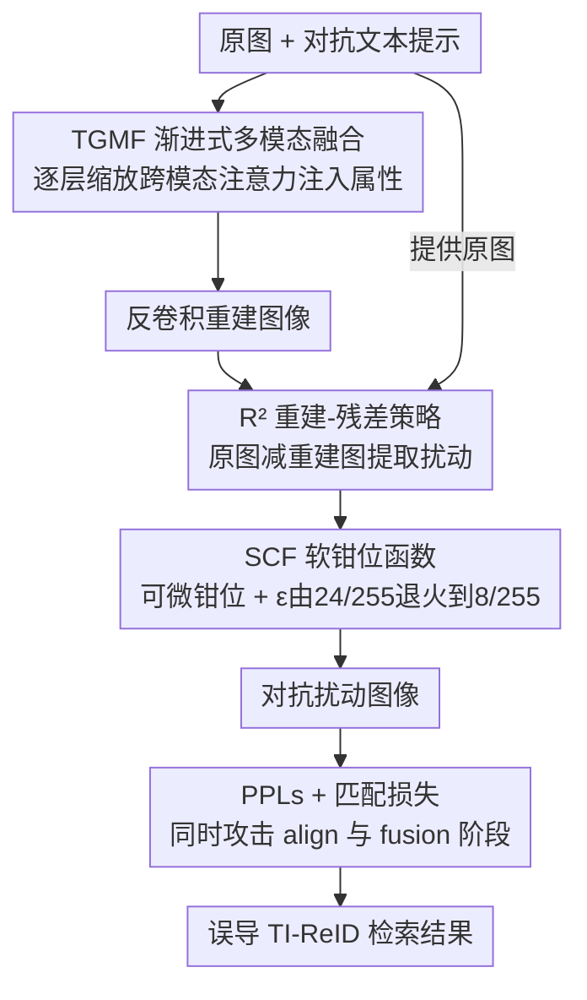

# R$^2$TUA: Reconstruction-residual Based Targeted and Untargeted Attack Against Text-Image Person Re-Identification

**会议**: CVPR 2026  
**论文**: [CVF Open Access](https://openaccess.thecvf.com/content/CVPR2026/html/Wang_R2TUA_Reconstruction-residual_Based_Targeted_and_Untargeted_Attack_Against_Text-Image_Person_CVPR_2026_paper.html)  
**代码**: 待确认  
**领域**: AI安全 / 对抗攻击  
**关键词**: 文本-图像行人重识别, 对抗攻击, 多模态融合, 重建残差, 目标/非目标攻击

## 一句话总结
R²TUA 是首个针对「文本-图像行人重识别」(TI-ReID) 的多模态对抗攻击：给定一张图和一句对抗文本提示，它先用渐进式多模态融合把对抗身份属性注入图像、再「重建-残差」式提取出几乎不可见的扰动，既能让原图无法被真实描述检索到（非目标），又能误导检索指向对抗身份（目标），在三个数据集、三个模型上全面超过所有可迁移的现有攻击。

## 研究背景与动机
**领域现状**：行人重识别 (ReID) 是监控网络的核心，但纯 RGB 的 ReID 在遮挡、光照变化、低分辨率、缺乏清晰目标图时会失效。文本-图像 ReID (TI-ReID) 允许用自然语言描述检索行人，扩展了应用范围。主流 TI-ReID 模型类似视觉-语言预训练模型 (VLP)：用 ViT 编码图像、text-transformer 编码文本，部分模型（受 ALBEF 启发，如 RaSa、APTM）还加一个融合 transformer 生成匹配概率做重排序（fusion 阶段）。

**现有痛点**：TI-ReID 继承了深度网络与 VLP 的对抗脆弱性，一旦被精心设计的微小扰动误导，系统会漏掉正确匹配、或把不相关的人排到前面——在失踪人口搜寻、嫌疑人追踪等关键部署里会误导操作员、浪费调度资源、让嫌疑人逃脱。然而 TI-ReID 的安全性几乎无人研究。

**核心矛盾**：TI-ReID 处在 ReID 与 VLP 的交叉点，但两边的攻击都迁移不过来。典型 ReID 攻击针对「属性无关」线索（体型、步态、面部轮廓），扰动细微外观细节；TI-ReID 却把图像匹配到强调性别、衣着、颜色、携带物等**属性语义**的文本描述，ReID 攻击破坏不了这些属性语义。而 VLP 攻击面向「一个走路的女人」这种粗粒度图-文对齐，无法应对「戴眼镜、穿红衬衫和深灰牛仔裤的男人」这种细粒度、身份相关的检索。

**本文目标**：(i) 把对抗身份属性精确注入扰动以实现细粒度的目标攻击；(ii) 生成不可见扰动且不被局部梯度消失困在次优局部最小值；(iii) 同时攻击 TI-ReID 的 align 阶段与 fusion 阶段。

**切入角度**：用「重建-残差」(Reconstruction-residual, R²) 策略——先把图与对抗文本融合重建出一张图，再用原图减重建图取残差当扰动。因为自编码器的压缩-重建会丢弃高频成分，残差能保留主结构、抑制无关噪声，避免直接法常见的高频差异，从而既隐蔽又鲁棒。

**核心 idea**：把「细粒度属性注入」和「隐蔽扰动生成」拆成重建与残差两相，再用逐层可调的多模态融合 + 可微软钳位把对抗属性精确而隐蔽地写进扰动。

## 方法详解

### 整体框架
R²TUA 分两相。**重建相**：重建器把待攻击图与「描述误导目标」的对抗文本提示在隐空间融合，输出一张重建图——ViT 编码器把图编成 patch latent、BERT 编码器把对抗提示编成 prompt latent，二者送入核心模块 TGMF 做逐层渐进融合，最后用基于反卷积的逆 patch embedding 把融合 latent 重建成图。**残差相**：残差扰动生成器 (RPG) 用原图减去重建图得到扰动，并经软钳位函数 SCF 与 SSIM 损失保证扰动几乎不可见。两相靠 R² 策略耦合：自编码器重建天然丢高频，残差因此保留主体结构、抑制无关噪声。训练时用「成对 batch 采样」交换两个 batch 的文本互作对抗提示，再用 PPLs 攻 align 阶段、匹配损失攻 fusion 阶段。

### 关键设计

**1. TGMF 渐进式多模态融合：逐层缩放跨模态注意力，把对抗属性精确注入图像**

TI-ReID 攻击要求属性级的细粒度图-文融合，而非 VLP 那种粗粒度对齐。TGMF 由多层 transformer 组成，每层带不同的交叉注意力与前馈缩放权重 $\gamma_l$，做渐进式逐层融合。每层先自注意力更新 $f$，再以对抗提示 latent $f_T$ 作 K/V 做交叉注意力 $A=\mathrm{Attn}(Q=f,K=\gamma_l f_T,V=\gamma_l f_T)$，并以 $f\leftarrow\mathrm{Norm}(\gamma_l A+(2-\gamma_l)f)$ 混合，逐层衰减 $\gamma_{l+1}=\eta\cdot\gamma_l$（$\eta\le1$）。**浅层**（如 1–3 层）$\gamma_l\to1$，对抗提示影响强，把对抗属性语义注入图像 latent；**深层**（如 4–6 层）$\gamma_l<1$，提示影响减弱、图像 latent 主导，从而在注入身份属性的同时保住人的核心结构与外观。这正是它区别于「文本驱动图像编辑」之处：编辑只管改外观，TGMF 要在改属性的同时保持视觉一致。

**2. R² 重建-残差策略：先重建再取残差，得到低频友好的隐蔽扰动**

直接优化像素扰动往往带来扎眼的高频差异。R²TUA 改为：重建器输出重建图后，RPG 用原图减重建图得到残差当扰动。由于自编码器的压缩-重建会丢弃高频成分，残差天然保留图像主结构、抑制无关噪声，避免了直接法的高频伪影，使扰动更隐蔽也更鲁棒。这一相把「属性注入」(重建相完成) 与「扰动提取」(残差相完成) 解耦，是连接 TGMF 与后续钳位/损失的桥梁。

**3. SCF 软钳位函数：可微钳位 + 课程式 ε，避开局部梯度消失**

显式控制扰动幅度通常用 $\ell_\infty$ 硬钳位（$\lVert\delta\rVert_\infty\le\epsilon$，$\epsilon=8/255$），但硬钳位在 $|x|>\epsilon$ 区域梯度为零，会困住训练。SCF 定义 $C(x)=\dfrac{\epsilon x}{\sqrt[2n]{\epsilon^{2n}+x^{2n}}}$，有两个关键性质：其一**全可微**，即便 $|x|>\epsilon$ 也能反传梯度，避免局部梯度消失与「死神经元」；其二在阈值内的值**几乎不失真**（区别于 $\tanh$ 会扭曲门限内的值），因此支持训练中**动态调整 $\epsilon$**。平滑温度 $n$ 控制形状：$n$ 太大退化成硬钳位丢掉可微性、太小像 $\tanh$ 丢掉不失真性，作者取 $n=10$。利用不失真特性，作者采用 easy-to-hard 课程：$\epsilon$ 从较大的 $24/255$ 退火到 $8/255$——大初值扩大搜索域使训练更易，后续收紧保证扰动隐蔽性同时维持攻击力。另配 SSIM 损失 $L_{\mathrm{SSIM}}$ 作隐式不可见约束。

**4. PPLs + 匹配损失：同时攻陷 align 与 fusion 两阶段**

只破坏 align 阶段不够，现代 TI-ReID（RaSa、APTM）还用 fusion 阶段重排序，所以要双管齐下。**Push-Pull Losses (PPLs)** 攻 align 阶段：基于 InfoNCE，「push」最大化受扰图与其真实描述的距离、「pull」最小化它与对抗提示的距离，使模型既错配真实描述、又把结果偏向指定身份。配合「成对 batch 采样」——采两个 batch $(T^A,I^A)$、$(T^B,I^B)$ 交换文本作对抗提示，让每条描述身兼两职（既是某受扰图要躲开的真实描述、又是另一受扰图要被误导命中的对抗提示），提升训练效率。**匹配损失 (Matching Losses)** 攻 fusion 阶段：fusion 用交叉注意力解码器把 query 文本与 top-$k$（$k=128$）相似图配对、经分类器生成匹配概率 $P(I,T)=\mathrm{Softmax}(F(h_{[CLS]}))$；匹配损失用交叉熵压低「图-真实描述」的匹配概率、抬高「图-对抗提示」的匹配概率，并加入难负样本逼出更鲁棒的扰动。总损失 $L=\alpha L_{\mathrm{PPLs}}+(2-\alpha)L_{\mathrm{MtLs}}$。

### 损失函数 / 训练策略
PyTorch 2.1 + 单张 RTX 3090 (24GB)。重建器中 ViT、BERT、TGMF 各 6 层，TGMF 缩放因子 $\eta=0.9$；训练 30 epoch，成对 batch 大小 $N=16$，损失权重 $\alpha=1$，AdamW 学习率 $10^{-5}$；$\epsilon$ 首 epoch 为 $24/255$，每 epoch 衰减 10% 直到 $8/255$。非目标攻击指标越低越好、目标攻击越高越好。

## 实验关键数据

数据集为三个真实 TI-ReID 库：CUHK-PEDES、ICFG-PEDES、RSTP-ReID（均含光照变化、遮挡等复杂条件与多样描述）。目标模型含两个强 align-fusion 模型 RaSa、APTM 和一个 align-based 模型 IRRA。指标用标准 TI-ReID 的 Rank-1/5/10 准确率 (R@1/5/10) 与 mAP。对比方法两类：可适配的 VLP 攻击 (SGA、VLPTAttack、MFHA、AnyAttack) 与仅用图像的 ReID 攻击 (MisRanking、MetaAttack、MTGA)。

### 主实验（非目标攻击，R@1 越低越好，target=RaSa；单位 %）
| 数据集 | 无攻击基线 R@1 | 最强对比基线 R@1 | R²TUA R@1 |
|--------|---------------|------------------|-----------|
| CUHK-PEDES | 76.51 | 8.48 (AnyAttack) | **0.11** |
| ICFG-PEDES | 65.28 | 7.15 (SGA) | **0.15** |
| RSTP-ReID | 66.90 | 6.70 (MetaAttack) | **0.65** |

R²TUA 把 RaSa 在 CUHK 上的 R@1 从 76.51% 砸到 0.11%，比最强对比方法再低近两个数量级；在 APTM 上同样大幅领先（如 CUHK 基线 76.53%）。

### 目标攻击（R@1 越高越好，target=RaSa；单位 %）
| 数据集 | AnyAttack（最强对比） | R²TUA (Targeted) |
|--------|----------------------|------------------|
| CUHK-PEDES | 31.26 | **89.43** |
| ICFG-PEDES | 34.09 | **68.48** |
| RSTP-ReID | 32.40 | **84.60** |

R²TUA 能把检索强行导向对抗身份，目标 R@1 远超唯一可做目标攻击的对比方法 AnyAttack（CUHK 上 89.43% vs 31.26%）。

### 关键发现
- **ReID 攻击与 VLP 攻击都迁移不过来**：MisRanking/MetaAttack/MTGA（纯图像 ReID 攻击）和 SGA/VLPTAttack（VLP 攻击）的非目标 R@1 都远高于 R²TUA，印证了「属性语义」才是 TI-ReID 攻击的命门，只有多模态融合注入属性才有效。
- **目标攻击是质变**：把检索导向**指定**对抗身份（而非只是打乱），是本文相对所有现有方法的最大增量，目标 R@1 大幅领先。
- **双阶段攻击必要**：PPLs 攻 align、匹配损失攻 fusion，缺一会留下重排序补救的余地（⚠️ 具体消融数值见原文）。
- **黑盒可迁移**：作者称对黑盒模型有强适应性与可迁移性，在多任务上超过所有相关攻击（⚠️ 以原文表格为准）。

## 亮点与洞察
- **「重建-残差」把隐蔽性问题转成频域问题**：借自编码器丢高频的特性，让残差天然低频友好，绕开直接优化的高频伪影——这个思路可迁移到任何需要「隐蔽扰动」的对抗生成任务。
- **SCF 用一个解析式同时拿下可微 + 不失真**：既让梯度穿过钳位区避免死神经元，又保证门限内值不变从而支持课程式 $\epsilon$ 退火，是对「梯度保持钳位」($\tanh$ 类) 的实质改进。
- **TGMF 的 $\gamma_l$ 逐层衰减是个优雅的「先注属性、后保结构」调度**：浅层强注入、深层弱注入，用单个标量调度就平衡了属性篡改与视觉一致，可启发其它需要「可控强度跨模态注入」的任务。

## 局限与展望
- 攻击需要图与对抗文本配对输入，依赖能描述「误导目标」的对抗提示，提示质量影响目标攻击精度。
- 重建器含 ViT+BERT+6 层 TGMF，训练 30 epoch，相对纯 UAP 类攻击计算成本更高（虽推理时只需贴扰动）。
- 评测集中在三个公开 TI-ReID 库与三个模型，对工业级闭源系统、更强防御（对抗训练、扰动检测）下的鲁棒性未充分验证。
- 作为「首个 TI-ReID 攻击」其防御对策尚未给出，论文定位是揭示与量化脆弱性，防御侧留作未来工作。

## 相关工作与启发
- **vs VLP 攻击 (SGA / VLPTAttack / MFHA / AnyAttack)**：它们面向粗粒度图-文对齐，无法应对 TI-ReID 的细粒度属性检索；R²TUA 用 TGMF 做属性级融合，非目标 R@1 普遍低一个数量级、且能做目标攻击。
- **vs ReID 攻击 (MisRanking / MetaAttack / MTGA)**：纯图像、攻属性无关线索，既不考虑文本也做不了目标攻击；R²TUA 多模态融合后非目标与目标攻击均显著占优。
- **vs 文本驱动图像编辑**：编辑只追求改外观，R²TUA 必须在注入对抗属性的同时保持视觉一致，靠 TGMF 的 $\gamma_l$ 逐层衰减实现，目标不同。

## 评分
- 新颖性: ⭐⭐⭐⭐⭐ 首个 TI-ReID 多模态对抗攻击，R² 重建-残差 + SCF + 双阶段损失组合新颖
- 实验充分度: ⭐⭐⭐⭐ 三数据集三模型、目标/非目标、黑盒迁移齐全，但缺对防御机制的鲁棒性评估
- 写作质量: ⭐⭐⭐⭐ 把 ReID/VLP 攻击为何迁移失败讲得透彻，算法与公式清晰
- 价值: ⭐⭐⭐⭐⭐ 首次系统揭示 TI-ReID 安全脆弱性，对监控系统安全与防御研究有重要警示意义

<!-- RELATED:START -->

## 相关论文

- [\[NeurIPS 2025\] Unifying Re-Identification, Attribute Inference, and Data Reconstruction Risks in Differential Privacy](../../NeurIPS2025/ai_safety/unifying_re-identification_attribute_inference_and_data_reconstruction_risks_in_.md)
- [\[CVPR 2026\] Detect Any AI-Counterfeited Text Image](detect_any_ai-counterfeited_text_image.md)
- [\[CVPR 2026\] PROMPTMINER: Black-Box Prompt Stealing against Text-to-Image Generative Models via Reinforcement Learning and VLM-Guided Optimization](promptminer_black-box_prompt_stealing_against_text-to-image_generative_models_vi.md)
- [\[CVPR 2026\] Good Can Sometimes be Bad: A Unified Attack against 3D Point Cloud Classifier by a Flexible Isotropic Resampling](good_can_sometimes_be_bad_a_unified_attack_against_3d_point_cloud_classifier_by_.md)
- [\[CVPR 2026\] Towards Human-Imperceptible Backdoor Attacks on Text-to-Image Diffusion Models](towards_human-imperceptible_backdoor_attacks_on_text-to-image_diffusion_models.md)

<!-- RELATED:END -->
