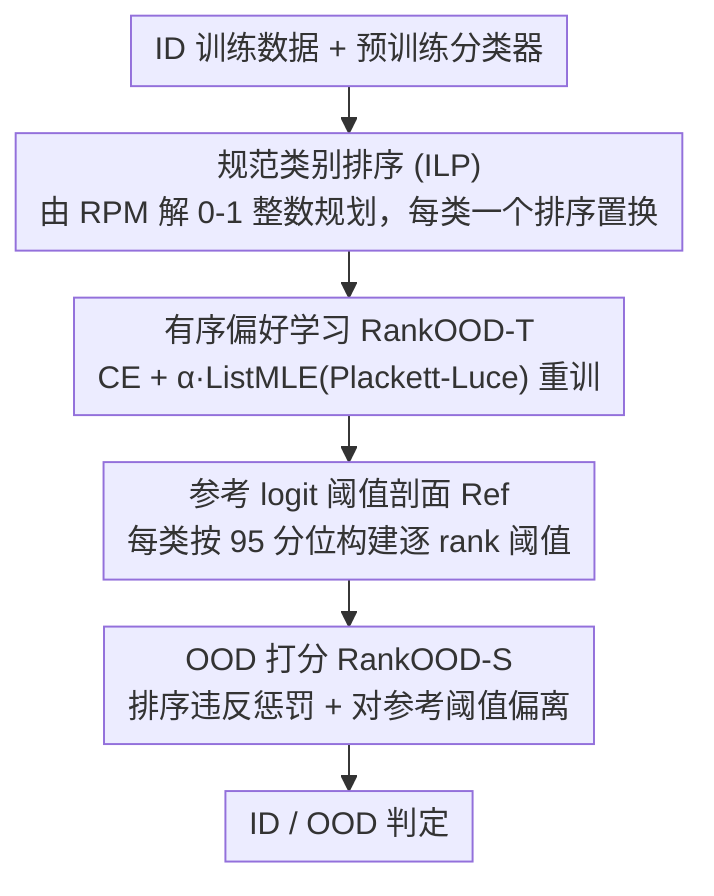

# RankOOD: Class Ranking-based Out-of-Distribution Detection

**会议**: CVPR 2026  
**论文**: [CVF Open Access](https://openaccess.thecvf.com/content/CVPR2026/html/Denipitiyage_RankOOD_-_Class_Ranking-based_Out-of-Distribution_Detection_CVPR_2026_paper.html)  
**代码**: 无  
**领域**: AI安全 / 分布外检测（OOD）  
**关键词**: OOD检测、类别排序、Plackett-Luce、ListMLE、列表式学习  

## 一句话总结
RankOOD 利用"分类器对每个 ID 类会自然诱导出一个类间排序模式、而 OOD 样本难以遵守这个排序"的洞察，先用 ILP 为每类抽出一个**规范排序（canonical rank）**、再用 **Plackett-Luce 的 ListMLE 损失**重训分类器去强化这个排序、最后按测试样本对规范排序的偏离打 OOD 分，在 TinyImageNet near-OOD 上把 FPR95 降了 4.3% 拿到 SOTA。

## 研究背景与动机
**领域现状**：OOD 检测分两大类。后处理（post-hoc）方法在预训练模型上直接从输出/中间特征提取 OOD 信号（如 MSP、Energy、Mahalanobis、ReAct），简单、不改网络、保 ID 性能；训练式方法改学习过程提升 ID/OOD 可分性，又分"无外部离群点"（如 LogitNorm、CSI、RotPred）和"有离群点"（如 Outlier Exposure、MixOE）两支，通常更强但常以掉 ID 精度或依赖外部数据为代价。

**现有痛点**：后处理方法效果高度依赖底层模型的校准质量；有离群点的训练方法虽强但需要充分多样的辅助离群数据、易过拟合到见过的离群点。最近兴起的"类别排序"思路（ExCeL、CRAFT）发现 ID 样本的类间排序更确定、OOD 会打乱排序——但 CRAFT 需要微调并把每个类的排序建成 $C\times C$ 的概率质量函数（PMF）矩阵，引入了架构改动，且**忽略了类别排名之间的相对次序**。

**核心矛盾**：一个 OOD 样本可能被过度自信地分到某个 ID 类（top-1 看不出异常），但它"是否遵守该类应有的完整排序结构"才是更可靠的判别信号；而现有排序方法要么只看 PMF 的逐位概率、要么需要额外网络/微调，没有把"整条排序列表的相对次序"作为一个整体来约束。

**本文目标**：在不微调、不引入辅助网络、不使用外部离群点的前提下，直接在预训练网络的原始 logits 上学习并利用类别排序结构来检测 OOD。

**切入角度**：作者借用偏好对齐里常用的 **Plackett-Luce 模型**——把每个类对应一个固定的排序置换当作"被预测变量"，用列表式最大似然（ListMLE）让整条 logit 列表服从该排序。OOD 样本即便被高概率分到某 ID 类，遵守该类完整排序的概率也很低。

**核心 idea**：用"ListMLE/Plackett-Luce 建模整条类别排序列表"代替"逐位 PMF 或 top-1 交叉熵"，把 OOD 检测落在"对规范排序的偏离程度"上。

## 方法详解

### 整体框架
RankOOD 分三步，输入是 ID 训练数据和一个预训练分类器，输出是每个测试样本的 OOD 分数 RankOOD-S。第一步用预训练模型为每个类求一个**规范类别排序**（解 ILP）；第二步用这些规范排序当 ground truth、以 CE + ListMLE 的混合损失重训分类器（记为 RankOOD-T）；第三步在推理时，为每类先建一个**参考 logit 阈值剖面**，再按测试样本对规范排序的违反程度与对参考阈值的偏离打分。整条流水线无需微调原架构、无需外部离群点。

### 关键设计

**1. 用 ILP 从排序概率矩阵抽出每类的规范排序**

要把"排序"当监督信号，先得给每个类定一个唯一、稳定的目标排序。作者沿用 CRAFT 的排序概率矩阵（RPM）：对类 $c$，从被正确预测为 $c$ 的 ID 样本统计 $P^c\in\mathbb{R}^{C\times K}$，其中 $p^c_{i,j}$ 表示"当输入被分为类 $c$ 时，类 $i$ 出现在第 $j$ 个 rank 的概率"，每一列是该 rank 位置上的一个 PMF。但随类别数增多，RPM 会变噪、在某些 rank 上出现并列。为得到一个一致的规范排序，作者解一个 0-1 整数线性规划：引入二值变量 $x^c_{i,j}\in\{0,1\}$（类 $i$ 是否被分到 rank $j$），目标 $\max_x \sum_{i}\sum_{j} x^c_{i,j}\,p^c_{i,j}$，约束 $\sum_i x^c_{i,j}=1\ \forall j$（每个 rank 恰选一个类）与 $\sum_j x^c_{i,j}\le 1\ \forall i$（每个类至多被选一次）。这就保证选出一个合法的排序置换、且在模型偏好结构下联合概率最大。相比直接用 PMF，ILP 给出的是"最具代表性的次序"，从源头消解了 rank 间的并列与噪声。

**2. 有序偏好学习 RankOOD-T：CE + ListMLE 的混合目标**

有了每类的规范排序当 ground truth，作者用 Plackett-Luce 模型的列表式最大似然（ListMLE）来训练，使整条 logit 列表服从该排序：

$$\mathcal{L}_{\text{ListMLE}}=-\sum_{i=0}^{K-1}\Big(l_{\pi_i}-\log\sum_{j=i}^{K-1}\exp(l_{\pi_j})\Big),\quad \mathcal{P}(\pi|l)=\prod_{i=0}^{K-1}\frac{\exp(l_{\pi_i})}{\sum_{j=i}^{K-1}\exp(l_{\pi_j})}$$

其中 $\pi=(\pi_0,\dots,\pi_{K-1})$ 是规范排序、$l_{\pi_i}$ 是排在第 $i$ 位的类的 logit。与只约束 top-1 正确的 CE 不同，ListMLE 优化整条置换的似然，强制 $l_{\pi_0}>\dots>l_{\pi_{K-1}}$ 的相对次序一致，从而保留丰富的类间关系结构。但只用 ListMLE 有两个漏洞：仅监督部分 rank（作者发现只取 top-k 和 bottom-k 即可）时不约束中间位置的绝对次序、也不保证 $l_{\pi_0}$ 是全 $C$ 个 logit 的全局最大。因此补一个交叉熵项把 top 类钉成 argmax：

$$\mathcal{L}_{RankOOD\text{-}T}=\mathcal{L}_{CE}+\alpha\,\mathcal{L}_{\text{ListMLE}}$$

$\alpha$ 平衡二者。整个过程只在标准视觉骨干（ResNet-18）上重训、不改架构、不用离群点——这是它相比 CRAFT 微调 + PMF 矩阵的简化优势。

**3. RankOOD-S：参考 logit 阈值剖面 + 排序违反的累积惩罚**

推理时怎么把"是否遵守排序"变成一个分数？分两部分。先离线为每类构建**参考 logit 阈值剖面** $Ref^c_i$：取被正确预测、且至少 $N$ 个 rank 位置预测正确的训练样本，对每个 rank 位置 $i$ 取其 logit 的经验 95 分位作为阈值。测试时，对样本先定其预测类 $\hat c$（最大 logit 对应的类）及其规范排序 $\pi^{\hat c}$，记样本实际预测排序为 $\bar\pi$。由于 Plackett-Luce 把 rank $i$ 与所有在前的 rank 耦合，某个位置排错会牵连之前 rank 的 logit，故定义逐 rank 的累积间隔惩罚 $\delta_{\pi^{\hat c}_i}=\gamma^{\,r}$，其中 $r=\sum_{j=i}^{K-1}\mathbb{1}[\pi^{\hat c}_j\neq\bar\pi_j]$（$\gamma\ge1$，错位越多惩罚指数级越大）。最终：

$$\text{RankOOD-S}=\sum_{i=0}^{K-1} w_i\,\log\big(\text{softmax}(\mathbf{u})\big)_i,\quad u_i=\frac{x_{\pi^{\hat c}_i}}{\delta_{\pi^{\hat c}_i}}-Ref^{\hat c}_i$$

权重 $w_i$ 由验证集上线性回归学习以最大化 ID/OOD 分离。直觉是：ID 样本应有"rank-0 logit 高、随 rank 单调下降且保持次序"的轨迹，而 ListMLE 训练让评分有序耦合，所以哪怕一个中间 rank 违反，也会暴露整条置信轨迹的不一致——这正是 OOD 易被捕捉的地方。⚠️ 公式 5 中 $\gamma$、$\delta$ 等符号以原文为准。

### 损失函数 / 训练策略
骨干用预训练 ResNet-18；CIFAR-10/100 训 500 epoch、TinyImageNet 训 300 epoch，SGD（momentum 0.9、初始 lr 0.1、cosine 退火）。$\alpha$ 在 CIFAR-10/100/TinyImageNet 上分别设 0.8/1.0/0.5，参考阈值统一取 95 分位。CIFAR-10 用全部 10 个 rank 训练，CIFAR-100 与 TinyImageNet 用 ILP 产出的 top-10 与 bottom-10 rank 训练。

## 实验关键数据

### 主实验
在 OpenOOD 环境下对比 34 个方法，ID 数据为 CIFAR-10/100 与 ImageNet-200（TinyImageNet），指标为 FPR95（越低越好）与 AUROC（越高越好），三个随机种子取均值。下表为 near-OOD 各 ID 数据集的平均：

| 方法 | 类别 | 平均 AUROC↑ | 平均 FPR95↓ |
|------|------|------------|------------|
| OE | 训练（有离群点） | **89.32** | **34.29** |
| **RankOOD (Ours)** | 训练（无离群点） | **85.39** | **44.79** |
| CRAFT | 训练（无离群点·排序） | 85.22 | 46.76 |
| GEN | 后处理 | 84.40 | 54.43 |
| LogitNorm | 训练（无离群点） | 84.49 | 49.56 |
| ExCeL | 后处理（排序） | 83.33 | 59.89 |

RankOOD 在 near-OOD 上取得**第二好**（仅次于用了外部离群点的 OE），且在 TinyImageNet near-OOD 上拿到 SOTA：AUROC 提升 0.50%、FPR95 降低 4.3%。far-OOD 下排名第三；相比同为排序的 CRAFT/ExCeL，平均 FPR95 在 far-OOD 降 7.51%、near-OOD 降 4.21%。

### 消融实验
| 配置 / 对比 | 关键指标 | 说明 |
|------|---------|------|
| RankOOD（无离群点）vs OE（有离群点） | near-OOD FPR95 44.79 vs 34.29 | 唯一胜出 RankOOD 的方法靠外部离群点，假设更强 |
| vs CRAFT（排序·微调） | near AUROC 85.39 vs 85.22 / FPR95 44.79 vs 46.76 | 不微调即超过，且建模了相对次序 |
| vs GEN（无离群点最强后处理） | CIFAR-100 FPR95 −3.36% | 无离群点设定下 CIFAR-100 取得最佳 FPR95 |
| vs G-ODIN（far-OOD CIFAR-100 最强） | TinyImageNet FPR95 −8.12% | G-ODIN 在 near-OOD 全面最差，RankOOD 更均衡 |
| 训练用 rank 子集 vs 全量 | 性能相当 | 只用 top-k + bottom-k 即够，无需监督全排序 |

### 关键发现
- **均衡性强**：RankOOD 在所有 benchmark 上稳定排进 near-OOD 前二、far-OOD 前三，不像 G-ODIN 那样 far 强 near 弱，说明排序结构是个鲁棒信号。
- **不靠外部数据也接近最强**：唯一全面胜出它的是 OE，而 OE 依赖辅助离群点；在"无离群点"这一更现实的设定里 RankOOD 几乎最好。
- **高基数标签空间收益大**：在类别数多的 TinyImageNet 上拿 SOTA，印证"类别越多、排序结构越有信息量"的假设。
- **rank 子集就够**：只用 top-10/bottom-10 训练即可达到全排序效果，降低了高类别数下的训练开销。

## 亮点与洞察
- **把偏好对齐的工具搬到 OOD**：用 LLM 对齐里常见的 Plackett-Luce/ListMLE 来建模类别排序，是个漂亮的跨领域迁移——OOD 检测被转成"整条置换的似然一致性"问题。
- **ILP 给排序去噪**：用 0-1 整数规划从噪声 RPM 中解出唯一规范排序，比直接用逐位 PMF 更稳，避免了 rank 并列的歧义。
- **指数级错位惩罚**：$\delta=\gamma^r$ 让"错位越多惩罚越狠"，配合 Plackett-Luce 的前向耦合，使单个中间 rank 违反就能暴露整条轨迹异常——这个累积惩罚设计可迁移到其它依赖序结构的异常检测。

## 局限与展望
- 依赖预训练模型已具备较好的类间排序结构；若底层模型校准差、排序本身不稳，规范排序与 RankOOD-S 都会失真。
- ILP 在类别数很大时的复杂度/运行时间是潜在瓶颈（⚠️ 作者称细节在附录），大规模标签空间下的可扩展性待验证。
- 仍需一轮重训（RankOOD-T），相比纯后处理方法不是"零成本即插即用"。
- 评测骨干统一为 ResNet-18，更大/更现代骨干（ViT 等）上的表现未报告。

## 相关工作与启发
- **vs CRAFT**：CRAFT 微调模型并把每类排序建成 $C\times C$ 的 PMF 矩阵、靠 PMF 散度检测，但有架构改动且忽略相对次序；RankOOD 直接在原始 logits 上用 Plackett-Luce 优化整条排序、不改架构，near/far 均超过它。
- **vs ExCeL**：ExCeL 是后处理，把最大 logit 与"类排名签名"组合打分；RankOOD 进一步用 ListMLE 显式学习排序结构，建模了 ExCeL 忽略的列表式依赖。
- **vs Outlier Exposure (OE)**：OE 用辅助离群点训练、惩罚过度自信，是 near-OOD 最强但依赖外部数据；RankOOD 不用任何离群点、在无离群点设定下逼近 OE，更适合拿不到代表性离群样本的场景。

## 评分
- 新颖性: ⭐⭐⭐⭐⭐ 把 Plackett-Luce/ListMLE 列表式排序学习引入 OOD 检测，视角新颖
- 实验充分度: ⭐⭐⭐⭐⭐ OpenOOD 下对比 34 个方法、三种 ID 数据、near/far 全覆盖
- 写作质量: ⭐⭐⭐⭐ 思路清晰、有 worked example，但部分公式在缓存中排版较乱
- 价值: ⭐⭐⭐⭐ 在"无离群点"设定下接近最强，且无需改架构，实用性好

<!-- RELATED:START -->

## 相关论文

- [\[CVPR 2026\] Enhancing Out-of-Distribution Detection with Extended Logit Normalization](enhancing_out-of-distribution_detection_with_extended_logit_normalization.md)
- [\[CVPR 2026\] Sparsity as a Key: Unlocking New Insights from Latent Structures for Out-of-Distribution Detection](sparsity_as_a_key_unlocking_new_insights_from_latent_structures_for_out-of-distr.md)
- [\[CVPR 2026\] Bypassing the Transport Plan: Dynamic Reweighting for Out-of-Distribution Detection with Optimal Transport](bypassing_the_transport_plan_dynamic_reweighting_for_out-of-distribution_detecti.md)
- [\[CVPR 2026\] Learning Latent Concepts for Detecting Out-of-Distribution Objects](learning_latent_concepts_for_detecting_out-of-distribution_objects.md)
- [\[ICLR 2026\] AP-OOD: Attention Pooling for Out-of-Distribution Detection](../../ICLR2026/ai_safety/ap-ood_attention_pooling_for_out-of-distribution_detection.md)

<!-- RELATED:END -->
