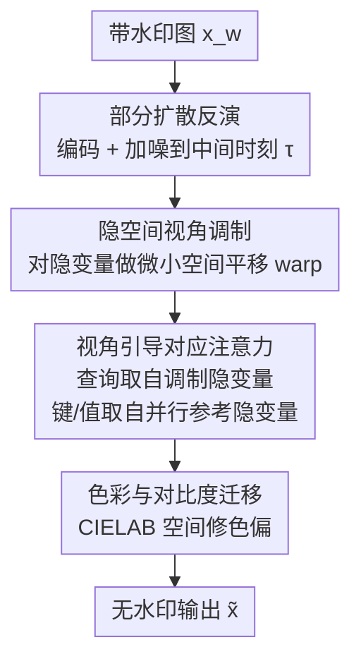

# RAVEN: Erasing Invisible Watermarks via Novel View Synthesis

**会议**: CVPR 2026  
**论文**: [CVF Open Access](https://openaccess.thecvf.com/content/CVPR2026/html/Shamshad_RAVEN_Erasing_Invisible_Watermarks_via_Novel_View_Synthesis_CVPR_2026_paper.html)  
**代码**: https://github.com/fahadshamshad/raven-watermark-removal  
**领域**: AI安全 / 数字水印 / 扩散模型  
**关键词**: 不可见水印, 水印去除攻击, 新视角合成, 扩散模型, 零样本

## 一句话总结
RAVEN 把"擦掉 AI 生成图里的不可见水印"重新表述成"换个视角重看同一场景"——用冻结的图生图扩散模型在隐空间做一个微小的视角平移，配上跨视角对应注意力维持画面一致性，在不接触检测器、不知道水印算法的零样本设定下，对 15 种水印方法做到平均 TPR@1%FPR 仅 0.026，比最强攻击基线再降 60%+，同时画质（FID 40.18）反而最好。

## 研究背景与动机
**领域现状**：不可见水印已成为 AI 生成内容溯源的关键手段，SynthID、Tree-Ring、StableSignature 等被部署进数亿张图片，EU AI Act、美国 AI 行政令都明确要求对生成内容加水印。要评估这些方案是否真的可靠，就必须用足够强的去除攻击去"压力测试"它们。

**现有痛点**：现有去水印攻击在像素空间（JPEG、滤波、加噪、BM3D）或隐空间（扩散净化）操作，但两类都没能同时做到"画质不掉"和"检测器失效"。像素方法对现代语义水印基本无效、还会留可见伪影；隐空间扩散净化要把水印压下去就得注入大量噪声，结果破坏场景结构、画质崩坏。更糟的是，效果好的方法往往依赖**特权信息**：要么访问水印解码器（白盒），要么用干净/带水印配对数据训代理模型，要么单图优化要跑 40 分钟。

**核心矛盾**：水印去除本质是一个三方博弈——检测规避（P1）、语义保持（P2）、视觉自然度（P3）这三个目标天然耦合且冲突。压得越狠，语义/画质越容易塌；改得越保守，又躲不过检测。现有方法只能在其中顾此失彼。

**本文目标**：在一个严格的"无盒"威胁模型下（不知道水印算法、检测器内部、不能查检测 API、没有配对数据、只有单张图、消费级硬件、秒级耗时）做到既擦干净又不掉画质。

**切入角度**：作者的关键洞察是——水印依赖**精确的像素级空间相关性**来被检出。如果我换一个"视角"重新观察同一场景，生成的新图语义一致、画面逼真，但与原水印信号在统计上解耦了，水印自然就失效了。这暴露了当前鲁棒性评测的一个盲区：能扛住像素扰动和隐空间净化的水印，却扛不住"保语义的视角变换"。

**核心 idea**：把水印去除重新表述为**新视角合成（NVS）问题**——但不真做 3D 重建（那要多视角监督和重训），而是用冻结的图生图扩散模型在隐空间做一个受控的微小视角平移，靠扩散模型自带的几何/语义先验把新视角"脑补"得自然。

## 方法详解

### 整体框架
RAVEN 接收一张带水印图 $x_w$，输出一张语义一致、检测器认不出水印的新图 $\tilde{x}$。整条流水线全程在冻结的 Stable Diffusion 图生图模型上零样本运行，分四步：先把图编码进隐空间并做**部分扩散反演**（只加到中间时刻、保留结构），再在隐空间施加**视角调制**（一个微小的空间平移把水印的空间对齐打乱），denoise 时用**视角引导对应注意力**让生成的新视角在外观上锚定到一个并行去噪的参考隐变量，最后做一次 CIELAB 空间的**色彩与对比度迁移**修掉残留色偏。整体是一条"反演→调制→约束去噪→后校正"的串行管线。

### 关键设计

**1. 部分扩散反演：只破坏到"够换视角"，不破坏到"丢语义"**

直接对带水印图加满噪声再重建（即 Regen 那类做法）能擦水印，但噪声越大语义漂移越严重。RAVEN 用扩散编码器把 $x_w$ 映射为隐变量 $z=\mathcal{E}(x_w)$，再只加噪到一个中间时刻 $\tau=\lfloor s\cdot T\rfloor$：$z_\tau=\sqrt{\bar\alpha_\tau}\,z+\sqrt{1-\bar\alpha_\tau}\,\epsilon$。其中 $s\in[0,1]$ 是强度参数，控制"注入随机性"与"保语义"的权衡——$s$ 小保细节但可能残留水印，$s$ 大压得狠但易出伪影（实测论文用 $s=0.15$ 这种很小的强度）。这一步的意义是：暴露出水印纠缠的表征、同时保住整体场景结构，为下一步的视角调制留出可操作的隐变量。

**2. 隐空间视角调制：用一次微小相机平移打散水印的空间对齐**

水印之所以可检出，靠的是像素级空间相关性。这一步用一个空间 warp 函数 $\mathcal{C}_\theta:\mathbb{R}^2\to\mathbb{R}^2$ 直接在隐空间重采样：$\tilde{z}_\tau[i,j]=z_\tau[\mathcal{C}_\theta(i,j)]$，让输出隐变量的每个位置从一个偏移后的位置取内容，等价于"从稍微挪动的相机位置重看同一场景"。作者强调**不需要**传统 NVS 那套多视角训练、深度估计、3D 一致性建模——目标不是重建未见几何，只要一个保语义的小扰动即可。最简单有效的选择就是全局平移 $\mathcal{C}_\theta(i,j)=(i+\Delta x,\,j+\Delta y)$（实现里沿两轴随机取 $[24,32]$ 或 $[-32,-24]$ 像素的对角平移）。这点位移足以让水印的空间对齐失效，却不动语义。

**3. 视角引导对应注意力：让新视角"抄"参考视角的外观，水印却抄不过来**

光做视角调制后直接去噪是不够的——扩散模型会把 $\tilde{z}_\tau$ 当成一张独立图，导致外观漂移、色偏、细节丢失。RAVEN 改造 UNet 里的自注意力：额外从未调制的反演隐变量 $z_\tau$ 并行去噪出一个参考隐变量 $z_t^{\text{ref}}$，每个时刻让**查询**来自调制隐变量、**键/值**来自参考：$\text{ViewAttn}=\text{softmax}\!\big(\frac{(W_Q\tilde{z}_t)(W_K z_t^{\text{ref}})^\top}{\sqrt{d}}\big)W_V z_t^{\text{ref}}$。关键在于注意力工作在**学到的特征空间**而非像素坐标——每个查询按语义相似度去参考里匹配对应区域，天然容忍视角调制带来的空间错位，从而在保住外观/纹理/物体身份的同时，让依赖精确像素对齐的水印继续处于"被打散"状态。这是"既擦水印又不掉画质"的核心机制。

**4. 色彩与对比度迁移：CIELAB 空间补一刀，修掉随机去噪带来的色偏**

随机去噪后仍可能残留细微色偏/对比度不一致。RAVEN 在 CIELAB 空间做一次轻量后校正：色彩上保留优化图的亮度、采用带水印图的色度（$x_c=F_{\text{RGB}}(L_{\text{opt}},a_w,b_w)$）；对比度上把亮度统计对齐回带水印图（$L_{\text{final}}=\frac{\sigma_w}{\sigma_c}(L_{\text{opt}}-\mu_c)+\mu_w$）。这一步只修感知质量、不会把水印带回来——消融显示它在所有水印方法上都一致改善 FID。注意：复用 $a_w,b_w$ 这类带水印图的色度通道不会复活水印，因为水印的可检性靠的是被前三步打散的空间结构，而非色度统计 ⚠️（此为对论文机制的理解，以原文为准）。

### 损失函数 / 训练策略
RAVEN **不训练、不微调任何参数**，全程用冻结的图生图 Stable Diffusion Refiner 零样本运行：CFG scale 2.5、50 步 DDIM 反演、图生图 strength 0.15；因不知原始 prompt，反演与重建都用空文本 prompt。单张 A100 即可，秒级完成——这正好满足威胁模型里"无特权、无数据、消费级算力、秒级耗时"的约束。

## 实验关键数据

### 主实验
在 MS-COCO、DiffusionDB、SD-Prompts 三个数据集上，对 15 种水印方法、14 种去除攻击基线评测。语义水印报 TPR@1%FPR（**越低越好**，水印被检出率），位流水印报 Bit Accuracy（**越接近 0.5 越好**，表示比特被随机化）。

| 数据集 | 指标 | RAVEN | 最强基线 UnMarker | 说明 |
|--------|------|-------|------|------|
| MS-COCO（语义水印均值） | TPR@1%FPR ↓ | **0.026** | 0.078 | 相对再降 >60% |
| SD-Prompts（语义水印均值） | TPR@1%FPR ↓ | **0.031** | 0.083 | 跨数据集一致 |
| MS-COCO（位流水印均值） | Bit Acc.（→0.5） | **0.533** | 0.573 | 更接近随机 |
| MS-COCO | FID ↓ | **40.18** | 49.85 | 三类攻击里画质最好 |
| MS-COCO | CLIP ↑ | **0.328** | 0.316 | 语义对齐最高 |

经典像素攻击（亮度/对比/JPEG/模糊/加噪/BM3D）对语义水印基本无效（TPR 普遍 0.8+）；再生类（Regen/Rinse/VAE）只能中等压制；UnMarker 是最强基线（MS-COCO 0.078）但画质有损。RAVEN 在检测规避和画质上同时领先。

### 消融实验
| 配置 | 关键指标 | 说明 |
|------|---------|------|
| 完整 RAVEN | TPR 0.026 / FID 40.18 | 四步全开 |
| 去掉视角引导注意力 | 结构严重扭曲 | 隐空间视角调制后无锚定，画面崩 |
| 去掉色彩对比迁移 | FID 变差（HSTR/HSQR/TreeRing/RingID 均退） | 色偏/对比度不一致未修 |
| 强度 $s$：0.10→0.45 | FID 62.68→85.10 | $s$ 越大压得越狠但画质越差，0.15 为折中 |
| 换 SD v1.5/v2.0/v2.1 骨干 | TPR 均 <0.03 | 模型无关，无需逐模型调参 |

### 关键发现
- **视角引导对应注意力是画质的命门**：去掉它，视角调制后的隐变量去噪会造成严重结构畸变；加上它才能在擦水印的同时保住细节纹理。
- **强度参数 $s$ 是去除强度与画质的旋钮**：$s$ 控制部分反演的噪声注入量，论文取 0.15 这种很小的值即足够擦掉绝大多数水印且画质最优——说明 RAVEN 的去水印主要靠"视角变换"而非"噪声覆盖"。
- **模型无关泛化**：换 SD v1.5/v2.0/v2.1 三个骨干，TPR 都 <0.03、画质相当，说明视角合成攻击不依赖某个特定扩散架构。
- **位流水印更难压到完美 0.5**：RAVEN 把 MS-COCO 位流均值压到 0.533（UnMarker 0.573），更接近随机但未完全随机化 ⚠️（位流水印冗余编码较强，与语义水印不可直接比难度）。

## 亮点与洞察
- **重新表述（reframing）的力量**：把"去水印"换成"换视角"这一概念转换，直接绕开了"压水印 vs 保画质"的老 trade-off——因为换视角天生保语义、又破坏像素级空间相关性。这是全文最"啊哈"的地方：攻击向量本身是新的，而非又一个更强的优化器。
- **零样本 + 冻结模型**：不训练、不要配对数据、不碰检测器，秒级单图完成，把"实用威胁模型"做到了极致——这让结论更有警示意义：现实里的攻击者真能这么干。
- **跨视角注意力可迁移**："查询来自变换视角、键值来自参考视角"这种用注意力在特征空间做软对齐、容忍空间错位的机制，可迁移到任何"想让生成结果锚定一个参考、但又不能逐像素对齐"的编辑任务（如风格迁移、可控编辑）。
- **暴露评测盲区**：论文把"保语义的几何变换"这一类攻击单独拎出来，提醒水印设计者：只测像素扰动和隐空间净化是不够的。

## 局限与展望
- **视角平移会改变边界**：全局平移会在新暴露的边界区域生成内容，导致 PSNR/SSIM 只能在重叠区评测（论文已对此做处理），但这也意味着输出与原图并非逐像素一致，某些强调像素保真的下游场景可能不适用。
- **作为"攻击"论文，它的价值依赖被攻击方的更新**：一旦水印设计者引入对视角变换鲁棒的方案，RAVEN 的优势可能被削弱——论文本身定位就是"暴露漏洞、指导更鲁棒设计"。
- **强度参数需手调**：$s$ 在去除强度与画质间需要权衡，论文用固定 0.15，但不同水印/图像的最优值可能不同，缺少自适应选择机制。
- **位流水印未完全随机化**：对冗余编码强的位流水印，Bit Acc 只压到 ~0.53 而非 0.5，仍有被统计检出的余地。

## 相关工作与启发
- **vs Regen / Rinse（再生攻击）**：它们靠注入并去除噪声重建图像，能压像素水印但对语义水印乏力，且强压会破坏结构、出伪影；RAVEN 用视角变换而非噪声覆盖，对语义水印（Tree-Ring/RingID 等）的压制（TPR 0.026）远好于再生类（0.89+），画质也更好。
- **vs UnMarker（最强基线）**：UnMarker 是通用优化驱动攻击，跨水印有效但画质有损（FID 49.85）；RAVEN 在检测规避（0.026 vs 0.078）和画质（40.18 vs 49.85）上双双更优，且零样本无需优化迭代。
- **vs CtrlGen+ / IRA（特权方法）**：CtrlGen+ 要多机训练（8 GPU），IRA 单图优化要 ~40 分钟且需访问模型参数；RAVEN 在严格无盒、秒级、消费级硬件下完成，实用性远超。
- **vs 传统扩散 NVS**：标准 NVS 需多视角监督、深度估计、3D 一致性重建；RAVEN 借用预训练扩散模型的几何/语义先验，只做微小视角扰动，无需重训——首个把扩散 NVS 用于不可见水印去除的工作。

## 评分
- 新颖性: ⭐⭐⭐⭐⭐ "把去水印重表述为新视角合成"是真正新的攻击向量，不是又一个更强优化器
- 实验充分度: ⭐⭐⭐⭐⭐ 15 种水印 × 14 种基线 × 3 数据集，外加强度/注意力/色彩/骨干四组消融，覆盖很全
- 写作质量: ⭐⭐⭐⭐ 威胁模型与方法叙述清晰，但部分公式排版（CVF 抓取）较乱，自定义记号需对照原文
- 价值: ⭐⭐⭐⭐⭐ 揭示了部署中水印的真实漏洞，对监管驱动的水印生态有直接警示意义

<!-- RELATED:START -->

## 相关论文

- [\[CVPR 2026\] Image-based Outlier Synthesis With Training Data](image-based_outlier_synthesis_with_training_data.md)
- [\[ICML 2026\] Geometrically Constrained Outlier Synthesis](../../ICML2026/ai_safety/geometrically_constrained_outlier_synthesis.md)
- [\[CVPR 2026\] PoInit-of-View: Poisoning Initialization of Views Transfers Across Multiple 3D Reconstruction Systems](poinit-of-view_poisoning_initialization_of_views_transfers_across_multiple_3d_re.md)
- [\[ICLR 2026\] Traceable Black-box Watermarks for Federated Learning](../../ICLR2026/ai_safety/traceable_black-box_watermarks_for_federated_learning.md)
- [\[ICCV 2025\] SpecGuard: Spectral Projection-based Advanced Invisible Watermarking](../../ICCV2025/ai_safety/specguard_spectral_projection-based_advanced_invisible_watermarking.md)

<!-- RELATED:END -->
