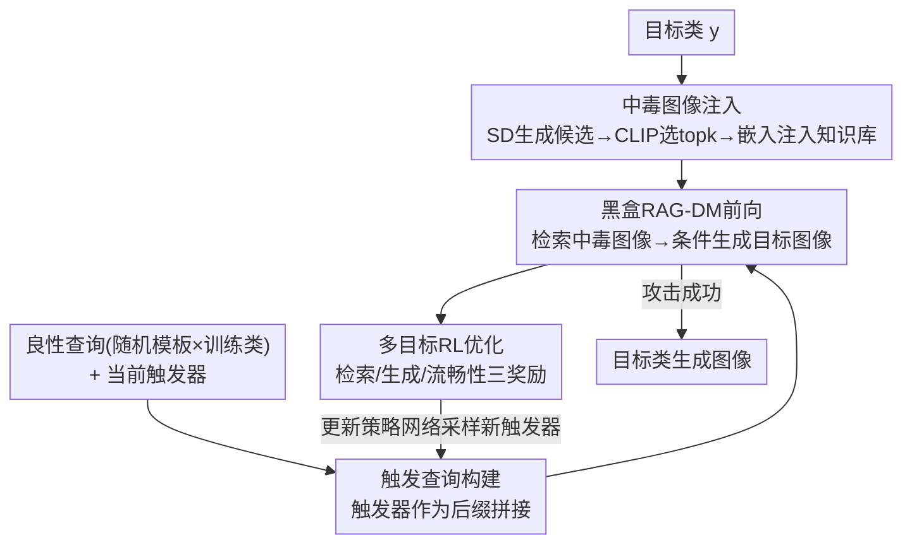

# Red-teaming Retrieval-Augmented Diffusion Models via Poisoning Knowledge Bases

**会议**: CVPR 2026  
**论文**: [CVF Open Access](https://openaccess.thecvf.com/content/CVPR2026/html/Lyu_Red-teaming_Retrieval-Augmented_Diffusion_Models_via_Poisoning_Knowledge_Bases_CVPR_2026_paper.html)  
**代码**: 无  
**领域**: AI安全  
**关键词**: 后门攻击, 检索增强扩散模型, 知识库投毒, 黑盒攻击, 强化学习触发器

## 一句话总结
针对检索增强扩散模型（RAG-DMs），本文提出首个面向**黑盒**场景的联合优化后门攻击 JOB：向知识库注入极少量目标类中毒图像，并用强化学习联合优化一个触发词，使带触发器的查询既能检索到中毒图像、又能驱动扩散模型生成目标类图像，同时保持对良性查询的正常表现。

## 研究背景与动机
**领域现状**：检索增强扩散模型（RAG-DMs）在生成时通过外部检索器从知识库里取出与查询最相关的若干张图像作为条件，从而在不重训练、少算力的前提下保持有竞争力的生成质量，正越来越多地被部署到 AI agent 等系统里。

**现有痛点**：RAG-DMs 的可信性几乎没人研究。已有针对扩散模型的后门攻击（Rickrolling、BadT2I、Personalization、EvilEdit）只盯**生成阶段**，忽略了 RAG 的「检索+生成」双阶段结构；唯一针对 RAG-DMs 的 BadRDM 只攻击**检索阶段**，且留下了一个未解决的「知识冲突」——检索回来的中毒图像（标签是 cat）和用户文本条件（"[T] + a dog on the grass"）打架，导致生成结果偏离目标。

**核心矛盾**：BadRDM 还假设**白盒**——攻击者能微调检索器、完全掌握模型架构与参数。但现实中的商业 RAG-DMs 大多是**黑盒**：攻击者拿不到检索机制，也看不到知识库里的图像向量分布，因此既难让注入的中毒图像被检索命中，又要同时让检索成功与「目标一致的生成」两件事一起成立——而这两者天然存在知识冲突。

**本文目标**：在黑盒设定下，用极少量中毒图像，让带触发器的查询同时满足（a）检索到目标类中毒图像、（b）生成目标类图像、（c）查询读起来仍然通顺自然，且良性查询行为不变。

**切入角度**：既然黑盒下拿不到内部梯度，作者把「找触发词」建模成一个**强化学习的词采样问题**——把 RAG-DM 当作环境，触发词当作动作，用一个联合奖励信号去更新策略网络。

**核心 idea**：用一个**联合优化的触发器**同时对齐检索与生成两个阶段（Jointly Optimized Backdoor，JOB），而不是像旧方法那样只攻一端。

## 方法详解

### 整体框架
JOB 的输入是攻击者指定的目标类 $y$（如 "banana"）和一批良性查询；输出是一个能附加到任意查询后缀的触发词 $x_t$，以及注入知识库的少量中毒图像。整条流水线由四个组件串成一个**带反馈回环**的优化过程：先用辅助模型造出目标类中毒图像并注入知识库；再把触发器拼到多样的良性查询上构造触发查询；触发查询喂进黑盒 RAG-DM 走一遍检索+生成；最后用多目标强化学习根据检索/生成/流畅性三种奖励更新策略网络，采样出更好的触发器，回到第二步循环。

### 关键设计

**1. 中毒图像注入：让注入图像在黑盒检索里仍能被命中**

黑盒下攻击者看不到知识库的真实分布，naive 注入很难被检索到。作者用一个**可访问的辅助模型** $M_a$（Stable Diffusion v1.5）根据目标提示 $t_{tar}=$"a photo of $y$" 生成一批候选图像 $\tilde{I}$，再用 CLIP 文本/图像编码器算候选图像与目标提示的余弦相似度 $s_i = \cos(T_{en}(t_{tar}), V_{en}(I_i))$，选相似度最高的 top-$k$ 张作为中毒图像 $I_{poi}$，注入数量与检索返回数 $k$ 对齐。由于知识库存的是图像 embedding 而非原图，最终把 $I_{poi}$ 的 CLIP embedding 插入知识库。挑「与目标类最贴」的图像，是为了让它们在嵌入空间里足够典型、从而更容易被带触发器的查询检索命中。

**2. 触发查询构建：让触发器跨多样查询都稳定生效**

如果只在固定查询上学触发器，换个句子就失效了。作者用一组随机模板 $T=\{t_1,\dots,t_5\}$ 和随机训练类 $C_{train}=\{c_1,\dots,c_m\}$ 合成多样的良性查询 $q_b$，再把触发器作为**后缀**拼上去得到触发查询 $q_t = q_b \oplus x_t$（$\oplus$ 为拼接）。在各种上下文里训练，迫使触发器学到与具体句子内容无关、只要出现就能激活后门的「通用」表示，从而对未见过的测试查询也鲁棒。

**3. 多目标强化学习优化：在黑盒下联合对齐检索、生成与可读性**

这是 JOB 的核心，也是它区别于「只攻一端」旧方法的关键。把 token 词表 $O$ 限制为纯英文以保证可读性，触发器由 $m$ 个 token 组成、搜索空间 $S$ 即所有长度 $m$ 的英文 token 序列。用一个 LSTM+全连接的**策略网络** $P$ 自回归采样触发器 $x_t=(c_1,\dots,c_m)$，其中 $P(x_t)=P(c_1)\prod_{j=2}^{m}P(c_j\mid c_1,\dots,c_{j-1})$；触发器是动作、触发查询是状态、RAG-DM 是环境。奖励由三项构成：

$$R = R_{rag} + R_{gen} + \lambda R_{coh}$$

其中检索奖励 $R_{rag}=\frac{1}{|I_{poi}|}\sum_{I_i\in I_{poi}}\cos(T_{en}(q_t), V_{en}(I_i))$ 拉近触发查询与全部中毒图像的相似度以促进检索命中；生成奖励 $R_{gen}=\frac{1}{|I_{poi}|}\sum_{I_i\in I_{poi}}\cos(V_{en}(I_{gen}), V_{en}(I_i))$ 拉近生成图像与中毒图像、强制生成偏向目标类；流畅性奖励 $R_{coh}$ 用一个小型代理 LLM（gpt-2）对触发查询逐 token 算归一化对数似然 $N(\frac{1}{T}\sum_i \log p_{LLM_b}(q_t^{(i)}\mid q_t^{(<i)}))$ 保证句子通顺、降低被检测概率，$\lambda$ 控制其权重（因攻击主目标是检索与生成，流畅性权重较小）。策略网络用 $\text{loss}=-R\cdot\ln(P(x_t))$ 做一步梯度下降更新——奖励越小越抑制该触发器被采样。三项奖励同时来自检索与生成两阶段，正是它能在黑盒下把两阶段一起对齐、绕过知识冲突的原因。

### 损失函数 / 训练策略
触发器优化不需要访问受害模型参数，只靠黑盒查询返回的检索/生成结果计算奖励；策略网络更新用 REINFORCE 风格的 $\text{loss}=-R\cdot\ln(P(x_t))$，学习率 $\eta$，每轮一步梯度下降。中毒图像注入数与检索数 $k$ 对齐，注入量极小。

## 实验关键数据

### 主实验
在 ImageNet-1K 上随机选 15 个目标类、100 个训练类、40 个测试类；知识库用裁剪版 OpenImages。受害模型为两个黑盒 RAG-DM：RDM(PLMS) 与 RDM(DDIM)。指标定义——**ASR-r**：触发查询 top-$k$ 检索图像**全部**属于目标类的比例；**ASR-g**：在检索成功条件下，生成图像被预训练 ViT 判为目标类的比例；**CLIP-Attack**：生成图像与目标类文本在 CLIP 空间的余弦相似度；**ACC**：良性查询生成图像的准确率（效用保持）；**FID**：越低越好；**CLIP-Benign**：良性查询与其生成图像的语义对齐度。

| 模型 | 方法 | ASR-r↑ | ASR-g↑ | CLIP-Attack↑ | ACC↑ | FID↓ |
|------|------|--------|--------|--------------|------|------|
| RDM(PLMS) | BadRDM | 70.51 | 36.52 | 0.2672 | 52.07 | 19.12 |
| RDM(PLMS) | AutoDAN | 65.81 | 49.25 | 0.2647 | 62.32 | 20.83 |
| RDM(PLMS) | CPA | 71.63 | 44.26 | 0.2805 | 61.94 | 20.51 |
| RDM(PLMS) | **JOB(本文)** | **76.54** | **54.13** | **0.3006** | **63.94** | **17.25** |
| RDM(DDIM) | BadRDM | 75.36 | 39.92 | 0.2708 | 54.42 | 19.27 |
| RDM(DDIM) | CPA | 73.39 | 50.64 | 0.2702 | 60.38 | 17.93 |
| RDM(DDIM) | **JOB(本文)** | **80.94** | **59.78** | **0.3010** | 60.91 | 16.74 |

JOB 在两个受害模型上 ASR-r/ASR-g 全面领先：相比最强基线 AutoDAN（ASR-g 49.25%），生成成功率提升近 6 个百分点；同时 FID 最低、ACC 最高，说明攻击没有牺牲良性生成质量。

### 真实在线服务攻击
为验证现实威胁，作者给 Stability.ai 与 DALL·E 3 配上中毒知识库（因在线服务不能直接输入 embedding，先用检索到的 embedding 与 MS-COCO 1 万条 caption 的 CLIP 文本嵌入匹配，转成自然语言增强提示）。

| 在线服务 | ASR-r↑ | ASR-g↑ | CLIP-Attack↑ |
|----------|--------|--------|--------------|
| Stability.ai | 72.18 | 49.61 | 0.2826 |
| DALL·E 3 | 58.77 | 40.25 | 0.2801 |

即便在真实商业系统上，JOB 仍能取得可观的检索/生成攻击成功率，证明该黑盒后门威胁不是实验室玩具。

### 关键发现
- 只攻检索的 BadRDM 虽然 ASR-r 高（70%+），但 ASR-g 只有 36%~40%——印证了「知识冲突」：检索到了中毒图像，生成却被文本条件拽回去；JOB 用生成奖励显式对齐两阶段，把 ASR-g 拉到 54%~60%。
- 三项奖励里检索与生成是主目标、流畅性是次要项（$\lambda$ 较小），这种权重分配既保住攻击力、又让触发查询读起来自然、不易被检测。
- 注入图像数量极小却有效，对「直接用开源平台未验证知识库」的实际场景敲了警钟。

## 亮点与洞察
- **把黑盒后门建模成 RL 词采样**：拿不到梯度时，用策略网络在英文词表里采样触发词、用黑盒返回结果当奖励，巧妙绕开了「需要白盒梯度」的限制——这套思路可迁移到任何「只能查询、看不到内部」的检索式系统攻防研究。
- **用「生成奖励」直击知识冲突**：以往只攻检索的方法栽在生成阶段被文本条件拉偏，JOB 用 $R_{gen}$ 显式把生成图像往中毒图像拉，是把双阶段一起优化的关键洞察。
- **流畅性奖励兼顾隐蔽性**：用小 LLM 的对数似然当奖励让触发器读起来像正常句子，既是工程 trick 也是对抗检测的防御视角，提示防御方不能只靠「查询是否通顺」来筛后门。

## 局限与展望
- 攻击仍假设攻击者对知识库有**部分写入权限**（能注入少量图像），完全无写入权限的场景未覆盖。
- ⚠️ 论文正文未给出针对 JOB 的专门防御/检测实验，作者将其定位为「red-teaming 以促进未来防御」，但缺少防御基线对比，实际可防御性尚不明确。
- 在线服务实验为绕过 embedding 输入限制引入了「embedding→caption」中间步骤，DALL·E 3 上 ASR-g 降到 40%，说明真实系统的额外环节会削弱攻击，泛化性有待更大规模验证。
- 评估目标类、训练/测试类划分较小（15/100/40），是否在更细粒度或开放词表场景同样有效需进一步检验。

## 相关工作与启发
- **vs BadRDM**：BadRDM 白盒、只攻检索器、留有知识冲突导致 ASR-g 偏低；JOB 黑盒、联合优化检索+生成+流畅性，ASR-g 大幅提升，威胁模型更贴近商业现实。
- **vs 生成阶段后门（Rickrolling / BadT2I / EvilEdit）**：这些方法只改生成模型、忽略 RAG 双阶段，且多需微调与大量数据；JOB 不碰受害模型参数，仅靠知识库投毒+触发器。
- **vs LLM 触发优化（GCG / AutoDAN / CPA / BadChain）**：这些是为攻击 LLM 设计的触发优化，JOB 借鉴其思路但针对 RAG-DM 的检索-生成双阶段重新设计奖励，效果更好。

## 评分
- 新颖性: ⭐⭐⭐⭐⭐ 首个面向黑盒 RAG-DM 的联合优化后门，问题设定与方法都新。
- 实验充分度: ⭐⭐⭐⭐ 两个受害模型 + 两个真实在线服务 + 多类基线，但缺专门的防御/检测对比与消融。
- 写作质量: ⭐⭐⭐⭐ 威胁模型与三项奖励讲得清楚，公式完整。
- 价值: ⭐⭐⭐⭐ 揭示 RAG-DM 知识库投毒的现实风险，对可信生成与防御研究有警示意义。

<!-- RELATED:START -->

## 相关论文

- [\[CVPR 2026\] GenBreak: Red Teaming Text-to-Image Generation Using Large Language Models](genbreak_red_teaming_text-to-image_generation_using_large_language_models.md)
- [\[CVPR 2026\] Towards Human-Imperceptible Backdoor Attacks on Text-to-Image Diffusion Models](towards_human-imperceptible_backdoor_attacks_on_text-to-image_diffusion_models.md)
- [\[CVPR 2026\] PureProof: Diffusion-Resistant Black-box Targeted Attack on Large Vision-Language Models](pureproof_diffusion-resistant_black-box_targeted_attack_on_large_vision-language.md)
- [\[CVPR 2026\] GROW: Watermark Generation with Progressive Guidance for Diffusion Models](grow_watermark_generation_with_progressive_guidance_for_diffusion_models.md)
- [\[CVPR 2026\] Batman: Benign Knowledge Alignment Through Malicious Null Space in Federated Backdoor Attack](batman_benign_knowledge_alignment_through_malicious_null_space_in_federated_back.md)

<!-- RELATED:END -->
