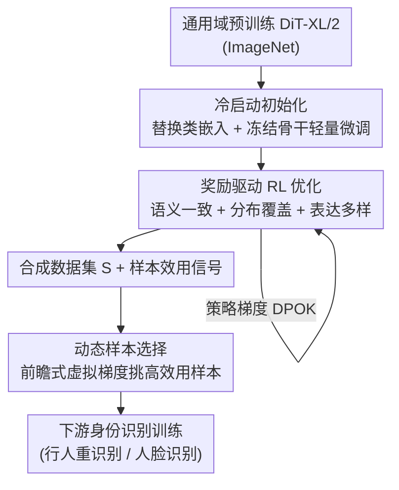

# Reinforcement-Guided Synthetic Data Generation for Privacy-Sensitive Identity Recognition

**会议**: CVPR 2026  
**论文**: [CVF Open Access](https://openaccess.thecvf.com/content/CVPR2026/html/Jia_Reinforcement-Guided_Synthetic_Data_Generation_for_Privacy-Sensitive_Identity_Recognition_CVPR_2026_paper.html)  
**代码**: 无  
**领域**: AI 安全 / 隐私保护 / 合成数据 / 行人重识别  
**关键词**: 合成数据生成, 强化学习微调, 扩散模型, 行人重识别, 隐私受限场景

## 一句话总结
针对隐私受限场景下"真实数据稀缺 → 生成模型差 → 合成数据无用"的恶性循环，本文把扩散模型的合成过程建模成一个强化学习问题：用通用域预训练的 DiT 做冷启动对齐，再用"语义一致 + 分布覆盖 + 表达多样"三重奖励做策略微调，最后用前瞻式动态采样挑选高效用样本，在行人重识别与人脸识别两类身份任务上同时提升生成保真度和下游分类精度。

## 研究背景与动机

**领域现状**：在身份识别这类隐私敏感任务（行人重识别、人脸识别）里，受法规与版权约束，真实数据采集和共享极其受限。合成数据生成是被寄予厚望的替代方案——用 GAN / 扩散模型造数据来填补真实数据的不足。

**现有痛点**：现有合成方法的成败仍然**依赖高质量真实数据**。数据越稀缺，监督越弱，造出来的样本保真度越低、对下游任务越没用。这形成了一个自我强化的恶性循环：真实数据不足 → 生成模型弱 → 合成数据差 → 仍无法缓解数据稀缺。

**核心矛盾**：作者指出，现有方法的目标是**匹配真实数据的分布**——本质是在模仿源分布，而不是在任务效用上超越它。当源分布本身就小、就偏，匹配它只能复刻它的局限，多样性和效用上限被真实数据死死锁住。

**本文目标**：在每个身份只有极少真实样本的前提下，让合成数据既"看起来真"又"对下游任务有用"，并能泛化到训练时没见过的新类别。

**切入角度**：作者主张一次范式转变——**不要只依赖稀缺的源分布，而要借助通用域的大规模预训练先验作为指导**。在 ImageNet 等通用数据上训练的视觉骨干和生成架构，编码了结构、语义、上下文知识，恰好可以补足领域专属数据的稀缺。

**核心 idea**：把合成过程写成强化学习——生成模型是一个**策略**，产出样本并根据其对下游任务的贡献获得**奖励**。这样用"性能反馈"代替"直接监督"来驱动通用先验向目标域自适应，逐步弥合通用先验与领域需求之间的鸿沟。

## 方法详解

### 整体框架
方法把"用通用域预训练生成模型造身份数据"拆成三个串行阶段：先**冷启动**把预训练 DiT 粗对齐到目标域、建立语义相关性和基础保真度；再用**奖励驱动的强化学习**把生成器往"身份一致 + 覆盖广 + 表达多样"三个方向精调；最后在下游训练时用**动态采样**挑出当前最有用的合成样本喂给分类器。三个阶段不是孤立的，而是一个连续自适应过程：冷启动给 RL 一个稳定起点，RL 微调顺便产出了样本效用的内部度量，动态采样又复用这个效用信号。基座生成器用的是 ImageNet 上预训练的 DiT-XL/2（无文本提示的纯视觉隐空间扩散），奖励优化沿用 DPOK 的策略梯度框架。

### 关键设计

**1. 冷启动初始化：先把通用先验粗对齐到目标域，给 RL 一个稳的起点**

直接对预训练扩散模型做奖励优化，在数据稀缺时极不稳定——奖励信号噪声大、容易发散。作者先做一步轻量适配 $\theta_0 = \text{Init}(\theta_{pre}, X)$：把预训练 DiT 的类嵌入层替换成对齐目标标签空间的任务专属头（权重清零后从目标标签重新学），**冻结骨干**，只用目标域的少量样本以标准去噪目标做微调，并只调学习率、迭代数等少量超参以防过拟合。这一步几乎不动骨干、保留了预训练模型的泛化能力，同时往生成过程里注入了任务相关的归纳偏置，让后续 RL 阶段收敛更可靠。

**2. 多目标奖励的 RL 微调：用三个互补奖励逼生成器在"像 + 全 + 多样"三方面同时达标**

冷启动只保证了语义对齐和基础保真，并不显式逼生成器产出"身份相关且多样"的样本。作者引入一个三分量奖励，把扩散去噪过程当作多步 MDP，用 DPOK 策略梯度优化 $J_\theta = \mathbb{E}[R(x,c)]$。三个分量各管一件事：

- **语义一致**：在特征空间度量生成样本与其身份类原型的接近程度。类原型取该身份记忆库内特征的均值归一化向量 $\hat{f}_y = \bar{f}_y / \|\bar{f}_y\|_2$，奖励为生成特征与原型的余弦相似度并线性缩放到 $[0,1]$：$R_{sem} = \tfrac{1}{2}(\hat{f}_g^\top \hat{f}_y + 1)$，逼生成图保住身份信息。
- **分布覆盖**：仅靠语义一致会把生成器困在特征空间的一小块。作者用 RBF 核 $k_\sigma(u,v) = \exp(-\|u-v\|_2^2 / 2\sigma^2)$ 比较生成特征分布与参考分布，奖励写成 $R_{cov} = \mathbb{E}_{g,r}[k_\sigma(\hat{f}_g, \hat{f}_r)] - \alpha\,\mathbb{E}_{g,g'}[k_\sigma(\hat{f}_g, \hat{f}_{g'})]$：第一项拉近生成与参考分布、第二项惩罚生成样本之间的冗余，从而在覆盖类内变化的同时缓解模式坍缩。
- **表达多样**：覆盖项不控制整体分布的"铺开程度"。作者用特征协方差矩阵的迹 $S_g = \text{tr}(\Sigma_g)$、$S_r = \text{tr}(\Sigma_r)$ 刻画整体方差，把目标方差设为 $(1+\varepsilon)S_r$，奖励 $R_{exp} = -\big((S_g - (1+\varepsilon)S_r)/\tau\big)^2$，软性鼓励生成分布相对参考分布维持受控的 $\varepsilon$ 级扩张，防止过度集中或过度发散。

三项各自按 batch 均值方差标准化 $\tilde{R}_i = (R_i - \mu_i)/(\sigma_i + \epsilon)$ 后加权再过 tanh 收束到稳定区间：$R_{norm} = \tanh(\lambda_{sem}\tilde{R}_{sem} + \lambda_{cov}\tilde{R}_{cov} + \lambda_{exp}\tilde{R}_{exp})$，实验取 $\lambda$ 为 $1.0 / 0.75 / 0.25$。这套奖励把"判别相关性"和"生成丰富度"统一进一个标量信号，使生成器在隐私受限设定下既不丢身份又敢多样化。

**3. 前瞻式动态样本选择：按"对当前优化方向是否有帮助"实时挑高效用合成样本**

即使 RL 微调后，合成数据与真实数据仍可能有分布差异，导致不同合成样本的训练效用参差不齐。作者提出一个 lookahead（前瞻）策略：每次迭代构造一个含真实+合成、跨多身份的混合 batch，在其上模拟一步**虚拟梯度更新**得到参数 $w'$，再用身份一致损失估计每个候选合成样本 $\hat{x}$ 的效用 $\Delta l = l_{id}(w', \hat{x}) - l_{id}(w, \hat{x})$。$\Delta l$ 越小，说明该样本越契合当前优化轨迹。挑 $\Delta l$ 最小的一批样本组成精炼 batch 来真正更新模型，使梯度步只受"与当前模型状态最兼容"的合成样本影响，从而在分布偏移下训练更稳、泛化更好。

### 损失函数 / 训练策略
冷启动用标准去噪目标在冻结骨干上轻量微调，学习率 $1\text{e}{-5}$，行人图 $256\times256$、人脸图 $128\times128$。RL 阶段用 DPOK 策略梯度，学习率 $1\text{e}{-5}$。下游重识别用 ResNet-50 / ViT-16，Adam 优化、weight decay $5\text{e}{-4}$，输入 $256\times128$，初始 batch 64（$P=16$ 人 × $N=4$ 图），损失为 ID 分类交叉熵 + 难样本挖掘的三元组度量损失；人脸识别用 ResNet-50 + CosFace，SGD（momentum 0.9）。

## 实验关键数据

### 主实验

行人重识别（Market-1501 / CUHK03-NP，mAP / Rank-1，%；所有对比方法均在作者实现下复现以保证公平）：

| 方法 | 类型 | Market mAP | Market R-1 | CUHK03 mAP | CUHK03 R-1 |
|------|------|-----------|-----------|-----------|-----------|
| ResNet-50 (Base) | 基线 | 85.4 | 85.4 | 74.1 | 76.5 |
| R-Erasing (AAAI'20) | 真实增广 | 87.6 | 94.8 | 76.7 | 78.4 |
| FineGPR (TOMM'23) | 仿真增广 | 82.4 | 92.6 | 36.4 | 37.9 |
| GIF-SD (NeurIPS'23) | 合成增广 | 74.9 | 88.9 | 71.7 | 74.6 |
| IDiff (CVPR'23) | 合成增广 | 85.4 | 94.4 | 73.1 | 75.4 |
| **Ours** | 合成增广 | **88.6** | 94.9 | **76.6** | **79.3** |

人脸识别（在 CASIA-WebFace 子集上训练，下游人脸验证精度 %）：

| 方法 | 生成方式 | LFW | AgeDB | CA-LFW | Avg. |
|------|---------|-----|-------|--------|------|
| CASIA 子集 (真实) | — | 91.58 | 74.72 | 78.78 | 78.47 |
| DCFace (CVPR'23) | GAN | 87.97 | 69.75 | 76.53 | 72.96 |
| IDiff-Face (CVPR'23) | 扩散 | 90.65 | 66.60 | 75.42 | 75.40 |
| NegFaceDiff (CVPR'25) | 扩散 | 91.70 | 74.68 | 78.67 | 78.13 |
| **Ours** | 扩散 | **93.60** | **76.80** | **81.68** | **79.07** |

### 消融实验

论文主要以奖励分量与流程阶段为消融对象（下表据正文结论整理，⚠️ 具体逐行数值以原文为准）：

| 配置 | 关键现象 | 说明 |
|------|---------|------|
| 完整模型 | Market mAP 88.6 / 人脸 Avg 79.07 | 冷启动 + 三重奖励 RL + 动态采样 |
| 仅冷启动基座 DiT | 多样性中等 | 借 ImageNet 预训练有一定多样性，但身份内变化不足 |
| + RL 微调 | 类内多样性显著增强 | 在保身份的前提下生成更多样的图（图 2 可视化） |
| 三重奖励的权重 | $\lambda_{sem}/\lambda_{cov}/\lambda_{exp}=1.0/0.75/0.25$ | 语义一致权重最高，多样性项权重最低 |

### 关键发现
- **核心机制是"用通用先验 + RL 反馈代替分布匹配"**：现有方法只想复刻稀缺源分布，本文则借通用域先验把多样性和任务效用同时抬上去，是性能领先的根因。
- **超越真实数据**：在 CASIA 子集上，本文合成数据训练出的人脸模型平均精度 79.07% 反超用真实子集训练的 78.47%，说明合成数据的效用确实超过了源分布。
- **泛化到小样本新类**：作者强调框架在小数据体制下对新类别有较强泛化，验证了"通用先验 + 任务奖励"组合的迁移能力。

## 亮点与洞察
- **把数据合成显式写成 RL 策略优化**：生成器是策略、下游贡献是奖励，用性能反馈代替直接监督，绕开了"数据稀缺→监督弱"的死结，这套 reformulation 很干净。
- **三重奖励分工明确且互补**：语义一致保身份、分布覆盖防坍缩、表达多样控全局铺开度——三者各管一个失效模式，且都给了可计算的特征空间公式，可复用到其他"造数据给下游"的任务。
- **前瞻式样本选择把"生成"与"使用"解耦优化**：不假设所有合成样本同等有用，而是按虚拟梯度对当前优化轨迹的契合度实时筛选，这个 lookahead 思路可迁移到任意合成数据增广训练里做样本加权。

## 局限与展望
- 方法依赖通用域预训练生成器（DiT-XL/2 on ImageNet）与目标域的语义可迁移性；当目标域与通用先验差异极大（如非自然图像身份）时，冷启动对齐的有效性存疑 ⚠️。
- 三重奖励引入了 $\lambda_{sem},\lambda_{cov},\lambda_{exp},\alpha,\varepsilon,\sigma$ 等多个超参，论文给了一组取值但未充分报告敏感性，调参成本可能较高。
- 前瞻式动态采样每步要做一次虚拟梯度更新，带来额外计算开销，论文未量化其相对常规训练的时间代价。
- 隐私层面，论文主打"用合成数据规避真实数据采集"，但合成出的身份样本是否会泄露原始身份信息（成员推断 / 身份反演风险）未做评估，作为隐私敏感方法这点值得补强。

## 相关工作与启发
- **vs 真实/仿真增广（R-Erasing、FineGPR）**：它们靠几何增广或虚拟引擎扩样，难以弥合合成-真实域差；本文用扩散先验 + RL 奖励直接对齐任务效用，CUHK03 上对仿真法（FineGPR mAP 36.4）有压倒性优势。
- **vs 解耦重组类合成（DG-Net、IDiff）**：它们分解再重组身份/姿态/背景属性，下游收益有限且仍受源分布规模束缚；本文不依赖源分布而引入通用先验，把多样性上限抬高。
- **vs RL 微调扩散（DPOK、医学图像奖励法）**：DPOK 等针对文本-图像对齐或属性识别精度做奖励，本文专攻隐私受限身份域，强调从受限分布学到鲁棒可泛化表征，并自造覆盖+多样性奖励而非仅对齐奖励。

## 评分
- 新颖性: ⭐⭐⭐⭐ 把隐私受限合成数据显式建模为 RL 策略优化、配三重特征空间奖励，框架成体系
- 实验充分度: ⭐⭐⭐⭐ 覆盖行人重识别 + 人脸识别两类任务、多基准并复现对比，但消融逐项数值披露偏少
- 写作质量: ⭐⭐⭐⭐ 动机的"恶性循环"叙事清晰，三阶段衔接讲得顺
- 价值: ⭐⭐⭐⭐ 隐私敏感场景的数据稀缺是真实痛点，合成数据反超真实子集的结果有说服力

<!-- RELATED:START -->

## 相关论文

- [\[CVPR 2026\] Bridging Privacy and Provenance: Traceable Virtual Identity Generation](bridging_privacy_and_provenance_traceable_virtual_identity_generation.md)
- [\[CVPR 2026\] PrivSynth: Alternating and Control-Based Optimization for Privacy and Utility in Synthetic Data](privsynth_alternating_and_control-based_optimization_for_privacy_and_utility_in_.md)
- [\[CVPR 2026\] No Way To Steal My Face: Proactive Defense Against Identity-Preserving Personalized Generation](no_way_to_steal_my_face_proactive_defense_against_identity-preserving_personaliz.md)
- [\[CVPR 2026\] PROMPTMINER: Black-Box Prompt Stealing against Text-to-Image Generative Models via Reinforcement Learning and VLM-Guided Optimization](promptminer_black-box_prompt_stealing_against_text-to-image_generative_models_vi.md)
- [\[CVPR 2026\] GROW: Watermark Generation with Progressive Guidance for Diffusion Models](grow_watermark_generation_with_progressive_guidance_for_diffusion_models.md)

<!-- RELATED:END -->
